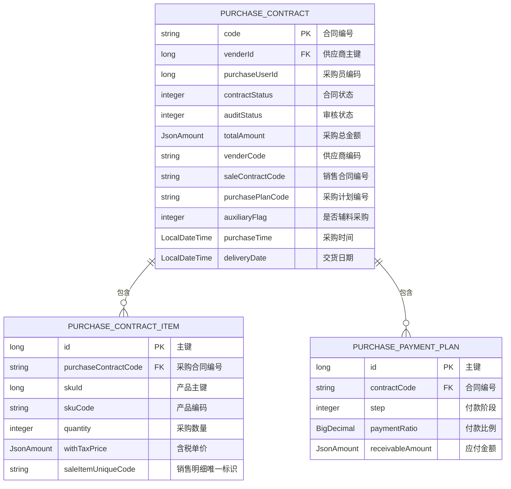
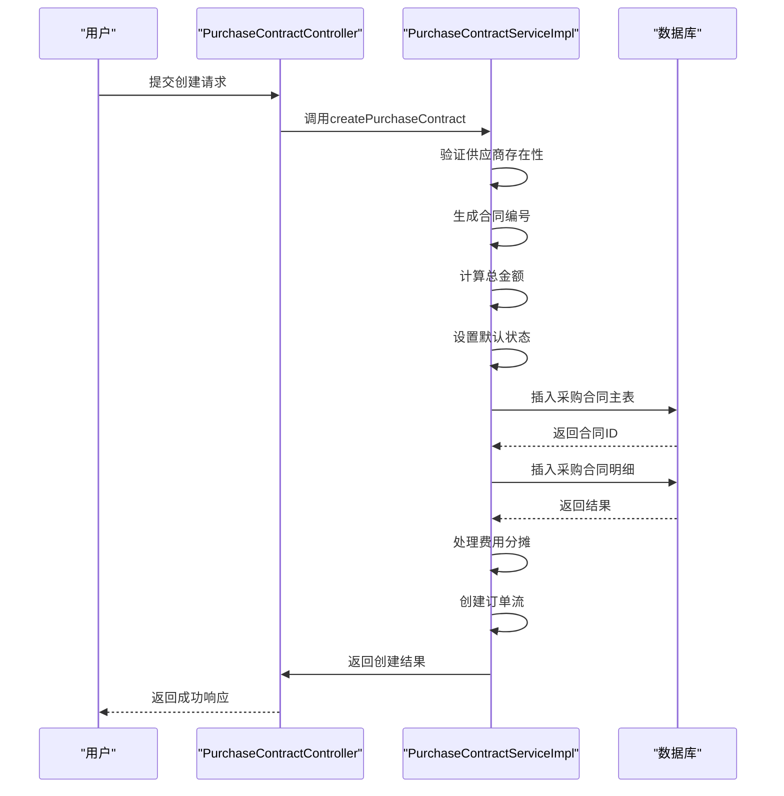
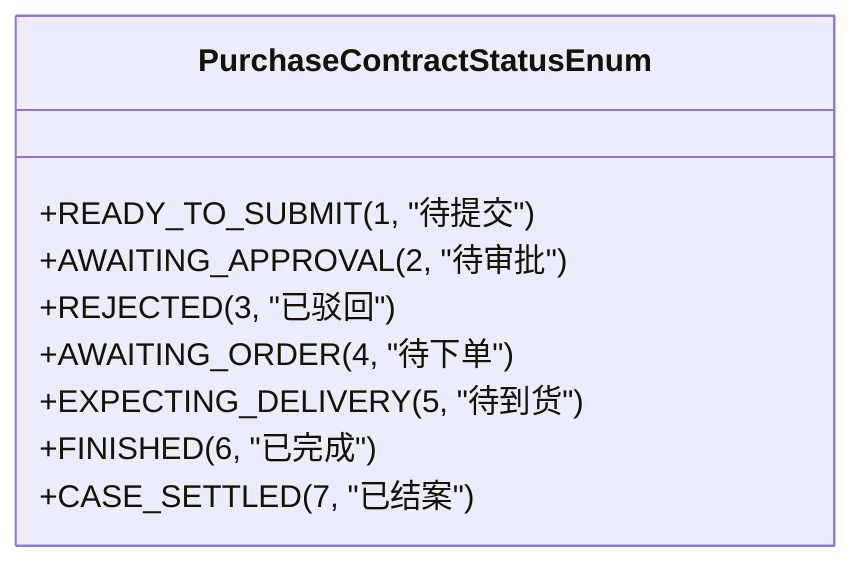
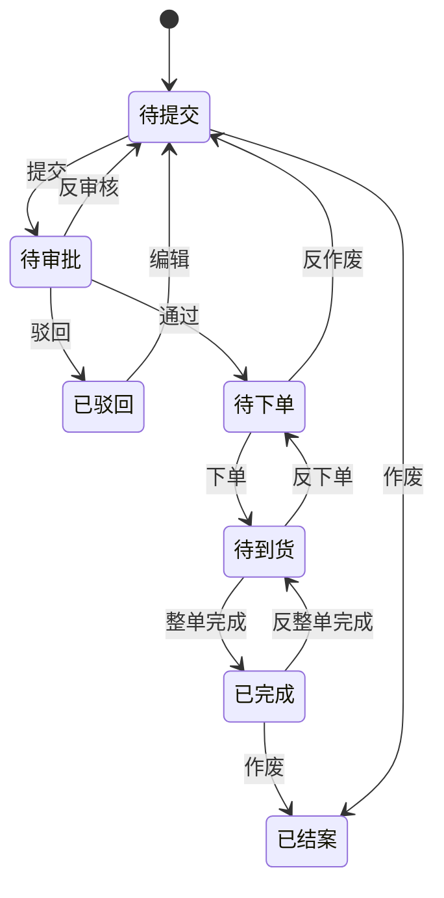
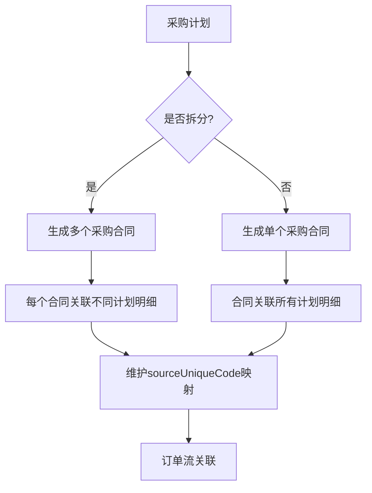
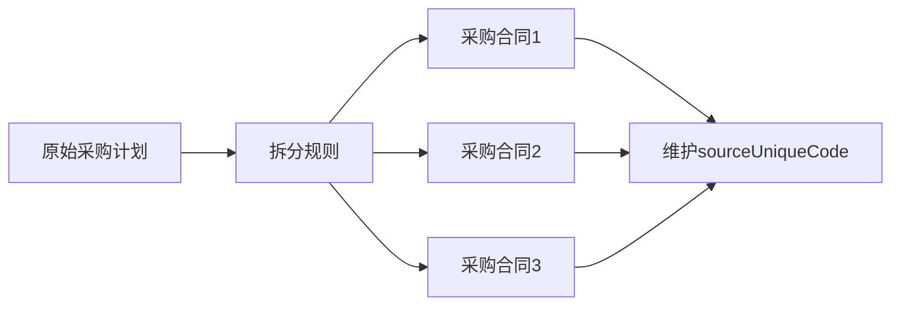
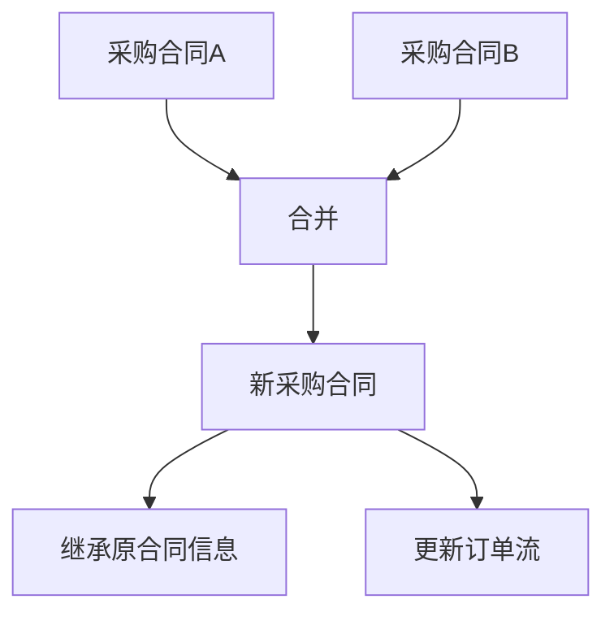
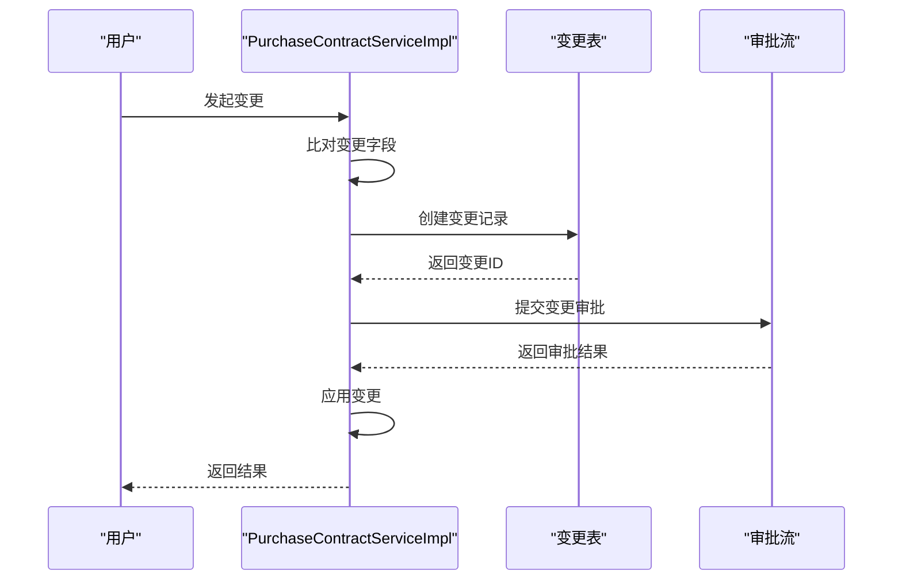
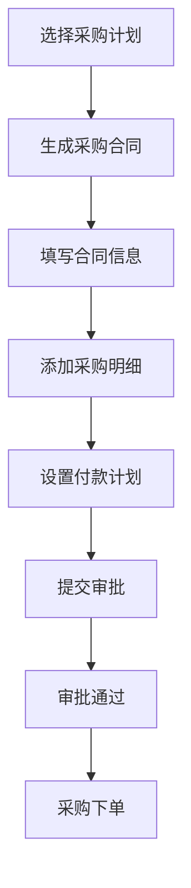
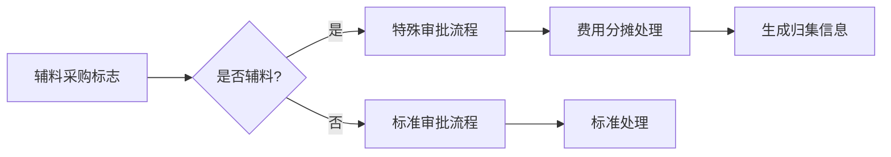

# 采购合同管理

<cite>
**本文档引用文件**  
- [PurchaseContractApi.java](file://eplus-module-scm/eplus-module-scm-api/src/main/java/com/syj/eplus/module/scm/api/purchasecontract/PurchaseContractApi.java)
- [SavePurchaseContractReqVO.java](file://eplus-module-scm/eplus-module-scm-api/src/main/java/com/syj/eplus/module/scm/api/purchasecontract/dto/SavePurchaseContractReqVO.java)
- [PurchaseContractAllDTO.java](file://eplus-module-scm/eplus-module-scm-api/src/main/java/com/syj/eplus/module/scm/api/purchasecontract/dto/PurchaseContractAllDTO.java)
- [PurchaseContractStatusEnum.java](file://eplus-framework/eplus-common/src/main/java/com/syj/eplus/framework/common/enums/PurchaseContractStatusEnum.java)
- [PurchaseContractServiceImpl.java](file://eplus-module-scm/eplus-module-scm-biz/src/main/java/com/syj/eplus/module/scm/service/purchasecontract/PurchaseContractServiceImpl.java)
- [PurchaseContractController.java](file://eplus-module-scm/eplus-module-scm-biz/src/main/java/com/syj/eplus/module/scm/controller/admin/purchasecontract/PurchaseContractController.java)
</cite>

## 目录
1. [引言](#引言)
2. [采购合同数据模型](#采购合同数据模型)
3. [采购合同全生命周期管理](#采购合同全生命周期管理)
4. [采购合同状态机](#采购合同状态机)
5. [采购合同与采购计划关联机制](#采购合同与采购计划关联机制)
6. [高级功能](#高级功能)
7. [业务场景示例](#业务场景示例)

## 引言
采购合同管理是供应链管理中的核心环节，负责管理从合同创建到关闭的全生命周期。本文档详细说明了采购合同的创建、编辑、审批、执行和关闭等流程，以及合同基本信息的录入规则和校验逻辑。

## 采购合同数据模型

### 核心字段说明
采购合同数据模型包含以下关键字段：

**图源**
- [SavePurchaseContractReqVO.java](file://eplus-module-scm/eplus-module-scm-api/src/main/java/com/syj/eplus/module/scm/api/purchasecontract/dto/SavePurchaseContractReqVO.java)
- [PurchaseContractAllDTO.java](file://eplus-module-scm/eplus-module-scm-api/src/main/java/com/syj/eplus/module/scm/api/purchasecontract/dto/PurchaseContractAllDTO.java)

### 关键字段详细说明
| 字段名称 | 字段说明 | 数据类型 | 约束条件 |
|--------|--------|--------|--------|
| **合同编号** | 采购合同的唯一标识符，由系统自动生成 | string | 必填，唯一 |
| **供应商** | 采购合同的供应商信息 | long/string | 必填，关联供应商主键和编码 |
| **合同金额** | 采购合同的总金额，包含币种信息 | JsonAmount | 必填，包含金额和币种 |
| **币种** | 采购合同使用的货币类型 | string | 必填，与供应商默认币种一致 |
| **税率** | 采购合同适用的税率 | integer | 必填，从供应商税务信息获取 |
| **采购员** | 负责该采购合同的采购人员 | long/string | 必填，关联采购员编码和名称 |
| **跟单员** | 负责跟进该采购合同执行的人员 | UserDept | 可选，包含用户ID和部门信息 |
| **交货日期** | 合同约定的货物交付日期 | LocalDateTime | 必填，不能早于当前日期 |
| **付款状态** | 合同的付款进度状态 | integer | 必填，枚举值 |
| **开票状态** | 合同的开票进度状态 | integer | 必填，枚举值 |

**节源**
- [SavePurchaseContractReqVO.java](file://eplus-module-scm/eplus-module-scm-api/src/main/java/com/syj/eplus/module/scm/api/purchasecontract/dto/SavePurchaseContractReqVO.java)

## 采购合同全生命周期管理

### 创建流程
采购合同的创建流程如下：

**图源**
- [PurchaseContractServiceImpl.java](file://eplus-module-scm/eplus-module-scm-biz/src/main/java/com/syj/eplus/module/scm/service/purchasecontract/PurchaseContractServiceImpl.java)
- [PurchaseContractController.java](file://eplus-module-scm/eplus-module-scm-biz/src/main/java/com/syj/eplus/module/scm/controller/admin/purchasecontract/PurchaseContractController.java)

### 编辑流程
采购合同的编辑流程遵循以下规则：
1. 只有在"待提交"或"已驳回"状态下才能进行编辑
2. 编辑时需要重新计算总金额和总数量
3. 修改明细时会记录操作日志
4. 支持批量修改付款计划

### 审批流程
采购合同的审批流程通过工作流引擎实现，主要步骤包括：
1. 提交审批：将合同状态变更为"审批中"
2. 审批通过：将合同状态变更为"待下单"
3. 审批驳回：将合同状态变更为"已驳回"

### 执行流程
采购合同的执行流程包括：
1. 下单：将合同状态变更为"待到货"
2. 生产完成：更新合同明细的入库状态
3. 整单完成：将合同状态变更为"已完成"

### 关闭流程
采购合同的关闭流程包括：
1. 作废：将合同状态变更为"已结案"
2. 反作废：将合同状态恢复为"待提交"

## 采购合同状态机

### 状态定义
采购合同的状态由`PurchaseContractStatusEnum`枚举定义：

**图源**
- [PurchaseContractStatusEnum.java](file://eplus-framework/eplus-common/src/main/java/com/syj/eplus/framework/common/enums/PurchaseContractStatusEnum.java)

### 状态转换图
采购合同的状态转换关系如下：

**图源**
- [PurchaseContractServiceImpl.java](file://eplus-module-scm/eplus-module-scm-biz/src/main/java/com/syj/eplus/module/scm/service/purchasecontract/PurchaseContractServiceImpl.java)

### 状态转换条件
| 当前状态 | 目标状态 | 触发条件 | 业务规则 |
|--------|--------|--------|--------|
| **待提交** | **待审批** | 提交审批 | 验证必填字段完整性 |
| **待审批** | **已驳回** | 审批驳回 | 记录驳回原因 |
| **待审批** | **待下单** | 审批通过 | 回写销售合同采购价格 |
| **待下单** | **待到货** | 采购下单 | 生成在制库存 |
| **待到货** | **已完成** | 整单完成 | 验证所有明细已入库 |
| **已完成** | **已结案** | 作废 | 验证无对公支付 |
| **已驳回** | **待提交** | 编辑 | 允许修改合同内容 |

**节源**
- [PurchaseContractServiceImpl.java](file://eplus-module-scm/eplus-module-scm-biz/src/main/java/com/syj/eplus/module/scm/service/purchasecontract/PurchaseContractServiceImpl.java)

## 采购合同与采购计划关联机制

### 关联关系
采购合同与采购计划的关联通过以下字段实现：
- `purchasePlanId`: 采购计划主键
- `purchasePlanCode`: 采购计划编号
- `sourceUniqueCode`: 源唯一标识，用于关联采购计划明细

### 关联流程
采购合同与采购计划的关联流程如下：

**图源**
- [PurchaseContractServiceImpl.java](file://eplus-module-scm/eplus-module-scm-biz/src/main/java/com/syj/eplus/module/scm/service/purchasecontract/PurchaseContractServiceImpl.java)

### 数据同步
采购合同与采购计划之间的数据同步规则：
1. 采购合同创建时，同步采购计划的供应商、采购员等基本信息
2. 采购合同审批通过后，回写采购计划的转换状态
3. 采购合同作废时，恢复采购计划的待采购状态

## 高级功能

### 合同拆分
合同拆分功能允许将一个采购计划拆分为多个采购合同：

### 合同合并
合同合并功能允许将多个采购合同合并为一个：

### 变更管理
采购合同的变更管理流程：

**节源**
- [PurchaseContractServiceImpl.java](file://eplus-module-scm/eplus-module-scm-biz/src/main/java/com/syj/eplus/module/scm/service/purchasecontract/PurchaseContractServiceImpl.java)

## 业务场景示例

### 标准采购合同创建

### 辅料采购合同处理
辅料采购合同的特殊处理流程：

**节源**
- [PurchaseContractServiceImpl.java](file://eplus-module-scm/eplus-module-scm-biz/src/main/java/com/syj/eplus/module/scm/service/purchasecontract/PurchaseContractServiceImpl.java)