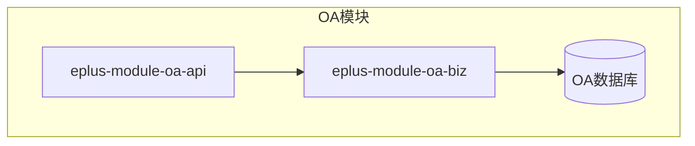
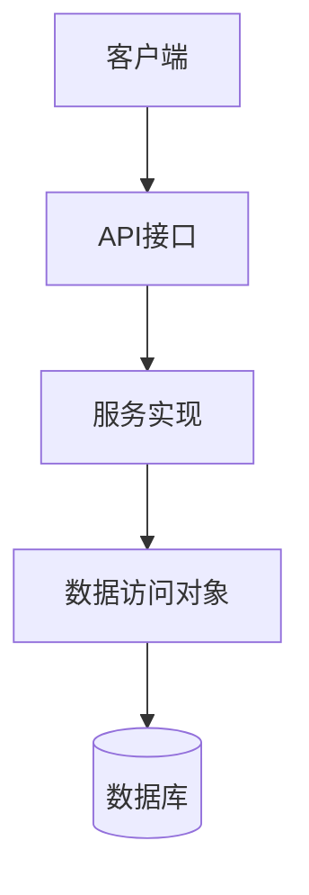
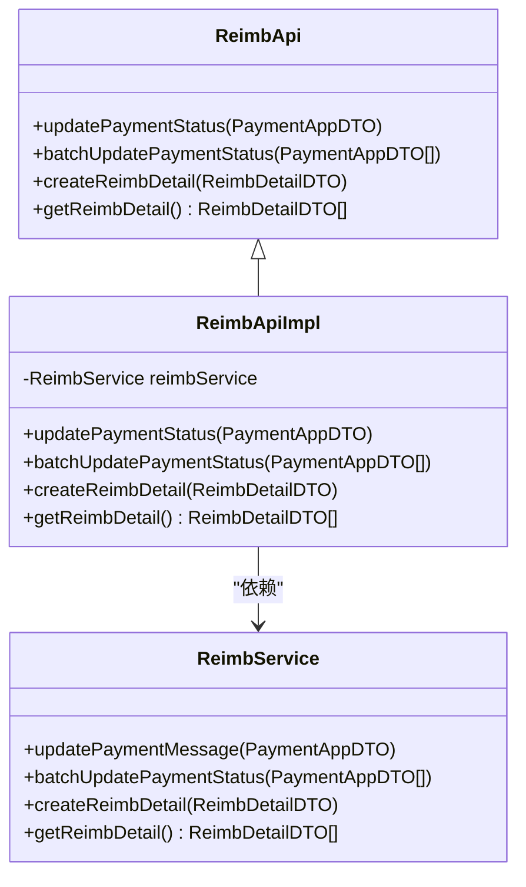
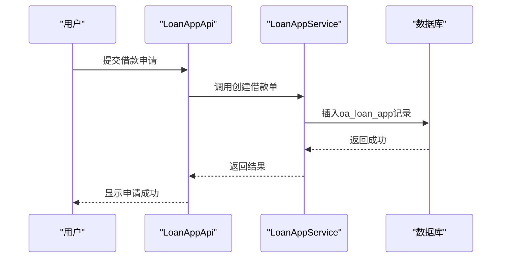
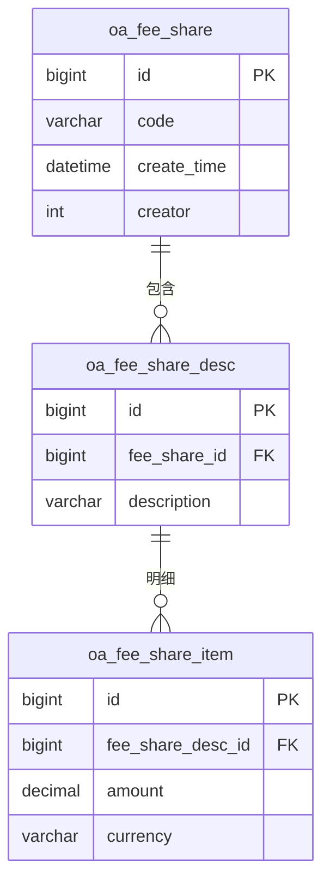
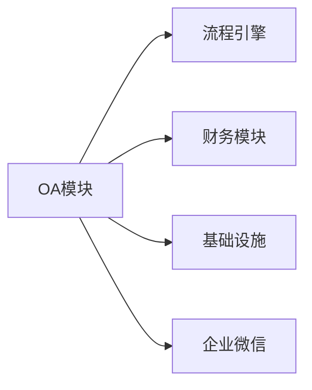

# 办公自动化

<cite>
**本文档引用的文件**  
- [ReimbApi.java](file://eplus-module-oa/eplus-module-oa-api/src/main/java/com/syj/eplus/module/oa/api/ReimbApi.java)
- [LoanAppApi.java](file://eplus-module-oa/eplus-module-oa-api/src/main/java/com/syj/eplus/module/oa/api/LoanAppApi.java)
- [PaymentAppApi.java](file://eplus-module-oa/eplus-module-oa-api/src/main/java/com/syj/eplus/module/oa/api/PaymentAppApi.java)
- [RepayAppApi.java](file://eplus-module-oa/eplus-module-oa-api/src/main/java/com/syj/eplus/module/oa/api/RepayAppApi.java)
- [TravelAppApi.java](file://eplus-module-oa/eplus-module-oa-api/src/main/java/com/syj/eplus/module/oa/api/TravelAppApi.java)
- [ReimbApiImpl.java](file://eplus-module-oa/eplus-module-oa-biz/src/main/java/com/syj/eplus/module/oa/api/ReimbApiImpl.java)
- [LoanAppApiImpl.java](file://eplus-module-oa/eplus-module-oa-biz/src/main/java/com/syj/eplus/module/oa/api/LoanAppApiImpl.java)
- [JsonReimbDetail.java](file://eplus-module-oa/eplus-module-oa-biz/src/main/java/com/syj/eplus/module/oa/entity/JsonReimbDetail.java)
- [JsonLoanapp.java](file://eplus-module-oa/eplus-module-oa-biz/src/main/java/com/syj/eplus/module/oa/entity/JsonLoanapp.java)
- [oa.sql](file://sql/mysql/oa.sql)
- [V1_0_0_002__Eplus初始化.sql](file://eplus-flyway/src/main/resources/db/migration/common/V1_0_0_002__Eplus初始化.sql)
</cite>

## 目录
1. [引言](#引言)
2. [项目结构](#项目结构)
3. [核心组件](#核心组件)
4. [架构概述](#架构概述)
5. [详细组件分析](#详细组件分析)
6. [依赖分析](#依赖分析)
7. [性能考虑](#性能考虑)
8. [故障排除指南](#故障排除指南)
9. [结论](#结论)

## 引言
本文档全面介绍办公自动化（OA）模块的核心功能，涵盖费用报销、借款申请、付款申请等关键业务流程。详细说明差旅费报销、招待费申请等场景的创建与审批流程，解释费用归集与分摊机制，描述借款与还款的完整生命周期管理，并阐述OA模块与其他财务模块的集成点，如报销与付款的关联。同时提供OA审批流程图，展示典型申请场景的完整流程，并包含OA表单自定义和审批流配置功能说明。

## 项目结构
办公自动化模块主要由两个子模块构成：`eplus-module-oa-api` 和 `eplus-module-oa-biz`。前者定义了对外暴露的API接口，后者实现了具体的业务逻辑。此外，数据库结构通过Flyway脚本进行版本控制，确保数据模型的一致性。

**图表来源**
- [eplus-module-oa-api](file://eplus-module-oa/eplus-module-oa-api)
- [eplus-module-oa-biz](file://eplus-module-oa/eplus-module-oa-biz)
- [V1_0_0_002__Eplus初始化.sql](file://eplus-flyway/src/main/resources/db/migration/common/V1_0_0_002__Eplus初始化.sql)

**章节来源**
- [eplus-module-oa](file://eplus-module-oa)

## 核心组件
OA模块的核心功能包括费用报销、借款申请、还款申请、付款申请及差旅申请。这些功能通过清晰的API接口暴露给其他系统模块，支持跨模块调用与集成。

**章节来源**
- [ReimbApi.java](file://eplus-module-oa/eplus-module-oa-api/src/main/java/com/syj/eplus/module/oa/api/ReimbApi.java#L1-L37)
- [LoanAppApi.java](file://eplus-module-oa/eplus-module-oa-api/src/main/java/com/syj/eplus/module/oa/api/LoanAppApi.java#L1-L56)
- [PaymentAppApi.java](file://eplus-module-oa/eplus-module-oa-api/src/main/java/com/syj/eplus/module/oa/api/PaymentAppApi.java#L1-L55)

## 架构概述
OA模块采用典型的分层架构，分为API层、服务层和数据访问层。API层负责定义接口契约，服务层实现核心业务逻辑，数据访问层处理与数据库的交互。

**图表来源**
- [ReimbApiImpl.java](file://eplus-module-oa/eplus-module-oa-biz/src/main/java/com/syj/eplus/module/oa/api/ReimbApiImpl.java#L1-L42)
- [LoanAppApiImpl.java](file://eplus-module-oa/eplus-module-oa-biz/src/main/java/com/syj/eplus/module/oa/api/LoanAppApiImpl.java#L1-L58)

## 详细组件分析

### 费用报销组件分析
费用报销功能支持多种类型的费用申请，包括差旅费、招待费等。用户可上传发票、填写费用明细，并提交审批流程。系统支持多币种处理、费用分摊与归集。

#### 费用报销类图

**图表来源**
- [ReimbApi.java](file://eplus-module-oa/eplus-module-oa-api/src/main/java/com/syj/eplus/module/oa/api/ReimbApi.java#L1-L37)
- [ReimbApiImpl.java](file://eplus-module-oa/eplus-module-oa-biz/src/main/java/com/syj/eplus/module/oa/api/ReimbApiImpl.java#L1-L42)

### 借款与还款组件分析
借款申请支持员工预支款项，系统记录借款金额、支付状态及还款信息。还款申请则用于冲销借款余额，支持部分或全额还款。

#### 借款与还款序列图

**图表来源**
- [LoanAppApi.java](file://eplus-module-oa/eplus-module-oa-api/src/main/java/com/syj/eplus/module/oa/api/LoanAppApi.java#L1-L56)
- [LoanAppApiImpl.java](file://eplus-module-oa/eplus-module-oa-biz/src/main/java/com/syj/eplus/module/oa/api/LoanAppApiImpl.java#L1-L58)

### 费用归集与分摊机制
系统通过`oa_fee_share`、`oa_fee_share_desc`和`oa_fee_share_item`表实现费用的归集与分摊。每笔费用可按比例分配至多个成本中心或项目。

**图表来源**
- [V1_0_0_087__费用归属表名修改.sql](file://eplus-flyway/src/main/resources/db/migration/common/V1_0_0_087__费用归属表名修改.sql)

## 依赖分析
OA模块依赖于基础设施模块（如数据权限、流程引擎）和财务模块（如付款、核算）。通过API接口与外部系统解耦，确保模块间的低耦合与高内聚。

**图表来源**
- [eplus-module-oa](file://eplus-module-oa)
- [yudao-module-bpm](file://yudao-module-bpm)
- [eplus-module-fms](file://eplus-module-fms)

**章节来源**
- [eplus-module-oa](file://eplus-module-oa)
- [yudao-module-bpm](file://yudao-module-bpm)
- [eplus-module-fms](file://eplus-module-fms)

## 性能考虑
为提升性能，系统采用缓存机制存储常用数据（如科目、员工信息），并通过批量接口减少数据库交互次数。审批流程使用异步处理，避免阻塞主线程。

## 故障排除指南
常见问题包括审批流卡顿、支付状态不同步等。建议检查流程定义、数据库事务日志及消息队列状态。对于数据不一致问题，可通过对账工具进行修复。

**章节来源**
- [ReimbApiImpl.java](file://eplus-module-oa/eplus-module-oa-biz/src/main/java/com/syj/eplus/module/oa/api/ReimbApiImpl.java#L23-L30)
- [LoanAppApiImpl.java](file://eplus-module-oa/eplus-module-oa-biz/src/main/java/com/syj/eplus/module/oa/api/LoanAppApiImpl.java#L44-L50)

## 结论
办公自动化模块提供了完整的费用管理解决方案，涵盖从申请、审批到支付、核销的全生命周期。通过灵活的表单配置与审批流引擎，支持企业多样化的管理需求。未来可进一步集成AI审核、智能报销推荐等功能，提升自动化水平。