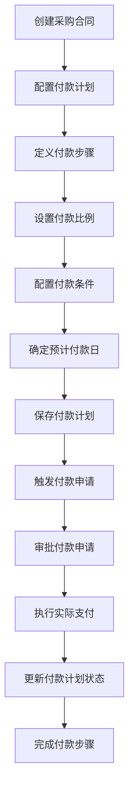
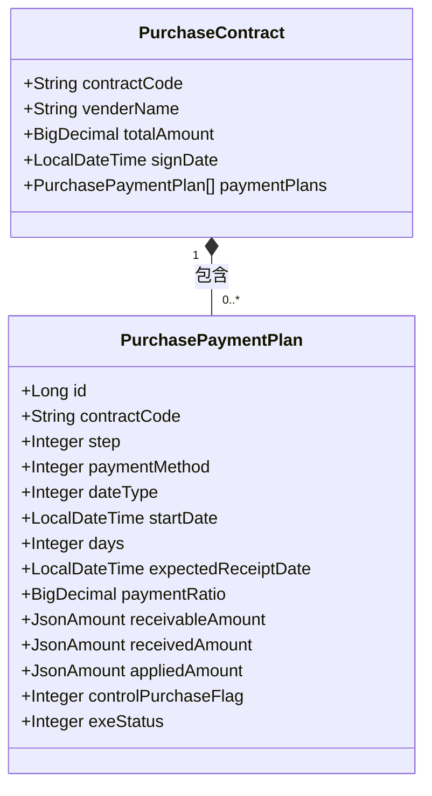
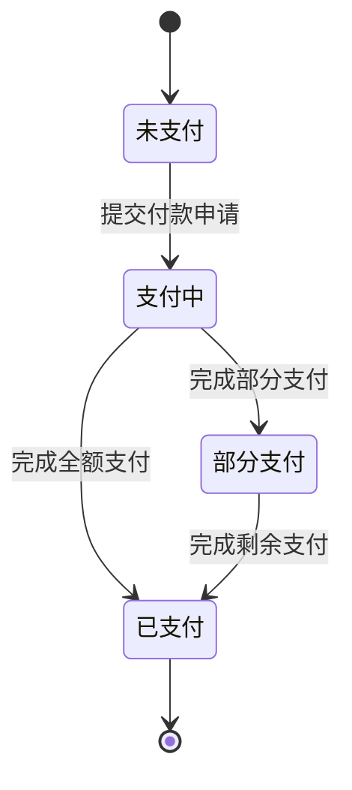
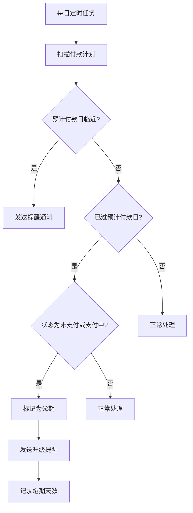

# 付款计划

<cite>
**本文档引用文件**  
- [PurchasePaymentPlan.java](file://eplus-module-scm/eplus-module-scm-biz/src/main/java/com/syj/eplus/module/scm/dal/dataobject/paymentplan/PurchasePaymentPlan.java)
- [PurchasePaymentPlanDTO.java](file://eplus-module-scm/eplus-module-scm-api/src/main/java/com/syj/eplus/module/scm/api/purchasecontract/dto/PurchasePaymentPlanDTO.java)
- [UpdatePaymentPlanReq.java](file://eplus-module-scm/eplus-module-scm-biz/src/main/java/com/syj/eplus/module/scm/controller/admin/purchasecontract/vo/UpdatePaymentPlanReq.java)
- [PaymentPlanExeStatusEnum.java](file://eplus-framework/eplus-common/src/main/java/com/syj/eplus/framework/common/enums/PaymentPlanExeStatusEnum.java)
- [scm_payment_plan.sql](file://eplus-flyway/src/main/resources/db/migration/common/V1_0_0_073__付款相关表.sql)
- [PaymentApplyServiceImpl.java](file://eplus-module-scm/eplus-module-scm-biz/src/main/java/com/syj/eplus/module/scm/service/paymentapply/PaymentApplyServiceImpl.java)
- [PurchasePaymentPlanMapper.java](file://eplus-module-scm/eplus-module-scm-biz/src/main/java/com/syj/eplus/module/scm/dal/mysql/paymentplan/PurchasePaymentPlanMapper.java)
- [PurchasePaymentPlanChange.java](file://eplus-module-scm/eplus-module-scm-biz/src/main/java/com/syj/eplus/module/scm/entity/PurchasePaymentPlanChange.java)
- [JsonPurchasePaymentPlanHandler.java](file://eplus-module-scm/eplus-module-scm-biz/src/main/java/com/syj/eplus/module/scm/handler/JsonPurchasePaymentPlanHandler.java)
</cite>

## 目录
1. [介绍](#介绍)
2. [付款计划创建与执行机制](#付款计划创建与执行机制)
3. [付款计划与采购合同关联规则](#付款计划与采购合同关联规则)
4. [付款计划状态流转逻辑](#付款计划状态流转逻辑)
5. [付款计划与实际支付的对应关系及差异处理](#付款计划与实际支付的对应关系及差异处理)
6. [付款计划提醒功能与逾期处理流程](#付款计划提醒功能与逾期处理流程)
7. [付款计划管理界面操作指南](#付款计划管理界面操作指南)
8. [常见配置错误与解决方案](#常见配置错误与解决方案)

## 介绍

付款计划是采购合同管理中的核心财务控制机制，用于规划和管理供应商付款的详细安排。该系统通过结构化的付款步骤、比例、条件和时间设置，确保采购付款的合规性、准确性和可追溯性。付款计划与采购合同紧密关联，支持多步骤付款安排，并与实际支付流程进行数据同步和状态更新。

**本文档引用文件**  
- [PurchasePaymentPlan.java](file://eplus-module-scm/eplus-module-scm-biz/src/main/java/com/syj/eplus/module/scm/dal/dataobject/paymentplan/PurchasePaymentPlan.java)
- [PurchasePaymentPlanDTO.java](file://eplus-module-scm/eplus-module-scm-biz/src/main/java/com/syj/eplus/module/scm/api/purchasecontract/dto/PurchasePaymentPlanDTO.java)

## 付款计划创建与执行机制

付款计划的创建基于采购合同，通过定义多个付款步骤来实现分阶段付款。每个付款步骤包含付款比例、付款条件、预计付款日等关键信息。系统根据合同签订日期或指定起始点，结合天数设置，自动计算预计付款日。

付款计划的执行通过付款申请流程触发。当满足付款条件时，用户可发起付款申请，系统将根据付款计划中的配置验证申请金额是否在允许范围内。付款申请审批通过后，实际支付信息将反馈至付款计划，更新实付金额和状态。



**图示来源**  
- [PurchasePaymentPlan.java](file://eplus-module-scm/eplus-module-scm-biz/src/main/java/com/syj/eplus/module/scm/dal/dataobject/paymentplan/PurchasePaymentPlan.java#L40-L155)
- [PaymentApplyServiceImpl.java](file://eplus-module-scm/eplus-module-scm-biz/src/main/java/com/syj/eplus/module/scm/service/paymentapply/PaymentApplyServiceImpl.java#L468-L1617)

**本节来源**  
- [PurchasePaymentPlan.java](file://eplus-module-scm/eplus-module-scm-biz/src/main/java/com/syj/eplus/module/scm/dal/dataobject/paymentplan/PurchasePaymentPlan.java#L40-L155)
- [PaymentApplyServiceImpl.java](file://eplus-module-scm/eplus-module-scm-biz/src/main/java/com/syj/eplus/module/scm/service/paymentapply/PaymentApplyServiceImpl.java#L468-L1617)

## 付款计划与采购合同关联规则

付款计划与采购合同通过合同编号（contract_code）进行关联。每个采购合同可配置一个或多个付款计划步骤，形成完整的付款安排。系统通过`scm_payment_plan`表中的`contract_code`字段与采购合同主表建立关联关系。

付款比例设置规则：所有付款步骤的付款比例总和应等于100%，系统在保存时进行校验。付款条件包括基于时间的条件（如"合同签订后30天"）和基于事件的条件（如"收到发票后"）。付款时间设置基于起始点（date_type）和天数（days）计算，起始点可选择合同签订日、货物签收日等关键节点。



**图示来源**  
- [scm_payment_plan.sql](file://eplus-flyway/src/main/resources/db/migration/common/V1_0_0_073__付款相关表.sql#L115-L134)
- [PurchasePaymentPlan.java](file://eplus-module-scm/eplus-module-scm-biz/src/main/java/com/syj/eplus/module/scm/dal/dataobject/paymentplan/PurchasePaymentPlan.java#L40-L155)

**本节来源**  
- [scm_payment_plan.sql](file://eplus-flyway/src/main/resources/db/migration/common/V1_0_0_073__付款相关表.sql#L115-L134)
- [PurchasePaymentPlan.java](file://eplus-module-scm/eplus-module-scm-biz/src/main/java/com/syj/eplus/module/scm/dal/dataobject/paymentplan/PurchasePaymentPlan.java#L40-L155)

## 付款计划状态流转逻辑

付款计划的状态由`exe_status`字段表示，系统定义了四种状态：未支付（0）、已支付（1）、支付中（2）和部分支付（3）。状态流转遵循严格的业务规则：

- **未支付**：付款计划创建后初始状态，尚未发起任何付款申请
- **支付中**：已提交付款申请但尚未完成实际支付
- **部分支付**：已收到部分付款，但未达到计划金额
- **已支付**：已收到全部计划付款，完成该步骤

状态流转通过付款申请和实际支付流程驱动。当提交付款申请时，状态从"未支付"变为"支付中"；当收到实际支付且金额等于应付金额时，状态变为"已支付"；若实际支付金额小于应付金额，则状态为"部分支付"。



**图示来源**  
- [PaymentPlanExeStatusEnum.java](file://eplus-framework/eplus-common/src/main/java/com/syj/eplus/framework/common/enums/PaymentPlanExeStatusEnum.java#L1-L18)
- [PurchasePaymentPlan.java](file://eplus-module-scm/eplus-module-scm-biz/src/main/java/com/syj/eplus/module/scm/dal/dataobject/paymentplan/PurchasePaymentPlan.java#L109)

**本节来源**  
- [PaymentPlanExeStatusEnum.java](file://eplus-framework/eplus-common/src/main/java/com/syj/eplus/framework/common/enums/PaymentPlanExeStatusEnum.java#L1-L18)
- [PaymentApplyServiceImpl.java](file://eplus-module-scm/eplus-module-scm-biz/src/main/java/com/syj/eplus/module/scm/service/paymentapply/PaymentApplyServiceImpl.java#L1468-L1617)

## 付款计划与实际支付的对应关系及差异处理

付款计划与实际支付通过付款计划ID进行关联。系统维护三个关键金额字段：应付金额（receivable_amount）、已申请金额（applied_amount）和实付金额（received_amount）。这些字段均为JSON格式，支持多币种金额存储。

差异处理机制：
1. **金额差异**：当实际支付金额与应付金额不一致时，系统记录差异并更新为"部分支付"状态
2. **时间差异**：实际付款时间与预计付款日存在偏差时，系统记录实际付款时间（payment_time）
3. **调整机制**：支持对付款计划进行调整，调整历史通过`PurchasePaymentPlanChange`实体记录

系统通过`realPaymentRatio`字段记录实际付款比例，与计划付款比例进行对比分析。付款信息（payment_msg）字段记录详细的支付流水信息，包括支付方式、银行账号等。

```mermaid
erDiagram
PAYMENT_PLAN ||--o{ PAYMENT_RECORD : "生成"
PAYMENT_PLAN {
bigint id PK
varchar(20) contract_code FK
tinyint step
decimal(19,6) payment_ratio
json receivable_amount
json received_amount
json applied_amount
tinyint exe_status
}
PAYMENT_RECORD {
bigint id PK
bigint payment_plan_id FK
decimal(19,6) amount
datetime payment_time
varchar(100) bank_account
varchar(100) bank
json payment_msg
}
```

**图示来源**  
- [PurchasePaymentPlan.java](file://eplus-module-scm/eplus-module-scm-biz/src/main/java/com/syj/eplus/module/scm/dal/dataobject/paymentplan/PurchasePaymentPlan.java#L84-L90)
- [PurchasePaymentPlanChange.java](file://eplus-module-scm/eplus-module-scm-biz/src/main/java/com/syj/eplus/module/scm/entity/PurchasePaymentPlanChange.java#L1-L111)

**本节来源**  
- [PurchasePaymentPlan.java](file://eplus-module-scm/eplus-module-scm-biz/src/main/java/com/syj/eplus/module/scm/dal/dataobject/paymentplan/PurchasePaymentPlan.java#L84-L90)
- [PaymentApplyServiceImpl.java](file://eplus-module-scm/eplus-module-scm-biz/src/main/java/com/syj/eplus/module/scm/service/paymentapply/PaymentApplyServiceImpl.java#L1458-L1617)

## 付款计划提醒功能与逾期处理流程

系统提供付款计划提醒功能，基于预计付款日提前发送提醒通知。提醒规则可配置，支持提前1天、3天、7天等不同提醒周期。提醒通过系统消息、邮件或集成企业微信等方式发送给相关人员。

逾期处理流程：
1. **逾期检测**：系统每日扫描预计付款日已过但状态仍为"未支付"或"支付中"的付款计划
2. **逾期标记**：自动标记逾期付款计划，并记录逾期天数
3. **升级提醒**：逾期后发送升级提醒，通知更高级别的审批人员
4. **影响评估**：逾期可能影响供应商评级和后续采购决策

提醒和逾期处理由后台定时任务驱动，确保及时发现和处理即将到期或已逾期的付款计划。



**图示来源**  
- [PaymentApplyServiceImpl.java](file://eplus-module-scm/eplus-module-scm-biz/src/main/java/com/syj/eplus/module/scm/service/paymentapply/PaymentApplyServiceImpl.java#L468-L1617)
- [PurchasePaymentPlan.java](file://eplus-module-scm/eplus-module-scm-biz/src/main/java/com/syj/eplus/module/scm/dal/dataobject/paymentplan/PurchasePaymentPlan.java#L76)

**本节来源**  
- [PaymentApplyServiceImpl.java](file://eplus-module-scm/eplus-module-scm-biz/src/main/java/com/syj/eplus/module/scm/service/paymentapply/PaymentApplyServiceImpl.java#L468-L1617)

## 付款计划管理界面操作指南

### 创建付款计划
1. 进入采购合同详情页面
2. 点击"付款计划"标签页
3. 点击"新增步骤"按钮
4. 填写步骤信息：付款比例、付款条件、天数等
5. 系统自动计算预计付款日
6. 保存付款计划

### 修改付款计划
1. 在付款计划列表中选择需要修改的步骤
2. 点击"编辑"按钮
3. 修改相关字段
4. 系统记录变更历史
5. 保存修改

### 删除付款计划
1. 选择需要删除的付款计划步骤
2. 点击"删除"按钮
3. 确认删除操作
4. 系统验证是否已发生相关支付
5. 完成删除

**本节来源**  
- [UpdatePaymentPlanReq.java](file://eplus-module-scm/eplus-module-scm-biz/src/main/java/com/syj/eplus/module/scm/controller/admin/purchasecontract/vo/UpdatePaymentPlanReq.java#L1-L11)
- [PurchasePaymentPlanMapper.java](file://eplus-module-scm/eplus-module-scm-biz/src/main/java/com/syj/eplus/module/scm/dal/mysql/paymentplan/PurchasePaymentPlanMapper.java#L1-L17)

## 常见配置错误与解决方案

### 错误1：付款比例总和不等于100%
**现象**：保存付款计划时系统报错
**原因**：各付款步骤的付款比例之和不等于100%
**解决方案**：检查所有步骤的付款比例，确保总和为100%

### 错误2：预计付款日计算异常
**现象**：预计付款日显示为null或错误日期
**原因**：起始点或天数未正确设置
**解决方案**：检查起始点选择和天数输入，确保起始日可计算

### 错误3：无法修改已关联支付的付款计划
**现象**：编辑按钮灰色不可用
**原因**：该付款计划已关联实际支付记录
**解决方案**：对于已发生支付的计划，应创建调整单而非直接修改

### 错误4：多币种金额显示异常
**现象**：应付金额显示不正确
**原因**：JSON格式的金额字段解析错误
**解决方案**：检查`JsonAmountTypeHandler`处理逻辑，确保多币种金额正确序列化

**本节来源**  
- [PurchasePaymentPlan.java](file://eplus-module-scm/eplus-module-scm-biz/src/main/java/com/syj/eplus/module/scm/dal/dataobject/paymentplan/PurchasePaymentPlan.java#L84-L90)
- [JsonPurchasePaymentPlanHandler.java](file://eplus-module-scm/eplus-module-scm-biz/src/main/java/com/syj/eplus/module/scm/handler/JsonPurchasePaymentPlanHandler.java#L1-L70)
- [PaymentApplyServiceImpl.java](file://eplus-module-scm/eplus-module-scm-biz/src/main/java/com/syj/eplus/module/scm/service/paymentapply/PaymentApplyServiceImpl.java#L1458-L1617)