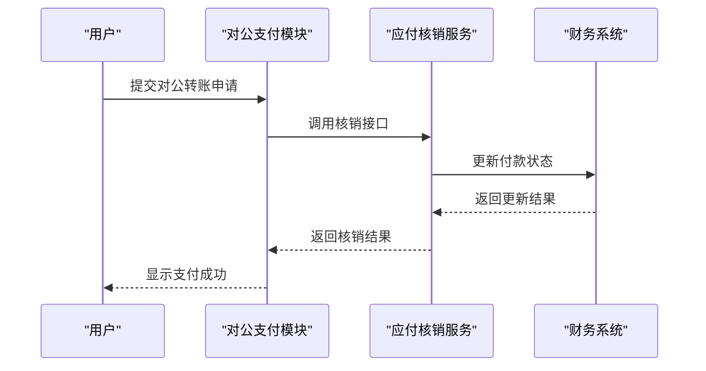
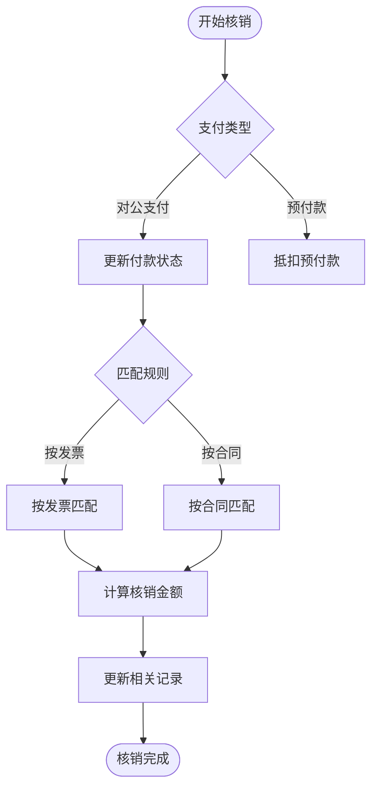
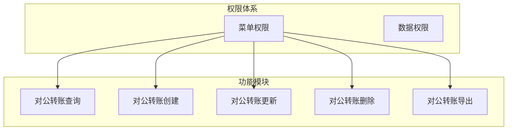
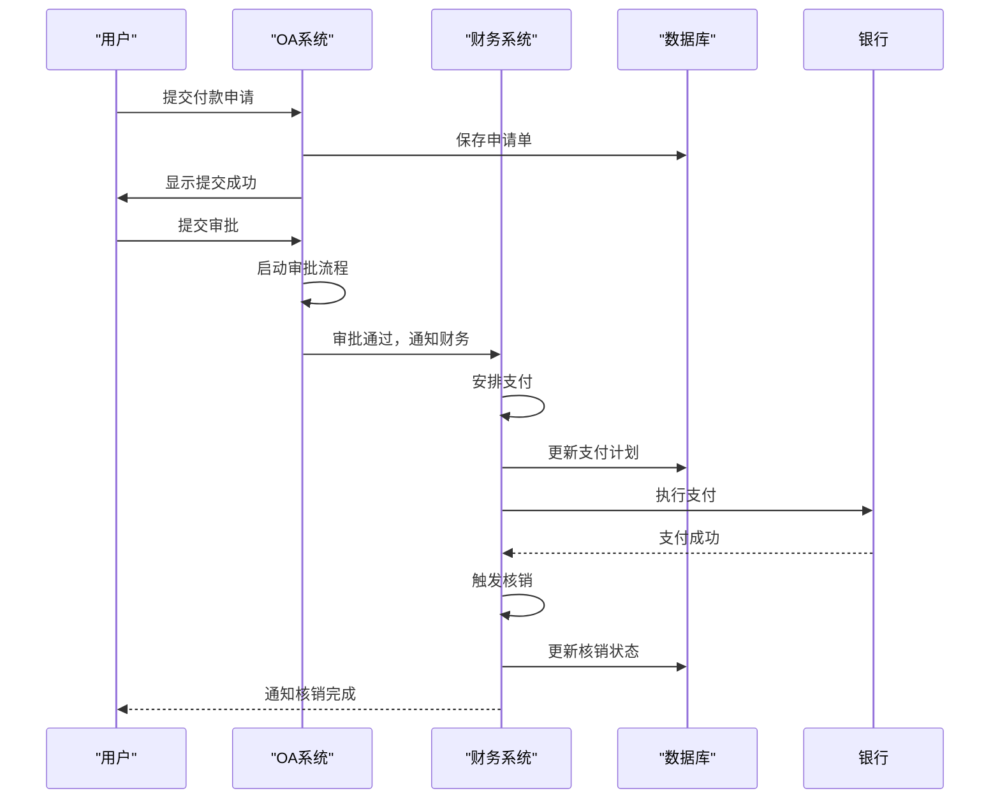

# 应付核销

<cite>
**本文档引用文件**  
- [PaymentAppServiceImpl.java](file://eplus-module-oa/eplus-module-oa-biz/src/main/java/com/syj/eplus/module/oa/service/paymentapp/PaymentAppServiceImpl.java)
- [V1_0_0_073__付款相关表.sql](file://eplus-flyway/src/main/resources/db/migration/common/V1_0_0_073__付款相关表.sql)
- [PaymentServiceImpl.java](file://eplus-module-fms/eplus-module-fms-biz/src/main/java/com/syj/eplus/module/fms/service/payment/PaymentServiceImpl.java)
- [PaymentAppApi.java](file://eplus-module-oa/eplus-module-oa-api/src/main/java/com/syj/eplus/module/oa/api/PaymentAppApi.java)
- [BatchPaymentReqVO.java](file://eplus-module-fms/eplus-module-fms-biz/src/main/java/com/syj/eplus/module/fms/controller/admin/payment/vo/BatchPaymentReqVO.java)
- [PaymentAppRespVO.java](file://eplus-module-oa/eplus-module-oa-biz/src/main/java/com/syj/eplus/module/oa/controller/admin/paymentapp/vo/PaymentAppRespVO.java)
- [FeeShareServiceImpl.java](file://eplus-module-oa/eplus-module-oa-biz/src/main/java/com/syj/eplus/module/oa/service/feeshare/FeeShareServiceImpl.java)
- [V1_0_0_065__新增费用归属相关表.sql](file://eplus-flyway/src/main/resources/db/migration/common/V1_0_0_065__新增费用归属相关表.sql)
- [fms_receipt.sql](file://eplus-flyway/src/main/resources/db/migration/common/V1_0_0_002__Eplus初始化.sql)
- [R__菜单相关.sql](file://eplus-flyway/src/main/resources/db/migration/common/R__菜单相关.sql)
</cite>

## 目录
1. [引言](#引言)
2. [应付核销业务流程](#应付核销业务流程)
3. [核销与收款登记及对公支付的关联](#核销与收款登记及对公支付的关联)
4. [金额匹配算法与核销方式](#金额匹配算法与核销方式)
5. [审批流程与权限控制](#审批流程与权限控制)
6. [应付核销流程图](#应付核销流程图)
7. [冲销机制与常见问题解决方案](#冲销机制与常见问题解决方案)
8. [结论](#结论)

## 引言
应付核销是企业财务管理中的关键环节，涉及采购、付款、发票、合同等多个业务模块。本文档全面介绍应付核销机制，涵盖部分核销、全额核销等场景，详细说明其与收款登记、对公支付的数据同步机制，解析金额匹配算法，并提供完整的流程图和问题解决方案。

## 应付核销业务流程
应付核销是指将已发生的应付账款与实际支付行为进行匹配确认的过程。系统支持两种主要核销方式：

- **全额核销**：当支付金额等于应付金额时，系统自动完成核销，标记该笔应付为已支付状态。
- **部分核销**：当支付金额小于应付金额时，系统记录已核销金额，剩余部分继续保留在应付账款中，支持后续分批核销。

在核销过程中，系统会更新相关业务单据的状态，如采购合同、付款申请单等，并同步更新供应商的应付余额。对于预付款项，系统支持从预付款中抵扣后续应付，实现预付款核销。

**核销触发条件包括：**
- 对公转账完成支付
- 收款登记后自动匹配
- 手动执行核销操作

**Section sources**
- [PaymentAppServiceImpl.java](file://eplus-module-oa/eplus-module-oa-biz/src/main/java/com/syj/eplus/module/oa/service/paymentapp/PaymentAppServiceImpl.java#L786-L806)
- [V1_0_0_073__付款相关表.sql](file://eplus-flyway/src/main/resources/db/migration/common/V1_0_0_073__付款相关表.sql#L54-L68)

## 核销与收款登记及对公支付的关联
应付核销与收款登记、对公支付之间存在紧密的数据同步机制。

### 与对公支付的关联
对公支付是触发应付核销的主要场景。当用户在系统中完成对公转账操作后，系统会调用核销服务，更新相关付款申请单的状态。根据支付结果，系统会：
- 更新付款单的支付状态为“已支付”
- 回写采购付款申请水单信息
- 更新费用归属的支付状态

**Diagram sources**
- [PaymentServiceImpl.java](file://eplus-module-fms/eplus-module-fms-biz/src/main/java/com/syj/eplus/module/fms/service/payment/PaymentServiceImpl.java#L441-L455)
- [BatchPaymentReqVO.java](file://eplus-module-fms/eplus-module-fms-biz/src/main/java/com/syj/eplus/module/fms/controller/admin/payment/vo/BatchPaymentReqVO.java#L1-L29)

### 与收款登记的关联
收款登记模块负责记录客户回款信息。当客户付款到账后，财务人员在系统中登记收款信息，包括收款金额、时间、银行流水号等。系统会根据登记信息自动匹配对应的应收账款，并触发核销流程。

对于存在差异的收款（如金额不符），系统支持部分核销，并生成差异记录供后续处理。

**Section sources**
- [fms_receipt.sql](file://eplus-flyway/src/main/resources/db/migration/common/V1_0_0_002__Eplus初始化.sql#L1529-L1549)
- [PaymentAppRespVO.java](file://eplus-module-oa/eplus-module-oa-biz/src/main/java/com/syj/eplus/module/oa/controller/admin/paymentapp/vo/PaymentAppRespVO.java#L147-L197)

## 金额匹配算法与核销方式
系统支持多种核销方式，每种方式采用不同的金额匹配算法。

### 按发票核销
系统根据发票编号、金额、币种等信息进行精确匹配。匹配算法如下：
1. 查找相同供应商、相同币种的未核销发票
2. 按发票日期升序排列
3. 从最早发票开始逐笔核销，直至支付金额用完

### 按合同核销
系统根据采购合同编号进行匹配，支持按合同明细逐项核销或按合同总额核销。对于按明细核销，系统会：
- 计算每项明细的应付金额（含税总价 × 数量）
- 按比例分配支付金额
- 更新每项明细的已支付金额

**Diagram sources**
- [PaymentAppApi.java](file://eplus-module-oa/eplus-module-oa-api/src/main/java/com/syj/eplus/module/oa/api/PaymentAppApi.java#L1-L54)
- [FeeShareServiceImpl.java](file://eplus-module-oa/eplus-module-oa-biz/src/main/java/com/syj/eplus/module/oa/service/feeshare/FeeShareServiceImpl.java#L646-L669)

## 审批流程与权限控制
应付核销涉及严格的审批流程和权限控制。

### 审批流程
1. **提交申请**：用户提交付款申请，填写供应商、金额、用途等信息
2. **部门审批**：直属上级审批付款申请
3. **财务审批**：财务人员审核付款信息
4. **出纳支付**：出纳执行支付操作
5. **核销确认**：系统自动或手动确认核销

### 权限控制
系统通过菜单权限和数据权限双重控制：
- **菜单权限**：控制用户能否访问对公转账、核销管理等功能
- **数据权限**：控制用户只能查看和操作自己负责的供应商和合同

**Diagram sources**
- [R__菜单相关.sql](file://eplus-flyway/src/main/resources/db/migration/common/R__菜单相关.sql#L314-L801)
- [V1_0_0_065__新增费用归属相关表.sql](file://eplus-flyway/src/main/resources/db/migration/common/V1_0_0_065__新增费用归属相关表.sql#L24-L36)

## 应付核销流程图
以下是应付核销的完整流程图，展示从支付到核销的全过程：

**Diagram sources**
- [PaymentAppServiceImpl.java](file://eplus-module-oa/eplus-module-oa-biz/src/main/java/com/syj/eplus/module/oa/service/paymentapp/PaymentAppServiceImpl.java#L786-L806)
- [PaymentServiceImpl.java](file://eplus-module-fms/eplus-module-fms-biz/src/main/java/com/syj/eplus/module/fms/service/payment/PaymentServiceImpl.java#L441-L455)

## 冲销机制与常见问题解决方案
### 冲销机制
当核销操作出现错误时，系统支持冲销功能：
- **条件**：仅允许对未完成最终审批的核销记录进行冲销
- **流程**：提交冲销申请 → 审批 → 恢复原应付状态 → 重新核销

### 常见问题及解决方案
| 问题 | 原因 | 解决方案 |
|------|------|----------|
| 核销金额不匹配 | 支付金额与应付金额不符 | 检查汇率换算，确认是否为部分核销 |
| 无法找到匹配发票 | 发票信息输入错误 | 核对发票编号、供应商、金额等信息 |
| 审批流程卡住 | 审批人未及时处理 | 提醒审批人，检查审批权限 |
| 重复核销 | 系统异常或操作失误 | 使用冲销功能，重新执行核销 |

**Section sources**
- [PaymentAppRespVO.java](file://eplus-module-oa/eplus-module-oa-biz/src/main/java/com/syj/eplus/module/oa/controller/admin/paymentapp/vo/PaymentAppRespVO.java#L147-L197)
- [FeeShareServiceImpl.java](file://eplus-module-oa/eplus-module-oa-biz/src/main/java/com/syj/eplus/module/oa/service/feeshare/FeeShareServiceImpl.java#L646-L669)

## 结论
应付核销机制是企业财务管理系统的核心功能之一，通过精确的金额匹配算法、严格的审批流程和完善的权限控制，确保了财务数据的准确性和安全性。系统支持多种核销方式，能够灵活应对不同的业务场景，同时提供冲销机制和问题解决方案，保障了财务操作的可逆性和可靠性。