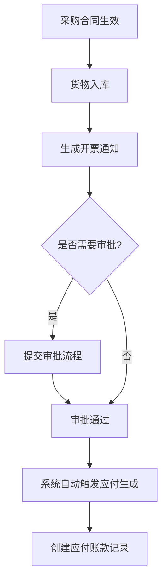
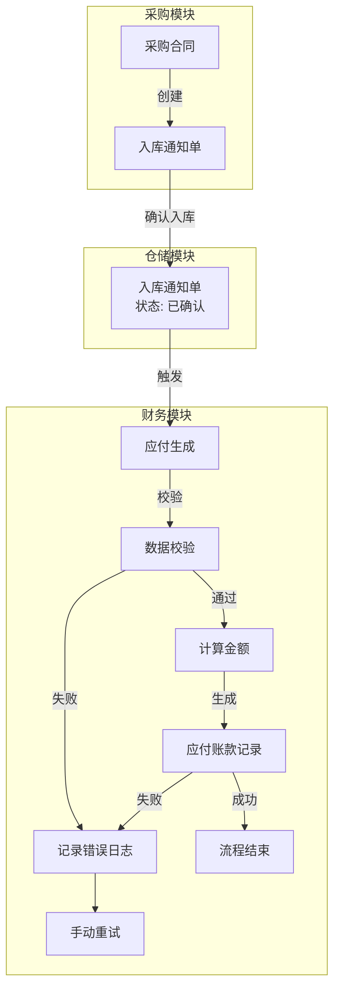

# 应付生成

<cite>
**本文档引用文件**  
- [InvoicingNoticesApi.java](file://eplus-module-scm/eplus-module-scm-api/src/main/java/com/syj/eplus/module/scm/api/invoicingnotices/InvoicingNoticesApi.java)
- [InvoicingNoticesServiceImpl.java](file://eplus-module-scm/eplus-module-scm-biz/src/main/java/com/syj/eplus/module/scm/service/invoicingnotices/InvoicingNoticesServiceImpl.java)
- [V1_0_0_026__新增开票通知表.sql](file://eplus-flyway/src/main/resources/db/migration/common/V1_0_0_026__新增开票通知表.sql)
- [InvoiceNoticeVO.java](file://eplus-module-scm/eplus-module-scm-biz/src/main/java/com/syj/eplus/module/scm/controller/admin/purchasecontract/vo/InvoiceNoticeVO.java)
- [PaymentApplyRespVO.java](file://eplus-module-scm/eplus-module-scm-biz/src/main/java/com/syj/eplus/module/scm/controller/admin/paymentapply/vo/PaymentApplyRespVO.java)
- [V1_0_0_073__付款相关表.sql](file://eplus-flyway/src/main/resources/db/migration/common/V1_0_0_073__付款相关表.sql)
</cite>

## 目录
1. [引言](#引言)
2. [应付生成机制概述](#应付生成机制概述)
3. [上游单据与数据映射](#上游单据与数据映射)
4. [应付生成触发条件与时机](#应付生成触发条件与时机)
5. [金额计算逻辑](#金额计算逻辑)
6. [校验规则](#校验规则)
7. [异常处理与重试策略](#异常处理与重试策略)
8. [应付生成流程图](#应付生成流程图)
9. [常见问题与解决方案](#常见问题与解决方案)

## 引言
应付生成是企业采购与财务系统中的核心环节，负责将采购合同、入库通知单等上游业务单据中的应付信息自动转化为财务应付账款。本文档全面介绍应付账款的生成机制，包括数据流转、计算逻辑、校验规则及异常处理，旨在为系统使用者和开发者提供清晰的操作与维护指南。

## 应付生成机制概述

应付生成机制通过集成采购、仓储与财务模块，实现从采购合同到财务应付的自动化流转。系统在满足特定条件时（如入库确认），自动提取上游单据中的关键信息（如供应商、数量、价格、税率等），经过数据映射和金额计算，生成应付账款记录。

该机制的核心目标是确保财务数据的准确性、及时性和一致性，减少人工干预，提高财务结算效率。

**本节来源**
- [InvoicingNoticesApi.java](file://eplus-module-scm/eplus-module-scm-api/src/main/java/com/syj/eplus/module/scm/api/invoicingnotices/InvoicingNoticesApi.java#L8-L16)
- [InvoicingNoticesServiceImpl.java](file://eplus-module-scm/eplus-module-scm-biz/src/main/java/com/syj/eplus/module/scm/service/invoicingnotices/InvoicingNoticesServiceImpl.java#L97-L169)

## 上游单据与数据映射

应付账款主要由两类上游单据触发生成：采购合同（Purchase Contract）和入库通知单（或称开票通知，Invoicing Notices）。

### 采购合同
采购合同是定义采购交易条款的法律文件，包含供应商信息、商品明细、单价、数量、币种、税率等关键数据。当采购的商品完成入库后，系统依据合同条款生成应付。

### 入库通知单
入库通知单是仓库确认货物实际入库的凭证，通常与采购合同关联。它记录了实际入库的数量、时间等信息，是触发应付生成的直接信号。

### 数据映射规则
系统通过以下规则将上游单据的数据映射到应付账款记录中：

| 应付字段 | 采购合同来源 | 入库通知单来源 |
| :--- | :--- | :--- |
| 供应商主键 | `vender_id` | `vender_id` |
| 供应商编码 | `vender_code` | `vender_code` |
| 供应商名称 | `vender_name` | `vender_name` |
| 币种 | `currency` | `currency` |
| 税率 | `tax_rate` | `tax_rate` |
| 银行账号 | `bank_account` | `bank_account` |
| 开户行 | `bank` | `bank` |
| 采购明细 | `purchase_contract_item_list` (JSON) | `applyer_purchase_item_list` (JSON) |

**本节来源**
- [V1_0_0_026__新增开票通知表.sql](file://eplus-flyway/src/main/resources/db/migration/common/V1_0_0_026__新增开票通知表.sql#L1-L18)
- [InvoiceNoticeVO.java](file://eplus-module-scm/eplus-module-scm-biz/src/main/java/com/syj/eplus/module/scm/controller/admin/purchasecontract/vo/InvoiceNoticeVO.java#L1-L63)
- [V1_0_0_073__付款相关表.sql](file://eplus-flyway/src/main/resources/db/migration/common/V1_0_0_073__付款相关表.sql#L54-L68)

## 应付生成触发条件与时机

应付生成的触发遵循严格的业务规则，确保在正确的业务节点进行财务确认。

### 触发条件
1.  **采购合同状态**：采购合同必须处于“已生效”或“已完成”状态。
2.  **入库确认**：系统必须收到有效的入库通知单，并且该通知单的状态为“已确认”或“已审核”。
3.  **数据完整性**：上游单据中的关键字段（如供应商、数量、单价、币种）必须完整且有效。
4.  **流程审批**：如果业务流程要求，开票通知单必须通过相应的审批流程。

### 触发时机
应付生成的典型时机是**入库操作完成并确认后**。具体流程如下：
1.  仓库人员在系统中创建入库单。
2.  系统根据入库单关联的采购合同，自动生成一张“开票通知”（Invoicing Notices）。
3.  该开票通知进入审批流程（可选）。
4.  当开票通知的状态变为“已审核”（`auditStatus = APPROVE`）时，系统自动触发应付生成逻辑。

**图示来源**
- [InvoicingNoticesServiceImpl.java](file://eplus-module-scm/eplus-module-scm-biz/src/main/java/com/syj/eplus/module/scm/service/invoicingnotices/InvoicingNoticesServiceImpl.java#L176-L181)

## 金额计算逻辑

应付金额的计算是整个流程的核心，系统根据合同单价、实际入库数量、税率等信息进行精确计算。

### 单项金额计算
对于每一项采购商品，系统计算以下金额：
-   **含税总价** = 含税单价 × 实际入库数量
-   **不含税总价** = 含税总价 / (1 + 税率)
-   **税金** = 含税总价 - 不含税总价

### 汇总金额计算
系统将所有采购明细的金额进行汇总：
-   **应付总金额** = Σ(含税总价)
-   **货款总金额** = Σ(不含税总价)

系统支持多币种计算，会根据实时汇率将不同币种的金额统一折算为记账本位币进行汇总。

**本节来源**
- [InvoicingNoticesServiceImpl.java](file://eplus-module-scm/eplus-module-scm-biz/src/main/java/com/syj/eplus/module/scm/service/invoicingnotices/InvoicingNoticesServiceImpl.java#L735-L809)
- [CalcContactUtil.java](file://eplus-module-scm/eplus-module-scm-biz/src/main/java/com/syj/eplus/module/scm/util/CalcContactUtil.java)

## 校验规则

在生成应付账款之前，系统会执行一系列校验，以确保数据的准确性和业务的合规性。

### 一致性校验
1.  **价格校验**：核对入库通知单中的单价是否与采购合同中约定的单价一致。
2.  **数量校验**：检查实际入库数量是否超过采购合同约定的总数量。
3.  **税率校验**：验证入库通知单上的税率是否与采购合同或税务系统配置的税率匹配。
4.  **供应商信息校验**：确保供应商编码、名称、银行账号等信息在系统中存在且有效。

### 业务规则校验
1.  **重复生成校验**：防止对同一笔入库业务重复生成应付。
2.  **状态校验**：确保上游单据（如采购合同、开票通知）处于允许生成应付的状态。
3.  **权限校验**：检查执行操作的用户是否具有生成应付的权限。

如果任何一项校验失败，系统将中断应付生成流程，并记录错误日志。

**本节来源**
- [InvoicingNoticesServiceImpl.java](file://eplus-module-scm/eplus-module-scm-biz/src/main/java/com/syj/eplus/module/scm/service/invoicingnotices/InvoicingNoticesServiceImpl.java#L190-L194)
- [CheckShipmentUtil.java](file://eplus-module-dms/eplus-module-dms-biz/src/main/java/com/syj/eplus/module/dms/util/CheckShipmentUtil.java)

## 异常处理与重试策略

尽管有严格的校验，系统仍可能因网络、数据或业务逻辑问题导致应付生成失败。系统设计了完善的异常处理和重试机制。

### 失败处理机制
1.  **事务回滚**：所有数据库操作都在一个事务中执行。一旦发生异常，整个事务将被回滚，确保数据的一致性。
2.  **错误日志记录**：详细的错误信息（包括错误码、错误描述、相关单据号）会被记录到系统日志中，便于排查。
3.  **状态标记**：失败的应付生成任务会被标记为“生成失败”状态，并关联具体的错误原因。

### 重试策略
1.  **手动重试**：系统管理员或财务人员可以在后台查看失败的任务列表，并手动触发重试。
2.  **自动重试**：对于某些可恢复的临时性错误（如网络超时），系统可以配置定时任务，定期扫描失败任务并自动重试。
3.  **重试次数限制**：为防止无限循环，系统会设置最大重试次数（例如3次）。超过次数后，任务将被标记为“永久失败”，需要人工介入处理。

**本节来源**
- [InvoicingNoticesServiceImpl.java](file://eplus-module-scm/eplus-module-scm-biz/src/main/java/com/syj/eplus/module/scm/service/invoicingnotices/InvoicingNoticesServiceImpl.java#L169-L170)
- [RepayAppAuditResultListener.java](file://eplus-module-oa/eplus-module-oa-biz/src/main/java/com/syj/eplus/module/oa/listener/RepayAppAuditResultListener.java)

## 应付生成流程图

以下流程图展示了从采购到应付生成的完整数据流转过程。

**图示来源**
- [InvoicingNoticesApi.java](file://eplus-module-scm/eplus-module-scm-api/src/main/java/com/syj/eplus/module/scm/api/invoicingnotices/InvoicingNoticesApi.java#L15)
- [InvoicingNoticesServiceImpl.java](file://eplus-module-scm/eplus-module-scm-biz/src/main/java/com/syj/eplus/module/scm/service/invoicingnotices/InvoicingNoticesServiceImpl.java)

## 常见问题与解决方案

### Q1: 为什么入库后没有自动生成应付？
**A**: 请检查以下几点：
1.  入库通知单是否已通过审核？只有审核通过的单据才会触发应付。
2.  采购合同是否处于有效状态？
3.  系统日志中是否有相关的错误记录？根据错误码排查具体原因。

### Q2: 生成的应付金额与预期不符？
**A**: 请核对：
1.  入库通知单上的单价、数量、税率是否与采购合同一致。
2.  是否存在加减项（如运费、折扣）未被正确计算。
3.  汇率是否为最新值。

### Q3: 如何重新生成应付？
**A**: 如果应付生成失败，可以在“应付管理”或“任务监控”页面找到失败的任务，点击“重试”按钮。如果多次重试失败，请联系系统管理员检查数据或日志。