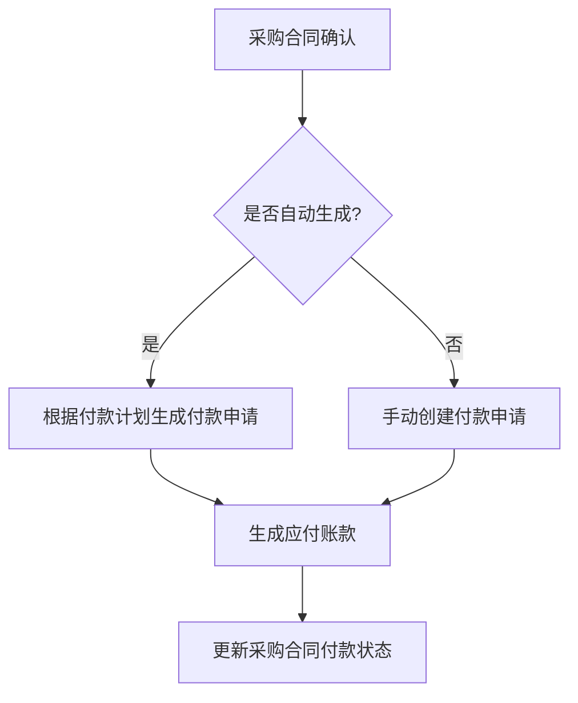
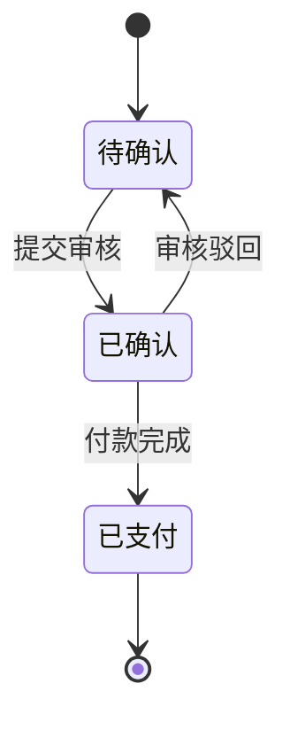
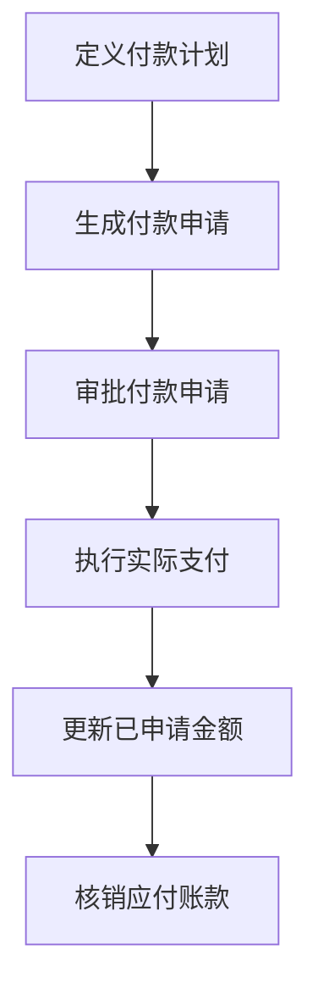
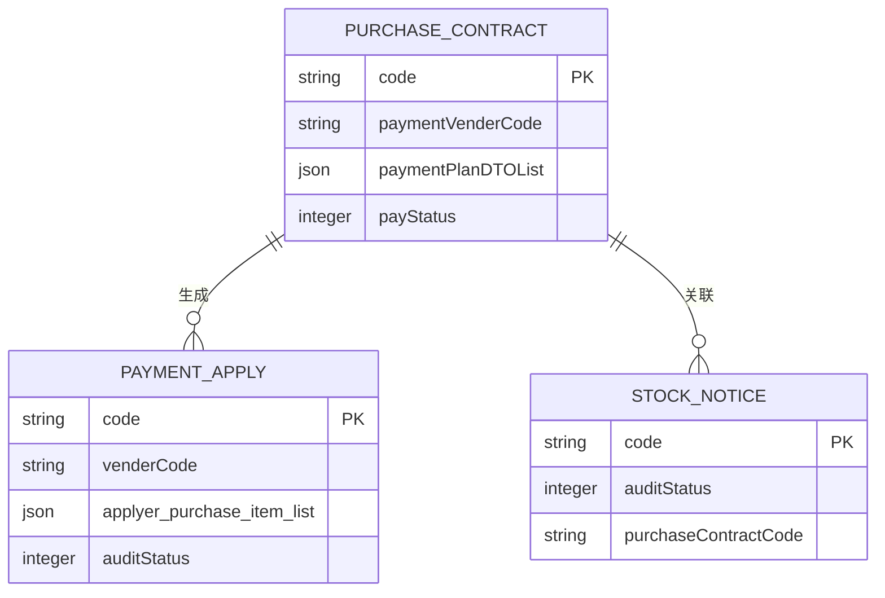
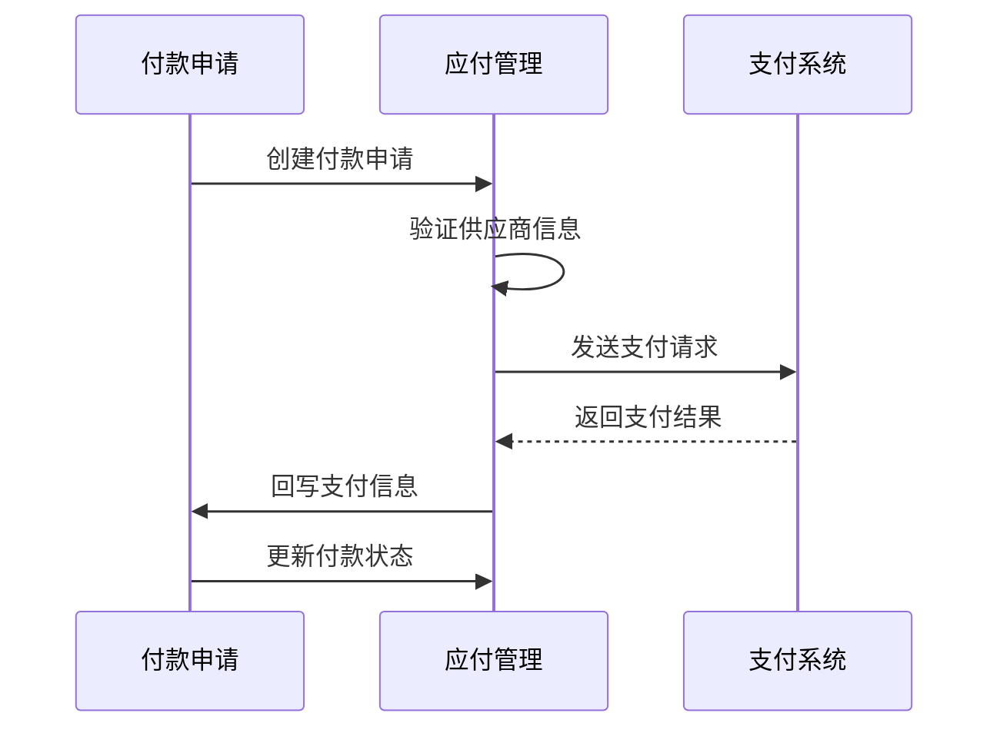
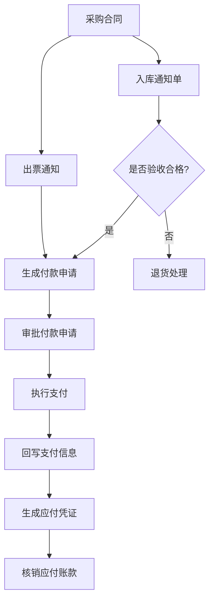

# 应付管理

<cite>
**本文档引用文件**  
- [PaymentApplyApi.java](file://eplus-module-scm/eplus-module-scm-api/src/main/java/com/syj/eplus/module/scm/api/paymentapply/PaymentApplyApi.java)
- [PaymentApplyDTO.java](file://eplus-module-scm/eplus-module-scm-api/src/main/java/com/syj/eplus/module/scm/api/paymentapply/dto/PaymentApplyDTO.java)
- [PurchaseContractApi.java](file://eplus-module-scm/eplus-module-scm-api/src/main/java/com/syj/eplus/module/scm/api/purchasecontract/PurchaseContractApi.java)
- [SavePurchaseContractReqVO.java](file://eplus-module-scm/eplus-module-scm-api/src/main/java/com/syj/eplus/module/scm/api/purchasecontract/dto/SavePurchaseContractReqVO.java)
- [InvoicingNoticesApi.java](file://eplus-module-scm/eplus-module-scm-api/src/main/java/com/syj/eplus/module/scm/api/invoicingnotices/InvoicingNoticesApi.java)
- [InvoicingNoticesDTO.java](file://eplus-module-scm/eplus-module-scm-api/src/main/java/com/syj/eplus/module/scm/api/invoicingnotices/dto/InvoicingNoticesDTO.java)
- [V1_0_0_073__付款相关表.sql](file://eplus-flyway/src/main/resources/db/migration/common/V1_0_0_073__付款相关表.sql)
- [V1_0_0_046__新增供应商付款方式表.sql](file://eplus-flyway/src/main/resources/db/migration/common/V1_0_0_046__新增供应商付款方式表.sql)
</cite>

## 目录
1. [引言](#引言)
2. [应付管理核心功能](#应付管理核心功能)
3. [应付账款生成机制](#应付账款生成机制)
4. [应付单据状态流转](#应付单据状态流转)
5. [付款计划与实际支付](#付款计划与实际支付)
6. [差异处理机制](#差异处理机制)
7. [与采购合同及入库通知单的关联](#与采购合同及入库通知单的关联)
8. [与供应商付款和对公支付的集成](#与供应商付款和对公支付的集成)
9. [应付凭证生成规则](#应付凭证生成规则)
10. [常见问题解决方案](#常见问题解决方案)
11. [业务流程图](#业务流程图)

## 引言
应付管理是企业财务系统中的关键模块，负责管理企业对供应商的付款义务。本系统通过采购合同、付款申请、付款计划等机制，实现了从采购到付款的全流程管理。应付管理模块与采购、仓储、财务等多个业务模块紧密集成，确保数据的一致性和流程的完整性。

## 应付管理核心功能
应付管理模块提供应付账款的生成、核销、调整等核心功能。系统通过采购合同自动生成应付账款，并支持手动创建付款申请。付款申请包含供应商信息、付款金额、付款方式、银行账户等关键数据。系统支持多币种应付管理，并记录税率、银行账号等财务信息。

**本节来源**  
- [PaymentApplyDTO.java](file://eplus-module-scm/eplus-module-scm-api/src/main/java/com/syj/eplus/module/scm/api/paymentapply/dto/PaymentApplyDTO.java#L22-L147)
- [V1_0_0_073__付款相关表.sql](file://eplus-flyway/src/main/resources/db/migration/common/V1_0_0_073__付款相关表.sql#L54-L68)

## 应付账款生成机制
应付账款主要通过采购合同生成。当采购合同确认后，系统根据合同金额、付款条款等信息自动生成应付账款。系统支持两种生成方式：自动和手动。自动模式下，系统根据采购合同的付款计划自动生成付款申请；手动模式下，用户可自行创建付款申请。

应付账款的生成与采购合同的付款状态字段（payStatus）和预付款状态字段（prepayStatus）密切相关。系统通过这些状态字段跟踪应付账款的生成进度。采购合同中包含应付供应商编码（paymentVenderCode）、应付供应商名称（paymentVenderName）等关键信息，用于确定应付对象。

**流程图来源**  
- [SavePurchaseContractReqVO.java](file://eplus-module-scm/eplus-module-scm-api/src/main/java/com/syj/eplus/module/scm/api/purchasecontract/dto/SavePurchaseContractReqVO.java#L53-L59)
- [PurchaseContractApi.java](file://eplus-module-scm/eplus-module-scm-api/src/main/java/com/syj/eplus/module/scm/api/purchasecontract/PurchaseContractApi.java#L67)

**本节来源**  
- [SavePurchaseContractReqVO.java](file://eplus-module-scm/eplus-module-scm-api/src/main/java/com/syj/eplus/module/scm/api/purchasecontract/dto/SavePurchaseContractReqVO.java#L168-L175)
- [PurchaseContractApi.java](file://eplus-module-scm/eplus-module-scm-api/src/main/java/com/syj/eplus/module/scm/api/purchasecontract/PurchaseContractApi.java#L143-L146)

## 应付单据状态流转
应付单据具有明确的状态流转逻辑。主要状态包括：待确认、已确认、已支付等。状态流转通过审核状态（auditStatus）字段进行管理。初始状态为"待确认"，当付款申请提交后变为"已确认"，付款完成后变为"已支付"。

状态流转受流程实例编号（processInstanceId）控制，每个付款申请关联一个流程实例。系统通过流程引擎驱动状态变更，确保审批流程的合规性。打印状态（printFlag）字段记录单据的打印情况，防止重复打印。

**状态图来源**  
- [PaymentApplyDTO.java](file://eplus-module-scm/eplus-module-scm-api/src/main/java/com/syj/eplus/module/scm/api/paymentapply/dto/PaymentApplyDTO.java#L123)
- [V1_0_0_073__付款相关表.sql](file://eplus-flyway/src/main/resources/db/migration/common/V1_0_0_073__付款相关表.sql#L64)

**本节来源**  
- [PaymentApplyDTO.java](file://eplus-module-scm/eplus-module-scm-api/src/main/java/com/syj/eplus/module/scm/api/paymentapply/dto/PaymentApplyDTO.java#L55-L123)
- [V1_0_0_046__新增供应商付款方式表.sql](file://eplus-flyway/src/main/resources/db/migration/common/V1_0_0_046__新增供应商付款方式表.sql#L42)

## 付款计划与实际支付
系统支持灵活的付款计划管理。付款计划信息存储在JSON格式的payment_plan字段中，包含多个付款节点。每个付款节点包含付款金额、付款日期、付款条件等信息。系统根据付款计划生成相应的付款申请。

实际支付时，系统记录付款日期（paymentDate）、付款人（paymentUser）等信息。已申请金额（applied_amount）字段以JSON格式存储各币种的已申请金额，确保多币种支付的准确性。系统通过apply_payment_plan_list字段管理付款计划的执行情况。

**流程图来源**  
- [V1_0_0_073__付款相关表.sql](file://eplus-flyway/src/main/resources/db/migration/common/V1_0_0_073__付款相关表.sql#L65-L66)
- [PaymentApplyDTO.java](file://eplus-module-scm/eplus-module-scm-api/src/main/java/com/syj/eplus/module/scm/api/paymentapply/dto/PaymentApplyDTO.java#L63-L67)

**本节来源**  
- [V1_0_0_073__付款相关表.sql](file://eplus-flyway/src/main/resources/db/migration/common/V1_0_0_073__付款相关表.sql#L133)
- [PaymentApplyDTO.java](file://eplus-module-scm/eplus-module-scm-api/src/main/java/com/syj/eplus/module/scm/api/paymentapply/dto/PaymentApplyDTO.java#L139-L146)

## 差异处理机制
系统提供完善的差异处理机制。当实际支付金额与计划金额存在差异时，系统记录差异信息并触发差异处理流程。加减项（add_sub_term_list）字段以JSON格式存储各种调整项，如折扣、罚款、汇率差异等。

差异处理通过专门的调整单据实现，确保财务数据的准确性。系统支持对差异进行审批和核销，保持应付账款的完整性。对于长期未处理的差异，系统会生成预警，提醒财务人员及时处理。

**本节来源**  
- [V1_0_0_073__付款相关表.sql](file://eplus-flyway/src/main/resources/db/migration/common/V1_0_0_073__付款相关表.sql#L68)
- [V1_0_0_046__新增供应商付款方式表.sql](file://eplus-flyway/src/main/resources/db/migration/common/V1_0_0_046__新增供应商付款方式表.sql#L46)

## 与采购合同及入库通知单的关联
应付管理与采购合同、入库通知单存在紧密的数据同步机制。采购合同是应付账款的主要来源，系统通过采购合同编号建立关联。入库通知单（StockNotice）作为货物验收的凭证，触发货款支付。

系统通过采购明细（applyer_purchase_item_list）字段建立采购合同与付款申请的关联。每个付款申请可关联多个采购合同，实现集中付款。入库单的审核状态（auditStatus）影响付款进度，确保"先收货后付款"的业务规则。

**数据模型来源**  
- [SavePurchaseContractReqVO.java](file://eplus-module-scm/eplus-module-scm-api/src/main/java/com/syj/eplus/module/scm/api/purchasecontract/dto/SavePurchaseContractReqVO.java#L187)
- [PaymentApplyDTO.java](file://eplus-module-scm/eplus-module-scm-api/src/main/java/com/syj/eplus/module/scm/api/paymentapply/dto/PaymentApplyDTO.java#L128-L135)
- [StockNoticeRespVO.java](file://eplus-module-wms/eplus-module-wms-biz/src/main/java/com/syj/eplus/module/wms/controller/admin/stockNotice/vo/StockNoticeRespVO.java#L114-L115)

**本节来源**  
- [SavePurchaseContractReqVO.java](file://eplus-module-scm/eplus-module-scm-api/src/main/java/com/syj/eplus/module/scm/api/purchasecontract/dto/SavePurchaseContractReqVO.java#L184-L187)
- [StockNoticeRespVO.java](file://eplus-module-wms/eplus-module-wms-biz/src/main/java/com/syj/eplus/module/wms/controller/admin/stockNotice/vo/StockNoticeRespVO.java#L114-L122)

## 与供应商付款和对公支付的集成
应付管理模块与供应商付款、对公支付系统深度集成。付款申请通过batchWriteBackPaymentMsg接口回写付款信息，实现支付状态同步。系统支持多种付款方式，通过payment_id和payment_name字段记录付款方式信息。

银行账户信息（bank_account、bank）确保支付指令的准确性。流程实例编号（process_instance_id）用于跟踪支付流程的执行情况。系统通过annex附件字段传递支付凭证，完成支付闭环。

**序列图来源**  
- [PaymentApplyApi.java](file://eplus-module-scm/eplus-module-scm-api/src/main/java/com/syj/eplus/module/scm/api/paymentapply/PaymentApplyApi.java#L21-L28)
- [V1_0_0_073__付款相关表.sql](file://eplus-flyway/src/main/resources/db/migration/common/V1_0_0_073__付款相关表.sql#L59-L63)

**本节来源**  
- [PaymentApplyApi.java](file://eplus-module-scm/eplus-module-scm-api/src/main/java/com/syj/eplus/module/scm/api/paymentapply/PaymentApplyApi.java#L15-L29)
- [V1_0_0_073__付款相关表.sql](file://eplus-flyway/src/main/resources/db/migration/common/V1_0_0_073__付款相关表.sql#L59-L63)

## 应付凭证生成规则
应付凭证根据付款申请自动生成。凭证包含供应商信息、付款金额、币种、银行账户等关键字段。系统根据会计准则确定凭证科目，确保财务核算的准确性。

凭证生成时机为付款申请审核通过后。系统支持凭证预览和冲销功能。对于多币种交易，系统自动计算汇兑损益并生成相应分录。凭证编号与付款申请编号关联，便于追溯。

**本节来源**  
- [PaymentApplyDTO.java](file://eplus-module-scm/eplus-module-scm-api/src/main/java/com/syj/eplus/module/scm/api/paymentapply/dto/PaymentApplyDTO.java#L63-L91)
- [V1_0_0_073__付款相关表.sql](file://eplus-flyway/src/main/resources/db/migration/common/V1_0_0_073__付款相关表.sql#L55-L58)

## 常见问题解决方案
1. **付款申请无法提交**：检查采购合同的审核状态和付款状态，确保合同已确认且未完成付款。
2. **供应商信息不正确**：验证采购合同中的应付供应商编码（paymentVenderCode）是否准确。
3. **付款计划未生成**：确认采购合同的自动生成标识（autoFlag）是否设置为"是"。
4. **支付状态不同步**：检查流程实例编号（process_instance_id）是否正确传递。
5. **多币种计算错误**：验证汇率数据源的准确性和时效性。

**本节来源**  
- [SavePurchaseContractReqVO.java](file://eplus-module-scm/eplus-module-scm-api/src/main/java/com/syj/eplus/module/scm/api/purchasecontract/dto/SavePurchaseContractReqVO.java#L190)
- [PaymentApplyDTO.java](file://eplus-module-scm/eplus-module-scm-api/src/main/java/com/syj/eplus/module/scm/api/paymentapply/dto/PaymentApplyDTO.java#L115)
- [PurchaseContractApi.java](file://eplus-module-scm/eplus-module-scm-api/src/main/java/com/syj/eplus/module/scm/api/purchasecontract/PurchaseContractApi.java#L92-L94)

## 业务流程图

**业务流程图来源**  
- [PurchaseContractApi.java](file://eplus-module-scm/eplus-module-scm-api/src/main/java/com/syj/eplus/module/scm/api/purchasecontract/PurchaseContractApi.java#L140)
- [InvoicingNoticesApi.java](file://eplus-module-scm/eplus-module-scm-api/src/main/java/com/syj/eplus/module/scm/api/invoicingnotices/InvoicingNoticesApi.java#L15)
- [PaymentApplyApi.java](file://eplus-module-scm/eplus-module-scm-api/src/main/java/com/syj/eplus/module/scm/api/paymentapply/PaymentApplyApi.java#L21)

**本节来源**  
- [PurchaseContractApi.java](file://eplus-module-scm/eplus-module-scm-api/src/main/java/com/syj/eplus/module/scm/api/purchasecontract/PurchaseContractApi.java#L136-L140)
- [InvoicingNoticesApi.java](file://eplus-module-scm/eplus-module-scm-api/src/main/java/com/syj/eplus/module/scm/api/invoicingnotices/InvoicingNoticesApi.java#L15)
- [PaymentApplyApi.java](file://eplus-module-scm/eplus-module-scm-api/src/main/java/com/syj/eplus/module/scm/api/paymentapply/PaymentApplyApi.java#L21-L28)