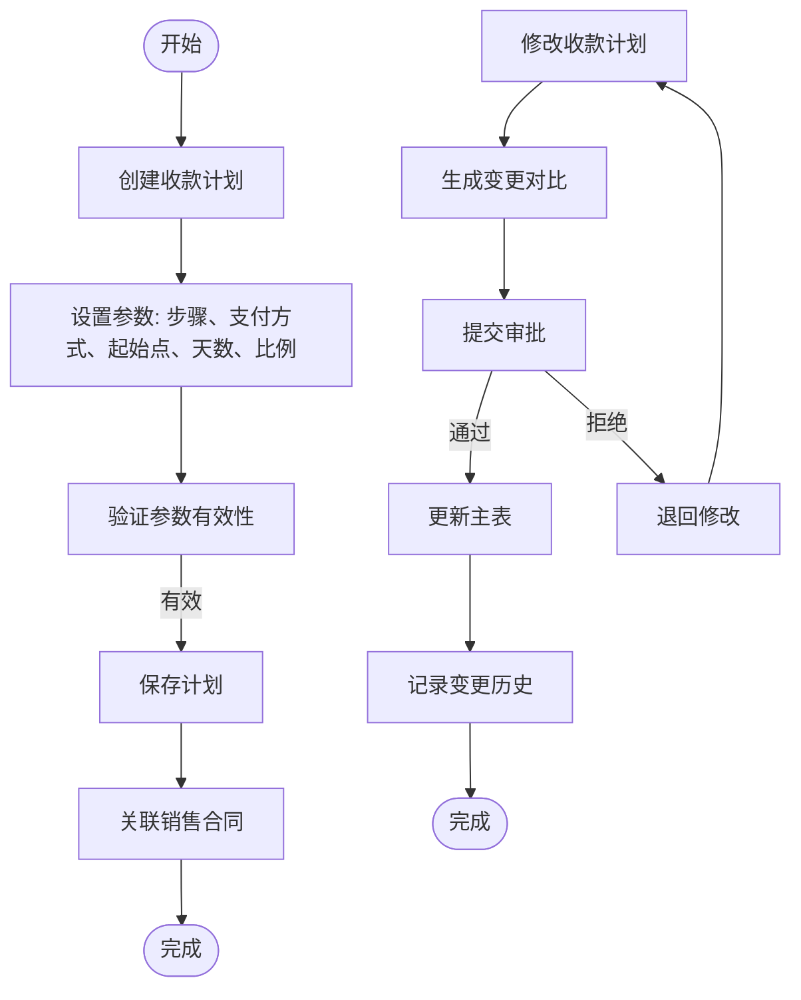

# 收款计划

<cite>
**本文档引用文件**  
- [CollectionPlan.java](file://eplus-module-sms/eplus-module-sms-biz/src/main/java/com/syj/eplus/module/sms/dal/dataobject/collectionplan/CollectionPlan.java)
- [CollectionPlanMapper.java](file://eplus-module-sms/eplus-module-sms-biz/src/main/java/com/syj/eplus/module/sms/dal/mysql/collectionplan/CollectionPlanMapper.java)
- [UpdateCollectionPlanReq.java](file://eplus-module-sms/eplus-module-sms-biz/src/main/java/com/syj/eplus/module/sms/controller/admin/salecontract/vo/UpdateCollectionPlanReq.java)
- [JsonCollectionPlanHandler.java](file://eplus-module-sms/eplus-module-sms-biz/src/main/java/com/syj/eplus/module/sms/handler/JsonCollectionPlanHandler.java)
- [SaleContractServiceImpl.java](file://eplus-module-sms/eplus-module-sms-biz/src/main/java/com/syj/eplus/module/sms/service/salecontract/SaleContractServiceImpl.java)
- [system_collection_plan.sql](file://eplus-flyway/src/main/resources/db/migration/common/V1_0_0_002__Eplus初始化.sql)
- [ReceiptController.java](file://eplus-module-fms/eplus-module-fms-biz/src/main/java/com/syj/eplus/module/fms/controller/admin/receipt/ReceiptController.java)
- [ReceiptServiceImpl.java](file://eplus-module-fms/eplus-module-fms-biz/src/main/java/com/syj/eplus/module/fms/service/receipt/ReceiptServiceImpl.java)
- [ReceiptApi.java](file://eplus-module-fms/eplus-module-fms-api/src/main/java/com/syj/eplus/module/fms/api/payment/api/receipt/ReceiptApi.java)
- [ReceiptApiImpl.java](file://eplus-module-fms/eplus-module-fms-biz/src/main/java/com/syj/eplus/module/fms/api/receipt/ReceiptApiImpl.java)
- [CollectionPlanChange.java](file://eplus-module-sms/eplus-module-sms-biz/src/main/java/com/syj/eplus/module/sms/dal/dataobject/salecontractchange/CollectionPlanChange.java)
- [SaleContractApi.java](file://eplus-module-sms/eplus-module-sms-api/src/main/java/com/syj/eplus/module/sms/api/SaleContractApi.java)
</cite>

## 目录
1. [引言](#引言)
2. [收款计划创建与调整流程](#收款计划创建与调整流程)
3. [收款计划与销售合同的关联关系](#收款计划与销售合同的关联关系)
4. [计划金额分配规则](#计划金额分配规则)
5. [时间节点管理](#时间节点管理)
6. [实际收款匹配逻辑](#实际收款匹配逻辑)
7. [计划完成度统计方法](#计划完成度统计方法)
8. [API接口说明](#api接口说明)
9. [调整审批流程与历史记录](#调整审批流程与历史记录)
10. [界面示意图与使用场景](#界面示意图与使用场景)

## 引言

收款计划是企业财务管理中的核心组成部分，用于规划和控制销售合同项下的资金流入。本系统通过结构化的收款计划管理机制，实现对销售合同的分阶段收款安排、执行监控及与实际收款的匹配分析。收款计划不仅关联销售合同的执行进度，还与采购、出运等业务环节形成联动控制，确保企业现金流的可预测性和合规性。

**本文档来源**
- [CollectionPlan.java](file://eplus-module-sms/eplus-module-sms-biz/src/main/java/com/syj/eplus/module/sms/dal/dataobject/collectionplan/CollectionPlan.java#L1-L159)

## 收款计划创建与调整流程

收款计划的创建基于销售合同的签订，在合同生效后由系统根据预设的收款模板或手动配置生成。创建流程包括确定收款步骤、支付方式、起始点、天数、收款比例等关键参数。系统支持对已创建的收款计划进行调整，调整操作会触发变更记录的生成，并可能需要经过审批流程。

调整流程包括：
1. 用户发起收款计划修改请求
2. 系统生成变更前后的对比数据
3. 提交审批工作流（如配置需要）
4. 审批通过后更新主表数据
5. 记录变更历史到变更表



**图示来源**
- [CollectionPlan.java](file://eplus-module-sms/eplus-module-sms-biz/src/main/java/com/syj/eplus/module/sms/dal/dataobject/collectionplan/CollectionPlan.java#L1-L159)
- [CollectionPlanChange.java](file://eplus-module-sms/eplus-module-sms-biz/src/main/java/com/syj/eplus/module/sms/dal/dataobject/salecontractchange/CollectionPlanChange.java#L1-L147)

**本节来源**
- [CollectionPlan.java](file://eplus-module-sms/eplus-module-sms-biz/src/main/java/com/syj/eplus/module/sms/dal/dataobject/collectionplan/CollectionPlan.java#L1-L159)
- [CollectionPlanChange.java](file://eplus-module-sms/eplus-module-sms-biz/src/main/java/com/syj/eplus/module/sms/dal/dataobject/salecontractchange/CollectionPlanChange.java#L1-L147)

## 收款计划与销售合同的关联关系

每个收款计划必须关联一个销售合同，通过`contractId`字段建立外键关系。系统在销售合同详情中展示其对应的收款计划列表，支持按步骤、状态等条件筛选。收款计划的执行状态直接影响销售合同的整体进度，当关键收款节点未完成时，系统可控制后续采购或出运操作。

关联特性包括：
- 一对多关系：一个销售合同可有多个收款计划
- 级联查询：通过合同ID可快速获取所有相关收款计划
- 状态联动：收款计划完成度影响合同状态
- 控制标识：通过`controlPurchaseFlag`和`controlShipmentFlag`控制业务流程


**图示来源**
- [CollectionPlan.java](file://eplus-module-sms/eplus-module-sms-biz/src/main/java/com/syj/eplus/module/sms/dal/dataobject/collectionplan/CollectionPlan.java#L56-L57)
- [system_collection_plan.sql](file://eplus-flyway/src/main/resources/db/migration/common/V1_0_0_002__Eplus初始化.sql#L2715-L2716)

**本节来源**
- [CollectionPlan.java](file://eplus-module-sms/eplus-module-sms-biz/src/main/java/com/syj/eplus/module/sms/dal/dataobject/collectionplan/CollectionPlan.java#L56-L57)
- [system_collection_plan.sql](file://eplus-flyway/src/main/resources/db/migration/common/V1_0_0_002__Eplus初始化.sql#L2715-L2716)

## 计划金额分配规则

收款计划的金额分配基于合同总金额和预设的收款比例进行计算。应收金额（`receivableAmount`）根据收款比例自动计算得出，支持多币种处理。系统允许手动调整应收金额，但需记录差异原因。实收金额（`receivedAmount`）由实际收款操作累计更新。

分配规则：
- 自动计算：应收金额 = 合同总金额 × 收款比例
- 多币种支持：金额字段为JSON结构，包含币种和数值
- 差异管理：支持记录实际与计划的差异原因
- 实时更新：实收金额随收款确认操作动态累加


**图示来源**
- [CollectionPlan.java](file://eplus-module-sms/eplus-module-sms-biz/src/main/java/com/syj/eplus/module/sms/dal/dataobject/collectionplan/CollectionPlan.java#L104-L111)
- [JsonAmountTypeHandler.java](file://eplus-framework/eplus-common/src/main/java/com/syj/eplus/framework/common/config/handler/JsonAmountTypeHandler.java)

**本节来源**
- [CollectionPlan.java](file://eplus-module-sms/eplus-module-sms-biz/src/main/java/com/syj/eplus/module/sms/dal/dataobject/collectionplan/CollectionPlan.java#L104-L111)

## 时间节点管理

收款计划的时间节点包括起始日（`startDate`）、天数（`days`）和预计收款日（`expectedReceiptDate`）。起始点（`dateType`）定义了计算的基准日期，如合同签订日、发货日等。系统根据起始日和天数自动计算预计收款日，并支持手动调整。

时间计算逻辑：
- 基准日期：由`dateType`确定（如合同签订日、发货日）
- 天数偏移：`days`字段表示从基准日期起的天数
- 预计日期：`startDate + days = expectedReceiptDate`
- 提醒机制：系统在预计收款日前N天发送提醒


**图示来源**
- [CollectionPlan.java](file://eplus-module-sms/eplus-module-sms-biz/src/main/java/com/syj/eplus/module/sms/dal/dataobject/collectionplan/CollectionPlan.java#L80-L91)
- [system_collection_plan.sql](file://eplus-flyway/src/main/resources/db/migration/common/V1_0_0_002__Eplus初始化.sql#L2719-L2722)

**本节来源**
- [CollectionPlan.java](file://eplus-module-sms/eplus-module-sms-biz/src/main/java/com/syj/eplus/module/sms/dal/dataobject/collectionplan/CollectionPlan.java#L80-L91)

## 实际收款匹配逻辑

实际收款通过财务收款单（Receipt）与收款计划进行匹配。当用户创建财务收款单时，系统会查找对应的收款计划并更新其实收金额。匹配逻辑基于业务类型和业务编号，确保收款正确归属到相应的合同和计划步骤。

匹配流程：
1. 创建财务收款单
2. 系统根据业务类型和编号查找关联的收款计划
3. 更新对应计划的实收金额
4. 计算实际收款比例
5. 更新计划执行状态


**图示来源**
- [ReceiptServiceImpl.java](file://eplus-module-fms/eplus-module-fms-biz/src/main/java/com/syj/eplus/module/fms/service/receipt/ReceiptServiceImpl.java#L85-L97)
- [ReceiptApiImpl.java](file://eplus-module-fms/eplus-module-fms-biz/src/main/java/com/syj/eplus/module/fms/api/receipt/ReceiptApiImpl.java#L24-L30)

**本节来源**
- [ReceiptServiceImpl.java](file://eplus-module-fms/eplus-module-fms-biz/src/main/java/com/syj/eplus/module/fms/service/receipt/ReceiptServiceImpl.java#L85-L97)
- [ReceiptApi.java](file://eplus-module-fms/eplus-module-fms-api/src/main/java/com/syj/eplus/module/fms/api/payment/api/receipt/ReceiptApi.java#L12-L20)

## 计划完成度统计方法

收款计划的完成度通过实际收款比例（`realCollectionRatio`）来衡量。系统根据实收金额与应收金额的比值动态计算完成度。整体完成度是所有计划步骤的加权平均，反映合同资金回收的整体情况。

统计方法：
- 单步完成度：`realCollectionRatio = receivedAmount / receivableAmount`
- 整体完成度：`Σ(receivedAmount) / Σ(receivableAmount)`
- 状态判断：根据完成度和执行状态确定计划状态
- 数据聚合：支持按合同、客户、时间段等维度统计


**图示来源**
- [CollectionPlan.java](file://eplus-module-sms/eplus-module-sms-biz/src/main/java/com/syj/eplus/module/sms/dal/dataobject/collectionplan/CollectionPlan.java#L158-L159)
- [SaleContractServiceImpl.java](file://eplus-module-sms/eplus-module-sms-biz/src/main/java/com/syj/eplus/module/sms/service/salecontract/SaleContractServiceImpl.java#L7180-L7202)

**本节来源**
- [CollectionPlan.java](file://eplus-module-sms/eplus-module-sms-biz/src/main/java/com/syj/eplus/module/sms/dal/dataobject/collectionplan/CollectionPlan.java#L158-L159)
- [SaleContractServiceImpl.java](file://eplus-module-sms/eplus-module-sms-biz/src/main/java/com/syj/eplus/module/sms/service/salecontract/SaleContractServiceImpl.java#L7180-L7202)

## API接口说明

系统提供了一系列API接口用于收款计划的管理操作，包括创建、修改、查询等。这些接口主要分布在销售模块和财务模块中，通过服务间调用实现业务协同。

### 核心API接口

| 接口名称 | 方法 | 路径 | 功能描述 |
|--------|------|------|---------|
| 创建收款计划 | POST | /sms/salecontract/updateCollectionPlan | 批量更新销售合同的收款计划 |
| 查询收款计划 | GET | /sms/salecontract/{id} | 获取合同详情及关联的收款计划 |
| 创建财务收款单 | POST | /fms/receipt/create | 创建财务收款单并关联收款计划 |
| 更新收款单 | PUT | /fms/receipt/update | 修改已创建的收款单 |
| 提交收款任务 | PUT | /fms/receipt/submit | 提交收款审批流程 |
| 确认收款 | PUT | /fms/receipt/confirm | 确认实际收款完成 |

### 数据传输对象

```java
// 收款计划更新请求
class UpdateCollectionPlanReq {
    List<CollectionPlan> collectionPlanList;
}

// 财务收款单保存请求
class ReceiptSaveReqVO {
    Long id;
    String code;
    Long companyId;
    String bank;
    String bankAccount;
    JsonAmount amount;
    Integer auditStatus;
    Integer submitFlag;
}
```

**本节来源**
- [UpdateCollectionPlanReq.java](file://eplus-module-sms/eplus-module-sms-biz/src/main/java/com/syj/eplus/module/sms/controller/admin/salecontract/vo/UpdateCollectionPlanReq.java#L1-L12)
- [ReceiptController.java](file://eplus-module-fms/eplus-module-fms-biz/src/main/java/com/syj/eplus/module/fms/controller/admin/receipt/ReceiptController.java#L41-L135)
- [ReceiptSaveReqVO.java](file://eplus-module-fms/eplus-module-fms-biz/src/main/java/com/syj/eplus/module/fms/controller/admin/receipt/vo/ReceiptSaveReqVO.java#L1-L43)

## 调整审批流程与历史记录

收款计划的调整需要经过审批流程，确保变更的合规性。系统记录每次调整的详细信息，包括变更前后的值、变更人、变更时间等，形成完整的历史记录。

### 审批流程


### 历史记录策略

系统通过变更表（`sms_sale_contract_change`）记录收款计划的每次变更。变更记录包含新旧值对比，支持后续审计和追溯。历史记录永久保存，不随主记录删除而清除。

**图示来源**
- [CollectionPlanChange.java](file://eplus-module-sms/eplus-module-sms-biz/src/main/java/com/syj/eplus/module/sms/dal/dataobject/salecontractchange/CollectionPlanChange.java#L1-L147)
- [system_collection_plan.sql](file://eplus-flyway/src/main/resources/db/migration/common/V1_0_0_002__Eplus初始化.sql#L2935-L2936)

**本节来源**
- [CollectionPlanChange.java](file://eplus-module-sms/eplus-module-sms-biz/src/main/java/com/syj/eplus/module/sms/dal/dataobject/salecontractchange/CollectionPlanChange.java#L1-L147)

## 界面示意图与使用场景

### 界面布局


### 典型使用场景

#### 场景一：新合同收款计划创建
1. 销售人员签订新销售合同
2. 系统根据合同金额和预设模板生成默认收款计划
3. 用户确认或调整计划参数
4. 保存收款计划

#### 场景二：客户要求变更付款条件
1. 客户申请延长付款周期
2. 销售人员修改收款计划的天数和预计收款日
3. 系统生成变更记录并提交审批
4. 财务审批通过后更新计划
5. 系统重新计算后续计划的时间节点

#### 场景三：部分收款到账
1. 财务人员收到客户部分付款
2. 创建财务收款单，关联合同和收款计划
3. 系统自动更新对应计划的实收金额
4. 计算实际收款比例并更新计划状态
5. 系统提醒后续收款节点

**本节来源**
- [CollectionPlan.java](file://eplus-module-sms/eplus-module-sms-biz/src/main/java/com/syj/eplus/module/sms/dal/dataobject/collectionplan/CollectionPlan.java#L1-L159)
- [ReceiptController.java](file://eplus-module-fms/eplus-module-fms-biz/src/main/java/com/syj/eplus/module/fms/controller/admin/receipt/ReceiptController.java#L41-L135)