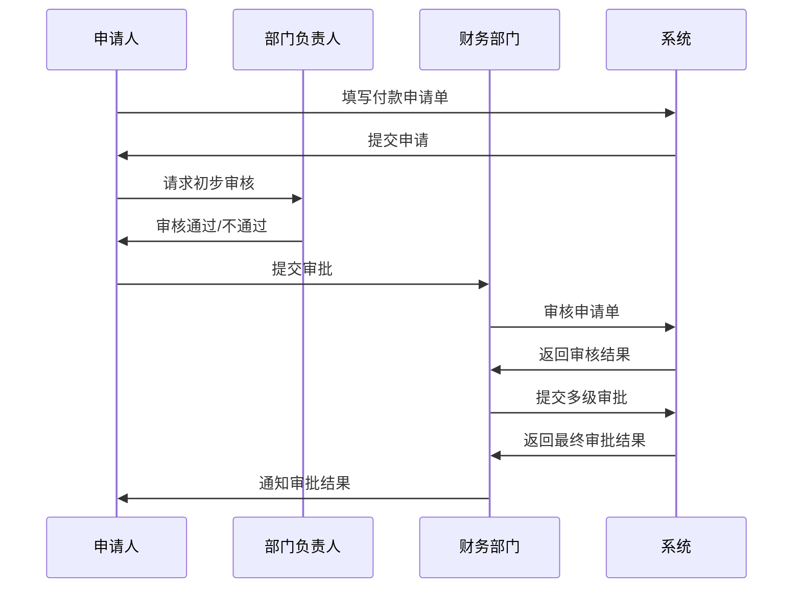
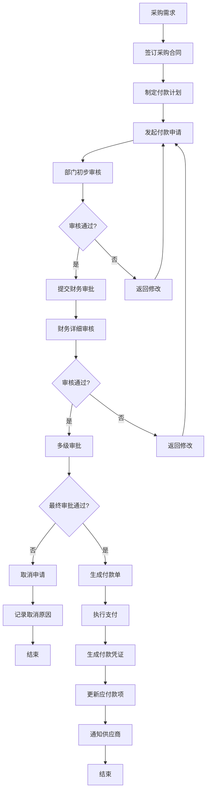

# 付款管理

<cite>
**本文档引用文件**  
- [PaymentApplyServiceImpl.java](file://eplus-module-scm/eplus-module-scm-biz/src/main/java/com/syj/eplus/module/scm/service/paymentapply/PaymentApplyServiceImpl.java)
- [PaymentServiceImpl.java](file://eplus-module-fms/eplus-module-fms-biz/src/main/java/com/syj/eplus/module/fms/service/payment/PaymentServiceImpl.java)
- [PurchaseContractServiceImpl.java](file://eplus-module-scm/eplus-module-scm-biz/src/main/java/com/syj/eplus/module/scm/service/purchasecontract/PurchaseContractServiceImpl.java)
- [V1_0_0_073__付款相关表.sql](file://eplus-flyway/src/main/resources/db/migration/common/V1_0_0_073__付款相关表.sql)
- [PaymentApplyApi.java](file://eplus-module-scm/eplus-module-scm-api/src/main/java/com/syj/eplus/module/scm/api/paymentapply/PaymentApplyApi.java)
- [PaymentApi.java](file://eplus-module-fms/eplus-module-fms-api/src/main/java/com/syj/eplus/module/fms/api/payment/api/payment/PaymentApi.java)
- [PaymentApplyAuditResultListener.java](file://eplus-module-scm/eplus-module-scm-biz/src/main/java/com/syj/eplus/module/scm/listener/paymentapply/PaymentApplyAuditResultListener.java)
- [PaymentAuditResultListener.java](file://eplus-module-fms/eplus-module-fms-biz/src/main/java/com/syj/eplus/module/fms/listener/payment/PaymentAuditResultListener.java)
</cite>

## 目录
1. [引言](#引言)
2. [付款申请流程](#付款申请流程)
3. [对公支付与供应商付款](#对公支付与供应商付款)
4. [付款单据的创建与审批](#付款单据的创建与审批)
5. [采购合同与应付款项的关联](#采购合同与应付款项的关联)
6. [币种处理与汇率转换](#币种处理与汇率转换)
7. [付款凭证生成规则](#付款凭证生成规则)
8. [风险控制措施](#风险控制措施)
9. [付款业务流程图](#付款业务流程图)
10. [结论](#结论)

## 引言
付款管理是企业财务管理中的核心环节，涵盖了付款申请、对公支付、供应商付款等多个方面。本文档旨在全面介绍付款管理的各项功能，详细说明付款单据的创建、审批和支付流程，解释付款与采购合同、应付款项的关联关系，并描述付款中的币种处理、汇率转换等财务规则。此外，还将提供付款业务流程图，展示从采购需求到供应商付款的完整流程，并包含付款凭证生成规则和风险控制措施。

## 付款申请流程
付款申请流程是企业内部资金流动的重要组成部分，确保了资金使用的合规性和透明度。该流程通常包括以下几个步骤：

1. **申请发起**：由相关部门或人员根据实际业务需求发起付款申请，填写必要的信息如付款金额、币种、收款方等。
2. **信息校验**：系统自动校验申请信息的完整性和准确性，例如检查币种是否匹配、金额是否合理等。
3. **审批流程**：申请提交后进入审批流程，经过多级审批（如部门经理、财务主管、总经理等）确认无误后方可继续。
4. **生成付款单**：审批通过后，系统自动生成正式的付款单，记录所有相关信息。
5. **支付执行**：财务部门根据付款单执行支付操作，将款项汇至指定账户。
6. **凭证生成**：支付完成后，系统生成相应的会计凭证，用于账务处理和审计。

在代码实现中，`PaymentApplyServiceImpl` 类负责处理付款申请的相关逻辑，包括创建、更新、删除付款申请以及提交审批任务等。

**Section sources**
- [PaymentApplyServiceImpl.java](file://eplus-module-scm/eplus-module-scm-biz/src/main/java/com/syj/eplus/module/scm/service/paymentapply/PaymentApplyServiceImpl.java#L158-L188)

## 对公支付与供应商付款
对公支付是指企业向其他公司或机构进行的资金支付，而供应商付款则是特指企业向其供应商支付货款的行为。两者都属于企业对外支付的一部分，但在具体操作上有所区别。

### 对公支付
对公支付通常涉及较大金额和复杂的审批流程。企业需要确保支付对象的合法性，支付用途的合规性，并保留完整的支付凭证以备查证。常见的对公支付场景包括但不限于：
- 支付供应商货款
- 支付服务费用
- 支付租金或物业管理费
- 支付税费

### 供应商付款
供应商付款是供应链管理中的关键环节，直接影响企业的采购成本和供应商关系。有效的供应商付款管理能够帮助企业优化现金流，提高采购效率。供应商付款的主要特点包括：
- **合同关联**：每笔供应商付款都应与具体的采购合同相对应，确保支付的准确性和可追溯性。
- **分期支付**：根据合同约定，供应商付款可能分为预付款、进度款和尾款等多个阶段。
- **发票匹配**：支付前需核对供应商提供的发票，确保金额、税率等信息一致。

在系统中，`PaymentServiceImpl` 类提供了处理对公支付和供应商付款的核心功能，包括创建付款单、更新审核状态、确认支付等。

**Section sources**
- [PaymentServiceImpl.java](file://eplus-module-fms/eplus-module-fms-biz/src/main/java/com/syj/eplus/module/fms/service/payment/PaymentServiceImpl.java#L124-L144)

## 付款单据的创建与审批
付款单据的创建与审批是付款管理中最关键的环节之一，直接关系到资金的安全和使用的合规性。以下是详细的创建与审批流程：

### 创建付款单据
1. **数据准备**：收集并整理付款所需的所有信息，包括付款金额、币种、收款方信息、付款事由等。
2. **单据填写**：在系统中填写付款申请单，输入上述信息，并上传相关附件（如合同、发票等）。
3. **初步审核**：申请人所在部门负责人对申请单进行初步审核，确认信息的真实性和合理性。
4. **提交审批**：通过初步审核后，将申请单提交至财务部门进行进一步审批。

### 审批流程
1. **财务审核**：财务部门对申请单进行详细审核，重点检查金额、币种、收款方等信息的准确性，以及是否有足够的预算支持此次支付。
2. **多级审批**：根据企业内部规定，申请单可能需要经过多个层级的审批，如财务主管、财务总监、总经理等。
3. **审批结果**：审批通过后，系统自动生成正式的付款单；若审批不通过，则返回给申请人修改或取消申请。

在代码层面，`PaymentApplyServiceImpl` 类中的 `createPaymentApply` 方法负责处理付款申请的创建逻辑，而 `submitTask` 方法则用于提交审批任务。



**Diagram sources**
- [PaymentApplyServiceImpl.java](file://eplus-module-scm/eplus-module-scm-biz/src/main/java/com/syj/eplus/module/scm/service/paymentapply/PaymentApplyServiceImpl.java#L158-L188)

**Section sources**
- [PaymentApplyServiceImpl.java](file://eplus-module-scm/eplus-module-scm-biz/src/main/java/com/syj/eplus/module/scm/service/paymentapply/PaymentApplyServiceImpl.java#L158-L188)

## 采购合同与应付款项的关联
采购合同与应付款项之间的关联是确保企业资金流动合理性和透明度的基础。通过建立明确的关联关系，可以有效避免重复支付、漏付等问题的发生。

### 关联方式
1. **合同编号关联**：每笔应付款项都应与一个具体的采购合同编号相对应，便于追踪和管理。
2. **付款计划关联**：采购合同中通常会包含详细的付款计划，规定了各阶段的付款时间和金额。应付款项应严格按照付款计划执行。
3. **发票匹配**：支付前需核对供应商提供的发票，确保发票金额、税率等信息与合同约定一致。

### 数据结构
在数据库设计中，`scm_payment_plan` 表用于存储采购合同的付款计划信息，包含字段如 `contract_code`（合同编号）、`step`（步骤）、`payment_ratio`（付款比例）、`receivable_amount`（应付金额）等。这些信息为应付款项的生成提供了依据。

```sql
CREATE TABLE `scm_payment_plan` (
    `id`                    bigint         NOT NULL AUTO_INCREMENT COMMENT '主键',
    `contract_code`         varchar(20)    NULL     DEFAULT NULL COMMENT '合同编号',
    `step`                  tinyint        NULL     DEFAULT NULL COMMENT '步骤',
    `payment_method`        tinyint        NULL     DEFAULT NULL COMMENT '支付方式',
    `date_type`             tinyint        NULL     DEFAULT NULL COMMENT '起始点',
    `start_date`            datetime       NULL     DEFAULT NULL COMMENT '起始日',
    `days`                  int            NOT NULL DEFAULT 0 COMMENT '天数',
    `expected_receipt_date` datetime       NULL     DEFAULT NULL COMMENT '预计付款日',
    `payment_ratio`         decimal(19, 6) NOT NULL DEFAULT 0.000000 COMMENT '付款比例',
    `receivable_amount`     json           NOT NULL DEFAULT (JSON_OBJECT()) COMMENT '应付金额',
    `received_amount`       json           NOT NULL DEFAULT (JSON_OBJECT()) COMMENT '实付金额',
    `control_purchase_flag` tinyint        NOT NULL DEFAULT 0 COMMENT '是否控制采购',
    `exe_status`            tinyint        NOT NULL DEFAULT 0 COMMENT '状态',
    `creator`               int UNSIGNED   NULL     DEFAULT NULL COMMENT '创建人',
    `create_time`           datetime       NULL     DEFAULT CURRENT_TIMESTAMP COMMENT '创建时间',
    `updater`               int UNSIGNED   NULL     DEFAULT NULL COMMENT '修改人',
    `deleted`               tinyint(1)     NOT NULL DEFAULT 0 COMMENT '删除',
    `update_time`           datetime       NULL     DEFAULT NULL ON UPDATE CURRENT_TIMESTAMP COMMENT '修改时间',
    `applied_amount`        json           NOT NULL DEFAULT (JSON_OBJECT()) COMMENT '已申请金额',
    PRIMARY KEY (`id`) USING BTREE
) ENGINE = InnoDB
  AUTO_INCREMENT = 58
  CHARACTER SET = utf8mb4
  COLLATE = utf8mb4_general_ci COMMENT = '采购合同付款计划'
  ROW_FORMAT = DYNAMIC;
```

**Diagram sources**
- [V1_0_0_073__付款相关表.sql](file://eplus-flyway/src/main/resources/db/migration/common/V1_0_0_073__付款相关表.sql#L112-L139)

**Section sources**
- [V1_0_0_073__付款相关表.sql](file://eplus-flyway/src/main/resources/db/migration/common/V1_0_0_073__付款相关表.sql#L112-L139)

## 币种处理与汇率转换
在跨国交易中，币种处理和汇率转换是不可避免的问题。正确的币种处理和汇率转换不仅影响到企业的财务报表，还直接关系到企业的利润和成本控制。

### 币种处理
1. **币种选择**：在创建付款申请时，必须明确选择支付币种。系统应支持多种常用币种，如人民币（CNY）、美元（USD）、欧元（EUR）等。
2. **币种校验**：系统自动校验所选币种是否与合同约定的币种一致，避免因币种错误导致的支付问题。
3. **币种显示**：在所有相关单据和报表中，应清晰显示币种信息，确保信息的透明度。

### 汇率转换
1. **汇率获取**：系统应能实时获取最新的汇率信息，通常通过与外部汇率服务接口对接实现。
2. **汇率应用**：在进行跨币种支付时，系统根据当前汇率自动计算转换后的金额，并在单据中明确标注。
3. **汇率记录**：每次汇率转换都应被记录下来，包括转换时间、汇率值、转换前后金额等，以便后续审计和查询。

在代码实现中，`PurchaseContractServiceImpl` 类中的 `isCurrencyMatching` 方法用于校验币种是否匹配，而 `changeCurrency` 方法则负责进行汇率转换。

**Section sources**
- [PurchaseContractServiceImpl.java](file://eplus-module-scm/eplus-module-scm-biz/src/main/java/com/syj/eplus/module/scm/service/purchasecontract/PurchaseContractServiceImpl.java#L1278-L1281)

## 付款凭证生成规则
付款凭证是企业财务核算的重要依据，记录了每一笔支付的具体信息。合理的付款凭证生成规则有助于提高财务管理的规范性和效率。

### 凭证生成条件
1. **支付完成**：只有当支付操作成功完成后，系统才会生成相应的付款凭证。
2. **信息完整**：生成凭证前，必须确保所有相关信息（如付款金额、币种、收款方、付款事由等）均已准确无误地录入系统。
3. **审批通过**：付款申请必须经过完整的审批流程并获得最终批准后，才能生成凭证。

### 凭证内容
1. **基本信息**：包括凭证编号、生成时间、制单人等。
2. **支付信息**：包括付款金额、币种、收款方名称、银行账号等。
3. **关联信息**：包括对应的采购合同编号、发票编号等。
4. **备注说明**：可添加额外的备注信息，如支付事由、特殊说明等。

### 凭证管理
1. **凭证查询**：提供便捷的凭证查询功能，支持按凭证编号、日期、金额等条件进行搜索。
2. **凭证导出**：支持将凭证导出为Excel或其他格式文件，便于存档和分享。
3. **凭证修改**：对于已生成的凭证，若发现错误，可通过特定流程进行修改或作废。

**Section sources**
- [PaymentServiceImpl.java](file://eplus-module-fms/eplus-module-fms-biz/src/main/java/com/syj/eplus/module/fms/service/payment/PaymentServiceImpl.java#L295-L331)

## 风险控制措施
为了保障企业资金安全，防止欺诈和错误支付，必须采取一系列风险控制措施。以下是主要的风险控制策略：

### 权限控制
1. **角色划分**：根据不同岗位职责，设置不同的系统操作权限，确保只有授权人员才能执行关键操作。
2. **审批权限**：审批流程中，各级审批人的权限应严格限定，避免越权审批。
3. **操作日志**：记录所有用户的操作行为，包括登录、修改、审批等，便于事后追溯和审计。

### 流程控制
1. **多级审批**：实行多级审批制度，确保每笔支付都经过充分审核。
2. **异常预警**：设置异常支付预警机制，如大额支付、频繁支付等，及时发现潜在风险。
3. **定期审计**：定期对支付记录进行内部审计，检查是否存在违规行为。

### 技术手段
1. **加密传输**：采用SSL/TLS等加密技术，确保数据在传输过程中的安全性。
2. **双重验证**：对于重要操作，如大额支付，实施双重验证机制，如短信验证码、指纹识别等。
3. **备份恢复**：定期备份系统数据，确保在发生故障时能够快速恢复。

**Section sources**
- [PaymentApplyServiceImpl.java](file://eplus-module-scm/eplus-module-scm-biz/src/main/java/com/syj/eplus/module/scm/service/paymentapply/PaymentApplyServiceImpl.java#L540-L547)
- [PaymentServiceImpl.java](file://eplus-module-fms/eplus-module-fms-biz/src/main/java/com/syj/eplus/module/fms/service/payment/PaymentServiceImpl.java#L268-L276)

## 付款业务流程图
以下流程图展示了从采购需求到供应商付款的完整流程，涵盖了各个环节的关键步骤和决策点。



**Diagram sources**
- [PaymentApplyServiceImpl.java](file://eplus-module-scm/eplus-module-scm-biz/src/main/java/com/syj/eplus/module/scm/service/paymentapply/PaymentApplyServiceImpl.java#L158-L188)
- [PaymentServiceImpl.java](file://eplus-module-fms/eplus-module-fms-biz/src/main/java/com/syj/eplus/module/fms/service/payment/PaymentServiceImpl.java#L124-L144)

## 结论
付款管理是企业财务管理中不可或缺的一部分，涉及多个环节和复杂的业务流程。通过建立健全的付款管理制度，采用先进的信息技术手段，可以有效提升企业的资金使用效率，降低财务风险。本文档详细介绍了付款管理的各项功能和流程，希望能为企业提供有价值的参考和指导。