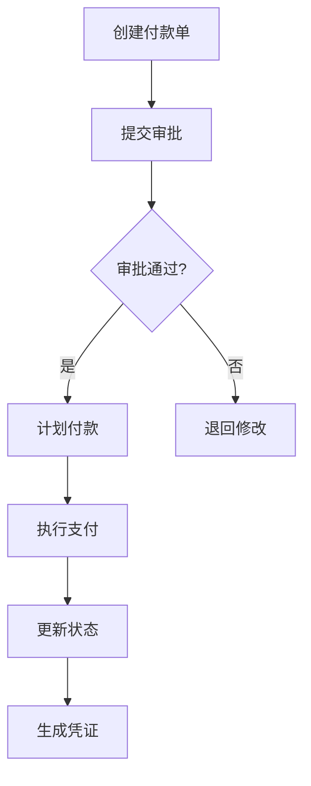
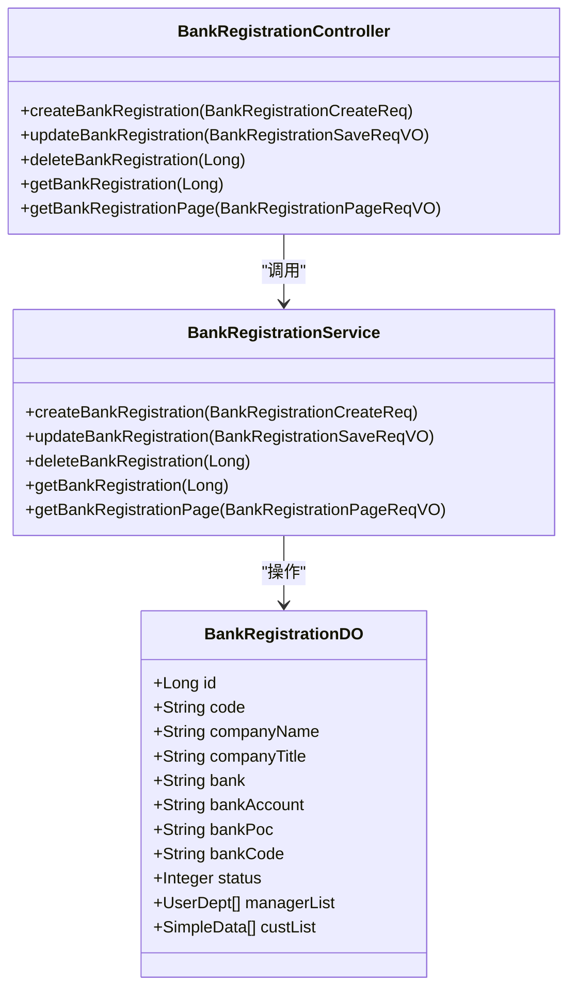
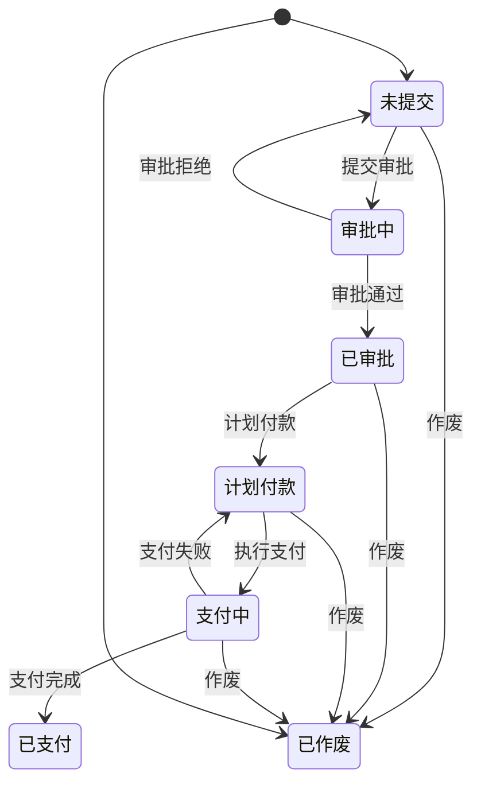
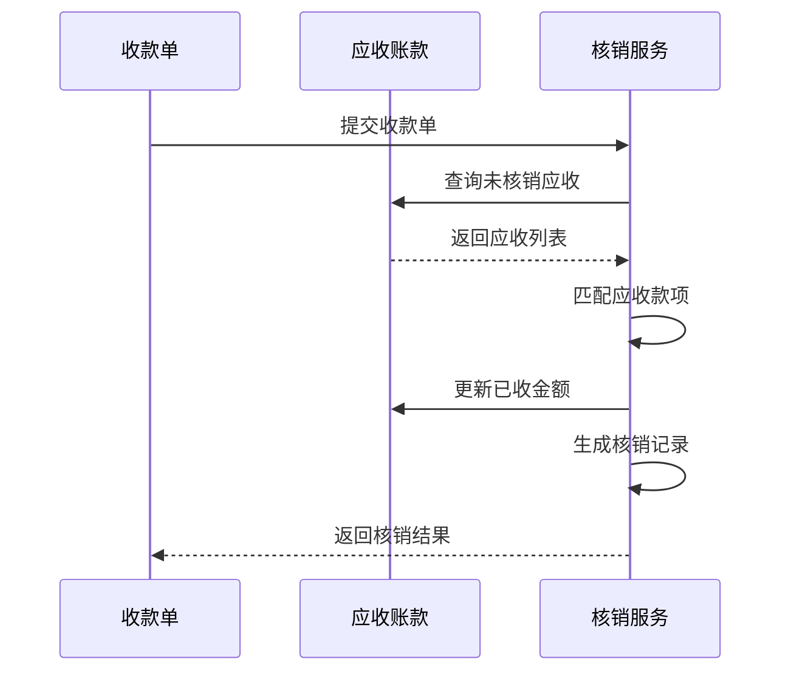
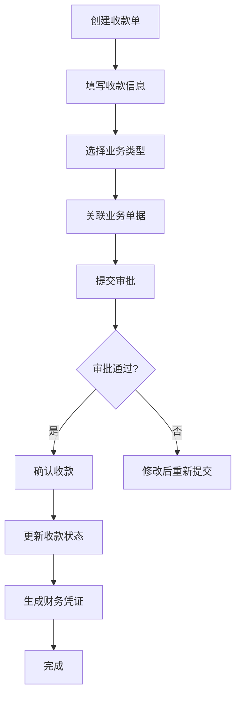
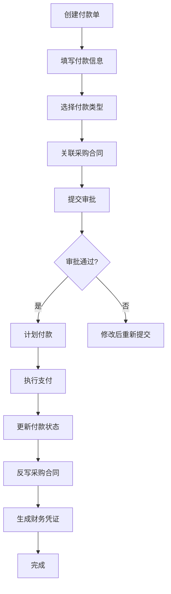

# 收付款管理

<cite>
**本文档引用文件**  
- [ReceiptController.java](file://eplus-module-fms/eplus-module-fms-biz/src/main/java/com/syj/eplus/module/fms/controller/admin/receipt/ReceiptController.java)
- [PaymentController.java](file://eplus-module-fms/eplus-module-fms-biz/src/main/java/com/syj/eplus/module/fms/controller/admin/payment/PaymentController.java)
- [BankRegistrationController.java](file://eplus-module-fms/eplus-module-fms-biz/src/main/java/com/syj/eplus/module/fms/controller/admin/bankregistration/BankRegistrationController.java)
- [ReceiptServiceImpl.java](file://eplus-module-fms/eplus-module-fms-biz/src/main/java/com/syj/eplus/module/fms/service/receipt/ReceiptServiceImpl.java)
- [PaymentServiceImpl.java](file://eplus-module-fms/eplus-module-fms-biz/src/main/java/com/syj/eplus/module/fms/service/payment/PaymentServiceImpl.java)
- [BankRegistrationServiceImpl.java](file://eplus-module-fms/eplus-module-fms-biz/src/main/java/com/syj/eplus/module/fms/service/bankregistration/BankRegistrationServiceImpl.java)
- [ReceiptDO.java](file://eplus-module-fms/eplus-module-fms-biz/src/main/java/com/syj/eplus/module/fms/dal/dataobject/receipt/ReceiptDO.java)
- [PaymentDO.java](file://eplus-module-fms/eplus-module-fms-biz/src/main/java/com/syj/eplus/module/fms/dal/dataobject/payment/PaymentDO.java)
- [BankRegistrationDO.java](file://eplus-module-fms/eplus-module-fms-biz/src/main/java/com/syj/eplus/module/fms/dal/dataobject/bankregistration/BankRegistrationDO.java)
- [CurrencyUtil.java](file://eplus-framework/eplus-common/src/main/java/com/syj/eplus/framework/common/util/CurrencyUtil.java)
- [V1_0_0_073__付款相关表.sql](file://eplus-flyway/src/main/resources/db/migration/common/V1_0_0_073__付款相关表.sql)
- [V1_0_0_002__Eplus初始化.sql](file://eplus-flyway/src/main/resources/db/migration/common/V1_0_0_002__Eplus初始化.sql)
</cite>

## 目录
1. [收付款管理概述](#收付款管理概述)
2. [核心功能详解](#核心功能详解)
3. [基础设置管理](#基础设置管理)
4. [审批流程与状态管理](#审批流程与状态管理)
5. [关联核销逻辑](#关联核销逻辑)
6. [财务规则处理](#财务规则处理)
7. [业务流程图](#业务流程图)
8. [凭证生成与风险控制](#凭证生成与风险控制)

## 收付款管理概述

收付款管理系统是企业财务管理的核心模块，主要负责企业资金的流入和流出管理。系统通过收款登记、付款申请、对公支付等核心功能，实现对企业资金流动的全面管控。该系统与应收应付、采购合同、报销借款等业务模块紧密集成，确保财务数据的一致性和准确性。

系统采用微服务架构，主要由FMS（财务管理系统）模块实现核心功能，通过API接口与其他业务模块进行数据交互。系统支持多币种、多汇率的复杂财务场景，具备完善的审批流程和风险控制机制。

**Section sources**
- [ReceiptController.java](file://eplus-module-fms/eplus-module-fms-biz/src/main/java/com/syj/eplus/module/fms/controller/admin/receipt/ReceiptController.java)
- [PaymentController.java](file://eplus-module-fms/eplus-module-fms-biz/src/main/java/com/syj/eplus/module/fms/controller/admin/payment/PaymentController.java)

## 核心功能详解

### 收款登记

收款登记功能用于记录企业收到的各种款项，包括客户回款、退款收入等。系统通过`ReceiptController`提供创建、更新、删除和查询财务收款单的API接口。

收款单包含以下核心信息：
- **收款金额**：支持多币种，通过`JsonAmount`对象存储金额和币种信息
- **收款时间**：记录实际收款的日期和时间
- **收款方式**：定义款项的收款渠道
- **业务类型**：标识收款单关联的业务类型（如还款、退款等）
- **业务编号**：关联具体业务单据的编号
- **支付对象**：记录款项来源的客户或个人

系统支持通过工作流引擎进行审批，收款单创建后可提交审批流程，审批通过后可进行收款确认操作。

### 付款申请

付款申请功能用于管理企业对外支付的请求，包括供应商付款、报销支付、借款归还等。系统通过`PaymentController`提供完整的付款单管理接口。

付款单包含以下核心信息：
- **申请支付金额**：支持多币种的支付金额
- **付款方式**：定义支付的具体方式
- **银行信息**：包括开户行、银行账号等支付所需信息
- **业务类型**：标识付款单关联的业务类型
- **业务编号**：关联具体业务单据的编号
- **支付对象**：记录款项支付给的供应商或个人

付款申请支持批量创建和批量处理，提高财务人员的工作效率。

### 对公支付

对公支付功能是付款流程的最终执行环节，当付款申请审批通过后，财务人员可进行对公支付操作。系统支持单笔支付和批量支付两种模式。

支付确认操作会更新付款单的状态为"已支付"，并记录支付日期、出纳员等信息。系统同时会反写关联业务单据的支付状态，确保数据一致性。



**Diagram sources**
- [PaymentServiceImpl.java](file://eplus-module-fms/eplus-module-fms-biz/src/main/java/com/syj/eplus/module/fms/service/payment/PaymentServiceImpl.java)
- [PaymentDO.java](file://eplus-module-fms/eplus-module-fms-biz/src/main/java/com/syj/eplus/module/fms/dal/dataobject/payment/PaymentDO.java)

**Section sources**
- [PaymentController.java](file://eplus-module-fms/eplus-module-fms-biz/src/main/java/com/syj/eplus/module/fms/controller/admin/payment/PaymentController.java)
- [PaymentServiceImpl.java](file://eplus-module-fms/eplus-module-fms-biz/src/main/java/com/syj/eplus/module/fms/service/payment/PaymentServiceImpl.java)

## 基础设置管理

### 收款对象管理

收款对象管理功能用于维护可接收款项的客户、供应商和个人信息。系统通过`CustApi`和`VenderApi`接口获取客户和供应商信息。

收款对象信息包括：
- **客户/供应商编码**：唯一标识收款对象
- **名称**：收款对象的全称
- **银行账户信息**：包括开户行、银行账号、账户名称等
- **业务员**：负责该收款对象的业务人员

系统支持通过银行登记功能批量导入收款对象的银行信息。

### 收款方式配置

收款方式配置是系统的基础数据，定义了企业可接受的各种收款渠道。收款方式通过字典表进行管理，常见的收款方式包括：
- 银行转账
- 现金支付
- 支票支付
- 第三方支付平台

每种收款方式可配置相应的处理规则和限制条件。

### 银行登记

银行登记功能用于管理企业合作银行的信息，为收付款操作提供银行数据支持。系统通过`BankRegistrationController`提供银行登记的完整管理功能。

银行登记信息包括：
- **银行名称**：合作银行的全称
- **银行行号**：银行的唯一识别代码
- **开户行地址**：银行的具体营业地址
- **联系人**：银行对接人员信息
- **公司抬头**：企业在该银行开户的公司名称

系统支持通过银行联系人快速查询银行归属信息，提高数据录入效率。



**Diagram sources**
- [BankRegistrationDO.java](file://eplus-module-fms/eplus-module-fms-biz/src/main/java/com/syj/eplus/module/fms/dal/dataobject/bankregistration/BankRegistrationDO.java)
- [BankRegistrationServiceImpl.java](file://eplus-module-fms/eplus-module-fms-biz/src/main/java/com/syj/eplus/module/fms/service/bankregistration/BankRegistrationServiceImpl.java)
- [BankRegistrationController.java](file://eplus-module-fms/eplus-module-fms-biz/src/main/java/com/syj/eplus/module/fms/controller/admin/bankregistration/BankRegistrationController.java)

**Section sources**
- [BankRegistrationController.java](file://eplus-module-fms/eplus-module-fms-biz/src/main/java/com/syj/eplus/module/fms/controller/admin/bankregistration/BankRegistrationController.java)
- [BankRegistrationServiceImpl.java](file://eplus-module-fms/eplus-module-fms-biz/src/main/java/com/syj/eplus/module/fms/service/bankregistration/BankRegistrationServiceImpl.java)

## 审批流程与状态管理

### 审批流程

收付款系统集成了工作流引擎，实现灵活的审批流程管理。所有收付款单据都支持自定义审批流程，确保资金流动的安全性。

审批流程主要包括以下环节：
1. **提交审批**：创建收付款单后，可提交至审批流程
2. **审批处理**：审批人可在系统中查看单据详情并进行审批操作
3. **审批结果**：系统记录审批结果和审批人信息
4. **状态更新**：根据审批结果更新单据状态

系统通过`BpmProcessInstanceApi`与工作流引擎交互，实现审批流程的创建、审批和拒绝操作。

### 状态管理机制

收付款单据具有完整的生命状态周期，系统通过状态字段管理单据的处理进度。

#### 收款单状态
- **未提交**：单据创建但未提交审批
- **审批中**：单据已提交，正在审批流程中
- **已审批**：审批流程已完成
- **已收款**：已完成收款操作
- **已作废**：单据被取消

#### 付款单状态
- **未提交**：单据创建但未提交审批
- **审批中**：单据已提交，正在审批流程中
- **已审批**：审批流程已完成
- **计划付款**：已确定付款计划
- **支付中**：正在执行支付操作
- **已支付**：已完成支付操作
- **已作废**：单据被取消

状态管理确保了收付款流程的可追溯性和数据一致性。



**Diagram sources**
- [PaymentDO.java](file://eplus-module-fms/eplus-module-fms-biz/src/main/java/com/syj/eplus/module/fms/dal/dataobject/payment/PaymentDO.java)
- [PaymentServiceImpl.java](file://eplus-module-fms/eplus-module-fms-biz/src/main/java/com/syj/eplus/module/fms/service/payment/PaymentServiceImpl.java)

**Section sources**
- [ReceiptServiceImpl.java](file://eplus-module-fms/eplus-module-fms-biz/src/main/java/com/syj/eplus/module/fms/service/receipt/ReceiptServiceImpl.java)
- [PaymentServiceImpl.java](file://eplus-module-fms/eplus-module-fms-biz/src/main/java/com/syj/eplus/module/fms/service/payment/PaymentServiceImpl.java)

## 关联核销逻辑

收付款系统与应收应付模块紧密集成，实现自动化的关联核销功能。

### 收款核销

当客户回款时，系统可将收款单与应收账款进行核销。核销逻辑如下：
1. 根据客户编码和业务类型查找未核销的应收账款
2. 按照先进先出原则匹配应收款项
3. 更新应收款项的已收金额和核销状态
4. 生成核销记录

系统支持部分核销和全额核销两种模式，确保财务数据的准确性。

### 付款核销

当向供应商付款时，系统可将付款单与应付账款进行核销。核销逻辑如下：
1. 根据供应商编码和业务类型查找未核销的应付账款
2. 按照采购合同或发票匹配应付款项
3. 更新应付款项的已付金额和核销状态
4. 生成核销记录

付款核销完成后，系统会反写采购合同的已支付金额，实现采购与财务的数据联动。



**Diagram sources**
- [ReceiptServiceImpl.java](file://eplus-module-fms/eplus-module-fms-biz/src/main/java/com/syj/eplus/module/fms/service/receipt/ReceiptServiceImpl.java)
- [PaymentServiceImpl.java](file://eplus-module-fms/eplus-module-fms-biz/src/main/java/com/syj/eplus/module/fms/service/payment/PaymentServiceImpl.java)

**Section sources**
- [ReceiptServiceImpl.java](file://eplus-module-fms/eplus-module-fms-biz/src/main/java/com/syj/eplus/module/fms/service/receipt/ReceiptServiceImpl.java)
- [PaymentServiceImpl.java](file://eplus-module-fms/eplus-module-fms-biz/src/main/java/com/syj/eplus/module/fms/service/payment/PaymentServiceImpl.java)

## 财务规则处理

### 汇率处理

系统支持多币种交易的汇率处理，确保外币收付款的准确性。汇率处理规则如下：

1. **实时汇率**：系统支持在收付款单中记录实时汇率
2. **汇率转换**：通过`CurrencyUtil`工具类实现币种金额的转换
3. **汇率来源**：汇率数据可从外部系统获取或手动录入

```java
// 币种转换示例
public static JsonAmount changeCurrency(JsonAmount amount, String currency, Map<String, BigDecimal> dailyRateMap) {
    if (StrUtil.isEmpty(currency) || amount == null) {
        return amount;
    }
    if (CollUtil.isEmpty(dailyRateMap)) {
        throw exception(RATE_NOT_EXISTS);
    }
    String baseCurrency = amount.getCurrency();
    BigDecimal baseAmount = amount.getAmount();
    if (baseAmount == null || baseAmount.compareTo(BigDecimal.ZERO) == CalculationDict.ZERO) {
        return amount;
    }
    if (currency.equals(baseCurrency)) {
        return amount;
    }
    BigDecimal baseRate = dailyRateMap.get(baseCurrency);
    BigDecimal rate = dailyRateMap.get(currency);
    BigDecimal resultAmount = NumberUtil.div(NumberUtil.mul(baseAmount, baseRate), rate);
    return new JsonAmount().setAmount(resultAmount).setCurrency(currency);
}
```

### 币种转换

系统支持多种币种的收付款操作，包括人民币、美元、欧元等。币种转换遵循以下规则：
- 所有金额均以`JsonAmount`对象存储，包含金额值和币种代码
- 系统支持在单据中同时显示本位币和外币金额
- 报表统计时可按指定币种进行汇总

**Section sources**
- [CurrencyUtil.java](file://eplus-framework/eplus-common/src/main/java/com/syj/eplus/framework/common/util/CurrencyUtil.java)
- [ReceiptDO.java](file://eplus-module-fms/eplus-module-fms-biz/src/main/java/com/syj/eplus/module/fms/dal/dataobject/receipt/ReceiptDO.java)
- [PaymentDO.java](file://eplus-module-fms/eplus-module-fms-biz/src/main/java/com/syj/eplus/module/fms/dal/dataobject/payment/PaymentDO.java)

## 业务流程图

### 收款业务流程



### 付款业务流程



**Diagram sources**
- [ReceiptController.java](file://eplus-module-fms/eplus-module-fms-biz/src/main/java/com/syj/eplus/module/fms/controller/admin/receipt/ReceiptController.java)
- [PaymentController.java](file://eplus-module-fms/eplus-module-fms-biz/src/main/java/com/syj/eplus/module/fms/controller/admin/payment/PaymentController.java)

**Section sources**
- [ReceiptServiceImpl.java](file://eplus-module-fms/eplus-module-fms-biz/src/main/java/com/syj/eplus/module/fms/service/receipt/ReceiptServiceImpl.java)
- [PaymentServiceImpl.java](file://eplus-module-fms/eplus-module-fms-biz/src/main/java/com/syj/eplus/module/fms/service/payment/PaymentServiceImpl.java)

## 凭证生成与风险控制

### 凭证生成规则

收付款操作完成后，系统自动生成相应的财务凭证，确保账务处理的及时性和准确性。

凭证生成规则如下：
1. **凭证类型**：根据收付款类型生成收款凭证或付款凭证
2. **会计科目**：根据业务类型自动匹配会计科目
3. **金额**：以实际收付款金额为准
4. **币种**：保持与收付款单一致的币种
5. **辅助核算**：包含客户、供应商、项目等辅助信息

凭证生成后，可同步至总账系统，实现财务数据的无缝对接。

### 风险控制措施

系统实施多层次的风险控制措施，确保资金安全：

1. **权限控制**：严格的角色权限管理，确保只有授权人员可执行关键操作
2. **审批控制**：所有收付款操作必须经过审批流程
3. **状态控制**：已支付的单据不可修改或删除
4. **日志审计**：记录所有关键操作的日志，便于追溯
5. **数据校验**：对输入数据进行完整性校验，防止错误数据录入
6. **作废控制**：已支付的付款单不可作废，防止资金风险

系统还支持设置支付限额、黑名单管理等高级风险控制功能，全面保障企业资金安全。

**Section sources**
- [ReceiptServiceImpl.java](file://eplus-module-fms/eplus-module-fms-biz/src/main/java/com/syj/eplus/module/fms/service/receipt/ReceiptServiceImpl.java)
- [PaymentServiceImpl.java](file://eplus-module-fms/eplus-module-fms-biz/src/main/java/com/syj/eplus/module/fms/service/payment/PaymentServiceImpl.java)