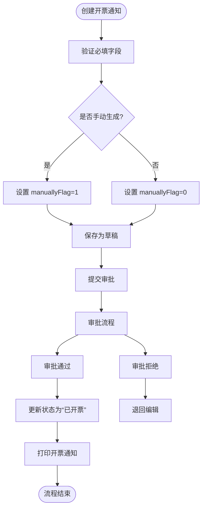
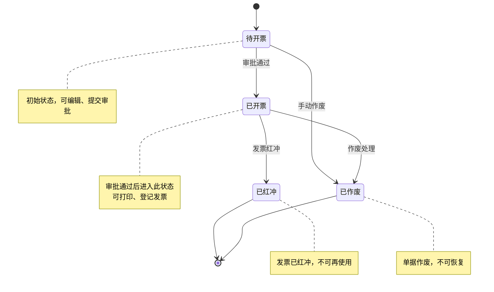
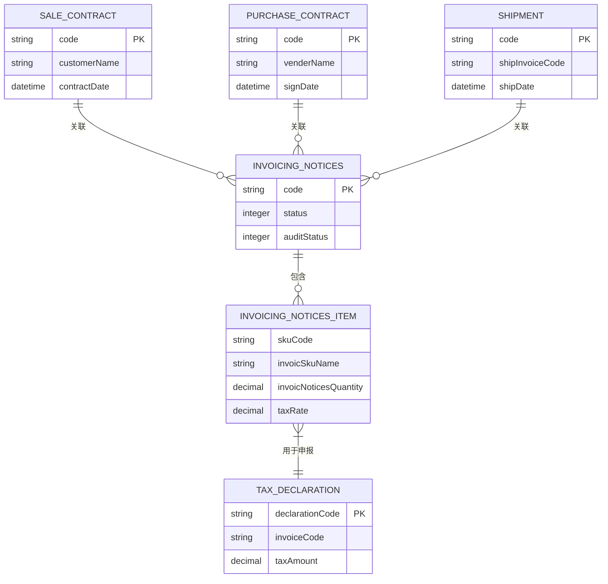
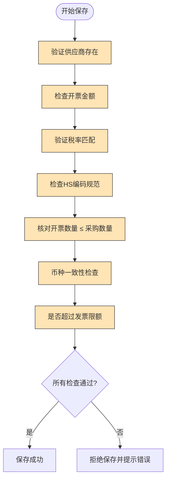

# 开票管理

<cite>
**本文档引用的文件**  
- [InvoicingNoticesApi.java](file://eplus-module-scm/eplus-module-scm-api/src/main/java/com/syj/eplus/module/scm/api/invoicingnotices/InvoicingNoticesApi.java)
- [InvoicingNoticesDTO.java](file://eplus-module-scm/eplus-module-scm-api/src/main/java/com/syj/eplus/module/scm/api/invoicingnotices/dto/InvoicingNoticesDTO.java)
- [InvoicingNoticesItemDTO.java](file://eplus-module-scm/eplus-module-scm-api/src/main/java/com/syj/eplus/module/scm/api/invoicingnotices/dto/InvoicingNoticesItemDTO.java)
- [InvoicingNoticesService.java](file://eplus-module-scm/eplus-module-scm-biz/src/main/java/com/syj/eplus/module/scm/service/invoicingnotices/InvoicingNoticesService.java)
- [InvoicingNoticesController.java](file://eplus-module-scm/eplus-module-scm-biz/src/main/java/com/syj/eplus/module/scm/controller/admin/invoicingnotices/InvoicingNoticesController.java)
- [InvoicingNoticesDO.java](file://eplus-module-scm/eplus-module-scm-biz/src/main/java/com/syj/eplus/module/scm/dal/dataobject/invoicingnotices/InvoicingNoticesDO.java)
- [InvoicingNoticesItem.java](file://eplus-module-scm/eplus-module-scm-biz/src/main/java/com/syj/eplus/module/scm/dal/dataobject/invoicingnoticesItem/InvoicingNoticesItem.java)
- [InvoicingNoticesConvert.java](file://eplus-module-scm/eplus-module-scm-biz/src/main/java/com/syj/eplus/module/scm/convert/invoicingnotices/InvoicingNoticesConvert.java)
</cite>

## 目录
1. [简介](#简介)
2. [开票通知单功能概述](#开票通知单功能概述)
3. [核心字段定义](#核心字段定义)
4. [开票通知单状态流转机制](#开票通知单状态流转机制)
5. [与销售合同、出运明细、税务申报的关联关系](#与销售合同出运明细税务申报的关联关系)
6. [开票数据合规性检查](#开票数据合规性检查)
7. [开票管理界面操作指南](#开票管理界面操作指南)
8. [常见问题解决方案](#常见问题解决方案)

## 简介
本系统中的开票管理模块主要用于处理采购环节中的开票通知流程，支持从创建、编辑、审批到查询的全生命周期管理。该功能通过与采购合同、出运明细、供应商信息等模块的集成，实现自动化和手动两种方式生成开票通知单，并确保开票数据符合财务和税务合规要求。

## 开票通知单功能概述

开票通知单是采购业务中用于向供应商发出开票请求的核心单据。系统支持通过API接口批量创建开票通知，也可在管理后台进行单条创建、修改、删除、审批和作废操作。开票通知单可关联出运单、采购合同及销售合同，确保开票信息与实际业务一致。

主要功能包括：
- 创建/编辑开票通知单
- 提交审批流程
- 审批通过或拒绝
- 打印与合并打印
- 查询与导出
- 作废处理

**开票通知单创建与审批流程如下：**

**图示来源**
- [InvoicingNoticesController.java](file://eplus-module-scm/eplus-module-scm-biz/src/main/java/com/syj/eplus/module/scm/controller/admin/invoicingnotices/InvoicingNoticesController.java#L42-L48)
- [InvoicingNoticesService.java](file://eplus-module-scm/eplus-module-scm-biz/src/main/java/com/syj/eplus/module/scm/service/invoicingnotices/InvoicingNoticesService.java#L26-L33)

## 核心字段定义

### 开票通知主表字段（InvoicingNoticesDO）

| 字段名 | 中文名称 | 数据类型 | 是否必填 | 说明 |
|--------|--------|--------|--------|------|
| id | 主键 | Long | 是 | 唯一标识 |
| code | 编号 | String | 否 | 系统自动生成 |
| companyId | 归属公司主键 | Long | 是 | 关联公司信息 |
| companyName | 归属公司名称 | String | 是 | 显示用 |
| inputUser | 录入人 | UserDept | 否 | 包含用户和部门信息 |
| inputDate | 录入日期 | LocalDateTime | 否 | 自动生成 |
| venderCode | 供应商编号 | String | 是 | 外键关联供应商 |
| venderName | 供应商名称 | String | 是 | 显示用 |
| manager | 跟单员 | UserDept | 是 | 负责人信息 |
| shipmentCode | 出运单号 | String | 否 | 关联出运单 |
| invoiceCode | 出运发票号 | String | 否 | 实际发票编号 |
| shipDate | 出运日期 | LocalDateTime | 否 | 出运时间 |
| printFlag | 打印状态 | Integer | 是 | 0=未打印，1=已打印 |
| purOrderCode | 采购单号 | String | 是 | 关联采购订单 |
| status | 状态 | Integer | 是 | 1=待开票，2=已开票，3=已红冲，4=已作废 |
| manuallyFlag | 是否手动生成 | Integer | 是 | 1=是，0=否 |
| sourceType | 开票来源类型 | Integer | 否 | 标识数据来源 |
| linkCodeList | 链路编号列表 | List<String> | 否 | 用于追踪业务链路 |
| auditStatus | 审核状态 | Integer | 否 | 审批流程状态 |
| processInstanceId | 流程实例ID | String | 否 | BPM流程实例编号 |
| registrationDate | 登票日期 | LocalDateTime | 否 | 发票登记时间 |

### 开票通知明细字段（InvoicingNoticesItem）

| 字段名 | 中文名称 | 数据类型 | 是否必填 | 说明 |
|--------|--------|--------|--------|------|
| purchaseContractCode | 采购合同号 | String | 是 | 关联采购合同 |
| purchaseSortNum | 采购序号 | Integer | 是 | 合同内序号 |
| skuCode | 产品编号 | String | 是 | 商品编码 |
| cskuCode | 客户货号 | String | 否 | 客户指定编号 |
| declarationQuantity | 报关数量 | Integer | 否 | 用于报关申报 |
| hsCode | HS编码 | String | 否 | 海关商品编码 |
| invoicNoticesQuantity | 通知开票数量 | BigDecimal | 是 | 需开票的数量 |
| hsMeasureUnit | 海关计量单位 | String | 否 | 报关单位 |
| invoicSkuName | 开票品名 | String | 是 | 发票上显示的品名 |
| invoicPrice | 开票单价 | BigDecimal | 是 | 不含税单价 |
| inveicRegisteredStatus | 发票登记状态 | Integer | 否 | 登记状态 |
| inveicRegisteredQuantity | 已登记数量 | Integer | 否 | 已完成登记的数量 |
| purchaseWithTaxPrice | 采购含税单价 | JsonAmount | 是 | 包含币种和金额 |
| purchaseCurrency | 采购币种 | String | 是 | 如CNY、USD等 |
| custName | 客户名称 | String | 否 | 销售客户名称 |
| custCode | 客户编号 | String | 否 | 销售客户编号 |
| saleContractCode | 销售合同编号 | String | 否 | 关联销售合同 |
| taxRate | 税率 | BigDecimal | 是 | 如13%、9%等 |
| specificationList | 规格列表 | List<JsonSpecificationEntity> | 否 | 商品规格信息 |
| splitBoxFlag | 是否分箱 | Integer | 否 | 1=是，0=否 |
| qtyPerOuterbox | 外箱装量 | Integer | 否 | 每箱包装数量 |

**字段定义来源**
- [InvoicingNoticesDTO.java](file://eplus-module-scm/eplus-module-scm-api/src/main/java/com/syj/eplus/module/scm/api/invoicingnotices/dto/InvoicingNoticesDTO.java)
- [InvoicingNoticesItemDTO.java](file://eplus-module-scm/eplus-module-scm-api/src/main/java/com/syj/eplus/module/scm/api/invoicingnotices/dto/InvoicingNoticesItemDTO.java)
- [InvoicingNoticesDO.java](file://eplus-module-scm/eplus-module-scm-biz/src/main/java/com/syj/eplus/module/scm/dal/dataobject/invoicingnotices/InvoicingNoticesDO.java)
- [InvoicingNoticesItem.java](file://eplus-module-scm/eplus-module-scm-biz/src/main/java/com/syj/eplus/module/scm/dal/dataobject/invoicingnoticesItem/InvoicingNoticesItem.java)

## 开票通知单状态流转机制

开票通知单具有明确的状态生命周期，确保业务流程的可控性和可追溯性。

状态码说明：
- **1 = 待开票**：草稿或审批中状态，允许编辑
- **2 = 已开票**：审批通过，可打印发票
- **3 = 已红冲**：发票已红冲，需重新开票
- **4 = 已作废**：单据作废，不可继续使用

发票号码由系统根据规则自动生成，通常格式为：IN-{年}{月}{日}-{序列号}，例如 IN-20240115-001。生成逻辑在服务层实现，确保唯一性。

**状态流转来源**
- [InvoicingNoticesDO.java](file://eplus-module-scm/eplus-module-scm-biz/src/main/java/com/syj/eplus/module/scm/dal/dataobject/invoicingnotices/InvoicingNoticesDO.java#L94)
- [InvoicingNoticesService.java](file://eplus-module-scm/eplus-module-scm-biz/src/main/java/com/syj/eplus/module/scm/service/invoicingnotices/InvoicingNoticesService.java#L95)

## 与销售合同、出运明细、税务申报的关联关系

开票通知单作为采购与财务之间的桥梁，与多个业务模块紧密关联：

具体关联逻辑如下：
- **销售合同**：通过 `saleContractCode` 字段关联，确保采购商品与销售订单一致
- **出运明细**：通过 `shipmentCode` 和 `shipInvoiceCode` 关联，确保开票数量与实际出运一致
- **税务申报**：开票数据（金额、税率、商品编码）直接用于增值税申报，确保税务合规

**关联关系来源**
- [InvoicingNoticesItem.java](file://eplus-module-scm/eplus-module-scm-biz/src/main/java/com/syj/eplus/module/scm/dal/dataobject/invoicingnoticesItem/InvoicingNoticesItem.java#L94)
- [InvoicingNoticesDO.java](file://eplus-module-scm/eplus-module-scm-biz/src/main/java/com/syj/eplus/module/scm/dal/dataobject/invoicingnotices/InvoicingNoticesDO.java#L74)

## 开票数据合规性检查

系统在创建和保存开票通知时，执行多项合规性检查，确保数据准确性和合法性：

具体检查项包括：
1. **发票限额检查**：单张发票金额不得超过税务规定的上限
2. **税率匹配**：商品HS编码对应的税率必须与开票税率一致
3. **商品编码规范**：HS编码必须符合海关标准，且在系统中有备案
4. **数量控制**：开票数量不得超过采购合同约定数量
5. **币种一致性**：采购币种与开票币种需匹配或可换算

**合规性检查来源**
- [InvoicingNoticesService.java](file://eplus-module-scm/eplus-module-scm-biz/src/main/java/com/syj/eplus/module/scm/service/invoicingnotices/InvoicingNoticesService.java)
- [InvoicingNoticesItem.java](file://eplus-module-scm/eplus-module-scm-biz/src/main/java/com/syj/eplus/module/scm/dal/dataobject/invoicingnoticesItem/InvoicingNoticesItem.java)

## 开票管理界面操作指南

### 主要操作流程

1. **创建开票通知**
   - 进入【开票管理】→【开票通知】页面
   - 点击“新建”按钮
   - 填写供应商、采购单号、跟单员等信息
   - 添加商品明细（可从采购合同导入）
   - 点击“保存”或“提交审批”

2. **审批操作**
   - 在待审批列表中选择通知单
   - 查看详细信息
   - 点击“通过”或“拒绝”
   - 填写审批意见（可选）

3. **打印操作**
   - 在已审批列表中选择通知单
   - 点击“打印”按钮
   - 选择打印模板
   - 系统生成PDF文件并下载

4. **查询与导出**
   - 支持按供应商、采购单号、日期范围等条件查询
   - 可导出Excel报表

**操作接口来源**
- [InvoicingNoticesController.java](file://eplus-module-scm/eplus-module-scm-biz/src/main/java/com/syj/eplus/module/scm/controller/admin/invoicingnotices/InvoicingNoticesController.java)

## 常见问题解决方案

| 问题现象 | 可能原因 | 解决方案 |
|--------|--------|--------|
| 无法提交审批 | 必填字段为空 | 检查供应商、采购单号、跟单员等必填项 |
| 审批按钮灰色 | 无审批权限 | 联系管理员分配 `scm:invoicing-notices:audit` 权限 |
| 打印失败 | 模板未配置 | 检查 reportCode 是否正确，模板是否存在 |
| 开票数量超限 | 超过采购数量 | 修改开票数量，确保 ≤ 采购数量 |
| 税率显示异常 | HS编码未维护税率 | 在商品档案中维护正确的HS编码和税率 |
| 无法作废 | 状态非“待开票”或“已开票” | 只有这两种状态可作废 |

**问题处理来源**
- [InvoicingNoticesController.java](file://eplus-module-scm/eplus-module-scm-biz/src/main/java/com/syj/eplus/module/scm/controller/admin/invoicingnotices/InvoicingNoticesController.java#L188-L193)
- [InvoicingNoticesService.java](file://eplus-module-scm/eplus-module-scm-biz/src/main/java/com/syj/eplus/module/scm/service/invoicingnotices/InvoicingNoticesService.java#L119)