# 结汇管理

<cite>
**本文档引用文件**   
- [SettlementFormController.java](file://eplus-module-dms/eplus-module-dms-biz/src/main/java/com/syj/eplus/module/dms/controller/admin/settlementform/SettlementFormController.java)
- [SettlementFormServiceImpl.java](file://eplus-module-dms/eplus-module-dms-biz/src/main/java/com/syj/eplus/module/dms/service/settlementform/SettlementFormServiceImpl.java)
- [SettlementFormDO.java](file://eplus-module-dms/eplus-module-dms-biz/src/main/java/com/syj/eplus/module/dms/dal/dataobject/settlementform/SettlementFormDO.java)
- [SettlementFormItem.java](file://eplus-module-dms/eplus-module-dms-biz/src/main/java/com/syj/eplus/module/dms/dal/dataobject/settlementformitem/SettlementFormItem.java)
- [SettlementFormSaveReqVO.java](file://eplus-module-dms/eplus-module-dms-biz/src/main/java/com/syj/eplus/module/dms/controller/admin/settlementform/vo/SettlementFormSaveReqVO.java)
- [SettlementFormRespVO.java](file://eplus-module-dms/eplus-module-dms-biz/src/main/java/com/syj/eplus/module/dms/controller/admin/settlementform/vo/SettlementFormRespVO.java)
- [SettlementFormPageReqVO.java](file://eplus-module-dms/eplus-module-dms-biz/src/main/java/com/syj/eplus/module/dms/controller/admin/settlementform/vo/SettlementFormPageReqVO.java)
- [SettlementApi.java](file://eplus-module-infra/eplus-module-infra-api/src/main/java/com/syj/eplus/module/infra/api/settlement/SettlementApi.java)
- [ToSettlementEnum.java](file://eplus-framework/eplus-common/src/main/java/com/syj/eplus/framework/common/enums/ToSettlementEnum.java)
- [V1_0_0_565__结汇单增加发票箱单.java](file://eplus-flyway/src/main/java/db/migration/common/V1_0_0_565__结汇单增加发票箱单.java)
</cite>

## 目录
1. [功能概述](#功能概述)
2. [结汇单字段定义](#结汇单字段定义)
3. [业务关联关系](#业务关联关系)
4. [状态流转机制](#状态流转机制)
5. [业务规则验证逻辑](#业务规则验证逻辑)
6. [数据统计分析](#数据统计分析)
7. [界面操作指南](#界面操作指南)
8. [常见问题解决方案](#常见问题解决方案)

## 功能概述

结汇管理功能主要实现结汇单的创建、编辑、审批和查询等核心操作。系统通过结汇单来管理外贸业务中的外汇结算流程，将销售合同、出运明细等业务数据整合到结汇单中，实现外汇核销和财务结算的统一管理。该功能支持结汇单的批量创建、修改、删除和导出，提供完整的业务生命周期管理。

**结汇单核心功能包括**：
- 结汇单的创建与编辑
- 结汇单的审批流程管理
- 结汇单的查询与筛选
- 结汇单数据的导出与报表生成
- 结汇单与其他业务模块的关联管理

**结汇单子项功能包括**：
- 产品明细的管理
- 金额和重量的计算
- 报关信息的维护
- 采购信息的关联

**Section sources**
- [SettlementFormController.java](file://eplus-module-dms/eplus-module-dms-biz/src/main/java/com/syj/eplus/module/dms/controller/admin/settlementform/SettlementFormController.java#L35-L66)
- [SettlementFormServiceImpl.java](file://eplus-module-dms/eplus-module-dms-biz/src/main/java/com/syj/eplus/module/dms/service/settlementform/SettlementFormServiceImpl.java#L134-L174)

## 结汇单字段定义

### 基本信息字段

结汇单包含以下基本信息字段：

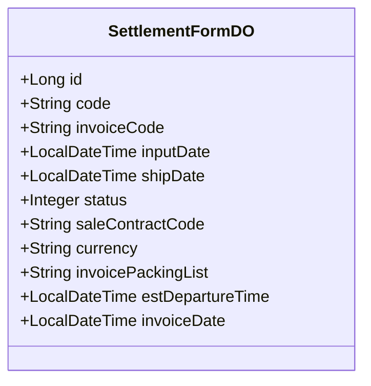

**Diagram sources**
- [SettlementFormDO.java](file://eplus-module-dms/eplus-module-dms-biz/src/main/java/com/syj/eplus/module/dms/dal/dataobject/settlementform/SettlementFormDO.java#L37-L251)

**基本信息字段说明**：
- **主键**：系统自动生成的唯一标识符
- **编号**：系统生成的结汇单编号，格式为JH开头
- **发票号**：对应的商业发票号码
- **制单日期**：结汇单创建的日期
- **出运日期**：货物实际出运的日期
- **状态**：结汇单当前的业务状态
- **外销合同号**：关联的销售合同编号
- **外销币种**：交易使用的货币类型
- **发票箱单**：发票和装箱单的相关信息
- **预计结港时间**：预计完成港口手续的时间
- **发票日期**：发票开具的日期

### 地理信息字段

结汇单包含以下地理信息字段：

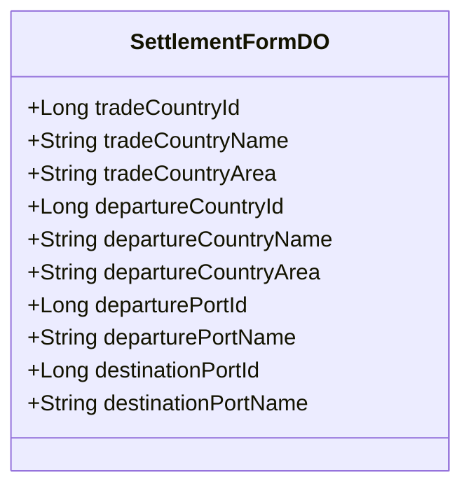

**Diagram sources**
- [SettlementFormDO.java](file://eplus-module-dms/eplus-module-dms-biz/src/main/java/com/syj/eplus/module/dms/dal/dataobject/settlementform/SettlementFormDO.java#L74-L147)

**地理信息字段说明**：
- **贸易国别**：交易双方所属的国家或地区
- **出运国别**：货物实际出运的国家或地区
- **出运口岸**：货物出运的港口或机场
- **目的口岸**：货物到达的目的地港口或机场

### 运输信息字段

结汇单包含以下运输信息字段：

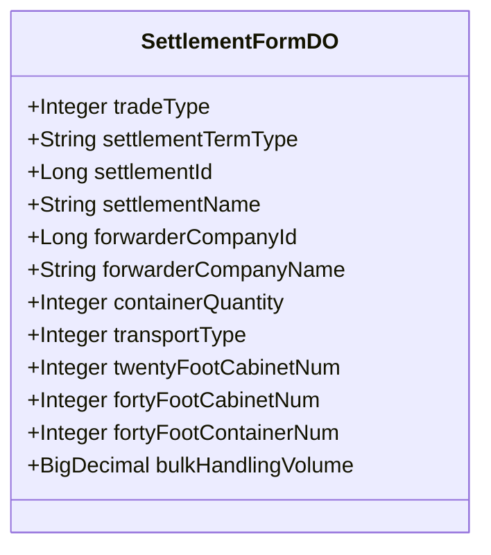

**Diagram sources**
- [SettlementFormDO.java](file://eplus-module-dms/eplus-module-dms-biz/src/main/java/com/syj/eplus/module/dms/dal/dataobject/settlementform/SettlementFormDO.java#L98-L196)

**运输信息字段说明**：
- **贸易方式**：国际贸易的交易方式
- **价格条款**：国际贸易术语，如FOB、CIF等
- **结汇方式**：外汇结算的具体方式
- **船代公司**：负责运输的船务代理公司
- **集装箱数量**：使用的集装箱总数
- **运输方式**：货物运输的方式，如海运、空运等
- **集装箱规格**：不同规格集装箱的数量
- **散货体积**：非集装箱货物的总体积

### 金额与重量字段

结汇单包含以下金额与重量字段：

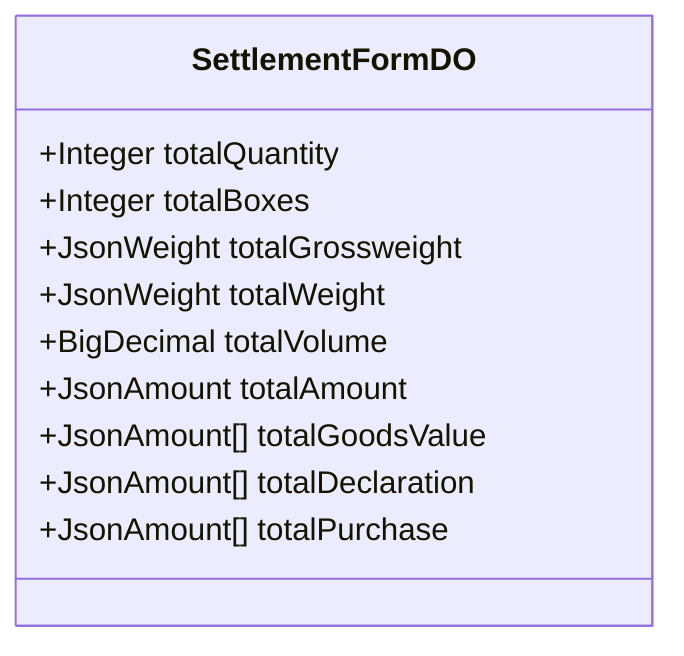

**Diagram sources**
- [SettlementFormDO.java](file://eplus-module-dms/eplus-module-dms-biz/src/main/java/com/syj/eplus/module/dms/dal/dataobject/settlementform/SettlementFormDO.java#L156-L220)

**金额与重量字段说明**：
- **数量合计**：所有产品数量的总和
- **箱数合计**：所有包装箱数的总和
- **毛重合计**：包含包装的货物总重量
- **净重合计**：货物本身的总重量
- **体积合计**：货物占用的总体积
- **金额合计**：交易的总金额
- **货值合计**：不同币种的货值汇总
- **报关合计**：报关相关的费用汇总
- **采购合计**：采购相关的费用汇总

### 结汇单子项字段

结汇单子项包含详细的产品和交易信息：

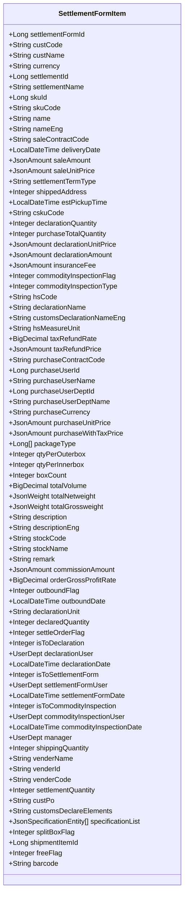

**Diagram sources**
- [SettlementFormItem.java](file://eplus-module-dms/eplus-module-dms-biz/src/main/java/com/syj/eplus/module/dms/dal/dataobject/settlementformitem/SettlementFormItem.java#L47-L504)

**结汇单子项字段说明**：
- **客户信息**：客户编号、名称等基本信息
- **产品信息**：产品编号、名称、规格等
- **交易信息**：销售金额、单价、数量等
- **报关信息**：HS编码、报关数量、报关金额等
- **采购信息**：采购合同、采购员、采购单价等
- **包装信息**：包装方式、装量、箱数等
- **重量体积**：净重、毛重、体积等
- **状态标志**：是否已转报关单、结汇单等状态

**Section sources**
- [SettlementFormSaveReqVO.java](file://eplus-module-dms/eplus-module-dms-biz/src/main/java/com/syj/eplus/module/dms/controller/admin/settlementform/vo/SettlementFormSaveReqVO.java#L19-L175)
- [SettlementFormRespVO.java](file://eplus-module-dms/eplus-module-dms-biz/src/main/java/com/syj/eplus/module/dms/controller/admin/settlementform/vo/SettlementFormRespVO.java#L23-L231)
- [SettlementFormDO.java](file://eplus-module-dms/eplus-module-dms-biz/src/main/java/com/syj/eplus/module/dms/dal/dataobject/settlementform/SettlementFormDO.java#L37-L251)
- [SettlementFormItem.java](file://eplus-module-dms/eplus-module-dms-biz/src/main/java/com/syj/eplus/module/dms/dal/dataobject/settlementformitem/SettlementFormItem.java#L47-L504)

## 业务关联关系

### 与销售合同的关联

结汇管理与销售合同通过外销合同号建立关联关系。每个结汇单必须关联一个或多个销售合同，系统通过销售合同获取客户信息、产品信息和交易条款等基础数据。

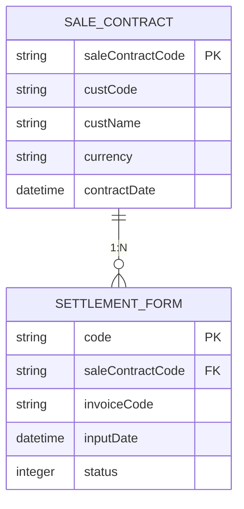

**Diagram sources**
- [SettlementFormDO.java](file://eplus-module-dms/eplus-module-dms-biz/src/main/java/com/syj/eplus/module/dms/dal/dataobject/settlementform/SettlementFormDO.java#L44-L45)
- [SettlementFormItem.java](file://eplus-module-dms/eplus-module-dms-biz/src/main/java/com/syj/eplus/module/dms/dal/dataobject/settlementformitem/SettlementFormItem.java#L104-L105)

**关联机制**：
- 在创建结汇单时，系统根据销售合同号自动填充客户信息和产品信息
- 结汇单的状态变化会同步更新销售合同的相关状态
- 可以通过销售合同号查询关联的所有结汇单
- 销售合同的修改会影响已关联结汇单的数据一致性

### 与出运明细的关联

结汇管理与出运明细通过出运单号建立关联关系。结汇单需要基于实际的出运数据来生成，确保结汇金额与实际出运货物相匹配。

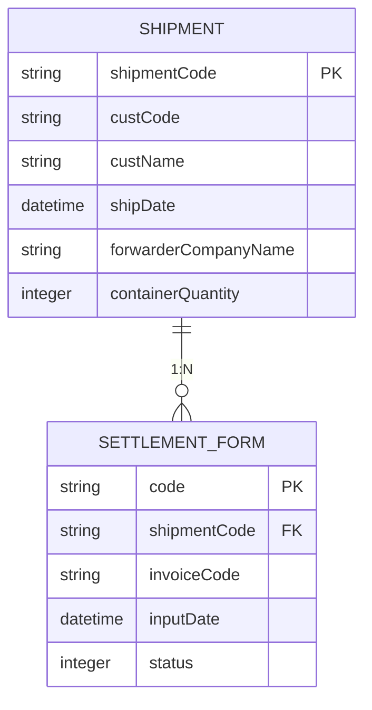

**Diagram sources**
- [SettlementFormDO.java](file://eplus-module-dms/eplus-module-dms-biz/src/main/java/com/syj/eplus/module/dms/dal/dataobject/settlementform/SettlementFormDO.java#L152-L153)
- [SettlementFormItem.java](file://eplus-module-dms/eplus-module-dms-biz/src/main/java/com/syj/eplus/module/dms/dal/dataobject/settlementformitem/SettlementFormItem.java#L151-L152)

**关联机制**：
- 结汇单创建时可以选择一个或多个出运单作为数据来源
- 系统自动从出运明细中提取产品数量、重量、体积等信息
- 出运单的状态变化会影响关联结汇单的创建和修改
- 支持从多个出运单合并生成一个结汇单
- 出运单的修改会触发结汇单数据的重新计算

### 与外汇核销的关联

结汇管理与外汇核销通过结汇单状态和金额数据建立关联。系统利用结汇单的信息进行外汇收入的申报和核销，确保财务数据的准确性和合规性。

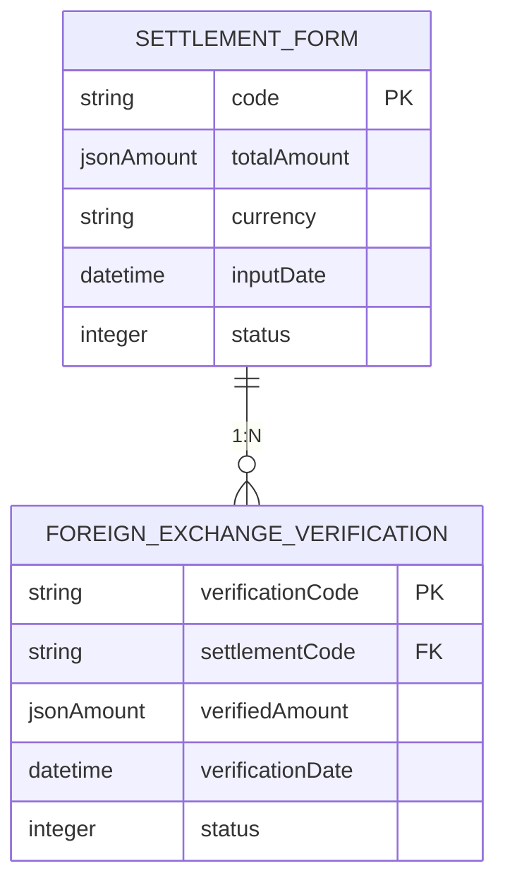

**Diagram sources**
- [SettlementFormDO.java](file://eplus-module-dms/eplus-module-dms-biz/src/main/java/com/syj/eplus/module/dms/dal/dataobject/settlementform/SettlementFormDO.java#L178-L179)
- [SettlementFormServiceImpl.java](file://eplus-module-dms/eplus-module-dms-biz/src/main/java/com/syj/eplus/module/dms/service/settlementform/SettlementFormServiceImpl.java#L271-L301)

**关联机制**：
- 完成的结汇单自动触发外汇核销流程
- 系统根据结汇金额和币种生成外汇核销申报数据
- 外汇核销状态与结汇单状态保持同步
- 支持部分核销和分批核销操作
- 提供外汇核销进度的实时查询功能

**Section sources**
- [SettlementFormServiceImpl.java](file://eplus-module-dms/eplus-module-dms-biz/src/main/java/com/syj/eplus/module/dms/service/settlementform/SettlementFormServiceImpl.java#L271-L301)
- [SettlementFormDO.java](file://eplus-module-dms/eplus-module-dms-biz/src/main/java/com/syj/eplus/module/dms/dal/dataobject/settlementform/SettlementFormDO.java#L44-L153)

## 状态流转机制

### 状态定义

结汇单包含以下状态：

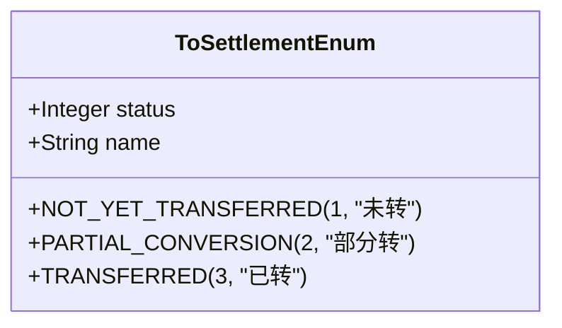

**Diagram sources**
- [ToSettlementEnum.java](file://eplus-framework/eplus-common/src/main/java/com/syj/eplus/framework/common/enums/ToSettlementEnum.java#L8-L16)

**状态说明**：
- **待处理**：结汇单刚创建，尚未开始处理
- **处理中**：正在处理结汇单，可能涉及数据验证、审批等流程
- **已完成**：结汇单处理完成，相关数据已确认
- **已冲销**：结汇单已被撤销或作废

### 状态流转图

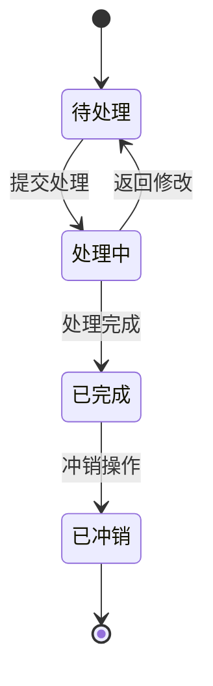

**Diagram sources**
- [SettlementFormDO.java](file://eplus-module-dms/eplus-module-dms-biz/src/main/java/com/syj/eplus/module/dms/dal/dataobject/settlementform/SettlementFormDO.java#L66-L67)
- [SettlementFormServiceImpl.java](file://eplus-module-dms/eplus-module-dms-biz/src/main/java/com/syj/eplus/module/dms/service/settlementform/SettlementFormServiceImpl.java#L134-L257)

### 状态流转规则

**待处理 → 处理中**：
- 用户提交结汇单进行处理
- 系统验证必填字段的完整性
- 检查关联的销售合同和出运单是否存在
- 验证金额和数量的合理性

**处理中 → 已完成**：
- 所有审批流程已完成
- 外汇核销数据已生成
- 相关财务记录已创建
- 系统自动更新状态

**处理中 → 待处理**：
- 审批被驳回
- 发现数据错误需要修改
- 用户主动取消处理
- 系统异常导致处理中断

**已完成 → 已冲销**：
- 发现重大错误需要撤销
- 客户取消订单
- 财务调整需要冲销
- 管理员权限操作

**Section sources**
- [ToSettlementEnum.java](file://eplus-framework/eplus-common/src/main/java/com/syj/eplus/framework/common/enums/ToSettlementEnum.java#L8-L16)
- [SettlementFormDO.java](file://eplus-module-dms/eplus-module-dms-biz/src/main/java/com/syj/eplus/module/dms/dal/dataobject/settlementform/SettlementFormDO.java#L66-L67)

## 业务规则验证逻辑

### 创建验证规则

在创建结汇单时，系统执行以下验证逻辑：

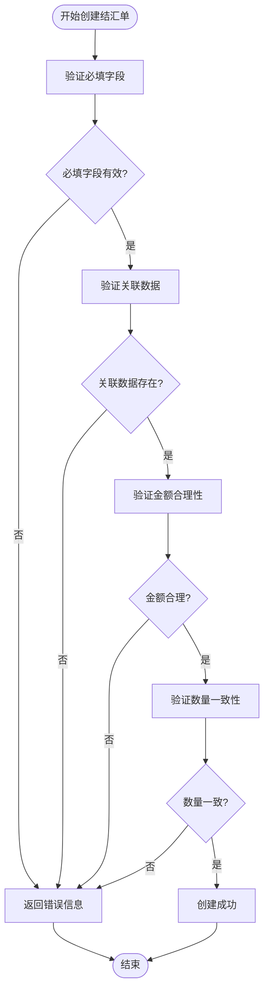

**Diagram sources**
- [SettlementFormServiceImpl.java](file://eplus-module-dms/eplus-module-dms-biz/src/main/java/com/syj/eplus/module/dms/service/settlementform/SettlementFormServiceImpl.java#L134-L174)
- [SettlementFormSaveReqVO.java](file://eplus-module-dms/eplus-module-dms-biz/src/main/java/com/syj/eplus/module/dms/controller/admin/settlementform/vo/SettlementFormSaveReqVO.java#L19-L175)

**具体验证规则**：
- **必填字段验证**：检查编号、发票号、制单日期、外销合同号等必填字段是否为空
- **关联数据验证**：确认关联的销售合同和出运单在系统中存在且状态有效
- **金额合理性验证**：检查金额是否为正数，避免出现负值或零值
- **数量一致性验证**：确保子项的数量合计与主表的数量合计一致
- **币种一致性验证**：同一结汇单内的所有子项应使用相同的币种
- **时间逻辑验证**：制单日期不应晚于当前日期，出运日期不应早于制单日期

### 编辑验证规则

在编辑结汇单时，系统执行以下验证逻辑：

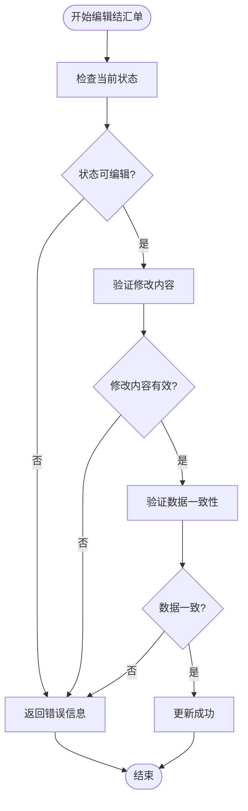

**Diagram sources**
- [SettlementFormServiceImpl.java](file://eplus-module-dms/eplus-module-dms-biz/src/main/java/com/syj/eplus/module/dms/service/settlementform/SettlementFormServiceImpl.java#L178-L212)
- [SettlementFormSaveReqVO.java](file://eplus-module-dms/eplus-module-dms-biz/src/main/java/com/syj/eplus/module/dms/controller/admin/settlementform/vo/SettlementFormSaveReqVO.java#L19-L175)

**具体验证规则**：
- **状态验证**：只有"待处理"和"处理中"状态的结汇单可以编辑
- **修改内容验证**：检查修改后的数据是否符合业务规则
- **数据一致性验证**：确保修改后的数据与关联的销售合同、出运单保持一致
- **历史记录验证**：对于已完成的结汇单，不允许修改关键字段
- **权限验证**：检查当前用户是否有编辑权限

### 审批验证规则

在审批结汇单时，系统执行以下验证逻辑：

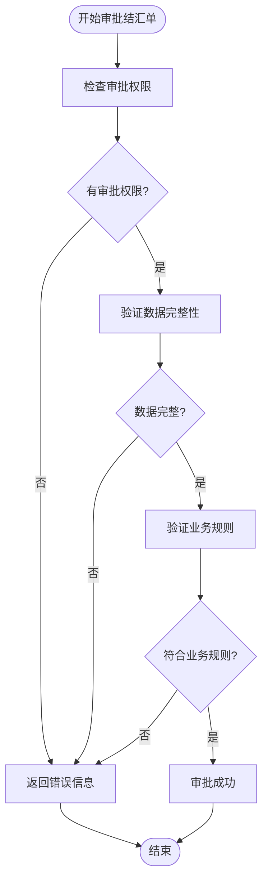

**Diagram sources**
- [SettlementFormServiceImpl.java](file://eplus-module-dms/eplus-module-dms-biz/src/main/java/com/syj/eplus/module/dms/service/settlementform/SettlementFormServiceImpl.java#L266-L301)
- [SettlementFormRespVO.java](file://eplus-module-dms/eplus-module-dms-biz/src/main/java/com/syj/eplus/module/dms/controller/admin/settlementform/vo/SettlementFormRespVO.java#L23-L231)

**具体验证规则**：
- **权限验证**：检查审批人是否有相应的审批权限
- **数据完整性验证**：确保所有必填字段都已填写
- **业务规则验证**：检查金额、数量等数据是否符合公司业务规则
- **关联验证**：确认所有关联的业务单据都已正确关联
- **风险验证**：检查是否存在外汇风险或信用风险

**Section sources**
- [SettlementFormServiceImpl.java](file://eplus-module-dms/eplus-module-dms-biz/src/main/java/com/syj/eplus/module/dms/service/settlementform/SettlementFormServiceImpl.java#L134-L212)
- [SettlementFormSaveReqVO.java](file://eplus-module-dms/eplus-module-dms-biz/src/main/java/com/syj/eplus/module/dms/controller/admin/settlementform/vo/SettlementFormSaveReqVO.java#L19-L175)

## 数据统计分析

### 结汇进度跟踪

系统提供结汇进度的实时跟踪功能，帮助管理人员了解结汇业务的整体情况。

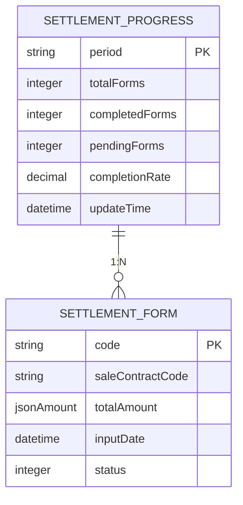

**Diagram sources**
- [SettlementFormDO.java](file://eplus-module-dms/eplus-module-dms-biz/src/main/java/com/syj/eplus/module/dms/dal/dataobject/settlementform/SettlementFormDO.java#L37-L251)
- [SettlementFormServiceImpl.java](file://eplus-module-dms/eplus-module-dms-biz/src/main/java/com/syj/eplus/module/dms/service/settlementform/SettlementFormServiceImpl.java#L423-L437)

**跟踪指标**：
- **结汇单总数**：统计期间内创建的结汇单总数
- **已完成结汇单数**：已处理完成的结汇单数量
- **待处理结汇单数**：尚未开始处理的结汇单数量
- **结汇完成率**：已完成结汇单数占总数的百分比
- **平均处理时间**：结汇单从创建到完成的平均时间
- **结汇金额趋势**：按时间维度统计结汇金额的变化趋势

### 外汇风险预警

系统提供外汇风险预警功能，帮助财务人员及时发现和应对潜在的外汇风险。

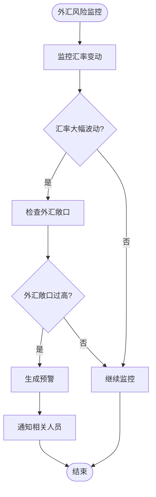

**Diagram sources**
- [SettlementFormServiceImpl.java](file://eplus-module-dms/eplus-module-dms-biz/src/main/java/com/syj/eplus/module/dms/service/settlementform/SettlementFormServiceImpl.java#L540-L557)
- [SettlementFormDO.java](file://eplus-module-dms/eplus-module-dms-biz/src/main/java/com/syj/eplus/module/dms/dal/dataobject/settlementform/SettlementFormDO.java#L70-L71)

**预警规则**：
- **汇率波动预警**：当主要交易币种的汇率波动超过预设阈值时触发预警
- **外汇敞口预警**：当未结汇的外汇金额超过公司设定的风险限额时触发预警
- **账期预警**：当结汇账期超过合同约定的期限时触发预警
- **客户信用预警**：当客户的历史结汇记录出现异常时触发预警
- **币种集中度预警**：当某一币种的结汇金额占比过高时触发预警

### 统计分析功能

系统提供多种统计分析功能，支持决策制定：

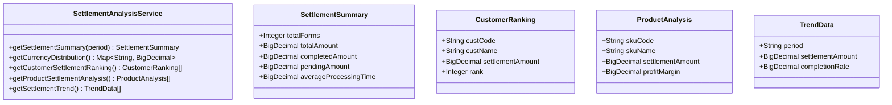

**Diagram sources**
- [SettlementFormServiceImpl.java](file://eplus-module-dms/eplus-module-dms-biz/src/main/java/com/syj/eplus/module/dms/service/settlementform/SettlementFormServiceImpl.java#L423-L437)
- [SettlementFormDO.java](file://eplus-module-dms/eplus-module-dms-biz/src/main/java/com/syj/eplus/module/dms/dal/dataobject/settlementform/SettlementFormDO.java#L178-L179)

**分析功能**：
- **结汇汇总分析**：按时间段统计结汇单数量和金额
- **币种分布分析**：分析不同币种的结汇金额占比
- **客户结汇排名**：按客户统计结汇金额并进行排名
- **产品结汇分析**：按产品统计结汇金额和利润率
- **结汇趋势分析**：分析结汇金额的时间趋势
- **区域结汇分析**：按贸易国别或区域统计结汇情况

**Section sources**
- [SettlementFormServiceImpl.java](file://eplus-module-dms/eplus-module-dms-biz/src/main/java/com/syj/eplus/module/dms/service/settlementform/SettlementFormServiceImpl.java#L423-L437)
- [SettlementFormDO.java](file://eplus-module-dms/eplus-module-dms-biz/src/main/java/com/syj/eplus/module/dms/dal/dataobject/settlementform/SettlementFormDO.java#L178-L179)

## 界面操作指南

### 创建结汇单

**操作步骤**：
1. 进入结汇管理模块，点击"新建结汇单"按钮
2. 选择关联的销售合同或出运单
3. 系统自动填充基本信息，包括客户信息、产品信息等
4. 核对并修改必要信息，如发票号、制单日期等
5. 添加或修改结汇单子项，确保数量、金额等数据准确
6. 点击"保存"按钮，系统验证数据并创建结汇单

**注意事项**：
- 确保所有必填字段都已填写
- 核对关联的销售合同和出运单是否正确
- 检查金额和数量的计算是否准确
- 确认币种选择是否正确

### 编辑结汇单

**操作步骤**：
1. 在结汇单列表中找到需要编辑的结汇单
2. 点击"编辑"按钮进入编辑页面
3. 修改需要变更的信息
4. 系统自动重新计算相关合计数据
5. 点击"保存"按钮提交修改

**注意事项**：
- 只有"待处理"和"处理中"状态的结汇单可以编辑
- 修改关键字段可能影响关联的业务单据
- 编辑后需要重新进行数据验证
- 建议在修改前备份原始数据

### 查询结汇单

**操作步骤**：
1. 进入结汇单查询页面
2. 设置查询条件，如结汇单编号、发票号、客户名称等
3. 可以设置时间范围、状态等筛选条件
4. 点击"查询"按钮获取结果
5. 在结果列表中查看结汇单详情

**查询条件**：
- 结汇单编号
- 发票号
- 客户名称
- 销售合同号
- 出运单号
- 制单日期范围
- 状态
- 币种

### 导出结汇单

**操作步骤**：
1. 在结汇单列表中选择需要导出的结汇单
2. 点击"导出"按钮
3. 选择导出模板和格式
4. 系统生成Excel文件并下载到本地

**导出选项**：
- 详细信息导出
- KANE PL格式导出
- KANE INV格式导出
- 自定义字段导出

**Section sources**
- [SettlementFormController.java](file://eplus-module-dms/eplus-module-dms-biz/src/main/java/com/syj/eplus/module/dms/controller/admin/settlementform/SettlementFormController.java#L35-L66)
- [SettlementFormPageReqVO.java](file://eplus-module-dms/eplus-module-dms-biz/src/main/java/com/syj/eplus/module/dms/controller/admin/settlementform/vo/SettlementFormPageReqVO.java#L19-L43)

## 常见问题解决方案

### 结汇单无法创建

**问题现象**：点击"创建"按钮后系统报错，无法创建结汇单。

**可能原因**：
- 必填字段未填写完整
- 关联的销售合同或出运单不存在
- 用户没有创建权限
- 系统临时故障

**解决方案**：
1. 检查所有必填字段是否已填写
2. 确认选择的销售合同和出运单在系统中存在
3. 联系管理员确认用户权限
4. 刷新页面后重试
5. 如果问题持续存在，联系技术支持

### 结汇单数据不一致

**问题现象**：结汇单的合计数据与子项数据不一致。

**可能原因**：
- 子项数据修改后未重新计算合计
- 系统计算逻辑错误
- 数据同步问题

**解决方案**：
1. 手动重新计算合计数据
2. 保存并重新打开结汇单，让系统自动重新计算
3. 检查是否有并发修改导致的数据冲突
4. 如果问题持续存在，联系技术支持检查系统逻辑

### 结汇单状态无法更新

**问题现象**：结汇单处理完成后，状态仍显示为"处理中"。

**可能原因**：
- 审批流程未完成
- 系统自动更新状态失败
- 权限不足

**解决方案**：
1. 检查审批流程是否全部完成
2. 手动更新结汇单状态
3. 确认当前用户有状态更新权限
4. 查看系统日志，确认是否有错误信息
5. 如果问题持续存在，联系技术支持

### 外汇核销数据错误

**问题现象**：生成的外汇核销数据与结汇单数据不一致。

**可能原因**：
- 结汇单数据变更后未同步到外汇核销
- 汇率计算错误
- 币种转换错误

**解决方案**：
1. 检查结汇单数据是否最新
2. 确认使用的汇率是否正确
3. 重新生成外汇核销数据
4. 检查币种转换逻辑
5. 如果问题持续存在，联系技术支持

**Section sources**
- [SettlementFormServiceImpl.java](file://eplus-module-dms/eplus-module-dms-biz/src/main/java/com/syj/eplus/module/dms/service/settlementform/SettlementFormServiceImpl.java#L134-L257)
- [SettlementFormDO.java](file://eplus-module-dms/eplus-module-dms-biz/src/main/java/com/syj/eplus/module/dms/dal/dataobject/settlementform/SettlementFormDO.java#L66-L67)