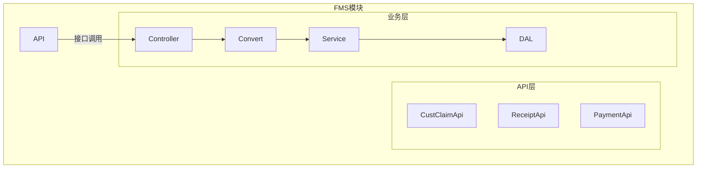
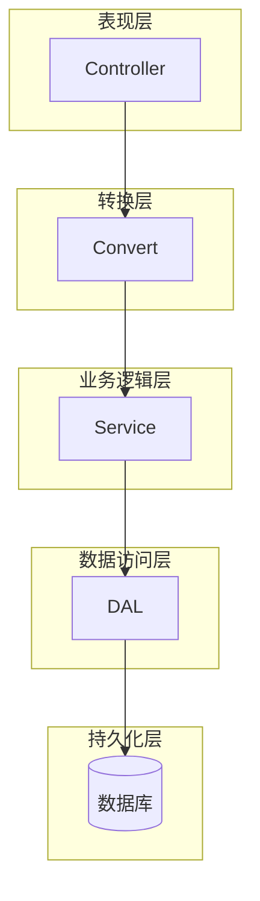
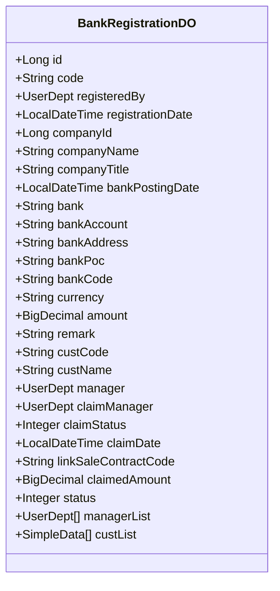
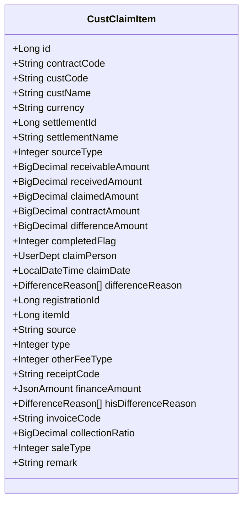
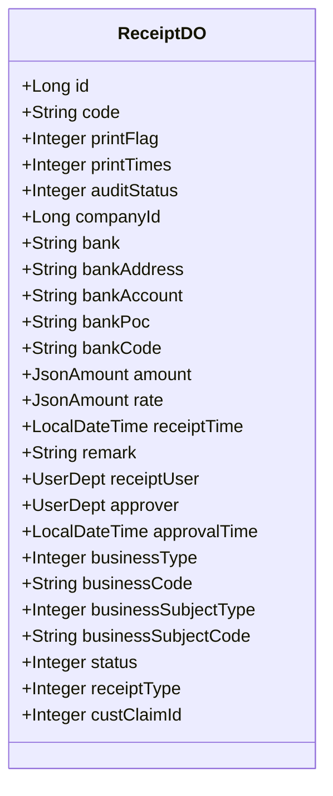
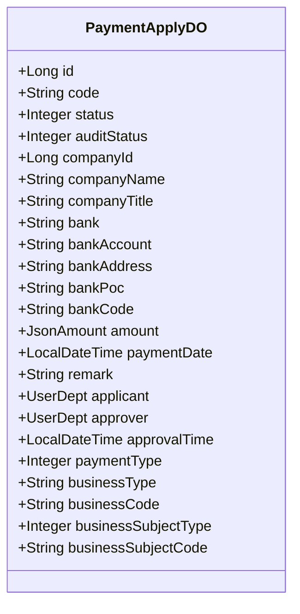
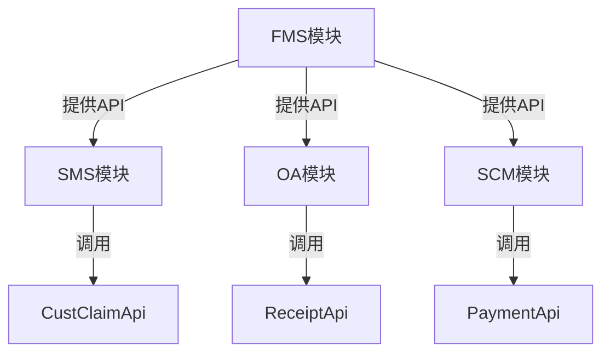

# 财务单据管理

<cite>
**本文档引用文件**  
- [BankRegistrationDO.java](file://eplus-module-fms/eplus-module-fms-biz/src/main/java/com/syj/eplus/module/fms/dal/dataobject/bankregistration/BankRegistrationDO.java)
- [CustClaimItem.java](file://eplus-module-fms/eplus-module-fms-biz/src/main/java/com/syj/eplus/module/fms/dal/dataobject/custclaim/CustClaimItem.java)
- [ReceiptDO.java](file://eplus-module-fms/eplus-module-fms-biz/src/main/java/com/syj/eplus/module/fms/dal/dataobject/receipt/ReceiptDO.java)
- [CustClaimApi.java](file://eplus-module-fms/eplus-module-fms-api/src/main/java/com/syj/eplus/module/fms/api/payment/api/custclaim/CustClaimApi.java)
- [ReceiptApi.java](file://eplus-module-fms/eplus-module-fms-api/src/main/java/com/syj/eplus/module/fms/api/payment/api/receipt/ReceiptApi.java)
- [PaymentApplyDO.java](file://eplus-module-scm/eplus-module-scm-biz/src/main/java/com/syj/eplus/module/scm/dal/dataobject/paymentapply/PaymentApplyDO.java)
</cite>

## 目录
1. [引言](#引言)
2. [项目结构](#项目结构)
3. [核心组件](#核心组件)
4. [架构概述](#架构概述)
5. [详细组件分析](#详细组件分析)
6. [依赖关系分析](#依赖关系分析)
7. [性能考虑](#性能考虑)
8. [故障排除指南](#故障排除指南)
9. [结论](#结论)

## 引言
本文档全面介绍财务单据管理系统的设计与实现，涵盖银行登记、结汇单、开票通知等财务单据的处理流程。系统通过FMS（财务管理系统）模块实现财务单据的全生命周期管理，包括创建、审批、关联应收应付、收付款等核心功能。文档详细说明各类财务单据的字段定义、业务规则、审批流程、状态流转机制和数据同步逻辑，并提供操作指南和常见问题解决方案。

## 项目结构
财务单据管理功能主要集中在`eplus-module-fms`模块中，该模块分为API层和业务层，遵循清晰的分层架构。

**图示来源**  
- [eplus-module-fms](file://eplus-module-fms)

**本节来源**  
- [eplus-module-fms](file://eplus-module-fms)

## 核心组件
财务单据管理系统的核心组件包括银行登记、客户认领、收款单、付款申请等实体，分别对应不同的数据对象和业务逻辑。

**本节来源**  
- [BankRegistrationDO.java](file://eplus-module-fms/eplus-module-fms-biz/src/main/java/com/syj/eplus/module/fms/dal/dataobject/bankregistration/BankRegistrationDO.java)
- [CustClaimItem.java](file://eplus-module-fms/eplus-module-fms-biz/src/main/java/com/syj/eplus/module/fms/dal/dataobject/custclaim/CustClaimItem.java)
- [ReceiptDO.java](file://eplus-module-fms/eplus-module-fms-biz/src/main/java/com/syj/eplus/module/fms/dal/dataobject/receipt/ReceiptDO.java)

## 架构概述
系统采用典型的分层架构，包括表现层、业务逻辑层、数据访问层和持久化层。各层之间通过明确定义的接口进行通信，确保系统的可维护性和可扩展性。

**图示来源**  
- [eplus-module-fms](file://eplus-module-fms)

## 详细组件分析

### 银行登记分析
银行登记是财务单据管理的起点，用于记录银行入账信息。

#### 银行登记数据模型

**图示来源**  
- [BankRegistrationDO.java](file://eplus-module-fms/eplus-module-fms-biz/src/main/java/com/syj/eplus/module/fms/dal/dataobject/bankregistration/BankRegistrationDO.java)

**本节来源**  
- [BankRegistrationDO.java](file://eplus-module-fms/eplus-module-fms-biz/src/main/java/com/syj/eplus/module/fms/dal/dataobject/bankregistration/BankRegistrationDO.java)

### 客户认领分析
客户认领用于将银行入账金额与具体的销售合同或订单进行匹配。

#### 客户认领数据模型

**图示来源**  
- [CustClaimItem.java](file://eplus-module-fms/eplus-module-fms-biz/src/main/java/com/syj/eplus/module/fms/dal/dataobject/custclaim/CustClaimItem.java)

**本节来源**  
- [CustClaimItem.java](file://eplus-module-fms/eplus-module-fms-biz/src/main/java/com/syj/eplus/module/fms/dal/dataobject/custclaim/CustClaimItem.java)

### 收款单分析
收款单是财务系统的核心单据之一，用于记录实际收到的款项。

#### 收款单数据模型

**图示来源**  
- [ReceiptDO.java](file://eplus-module-fms/eplus-module-fms-biz/src/main/java/com/syj/eplus/module/fms/dal/dataobject/receipt/ReceiptDO.java)

**本节来源**  
- [ReceiptDO.java](file://eplus-module-fms/eplus-module-fms-biz/src/main/java/com/syj/eplus/module/fms/dal/dataobject/receipt/ReceiptDO.java)

### 付款申请分析
付款申请用于管理对外支付的流程。

#### 付款申请数据模型

**图示来源**  
- [PaymentApplyDO.java](file://eplus-module-scm/eplus-module-scm-biz/src/main/java/com/syj/eplus/module/scm/dal/dataobject/paymentapply/PaymentApplyDO.java)

**本节来源**  
- [PaymentApplyDO.java](file://eplus-module-scm/eplus-module-scm-biz/src/main/java/com/syj/eplus/module/scm/dal/dataobject/paymentapply/PaymentApplyDO.java)

## 依赖关系分析
财务单据管理系统与其他模块存在紧密的依赖关系，通过API接口实现服务调用。

**图示来源**  
- [CustClaimApi.java](file://eplus-module-fms/eplus-module-fms-api/src/main/java/com/syj/eplus/module/fms/api/payment/api/custclaim/CustClaimApi.java)
- [ReceiptApi.java](file://eplus-module-fms/eplus-module-fms-api/src/main/java/com/syj/eplus/module/fms/api/payment/api/receipt/ReceiptApi.java)

**本节来源**  
- [CustClaimApi.java](file://eplus-module-fms/eplus-module-fms-api/src/main/java/com/syj/eplus/module/fms/api/payment/api/custclaim/CustClaimApi.java)
- [ReceiptApi.java](file://eplus-module-fms/eplus-module-fms-api/src/main/java/com/syj/eplus/module/fms/api/payment/api/receipt/ReceiptApi.java)

## 性能考虑
财务单据管理系统在设计时考虑了以下性能优化措施：
- 使用MyBatis Plus进行数据库操作，提高查询效率
- 通过Redis缓存常用数据，减少数据库访问
- 采用分页查询，避免一次性加载大量数据
- 对大字段使用JSON类型处理器，优化存储和读取性能

## 故障排除指南
### 常见问题及解决方案
1. **银行登记无法创建**
   - 检查用户权限是否正确
   - 确认必填字段是否完整
   - 查看日志是否有数据库约束错误

2. **客户认领金额不正确**
   - 检查汇率是否正确
   - 确认币种是否匹配
   - 验证应收金额计算逻辑

3. **收款单审批失败**
   - 检查审批流程配置
   - 确认审批人是否有权限
   - 查看BPM流程实例状态

**本节来源**  
- [BankRegistrationDO.java](file://eplus-module-fms/eplus-module-fms-biz/src/main/java/com/syj/eplus/module/fms/dal/dataobject/bankregistration/BankRegistrationDO.java)
- [CustClaimItem.java](file://eplus-module-fms/eplus-module-fms-biz/src/main/java/com/syj/eplus/module/fms/dal/dataobject/custclaim/CustClaimItem.java)
- [ReceiptDO.java](file://eplus-module-fms/eplus-module-fms-biz/src/main/java/com/syj/eplus/module/fms/dal/dataobject/receipt/ReceiptDO.java)

## 结论
财务单据管理系统通过清晰的模块划分和分层架构，实现了银行登记、客户认领、收款单、付款申请等核心财务功能。系统通过API接口与其他业务模块集成，确保了数据的一致性和业务流程的完整性。未来可进一步优化性能，增强报表分析功能，提升用户体验。