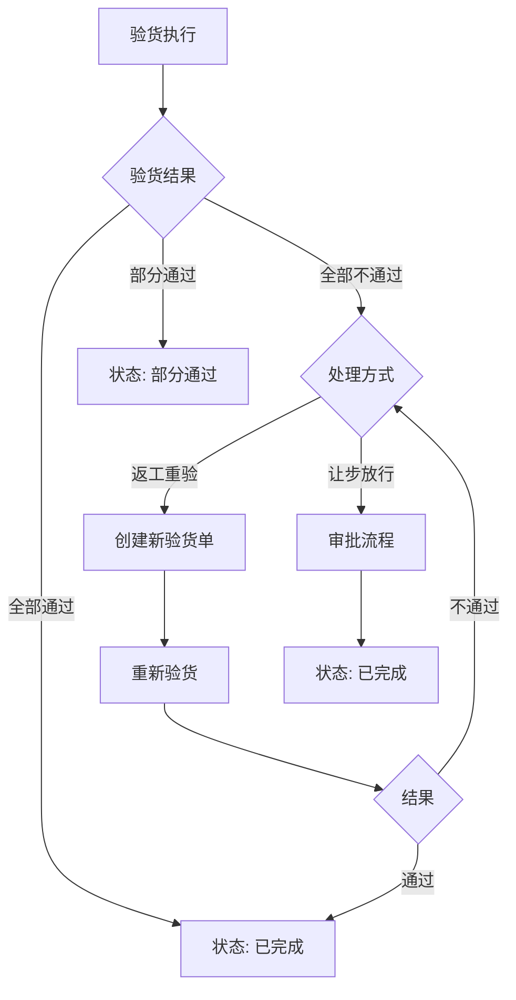
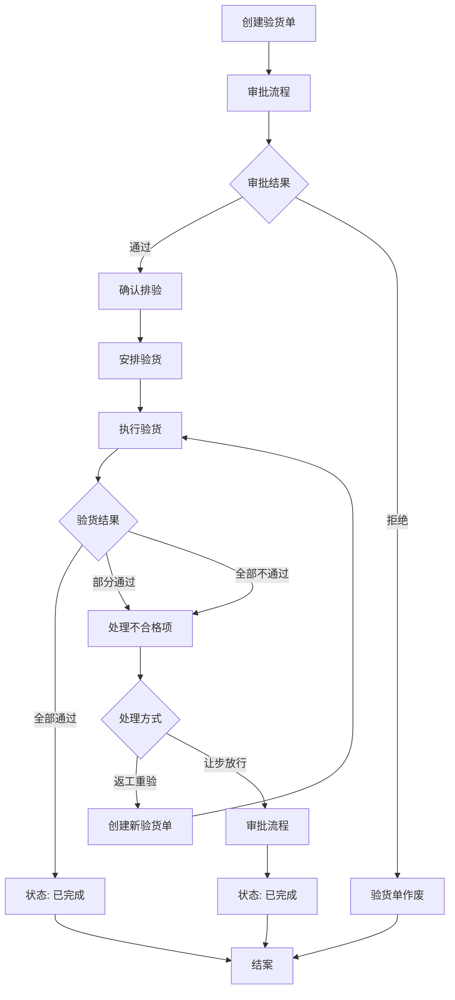

# 质量管理

<cite>
**本文档引用的文件**
- [QualityInspectionApi.java](file://eplus-module-qms/eplus-module-qms-api/src/main/java/com/syj/eplus/module/qms/api/QualityInspectionApi.java)
- [QualityInspectionServiceImpl.java](file://eplus-module-qms/eplus-module-qms-biz/src/main/java/com/syj/eplus/module/qms/service/qualityinspection/QualityInspectionServiceImpl.java)
- [QualityInspectionDO.java](file://eplus-module-qms/eplus-module-qms-biz/src/main/java/com/syj/eplus/module/qms/dal/dataobject/qualityinspection/QualityInspectionDO.java)
- [QualityInspectionItemDO.java](file://eplus-module-qms/eplus-module-qms-biz/src/main/java/com/syj/eplus/module/qms/dal/dataobject/qualityinspection/QualityInspectionItemDO.java)
- [QualityInspectionController.java](file://eplus-module-qms/eplus-module-qms-biz/src/main/java/com/syj/eplus/module/qms/controller/admin/qualityinspection/QualityInspectionController.java)
- [InspectionTypeEnum.java](file://eplus-module-qms/eplus-module-qms-api/src/main/java/com/syj/eplus/module/qms/enums/InspectionTypeEnum.java)
- [InspectionItemStatusEnum.java](file://eplus-module-qms/eplus-module-qms-api/src/main/java/com/syj/eplus/module/qms/enums/InspectionItemStatusEnum.java)
- [InspectionBillStatusEnum.java](file://eplus-framework/eplus-common/src/main/java/com/syj/eplus/framework/common/enums/InspectionBillStatusEnum.java)
- [QmsHandleStateEnum.java](file://eplus-framework/eplus-common/src/main/java/com/syj/eplus/framework/common/enums/QmsHandleStateEnum.java)
- [InspectionNodeEnum.java](file://eplus-framework/eplus-common/src/main/java/com/syj/eplus/framework/common/enums/InspectionNodeEnum.java)
- [QualityInspectionAuditResultListener.java](file://eplus-module-qms/eplus-module-qms-biz/src/main/java/com/syj/eplus/module/qms/listener/qualityinspection/QualityInspectionAuditResultListener.java)
- [R__字典相关.sql](file://eplus-flyway/src/main/resources/db/migration/common/R__字典相关.sql)
</cite>

## 目录
1. [引言](#引言)
2. [质检流程](#质检流程)
3. [质检项目与标准](#质检项目与标准)
4. [质检结果处理机制](#质检结果处理机制)
5. [与其他模块的集成](#与其他模块的集成)
6. [质检业务流程图](#质检业务流程图)
7. [质检报告与数据分析](#质检报告与数据分析)

## 引言
质量管理模块是企业质量控制体系的核心组成部分，负责管理来料检验、过程检验和出货检验等各类质检活动。本模块通过系统化的流程管理，确保产品质量符合标准要求。系统支持多种质检方式，包括现场验货、远程验货等，并提供完整的质检结果处理机制，包括合格、不合格和让步放行等处理方式。质检数据与采购、生产、仓储等模块紧密集成，实现全流程的质量追溯和管理。

## 质检流程
质量管理模块支持完整的质检生命周期管理，从验货单创建到最终结案的全过程。系统定义了多种验货单状态，包括待审批、待确认、待验货、验货不通过、已完成、部分通过、已驳回和已结案。

验货流程始于验货单的创建，系统会自动生成唯一的验货单号。创建后，验货单进入待审批状态，需要经过审批流程。审批通过后，验货单状态变更为待确认，此时可以安排具体的验货时间。确认排验后，状态变更为待验货，准备进行实际验货操作。

验货执行阶段，验货人员根据验货项目和标准进行检查，并记录验货结果。验货完成后，系统根据验货结果自动更新验货单状态。如果所有项目均通过，则状态变更为已完成；如果部分项目不通过，则状态变更为部分通过；如果所有项目均不通过，则状态变更为验货不通过。

对于不通过的验货结果，系统支持返工重验和让步放行两种处理方式。返工重验需要创建新的验货单进行重新检验，而让步放行则是在特定条件下接受不合格产品。无论采用哪种处理方式，系统都会记录完整的处理过程和相关附件，确保质量追溯的完整性。

**本节来源**
- [QualityInspectionDO.java](file://eplus-module-qms/eplus-module-qms-biz/src/main/java/com/syj/eplus/module/qms/dal/dataobject/qualityinspection/QualityInspectionDO.java#L50-L53)
- [InspectionBillStatusEnum.java](file://eplus-framework/eplus-common/src/main/java/com/syj/eplus/framework/common/enums/InspectionBillStatusEnum.java#L6-L19)
- [QualityInspectionServiceImpl.java](file://eplus-module-qms/eplus-module-qms-biz/src/main/java/com/syj/eplus/module/qms/service/qualityinspection/QualityInspectionServiceImpl.java#L138-L219)

## 质检项目与标准
质检项目是验货单的核心组成部分，每个验货项目对应一个具体的产品检验。系统通过`QualityInspectionItemDO`类定义了验货项目的详细信息，包括产品主键、产品编号、产品中文名称、客户货号、验货状态、验货图片、失败描述、数量等关键属性。

验货标准主要体现在验货状态的定义上。系统定义了三种基本的验货状态：待定、成功和失败。验货人员在执行验货时，需要根据实际检查结果选择相应的状态。对于失败的验货项目，必须填写详细的失败描述，说明不合格的具体原因。

系统支持多种验货方式，每种方式都有其特定的应用场景和标准：
- 泛太陪验（工厂）：在供应商工厂进行的陪验
- 泛太陪验（公司内）：在公司内部进行的陪验
- 泛太自验（工厂）：在供应商工厂进行的自主检验
- 泛太自验（公司内）：在公司内部进行的自主检验
- 客户自检：由客户自行进行的检验
- 客户指定第三方：由客户指定的第三方机构进行的检验
- 远程验货：通过远程方式（如视频、照片）进行的验货

不同的验货方式对应不同的验货标准和流程要求。例如，远程验货需要提供详细的图片和视频证据，而现场验货则需要验货人员亲临现场进行检查。

**本节来源**
- [QualityInspectionItemDO.java](file://eplus-module-qms/eplus-module-qms-biz/src/main/java/com/syj/eplus/module/qms/dal/dataobject/qualityinspection/QualityInspectionItemDO.java#L30-L221)
- [InspectionItemStatusEnum.java](file://eplus-module-qms/eplus-module-qms-api/src/main/java/com/syj/eplus/module/qms/enums/InspectionItemStatusEnum.java#L9-L42)
- [InspectionTypeEnum.java](file://eplus-module-qms/eplus-module-qms-api/src/main/java/com/syj/eplus/module/qms/enums/InspectionTypeEnum.java#L9-L39)

## 质检结果处理机制
质检结果的处理是质量管理的关键环节，系统提供了完善的处理机制来应对不同的验货结果。根据验货结果，系统支持三种主要的处理方式：合格、不合格和让步放行。

当验货结果为合格时，系统自动将验货单状态更新为"已完成"。对于部分项目合格的情况，状态变更为"部分通过"。如果所有项目均不合格，则状态变更为"验货不通过"。

对于不合格的验货结果，系统提供两种处理路径：返工重验和让步放行。返工重验是指对不合格产品进行返工处理后重新进行检验。系统支持创建新的验货单专门用于返工产品的检验，确保返工质量得到验证。

让步放行是在特定条件下接受不合格产品的处理方式。系统通过`setConcessionReleaseStatus`方法实现让步放行功能，允许用户设置让步放行状态并上传相关附件。让步放行需要经过严格的审批流程，确保决策的合理性和可追溯性。

系统还支持验货单的作废功能，对于因各种原因无法继续的验货单，可以进行作废处理。作废的验货单将被标记为特殊状态，不能再进行任何操作，但保留所有历史记录以供追溯。

所有质检结果的处理都会生成详细的操作日志，记录操作人员、操作时间、操作内容和相关附件，确保质量追溯的完整性和透明度。



**图表来源**
- [QualityInspectionServiceImpl.java](file://eplus-module-qms/eplus-module-qms-biz/src/main/java/com/syj/eplus/module/qms/service/qualityinspection/QualityInspectionServiceImpl.java#L636-L670)
- [QualityInspectionController.java](file://eplus-module-qms/eplus-module-qms-biz/src/main/java/com/syj/eplus/module/qms/controller/admin/qualityinspection/QualityInspectionController.java#L104-L109)
- [QmsHandleStateEnum.java](file://eplus-framework/eplus-common/src/main/java/com/syj/eplus/framework/common/enums/QmsHandleStateEnum.java#L6-L11)

**本节来源**
- [QualityInspectionServiceImpl.java](file://eplus-module-qms/eplus-module-qms-biz/src/main/java/com/syj/eplus/module/qms/service/qualityinspection/QualityInspectionServiceImpl.java#L636-L725)
- [QualityInspectionController.java](file://eplus-module-qms/eplus-module-qms-biz/src/main/java/com/syj/eplus/module/qms/controller/admin/qualityinspection/QualityInspectionController.java#L104-L109)
- [QmsHandleStateEnum.java](file://eplus-framework/eplus-common/src/main/java/com/syj/eplus/framework/common/enums/QmsHandleStateEnum.java#L6-L11)

## 与其他模块的集成
质量管理模块与采购、生产、仓储等核心业务模块紧密集成，实现了质量信息的无缝流转和共享。系统通过标准化的API接口与其他模块进行数据交互，确保业务流程的连贯性和数据的一致性。

与采购模块的集成主要体现在采购合同与验货单的关联上。每个验货单都关联一个采购合同，验货结果会同步更新到采购合同中。当验货通过时，系统会自动更新采购合同的验货状态，触发后续的入库流程。这种集成确保了只有经过质量检验合格的物料才能进入仓库，有效控制了来料质量。

与生产模块的集成体现在生产过程中的质量控制上。系统支持创建过程检验单，对生产过程中的关键工序进行质量检查。检验结果会实时反馈给生产部门，便于及时调整生产工艺，预防质量问题的发生。

与仓储模块的集成主要体现在入库管理上。验货通过的物料才能办理入库手续，系统会根据验货结果自动生成入库单。对于让步放行的物料，系统会进行特殊标记，提醒仓库管理人员注意存储和使用限制。

系统还与订单管理模块集成，通过订单链路跟踪功能，实现从销售订单到采购、生产、质检、发货的全流程追溯。这种端到端的追溯能力，大大提高了质量问题的定位和解决效率。

```mermaid
graph TB
subgraph "采购模块"
A[采购合同]
end
subgraph "质量管理模块"
B[验货单]
C[验货项目]
D[验货结果]
end
subgraph "仓储模块"
E[入库单]
F[库存管理]
end
subgraph "生产模块"
G[生产订单]
H[过程检验]
end
A --> B: 创建验货单
B --> D: 验货结果
D --> |通过| E: 触发入库
D --> |不通过| A: 反馈采购
G --> H: 过程检验
H --> B: 质量数据
D --> F: 更新库存状态
```

**图表来源**
- [QualityInspectionServiceImpl.java](file://eplus-module-qms/eplus-module-qms-biz/src/main/java/com/syj/eplus/module/qms/service/qualityinspection/QualityInspectionServiceImpl.java#L208-L216)
- [QualityInspectionServiceImpl.java](file://eplus-module-qms/eplus-module-qms-biz/src/main/java/com/syj/eplus/module/qms/service/qualityinspection/QualityInspectionServiceImpl.java#L335-L337)
- [QualityInspectionServiceImpl.java](file://eplus-module-qms/eplus-module-qms-biz/src/main/java/com/syj/eplus/module/qms/service/qualityinspection/QualityInspectionServiceImpl.java#L722-L723)

**本节来源**
- [QualityInspectionServiceImpl.java](file://eplus-module-qms/eplus-module-qms-biz/src/main/java/com/syj/eplus/module/qms/service/qualityinspection/QualityInspectionServiceImpl.java#L208-L216)
- [QualityInspectionServiceImpl.java](file://eplus-module-qms/eplus-module-qms-biz/src/main/java/com/syj/eplus/module/qms/service/qualityinspection/QualityInspectionServiceImpl.java#L335-L337)
- [QualityInspectionServiceImpl.java](file://eplus-module-qms/eplus-module-qms-biz/src/main/java/com/syj/eplus/module/qms/service/qualityinspection/QualityInspectionServiceImpl.java#L722-L723)

## 质检业务流程图
以下流程图展示了典型的质检业务流程，从验货单创建到最终结案的完整过程。流程涵盖了主要的业务节点、状态转换和决策点，为用户提供了清晰的业务操作指引。



该流程图展示了质检业务的核心流程，包括验货单的创建、审批、排验、验货执行和结果处理等关键环节。每个环节都有明确的状态转换和决策点，确保业务流程的规范性和可控性。

**图表来源**
- [QualityInspectionServiceImpl.java](file://eplus-module-qms/eplus-module-qms-biz/src/main/java/com/syj/eplus/module/qms/service/qualityinspection/QualityInspectionServiceImpl.java#L138-L219)
- [QualityInspectionController.java](file://eplus-module-qms/eplus-module-qms-biz/src/main/java/com/syj/eplus/module/qms/controller/admin/qualityinspection/QualityInspectionController.java#L51-L132)
- [InspectionBillStatusEnum.java](file://eplus-framework/eplus-common/src/main/java/com/syj/eplus/framework/common/enums/InspectionBillStatusEnum.java#L6-L19)

## 质检报告与数据分析
质量管理模块提供了强大的质检报告生成和数据分析功能，帮助用户全面了解质量状况，发现潜在问题，持续改进质量管理水平。

系统支持多种格式的质检报告导出，包括Excel和Word格式。用户可以根据需要选择不同的模板生成报告，报告内容涵盖验货单基本信息、验货项目详情、验货结果、图片附件等完整信息。导出功能支持按单据维度和产品维度进行数据导出，满足不同场景的报告需求。

数据分析功能提供了多维度的质量统计和分析。系统可以按供应商、产品类别、时间周期等维度统计验货通过率、不合格率等关键质量指标。通过趋势分析，用户可以识别质量问题的变化趋势，及时采取预防措施。

系统还提供了质量追溯功能，通过订单链路可以追溯每个产品的完整质量历史，包括历次验货记录、不合格项、处理措施等信息。这种端到端的追溯能力，大大提高了质量问题的定位和解决效率。

此外，系统还支持自定义报表和仪表盘，用户可以根据管理需求配置关键质量指标的可视化展示，实时监控质量状况，为管理决策提供数据支持。

**本节来源**
- [QualityInspectionController.java](file://eplus-module-qms/eplus-module-qms-biz/src/main/java/com/syj/eplus/module/qms/controller/admin/qualityinspection/QualityInspectionController.java#L158-L165)
- [QualityInspectionController.java](file://eplus-module-qms/eplus-module-qms-biz/src/main/java/com/syj/eplus/module/qms/controller/admin/qualityinspection/QualityInspectionController.java#L249-L265)
- [QualityInspectionServiceImpl.java](file://eplus-module-qms/eplus-module-qms-biz/src/main/java/com/syj/eplus/module/qms/service/qualityinspection/QualityInspectionServiceImpl.java#L186-L190)