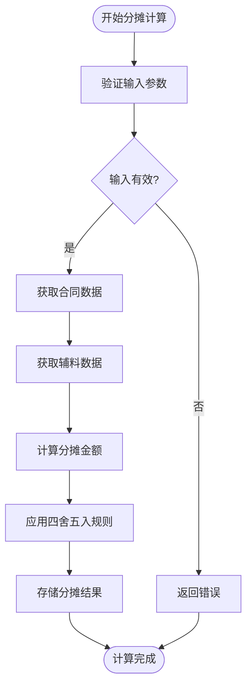
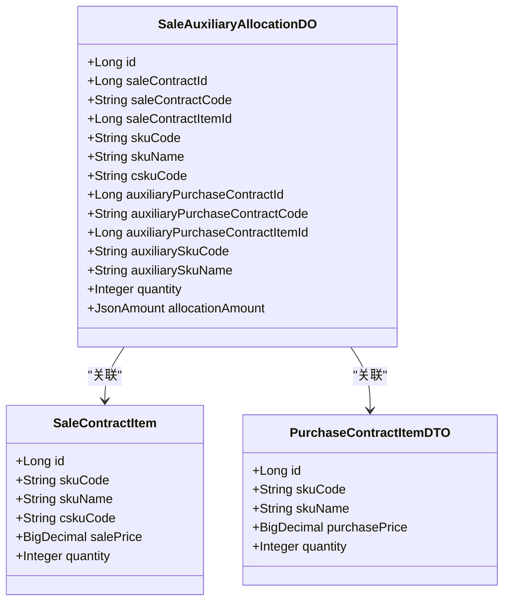
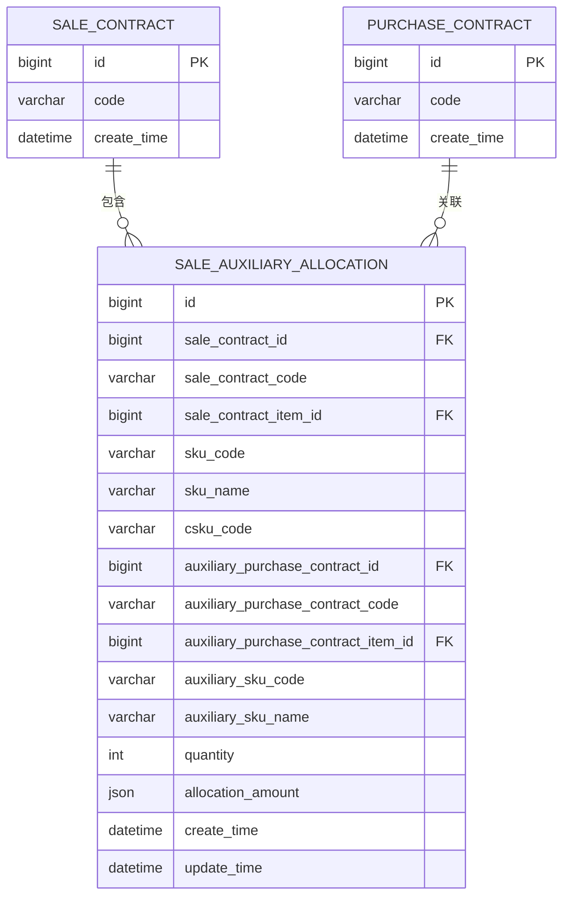
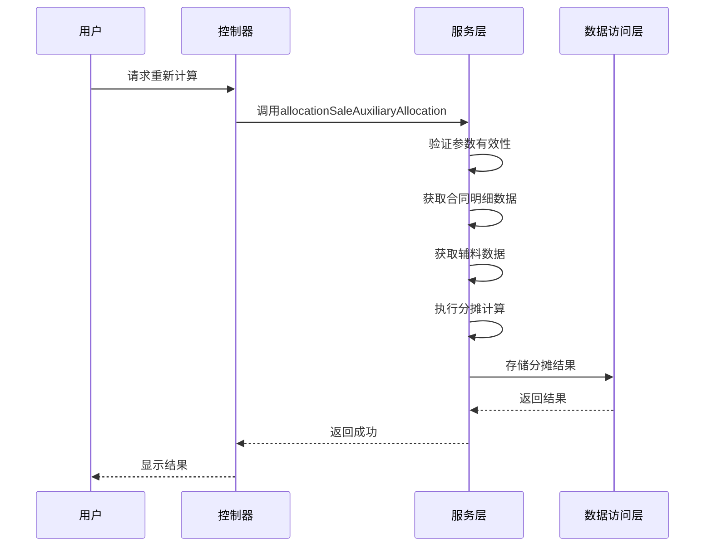
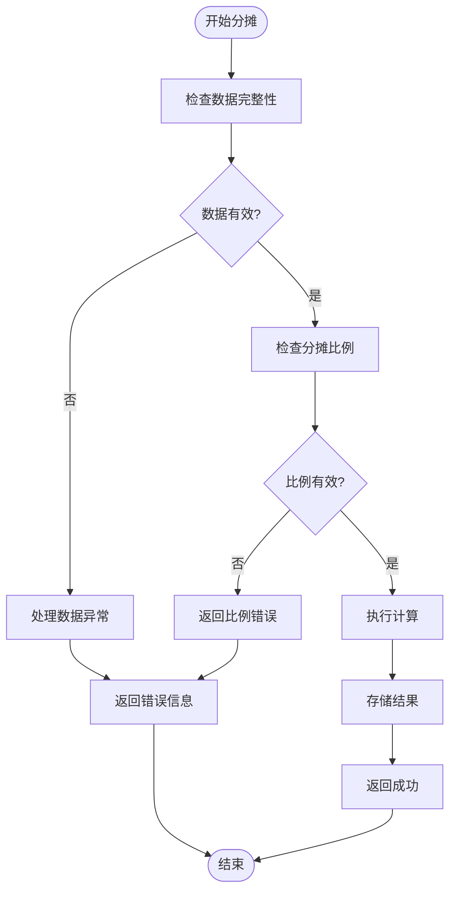

# 辅料分摊

<cite>
**本文档引用文件**  
- [SaleAuxiliaryAllocationServiceImpl.java](file://eplus-module-sms/eplus-module-sms-biz/src/main/java/com/syj/eplus/module/sms/service/saleauxiliaryallocation/SaleAuxiliaryAllocationServiceImpl.java)
- [SaleAuxiliaryAllocationDO.java](file://eplus-module-sms/eplus-module-sms-biz/src/main/java/com/syj/eplus/module/sms/dal/dataobject/saleauxiliaryallocation/SaleAuxiliaryAllocationDO.java)
- [SaleAuxiliaryAllocationApi.java](file://eplus-module-sms/eplus-module-sms-api/src/main/java/com/syj/eplus/module/sms/api/SaleAuxiliaryAllocationApi.java)
- [SaleAuxiliaryAllocationDTO.java](file://eplus-module-sms/eplus-module-sms-api/src/main/java/com/syj/eplus/module/sms/api/dto/SaleAuxiliaryAllocationDTO.java)
- [JsonAmount.java](file://eplus-framework/eplus-common/src/main/java/com/syj/eplus/framework/common/entity/JsonAmount.java)
- [V1_0_0_188__新建销售合同辅料分摊表表.sql](file://eplus-flyway/src/main/resources/db/migration/common/V1_0_0_188__新建销售合同辅料分摊表表.sql)
- [AllocateTypeEnum.java](file://eplus-module-sms/eplus-module-sms-api/src/main/java/com/syj/eplus/module/sms/enums/AllocateTypeEnum.java)
- [AllocateConditionTypeEnum.java](file://eplus-module-sms/eplus-module-sms-api/src/main/java/com/syj/eplus/module/sms/enums/AllocateConditionTypeEnum.java)
</cite>

## 目录
1. [引言](#引言)
2. [辅料分摊配置参数](#辅料分摊配置参数)
3. [分摊金额计算逻辑](#分摊金额计算逻辑)
4. [分摊结果精度控制与四舍五入](#分摊结果精度控制与四舍五入)
5. [辅料分摊与销售合同明细的关联关系](#辅料分摊与销售合同明细的关联关系)
6. [分摊数据存储结构设计](#分摊数据存储结构设计)
7. [辅料分摊重新计算机制](#辅料分摊重新计算机制)
8. [使用示例](#使用示例)
9. [异常情况处理](#异常情况处理)

## 引言

辅料分摊功能是销售合同管理中的重要组成部分，用于将辅料采购成本合理分配到各个销售合同明细中。该功能支持多种分摊策略，确保财务核算的准确性和透明度。通过本功能，企业可以实现精细化的成本控制和利润分析。

**本文档引用文件**  
- [SaleAuxiliaryAllocationServiceImpl.java](file://eplus-module-sms/eplus-module-sms-biz/src/main/java/com/syj/eplus/module/sms/service/saleauxiliaryallocation/SaleAuxiliaryAllocationServiceImpl.java)
- [SaleAuxiliaryAllocationDO.java](file://eplus-module-sms/eplus-module-sms-biz/src/main/java/com/syj/eplus/module/sms/dal/dataobject/saleauxiliaryallocation/SaleAuxiliaryAllocationDO.java)

## 辅料分摊配置参数

辅料分摊功能支持灵活的配置参数，主要包括分摊类型和分摊比例定义。

### 分摊类型

系统支持多种分摊类型，通过 `AllocateTypeEnum` 枚举定义：

- **不分配**：不进行任何分摊
- **固定利润率**：按照预设的固定利润率进行分摊
- **随机利润率**：根据随机利润率进行分摊

### 分摊条件类型

分摊条件通过 `AllocateConditionTypeEnum` 枚举定义，支持以下条件判断：

- 无条件分摊
- 大于（>）
- 大于等于（>=）
- 小于（<）
- 小于等于（<=）

这些配置参数允许用户根据实际业务需求灵活设置分摊规则。

**本文档引用文件**  
- [AllocateTypeEnum.java](file://eplus-module-sms/eplus-module-sms-api/src/main/java/com/syj/eplus/module/sms/enums/AllocateTypeEnum.java)
- [AllocateConditionTypeEnum.java](file://eplus-module-sms/eplus-module-sms-api/src/main/java/com/syj/eplus/module/sms/enums/AllocateConditionTypeEnum.java)

## 分摊金额计算逻辑

辅料分摊金额的计算基于精确的数学公式和业务规则。

### 计算公式

分摊金额的计算遵循以下核心公式：

```
分摊金额 = (辅料采购金额 × 分摊比例) / 100
```

在实际实现中，系统使用 `JsonAmount` 类型来处理金额计算，确保货币精度和类型安全。

### 金额处理

系统通过 `JsonAmount` 类提供安全的金额运算，包括加法、减法和乘法操作：

```java
public JsonAmount add(JsonAmount other)
public JsonAmount sub(JsonAmount other)
public JsonAmount mul(BigDecimal quantity)
```

这些方法确保在进行金额计算时不会出现精度丢失问题。



**图表来源**  
- [SaleAuxiliaryAllocationServiceImpl.java](file://eplus-module-sms/eplus-module-sms-biz/src/main/java/com/syj/eplus/module/sms/service/saleauxiliaryallocation/SaleAuxiliaryAllocationServiceImpl.java)
- [JsonAmount.java](file://eplus-framework/eplus-common/src/main/java/com/syj/eplus/framework/common/entity/JsonAmount.java)

## 分摊结果精度控制与四舍五入

系统采用严格的精度控制策略来确保分摊结果的准确性。

### 精度控制

所有金额计算都使用 `BigDecimal` 类型，并设置统一的精度标准：

- 计算过程中保持高精度（通常为6位小数）
- 最终结果根据业务需求进行四舍五入

### 四舍五入规则

系统采用 HALF_UP 模式进行四舍五入，这是金融计算中最常用的模式。在 `CalculationDict.DECIMAL_PRECISION` 常量中定义了具体的精度位数。

```java
.setScale(CalculationDict.DECIMAL_PRECISION, RoundingMode.HALF_UP)
```

这种处理方式确保了计算结果的公平性和一致性。

**本文档引用文件**  
- [SaleContractServiceImpl.java](file://eplus-module-sms/eplus-module-sms-biz/src/main/java/com/syj/eplus/module/sms/service/salecontract/SaleContractServiceImpl.java)
- [CalcSaleContactUtil.java](file://eplus-module-sms/eplus-module-sms-biz/src/main/java/com/syj/eplus/module/sms/util/CalcSaleContactUtil.java)

## 辅料分摊与销售合同明细的关联关系

辅料分摊功能与销售合同明细建立了紧密的关联关系。

### 关联字段

主要关联字段包括：

- `saleContractItemId`：销售合同明细主键
- `auxiliaryPurchaseContractItemId`：辅料采购合同明细主键
- `saleContractId`：销售合同主键

### 关联逻辑

系统通过以下方式建立关联：

1. 获取销售合同明细列表
2. 获取辅料采购合同明细
3. 根据产品信息建立映射关系
4. 执行分摊计算并存储关联数据

这种设计确保了分摊结果可以追溯到具体的合同明细。



**图表来源**  
- [SaleAuxiliaryAllocationDO.java](file://eplus-module-sms/eplus-module-sms-biz/src/main/java/com/syj/eplus/module/sms/dal/dataobject/saleauxiliaryallocation/SaleAuxiliaryAllocationDO.java)
- [SaleContractItem.java](file://eplus-module-sms/eplus-module-sms-biz/src/main/java/com/syj/eplus/module/sms/dal/dataobject/salecontractitem/SaleContractItem.java)

## 分摊数据存储结构设计

辅料分摊数据采用专门的数据库表进行存储。

### 数据库表结构

`sms_sale_auxiliary_allocation` 表结构如下：

- `id`：主键
- `sale_contract_id`：销售合同主键
- `sale_contract_code`：销售合同编号
- `sale_contract_item_id`：销售合同明细主键
- `sku_code`：产品编号
- `sku_name`：产品名称
- `csku_code`：客户货号
- `auxiliary_purchase_contract_id`：辅料采购合同主键
- `auxiliary_purchase_contract_code`：辅料采购合同编号
- `auxiliary_purchase_contract_item_id`：辅料采购合同明细主键
- `auxiliary_sku_code`：辅料产品编号
- `auxiliary_sku_name`：辅料产品名称
- `quantity`：采购数量
- `allocation_amount`：分摊金额（JSON格式）

### 数据类型

特别值得注意的是，`allocation_amount` 字段使用 JSON 类型存储，通过 `JsonAmountTypeHandler` 进行类型转换，支持多币种金额存储。



**图表来源**  
- [V1_0_0_188__新建销售合同辅料分摊表表.sql](file://eplus-flyway/src/main/resources/db/migration/common/V1_0_0_188__新建销售合同辅料分摊表表.sql)
- [SaleAuxiliaryAllocationDO.java](file://eplus-module-sms/eplus-module-sms-biz/src/main/java/com/syj/eplus/module/sms/dal/dataobject/saleauxiliaryallocation/SaleAuxiliaryAllocationDO.java)

## 辅料分摊重新计算机制

系统提供了灵活的重新计算机制，支持手动和自动触发。

### 手动触发

用户可以通过以下方式手动触发重新计算：

- 在管理界面点击"重新计算"按钮
- 调用 `allocationSaleAuxiliaryAllocation` 接口
- 使用 `cancelAllocationSaleAuxiliaryAllocation` 取消后重新分摊

### 自动触发

系统在以下场景自动触发重新计算：

- 销售合同明细发生变更
- 辅料采购合同信息更新
- 汇率或价格基准发生变化

### 重新计算流程



**图表来源**  
- [SaleAuxiliaryAllocationController.java](file://eplus-module-sms/eplus-module-sms-biz/src/main/java/com/syj/eplus/module/sms/controller/admin/saleauxiliaryallocation/SaleAuxiliaryAllocationController.java)
- [SaleAuxiliaryAllocationServiceImpl.java](file://eplus-module-sms/eplus-module-sms-biz/src/main/java/com/syj/eplus/module/sms/service/saleauxiliaryallocation/SaleAuxiliaryAllocationServiceImpl.java)

## 使用示例

以下展示不同分摊策略下的计算示例。

### 按固定利润率分摊

假设：
- 销售合同金额：100,000 RMB
- 辅料采购金额：10,000 RMB
- 固定利润率：5%

计算过程：
1. 计算利润：100,000 × 5% = 5,000 RMB
2. 分摊金额：10,000 × (5,000/100,000) = 500 RMB

### 按数量比例分摊

假设：
- 总采购数量：1,000 件
- 某合同明细数量：200 件
- 辅料总金额：10,000 RMB

计算过程：
1. 分摊比例：200/1,000 = 20%
2. 分摊金额：10,000 × 20% = 2,000 RMB

这些示例展示了系统支持的多种分摊策略的实际应用。

**本文档引用文件**  
- [SaleAuxiliaryAllocationServiceImpl.java](file://eplus-module-sms/eplus-module-sms-biz/src/main/java/com/syj/eplus/module/sms/service/saleauxiliaryallocation/SaleAuxiliaryAllocationServiceImpl.java)
- [AllocateTypeEnum.java](file://eplus-module-sms/eplus-module-sms-api/src/main/java/com/syj/eplus/module/sms/enums/AllocateTypeEnum.java)

## 异常情况处理

系统对各种异常情况进行了完善的处理。

### 分摊比例校验

当分摊比例总和不等于100%时，系统会进行以下处理：

1. 前端输入验证
2. 后端业务逻辑校验
3. 返回明确的错误信息

### 错误处理策略

系统定义了专门的异常处理机制：

- `SALE_AUXILIARY_ALLOCATION_NOT_EXISTS`：分摊记录不存在
- `SALE_CONTRACT_NOT_EXISTS`：销售合同不存在
- `PURCHASE_ITEM_NOT_EXISTS`：采购明细不存在
- `CONTRACT_ITEM_NOT_EXISTS`：合同明细不存在

### 异常处理流程



**图表来源**  
- [SaleAuxiliaryAllocationServiceImpl.java](file://eplus-module-sms/eplus-module-sms-biz/src/main/java/com/syj/eplus/module/sms/service/saleauxiliaryallocation/SaleAuxiliaryAllocationServiceImpl.java)
- [ErrorCodeConstants.java](file://eplus-module-sms/eplus-module-sms-api/src/main/java/com/syj/eplus/module/sms/enums/ErrorCodeConstants.java)