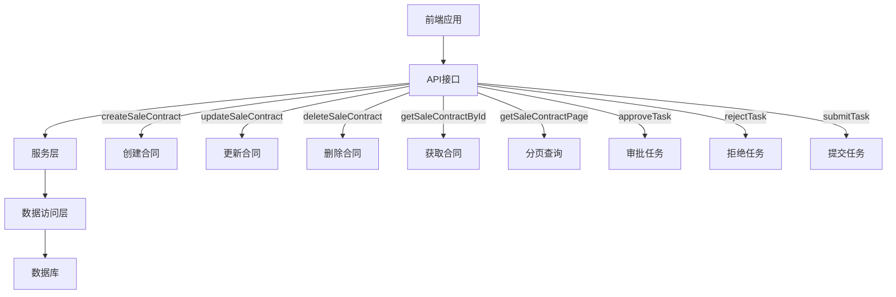
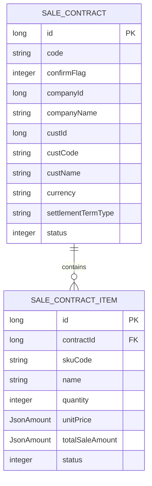
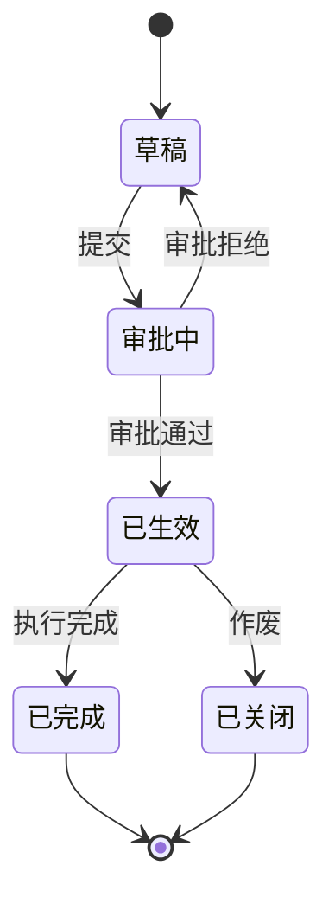
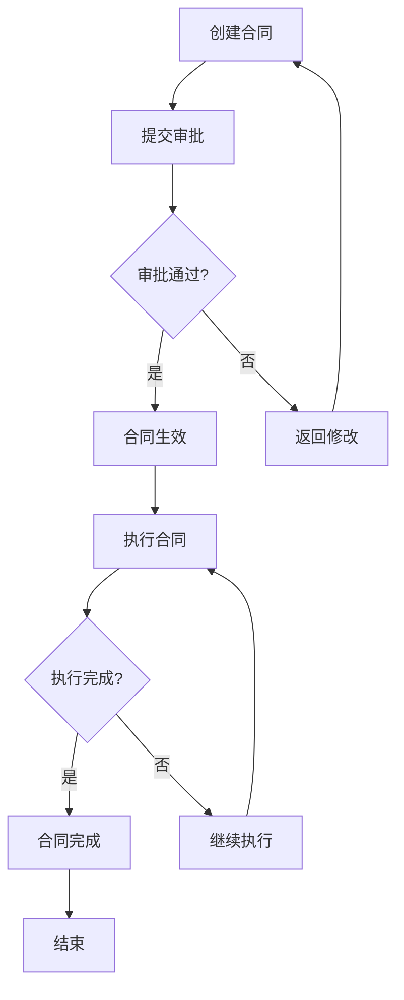

# 销售合同

<cite>
**本文档引用文件**  
- [SaleContractApi.java](file://eplus-module-sms/eplus-module-sms-api/src/main/java/com/syj/eplus/module/sms/api/SaleContractApi.java)
- [SaleContractDTO.java](file://eplus-module-sms/eplus-module-sms-api/src/main/java/com/syj/eplus/module/sms/api/dto/SaleContractDTO.java)
- [SaleContractSaveDTO.java](file://eplus-module-sms/eplus-module-sms-api/src/main/java/com/syj/eplus/module/sms/api/dto/SaleContractSaveDTO.java)
- [SaleContractItemDTO.java](file://eplus-module-sms/eplus-module-sms-api/src/main/java/com/syj/eplus/module/sms/api/dto/SaleContractItemDTO.java)
- [SaleContractItemSaveDTO.java](file://eplus-module-sms/eplus-module-sms-api/src/main/java/com/syj/eplus/module/sms/api/dto/SaleContractItemSaveDTO.java)
- [SaleContractApiImpl.java](file://eplus-module-sms/eplus-module-sms-biz/src/main/java/com/syj/eplus/module/sms/api/SaleContractApiImpl.java)
- [DomesticSaleContractController.java](file://eplus-module-sms/eplus-module-sms-biz/src/main/java/com/syj/eplus/module/sms/controller/admin/salecontract/DomesticSaleContractController.java)
- [ExportSaleContractController.java](file://eplus-module-sms/eplus-module-sms-biz/src/main/java/com/syj/eplus/module/sms/controller/admin/salecontract/ExportSaleContractController.java)
- [SaleContractDO.java](file://eplus-module-sms/eplus-module-sms-biz/src/main/java/com/syj/eplus/module/sms/dal/dataobject/salecontract/SaleContractDO.java)
- [SaleContractItem.java](file://eplus-module-sms/eplus-module-sms-biz/src/main/java/com/syj/eplus/module/sms/dal/dataobject/salecontractitem/SaleContractItem.java)
- [SaleContractStatusEnum.java](file://eplus-framework/eplus-common/src/main/java/com/syj/eplus/framework/common/enums/SaleContractStatusEnum.java)
</cite>

## 目录
1. [引言](#引言)
2. [销售合同核心功能](#销售合同核心功能)
3. [销售合同API接口定义](#销售合同api接口定义)
4. [销售合同数据结构设计](#销售合同数据结构设计)
5. [销售合同状态机](#销售合同状态机)
6. [销售合同辅料分摊](#销售合同辅料分摊)
7. [销售合同业务流程](#销售合同业务流程)
8. [关键业务规则](#关键业务规则)
9. [与采购合同的关联关系](#与采购合同的关联关系)

## 引言

销售合同是企业销售业务的核心单据，用于记录与客户之间的销售交易信息。本系统中的销售合同功能涵盖了从合同创建、变更、审批到同步的完整生命周期管理。销售合同分为内销合同和外销合同两种类型，支持复杂的业务场景，包括合同变更、状态管理、辅料分摊等。系统通过API接口提供合同的创建、查询、修改和删除等操作，确保数据的一致性和完整性。

**本文档引用文件**  
- [SaleContractApi.java](file://eplus-module-sms/eplus-module-sms-api/src/main/java/com/syj/eplus/module/sms/api/SaleContractApi.java)
- [SaleContractStatusEnum.java](file://eplus-framework/eplus-common/src/main/java/com/syj/eplus/framework/common/enums/SaleContractStatusEnum.java)

## 销售合同核心功能

销售合同的核心功能包括合同的创建、变更、审批和同步。用户可以通过系统创建新的销售合同，填写合同的基本信息和明细信息。合同创建后，可以进行变更操作，系统会记录变更前后的差异。审批流程通过工作流引擎实现，支持多级审批。合同审批通过后，状态会更新为“已生效”，并可以进行后续的采购、出运等操作。系统还支持合同的同步功能，确保合同信息在不同模块之间保持一致。

**本文档引用文件**  
- [DomesticSaleContractController.java](file://eplus-module-sms/eplus-module-sms-biz/src/main/java/com/syj/eplus/module/sms/controller/admin/salecontract/DomesticSaleContractController.java)
- [ExportSaleContractController.java](file://eplus-module-sms/eplus-module-sms-biz/src/main/java/com/syj/eplus/module/sms/controller/admin/salecontract/ExportSaleContractController.java)
- [SaleContractApiImpl.java](file://eplus-module-sms/eplus-module-sms-biz/src/main/java/com/syj/eplus/module/sms/api/SaleContractApiImpl.java)

## 销售合同API接口定义

销售合同API接口提供了对销售合同的增删改查操作。主要接口包括：

- `createSaleContract`: 创建销售合同
- `updateSaleContract`: 更新销售合同
- `deleteSaleContract`: 删除销售合同
- `getSaleContractById`: 根据ID获取销售合同
- `getSaleContractPage`: 分页获取销售合同列表
- `approveTask`: 审批任务
- `rejectTask`: 拒绝任务
- `submitTask`: 提交任务

这些接口通过RESTful风格设计，返回JSON格式的数据，便于前端调用和集成。

**图源**  
- [SaleContractApi.java](file://eplus-module-sms/eplus-module-sms-api/src/main/java/com/syj/eplus/module/sms/api/SaleContractApi.java)
- [SaleContractApiImpl.java](file://eplus-module-sms/eplus-module-sms-biz/src/main/java/com/syj/eplus/module/sms/api/SaleContractApiImpl.java)

**本文档引用文件**  
- [SaleContractApi.java](file://eplus-module-sms/eplus-module-sms-api/src/main/java/com/syj/eplus/module/sms/api/SaleContractApi.java)
- [SaleContractApiImpl.java](file://eplus-module-sms/eplus-module-sms-biz/src/main/java/com/syj/eplus/module/sms/api/SaleContractApiImpl.java)

## 销售合同数据结构设计

销售合同的数据结构设计包括主表和明细表。主表`SaleContractDO`存储合同的基本信息，如合同编号、客户信息、交易币别、价格条款等。明细表`SaleContractItem`存储合同的明细信息，如产品编号、数量、单价、金额等。主表和明细表通过`contractId`字段关联，实现一对多的关系。

### 销售合同主表结构

| 字段名 | 类型 | 描述 |
| --- | --- | --- |
| id | Long | 主键 |
| code | String | 编号 |
| confirmFlag | Integer | 确认状态 |
| companyId | Long | 内部法人单位主键 |
| companyName | String | 内部法人单位名称 |
| custId | Long | 客户主键 |
| custCode | String | 客户编号 |
| custName | String | 客户名称 |
| currency | String | 交易币别 |
| settlementTermType | String | 价格条款 |
| status | Integer | 状态 |

### 销售合同明细表结构

| 字段名 | 类型 | 描述 |
| --- | --- | --- |
| id | Long | 主键 |
| contractId | Long | 合同id |
| skuCode | String | 产品编号 |
| name | String | 中文品名 |
| quantity | Integer | 数量 |
| unitPrice | JsonAmount | 销售单价 |
| totalSaleAmount | JsonAmount | 外销总金额 |
| status | Integer | 状态 |

**图源**  
- [SaleContractDO.java](file://eplus-module-sms/eplus-module-sms-biz/src/main/java/com/syj/eplus/module/sms/dal/dataobject/salecontract/SaleContractDO.java)
- [SaleContractItem.java](file://eplus-module-sms/eplus-module-sms-biz/src/main/java/com/syj/eplus/module/sms/dal/dataobject/salecontractitem/SaleContractItem.java)

**本文档引用文件**  
- [SaleContractDO.java](file://eplus-module-sms/eplus-module-sms-biz/src/main/java/com/syj/eplus/module/sms/dal/dataobject/salecontract/SaleContractDO.java)
- [SaleContractItem.java](file://eplus-module-sms/eplus-module-sms-biz/src/main/java/com/syj/eplus/module/sms/dal/dataobject/salecontractitem/SaleContractItem.java)

## 销售合同状态机

销售合同的状态机定义了合同在其生命周期中的各种状态及其转换规则。合同状态包括草稿、审批中、已生效、已完成、已关闭等。状态转换通过审批流程驱动，用户提交合同后，状态变为“审批中”，审批通过后变为“已生效”，合同执行完成后变为“已完成”，合同作废后变为“已关闭”。

### 状态转换图

**图源**  
- [SaleContractStatusEnum.java](file://eplus-framework/eplus-common/src/main/java/com/syj/eplus/framework/common/enums/SaleContractStatusEnum.java)

**本文档引用文件**  
- [SaleContractStatusEnum.java](file://eplus-framework/eplus-common/src/main/java/com/syj/eplus/framework/common/enums/SaleContractStatusEnum.java)

## 销售合同辅料分摊

销售合同辅料分摊功能用于将辅料成本按比例分摊到各个销售明细项上。分摊比例可以根据数量、金额或其他自定义规则计算。系统在生成采购计划时，会根据分摊结果计算每个明细项的采购成本，确保成本核算的准确性。

**本文档引用文件**  
- [SaleContractApi.java](file://eplus-module-sms/eplus-module-sms-api/src/main/java/com/syj/eplus/module/sms/api/SaleContractApi.java)
- [SaleContractApiImpl.java](file://eplus-module-sms/eplus-module-sms-biz/src/main/java/com/syj/eplus/module/sms/api/SaleContractApiImpl.java)

## 销售合同业务流程

销售合同的业务流程从合同创建开始，经过审批、生效、执行到最终完成。用户创建合同后，提交审批，审批通过后合同生效，可以进行采购、出运等操作。合同执行过程中，系统会实时更新合同状态和明细信息。合同完成后，状态变为“已完成”。

**图源**  
- [DomesticSaleContractController.java](file://eplus-module-sms/eplus-module-sms-biz/src/main/java/com/syj/eplus/module/sms/controller/admin/salecontract/DomesticSaleContractController.java)
- [ExportSaleContractController.java](file://eplus-module-sms/eplus-module-sms-biz/src/main/java/com/syj/eplus/module/sms/controller/admin/salecontract/ExportSaleContractController.java)

**本文档引用文件**  
- [DomesticSaleContractController.java](file://eplus-module-sms/eplus-module-sms-biz/src/main/java/com/syj/eplus/module/sms/controller/admin/salecontract/DomesticSaleContractController.java)
- [ExportSaleContractController.java](file://eplus-module-sms/eplus-module-sms-biz/src/main/java/com/syj/eplus/module/sms/controller/admin/salecontract/ExportSaleContractController.java)

## 关键业务规则

销售合同的关键业务规则包括金额一致性校验和客户信用额度控制。金额一致性校验确保合同总金额与明细金额之和一致。客户信用额度控制在创建合同时检查客户信用额度，如果合同金额超过信用额度，则不允许创建合同。

**本文档引用文件**  
- [SaleContractApiImpl.java](file://eplus-module-sms/eplus-module-sms-biz/src/main/java/com/syj/eplus/module/sms/api/SaleContractApiImpl.java)

## 与采购合同的关联关系

销售合同与采购合同通过“下推采购计划”功能关联。当销售合同审批通过后，用户可以将其下推为采购计划，生成相应的采购合同。系统会根据销售合同的明细信息自动填充采购合同的内容，确保数据的一致性。采购合同的状态会反向影响销售合同，例如采购合同的变更可能触发销售合同的变更审批。

**本文档引用文件**  
- [DomesticSaleContractController.java](file://eplus-module-sms/eplus-module-sms-biz/src/main/java/com/syj/eplus/module/sms/controller/admin/salecontract/DomesticSaleContractController.java)
- [ExportSaleContractController.java](file://eplus-module-sms/eplus-module-sms-biz/src/main/java/com/syj/eplus/module/sms/controller/admin/salecontract/ExportSaleContractController.java)