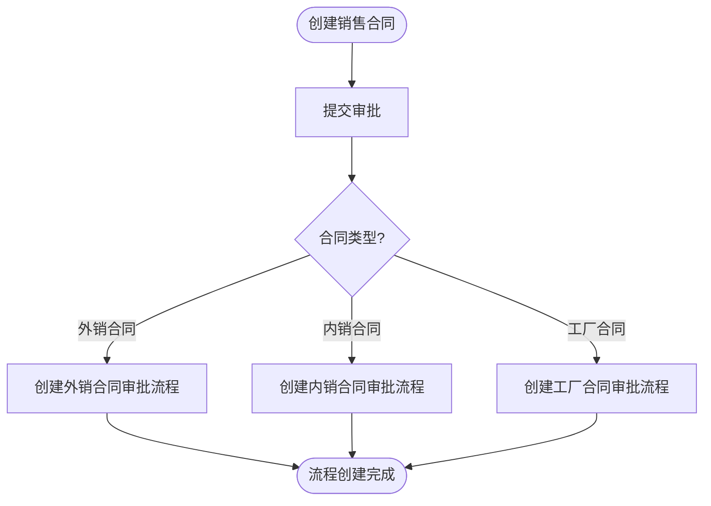
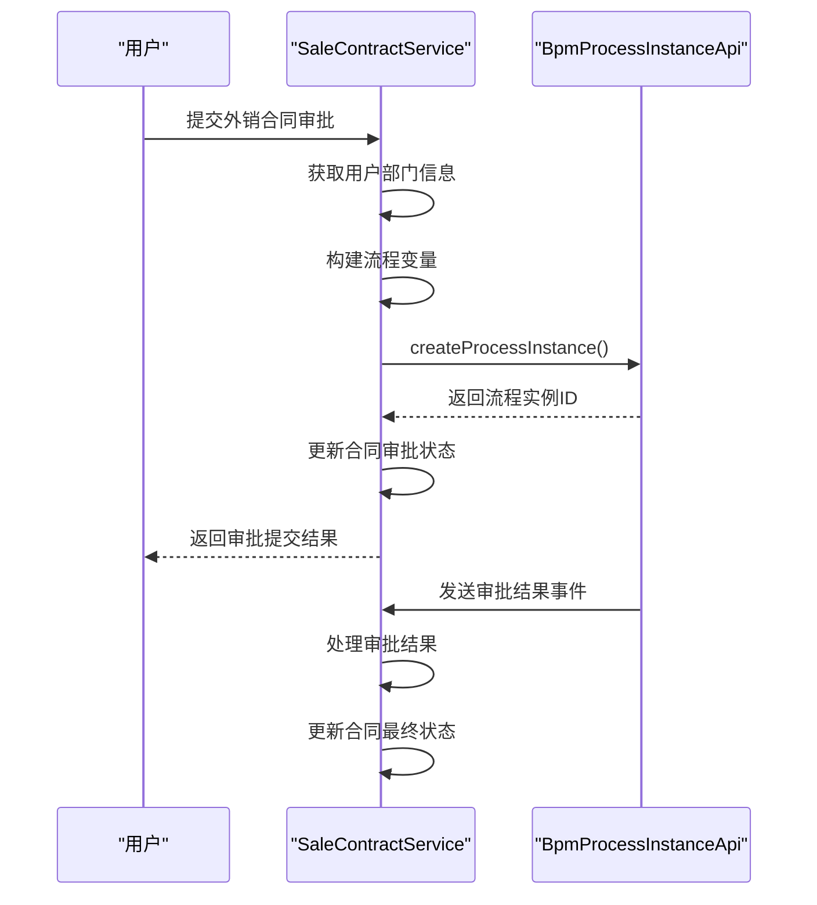
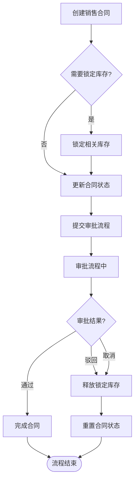
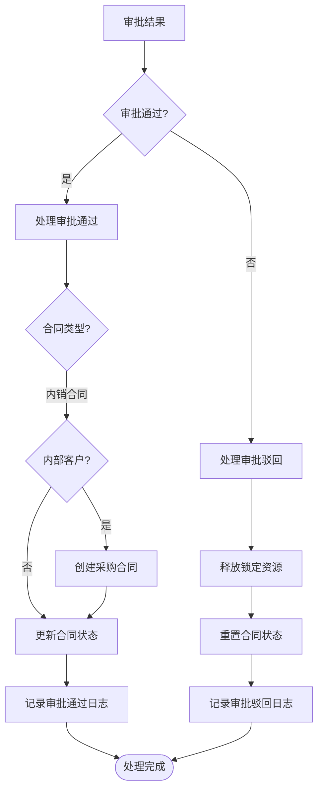
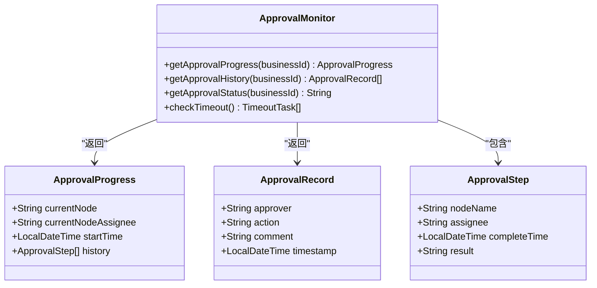
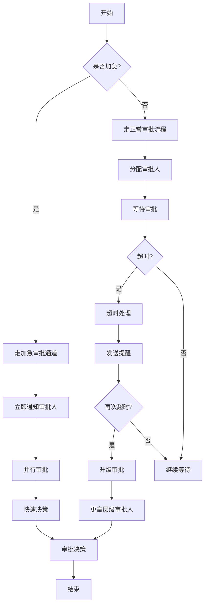

# 销售合同审批

<cite>
**本文档引用的文件**  
- [SaleContractServiceImpl.java](file://eplus-module-sms/eplus-module-sms-biz/src/main/java/com/syj/eplus/module/sms/service/salecontract/SaleContractServiceImpl.java)
- [SaleContractDict.java](file://eplus-framework/eplus-common/src/main/java/com/syj/eplus/framework/common/dict/SaleContractDict.java)
- [SaleContractStatusEnum.java](file://eplus-framework/eplus-common/src/main/java/com/syj/eplus/framework/common/enums/SaleContractStatusEnum.java)
- [BpmProcessInstanceApi.java](file://yudao-module-bpm/yudao-module-bpm-api/src/main/java/cn/iocoder/yudao/module/bpm/api/task/BpmProcessInstanceApi.java)
- [ExportSaleContractAuditResultListener.java](file://eplus-module-sms/eplus-module-sms-biz/src/main/java/com/syj/eplus/module/sms/listener/salecontract/ExportSaleContractAuditResultListener.java)
- [ExportContractChangeResultListener.java](file://eplus-module-sms/eplus-module-sms-biz/src/main/java/com/syj/eplus/module/sms/listener/salecontract/ExportContractChangeResultListener.java)
- [StockLockServiceImpl.java](file://eplus-module-wms/eplus-module-wms-biz/src/main/java/com/syj/eplus/module/wms/service/stocklock/StockLockServiceImpl.java)
- [PurchaseContractServiceImpl.java](file://eplus-module-scm/eplus-module-scm-biz/src/main/java/com/syj/eplus/module/scm/service/purchasecontract/PurchaseContractServiceImpl.java)
</cite>

## 目录
1. [引言](#引言)
2. [销售合同审批流程配置](#销售合同审批流程配置)
3. [工作流引擎集成机制](#工作流引擎集成机制)
4. [数据锁定策略](#数据锁定策略)
5. [审批通过与驳回处理逻辑](#审批通过与驳回处理逻辑)
6. [审批流程监控与查询](#审批流程监控与查询)
7. [超时处理与加急审批](#超时处理与加急审批)
8. [结论](#结论)

## 引言
销售合同审批功能是企业业务流程中的关键环节，确保合同在执行前经过必要的审核和批准。本文档详细介绍了销售合同审批流程的集成与实现，包括审批流程的配置、工作流引擎的集成、数据锁定策略、审批结果处理、流程监控以及特殊处理机制。

## 销售合同审批流程配置

销售合同审批流程的配置包括审批节点设置、审批人指定规则和审批条件定义。系统支持多种类型的销售合同，包括外销合同、内销合同和工厂合同，每种合同类型都有其特定的审批流程。

审批流程通过流程定义键（Process Definition Key）进行标识，如外销合同使用`SaleDict.PROCESS_DEFINITION_KEY_EXPORT`，内销合同使用`SaleDict.PROCESS_DEFINITION_KEY_DOMESTIC`，工厂合同使用`SaleDict.PROCESS_DEFINITION_KEY_FACTORY`。这些键在系统中作为唯一标识，用于创建和管理相应的审批流程实例。

审批人指定规则基于用户部门代码，系统在提交审批任务时会根据当前用户的部门代码自动确定审批人。审批条件定义则通过流程变量（variables）传递，例如在提交外销合同审批时，会将部门代码作为变量传递给工作流引擎。

**图示来源**
- [SaleContractServiceImpl.java](file://eplus-module-sms/eplus-module-sms-biz/src/main/java/com/syj/eplus/module/sms/service/salecontract/SaleContractServiceImpl.java#L1638-L1658)

**本节来源**
- [SaleContractServiceImpl.java](file://eplus-module-sms/eplus-module-sms-biz/src/main/java/com/syj/eplus/module/sms/service/salecontract/SaleContractServiceImpl.java#L1638-L1658)
- [SaleContractDict.java](file://eplus-framework/eplus-common/src/main/java/com/syj/eplus/framework/common/dict/SaleContractDict.java)

## 工作流引擎集成机制

销售合同审批功能与工作流引擎深度集成，通过`BpmProcessInstanceApi`接口实现审批任务的创建、分配和状态更新。当用户提交销售合同审批时，系统调用`createProcessInstance`方法创建一个新的流程实例。

审批任务的创建过程包括：
1. 获取当前用户的部门信息
2. 构建流程变量（如部门代码）
3. 调用工作流API创建流程实例
4. 更新销售合同的审批状态

审批任务的状态更新通过监听器实现。`ExportSaleContractAuditResultListener`监听审批结果事件，根据审批结果更新销售合同的状态。例如，当审批通过时，合同状态更新为"待回签"；当审批驳回时，状态更新为"待提交"。

**图示来源**
- [SaleContractServiceImpl.java](file://eplus-module-sms/eplus-module-sms-biz/src/main/java/com/syj/eplus/module/sms/service/salecontract/SaleContractServiceImpl.java#L1638-L1646)
- [ExportSaleContractAuditResultListener.java](file://eplus-module-sms/eplus-module-sms-biz/src/main/java/com/syj/eplus/module/sms/listener/salecontract/ExportSaleContractAuditResultListener.java#L22-L38)

**本节来源**
- [SaleContractServiceImpl.java](file://eplus-module-sms/eplus-module-sms-biz/src/main/java/com/syj/eplus/module/sms/service/salecontract/SaleContractServiceImpl.java#L1638-L1646)
- [BpmProcessInstanceApi.java](file://yudao-module-bpm/yudao-module-bpm-api/src/main/java/cn/iocoder/yudao/module/bpm/api/task/BpmProcessInstanceApi.java)
- [ExportSaleContractAuditResultListener.java](file://eplus-module-sms/eplus-module-sms-biz/src/main/java/com/syj/eplus/module/sms/listener/salecontract/ExportSaleContractAuditResultListener.java#L22-L38)

## 数据锁定策略

为防止在审批期间对合同进行非法修改，系统实施了严格的数据锁定策略。当销售合同提交审批后，相关数据会被锁定，直到审批流程完成。

数据锁定主要通过以下机制实现：
1. **状态锁定**：合同状态更新为"待审核"，限制对合同的修改操作
2. **库存锁定**：如果合同涉及库存，相关库存会被锁定，防止被其他订单使用
3. **变更控制**：在审批期间，任何对合同的修改都需要重新提交审批流程

库存锁定通过`StockLockServiceImpl`实现，当销售合同创建或更新时，系统会检查并锁定相应的库存。如果审批被驳回或取消，锁定的库存会被释放。

**图示来源**
- [SaleContractServiceImpl.java](file://eplus-module-sms/eplus-module-sms-biz/src/main/java/com/syj/eplus/module/sms/service/salecontract/SaleContractServiceImpl.java#L763-L793)
- [StockLockServiceImpl.java](file://eplus-module-wms/eplus-module-wms-biz/src/main/java/com/syj/eplus/module/wms/service/stocklock/StockLockServiceImpl.java)

**本节来源**
- [SaleContractServiceImpl.java](file://eplus-module-sms/eplus-module-sms-biz/src/main/java/com/syj/eplus/module/sms/service/salecontract/SaleContractServiceImpl.java#L763-L793)
- [StockLockServiceImpl.java](file://eplus-module-wms/eplus-module-wms-biz/src/main/java/com/syj/eplus/module/wms/service/stocklock/StockLockServiceImpl.java)

## 审批通过与驳回处理逻辑

审批通过和驳回后的业务处理逻辑是销售合同审批功能的核心部分。系统根据不同的审批结果执行相应的业务操作。

### 审批通过处理
当审批通过时，系统执行以下操作：
1. 更新合同状态为"待回签"
2. 如果是内销合同且客户为内部客户，自动创建采购合同
3. 更新相关业务流程状态
4. 记录操作日志

对于内销合同，如果客户是内部客户，系统会自动创建内部采购合同，实现业务流程的自动化。

### 审批驳回处理
当审批被驳回时，系统执行以下操作：
1. 更新合同状态为"待提交"
2. 释放之前锁定的资源（如库存）
3. 通知相关人员重新修改合同
4. 记录驳回原因和操作日志

**图示来源**
- [SaleContractServiceImpl.java](file://eplus-module-sms/eplus-module-sms-biz/src/main/java/com/syj/eplus/module/sms/service/salecontract/SaleContractServiceImpl.java#L1660-L1684)
- [PurchaseContractServiceImpl.java](file://eplus-module-scm/eplus-module-scm-biz/src/main/java/com/syj/eplus/module/scm/service/purchasecontract/PurchaseContractServiceImpl.java#L1530-L1564)

**本节来源**
- [SaleContractServiceImpl.java](file://eplus-module-sms/eplus-module-sms-biz/src/main/java/com/syj/eplus/module/sms/service/salecontract/SaleContractServiceImpl.java#L1660-L1684)
- [PurchaseContractServiceImpl.java](file://eplus-module-scm/eplus-module-scm-biz/src/main/java/com/syj/eplus/module/scm/service/purchasecontract/PurchaseContractServiceImpl.java#L1530-L1564)

## 审批流程监控与查询

系统提供了完善的审批流程监控和查询功能，用户可以实时跟踪审批进度。通过工作流引擎的API，系统能够获取当前审批任务的状态、审批历史和下一步审批人。

审批流程监控主要包括：
1. **进度跟踪**：显示审批流程的当前节点和历史记录
2. **状态查询**：获取合同的当前审批状态
3. **审批历史**：查看所有审批操作的记录
4. **超时预警**：监控审批任务的处理时间

用户可以通过合同编号或业务ID查询审批流程的详细信息，包括当前审批人、审批意见和处理时间。系统还支持批量查询多个合同的审批状态，方便管理人员进行整体监控。

**图示来源**
- [SaleContractServiceImpl.java](file://eplus-module-sms/eplus-module-sms-biz/src/main/java/com/syj/eplus/module/sms/service/salecontract/SaleContractServiceImpl.java)
- [BpmProcessInstanceApi.java](file://yudao-module-bpm/yudao-module-bpm-api/src/main/java/cn/iocoder/yudao/module/bpm/api/task/BpmProcessInstanceApi.java)

**本节来源**
- [SaleContractServiceImpl.java](file://eplus-module-sms/eplus-module-sms-biz/src/main/java/com/syj/eplus/module/sms/service/salecontract/SaleContractServiceImpl.java)
- [BpmProcessInstanceApi.java](file://yudao-module-bpm/yudao-module-bpm-api/src/main/java/cn/iocoder/yudao/module/bpm/api/task/BpmProcessInstanceApi.java)

## 超时处理与加急审批

系统实现了审批超时处理机制和加急审批的特殊处理流程，确保审批流程的高效运行。

### 超时处理机制
审批超时处理机制包括：
1. **超时检测**：定期检查长时间未处理的审批任务
2. **提醒通知**：向审批人发送提醒通知
3. **自动升级**：超过一定时间后，将审批任务升级给更高级别的审批人
4. **流程干预**：允许管理人员干预超时的审批流程

### 加急审批流程
加急审批的特殊处理流程包括：
1. **优先级标记**：为加急审批任务设置高优先级
2. **快速通道**：通过简化的审批流程
3. **即时通知**：立即通知审批人处理
4. **并行审批**：允许多个审批人同时审批

系统通过配置超时时间和加急规则，灵活应对不同的业务需求。管理人员可以根据实际情况调整超时阈值和加急处理策略。

**图示来源**
- [SaleContractServiceImpl.java](file://eplus-module-sms/eplus-module-sms-biz/src/main/java/com/syj/eplus/module/sms/service/salecontract/SaleContractServiceImpl.java)
- [BpmProcessInstanceApi.java](file://yudao-module-bpm/yudao-module-bpm-api/src/main/java/cn/iocoder/yudao/module/bpm/api/task/BpmProcessInstanceApi.java)

**本节来源**
- [SaleContractServiceImpl.java](file://eplus-module-sms/eplus-module-sms-biz/src/main/java/com/syj/eplus/module/sms/service/salecontract/SaleContractServiceImpl.java)
- [BpmProcessInstanceApi.java](file://yudao-module-bpm/yudao-module-bpm-api/src/main/java/cn/iocoder/yudao/module/bpm/api/task/BpmProcessInstanceApi.java)

## 结论
销售合同审批功能通过与工作流引擎的深度集成，实现了审批流程的自动化和标准化。系统提供了灵活的审批流程配置、严格的数据锁定策略、完善的审批结果处理机制以及强大的流程监控功能。通过超时处理和加急审批机制，确保了审批流程的高效运行。这些功能共同保障了销售合同管理的规范性和安全性，提高了业务处理效率。