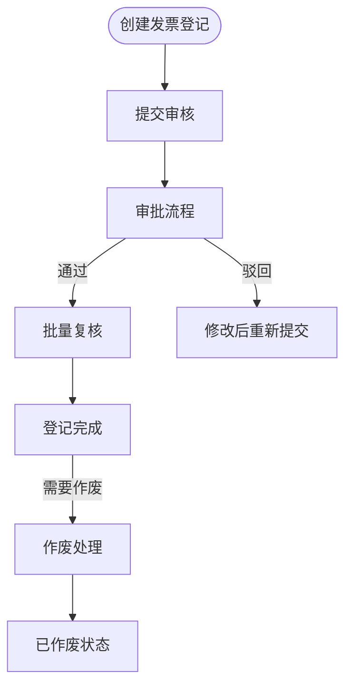
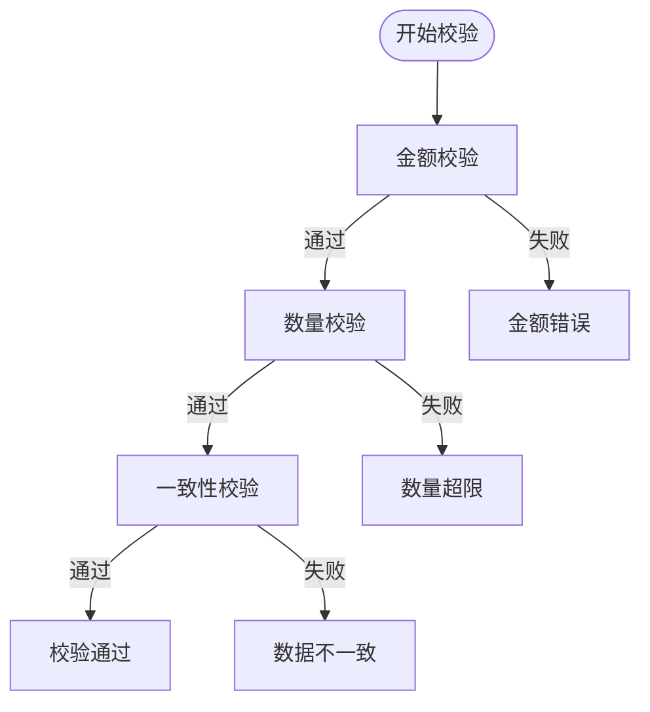
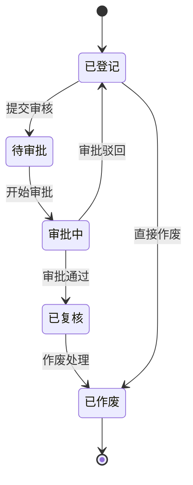
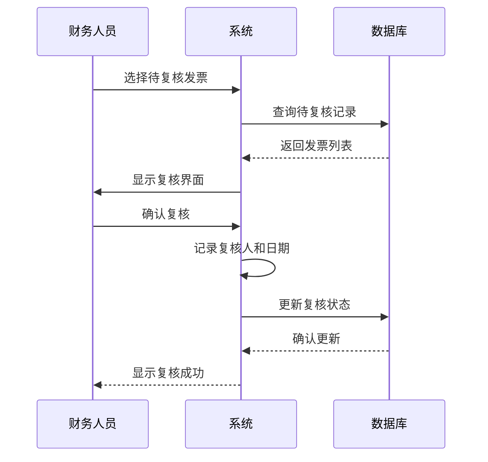
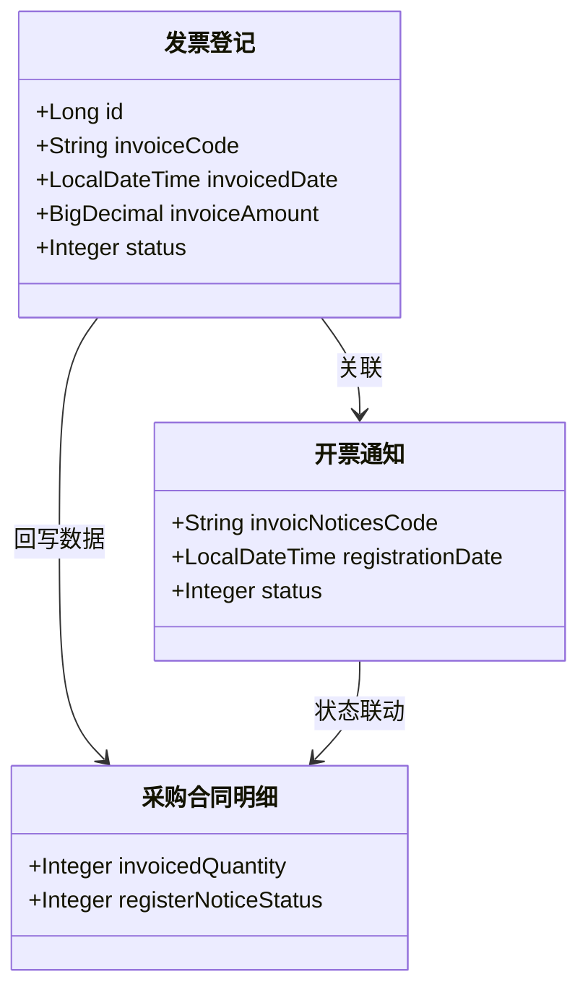
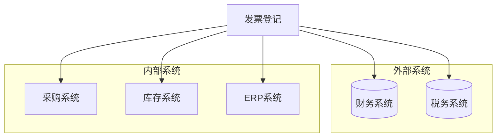

# 发票登记

<cite>
**本文档引用文件**  
- [PurchaseRegistrationController.java](file://eplus-module-scm/eplus-module-scm-biz/src/main/java/com/syj/eplus/module/scm/controller/admin/purchaseregistration/PurchaseRegistrationController.java)
- [PurchaseRegistrationServiceImpl.java](file://eplus-module-scm/eplus-module-scm-biz/src/main/java/com/syj/eplus/module/scm/service/purchaseregistration/PurchaseRegistrationServiceImpl.java)
- [PurchaseRegistrationDO.java](file://eplus-module-scm/eplus-module-scm-biz/src/main/java/com/syj/eplus/module/scm/dal/dataobject/purchaseregistration/PurchaseRegistrationDO.java)
- [PurchaseRegistrationItem.java](file://eplus-module-scm/eplus-module-scm-biz/src/main/java/com/syj/eplus/module/scm/dal/dataobject/purchaseregistrationitem/PurchaseRegistrationItem.java)
- [PurchaseRegistrationSaveReqVO.java](file://eplus-module-scm/eplus-module-scm-biz/src/main/java/com/syj/eplus/module/scm/controller/admin/purchaseregistration/vo/PurchaseRegistrationSaveReqVO.java)
- [PurchaseRegistrationRespVO.java](file://eplus-module-scm/eplus-module-scm-biz/src/main/java/com/syj/eplus/module/scm/controller/admin/purchaseregistration/vo/PurchaseRegistrationRespVO.java)
- [RegisterInvoiceStatusEnum.java](file://eplus-framework/eplus-common/src/main/java/com/syj/eplus/framework/common/enums/RegisterInvoiceStatusEnum.java)
- [InvoiceStatusEnum.java](file://eplus-framework/eplus-common/src/main/java/com/syj/eplus/framework/common/enums/InvoiceStatusEnum.java)
- [V1_0_0_487__发票登记增加状态.java](file://eplus-flyway/src/main/java/db/migration/common/V1_0_0_487__发票登记增加状态.java)
- [V1_0_0_446__发票登记增加复核人.java](file://eplus-flyway/src/main/java/db/migration/common/V1_0_0_446__发票登记增加复核人.java)
- [V1_0_0_402__发票登记增加复核日期.java](file://eplus-flyway/src/main/java/db/migration/common/V1_0_0_402__发票登记增加复核日期.java)
</cite>

## 目录
1. [引言](#引言)
2. [发票登记流程](#发票登记流程)
3. [数据录入要求](#数据录入要求)
4. [财务数据校验规则](#财务数据校验规则)
5. [状态跟踪与变更](#状态跟踪与变更)
6. [复核流程](#复核流程)
7. [与开票通知的关联机制](#与开票通知的关联机制)
8. [数据对接方式](#数据对接方式)
9. [业务规则](#业务规则)
10. [界面操作指南](#界面操作指南)
11. [常见问题处理](#常见问题处理)

## 引言
发票登记功能是供应链管理系统中的核心财务模块，用于记录和管理供应商开具的发票信息。该功能实现了从发票信息录入、审核、复核到作废的全生命周期管理，确保财务数据的准确性和可追溯性。系统通过与开票通知、采购合同等模块的深度集成，实现了业务数据的自动关联和状态同步。

## 发票登记流程
发票登记流程包括创建、提交、审核、复核和作废等关键步骤：

1. **创建登记**：用户填写发票基本信息和明细，系统自动生成发票登记编号
2. **提交审核**：用户提交登记信息进入审批流程
3. **审批处理**：审批人对发票信息进行审核，可选择通过或驳回
4. **批量复核**：财务人员对已审批通过的发票进行批量复核操作
5. **作废处理**：对错误或无效的发票登记进行作废操作

**流程来源**
- [PurchaseRegistrationController.java](file://eplus-module-scm/eplus-module-scm-biz/src/main/java/com/syj/eplus/module/scm/controller/admin/purchaseregistration/PurchaseRegistrationController.java#L46-L217)
- [PurchaseRegistrationServiceImpl.java](file://eplus-module-scm/eplus-module-scm-biz/src/main/java/com/syj/eplus/module/scm/service/purchaseregistration/PurchaseRegistrationServiceImpl.java#L98-L620)

## 数据录入要求
发票登记需要录入以下关键信息：

### 基本信息
- **发票号码**：唯一标识发票的编号，必填项
- **开票日期**：发票开具的日期，用于财务核算
- **供应商信息**：包括供应商编号和名称
- **付款主体**：指定付款的公司主体
- **发票类型**：区分不同类型的发票（如增值税专用发票等）
- **币别**：发票金额的货币类型
- **税率**：适用的增值税税率

### 详细信息
- **开票明细**：包含产品编号、名称、数量、单价等
- **海关信息**：HS编码、海关计量单位等报关相关信息
- **附件**：上传发票扫描件等支持文件

**录入来源**
- [PurchaseRegistrationSaveReqVO.java](file://eplus-module-scm/eplus-module-scm-biz/src/main/java/com/syj/eplus/module/scm/controller/admin/purchaseregistration/vo/PurchaseRegistrationSaveReqVO.java#L15-L70)
- [PurchaseRegistrationDO.java](file://eplus-module-scm/eplus-module-scm-biz/src/main/java/com/syj/eplus/module/scm/dal/dataobject/purchaseregistration/PurchaseRegistrationDO.java#L35-L129)

## 财务数据校验规则
系统对发票的财务数据进行严格的校验，确保数据的准确性和一致性：

### 金额校验
- **发票总金额** = Σ(开票数量 × 开票单价)
- **税额** = 发票金额 × 税率
- **价税合计** = 发票金额 + 税额

### 数量校验
- **本次登票数** ≤ **通知开票数量**
- **已登票数量** + **本次登票数** ≤ **采购数量**

### 一致性校验
- 开票数量与出运数量的一致性检查
- 不同币种金额的汇率换算验证
- 税率与税务政策的匹配验证

**校验来源**
- [PurchaseRegistrationServiceImpl.java](file://eplus-module-scm/eplus-module-scm-biz/src/main/java/com/syj/eplus/module/scm/service/purchaseregistration/PurchaseRegistrationServiceImpl.java#L114-L116)
- [PurchaseRegistrationServiceImpl.java](file://eplus-module-scm/eplus-module-scm-biz/src/main/java/com/syj/eplus/module/scm/service/purchaseregistration/PurchaseRegistrationServiceImpl.java#L204-L206)

## 状态跟踪与变更
发票登记具有完整的状态跟踪机制，记录发票的生命周期变化：

### 状态定义
- **已登记**：发票信息已录入系统
- **已复核**：财务人员已完成复核
- **已作废**：发票登记被取消，不再有效
- **待审批**：等待审批流程处理
- **审批中**：正在审批流程中

### 状态变更

**状态来源**
- [V1_0_0_487__发票登记增加状态.java](file://eplus-flyway/src/main/java/db/migration/common/V1_0_0_487__发票登记增加状态.java#L13)
- [PurchaseRegistrationDO.java](file://eplus-module-scm/eplus-module-scm-biz/src/main/java/com/syj/eplus/module/scm/dal/dataobject/purchaseregistration/PurchaseRegistrationDO.java#L97-L98)

## 复核流程
复核流程是确保发票数据准确性的关键控制点：

### 复核要求
- **复核人**：记录执行复核操作的财务人员信息
- **复核日期**：自动记录复核操作的时间
- **复核依据**：基于原始发票和相关合同文件

### 批量复核
系统支持批量复核功能，提高工作效率：
- 可选择多个待复核的发票进行一次性处理
- 自动记录复核人和复核日期
- 支持批量导出复核清单

**复核来源**
- [V1_0_0_446__发票登记增加复核人.java](file://eplus-flyway/src/main/java/db/migration/common/V1_0_0_446__发票登记增加复核人.java#L13)
- [V1_0_0_402__发票登记增加复核日期.java](file://eplus-flyway/src/main/java/db/migration/common/V1_0_0_402__发票登记增加复核日期.java#L13)
- [PurchaseRegistrationServiceImpl.java](file://eplus-module-scm/eplus-module-scm-biz/src/main/java/com/syj/eplus/module/scm/service/purchaseregistration/PurchaseRegistrationServiceImpl.java#L462-L479)

## 与开票通知的关联机制
发票登记与开票通知模块紧密集成，实现数据的自动关联和状态同步：

### 关联方式
- **开票通知明细**：每个发票登记项关联到具体的开票通知明细
- **数量同步**：登票数量自动更新开票通知的已登票数量
- **状态联动**：当所有明细都完成登票时，开票通知状态自动变更为"已登记"

### 数据回写
- **已登票数量**：回写到采购合同明细
- **登票日期**：更新开票通知的登票日期
- **状态变更**：触发相关业务流程的状态更新

**关联来源**
- [PurchaseRegistrationServiceImpl.java](file://eplus-module-scm/eplus-module-scm-biz/src/main/java/com/syj/eplus/module/scm/service/purchaseregistration/PurchaseRegistrationServiceImpl.java#L223-L227)
- [PurchaseRegistrationServiceImpl.java](file://eplus-module-scm/eplus-module-scm-biz/src/main/java/com/syj/eplus/module/scm/service/purchaseregistration/PurchaseRegistrationServiceImpl.java#L330-L353)

## 数据对接方式
发票登记模块与多个系统进行数据对接，确保信息的一致性和完整性：

### 财务系统对接
- **会计科目**：自动匹配相应的会计科目
- **凭证生成**：根据发票信息生成会计凭证
- **付款计划**：更新供应商的付款计划

### 税务系统对接
- **发票验证**：与税务系统对接验证发票真伪
- **进项税抵扣**：自动计算可抵扣的进项税额
- **税务申报**：为税务申报提供数据支持

### 内部系统集成
- **采购系统**：更新采购合同的执行状态
- **库存系统**：关联出运和收货信息
- **ERP系统**：同步财务和业务数据

**对接来源**
- [PurchaseRegistrationServiceImpl.java](file://eplus-module-scm/eplus-module-scm-biz/src/main/java/com/syj/eplus/module/scm/service/purchaseregistration/PurchaseRegistrationServiceImpl.java#L228-L232)
- [PurchaseRegistrationServiceImpl.java](file://eplus-module-scm/eplus-module-scm-biz/src/main/java/com/syj/eplus/module/scm/service/purchaseregistration/PurchaseRegistrationServiceImpl.java#L286-L292)

## 业务规则
系统实施以下关键业务规则，确保发票登记的合规性和准确性：

### 唯一性校验
- **发票号码唯一性**：同一供应商的发票号码不能重复
- **登记编号唯一性**：系统自动生成的登记编号全局唯一

### 金额一致性
- **明细合计**：所有明细行的金额合计必须等于发票总金额
- **币种一致**：同一发票的所有明细必须使用相同币种

### 红冲发票处理
- **红冲关联**：红冲发票必须关联到原始发票
- **金额限制**：红冲金额不能超过原始发票金额
- **状态同步**：红冲后原始发票状态相应调整

### 特殊处理规则
- **部分登票**：支持对大额发票进行分次登记
- **跨期处理**：处理跨会计期间的发票登记
- **汇率调整**：处理汇率变动导致的金额差异

**业务规则来源**
- [PurchaseRegistrationServiceImpl.java](file://eplus-module-scm/eplus-module-scm-biz/src/main/java/com/syj/eplus/module/scm/service/purchaseregistration/PurchaseRegistrationServiceImpl.java#L114-L116)
- [RegisterInvoiceStatusEnum.java](file://eplus-framework/eplus-common/src/main/java/com/syj/eplus/framework/common/enums/RegisterInvoiceStatusEnum.java#L9-L11)
- [InvoiceStatusEnum.java](file://eplus-framework/eplus-common/src/main/java/com/syj/eplus/framework/common/enums/InvoiceStatusEnum.java#L16-L19)

## 界面操作指南
### 主要功能界面
1. **发票登记列表**：显示所有发票登记记录，支持按条件筛选
2. **新增登记**：填写发票基本信息和明细
3. **详情查看**：查看发票登记的完整信息和操作历史
4. **批量操作**：支持批量复核、导出等操作

### 操作步骤
1. 进入"发票登记"模块
2. 点击"新增"按钮创建新的登记
3. 填写发票基本信息和明细
4. 上传发票附件
5. 提交进行审批
6. 财务人员进行复核
7. 完成登记流程

### 快捷功能
- **Excel导入**：支持从Excel模板批量导入发票数据
- **快速查询**：通过发票号码、供应商等条件快速定位
- **数据导出**：支持导出登记数据用于报表分析

**界面来源**
- [PurchaseRegistrationController.java](file://eplus-module-scm/eplus-module-scm-biz/src/main/java/com/syj/eplus/module/scm/controller/admin/purchaseregistration/PurchaseRegistrationController.java#L107-L157)
- [PurchaseRegistrationRespVO.java](file://eplus-module-scm/eplus-module-scm-biz/src/main/java/com/syj/eplus/module/scm/controller/admin/purchaseregistration/vo/PurchaseRegistrationRespVO.java#L18-L92)

## 常见问题处理
### 数据不一致问题
**现象**：发票金额与明细合计不一致
**解决方案**：
1. 检查所有明细行的单价和数量
2. 确认是否有遗漏的明细项
3. 重新计算并修正数据

### 审批流程卡住
**现象**：发票登记长时间停留在审批中状态
**解决方案**：
1. 检查审批人是否在线
2. 确认审批流程配置是否正确
3. 联系系统管理员处理异常流程

### 重复发票问题
**现象**：系统提示发票号码重复
**解决方案**：
1. 确认是否真的存在重复登记
2. 检查供应商和发票号码的组合
3. 如为误操作，及时作废重复记录

### 状态更新失败
**现象**：登票后相关状态未自动更新
**解决方案**：
1. 检查系统集成接口是否正常
2. 查看操作日志定位问题
3. 手动触发状态同步

**问题处理来源**
- [PurchaseRegistrationServiceImpl.java](file://eplus-module-scm/eplus-module-scm-biz/src/main/java/com/syj/eplus/module/scm/service/purchaseregistration/PurchaseRegistrationServiceImpl.java#L153-L159)
- [PurchaseRegistrationServiceImpl.java](file://eplus-module-scm/eplus-module-scm-biz/src/main/java/com/syj/eplus/module/scm/service/purchaseregistration/PurchaseRegistrationServiceImpl.java#L579-L619)