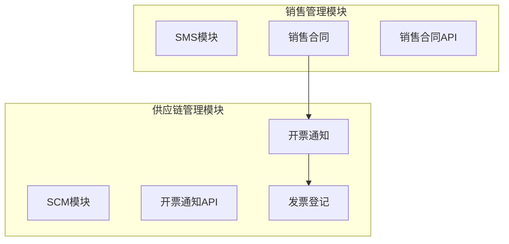
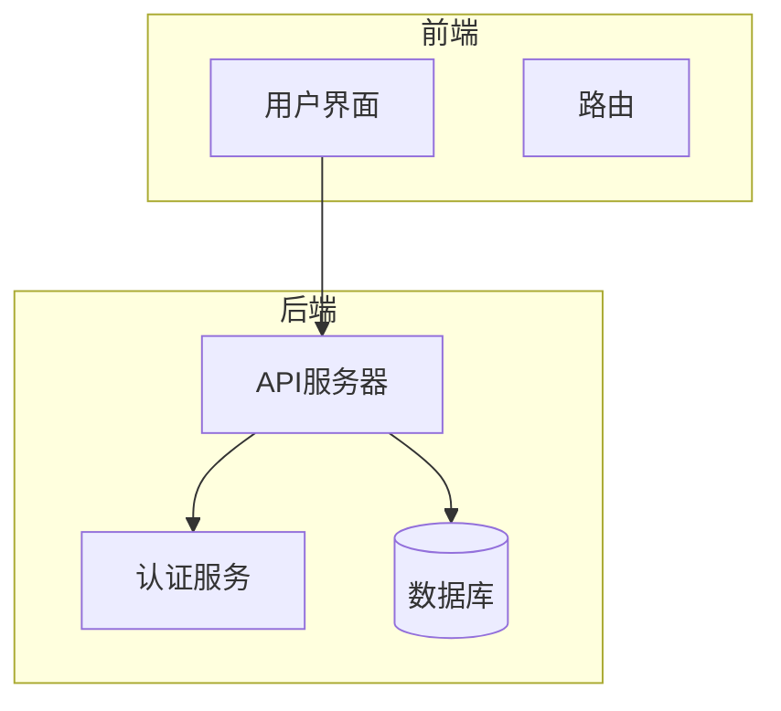
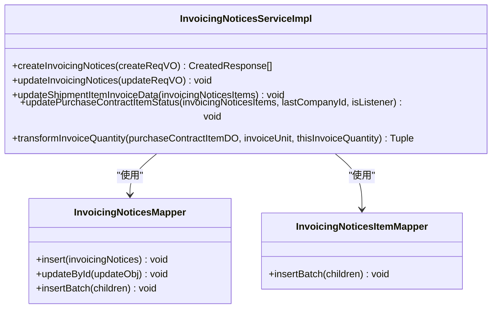
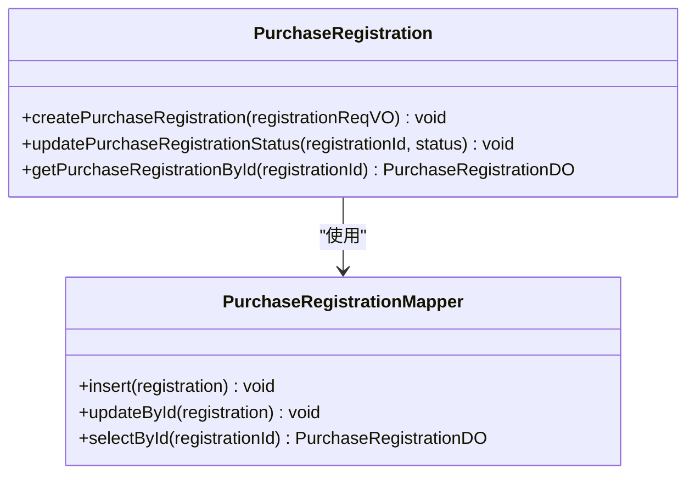
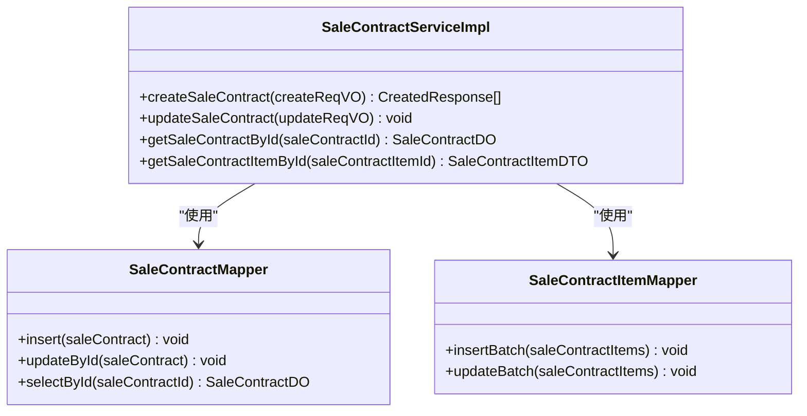
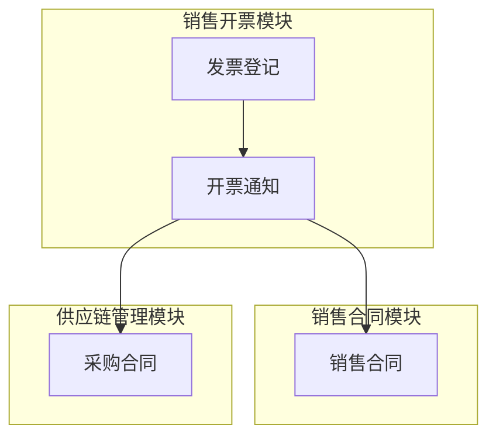

# 销售开票

<cite>
**本文档引用的文件**  
- [InvoicingNoticesServiceImpl.java](file://eplus-module-scm/eplus-module-scm-biz/src/main/java/com/syj/eplus/module/scm/service/invoicingnotices/InvoicingNoticesServiceImpl.java)
- [SaleContractServiceImpl.java](file://eplus-module-sms/eplus-module-sms-biz/src/main/java/com/syj/eplus/module/sms/service/salecontract/SaleContractServiceImpl.java)
- [InvoicingNoticesApi.java](file://eplus-module-scm/eplus-module-scm-api/src/main/java/com/syj/eplus/module/scm/api/invoicingnotices/InvoicingNoticesApi.java)
- [SaleContractApi.java](file://eplus-module-sms/eplus-module-sms-api/src/main/java/com/syj/eplus/module/sms/api/SaleContractApi.java)
- [InvoicingNoticesDO.java](file://eplus-module-scm/eplus-module-scm-biz/src/main/java/com/syj/eplus/module/scm/dal/dataobject/invoicingnotices/InvoicingNoticesDO.java)
- [InvoicingNoticesRespVO.java](file://eplus-module-scm/eplus-module-scm-biz/src/main/java/com/syj/eplus/module/scm/controller/admin/invoicingnotices/vo/InvoicingNoticesRespVO.java)
- [V1_0_0_400__开票明细增加税率字段.java](file://eplus-flyway/src/main/java/db/migration/common/V1_0_0_400__开票明细增加税率字段.java)
- [V1_0_0_581__开票通知增加登票日期.java](file://eplus-flyway/src/main/java/db/migration/common/V1_0_0_581__开票通知增加登票日期.java)
- [V1_0_0_446__发票登记增加复核人.java](file://eplus-flyway/src/main/java/db/migration/common/V1_0_0_446__发票登记增加复核人.java)
- [V1_0_0_402__发票登记增加复核日期.java](file://eplus-flyway/src/main/java/db/migration/common/V1_0_0_402__发票登记增加复核日期.java)
</cite>

## 目录
1. [引言](#引言)
2. [项目结构](#项目结构)
3. [核心组件](#核心组件)
4. [架构概述](#架构概述)
5. [详细组件分析](#详细组件分析)
6. [依赖分析](#依赖分析)
7. [性能考虑](#性能考虑)
8. [故障排除指南](#故障排除指南)
9. [结论](#结论)
10. [附录](#附录)（如有必要）

## 引言
本文档全面介绍销售开票功能的实现，涵盖开票申请、开票通知、发票登记等核心流程。文档详细说明销售合同与开票计划的关联关系，以及开票数量的控制逻辑（如按出运数量、按收款比例等）。同时，解释开票通知单的生成规则，包括开票金额、税率、商品信息等要素，并描述发票登记流程，包括发票号码、开票日期、复核人等信息的录入。此外，文档还说明开票状态跟踪机制，以及开票与收款的关联控制。

## 项目结构
销售开票功能主要分布在 `eplus-module-scm` 和 `eplus-module-sms` 模块中。`eplus-module-scm` 模块负责供应链管理，包括开票通知和发票登记；`eplus-module-sms` 模块负责销售管理，包括销售合同的创建和管理。

**图表来源**
- [InvoicingNoticesServiceImpl.java](file://eplus-module-scm/eplus-module-scm-biz/src/main/java/com/syj/eplus/module/scm/service/invoicingnotices/InvoicingNoticesServiceImpl.java#L1-L200)
- [SaleContractServiceImpl.java](file://eplus-module-sms/eplus-module-sms-biz/src/main/java/com/syj/eplus/module/sms/service/salecontract/SaleContractServiceImpl.java#L1-L200)

**章节来源**
- [InvoicingNoticesServiceImpl.java](file://eplus-module-scm/eplus-module-scm-biz/src/main/java/com/syj/eplus/module/scm/service/invoicingnotices/InvoicingNoticesServiceImpl.java#L1-L200)
- [SaleContractServiceImpl.java](file://eplus-module-sms/eplus-module-sms-biz/src/main/java/com/syj/eplus/module/sms/service/salecontract/SaleContractServiceImpl.java#L1-L200)

## 核心组件
销售开票的核心组件包括开票通知服务、发票登记服务和销售合同服务。开票通知服务负责生成和管理开票通知单，发票登记服务负责记录发票的详细信息，销售合同服务负责管理销售合同及其相关数据。

**章节来源**
- [InvoicingNoticesServiceImpl.java](file://eplus-module-scm/eplus-module-scm-biz/src/main/java/com/syj/eplus/module/scm/service/invoicingnotices/InvoicingNoticesServiceImpl.java#L1-L200)
- [SaleContractServiceImpl.java](file://eplus-module-sms/eplus-module-sms-biz/src/main/java/com/syj/eplus/module/sms/service/salecontract/SaleContractServiceImpl.java#L1-L200)

## 架构概述
销售开票功能的架构主要包括前端界面、后端服务和数据库。前端界面提供用户操作界面，后端服务处理业务逻辑，数据库存储相关数据。

**图表来源**
- [InvoicingNoticesServiceImpl.java](file://eplus-module-scm/eplus-module-scm-biz/src/main/java/com/syj/eplus/module/scm/service/invoicingnotices/InvoicingNoticesServiceImpl.java#L1-L200)
- [SaleContractServiceImpl.java](file://eplus-module-sms/eplus-module-sms-biz/src/main/java/com/syj/eplus/module/sms/service/salecontract/SaleContractServiceImpl.java#L1-L200)

## 详细组件分析
### 开票通知服务分析
开票通知服务负责生成和管理开票通知单。该服务通过 `InvoicingNoticesServiceImpl` 类实现，主要功能包括创建开票通知、更新开票通知状态和生成开票通知明细。

#### 开票通知服务类图

**图表来源**
- [InvoicingNoticesServiceImpl.java](file://eplus-module-scm/eplus-module-scm-biz/src/main/java/com/syj/eplus/module/scm/service/invoicingnotices/InvoicingNoticesServiceImpl.java#L1-L200)

**章节来源**
- [InvoicingNoticesServiceImpl.java](file://eplus-module-scm/eplus-module-scm-biz/src/main/java/com/syj/eplus/module/scm/service/invoicingnotices/InvoicingNoticesServiceImpl.java#L1-L200)

### 发票登记服务分析
发票登记服务负责记录发票的详细信息，包括发票号码、开票日期、复核人等。该服务通过 `PurchaseRegistration` 类实现，主要功能包括创建发票登记记录和更新发票登记状态。

#### 发票登记服务类图

**图表来源**
- [PurchaseRegistration.java](file://eplus-module-scm/eplus-module-scm-biz/src/main/java/com/syj/eplus/module/scm/service/purchaseregistration/PurchaseRegistration.java#L1-L200)

**章节来源**
- [PurchaseRegistration.java](file://eplus-module-scm/eplus-module-scm-biz/src/main/java/com/syj/eplus/module/scm/service/purchaseregistration/PurchaseRegistration.java#L1-L200)

### 销售合同服务分析
销售合同服务负责管理销售合同及其相关数据。该服务通过 `SaleContractServiceImpl` 类实现，主要功能包括创建销售合同、更新销售合同状态和生成销售合同明细。

#### 销售合同服务类图

**图表来源**
- [SaleContractServiceImpl.java](file://eplus-module-sms/eplus-module-sms-biz/src/main/java/com/syj/eplus/module/sms/service/salecontract/SaleContractServiceImpl.java#L1-L200)

**章节来源**
- [SaleContractServiceImpl.java](file://eplus-module-sms/eplus-module-sms-biz/src/main/java/com/syj/eplus/module/sms/service/salecontract/SaleContractServiceImpl.java#L1-L200)

## 依赖分析
销售开票功能依赖于多个模块和服务，包括销售合同模块、供应链管理模块和数据库。这些模块和服务通过API进行通信，确保数据的一致性和完整性。

**图表来源**
- [InvoicingNoticesServiceImpl.java](file://eplus-module-scm/eplus-module-scm-biz/src/main/java/com/syj/eplus/module/scm/service/invoicingnotices/InvoicingNoticesServiceImpl.java#L1-L200)
- [SaleContractServiceImpl.java](file://eplus-module-sms/eplus-module-sms-biz/src/main/java/com/syj/eplus/module/sms/service/salecontract/SaleContractServiceImpl.java#L1-L200)

**章节来源**
- [InvoicingNoticesServiceImpl.java](file://eplus-module-scm/eplus-module-scm-biz/src/main/java/com/syj/eplus/module/scm/service/invoicingnotices/InvoicingNoticesServiceImpl.java#L1-L200)
- [SaleContractServiceImpl.java](file://eplus-module-sms/eplus-module-sms-biz/src/main/java/com/syj/eplus/module/sms/service/salecontract/SaleContractServiceImpl.java#L1-L200)

## 性能考虑
销售开票功能在设计时考虑了性能优化，包括数据库索引优化、缓存机制和异步处理。这些优化措施确保了系统的高效运行和响应速度。

## 故障排除指南
### 常见问题
1. **开票通知生成失败**：检查销售合同和采购合同的状态是否正确。
2. **发票登记信息不完整**：确认所有必填字段均已填写。
3. **开票状态更新失败**：检查数据库连接和权限设置。

### 解决方案
1. **检查日志**：查看系统日志以获取详细的错误信息。
2. **验证数据**：确保输入数据的格式和内容正确。
3. **联系技术支持**：如果问题无法解决，联系技术支持团队。

**章节来源**
- [InvoicingNoticesServiceImpl.java](file://eplus-module-scm/eplus-module-scm-biz/src/main/java/com/syj/eplus/module/scm/service/invoicingnotices/InvoicingNoticesServiceImpl.java#L1-L200)
- [SaleContractServiceImpl.java](file://eplus-module-sms/eplus-module-sms-biz/src/main/java/com/syj/eplus/module/sms/service/salecontract/SaleContractServiceImpl.java#L1-L200)

## 结论
本文档详细介绍了销售开票功能的实现，涵盖了开票申请、开票通知、发票登记等核心流程。通过分析核心组件、架构和依赖关系，提供了全面的技术文档，帮助开发人员理解和维护该功能。

## 附录
### 数据库表结构
#### 开票通知表 (scm_invoicing_notices)
| 字段名 | 类型 | 描述 |
| --- | --- | --- |
| id | bigint | 主键 |
| code | varchar(20) | 开票通知编号 |
| status | tinyint | 状态 |
| manually_flag | tinyint | 是否手动生成 |
| create_time | datetime | 创建时间 |
| update_time | datetime | 修改时间 |
| deleted | tinyint | 删除标志 |

#### 发票登记表 (scm_purchase_registration)
| 字段名 | 类型 | 描述 |
| --- | --- | --- |
| id | bigint | 主键 |
| registration_code | varchar(20) | 发票登记编号 |
| invoice_number | varchar(20) | 发票号码 |
| invoice_date | datetime | 开票日期 |
| review_user | json | 复核人 |
| review_date | datetime | 复核日期 |
| create_time | datetime | 创建时间 |
| update_time | datetime | 修改时间 |
| deleted | tinyint | 删除标志 |