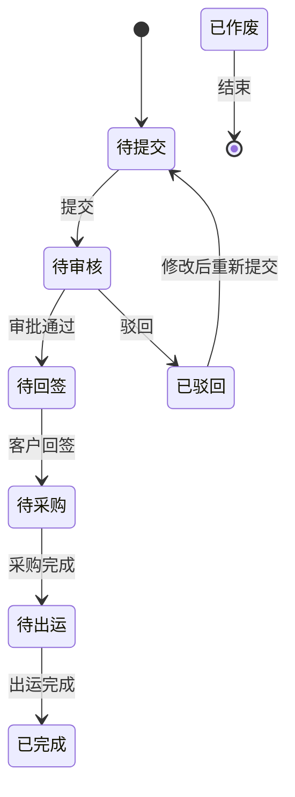
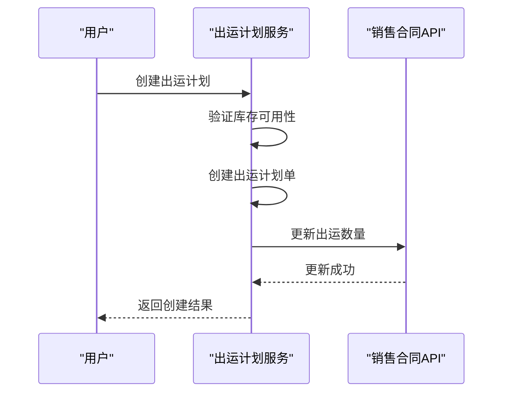
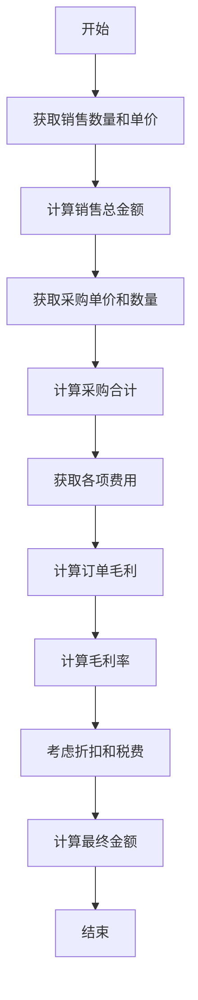
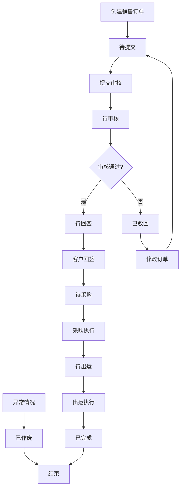

# 销售订单

<cite>
**本文档引用的文件**  
- [SaleContractApi.java](file://eplus-module-sms/eplus-module-sms-api/src/main/java/com/syj/eplus/module/sms/api/SaleContractApi.java)
- [SaleContractApiImpl.java](file://eplus-module-sms/eplus-module-sms-biz/src/main/java/com/syj/eplus/module/sms/api/SaleContractApiImpl.java)
- [SaleContractDO.java](file://eplus-module-sms/eplus-module-sms-biz/src/main/java/com/syj/eplus/module/sms/dal/dataobject/salecontract/SaleContractDO.java)
- [SaleContractItem.java](file://eplus-module-sms/eplus-module-sms-biz/src/main/java/com/syj/eplus/module/sms/dal/dataobject/salecontractitem/SaleContractItem.java)
- [SaleContractStatusEnum.java](file://eplus-framework/eplus-common/src/main/java/com/syj/eplus/framework/common/enums/SaleContractStatusEnum.java)
- [ShipmentPlanServiceImpl.java](file://eplus-module-dms/eplus-module-dms-biz/src/main/java/com/syj/eplus/module/dms/service/shipmentplan/ShipmentPlanServiceImpl.java)
- [CalcSaleContactUtil.java](file://eplus-module-sms/eplus-module-sms-biz/src/main/java/com/syj/eplus/module/sms/util/CalcSaleContactUtil.java)
- [CalcContractPurchaseUtil.java](file://eplus-module-sms/eplus-module-sms-biz/src/main/java/com/syj/eplus/module/sms/util/CalcContractPurchaseUtil.java)
</cite>

## 目录
1. [引言](#引言)
2. [销售订单生成与管理](#销售订单生成与管理)
3. [销售订单状态管理](#销售订单状态管理)
4. [销售订单与销售合同的关联关系](#销售订单与销售合同的关联关系)
5. [销售订单与出运计划的集成逻辑](#销售订单与出运计划的集成逻辑)
6. [销售订单金额计算规则](#销售订单金额计算规则)
7. [销售订单生命周期流程图](#销售订单生命周期流程图)
8. [关键业务规则](#关键业务规则)

## 引言
本文档全面介绍销售订单功能的详细内容，涵盖销售订单的生成、管理、状态跟踪等核心功能。详细说明销售订单与销售合同的关联关系，以及销售订单如何从销售合同生成。解释销售订单的状态管理及其业务含义。描述销售订单与出运计划、出运明细的集成逻辑，包括订单拆分、合并出运等场景。说明销售订单的金额计算规则，包括单价、数量、折扣、税费等要素。提供销售订单生命周期流程图，展示从生成到完成的完整过程。包含销售订单关键业务规则，如库存可用性检查、交期承诺等。

## 销售订单生成与管理
销售订单的生成主要通过销售合同API实现。系统提供`generateSaleContract`接口，接收`SaleContractSaveDTO`对象作为参数，用于创建新的销售合同。该接口会将DTO对象转换为VO对象，并调用服务层的`createSaleContract`方法完成订单创建。

销售订单的管理功能包括更新确认状态、客户信息、出运数量等。系统提供了`updateConfirmFlag`方法用于更新销售合同的确认状态，`updateCust`方法用于在客户变更后更新后续未完成合同的客户信息，以及`updateShipmentQuantity`方法用于回写出运数量。

**Section sources**
- [SaleContractApi.java](file://eplus-module-sms/eplus-module-sms-api/src/main/java/com/syj/eplus/module/sms/api/SaleContractApi.java#L218-L249)
- [SaleContractApiImpl.java](file://eplus-module-sms/eplus-module-sms-biz/src/main/java/com/syj/eplus/module/sms/api/SaleContractApiImpl.java#L208-L212)

## 销售订单状态管理
销售订单的状态管理通过`SaleContractStatusEnum`枚举类定义，包含以下状态：

- **待提交 (1)**：销售合同创建后但尚未提交审核的状态
- **待审核 (2)**：销售合同已提交，等待审批的状态
- **待回签 (3)**：销售合同需要客户回签的状态
- **已驳回 (4)**：销售合同被审批人驳回的状态
- **待采购 (5)**：销售合同已通过审批，等待采购的状态
- **待出运 (6)**：销售合同已完成采购，等待出运的状态
- **已完成 (7)**：销售合同所有流程已完成的状态
- **已作废 (8)**：销售合同被作废的状态

状态管理通过`status`字段在`SaleContractDO`实体类中实现，系统根据业务流程在不同阶段更新此状态值。

**Diagram sources**
- [SaleContractStatusEnum.java](file://eplus-framework/eplus-common/src/main/java/com/syj/eplus/framework/common/enums/SaleContractStatusEnum.java#L14-L28)
- [SaleContractDO.java](file://eplus-module-sms/eplus-module-sms-biz/src/main/java/com/syj/eplus/module/sms/dal/dataobject/salecontract/SaleContractDO.java#L431-L432)

## 销售订单与销售合同的关联关系
销售订单与销售合同之间存在紧密的关联关系。销售订单实际上是从销售合同生成的，系统通过`generateSaleContract`方法实现这一过程。当创建销售订单时，系统会复制销售合同的基本信息，并根据业务需求进行适当调整。

在数据模型中，`SaleContractDO`类包含了销售合同的所有基本信息，如合同编号、客户信息、产品信息、价格条款等。销售订单继承了这些信息，并可能添加特定于订单的属性。系统通过`sourceContractId`和`sourceContractCode`字段维护销售订单与原始销售合同的关联关系。

销售合同可以生成多个销售订单，特别是在订单拆分的场景下。系统通过`splitSaleContractItem`方法支持将一个销售合同明细拆分为多个订单，以满足不同的出运需求。

**Section sources**
- [SaleContractDO.java](file://eplus-module-sms/eplus-module-sms-biz/src/main/java/com/syj/eplus/module/sms/dal/dataobject/salecontract/SaleContractDO.java#L486-L491)
- [SaleContractApi.java](file://eplus-module-sms/eplus-module-sms-api/src/main/java/com/syj/eplus/module/sms/api/SaleContractApi.java#L291-L293)

## 销售订单与出运计划的集成逻辑
销售订单与出运计划的集成通过DMS（配送管理系统）模块实现。当创建出运计划时，系统会从销售订单中获取相关信息，并在出运计划创建完成后回写销售订单的出运数量。

在`ShipmentPlanServiceImpl`类的`createShipmentPlan`方法中，系统首先验证库存可用性，然后创建出运计划单。创建完成后，系统会调用`saleContractApi.updateShipmentQuantity`方法，将出运数量回写到销售订单中，更新销售合同明细的已出运数量。

系统支持订单拆分和合并出运的场景。通过`shipmentPlanItemList`集合，可以将一个销售订单拆分为多个出运计划，或者将多个销售订单合并为一个出运计划。这种灵活性使得企业能够根据实际物流需求优化出运安排。

**Diagram sources**
- [ShipmentPlanServiceImpl.java](file://eplus-module-dms/eplus-module-dms-biz/src/main/java/com/syj/eplus/module/dms/service/shipmentplan/ShipmentPlanServiceImpl.java#L224-L225)
- [SaleContractApi.java](file://eplus-module-sms/eplus-module-sms-api/src/main/java/com/syj/eplus/module/sms/api/SaleContractApi.java#L44-L45)

## 销售订单金额计算规则
销售订单的金额计算涉及多个要素，包括单价、数量、折扣、税费等。系统在`CalcSaleContactUtil`和`CalcContractPurchaseUtil`工具类中实现了复杂的金额计算逻辑。

主要金额计算规则如下：

1. **销售总金额**：销售数量 × 销售单价
2. **采购合计**：汇总所有采购项的金额，考虑不同币种的汇率转换
3. **订单毛利**：销售总金额 - 采购合计 - 各项费用
4. **毛利率**：(订单毛利 / 销售总金额) × 100%
5. **退税合计**：根据产品退税率和采购金额计算
6. **总费用**：包括拖柜费、预估总运费、佣金、平台费、保险费、打包费等

系统使用`JsonAmount`类来处理金额计算，该类包含金额值和币种信息，支持多币种计算和汇率转换。在计算过程中，系统会将所有金额转换为人民币(RMB)进行统一计算，然后根据需要转换为其他币种显示。

**Diagram sources**
- [CalcSaleContactUtil.java](file://eplus-module-sms/eplus-module-sms-biz/src/main/java/com/syj/eplus/module/sms/util/CalcSaleContactUtil.java#L813-L816)
- [CalcContractPurchaseUtil.java](file://eplus-module-sms/eplus-module-sms-biz/src/main/java/com/syj/eplus/module/sms/util/CalcContractPurchaseUtil.java#L242-L249)

## 销售订单生命周期流程图
销售订单的生命周期从创建开始，经过多个状态转换，最终完成或作废。以下是销售订单的完整生命周期流程：

**Diagram sources**
- [SaleContractStatusEnum.java](file://eplus-framework/eplus-common/src/main/java/com/syj/eplus/framework/common/enums/SaleContractStatusEnum.java#L14-L28)
- [SaleContractDO.java](file://eplus-module-sms/eplus-module-sms-biz/src/main/java/com/syj/eplus/module/sms/dal/dataobject/salecontract/SaleContractDO.java#L431-L432)

## 关键业务规则
销售订单系统实施了多项关键业务规则，确保业务流程的正确性和数据的完整性：

1. **库存可用性检查**：在创建出运计划前，系统会检查相关产品的库存是否充足。如果库存不足，将阻止出运计划的创建。

2. **交期承诺规则**：系统会根据客户交期和工厂交期进行匹配，确保销售订单的交期承诺是可实现的。如果工厂交期晚于客户交期，系统会发出警告。

3. **订单拆分规则**：支持将一个销售订单拆分为多个出运计划，但必须确保拆分后的总数量等于原订单数量。系统通过`splitSaleContractItem`方法实现这一功能。

4. **金额一致性规则**：系统确保销售订单的各项金额之间保持一致性，如销售总金额、采购合计、订单毛利等之间的数学关系必须正确。

5. **状态转换规则**：销售订单的状态转换必须遵循预定义的流程，不能跳过中间状态。例如，不能直接从"待提交"状态转换到"待出运"状态。

6. **数据完整性规则**：关键字段如客户信息、产品信息、价格等不能为空，系统在保存订单前会进行验证。

这些业务规则通过服务层的方法实现，并在API接口中进行调用，确保所有操作都符合企业的业务规范。

**Section sources**
- [ShipmentPlanServiceImpl.java](file://eplus-module-dms/eplus-module-dms-biz/src/main/java/com/syj/eplus/module/dms/service/shipmentplan/ShipmentPlanServiceImpl.java#L179-L186)
- [CalcSaleContactUtil.java](file://eplus-module-sms/eplus-module-sms-biz/src/main/java/com/syj/eplus/module/sms/util/CalcSaleContactUtil.java)
- [SaleContractApi.java](file://eplus-module-sms/eplus-module-sms-api/src/main/java/com/syj/eplus/module/sms/api/SaleContractApi.java#L291-L293)