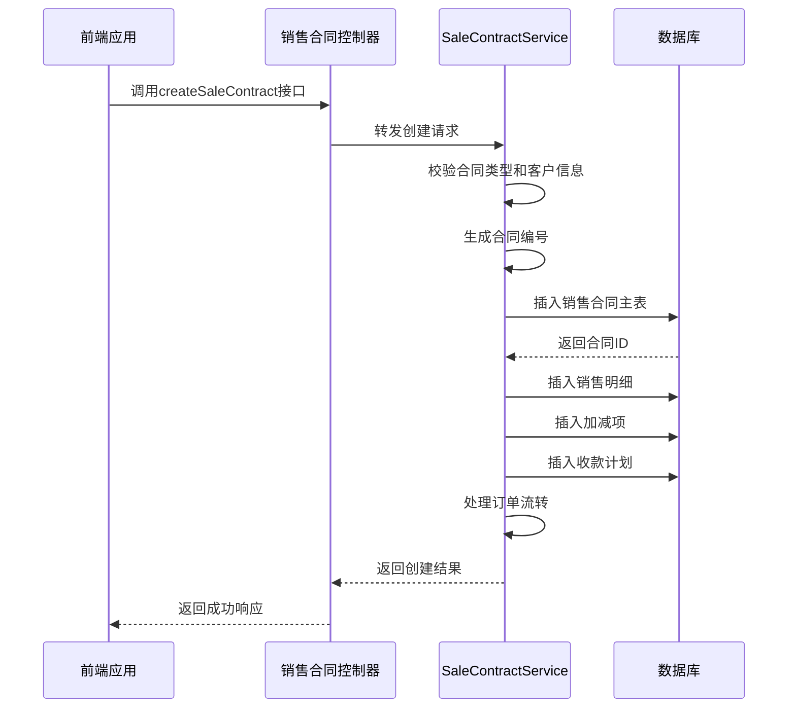
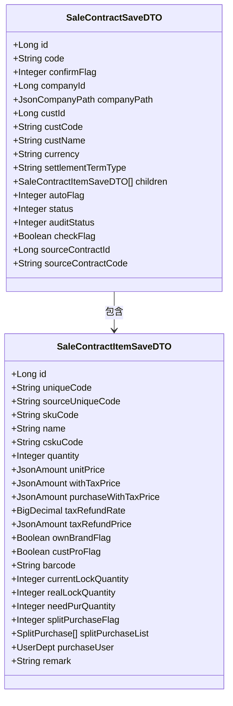
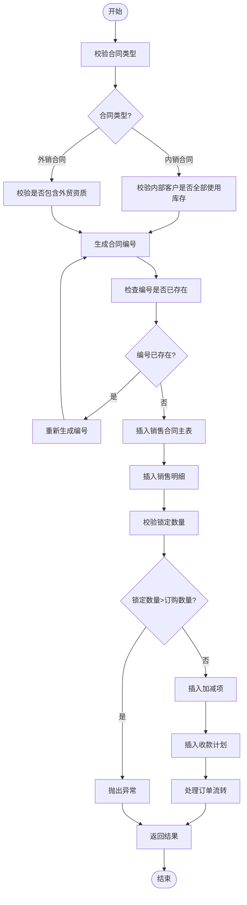
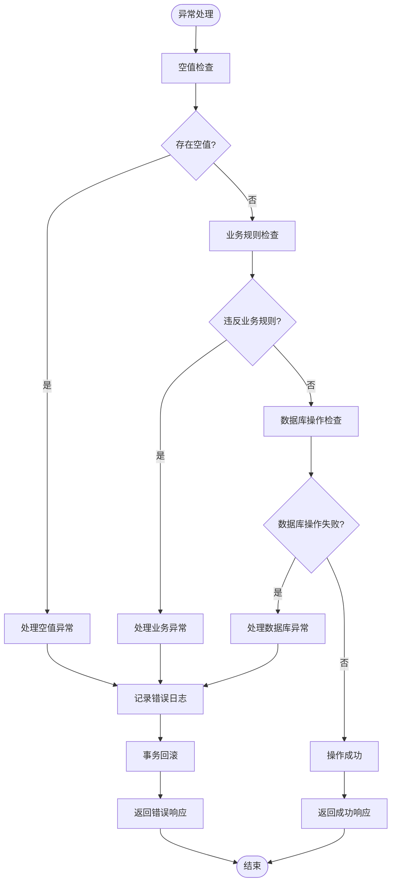
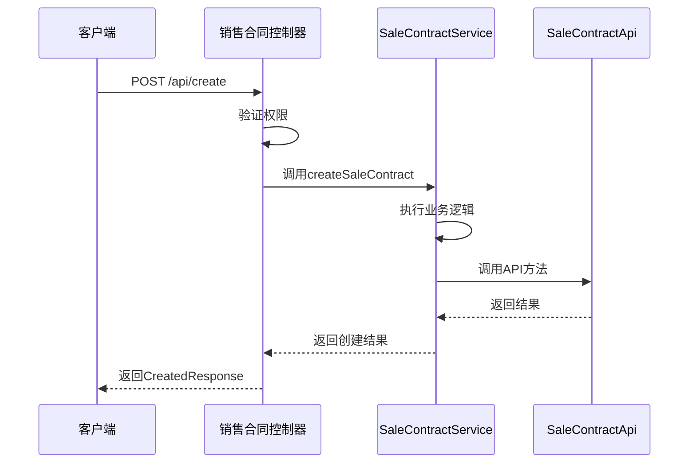
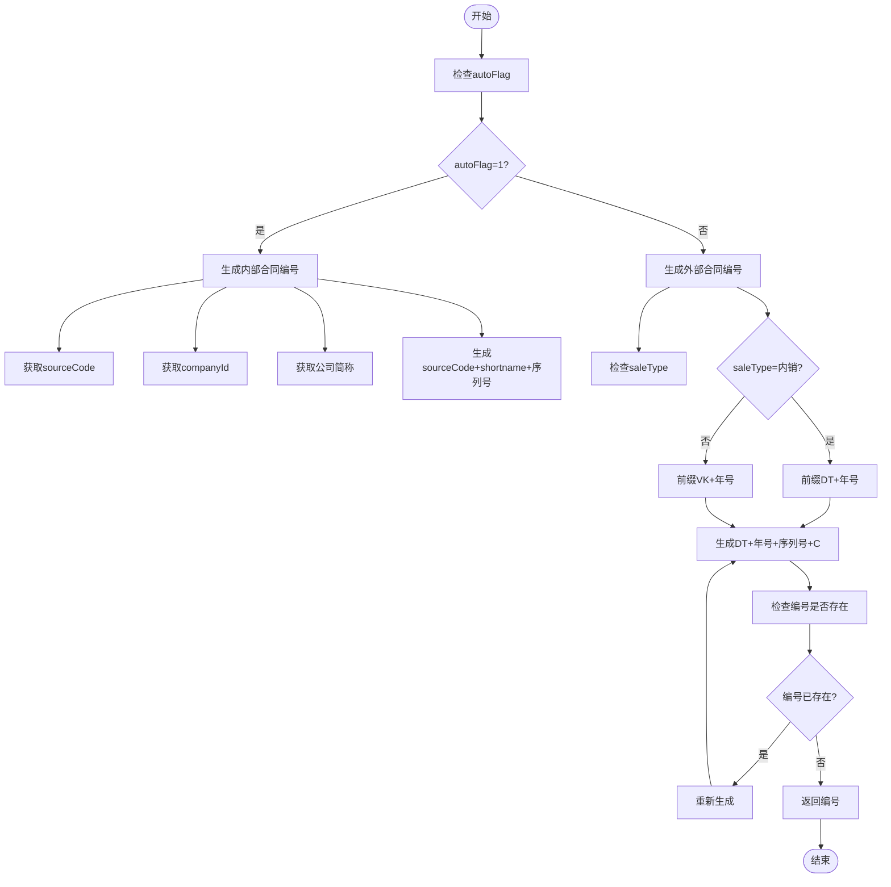

# 销售订单生成

<cite>
**本文档引用文件**   
- [SaleContractApi.java](file://eplus-module-sms/eplus-module-sms-api/src/main/java/com/syj/eplus/module/sms/api/SaleContractApi.java)
- [SaleContractServiceImpl.java](file://eplus-module-sms/eplus-module-sms-biz/src/main/java/com/syj/eplus/module/sms/service/salecontract/SaleContractServiceImpl.java)
- [SaleContractSaveDTO.java](file://eplus-module-sms/eplus-module-sms-api/src/main/java/com/syj/eplus/module/sms/api/dto/SaleContractSaveDTO.java)
- [SaleContractApiImpl.java](file://eplus-module-sms/eplus-module-sms-biz/src/main/java/com/syj/eplus/module/sms/api/SaleContractApiImpl.java)
- [DomesticSaleContractController.java](file://eplus-module-sms/eplus-module-sms-biz/src/main/java/com/syj/eplus/module/sms/controller/admin/salecontract/DomesticSaleContractController.java)
- [ExportSaleContractController.java](file://eplus-module-sms/eplus-module-sms-biz/src/main/java/com/syj/eplus/module/sms/controller/admin/salecontract/ExportSaleContractController.java)
- [FactorySaleContractController.java](file://eplus-module-sms/eplus-module-sms-biz/src/main/java/com/syj/eplus/module/sms/controller/admin/salecontract/FactorySaleContractController.java)
</cite>

## 目录
1. [引言](#引言)
2. [销售订单生成流程](#销售订单生成流程)
3. [数据来源与继承逻辑](#数据来源与继承逻辑)
4. [业务规则校验](#业务规则校验)
5. [异常处理机制](#异常处理机制)
6. [接口调用示例](#接口调用示例)
7. [订单编号生成规则](#订单编号生成规则)
8. [结论](#结论)

## 引言
本文档详细说明了销售订单从销售合同生成的完整流程。系统通过销售合同API接口实现销售订单的创建，支持内销合同、外销合同和工厂销售合同等多种类型。销售订单的生成涉及客户信息、产品明细、价格条款等数据的继承，同时包含客户信用额度检查、产品可用性验证等业务规则校验。

## 销售订单生成流程

**图示来源**
- [DomesticSaleContractController.java](file://eplus-module-sms/eplus-module-sms-biz/src/main/java/com/syj/eplus/module/sms/controller/admin/salecontract/DomesticSaleContractController.java#L48-L53)
- [ExportSaleContractController.java](file://eplus-module-sms/eplus-module-sms-biz/src/main/java/com/syj/eplus/module/sms/controller/admin/salecontract/ExportSaleContractController.java#L53-L58)
- [FactorySaleContractController.java](file://eplus-module-sms/eplus-module-sms-biz/src/main/java/com/syj/eplus/module/sms/controller/admin/salecontract/FactorySaleContractController.java#L43-L48)
- [SaleContractServiceImpl.java](file://eplus-module-sms/eplus-module-sms-biz/src/main/java/com/syj/eplus/module/sms/service/salecontract/SaleContractServiceImpl.java#L272-L465)

**本节来源**
- [SaleContractServiceImpl.java](file://eplus-module-sms/eplus-module-sms-biz/src/main/java/com/syj/eplus/module/sms/service/salecontract/SaleContractServiceImpl.java#L272-L465)

## 数据来源与继承逻辑

销售订单从销售合同生成时，数据继承遵循以下逻辑：

**图示来源**
- [SaleContractSaveDTO.java](file://eplus-module-sms/eplus-module-sms-api/src/main/java/com/syj/eplus/module/sms/api/dto/SaleContractSaveDTO.java#L1-L422)

**本节来源**
- [SaleContractSaveDTO.java](file://eplus-module-sms/eplus-module-sms-api/src/main/java/com/syj/eplus/module/sms/api/dto/SaleContractSaveDTO.java#L1-L422)
- [SaleContractServiceImpl.java](file://eplus-module-sms/eplus-module-sms-biz/src/main/java/com/syj/eplus/module/sms/service/salecontract/SaleContractServiceImpl.java#L272-L465)

### 客户信息继承
销售订单继承销售合同的客户信息，包括客户主键、客户编号、客户名称等。系统通过`custCode`字段校验客户是否存在，并获取客户相关信息。

### 产品明细继承
产品明细从`SaleContractItemSaveDTO`对象继承，包含产品编号、产品名称、客户货号、数量、单价、含税价格等信息。系统会校验锁定数量是否超过订购数量。

### 价格条款继承
价格条款包括交易币别、价格条款类型、佣金、平台费、保险费等费用信息。系统会计算加项金额和减项金额，并验证平台费和佣金的准确性。

## 业务规则校验

**图示来源**
- [SaleContractServiceImpl.java](file://eplus-module-sms/eplus-module-sms-biz/src/main/java/com/syj/eplus/module/sms/service/salecontract/SaleContractServiceImpl.java#L272-L465)

**本节来源**
- [SaleContractServiceImpl.java](file://eplus-module-sms/eplus-module-sms-biz/src/main/java/com/syj/eplus/module/sms/service/salecontract/SaleContractServiceImpl.java#L272-L465)

### 客户信用额度检查
系统在创建销售合同时会检查客户信用额度，确保合同金额不超过客户信用额度限制。

### 产品可用性验证
系统会验证产品是否可用，包括检查产品是否存在、库存是否充足等。对于组合产品，系统会验证子产品的库存是否足够生产主产品。

### 合同类型校验
根据合同类型进行不同的校验：
- 内销合同：校验内部客户是否全部使用库存
- 外销合同：校验订单路径中是否包含具有外贸资质的公司

## 异常处理机制

**图示来源**
- [SaleContractServiceImpl.java](file://eplus-module-sms/eplus-module-sms-biz/src/main/java/com/syj/eplus/module/sms/service/salecontract/SaleContractServiceImpl.java#L272-L465)

**本节来源**
- [SaleContractServiceImpl.java](file://eplus-module-sms/eplus-module-sms-biz/src/main/java/com/syj/eplus/module/sms/service/salecontract/SaleContractServiceImpl.java#L272-L465)

系统采用Spring的`@Transactional`注解实现事务管理，确保数据一致性。当发生异常时，系统会自动回滚事务，并返回相应的错误提示。

## 接口调用示例

**图示来源**
- [DomesticSaleContractController.java](file://eplus-module-sms/eplus-module-sms-biz/src/main/java/com/syj/eplus/module/sms/controller/admin/salecontract/DomesticSaleContractController.java#L48-L53)
- [SaleContractApiImpl.java](file://eplus-module-sms/eplus-module-sms-biz/src/main/java/com/syj/eplus/module/sms/api/SaleContractApiImpl.java#L208-L212)

**本节来源**
- [SaleContractApi.java](file://eplus-module-sms/eplus-module-sms-api/src/main/java/com/syj/eplus/module/sms/api/SaleContractApi.java#L128-L130)
- [SaleContractApiImpl.java](file://eplus-module-sms/eplus-module-sms-biz/src/main/java/com/syj/eplus/module/sms/api/SaleContractApiImpl.java#L208-L212)

### 参数说明
- `createReqVO`: 销售合同创建请求对象，包含合同基本信息和明细
- 返回值: `List<CreatedResponse>`，包含创建的合同ID和编号

## 订单编号生成规则

**图示来源**
- [SaleContractServiceImpl.java](file://eplus-module-sms/eplus-module-sms-biz/src/main/java/com/syj/eplus/module/sms/service/salecontract/SaleContractServiceImpl.java#L517-L540)

**本节来源**
- [SaleContractServiceImpl.java](file://eplus-module-sms/eplus-module-sms-biz/src/main/java/com/syj/eplus/module/sms/service/salecontract/SaleContractServiceImpl.java#L517-L540)

### 唯一性保障机制
系统通过`codeGeneratorApi.getCodeGenerator`方法生成唯一编号，并在插入数据库前检查编号是否已存在，若存在则重新生成，确保编号的唯一性。

## 结论
销售订单生成功能通过销售合同API接口实现，支持多种合同类型的创建。系统在生成销售订单时，会继承销售合同的客户信息、产品明细和价格条款等数据，并执行客户信用额度检查、产品可用性验证等业务规则校验。通过事务管理和异常处理机制，确保数据的一致性和完整性。订单编号的生成遵循特定规则，并通过唯一性检查保障编号的唯一性。