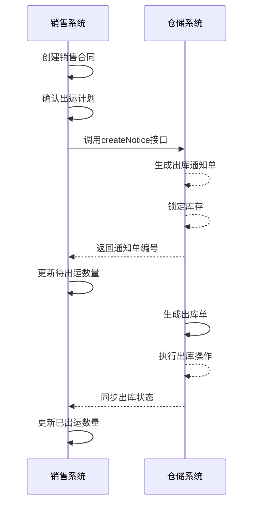

# 销售与仓储集成

<cite>
**本文档引用文件**   
- [SaleContractApi.java](file://eplus-module-sms/eplus-module-sms-api/src/main/java/com/syj/eplus/module/sms/api/SaleContractApi.java)
- [IStockNoticeApi.java](file://eplus-module-wms/eplus-module-wms-api/src/main/java/com/syj/eplus/module/wms/api/stockNotice/IStockNoticeApi.java)
- [SaleContractServiceImpl.java](file://eplus-module-sms/eplus-module-sms-biz/src/main/java/com/syj/eplus/module/sms/service/salecontract/SaleContractServiceImpl.java)
- [StockNoticeServiceImpl.java](file://eplus-module-wms/eplus-module-wms-biz/src/main/java/com/syj/eplus/module/wms/service/stocknotice/StockNoticeServiceImpl.java)
</cite>

## 目录
1. [引言](#引言)
2. [出库通知单生成机制](#出库通知单生成机制)
3. [销售出运与仓储集成逻辑](#销售出运与仓储集成逻辑)
4. [销售退货与仓储入库集成](#销售退货与仓储入库集成)
5. [库存可用量查询接口](#库存可用量查询接口)
6. [集成时序图](#集成时序图)
7. [关键业务规则](#关键业务规则)
8. [常见集成问题及解决方案](#常见集成问题及解决方案)
9. [结论](#结论)

## 引言
本系统实现了销售模块与仓储管理系统的深度集成，通过标准化接口和业务流程，确保销售合同执行过程中库存状态的实时同步。系统支持外销合同、内销合同及工厂销售合同等多种业务场景，通过出库通知单机制实现销售出运与仓储操作的无缝衔接。集成方案涵盖通知单创建、库存锁定、状态同步等核心功能，确保数据一致性与业务连续性。

## 出库通知单生成机制

### 通知单创建流程
当销售合同进入出运阶段时，系统自动生成出库通知单。创建流程包括：
1. 校验销售明细是否已转出库通知
2. 合并相同产品的出运数量
3. 生成出库通知单主表及明细数据
4. 设置通知单状态为"未转换"

### 库存锁定机制
系统在创建出库通知单时自动执行库存锁定：
- 锁定来源类型标识为"销售合同"
- 锁定数量等于出运通知数量
- 锁定批次信息与销售明细关联
- 更新销售合同明细的待出运数量

### 待出运数量计算
待出运数量根据以下规则计算：
- 初始值等于销售合同明细数量
- 每次生成出库通知单后扣减对应数量
- 支持部分出运的分批处理
- 数量精度控制为整数位

**Section sources**
- [SaleContractServiceImpl.java](file://eplus-module-sms/eplus-module-sms-biz/src/main/java/com/syj/eplus/module/sms/service/salecontract/SaleContractServiceImpl.java#L1089-L1180)
- [StockNoticeServiceImpl.java](file://eplus-module-wms/eplus-module-wms-biz/src/main/java/com/syj/eplus/module/wms/service/stocknotice/StockNoticeServiceImpl.java#L180-L256)

## 销售出运与仓储集成逻辑

### 库存扣减时机
库存扣减发生在出库单审核通过后：
- 出库通知单转为出库单时触发
- 实际出库操作完成后执行
- 扣减数量等于实际出库数量
- 同时释放对应库存锁定

### 出库状态同步
系统通过状态机实现出库状态同步：
- 未转换：出库通知单已创建但未转出库单
- 转单中：正在生成出库单
- 已转换：出库单已成功创建
- 部分转换：部分明细已转出库单

### 库存明细更新
出库操作触发以下库存明细更新：
- 可用库存数量扣减
- 实际出库数量累加
- 库存状态标记为"已出库"
- 更新最后出库时间戳

**Section sources**
- [StockNoticeServiceImpl.java](file://eplus-module-wms/eplus-module-wms-biz/src/main/java/com/syj/eplus/module/wms/service/stocknotice/StockNoticeServiceImpl.java#L531-L635)
- [SaleContractServiceImpl.java](file://eplus-module-sms/eplus-module-sms-biz/src/main/java/com/syj/eplus/module/sms/service/salecontract/SaleContractServiceImpl.java#L398-L400)

## 销售退货与仓储入库集成

### 退货入库通知单生成
退货业务流程触发入库通知单生成：
1. 创建退货申请单
2. 审核通过后生成入库通知单
3. 通知仓储系统准备收货
4. 更新销售合同退货状态

### 库存增加操作
入库操作执行库存增加：
- 增加数量等于实际入库数量
- 更新库存批次信息
- 重置库存锁定状态
- 记录入库时间及操作人员

**Section sources**
- [StockNoticeServiceImpl.java](file://eplus-module-wms/eplus-module-wms-biz/src/main/java/com/syj/eplus/module/wms/service/stocknotice/StockNoticeServiceImpl.java#L180-L256)
- [SaleContractServiceImpl.java](file://eplus-module-sms/eplus-module-sms-biz/src/main/java/com/syj/eplus/module/sms/service/salecontract/SaleContractServiceImpl.java#L274-L466)

## 库存可用量查询接口

### 接口实现
系统提供实时库存查询接口：
```java
public interface IStockApi {
    /**
     * 查询可用库存数量
     * @param skuCode 产品编码
     * @param batchCode 批次编码
     * @return 可用库存数量
     */
    Integer getAvailableQuantity(String skuCode, String batchCode);
}
```

### 查询逻辑
查询过程包含：
- 获取总库存数量
- 扣除已锁定库存
- 扣除已出库库存
- 返回净可用数量
- 支持按仓库、批次过滤

**Section sources**
- [StockNoticeServiceImpl.java](file://eplus-module-wms/eplus-module-wms-biz/src/main/java/com/syj/eplus/module/wms/service/stocknotice/StockNoticeServiceImpl.java#L396-L405)
- [SaleContractServiceImpl.java](file://eplus-module-sms/eplus-module-sms-biz/src/main/java/com/syj/eplus/module/sms/service/salecontract/SaleContractServiceImpl.java#L763-L793)

## 集成时序图



**Diagram sources**
- [SaleContractApi.java](file://eplus-module-sms/eplus-module-sms-api/src/main/java/com/syj/eplus/module/sms/api/SaleContractApi.java#L23)
- [IStockNoticeApi.java](file://eplus-module-wms/eplus-module-wms-api/src/main/java/com/syj/eplus/module/wms/api/stockNotice/IStockNoticeApi.java#L33)

## 关键业务规则

### 库存不足处理机制
当库存不足时的处理流程：
1. 系统校验可用库存
2. 若不足则提示"库存不足"
3. 支持部分出运处理
4. 剩余数量保留待后续出运
5. 触发库存预警通知

### 库存锁定释放规则
库存锁定释放条件：
- 出库单取消时立即释放
- 出库单审核拒绝时释放
- 销售合同取消时批量释放
- 超时未处理自动释放（24小时）
- 释放时更新销售合同待出运数量

### 数据一致性保证
系统通过以下机制保证数据一致性：
- 分布式事务管理
- 操作日志记录
- 状态变更审计
- 定时对账任务
- 异常补偿机制

**Section sources**
- [SaleContractServiceImpl.java](file://eplus-module-sms/eplus-module-sms-biz/src/main/java/com/syj/eplus/module/sms/service/salecontract/SaleContractServiceImpl.java#L763-L793)
- [StockNoticeServiceImpl.java](file://eplus-module-wms/eplus-module-wms-biz/src/main/java/com/syj/eplus/module/wms/service/stocknotice/StockNoticeServiceImpl.java#L343-L347)

## 常见集成问题及解决方案

### 库存同步延迟
**问题现象**：销售系统显示库存与仓储系统不一致  
**解决方案**：
- 优化接口调用性能
- 增加缓存机制
- 设置合理的超时重试
- 实施定时对账任务
- 建立监控告警系统

### 出库状态不一致
**问题现象**：出库单状态在两个系统中不同步  
**解决方案**：
- 实现状态变更事件通知
- 增加状态同步补偿任务
- 统一状态机定义
- 记录状态变更日志
- 提供手动同步功能

**Section sources**
- [StockNoticeServiceImpl.java](file://eplus-module-wms/eplus-module-wms-biz/src/main/java/com/syj/eplus/module/wms/service/stocknotice/StockNoticeServiceImpl.java#L531-L635)
- [SaleContractServiceImpl.java](file://eplus-module-sms/eplus-module-sms-biz/src/main/java/com/syj/eplus/module/sms/service/salecontract/SaleContractServiceImpl.java#L244-L249)

## 结论
销售与仓储系统的集成通过标准化接口和严谨的业务流程，实现了销售出运与仓储操作的无缝衔接。系统在通知单管理、库存控制、状态同步等方面建立了完善的机制，确保了业务数据的一致性和准确性。通过关键业务规则的设定和常见问题的预防措施，系统具备了良好的稳定性和可维护性，为企业的供应链管理提供了可靠的技术支持。