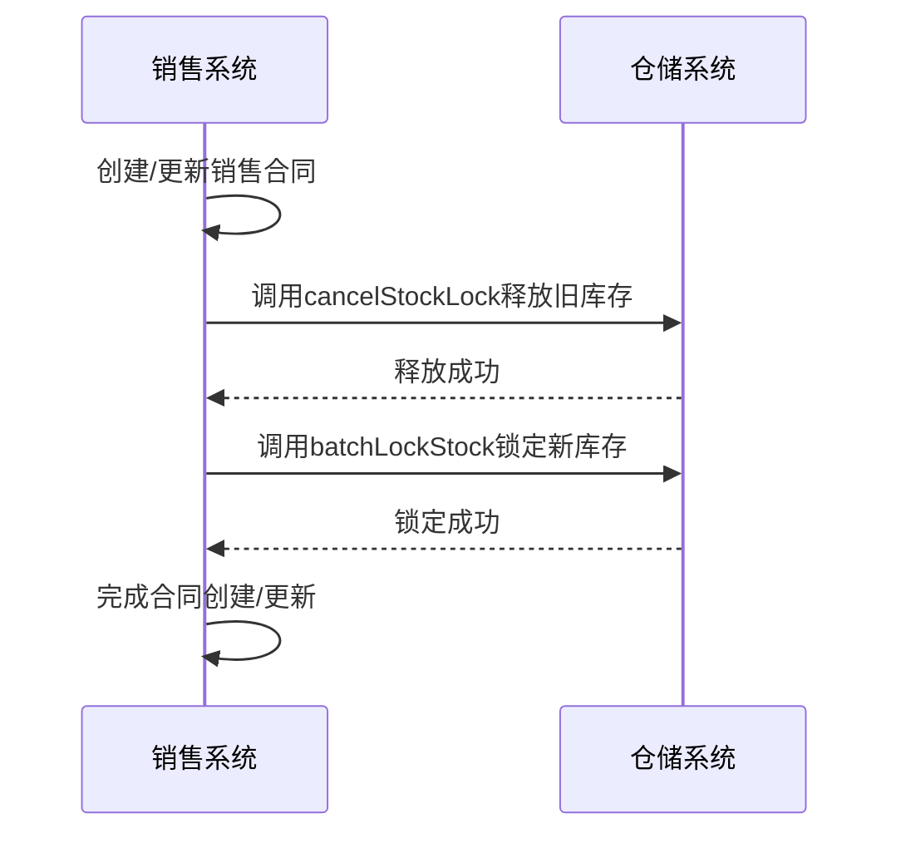
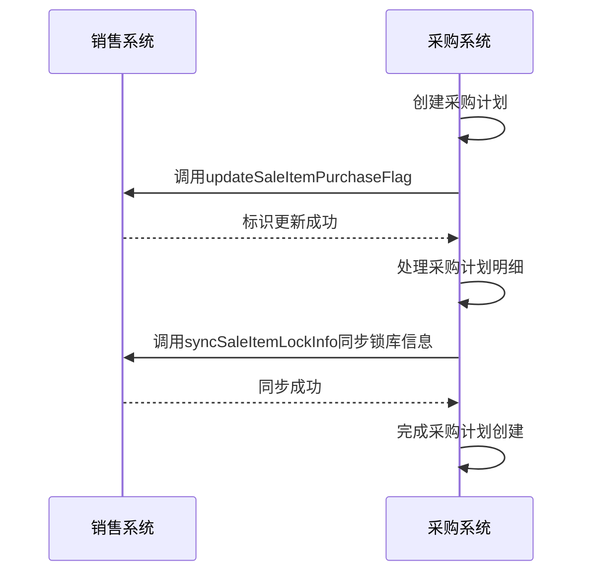
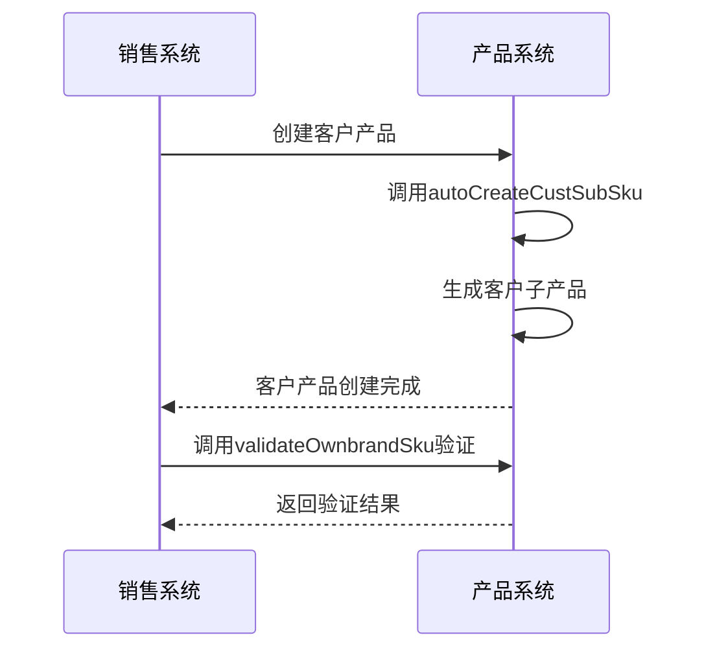
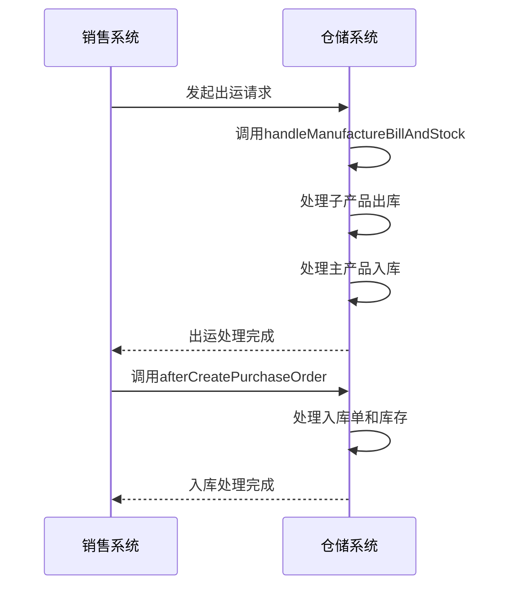

# 销售集成

<cite>
**本文档引用的文件**   
- [SaleContractApi.java](file://eplus-module-sms/eplus-module-sms-api/src/main/java/com/syj/eplus/module/sms/api/SaleContractApi.java)
- [SaleContractServiceImpl.java](file://eplus-module-sms/eplus-module-sms-biz/src/main/java/com/syj/eplus/module/sms/service/salecontract/SaleContractServiceImpl.java)
- [IStockApi.java](file://eplus-module-wms/eplus-module-wms-api/src/main/java/com/syj/eplus/module/wms/api/stock/IStockApi.java)
- [StockServiceImpl.java](file://eplus-module-wms/eplus-module-wms-biz/src/main/java/com/syj/eplus/module/wms/service/stock/StockServiceImpl.java)
- [PurchasePlanApi.java](file://eplus-module-scm/eplus-module-scm-api/src/main/java/com/syj/eplus/module/scm/api/purchaseplan/PurchasePlanApi.java)
- [PurchasePlanServiceImpl.java](file://eplus-module-scm/eplus-module-scm-biz/src/main/java/com/syj/eplus/module/scm/service/purchaseplan/PurchasePlanServiceImpl.java)
- [SkuApi.java](file://eplus-module-pms/eplus-module-pms-api/src/main/java/com/syj/eplus/module/pms/api/sku/SkuApi.java)
- [SkuServiceImpl.java](file://eplus-module-pms/eplus-module-pms-biz/src/main/java/com/syj/eplus/module/pms/service/sku/SkuServiceImpl.java)
</cite>

## 目录
1. [引言](#引言)
2. [销售与仓储系统集成](#销售与仓储系统集成)
3. [销售与采购系统协同](#销售与采购系统协同)
4. [销售与产品管理关联](#销售与产品管理关联)
5. [销售出运与仓储管理集成](#销售出运与仓储管理集成)
6. [系统集成架构](#系统集成架构)
7. [集成关键业务规则](#集成关键业务规则)
8. [结论](#结论)

## 引言
本文档全面介绍销售模块与仓储、采购、产品等系统的集成机制。重点阐述销售合同与库存管理的集成，包括库存锁定、可用库存查询、待出运数量计算等。解释销售订单与采购计划的协同逻辑，如销售驱动采购、采购进度反馈等。描述销售明细与产品管理的关联，包括产品信息同步、规格型号管理等。说明销售出运与仓储管理的集成，包括出库通知单生成、库存扣减等操作。提供系统集成架构图，展示销售模块与其他系统的接口关系。包含集成关键业务规则，如数据一致性保证、异常处理机制等。

## 销售与仓储系统集成

销售模块与仓储系统的集成主要体现在销售合同创建和更新时的库存锁定与查询机制。当创建或更新销售合同时，系统会根据销售明细中的产品信息和数量，自动锁定相应的库存。

在 `SaleContractServiceImpl` 类中，`dealLockStock` 方法负责处理销售明细的锁库逻辑。该方法首先释放该销售合同之前锁定的库存，然后根据销售明细中指定的批次信息，重新锁定库存。库存锁定信息通过 `IStockApi` 接口的 `batchLockStock` 方法进行批量处理。



**图示来源**
- [SaleContractServiceImpl.java](file://eplus-module-sms/eplus-module-sms-biz/src/main/java/com/syj/eplus/module/sms/service/salecontract/SaleContractServiceImpl.java#L763-L793)
- [IStockApi.java](file://eplus-module-wms/eplus-module-wms-api/src/main/java/com/syj/eplus/module/wms/api/stock/IStockApi.java#L38-L39)

**本节来源**
- [SaleContractServiceImpl.java](file://eplus-module-sms/eplus-module-sms-biz/src/main/java/com/syj/eplus/module/sms/service/salecontract/SaleContractServiceImpl.java#L763-L793)
- [IStockApi.java](file://eplus-module-wms/eplus-module-wms-api/src/main/java/com/syj/eplus/module/wms/api/stock/IStockApi.java#L38-L39)

## 销售与采购系统协同

销售与采购系统的协同主要通过采购计划模块实现。销售订单是采购计划的直接驱动源，采购计划的创建和更新会反馈采购进度给销售系统。

在 `PurchasePlanServiceImpl` 类中，`createPurchasePlan` 方法在创建采购计划时，会调用 `saleContractApi.updateSaleItemPurchaseFlag` 方法，回写销售明细的转采购标识，表明该销售明细已生成采购计划。同样，在 `updatePurchasePlan` 方法中，当采购计划明细发生变化时，也会通过 `dealLockStock` 方法处理库存锁定，并调用 `saleContractApi.syncSaleItemLockInfo` 方法同步销售明细的锁库信息。



**图示来源**
- [PurchasePlanServiceImpl.java](file://eplus-module-scm/eplus-module-scm-biz/src/main/java/com/syj/eplus/module/scm/service/purchaseplan/PurchasePlanServiceImpl.java#L292-L293)
- [PurchasePlanServiceImpl.java](file://eplus-module-scm/eplus-module-scm-biz/src/main/java/com/syj/eplus/module/scm/service/purchaseplan/PurchasePlanServiceImpl.java#L679-L680)
- [SaleContractApi.java](file://eplus-module-sms/eplus-module-sms-api/src/main/java/com/syj/eplus/module/sms/api/SaleContractApi.java#L120-L121)

**本节来源**
- [PurchasePlanServiceImpl.java](file://eplus-module-scm/eplus-module-scm-biz/src/main/java/com/syj/eplus/module/scm/service/purchaseplan/PurchasePlanServiceImpl.java#L292-L293)
- [PurchasePlanServiceImpl.java](file://eplus-module-scm/eplus-module-scm-biz/src/main/java/com/syj/eplus/module/scm/service/purchaseplan/PurchasePlanServiceImpl.java#L679-L680)
- [SaleContractApi.java](file://eplus-module-sms/eplus-module-sms-api/src/main/java/com/syj/eplus/module/sms/api/SaleContractApi.java#L120-L121)

## 销售与产品管理关联

销售模块与产品管理的关联主要体现在产品信息的同步和客户产品管理上。当销售合同中使用自营产品时，系统会自动为该客户创建对应的客户产品。

在 `SkuServiceImpl` 类中，`createSkuDetailBiz` 方法在创建产品时，如果该产品是客户产品，则会调用 `autoCreateCustSubSku` 方法，自动生成该客户对应的子产品。此外，`SkuApi` 接口提供了 `validateOwnbrandSku` 方法，用于验证自营产品是否存在当前客户对应的客户产品。



**图示来源**
- [SkuServiceImpl.java](file://eplus-module-pms/eplus-module-pms-biz/src/main/java/com/syj/eplus/module/pms/service/sku/SkuServiceImpl.java#L409-L410)
- [SkuServiceImpl.java](file://eplus-module-pms/eplus-module-pms-biz/src/main/java/com/syj/eplus/module/pms/service/sku/SkuServiceImpl.java#L471-L493)
- [SkuApi.java](file://eplus-module-pms/eplus-module-pms-api/src/main/java/com/syj/eplus/module/pms/api/sku/SkuApi.java#L62-L63)

**本节来源**
- [SkuServiceImpl.java](file://eplus-module-pms/eplus-module-pms-biz/src/main/java/com/syj/eplus/module/pms/service/sku/SkuServiceImpl.java#L409-L410)
- [SkuServiceImpl.java](file://eplus-module-pms/eplus-module-pms-biz/src/main/java/com/syj/eplus/module/pms/service/sku/SkuServiceImpl.java#L471-L493)
- [SkuApi.java](file://eplus-module-pms/eplus-module-pms-api/src/main/java/com/syj/eplus/module/pms/api/sku/SkuApi.java#L62-L63)

## 销售出运与仓储管理集成

销售出运与仓储管理的集成主要体现在出库通知单的生成和库存扣减操作上。当销售合同需要出运时，系统会生成出库通知单并扣减相应库存。

在 `StockServiceImpl` 类中，`handleManufactureBillAndStock` 方法负责处理加工单出入库及库存逻辑，包括子产品出库和主产品入库。`IStockApi` 接口提供了 `afterCreatePurchaseOrder` 方法，用于处理采购合同下单后的入库单和库存处理。



**图示来源**
- [StockServiceImpl.java](file://eplus-module-wms/eplus-module-wms-biz/src/main/java/com/syj/eplus/module/wms/service/stock/StockServiceImpl.java#L120-L121)
- [IStockApi.java](file://eplus-module-wms/eplus-module-wms-api/src/main/java/com/syj/eplus/module/wms/api/stock/IStockApi.java#L23-L24)

**本节来源**
- [StockServiceImpl.java](file://eplus-module-wms/eplus-module-wms-biz/src/main/java/com/syj/eplus/module/wms/service/stock/StockServiceImpl.java#L120-L121)
- [IStockApi.java](file://eplus-module-wms/eplus-module-wms-api/src/main/java/com/syj/eplus/module/wms/api/stock/IStockApi.java#L23-L24)

## 系统集成架构

整个系统的集成架构以销售模块为核心，与仓储、采购、产品等模块通过API接口进行交互。销售模块通过 `SaleContractApi` 接口与仓储、采购、产品模块进行数据交换。

```mermaid
graph TD
subgraph 销售模块
SaleContractApi[SaleContractApi]
end
subgraph 仓储模块
IStockApi[IStockApi]
StockServiceImpl[StockServiceImpl]
end
subgraph 采购模块
PurchasePlanApi[PurchasePlanApi]
PurchasePlanServiceImpl[PurchasePlanServiceImpl]
end
subgraph 产品模块
SkuApi[SkuApi]
SkuServiceImpl[SkuServiceImpl]
end
SaleContractApi --> IStockApi : 库存锁定/查询
SaleContractApi --> PurchasePlanApi : 采购计划协同
SaleContractApi --> SkuApi : 产品信息同步
PurchasePlanServiceImpl --> SaleContractApi : 回写采购标识
SkuServiceImpl --> SaleContractApi : 客户产品管理
```

**图示来源**
- [SaleContractApi.java](file://eplus-module-sms/eplus-module-sms-api/src/main/java/com/syj/eplus/module/sms/api/SaleContractApi.java)
- [IStockApi.java](file://eplus-module-wms/eplus-module-wms-api/src/main/java/com/syj/eplus/module/wms/api/stock/IStockApi.java)
- [PurchasePlanApi.java](file://eplus-module-scm/eplus-module-scm-api/src/main/java/com/syj/eplus/module/scm/api/purchaseplan/PurchasePlanApi.java)
- [SkuApi.java](file://eplus-module-pms/eplus-module-pms-api/src/main/java/com/syj/eplus/module/pms/api/sku/SkuApi.java)

**本节来源**
- [SaleContractApi.java](file://eplus-module-sms/eplus-module-sms-api/src/main/java/com/syj/eplus/module/sms/api/SaleContractApi.java)
- [IStockApi.java](file://eplus-module-wms/eplus-module-wms-api/src/main/java/com/syj/eplus/module/wms/api/stock/IStockApi.java)
- [PurchasePlanApi.java](file://eplus-module-scm/eplus-module-scm-api/src/main/java/com/syj/eplus/module/scm/api/purchaseplan/PurchasePlanApi.java)
- [SkuApi.java](file://eplus-module-pms/eplus-module-pms-api/src/main/java/com/syj/eplus/module/pms/api/sku/SkuApi.java)

## 集成关键业务规则

### 数据一致性保证
系统通过事务管理和API调用的原子性来保证数据一致性。在 `SaleContractServiceImpl` 和 `PurchasePlanServiceImpl` 等服务类中，关键操作都使用了 `@Transactional` 注解，确保数据库操作的原子性。

### 异常处理机制
系统定义了详细的异常处理机制，通过 `ErrorCodeConstants` 枚举类定义了各种业务异常。当发生异常时，系统会抛出相应的业务异常，并在日志中记录详细的错误信息。

### 库存锁定规则
库存锁定遵循"先释放后锁定"的原则，避免库存重复锁定。在 `dealLockStock` 方法中，首先调用 `cancelStockLock` 释放旧的库存锁定，然后再调用 `batchLockStock` 进行新的库存锁定。

### 采购计划协同规则
采购计划与销售合同的协同遵循"销售驱动采购"的原则。当创建采购计划时，系统会自动更新销售明细的转采购标识，并同步锁库信息，确保采购计划与销售合同的数据一致性。

**本节来源**
- [SaleContractServiceImpl.java](file://eplus-module-sms/eplus-module-sms-biz/src/main/java/com/syj/eplus/module/sms/service/salecontract/SaleContractServiceImpl.java#L274-L275)
- [PurchasePlanServiceImpl.java](file://eplus-module-scm/eplus-module-scm-biz/src/main/java/com/syj/eplus/module/scm/service/purchaseplan/PurchasePlanServiceImpl.java#L191-L192)
- [SaleContractServiceImpl.java](file://eplus-module-sms/eplus-module-sms-biz/src/main/java/com/syj/eplus/module/sms/service/salecontract/SaleContractServiceImpl.java#L765-L766)
- [PurchasePlanServiceImpl.java](file://eplus-module-scm/eplus-module-scm-biz/src/main/java/com/syj/eplus/module/scm/service/purchaseplan/PurchasePlanServiceImpl.java#L292-L293)

## 结论
本文档详细介绍了销售模块与仓储、采购、产品等系统的集成机制。通过API接口的调用，实现了销售合同与库存管理的集成、销售订单与采购计划的协同、销售明细与产品管理的关联以及销售出运与仓储管理的集成。系统通过事务管理、异常处理和业务规则保证了数据的一致性和完整性。这种集成架构有效地支持了企业的销售业务流程，提高了业务处理的效率和准确性。