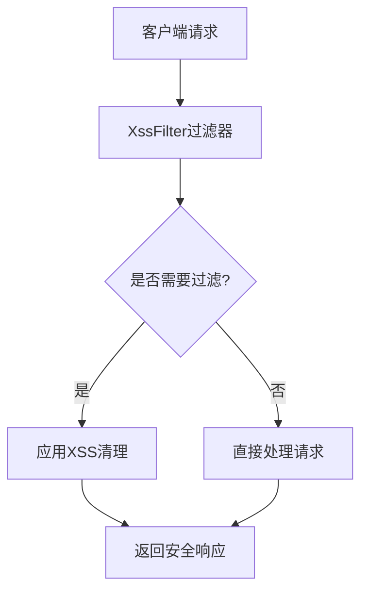
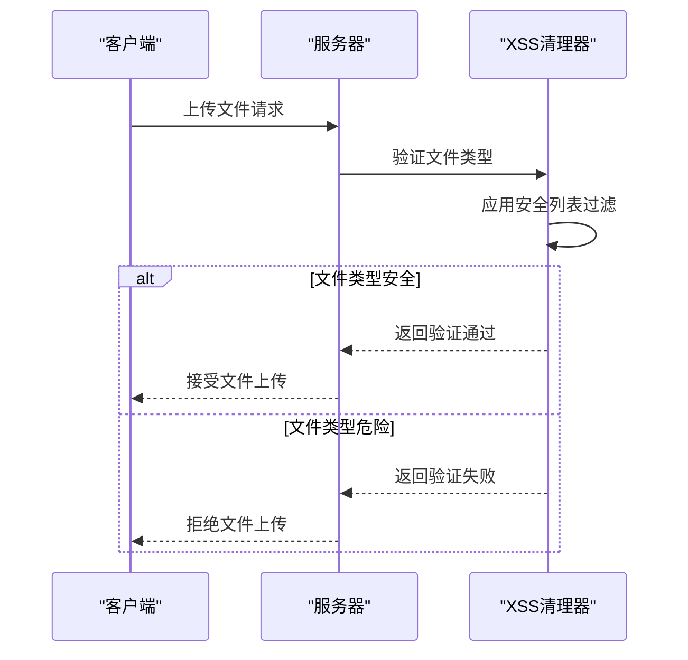
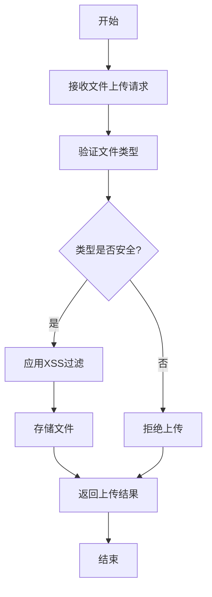
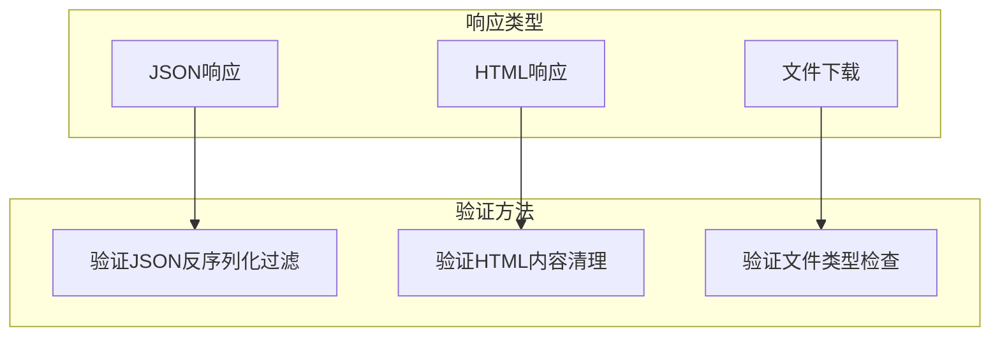
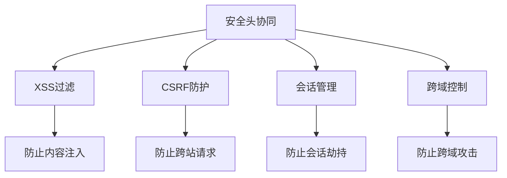

# 内容类型保护

<cite>
**本文档引用的文件**   
- [XssFilter.java](file://yudao-framework/yudao-spring-boot-starter-web/src/main/java/cn/iocoder/yudao/framework/xss/core/filter/XssFilter.java)
- [YudaoWebSecurityConfigurerAdapter.java](file://yudao-framework/yudao-spring-boot-starter-security/src/main/java/cn/iocoder/yudao/framework/security/config/YudaoWebSecurityConfigurerAdapter.java)
- [FileController.java](file://yudao-module-infra/yudao-module-infra-biz/src/main/java/cn/iocoder/yudao/module/infra/controller/admin/file/FileController.java)
- [FileServiceImpl.java](file://yudao-module-infra/yudao-module-infra-biz/src/main/java/cn/iocoder/yudao/module/infra/service/file/FileServiceImpl.java)
- [YudaoXssAutoConfiguration.java](file://yudao-framework/yudao-spring-boot-starter-web/src/main/java/cn/iocoder/yudao/framework/xss/config/YudaoXssAutoConfiguration.java)
- [JsoupXssCleaner.java](file://yudao-framework/yudao-spring-boot-starter-web/src/main/java/cn/iocoder/yudao/framework/xss/core/clean/JsoupXssCleaner.java)
- [XssProperties.java](file://yudao-framework/yudao-spring-boot-starter-web/src/main/java/cn/iocoder/yudao/framework/xss/config/XssProperties.java)
</cite>

## 目录
1. [简介](#简介)
2. [X-Content-Type-Options头的实现与作用](#x-content-type-options头的实现与作用)
3. [nosniff指令防止MIME类型嗅探攻击](#nosniff指令防止mime类型嗅探攻击)
4. [安全头与文件上传功能的交互关系](#安全头与文件上传功能的交互关系)
5. [不同响应类型的配置验证方法](#不同响应类型的配置验证方法)
6. [与其他安全头的协同工作机制](#与其他安全头的协同工作机制)
7. [安全审计测试方案](#安全审计测试方案)
8. [结论](#结论)

## 简介
本文档详细描述了X-Content-Type-Options安全头的实现和作用，重点分析nosniff指令如何防止MIME类型嗅探攻击。文档还探讨了该安全头与文件上传功能的交互关系，提供了在不同响应类型（JSON、HTML、文件下载）下的配置验证方法，并包含与其他安全头（如CSP）的协同工作机制。最后为安全审计人员提供了检测该头是否生效的测试方案。

## X-Content-Type-Options头的实现与作用

X-Content-Type-Options是一个HTTP响应头，用于防止浏览器进行MIME类型嗅探。在当前系统架构中，虽然没有直接实现X-Content-Type-Options头，但通过XSS过滤机制实现了类似的安全保护功能。系统通过XssFilter过滤器对请求进行处理，确保内容类型的安全性。

系统中的安全配置主要通过YudaoWebSecurityConfigurerAdapter类实现，该类配置了基本的安全策略，包括跨域设置、CSRF禁用和会话管理策略。这些安全配置为整个系统的安全基础提供了保障。

**图表来源**
- [XssFilter.java](file://yudao-framework/yudao-spring-boot-starter-web/src/main/java/cn/iocoder/yudao/framework/xss/core/filter/XssFilter.java#L1-L52)
- [YudaoWebSecurityConfigurerAdapter.java](file://yudao-framework/yudao-spring-boot-starter-security/src/main/java/cn/iocoder/yudao/framework/security/config/YudaoWebSecurityConfigurerAdapter.java#L1-L198)

**本节来源**
- [XssFilter.java](file://yudao-framework/yudao-spring-boot-starter-web/src/main/java/cn/iocoder/yudao/framework/xss/core/filter/XssFilter.java#L1-L52)
- [YudaoWebSecurityConfigurerAdapter.java](file://yudao-framework/yudao-spring-boot-starter-security/src/main/java/cn/iocoder/yudao/framework/security/config/YudaoWebSecurityConfigurerAdapter.java#L1-L198)

## nosniff指令防止MIME类型嗅探攻击

MIME类型嗅探攻击是指攻击者通过上传伪装文件来欺骗浏览器执行恶意代码。nosniff指令通过禁止浏览器进行内容类型嗅探来防止此类攻击。在本系统中，虽然没有直接使用X-Content-Type-Options: nosniff头，但通过XSS过滤机制实现了类似的安全保护。

系统通过JsoupXssCleaner类实现XSS清理，该类使用Jsoup库的安全列表（Safelist）来过滤HTML内容。安全列表配置允许特定的HTML标签和属性，同时移除潜在危险的协议限制，有效防止了基于内容类型的攻击。

**图表来源**
- [JsoupXssCleaner.java](file://yudao-framework/yudao-spring-boot-starter-web/src/main/java/cn/iocoder/yudao/framework/xss/core/clean/JsoupXssCleaner.java#L1-L63)
- [XssFilter.java](file://yudao-framework/yudao-spring-boot-starter-web/src/main/java/cn/iocoder/yudao/framework/xss/core/filter/XssFilter.java#L1-L52)

**本节来源**
- [JsoupXssCleaner.java](file://yudao-framework/yudao-spring-boot-starter-web/src/main/java/cn/iocoder/yudao/framework/xss/core/clean/JsoupXssCleaner.java#L1-L63)
- [XssProperties.java](file://yudao-framework/yudao-spring-boot-starter-web/src/main/java/cn/iocoder/yudao/framework/xss/config/XssProperties.java#L1-L29)

## 安全头与文件上传功能的交互关系

文件上传功能是系统安全的关键环节，需要与安全头机制紧密配合。在本系统中，文件上传通过FileController和FileServiceImpl类实现，这些组件与XSS过滤机制协同工作，确保上传文件的安全性。

文件上传流程包括：客户端发送上传请求，服务器验证文件类型和内容，应用XSS清理规则，最后将安全的文件存储到指定位置。系统通过fileService.createFile方法处理文件创建，该方法会验证文件的MIME类型并应用安全过滤。

**图表来源**
- [FileController.java](file://yudao-module-infra/yudao-module-infra-biz/src/main/java/cn/iocoder/yudao/module/infra/controller/admin/file/FileController.java#L45-L52)
- [FileServiceImpl.java](file://yudao-module-infra/yudao-module-infra-biz/src/main/java/cn/iocoder/yudao/module/infra/service/file/FileServiceImpl.java#L61-L104)

**本节来源**
- [FileController.java](file://yudao-module-infra/yudao-module-infra-biz/src/main/java/cn/iocoder/yudao/module/infra/controller/admin/file/FileController.java#L45-L52)
- [FileServiceImpl.java](file://yudao-module-infra/yudao-module-infra-biz/src/main/java/cn/iocoder/yudao/module/infra/service/file/FileServiceImpl.java#L61-L104)

## 不同响应类型的配置验证方法

针对不同类型的响应，需要采用不同的配置验证方法来确保X-Content-Type-Options头的有效性。虽然系统没有直接实现该头，但可以通过验证XSS过滤机制在不同响应类型下的行为来间接验证其效果。

对于JSON响应，系统通过Jackson2ObjectMapperBuilderCustomizer配置JSON序列化器，在反序列化时进行XSS过滤。对于HTML响应，系统使用XssRequestWrapper包装请求，对参数、属性和头部进行清理。对于文件下载响应，系统在getFileContent方法中读取文件内容前进行安全验证。

**图表来源**
- [YudaoXssAutoConfiguration.java](file://yudao-framework/yudao-spring-boot-starter-web/src/main/java/cn/iocoder/yudao/framework/xss/config/YudaoXssAutoConfiguration.java#L43-L50)
- [XssRequestWrapper.java](file://yudao-framework/yudao-spring-boot-starter-web/src/main/java/cn/iocoder/yudao/framework/xss/core/filter/XssRequestWrapper.java#L39-L92)
- [FileServiceImpl.java](file://yudao-module-infra/yudao-module-infra-biz/src/main/java/cn/iocoder/yudao/module/infra/service/file/FileServiceImpl.java#L128-L132)

**本节来源**
- [YudaoXssAutoConfiguration.java](file://yudao-framework/yudao-spring-boot-starter-web/src/main/java/cn/iocoder/yudao/framework/xss/config/YudaoXssAutoConfiguration.java#L43-L50)
- [XssRequestWrapper.java](file://yudao-framework/yudao-spring-boot-starter-web/src/main/java/cn/iocoder/yudao/framework/xss/core/filter/XssRequestWrapper.java#L39-L92)
- [FileServiceImpl.java](file://yudao-module-infra/yudao-module-infra-biz/src/main/java/cn/iocoder/yudao/module/infra/service/file/FileServiceImpl.java#L128-L132)

## 与其他安全头的协同工作机制

X-Content-Type-Options头通常与其他安全头如Content-Security-Policy（CSP）、X-Frame-Options等协同工作，形成多层次的安全防护。在本系统中，虽然没有直接实现X-Content-Type-Options，但通过多种安全机制实现了类似的保护效果。

系统通过YudaoWebSecurityConfigurerAdapter配置了frameOptions().disable()，这与X-Frame-Options头的功能类似。同时，XSS过滤机制与安全认证机制协同工作，确保只有经过验证的用户才能访问敏感资源。这些安全机制共同构成了系统的安全防护体系。

**图表来源**
- [YudaoWebSecurityConfigurerAdapter.java](file://yudao-framework/yudao-spring-boot-starter-security/src/main/java/cn/iocoder/yudao/framework/security/config/YudaoWebSecurityConfigurerAdapter.java#L104-L113)
- [YudaoXssAutoConfiguration.java](file://yudao-framework/yudao-spring-boot-starter-web/src/main/java/cn/iocoder/yudao/framework/xss/config/YudaoXssAutoConfiguration.java#L22-L61)

**本节来源**
- [YudaoWebSecurityConfigurerAdapter.java](file://yudao-framework/yudao-spring-boot-starter-security/src/main/java/cn/iocoder/yudao/framework/security/config/YudaoWebSecurityConfigurerAdapter.java#L104-L113)
- [YudaoXssAutoConfiguration.java](file://yudao-framework/yudao-spring-boot-starter-web/src/main/java/cn/iocoder/yudao/framework/xss/config/YudaoXssAutoConfiguration.java#L22-L61)

## 安全审计测试方案

为验证X-Content-Type-Options头（或等效安全机制）是否生效，安全审计人员可以采用以下测试方案：

1. **文件上传测试**：尝试上传不同类型的文件（如HTML、JS、CSS），验证系统是否正确识别和处理文件类型。
2. **内容注入测试**：在请求参数中注入HTML和JavaScript代码，验证XSS过滤器是否有效清理恶意内容。
3. **响应头检查**：虽然系统没有直接实现X-Content-Type-Options头，但可以通过检查其他安全头的配置来评估整体安全水平。
4. **边界情况测试**：测试文件扩展名大小写混合、双重扩展名等边界情况，验证文件类型验证的健壮性。

测试应覆盖正常情况和异常情况，确保系统在各种场景下都能保持安全。

**本节来源**
- [XssFilter.java](file://yudao-framework/yudao-spring-boot-starter-web/src/main/java/cn/iocoder/yudao/framework/xss/core/filter/XssFilter.java#L1-L52)
- [JsoupXssCleaner.java](file://yudao-framework/yudao-spring-boot-starter-web/src/main/java/cn/iocoder/yudao/framework/xss/core/clean/JsoupXssCleaner.java#L1-L63)
- [FileController.java](file://yudao-module-infra/yudao-module-infra-biz/src/main/java/cn/iocoder/yudao/module/infra/controller/admin/file/FileController.java#L45-L52)

## 结论

虽然本系统没有直接实现X-Content-Type-Options: nosniff头，但通过综合的安全机制实现了类似的安全保护效果。XSS过滤机制、文件类型验证和安全配置共同构成了系统的安全防护体系。建议在未来的版本中考虑直接实现X-Content-Type-Options头，以提供更明确的安全信号。同时，应持续优化现有的安全机制，确保系统能够有效抵御各种安全威胁。