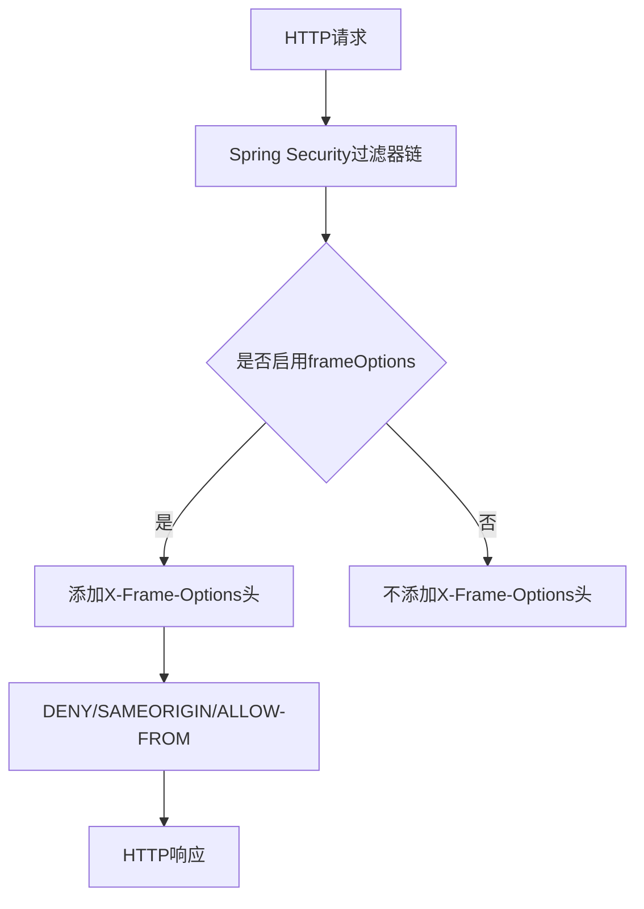
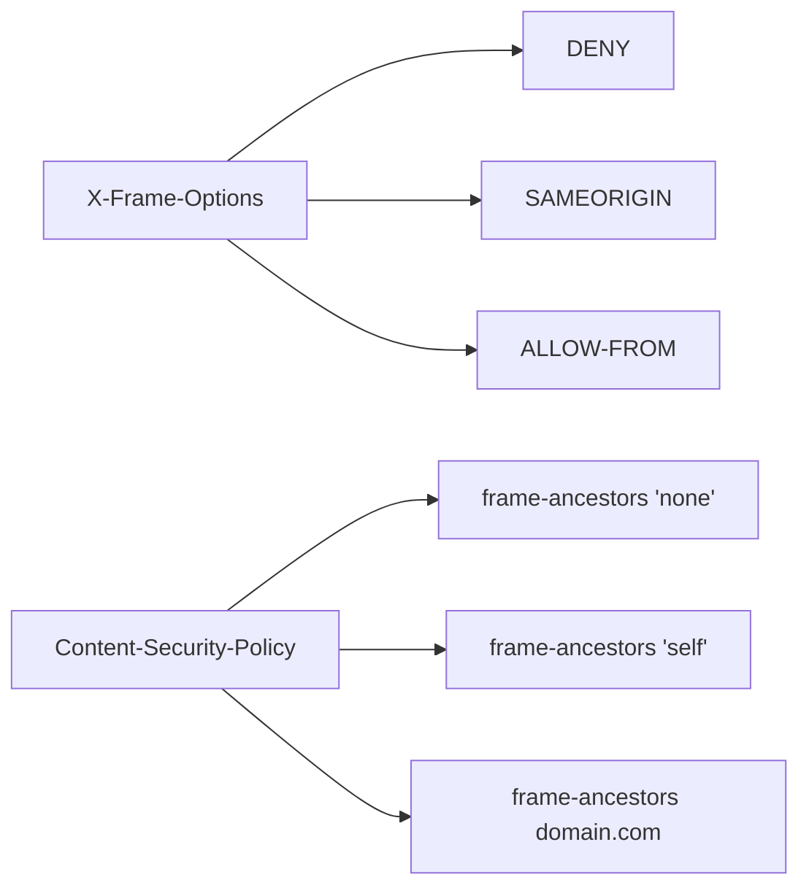
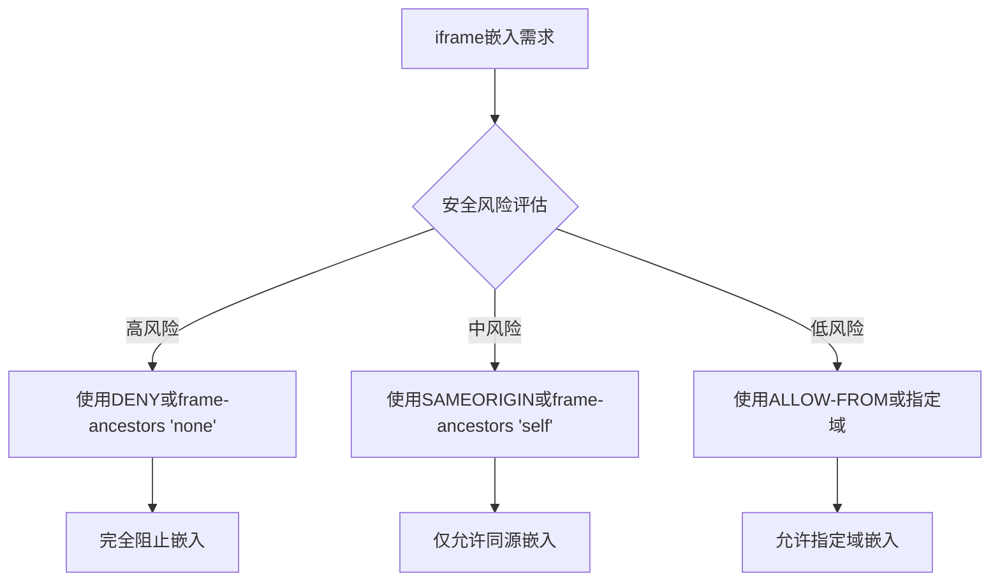
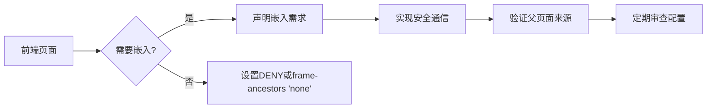

# 框架保护

<cite>
**本文档引用的文件**  
- [YudaoWebSecurityConfigurerAdapter.java](file://yudao-framework/yudao-spring-boot-starter-security/src/main/java/cn/iocoder/yudao/framework/security/config/YudaoWebSecurityConfigurerAdapter.java)
- [YudaoWebAutoConfiguration.java](file://yudao-framework/yudao-spring-boot-starter-web/src/main/java/cn/iocoder/yudao/framework/web/config/YudaoWebAutoConfiguration.java)
- [WebProperties.java](file://yudao-framework/yudao-spring-boot-starter-web/src/main/java/cn/iocoder/yudao/framework/web/config/WebProperties.java)
- [SecurityProperties.java](file://yudao-framework/yudao-spring-boot-starter-security/src/main/java/cn/iocoder/yudao/framework/security/config/SecurityProperties.java)
</cite>

## 目录
1. [引言](#引言)
2. [X-Frame-Options头配置](#x-frame-options头配置)
3. [Content-Security-Policy兼容性](#content-security-policy兼容性)
4. [iframe嵌入安全权衡](#iframe嵌入安全权衡)
5. [前端集成指导](#前端集成指导)
6. [结论](#结论)

## 引言
框架保护是Web应用安全的重要组成部分，主要通过HTTP响应头来防止点击劫持等安全威胁。本文档重点介绍X-Frame-Options头的配置和应用，详细说明DENY、SAMEORIGIN和ALLOW-FROM指令的使用场景和安全性差异，以及与现代浏览器中Content-Security-Policy的frame-ancestors指令的兼容性配置建议。

## X-Frame-Options头配置
在当前框架中，X-Frame-Options头的配置是通过Spring Security的`HttpSecurity`配置实现的。具体配置位于`YudaoWebSecurityConfigurerAdapter`类中，通过调用`headers().frameOptions().disable()`方法来控制框架选项。

**图源**  
- [YudaoWebSecurityConfigurerAdapter.java](file://yudao-framework/yudao-spring-boot-starter-security/src/main/java/cn/iocoder/yudao/framework/security/config/YudaoWebSecurityConfigurerAdapter.java#L109)

**本节来源**  
- [YudaoWebSecurityConfigurerAdapter.java](file://yudao-framework/yudao-spring-boot-starter-security/src/main/java/cn/iocoder/yudao/framework/security/config/YudaoWebSecurityConfigurerAdapter.java#L109)

### DENY指令
DENY指令是最严格的选项，它会阻止页面在任何框架中显示。这种配置适用于包含敏感信息的页面，如用户个人资料、支付信息等。

### SAMEORIGIN指令
SAMEORIGIN指令允许页面在同源的框架中显示。这种配置适用于需要在同站内嵌入的页面，如管理后台的仪表板。

### ALLOW-FROM指令
ALLOW-FROM指令允许指定的外部域嵌入页面。这种配置需要谨慎使用，因为它会增加安全风险。

## Content-Security-Policy兼容性
随着现代浏览器对Content-Security-Policy（CSP）的支持，frame-ancestors指令已经成为替代X-Frame-Options的推荐方式。CSP的frame-ancestors指令提供了更灵活的控制选项。

**图源**  
- [YudaoWebSecurityConfigurerAdapter.java](file://yudao-framework/yudao-spring-boot-starter-security/src/main/java/cn/iocoder/yudao/framework/security/config/YudaoWebSecurityConfigurerAdapter.java#L109)

**本节来源**  
- [YudaoWebSecurityConfigurerAdapter.java](file://yudao-framework/yudao-spring-boot-starter-security/src/main/java/cn/iocoder/yudao/framework/security/config/YudaoWebSecurityConfigurerAdapter.java#L109)

### 兼容性配置建议
1. 同时设置X-Frame-Options和Content-Security-Policy头，以确保向后兼容性
2. 优先使用CSP的frame-ancestors指令，因为它提供了更精细的控制
3. 在不支持CSP的旧浏览器中，依赖X-Frame-Options作为后备方案

## iframe嵌入安全权衡
在iframe嵌入场景下，需要在功能需求和安全风险之间进行权衡。当前框架通过`WebProperties`类中的配置来管理API前缀和控制器包路径，这为安全控制提供了基础。

**图源**  
- [WebProperties.java](file://yudao-framework/yudao-spring-boot-starter-web/src/main/java/cn/iocoder/yudao/framework/web/config/WebProperties.java)
- [YudaoWebSecurityConfigurerAdapter.java](file://yudao-framework/yudao-spring-boot-starter-security/src/main/java/cn/iocoder/yudao/framework/security/config/YudaoWebSecurityConfigurerAdapter.java#L109)

**本节来源**  
- [WebProperties.java](file://yudao-framework/yudao-spring-boot-starter-web/src/main/java/cn/iocoder/yudao/framework/web/config/WebProperties.java)
- [YudaoWebSecurityConfigurerAdapter.java](file://yudao-framework/yudao-spring-boot-starter-security/src/main/java/cn/iocoder/yudao/framework/security/config/YudaoWebSecurityConfigurerAdapter.java#L109)

### 替代方案
1. 使用postMessage API进行安全的跨域通信
2. 实现基于令牌的嵌入验证机制
3. 使用沙箱属性限制iframe的权限

## 前端集成指导
为了确保前端集成的安全性，建议遵循以下指导原则：

1. 在前端代码中明确声明需要嵌入的页面
2. 使用安全的通信机制与父页面交互
3. 验证父页面的来源，防止恶意嵌入
4. 定期审查和更新安全配置

**图源**  
- [YudaoWebSecurityConfigurerAdapter.java](file://yudao-framework/yudao-spring-boot-starter-security/src/main/java/cn/iocoder/yudao/framework/security/config/YudaoWebSecurityConfigurerAdapter.java#L109)

**本节来源**  
- [YudaoWebSecurityConfigurerAdapter.java](file://yudao-framework/yudao-spring-boot-starter-security/src/main/java/cn/iocoder/yudao/framework/security/config/YudaoWebSecurityConfigurerAdapter.java#L109)

## 结论
框架保护配置是确保Web应用安全的关键环节。通过合理配置X-Frame-Options头和Content-Security-Policy的frame-ancestors指令，可以有效防止点击劫持攻击。在iframe嵌入场景下，需要仔细权衡功能需求和安全风险，选择合适的配置方案。前端集成时应遵循安全最佳实践，确保整体系统的安全性。