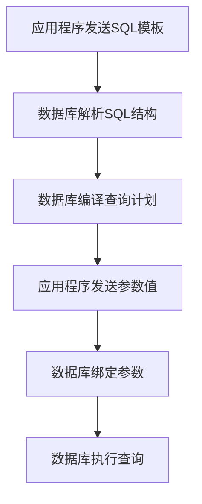

# 预编译语句

<cite>
**本文档引用文件**  
- [SetPreferenceObjListHandler.java](file://yudao-module-system/yudao-module-system-biz/src/main/java/cn/iocoder/yudao/module/system/handle/SetPreferenceObjListHandler.java)
- [AbstractJsonTypeHandler.java](file://eplus-framework/eplus-common/src/main/java/com/syj/eplus/framework/common/config/handler/AbstractJsonTypeHandler.java)
- [SetPreferenceObjListTypeHandler.java](file://yudao-module-system/yudao-module-system-biz/src/main/java/cn/iocoder/yudao/module/system/handle/SetPreferenceObjListTypeHandler.java)
- [DataPermissionDatabaseInterceptor.java](file://yudao-framework/yudao-spring-boot-starter-data-permission/src/main/java/cn/iocoder/yudao/framework/datapermission/core/db/DataPermissionDatabaseInterceptor.java)
- [SkuMapper.xml](file://eplus-module-pms/eplus-module-pms-biz/src/main/resources/mapper/SkuMapper.xml)
- [CustMapper.xml](file://eplus-module-crm/eplus-module-crm-biz/src/main/resources/mapper/CustMapper.xml)
- [ShipmentItemMapper.xml](file://eplus-module-dms/eplus-module-dms-biz/src/main/resources/mapper/ShipmentItemMapper.xml)
- [OrderLinkMapper.xml](file://eplus-module-infra/eplus-module-infra-biz/src/main/resources/mapper/orderlink/OrderLinkMapper.xml)
- [OPTIMIZATION_PLAN.md](file://eplus-module-infra/OPTIMIZATION_PLAN.md)
- [OrderLinkServiceImplTest.java](file://eplus-module-infra/eplus-module-infra-biz/src/test/java/com/syj/eplus/module/infra/service/orderlink/OrderLinkServiceImplTest.java)
- [QueryWrapperX.java](file://yudao-framework/yudao-spring-boot-starter-mybatis/src/main/java/cn/iocoder/yudao/framework/mybatis/core/query/QueryWrapperX.java)
- [DifferenceReasonListHandler.java](file://eplus-framework/eplus-common/src/main/java/com/syj/eplus/framework/common/config/handler/DifferenceReasonListHandler.java)
- [BaseValueListTypeHandler.java](file://eplus-framework/eplus-common/src/main/java/com/syj/eplus/framework/common/config/handler/BaseValueListTypeHandler.java)
- [StringListTypeHandler.java](file://eplus-framework/eplus-common/src/main/java/com/syj/eplus/framework/common/config/handler/StringListTypeHandler.java)
</cite>

## 目录
1. [引言](#引言)
2. [预编译语句工作原理](#预编译语句工作原理)
3. [MyBatis中#{}占位符的最佳实践](#mybatis中占位符的最佳实践)
4. [SQL注入防护机制](#sql注入防护机制)
5. [预编译语句与字符串拼接的安全性对比](#预编译语句与字符串拼接的安全性对比)
6. [代码审查指南](#代码审查指南)
7. [结论](#结论)

## 引言
预编译语句（PreparedStatement）是数据库访问中防止SQL注入攻击的核心安全机制。本文档详细阐述预编译语句的工作原理，重点分析其在MyBatis框架中的实现方式，特别是#{}占位符的使用方法。通过分析项目中的实际代码示例，展示预编译语句如何将SQL结构与参数数据分离，从根本上阻止恶意SQL注入。同时提供开发者代码审查指南，帮助识别和修复潜在的安全风险。

## 预编译语句工作原理
预编译语句通过将SQL语句的解析、编译和执行过程分离，实现了SQL结构与参数数据的完全隔离。其工作流程分为三个阶段：

1. **SQL解析与编译阶段**：数据库服务器接收到带有占位符的SQL模板后，对其进行语法解析和查询计划编译。此阶段确定了SQL的执行路径，但不包含具体参数值。

2. **参数绑定阶段**：应用程序将实际参数值通过安全的协议传输给数据库服务器。这些参数被视为纯数据，不会被重新解析为SQL代码。

3. **执行阶段**：数据库服务器使用已编译的查询计划和绑定的参数值执行查询。

在项目中，`PreparedStatement`接口被广泛用于自定义类型处理器中，如`SetPreferenceObjListHandler`和`AbstractJsonTypeHandler`，通过`setNonNullParameter`方法安全地设置参数值，确保数据以预编译方式处理。



**图示来源**
- [SetPreferenceObjListHandler.java](file://yudao-module-system/yudao-module-system-biz/src/main/java/cn/iocoder/yudao/module/system/handle/SetPreferenceObjListHandler.java#L21-L24)
- [AbstractJsonTypeHandler.java](file://eplus-framework/eplus-common/src/main/java/com/syj/eplus/framework/common/config/handler/AbstractJsonTypeHandler.java#L49-L52)

## MyBatis中#{}占位符的最佳实践
MyBatis框架通过#{}占位符实现预编译语句，这是防止SQL注入的关键机制。#{}占位符会将参数作为预编译参数处理，而${}占位符则会进行字符串替换，存在安全风险。

项目中的最佳实践示例如下：

1. **基本参数绑定**：在Mapper XML文件中使用#{}绑定单个参数：
```xml
<select id="selectBySkuId" resultType="Stock">
    SELECT * FROM stock WHERE sku_id = #{skuId} AND deleted = 0
</select>
```

2. **集合参数处理**：使用`<foreach>`标签安全地处理集合参数：
```xml
<select id="existsBySourceUniqueCodes" resultType="java.lang.Boolean">
    SELECT EXISTS(
        SELECT 1 FROM order_link
        WHERE
        <foreach collection="uniqueCodes" item="code" separator=" OR ">
            JSON_CONTAINS(item, JSON_OBJECT('sourceUniqueCode', #{code}))
        </foreach>
    )
</select>
```

3. **复杂对象参数**：直接绑定对象属性：
```xml
<insert id="insertOrderLink">
    INSERT INTO order_link (code, name, link_code, type, item)
    VALUES (#{code}, #{name}, #{linkCode}, #{type}, #{item})
</insert>
```

这些实践确保了所有用户输入都被作为参数处理，而不是SQL代码的一部分。

**图示来源**
- [OrderLinkMapper.xml](file://eplus-module-infra/eplus-module-infra-biz/src/main/resources/mapper/orderlink/OrderLinkMapper.xml#L6-L14)
- [SkuMapper.xml](file://eplus-module-pms/eplus-module-pms-biz/src/main/resources/mapper/SkuMapper.xml#L77)

## SQL注入防护机制
预编译语句通过将SQL结构与参数数据严格分离，从根本上防止了SQL注入攻击。当使用#{}占位符时，数据库会将参数值视为纯数据，即使包含恶意SQL代码也不会被解析执行。

项目中的防护机制体现在：

1. **类型处理器安全实现**：自定义类型处理器如`StringListTypeHandler`和`BaseValueListTypeHandler`都通过`PreparedStatement`的`setParameter`方法安全地设置参数，避免字符串拼接。

2. **参数化查询强制使用**：在`OPTIMIZATION_PLAN.md`中明确要求使用参数化查询修复SQL注入漏洞，如`selectBySourceUniqueCodes`方法的实现。

3. **测试验证**：`OrderLinkServiceImplTest`中包含专门的SQL注入防护测试，验证系统能够安全处理恶意输入。

```mermaid
sequenceDiagram
participant 应用程序
participant MyBatis
participant 数据库
应用程序->>MyBatis : 调用Mapper方法<br/>selectBySourceUniqueCodes(maliciousCodes)
MyBatis->>数据库 : 发送预编译SQL模板<br/>SELECT EXISTS(... WHERE JSON_CONTAINS(..., ?))
数据库-->>MyBatis : 返回编译后的执行计划
MyBatis->>数据库 : 发送参数值<br/>["'; DROP TABLE order_link; --"]
数据库-->>MyBatis : 执行查询并返回结果
MyBatis-->>应用程序 : 返回false
Note over 应用程序,数据库 : 恶意代码被作为数据处理<br/>不会执行DROP TABLE语句
```

**图示来源**
- [StringListTypeHandler.java](file://eplus-framework/eplus-common/src/main/java/com/syj/eplus/framework/common/config/handler/StringListTypeHandler.java#L29-L31)
- [OPTIMIZATION_PLAN.md](file://eplus-module-infra/OPTIMIZATION_PLAN.md#L553-L584)
- [OrderLinkServiceImplTest.java](file://eplus-module-infra/eplus-module-infra-biz/src/test/java/com/syj/eplus/module/infra/service/orderlink/OrderLinkServiceImplTest.java#L107-L121)

## 预编译语句与字符串拼接的安全性对比
预编译语句与字符串拼接在安全性上有本质区别：

| 对比维度 | 预编译语句 | 字符串拼接 |
|---------|----------|----------|
| **SQL解析时机** | 先解析SQL结构，后绑定参数 | 拼接后整体解析 |
| **参数处理方式** | 参数作为纯数据传输 | 参数作为SQL代码片段 |
| **SQL注入风险** | 基本无风险 | 高风险 |
| **性能** | 可重用执行计划，性能高 | 每次都需要重新解析 |
| **代码可读性** | 清晰分离SQL结构和数据 | 混合在一起，易出错 |

在项目中，`DataPermissionDatabaseInterceptor`类中的`formatSql`方法展示了参数填充的过程，但这是仅用于日志记录的字符串替换，实际数据库通信仍然使用安全的预编译参数传递。

**图示来源**
- [DataPermissionDatabaseInterceptor.java](file://yudao-framework/yudao-spring-boot-starter-data-permission/src/main/java/cn/iocoder/yudao/framework/datapermission/core/db/DataPermissionDatabaseInterceptor.java#L64-L106)

## 代码审查指南
为确保代码安全，开发者应遵循以下审查指南：

1. **检查Mapper文件中的占位符**：
   - 确保使用#{}而非${}进行参数绑定
   - 验证所有用户输入都通过#{}传递

2. **审查自定义类型处理器**：
   - 确认所有`setNonNullParameter`方法都使用`PreparedStatement`安全设置参数
   - 检查是否有字符串拼接操作

3. **验证业务逻辑中的SQL构建**：
   - 禁止使用字符串拼接构建SQL语句
   - 确保使用MyBatis的`QueryWrapperX`等安全查询构建器

4. **检查测试用例**：
   - 确保有针对SQL注入的测试用例
   - 验证系统对恶意输入的处理能力

5. **重点关注高风险操作**：
   - 动态表名、列名的处理
   - 排序字段的动态设置
   - 复杂条件查询的构建

通过严格的代码审查，可以有效识别和修复非预编译查询，确保系统安全。

**图示来源**
- [QueryWrapperX.java](file://yudao-framework/yudao-spring-boot-starter-mybatis/src/main/java/cn/iocoder/yudao/framework/mybatis/core/query/QueryWrapperX.java#L1-L40)
- [OPTIMIZATION_PLAN.md](file://eplus-module-infra/OPTIMIZATION_PLAN.md#L529-L584)

## 结论
预编译语句是防止SQL注入攻击的最有效手段。通过将SQL结构与参数数据分离，预编译语句从根本上消除了恶意代码注入的可能性。在本项目中，MyBatis框架的#{}占位符机制被正确应用于各个模块，结合自定义类型处理器和严格的代码审查流程，构建了坚固的安全防线。开发者应始终坚持使用预编译语句，避免字符串拼接，确保系统的安全性和稳定性。