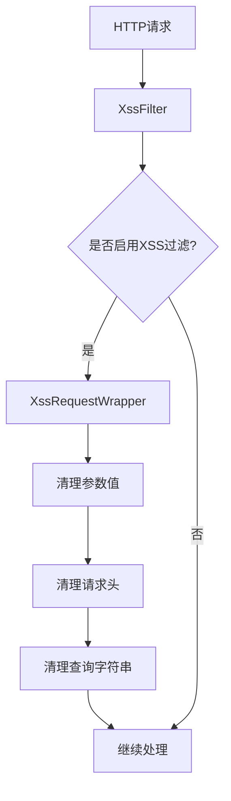
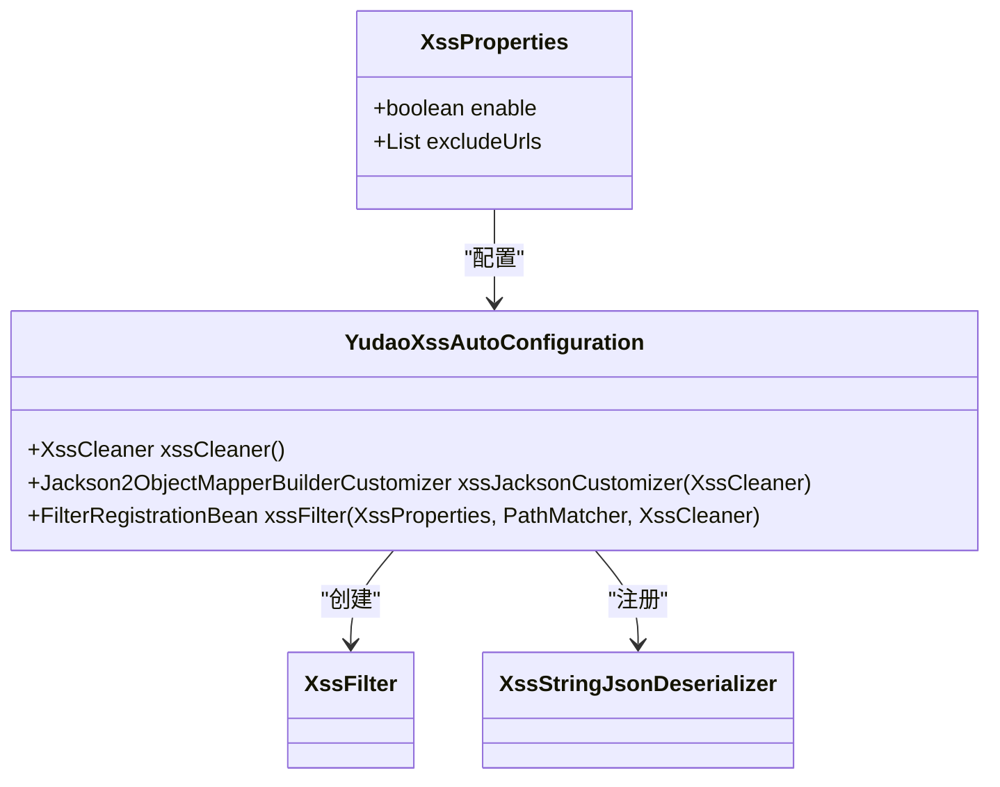
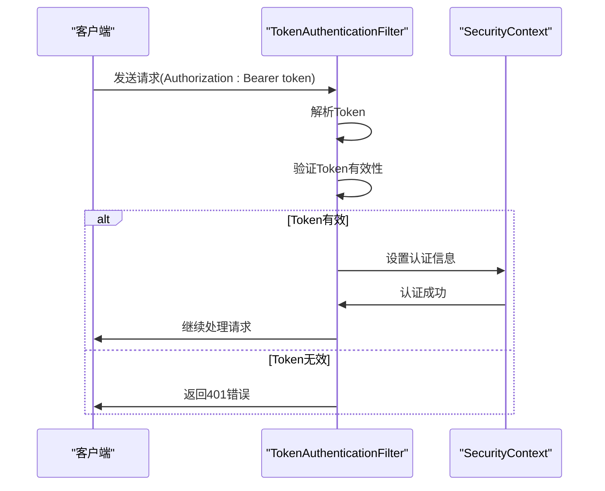
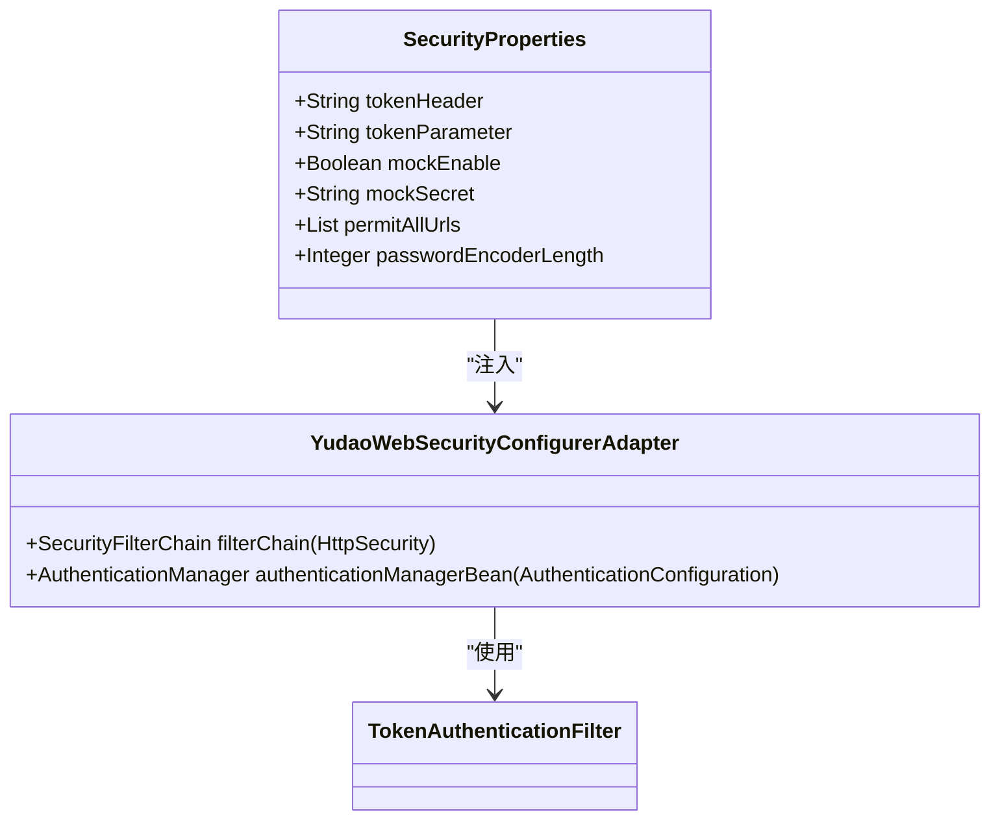
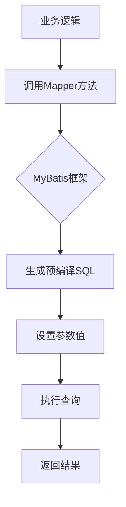
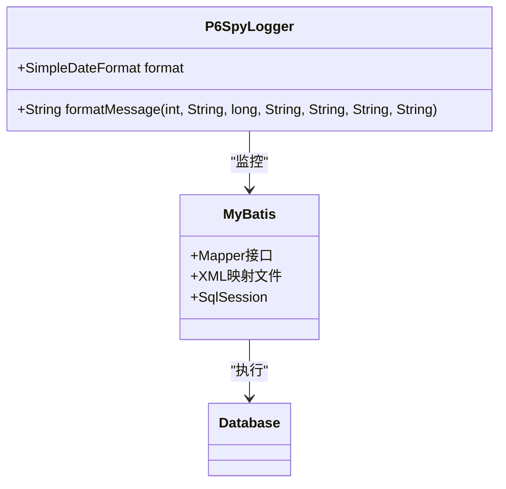
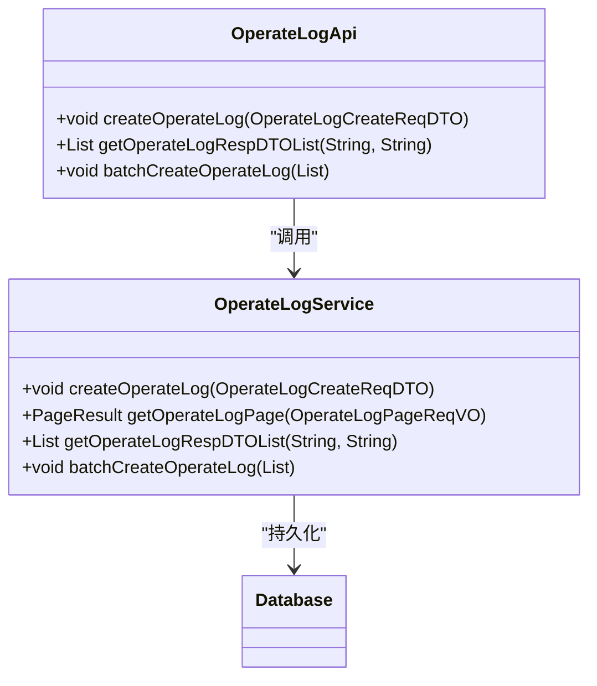
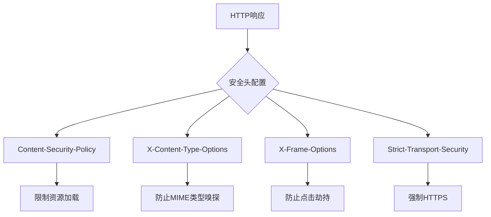

# Web安全防护

<cite>
**本文档引用的文件**   
- [XssStringJsonDeserializer.java](file://yudao-framework/yudao-spring-boot-starter-web/src/main/java/cn/iocoder/yudao/framework/xss/core/json/XssStringJsonDeserializer.java)
- [YudaoXssAutoConfiguration.java](file://yudao-framework/yudao-spring-boot-starter-web/src/main/java/cn/iocoder/yudao/framework/xss/config/YudaoXssAutoConfiguration.java)
- [XssProperties.java](file://yudao-framework/yudao-spring-boot-starter-web/src/main/java/cn/iocoder/yudao/framework/xss/config/XssProperties.java)
- [XssFilter.java](file://yudao-framework/yudao-spring-boot-starter-web/src/main/java/cn/iocoder/yudao/framework/xss/core/filter/XssFilter.java)
- [JsoupXssCleaner.java](file://yudao-framework/yudao-spring-boot-starter-web/src/main/java/cn/iocoder/yudao/framework/xss/core/clean/JsoupXssCleaner.java)
- [YudaoWebSecurityConfigurerAdapter.java](file://yudao-framework/yudao-spring-boot-starter-security/src/main/java/cn/iocoder/yudao/framework/security/config/YudaoWebSecurityConfigurerAdapter.java)
- [SecurityProperties.java](file://yudao-framework/yudao-spring-boot-starter-security/src/main/java/cn/iocoder/yudao/framework/security/config/SecurityProperties.java)
- [P6SpyLogger.java](file://eplus-framework/eplus-common/src/main/java/com/syj/eplus/framework/common/config/P6SpyLogger.java)
- [OperateLogApi.java](file://yudao-module-system/yudao-module-system-api/src/main/java/cn/iocoder/yudao/module/system/api/logger/OperateLogApi.java)
</cite>

## 目录
1. [引言](#引言)
2. [XSS跨站脚本攻击防护](#xss跨站脚本攻击防护)
3. [CSRF跨站请求伪造防护](#csrf跨站请求伪造防护)
4. [SQL注入防护](#sql注入防护)
5. [安全日志记录与监控告警](#安全日志记录与监控告警)
6. [安全HTTP头配置](#安全http头配置)
7. [安全漏洞扫描与渗透测试建议](#安全漏洞扫描与渗透测试建议)
8. [结论](#结论)

## 引言

本文档详细描述了系统对常见Web攻击的防御措施，重点介绍XSS、CSRF和SQL注入等安全威胁的防护机制。系统采用现代化的安全架构，通过输入过滤、输出编码、令牌验证、预编译语句等多种技术手段，构建了多层次的安全防护体系。同时，文档还涵盖了安全日志记录、监控告警以及安全HTTP头配置的最佳实践，为开发者提供全面的安全防护指南。

**本文档引用的文件**   
- [YudaoWebSecurityConfigurerAdapter.java](file://yudao-framework/yudao-spring-boot-starter-security/src/main/java/cn/iocoder/yudao/framework/security/config/YudaoWebSecurityConfigurerAdapter.java)

## XSS跨站脚本攻击防护

系统实现了全面的XSS（跨站脚本攻击）防护机制，通过多层过滤和清理策略来防止恶意脚本注入。防护机制主要由XSS过滤器、JSON反序列化器和清理器组成，确保所有用户输入在处理前都经过严格的安全检查。

### 输入过滤与输出编码

系统通过`XssFilter`过滤器对所有HTTP请求进行拦截，对请求参数、请求头、查询字符串等进行XSS过滤。过滤器使用`XssRequestWrapper`包装原始请求，重写相关方法以实现自动清理。

**图表来源**
- [XssFilter.java](file://yudao-framework/yudao-spring-boot-starter-web/src/main/java/cn/iocoder/yudao/framework/xss/core/filter/XssFilter.java)
- [XssRequestWrapper.java](file://yudao-framework/yudao-spring-boot-starter-web/src/main/java/cn/iocoder/yudao/framework/xss/core/filter/XssRequestWrapper.java)

### CSP策略配置

系统通过配置XSS防护属性来控制CSP（内容安全策略）相关的行为。`XssProperties`类定义了XSS防护的配置选项，包括是否启用防护和需要排除的URL列表。

**图表来源**
- [XssProperties.java](file://yudao-framework/yudao-spring-boot-starter-web/src/main/java/cn/iocoder/yudao/framework/xss/config/XssProperties.java)
- [YudaoXssAutoConfiguration.java](file://yudao-framework/yudao-spring-boot-starter-web/src/main/java/cn/iocoder/yudao/framework/xss/config/YudaoXssAutoConfiguration.java)

**本节来源**
- [XssProperties.java](file://yudao-framework/yudao-spring-boot-starter-web/src/main/java/cn/iocoder/yudao/framework/xss/config/XssProperties.java)
- [YudaoXssAutoConfiguration.java](file://yudao-framework/yudao-spring-boot-starter-web/src/main/java/cn/iocoder/yudao/framework/xss/config/YudaoXssAutoConfiguration.java)
- [XssFilter.java](file://yudao-framework/yudao-spring-boot-starter-web/src/main/java/cn/iocoder/yudao/framework/xss/core/filter/XssFilter.java)

## CSRF跨站请求伪造防护

系统通过基于Token的认证机制来防护CSRF（跨站请求伪造）攻击。由于系统采用无状态的Token机制，不使用传统的Session，因此CSRF防护策略与传统Web应用有所不同。

### 令牌验证

系统使用`TokenAuthenticationFilter`作为主要的认证过滤器，通过在请求头或请求参数中传递Token来验证用户身份。这种机制天然地防止了CSRF攻击，因为攻击者无法获取到有效的Token。

**图表来源**
- [TokenAuthenticationFilter.java](file://yudao-framework/yudao-spring-boot-starter-security/src/main/java/cn/iocoder/yudao/framework/security/core/filter/TokenAuthenticationFilter.java)
- [SecurityFrameworkUtils.java](file://yudao-framework/yudao-spring-boot-starter-security/src/main/java/cn/iocoder/yudao/framework/security/core/util/SecurityFrameworkUtils.java)

### SameSite Cookie设置

虽然系统主要依赖Token认证，但仍然可以通过配置安全属性来设置Cookie的SameSite策略。`SecurityProperties`类定义了安全相关的配置选项，包括Token的请求头和参数名称。

**图表来源**
- [SecurityProperties.java](file://yudao-framework/yudao-spring-boot-starter-security/src/main/java/cn/iocoder/yudao/framework/security/config/SecurityProperties.java)
- [YudaoWebSecurityConfigurerAdapter.java](file://yudao-framework/yudao-spring-boot-starter-security/src/main/java/cn/iocoder/yudao/framework/security/config/YudaoWebSecurityConfigurerAdapter.java)

**本节来源**
- [YudaoWebSecurityConfigurerAdapter.java](file://yudao-framework/yudao-spring-boot-starter-security/src/main/java/cn/iocoder/yudao/framework/security/config/YudaoWebSecurityConfigurerAdapter.java)
- [SecurityProperties.java](file://yudao-framework/yudao-spring-boot-starter-security/src/main/java/cn/iocoder/yudao/framework/security/config/SecurityProperties.java)

## SQL注入防护

系统通过使用MyBatis框架和预编译语句来有效防止SQL注入攻击。ORM框架的使用确保了所有数据库操作都通过参数化查询执行，避免了直接拼接SQL字符串的风险。

### 预编译语句

系统采用MyBatis作为持久层框架，所有数据库查询都通过Mapper接口定义。MyBatis自动将方法参数转换为预编译语句的参数，从根本上防止了SQL注入。

### ORM框架安全使用

系统通过配置MyBatis的SQL日志来监控所有数据库操作，确保没有不安全的查询被执行。`P6SpyLogger`类用于格式化和记录SQL执行日志，便于审计和监控。

**图表来源**
- [P6SpyLogger.java](file://eplus-framework/eplus-common/src/main/java/com/syj/eplus/framework/common/config/P6SpyLogger.java)

**本节来源**
- [P6SpyLogger.java](file://eplus-framework/eplus-common/src/main/java/com/syj/eplus/framework/common/config/P6SpyLogger.java)

## 安全日志记录与监控告警

系统实现了全面的安全日志记录和监控告警机制，确保所有关键操作都有迹可循，便于审计和故障排查。

### 安全日志记录

系统通过`OperateLogApi`接口记录所有用户的操作日志。每个操作日志包含操作类型、操作模块、操作内容、操作结果等详细信息，为安全审计提供完整的数据支持。

**图表来源**
- [OperateLogApi.java](file://yudao-module-system/yudao-module-system-api/src/main/java/cn/iocoder/yudao/module/system/api/logger/OperateLogApi.java)
- [OperateLogService.java](file://yudao-module-system/yudao-module-system-biz/src/main/java/cn/iocoder/yudao/module/system/service/logger/OperateLogService.java)

### 监控告警配置

系统通过集成Spring Boot Admin、SkyWalking等监控工具，实现了全面的系统监控。所有关键指标都有相应的告警规则，确保问题能够及时发现和处理。

**本节来源**
- [OperateLogApi.java](file://yudao-module-system/yudao-module-system-api/src/main/java/cn/iocoder/yudao/module/system/api/logger/OperateLogApi.java)

## 安全HTTP头配置

系统通过配置安全HTTP头来增强Web应用的安全性，防止常见的Web攻击。

### Content-Security-Policy配置

虽然系统没有直接配置CSP头，但通过XSS防护机制和前端框架的配合，实现了类似CSP的安全效果。所有动态内容都经过严格的过滤和编码，确保不会执行恶意脚本。

### X-Content-Type-Options配置

系统通过Spring Security配置禁用了frameOptions，防止页面被嵌入到iframe中。这有助于防止点击劫持等攻击。

**本节来源**
- [YudaoWebSecurityConfigurerAdapter.java](file://yudao-framework/yudao-spring-boot-starter-security/src/main/java/cn/iocoder/yudao/framework/security/config/YudaoWebSecurityConfigurerAdapter.java)

## 安全漏洞扫描与渗透测试建议

为确保系统的安全性，建议定期进行安全漏洞扫描和渗透测试。

### 漏洞扫描实践

1. 使用专业的漏洞扫描工具（如Burp Suite、OWASP ZAP）对系统进行全面扫描
2. 重点关注XSS、CSRF、SQL注入等常见漏洞
3. 定期更新扫描工具和漏洞库，确保能够检测最新威胁
4. 对扫描结果进行分类和优先级排序，优先修复高风险漏洞

### 渗透测试建议

1. 模拟真实攻击场景，测试系统的防御能力
2. 重点关注身份认证、权限控制、数据访问等关键环节
3. 测试API接口的安全性，确保没有未授权访问的风险
4. 验证安全日志记录的完整性和准确性
5. 测试系统的异常处理能力，确保不会泄露敏感信息

## 结论

本系统通过多层次的安全防护机制，有效抵御了XSS、CSRF、SQL注入等常见Web攻击。通过输入过滤、输出编码、令牌验证、预编译语句等技术手段，构建了坚固的安全防线。同时，完善的日志记录和监控告警机制确保了系统的可审计性和可维护性。建议定期进行安全评估和渗透测试，持续改进系统的安全性。