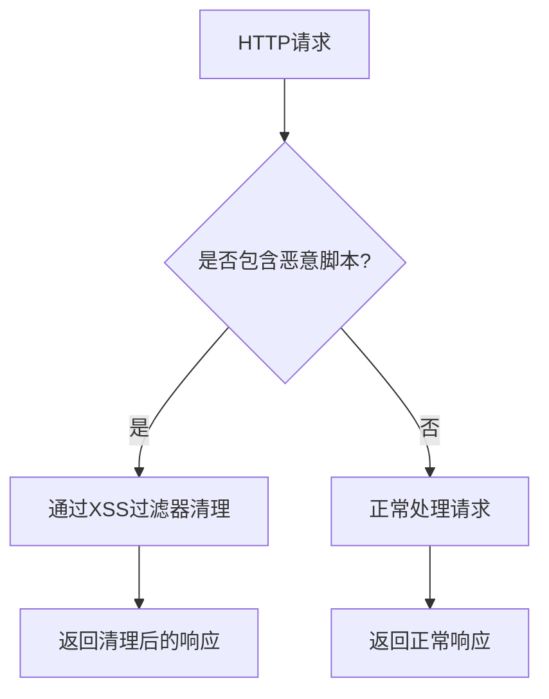
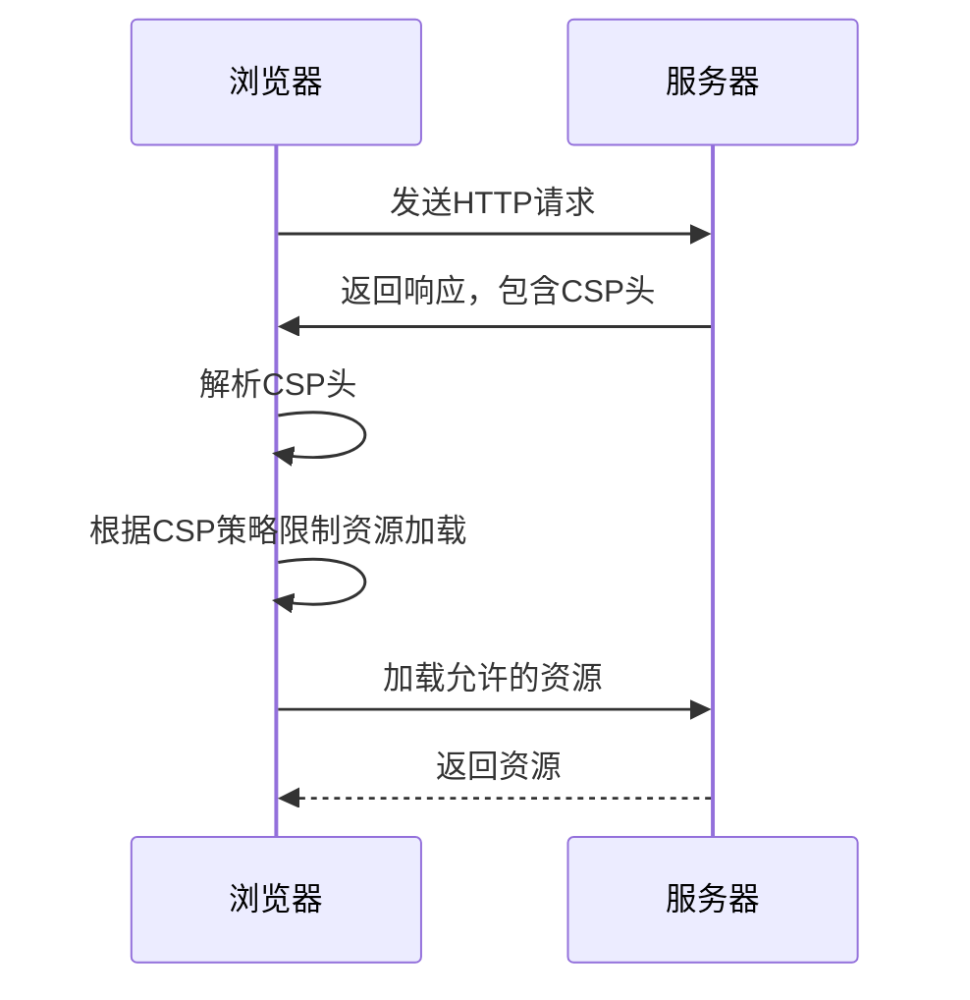

# CSP策略

<cite>
**本文档引用的文件**
- [WebProperties.java](file://yudao-framework/yudao-spring-boot-starter-web/src/main/java/cn/iocoder/yudao/framework/web/config/WebProperties.java)
- [YudaoWebSecurityConfigurerAdapter.java](file://yudao-framework/yudao-spring-boot-starter-security/src/main/java/cn/iocoder/yudao/framework/security/config/YudaoWebSecurityConfigurerAdapter.java)
- [XssProperties.java](file://yudao-framework/yudao-spring-boot-starter-web/src/main/java/cn/iocoder/yudao/framework/xss/config/XssProperties.java)
- [JsoupXssCleaner.java](file://yudao-framework/yudao-spring-boot-starter-web/src/main/java/cn/iocoder/yudao/framework/xss/core/clean/JsoupXssCleaner.java)
- [SecurityProperties.java](file://yudao-framework/yudao-spring-boot-starter-security/src/main/java/cn/iocoder/yudao/framework/security/config/SecurityProperties.java)
</cite>

## 目录
1. [引言](#引言)
2. [CSP策略配置](#csp策略配置)
3. [WebProperties配置文件中的CSP设置](#webproperties配置文件中的csp设置)
4. [CSP指令详解](#csp指令详解)
5. [CSP在防止XSS攻击中的作用机制](#csp在防止xss攻击中的作用机制)
6. [不同环境下的CSP配置示例](#不同环境下的csp配置示例)
7. [CSP报告机制配置](#csp报告机制配置)
8. [CSP策略调试与常见错误排查](#csp策略调试与常见错误排查)
9. [结论](#结论)

## 引言
内容安全策略（Content-Security-Policy，简称CSP）是一种重要的Web安全机制，通过限制浏览器可以加载和执行的资源来防止跨站脚本攻击（XSS）等安全威胁。本文档旨在详细说明如何在项目中配置和应用CSP策略，包括通过WebProperties配置文件设置CSP指令、解释CSP在防止XSS攻击中的作用机制，以及如何平衡安全性和功能需求。

## CSP策略配置
在当前项目中，CSP策略的配置主要通过Spring Security框架的`HttpSecurity`配置来实现。虽然项目中没有直接配置CSP头，但通过XSS过滤和安全配置来增强Web应用的安全性。



**图示来源**
- [YudaoWebSecurityConfigurerAdapter.java](file://yudao-framework/yudao-spring-boot-starter-security/src/main/java/cn/iocoder/yudao/framework/security/config/YudaoWebSecurityConfigurerAdapter.java)
- [JsoupXssCleaner.java](file://yudao-framework/yudao-spring-boot-starter-web/src/main/java/cn/iocoder/yudao/framework/xss/core/clean/JsoupXssCleaner.java)

**本节来源**
- [YudaoWebSecurityConfigurerAdapter.java](file://yudao-framework/yudao-spring-boot-starter-security/src/main/java/cn/iocoder/yudao/framework/security/config/YudaoWebSecurityConfigurerAdapter.java)

## WebProperties配置文件中的CSP设置
`WebProperties`类用于配置Web相关的属性，包括API前缀和控制器包路径。虽然该类不直接配置CSP指令，但它为Web安全提供了基础配置。

```java
@ConfigurationProperties(prefix = "yudao.web")
@Validated
@Data
public class WebProperties {
    @NotNull(message = "APP API 不能为空")
    private Api appApi = new Api("/app-api", "**.controller.app.**");
    @NotNull(message = "Admin API 不能为空")
    private Api adminApi = new Api("/admin-api", "**.controller.admin.**");

    @NotNull(message = "Admin UI 不能为空")
    private Ui adminUi;

    @Data
    @AllArgsConstructor
    @NoArgsConstructor
    @Valid
    public static class Api {
        @NotEmpty(message = "API 前缀不能为空")
        private String prefix;

        @NotEmpty(message = "Controller 所在包不能为空")
        private String controller;
    }

    @Data
    @Valid
    public static class Ui {
        private String url;
    }
}
```

**本节来源**
- [WebProperties.java](file://yudao-framework/yudao-spring-boot-starter-web/src/main/java/cn/iocoder/yudao/framework/web/config/WebProperties.java)

## CSP指令详解
虽然项目中没有直接配置CSP指令，但可以通过Spring Security的`HttpSecurity`配置来实现类似的功能。常见的CSP指令包括：

- `default-src`: 定义默认的内容安全策略。
- `script-src`: 限制JavaScript的加载和执行。
- `style-src`: 限制CSS的加载和执行。
- `img-src`: 限制图片的加载。
- `connect-src`: 限制XMLHttpRequest、WebSocket等连接。

## CSP在防止XSS攻击中的作用机制
CSP通过限制浏览器可以加载和执行的资源来防止XSS攻击。当浏览器接收到CSP头时，它会根据策略限制资源的加载和执行。例如，如果CSP策略禁止内联脚本，那么任何内联JavaScript代码都不会被执行。



**图示来源**
- [YudaoWebSecurityConfigurerAdapter.java](file://yudao-framework/yudao-spring-boot-starter-security/src/main/java/cn/iocoder/yudao/framework/security/config/YudaoWebSecurityConfigurerAdapter.java)

**本节来源**
- [YudaoWebSecurityConfigurerAdapter.java](file://yudao-framework/yudao-spring-boot-starter-security/src/main/java/cn/iocoder/yudao/framework/security/config/YudaoWebSecurityConfigurerAdapter.java)

## 不同环境下的CSP配置示例
在不同的部署环境下，CSP配置可能会有所不同。例如，在开发环境中，可能需要更宽松的策略以便于调试；而在生产环境中，则需要更严格的策略以确保安全。

### 开发环境
```yaml
yudao:
  web:
    app-api: /app-api
    admin-api: /admin-api
  security:
    permit-all-urls:
      - /dev/**
```

### 生产环境
```yaml
yudao:
  web:
    app-api: /app-api
    admin-api: /admin-api
  security:
    permit-all-urls:
      - /api/**
```

**本节来源**
- [SecurityProperties.java](file://yudao-framework/yudao-spring-boot-starter-security/src/main/java/cn/iocoder/yudao/framework/security/config/SecurityProperties.java)

## CSP报告机制配置
CSP报告机制允许服务器接收关于违反CSP策略的报告。这有助于监控和分析潜在的安全事件。虽然项目中没有直接配置CSP报告，但可以通过日志记录和监控工具来实现类似的功能。

## CSP策略调试与常见错误排查
在配置CSP策略时，可能会遇到一些常见问题，如资源加载失败、脚本执行被阻止等。以下是一些调试和排查建议：

1. **检查CSP头**: 确保CSP头正确配置并发送到客户端。
2. **使用浏览器开发者工具**: 利用浏览器的开发者工具查看CSP违规报告。
3. **逐步放宽策略**: 在调试时，可以逐步放宽CSP策略，以确定具体的问题所在。

## 结论
CSP是一种有效的Web安全机制，通过限制浏览器可以加载和执行的资源来防止XSS攻击。在项目中，虽然没有直接配置CSP头，但通过XSS过滤和安全配置来增强Web应用的安全性。通过合理配置CSP策略，可以在保证安全性的同时，不影响应用的正常功能。