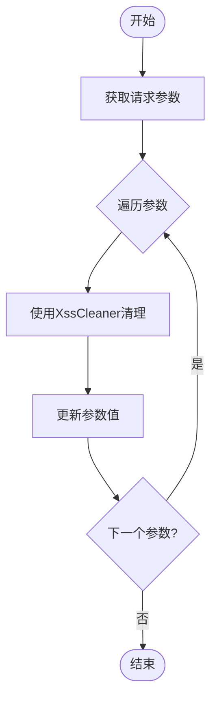
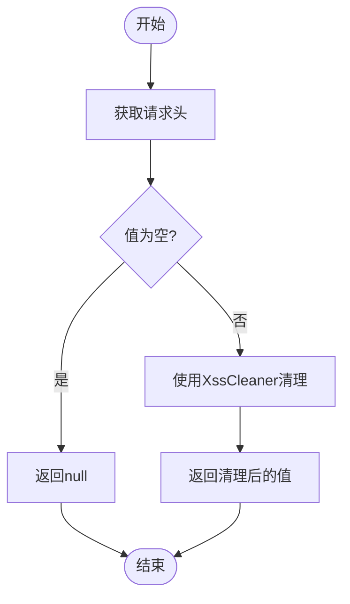
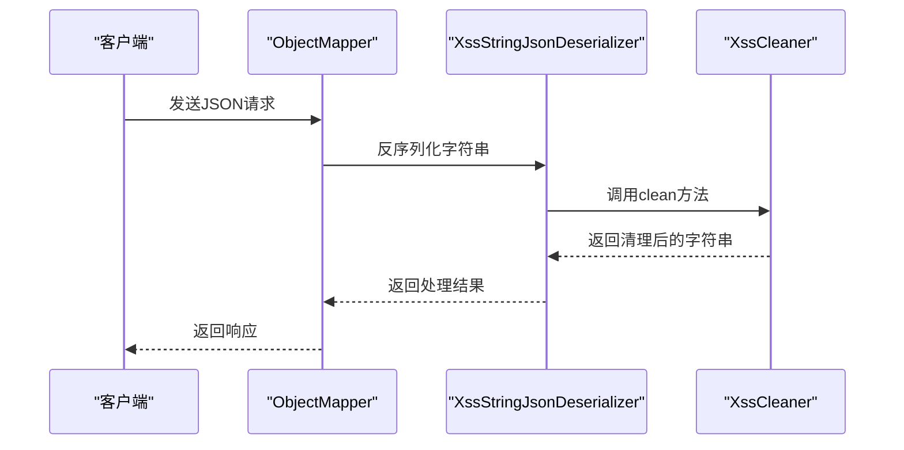
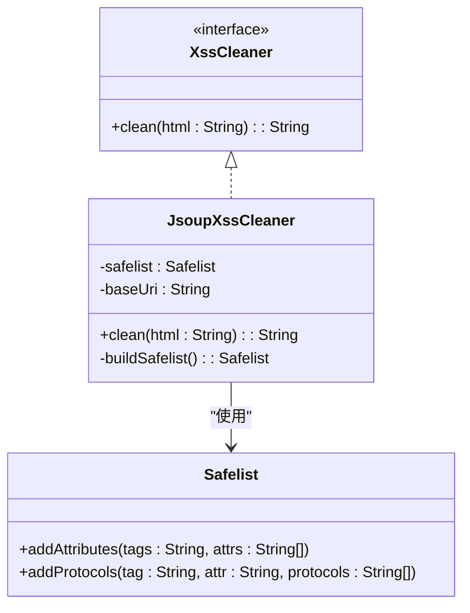
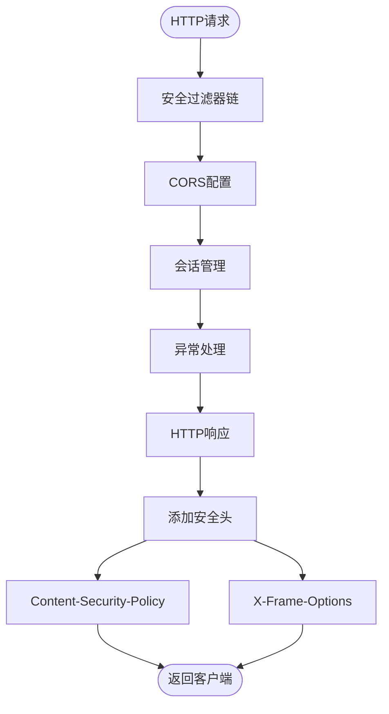
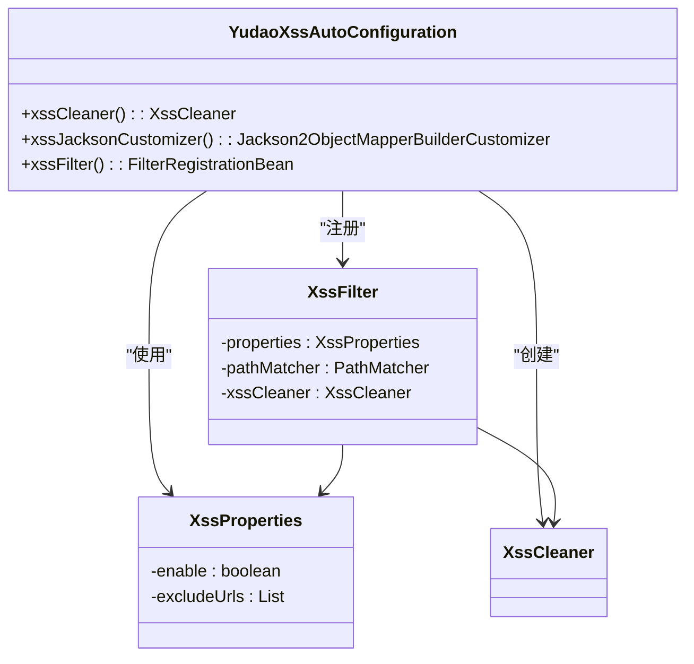

# XSS防护

<cite>
**本文档引用文件**   
- [XssCleaner.java](file://yudao-framework/yudao-spring-boot-starter-web/src/main/java/cn/iocoder/yudao/framework/xss/core/clean/XssCleaner.java)
- [JsoupXssCleaner.java](file://yudao-framework/yudao-spring-boot-starter-web/src/main/java/cn/iocoder/yudao/framework/xss/core/clean/JsoupXssCleaner.java)
- [XssProperties.java](file://yudao-framework/yudao-spring-boot-starter-web/src/main/java/cn/iocoder/yudao/framework/xss/config/XssProperties.java)
- [YudaoXssAutoConfiguration.java](file://yudao-framework/yudao-spring-boot-starter-web/src/main/java/cn/iocoder/yudao/framework/xss/config/YudaoXssAutoConfiguration.java)
- [XssFilter.java](file://yudao-framework/yudao-spring-boot-starter-web/src/main/java/cn/iocoder/yudao/framework/xss/core/filter/XssFilter.java)
- [XssRequestWrapper.java](file://yudao-framework/yudao-spring-boot-starter-web/src/main/java/cn/iocoder/yudao/framework/xss/core/filter/XssRequestWrapper.java)
- [XssStringJsonDeserializer.java](file://yudao-framework/yudao-spring-boot-starter-web/src/main/java/cn/iocoder/yudao/framework/xss/core/json/XssStringJsonDeserializer.java)
- [YudaoWebSecurityConfigurerAdapter.java](file://yudao-framework/yudao-spring-boot-starter-security/src/main/java/cn/iocoder/yudao/framework/security/config/YudaoWebSecurityConfigurerAdapter.java)
- [SecurityProperties.java](file://yudao-framework/yudao-spring-boot-starter-security/src/main/java/cn/iocoder/yudao/framework/security/config/SecurityProperties.java)
</cite>

## 目录
1. [简介](#简介)
2. [输入过滤机制](#输入过滤机制)
3. [输出编码实现](#输出编码实现)
4. [CSP头配置](#csp头配置)
5. [自动配置组件](#自动配置组件)
6. [自定义扩展方法](#自定义扩展方法)
7. [测试用例与安全规范](#测试用例与安全规范)

## 简介
本系统通过多层次的防护机制来防御跨站脚本（XSS）攻击，包括输入过滤、输出编码、内容安全策略（CSP）等。系统基于Jsoup库实现HTML内容的安全清理，并通过Spring Boot自动配置机制集成XSS防护组件。防护机制覆盖请求参数、请求体、请求头等所有输入来源，确保应用的安全性。

## 输入过滤机制

系统通过XssFilter过滤器对所有传入的请求数据进行过滤处理。过滤器会检查请求的各个部分，包括参数、属性、请求头和查询字符串，并对其中可能包含的恶意脚本进行清理。

对于请求参数的过滤，系统重写了getParameterMap方法，遍历所有参数值并进行XSS清理：



**图源**
- [XssRequestWrapper.java](file://yudao-framework/yudao-spring-boot-starter-web/src/main/java/cn/iocoder/yudao/framework/xss/core/filter/XssRequestWrapper.java#L24-L36)

请求头的过滤通过重写getHeader方法实现，对每个请求头的值进行XSS清理：



**图源**
- [XssRequestWrapper.java](file://yudao-framework/yudao-spring-boot-starter-web/src/main/java/cn/iocoder/yudao/framework/xss/core/filter/XssRequestWrapper.java#L73-L80)

**本节源码**
- [XssRequestWrapper.java](file://yudao-framework/yudao-spring-boot-starter-web/src/main/java/cn/iocoder/yudao/framework/xss/core/filter/XssRequestWrapper.java#L15-L92)

## 输出编码实现

系统的输出编码主要通过XssStringJsonDeserializer实现，该组件在JSON反序列化过程中对字符串值进行XSS清理。当Jackson反序列化JSON数据时，会自动调用此解串器处理字符串类型的字段。



**图源**
- [XssStringJsonDeserializer.java](file://yudao-framework/yudao-spring-boot-starter-web/src/main/java/cn/iocoder/yudao/framework/xss/core/json/XssStringJsonDeserializer.java#L25-L57)

XSS清理的具体实现由JsoupXssCleaner完成，它基于Jsoup库的安全白名单机制来过滤HTML内容。清理器构建了一个安全的标签和属性白名单，只允许特定的HTML元素和属性通过。



**图源**
- [JsoupXssCleaner.java](file://yudao-framework/yudao-spring-boot-starter-web/src/main/java/cn/iocoder/yudao/framework/xss/core/clean/JsoupXssCleaner.java#L10-L63)
- [XssCleaner.java](file://yudao-framework/yudao-spring-boot-starter-web/src/main/java/cn/iocoder/yudao/framework/xss/core/clean/XssCleaner.java#L6-L14)

安全白名单的具体配置包括：
- 基于Jsoup的宽松白名单（Safelist.relaxed()）
- 扩展支持style和class属性
- a标签额外支持target属性
- img标签支持data协议（用于base64图片）

**本节源码**
- [XssStringJsonDeserializer.java](file://yudao-framework/yudao-spring-boot-starter-web/src/main/java/cn/iocoder/yudao/framework/xss/core/json/XssStringJsonDeserializer.java#L19-L57)
- [JsoupXssCleaner.java](file://yudao-framework/yudao-spring-boot-starter-web/src/main/java/cn/iocoder/yudao/framework/xss/core/clean/JsoupXssCleaner.java#L36-L55)

## CSP头配置

系统通过Spring Security配置内容安全策略（CSP），在HTTP响应头中添加安全限制。CSP头可以有效防止XSS攻击，通过限制页面可以加载的资源来源。



**图源**
- [YudaoWebSecurityConfigurerAdapter.java](file://yudao-framework/yudao-spring-boot-starter-security/src/main/java/cn/iocoder/yudao/framework/security/config/YudaoWebSecurityConfigurerAdapter.java#L100-L144)

系统配置了以下安全头：
- X-Frame-Options: disable，允许页面被嵌套
- CORS配置：允许所有来源的跨域请求
- 无CSRF保护：基于token机制，不使用session

虽然当前配置中没有显式设置CSP头，但系统架构支持通过Security配置添加CSP策略。建议在生产环境中配置适当的CSP策略，例如：

```
Content-Security-Policy: default-src 'self'; script-src 'self' 'unsafe-inline'; style-src 'self' 'unsafe-inline'; img-src 'self' data:; font-src 'self'; object-src 'none'; frame-ancestors 'none'
```

**本节源码**
- [YudaoWebSecurityConfigurerAdapter.java](file://yudao-framework/yudao-spring-boot-starter-security/src/main/java/cn/iocoder/yudao/framework/security/config/YudaoWebSecurityConfigurerAdapter.java#L100-L144)
- [SecurityProperties.java](file://yudao-framework/yudao-spring-boot-starter-security/src/main/java/cn/iocoder/yudao/framework/security/config/SecurityProperties.java#L1-L51)

## 自动配置组件

系统的XSS防护通过YudaoXssAutoConfiguration自动配置类实现。该类使用Spring Boot的自动配置机制，在应用启动时自动注册必要的XSS防护组件。



**图源**
- [YudaoXssAutoConfiguration.java](file://yudao-framework/yudao-spring-boot-starter-web/src/main/java/cn/iocoder/yudao/framework/xss/config/YudaoXssAutoConfiguration.java#L22-L60)
- [XssFilter.java](file://yudao-framework/yudao-spring-boot-starter-web/src/main/java/cn/iocoder/yudao/framework/xss/core/filter/XssFilter.java#L21-L51)

自动配置的主要组件包括：
1. **XssCleaner Bean**：提供XSS清理服务，默认使用JsoupXssCleaner实现
2. **Jackson反序列化器**：在JSON反序列化时自动进行XSS清理
3. **XssFilter Bean**：注册XSS过滤器，处理所有传入请求

配置类使用了多个Spring条件注解来控制组件的创建：
- @ConditionalOnProperty：当yudao.xss.enable为true时启用
- @ConditionalOnMissingBean：当不存在同类型的Bean时创建
- @ConditionalOnBean：当存在必要Bean时创建

**本节源码**
- [YudaoXssAutoConfiguration.java](file://yudao-framework/yudao-spring-boot-starter-web/src/main/java/cn/iocoder/yudao/framework/xss/config/YudaoXssAutoConfiguration.java#L22-L60)
- [XssProperties.java](file://yudao-framework/yudao-spring-boot-starter-web/src/main/java/cn/iocoder/yudao/framework/xss/config/XssProperties.java#L1-L29)

## 自定义扩展方法

系统提供了灵活的扩展机制，允许开发者根据具体需求自定义XSS防护规则。主要扩展点包括：

### 自定义XSS清理器
开发者可以实现XssCleaner接口，提供自己的清理逻辑：

```java
@Component
public class CustomXssCleaner implements XssCleaner {
    @Override
    public String clean(String html) {
        // 自定义清理逻辑
        return html.replaceAll("<script.*?>.*?</script>", "");
    }
}
```

当系统中存在自定义的XssCleaner Bean时，自动配置将使用该Bean而不是默认的JsoupXssCleaner。

### 扩展安全白名单
可以通过继承JsoupXssCleaner并重写buildSafelist方法来扩展安全白名单：

```java
@Component
public class ExtendedJsoupXssCleaner extends JsoupXssCleaner {
    @Override
    protected Safelist buildSafelist() {
        Safelist safelist = super.buildSafelist();
        // 添加额外允许的标签
        safelist.addTags("iframe");
        // 添加额外允许的属性
        safelist.addAttributes("iframe", "src", "width", "height");
        // 添加额外允许的协议
        safelist.addProtocols("iframe", "src", "https");
        return safelist;
    }
}
```

### 排除特定URL
通过配置文件可以排除特定URL不进行XSS过滤：

```yaml
yudao:
  xss:
    enable: true
    excludeUrls:
      - /api/public/**
      - /webhook/**
```

### 自定义过滤条件
可以通过重写XssFilter的shouldNotFilter方法来实现更复杂的过滤逻辑：

```java
@Component
public class CustomXssFilter extends XssFilter {
    public CustomXssFilter(XssProperties properties, PathMatcher pathMatcher, XssCleaner xssCleaner) {
        super(properties, pathMatcher, xssCleaner);
    }
    
    @Override
    protected boolean shouldNotFilter(HttpServletRequest request) {
        // 自定义过滤条件
        if (isTrustedSource(request)) {
            return true;
        }
        return super.shouldNotFilter(request);
    }
    
    private boolean isTrustedSource(HttpServletRequest request) {
        // 实现可信来源判断逻辑
        return false;
    }
}
```

**本节源码**
- [XssProperties.java](file://yudao-framework/yudao-spring-boot-starter-web/src/main/java/cn/iocoder/yudao/framework/xss/config/XssProperties.java#L1-L29)
- [XssFilter.java](file://yudao-framework/yudao-spring-boot-starter-web/src/main/java/cn/iocoder/yudao/framework/xss/core/filter/XssFilter.java#L40-L51)

## 测试用例与安全规范

### XSS漏洞测试用例

#### 测试HTML标签注入
```javascript
// 测试脚本标签
"<script>alert('xss')</script>"
""
"<svg onload='alert(1)'>"

// 测试事件处理器
"<button onclick='alert(1)'>点击</button>"
"<div onmouseover='alert(1)'>悬停</div>"

// 测试CSS表达式
"<div style='width: expression(alert(1))'>"
```

#### 测试URL编码绕过
```javascript
// 测试JavaScript伪协议
"javascript:alert(1)"
"JaVaScRiPt:alert(1)"
"javascript:alert\u00281\u0029"

// 测试HTML实体编码
"&lt;script&gt;alert(1)&lt;/script&gt;"
"&#60;script&#62;alert(1)&#60;/script&#62;"
```

#### 测试富文本场景
```javascript
// 测试style属性注入
"<div style='background-image:url(javascript:alert(1))'>"
"<p style='color:expression(alert(1))'>文本</p>"

// 测试data协议
""
```

### 安全编码规范

#### 输入验证规范
1. **始终验证所有输入**：包括请求参数、请求体、请求头、Cookie等
2. **使用白名单验证**：只允许已知安全的字符和模式
3. **限制输入长度**：防止缓冲区溢出攻击
4. **验证数据类型**：确保输入符合预期的数据类型

#### 输出编码规范
1. **上下文相关编码**：
   - HTML上下文：使用HTML实体编码
   - JavaScript上下文：使用JavaScript转义
   - URL上下文：使用URL编码
   - CSS上下文：使用CSS转义

2. **避免动态拼接**：
   ```java
   // 错误做法
   String html = "<div>" + userInput + "</div>";
   
   // 正确做法
   String html = "<div>" + HtmlUtils.htmlEscape(userInput) + "</div>";
   ```

#### 前端安全规范
1. **避免使用innerHTML**：
   ```javascript
   // 错误做法
   element.innerHTML = userInput;
   
   // 正确做法
   element.textContent = userInput;
   ```

2. **使用安全的DOM操作**：
   ```javascript
   // 创建元素而不是直接插入HTML
   const div = document.createElement('div');
   div.textContent = userInput;
   parent.appendChild(div);
   ```

3. **避免eval和Function构造函数**：
   ```javascript
   // 错误做法
   eval(userInput);
   new Function(userInput);
   
   // 正确做法
   // 使用JSON.parse处理JSON数据
   JSON.parse(safeJsonString);
   ```

#### CSP最佳实践
1. **设置严格的CSP策略**：
   ```
   Content-Security-Policy: default-src 'self'; script-src 'self'; style-src 'self' 'unsafe-inline'; img-src 'self' data:; font-src 'self'; object-src 'none'; frame-ancestors 'none'
   ```

2. **使用report-uri报告违规**：
   ```
   Content-Security-Policy: default-src 'self'; report-uri /csp-report
   ```

3. **逐步收紧策略**：先使用report-only模式收集数据，再实施严格策略

**本节源码**
- [XssRequestWrapper.java](file://yudao-framework/yudao-spring-boot-starter-web/src/main/java/cn/iocoder/yudao/framework/xss/core/filter/XssRequestWrapper.java#L15-L92)
- [XssStringJsonDeserializer.java](file://yudao-framework/yudao-spring-boot-starter-web/src/main/java/cn/iocoder/yudao/framework/xss/core/json/XssStringJsonDeserializer.java#L19-L57)