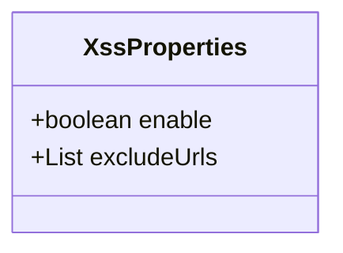
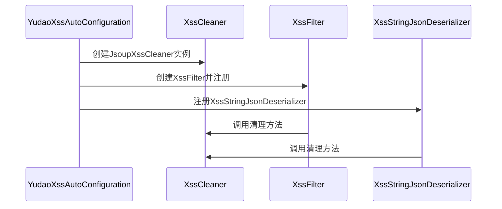
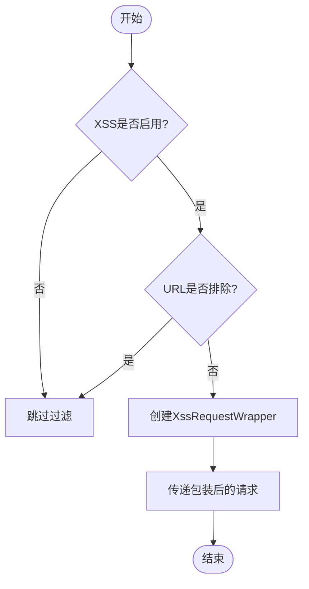
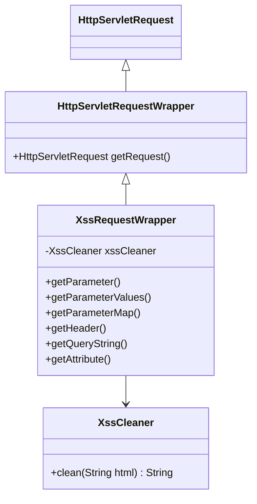
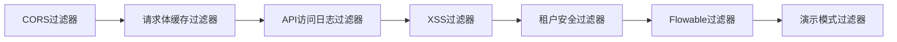
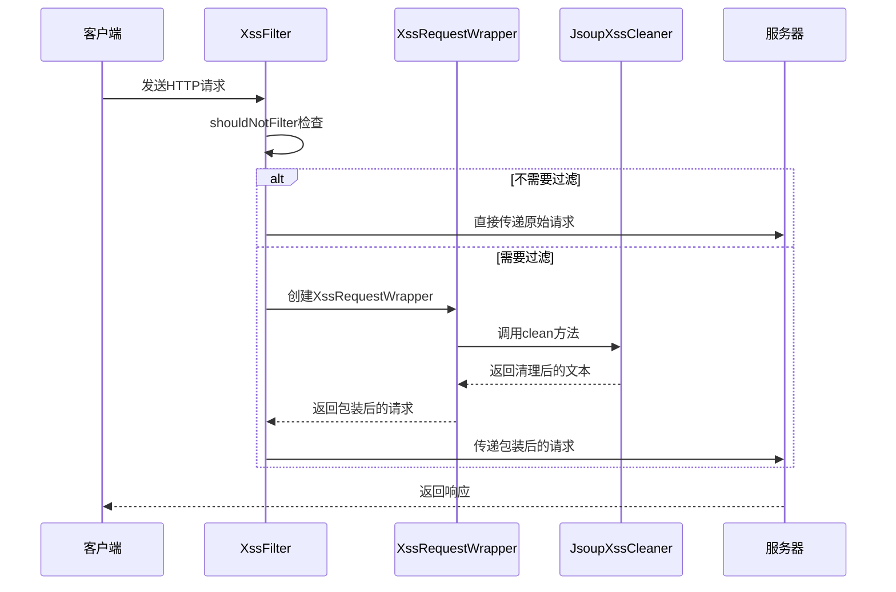
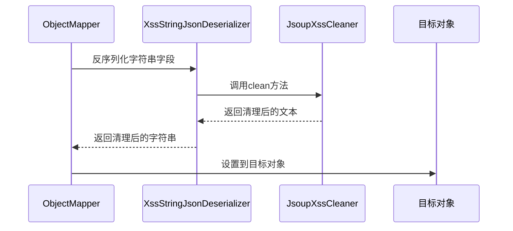

# 输入过滤

<cite>
**本文档引用的文件**   
- [XssProperties.java](file://yudao-framework/yudao-spring-boot-starter-web/src/main/java/cn/iocoder/yudao/framework/xss/config/XssProperties.java)
- [YudaoXssAutoConfiguration.java](file://yudao-framework/yudao-spring-boot-starter-web/src/main/java/cn/iocoder/yudao/framework/xss/config/YudaoXssAutoConfiguration.java)
- [XssFilter.java](file://yudao-framework/yudao-spring-boot-starter-web/src/main/java/cn/iocoder/yudao/framework/xss/core/filter/XssFilter.java)
- [XssRequestWrapper.java](file://yudao-framework/yudao-spring-boot-starter-web/src/main/java/cn/iocoder/yudao/framework/xss/core/filter/XssRequestWrapper.java)
- [JsoupXssCleaner.java](file://yudao-framework/yudao-spring-boot-starter-web/src/main/java/cn/iocoder/yudao/framework/xss/core/clean/JsoupXssCleaner.java)
- [XssStringJsonDeserializer.java](file://yudao-framework/yudao-spring-boot-starter-web/src/main/java/cn/iocoder/yudao/framework/xss/core/json/XssStringJsonDeserializer.java)
- [WebFilterOrderEnum.java](file://yudao-framework/yudao-common/src/main/java/cn/iocoder/yudao/framework/common/enums/WebFilterOrderEnum.java)
</cite>

## 目录
1. [输入过滤机制概述](#输入过滤机制概述)
2. [XSS防护配置与实现](#xss防护配置与实现)
3. [请求数据过滤策略](#请求数据过滤策略)
4. [过滤规则配置方法](#过滤规则配置方法)
5. [过滤器执行流程](#过滤器执行流程)
6. [WebProperties配置自定义](#webproperties配置自定义)
7. [测试与防范措施](#测试与防范措施)

## 输入过滤机制概述

系统通过YudaoXssAutoConfiguration配置的XSS防护机制，全面拦截和净化HTTP请求中的潜在恶意脚本代码。该机制采用多层过滤策略，覆盖请求参数、请求体和请求头等所有输入渠道，有效防止跨站脚本攻击（XSS）。

**Section sources**
- [YudaoXssAutoConfiguration.java](file://yudao-framework/yudao-spring-boot-starter-web/src/main/java/cn/iocoder/yudao/framework/xss/config/YudaoXssAutoConfiguration.java)
- [XssProperties.java](file://yudao-framework/yudao-spring-boot-starter-web/src/main/java/cn/iocoder/yudao/framework/xss/config/XssProperties.java)

## XSS防护配置与实现

### 配置属性

系统通过XssProperties类定义XSS防护的配置属性，主要包含两个关键配置项：

- **enable**: 是否开启XSS过滤功能，默认为true
- **excludeUrls**: 需要排除过滤的URL列表，默认为空



**Diagram sources**
- [XssProperties.java](file://yudao-framework/yudao-spring-boot-starter-web/src/main/java/cn/iocoder/yudao/framework/xss/config/XssProperties.java)

### 自动配置机制

YudaoXssAutoConfiguration作为自动配置类，负责初始化XSS防护组件：

1. 当`yudao.xss.enable`配置为true（默认值）时，自动启用XSS过滤
2. 创建XssCleaner清理器实例，用于实际的XSS清理工作
3. 注册Jackson反序列化器，处理JSON类型参数的XSS过滤
4. 创建XssFilter过滤器，解决XSS安全问题



**Diagram sources**
- [YudaoXssAutoConfiguration.java](file://yudao-framework/yudao-spring-boot-starter-web/src/main/java/cn/iocoder/yudao/framework/xss/config/YudaoXssAutoConfiguration.java)
- [XssFilter.java](file://yudao-framework/yudao-spring-boot-starter-web/src/main/java/cn/iocoder/yudao/framework/xss/core/filter/XssFilter.java)
- [XssStringJsonDeserializer.java](file://yudao-framework/yudao-spring-boot-starter-web/src/main/java/cn/iocoder/yudao/framework/xss/core/json/XssStringJsonDeserializer.java)

**Section sources**
- [YudaoXssAutoConfiguration.java](file://yudao-framework/yudao-spring-boot-starter-web/src/main/java/cn/iocoder/yudao/framework/xss/config/YudaoXssAutoConfiguration.java)

## 请求数据过滤策略

### 过滤器执行流程

XssFilter作为核心过滤器，通过继承OncePerRequestFilter确保每个请求只被过滤一次。其执行流程如下：

1. 首先检查是否需要过滤：如果XSS功能被关闭或请求URL在排除列表中，则跳过过滤
2. 创建XssRequestWrapper包装原始请求
3. 将包装后的请求传递给过滤链



**Diagram sources**
- [XssFilter.java](file://yudao-framework/yudao-spring-boot-starter-web/src/main/java/cn/iocoder/yudao/framework/xss/core/filter/XssFilter.java)

### 请求包装器实现

XssRequestWrapper继承自HttpServletRequestWrapper，重写了多个方法以实现对不同类型请求数据的过滤：



**Diagram sources**
- [XssRequestWrapper.java](file://yudao-framework/yudao-spring-boot-starter-web/src/main/java/cn/iocoder/yudao/framework/xss/core/filter/XssRequestWrapper.java)
- [XssCleaner.java](file://yudao-framework/yudao-spring-boot-starter-web/src/main/java/cn/iocoder/yudao/framework/xss/core/clean/XssCleaner.java)

### 具体过滤范围

#### 请求参数过滤

对GET和POST请求的参数进行过滤，覆盖以下方法：
- getParameter(String name)
- getParameterValues(String name)
- getParameterMap()

#### 请求头过滤

对HTTP请求头进行过滤：
- getHeader(String name)

#### 查询字符串过滤

对URL查询字符串进行过滤：
- getQueryString()

#### 属性过滤

对请求属性进行过滤：
- getAttribute(String name)

**Section sources**
- [XssRequestWrapper.java](file://yudao-framework/yudao-spring-boot-starter-web/src/main/java/cn/iocoder/yudao/framework/xss/core/filter/XssRequestWrapper.java)

## 过滤规则配置方法

### HTML标签白名单

系统使用JsoupXssCleaner实现XSS清理，基于Safelist机制构建HTML标签和属性白名单：

- 基础规则：继承Safelist.relaxed()的宽松规则
- 扩展规则：
  - 为所有标签添加style和class属性支持
  - 为a标签添加target属性支持
  - 为img标签添加data协议支持（用于base64图片）

```mermaid
flowchart TD
Start([开始]) --> UseRelaxed[使用Safelist.relaxed()]
UseRelaxed --> AddStyle[添加style属性]
UseRelaxed --> AddClass[添加class属性]
UseRelaxed --> AddTarget[为a标签添加target属性]
UseRelaxed --> AddDataProtocol[为img标签添加data协议]
AddStyle --> CombineRules[组合所有规则]
AddClass --> CombineRules
AddTarget --> CombineRules
AddDataProtocol --> CombineRules
CombineRules --> CreateSafelist[创建最终Safelist]
CreateSafelist --> End([结束])
```

**Diagram sources**
- [JsoupXssCleaner.java](file://yudao-framework/yudao-spring-boot-starter-web/src/main/java/cn/iocoder/yudao/framework/xss/core/clean/JsoupXssCleaner.java)

### 过滤器顺序配置

通过WebFilterOrderEnum定义过滤器执行顺序，确保XSS过滤器在正确的位置执行：

- CORS_FILTER: Integer.MIN_VALUE
- REQUEST_BODY_CACHE_FILTER: Integer.MIN_VALUE + 500
- API_ACCESS_LOG_FILTER: -103
- **XSS_FILTER: -102**
- TENANT_SECURITY_FILTER: -99
- FLOWABLE_FILTER: -98
- DEMO_FILTER: Integer.MAX_VALUE



**Diagram sources**
- [WebFilterOrderEnum.java](file://yudao-framework/yudao-common/src/main/java/cn/iocoder/yudao/framework/common/enums/WebFilterOrderEnum.java)

**Section sources**
- [JsoupXssCleaner.java](file://yudao-framework/yudao-spring-boot-starter-web/src/main/java/cn/iocoder/yudao/framework/xss/core/clean/JsoupXssCleaner.java)
- [WebFilterOrderEnum.java](file://yudao-framework/yudao-common/src/main/java/cn/iocoder/yudao/framework/common/enums/WebFilterOrderEnum.java)

## 过滤器执行流程

### 整体执行流程



**Diagram sources**
- [XssFilter.java](file://yudao-framework/yudao-spring-boot-starter-web/src/main/java/cn/iocoder/yudao/framework/xss/core/filter/XssFilter.java)
- [XssRequestWrapper.java](file://yudao-framework/yudao-spring-boot-starter-web/src/main/java/cn/iocoder/yudao/framework/xss/core/filter/XssRequestWrapper.java)
- [JsoupXssCleaner.java](file://yudao-framework/yudao-spring-boot-starter-web/src/main/java/cn/iocoder/yudao/framework/xss/core/clean/JsoupXssCleaner.java)

### JSON反序列化过滤

对于JSON格式的请求体，系统通过XssStringJsonDeserializer在反序列化过程中进行XSS过滤：



**Diagram sources**
- [XssStringJsonDeserializer.java](file://yudao-framework/yudao-spring-boot-starter-web/src/main/java/cn/iocoder/yudao/framework/xss/core/json/XssStringJsonDeserializer.java)

**Section sources**
- [XssFilter.java](file://yudao-framework/yudao-spring-boot-starter-web/src/main/java/cn/iocoder/yudao/framework/xss/core/filter/XssFilter.java)
- [XssRequestWrapper.java](file://yudao-framework/yudao-spring-boot-starter-web/src/main/java/cn/iocoder/yudao/framework/xss/core/filter/XssRequestWrapper.java)
- [JsoupXssCleaner.java](file://yudao-framework/yudao-spring-boot-starter-web/src/main/java/cn/iocoder/yudao/framework/xss/core/clean/JsoupXssCleaner.java)
- [XssStringJsonDeserializer.java](file://yudao-framework/yudao-spring-boot-starter-web/src/main/java/cn/iocoder/yudao/framework/xss/core/json/XssStringJsonDeserializer.java)

## WebProperties配置自定义

虽然当前代码中未直接体现WebProperties对XSS过滤的配置，但系统设计遵循Spring Boot的配置惯例，可以通过application.yml或application.properties文件进行配置：

```yaml
yudao:
  xss:
    enable: true
    excludeUrls:
      - /api/public/**
      - /static/**
```

或

```properties
yudao.xss.enable=true
yudao.xss.excludeUrls=/api/public/**,/static/**
```

这种配置方式允许开发者灵活地启用/禁用XSS过滤功能，并指定不需要过滤的URL路径模式。

**Section sources**
- [XssProperties.java](file://yudao-framework/yudao-spring-boot-starter-web/src/main/java/cn/iocoder/yudao/framework/xss/config/XssProperties.java)

## 测试与防范措施

### 测试输入过滤有效性

开发者可以通过以下方法测试输入过滤的有效性：

1. **构造测试用例**：创建包含典型XSS攻击载荷的请求
   - `<script>alert('xss')</script>`
   - ``
   - `javascript:alert('xss')`

2. **验证过滤结果**：检查响应中是否已移除或转义恶意代码

3. **使用自动化测试**：编写单元测试和集成测试验证过滤功能

### 常见绕过技术防范

系统通过以下措施防范常见的XSS绕过技术：

1. **多层过滤**：同时过滤请求参数、请求头和请求体
2. **白名单机制**：基于Safelist的白名单策略，只允许安全的HTML标签和属性
3. **统一清理**：使用Jsoup的clean方法进行标准化清理
4. **JSON特殊处理**：在反序列化时进行XSS过滤，防止JSON注入

### 最佳实践建议

1. **保持默认配置**：除非有特殊需求，建议保持XSS过滤功能开启
2. **谨慎设置排除URL**：避免将用户可访问的敏感接口排除在过滤之外
3. **定期更新依赖**：及时更新jsoup等安全相关依赖库
4. **结合其他安全措施**：与CSP（内容安全策略）、输入验证等其他安全措施结合使用

**Section sources**
- [JsoupXssCleaner.java](file://yudao-framework/yudao-spring-boot-starter-web/src/main/java/cn/iocoder/yudao/framework/xss/core/clean/JsoupXssCleaner.java)
- [XssFilter.java](file://yudao-framework/yudao-spring-boot-starter-web/src/main/java/cn/iocoder/yudao/framework/xss/core/filter/XssFilter.java)