# 安全日志与监控

<cite>
**本文档引用的文件**  
- [AdminServerConfiguration.java](file://yudao-module-infra/yudao-module-infra-biz/src/main/java/cn/iocoder/yudao/module/infra/framework/monitor/config/AdminServerConfiguration.java)
- [logback-spring.xml](file://yudao-server/src/main/resources/logback-spring.xml)
- [OperateLogApi.java](file://yudao-module-system/yudao-module-system-api/src/main/java/cn/iocoder/yudao/module/system/api/logger/OperateLogApi.java)
- [OperateLogMapper.java](file://yudao-module-system/yudao-module-system-biz/src/main/java/cn/iocoder/yudao/module/system/dal/mysql/logger/OperateLogMapper.java)
- [OperateLogService.java](file://yudao-module-system/yudao-module-system-biz/src/main/java/cn/iocoder/yudao/module/system/service/logger/OperateLogService.java)
- [OperateLogServiceImpl.java](file://yudao-module-system/yudao-module-system-biz/src/main/java/cn/iocoder/yudao/module/system/service/logger/OperateLogServiceImpl.java)
- [ApiErrorLogApiImpl.java](file://yudao-module-infra/yudao-module-infra-biz/src/main/java/cn/iocoder/yudao/module/infra/api/logger/ApiErrorLogApiImpl.java)
- [ApiErrorLogService.java](file://yudao-module-infra/yudao-module-infra-biz/src/main/java/cn/iocoder/yudao/module/infra/service/logger/ApiErrorLogService.java)
- [ApiErrorLogServiceImpl.java](file://yudao-module-infra/yudao-module-infra-biz/src/main/java/cn/iocoder/yudao/module/infra/service/logger/ApiErrorLogServiceImpl.java)
- [ApiAccessLogApiImpl.java](file://yudao-module-infra/yudao-module-infra-biz/src/main/java/cn/iocoder/yudao/module/infra/api/logger/ApiAccessLogApiImpl.java)
- [ApiAccessLogService.java](file://yudao-module-infra/yudao-module-infra-biz/src/main/java/cn/iocoder/yudao/module/infra/service/logger/ApiAccessLogService.java)
- [ApiAccessLogServiceImpl.java](file://yudao-module-infra/yudao-module-infra-biz/src/main/java/cn/iocoder/yudao/module/infra/service/logger/ApiAccessLogServiceImpl.java)
- [LoginLogServiceImpl.java](file://yudao-module-system/yudao-module-system-biz/src/main/java/cn/iocoder/yudao/module/system/service/logger/LoginLogServiceImpl.java)
- [LoginResultEnum.java](file://yudao-module-system/yudao-module-system-api/src/main/java/cn/iocoder/yudao/module/system/enums/logger/LoginResultEnum.java)
- [AccessLogCleanJob.java](file://yudao-module-infra/yudao-module-infra-biz/src/main/java/cn/iocoder/yudao/module/infra/job/logger/AccessLogCleanJob.java)
- [mysql_backup.sh](file://mysql_backup_system/mysql_backup.sh)
- [YudaoTracerAutoConfiguration.java](file://yudao-framework/yudao-spring-boot-starter-monitor/src/main/java/cn/iocoder/yudao/framework/tracer/config/YudaoTracerAutoConfiguration.java)
- [TracerUtils.java](file://yudao-framework/yudao-common/src/main/java/cn/iocoder/yudao/framework/common/util/monitor/TracerUtils.java)
</cite>

## 目录
1. [简介](#简介)
2. [日志类型与记录机制](#日志类型与记录机制)
3. [日志存储与轮转策略](#日志存储与轮转策略)
4. [监控告警配置](#监控告警配置)
5. [日志审计与合规性](#日志审计与合规性)
6. [日志分析工具集成](#日志分析工具集成)
7. [日志取证与事件响应](#日志取证与事件响应)
8. [总结](#总结)

## 简介

本系统构建了全面的安全日志与监控体系，涵盖登录日志、操作日志、异常日志等多种日志类型，通过SkyWalking、Spring Boot Admin等监控平台实现系统运行状态的实时监控。系统采用Logback作为日志框架，结合异步写入和日志轮转策略，确保日志记录的高效性和可靠性。同时，系统实现了完善的日志审计机制，满足合规性要求，并为安全团队提供了日志取证和事件响应的实践指南。

## 日志类型与记录机制

系统实现了多种安全日志的记录机制，包括登录日志、操作日志和异常日志，每种日志都有明确的记录内容和存储方式。

### 登录日志

登录日志记录了用户的所有登录尝试，包括成功和失败的登录。系统通过`LoginLogServiceImpl`类实现登录日志的创建和查询功能。登录日志包含用户ID、登录时间、登录IP、登录结果等信息。登录结果通过`LoginResultEnum`枚举类定义，包括成功、账号或密码不正确、用户被禁用等多种状态。

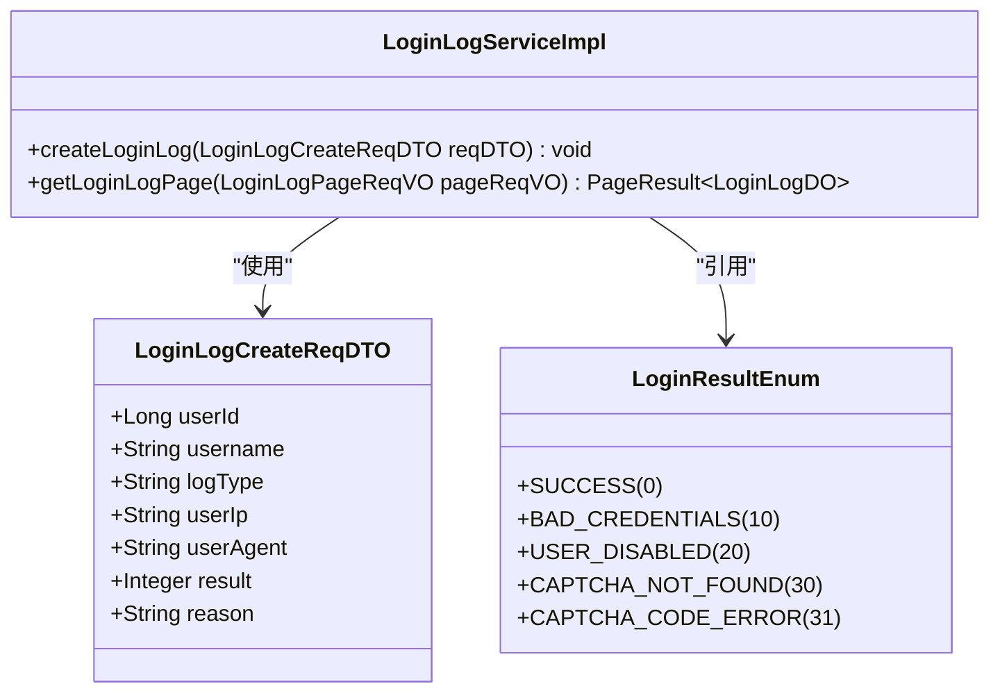

**图示来源**
- [LoginLogServiceImpl.java](file://yudao-module-system/yudao-module-system-biz/src/main/java/cn/iocoder/yudao/module/system/service/logger/LoginLogServiceImpl.java)
- [LoginResultEnum.java](file://yudao-module-system/yudao-module-system-api/src/main/java/cn/iocoder/yudao/module/system/enums/logger/LoginResultEnum.java)

**本节来源**
- [LoginLogServiceImpl.java](file://yudao-module-system/yudao-module-system-biz/src/main/java/cn/iocoder/yudao/module/system/service/logger/LoginLogServiceImpl.java)
- [LoginResultEnum.java](file://yudao-module-system/yudao-module-system-api/src/main/java/cn/iocoder/yudao/module/system/enums/logger/LoginResultEnum.java)

### 操作日志

操作日志记录了用户在系统中的所有操作行为，是审计和追踪用户活动的重要依据。系统通过`OperateLogService`接口和`OperateLogServiceImpl`实现类提供操作日志的创建、查询和批量创建功能。操作日志包含操作模块、操作类型、操作人员、操作时间、操作结果等详细信息。

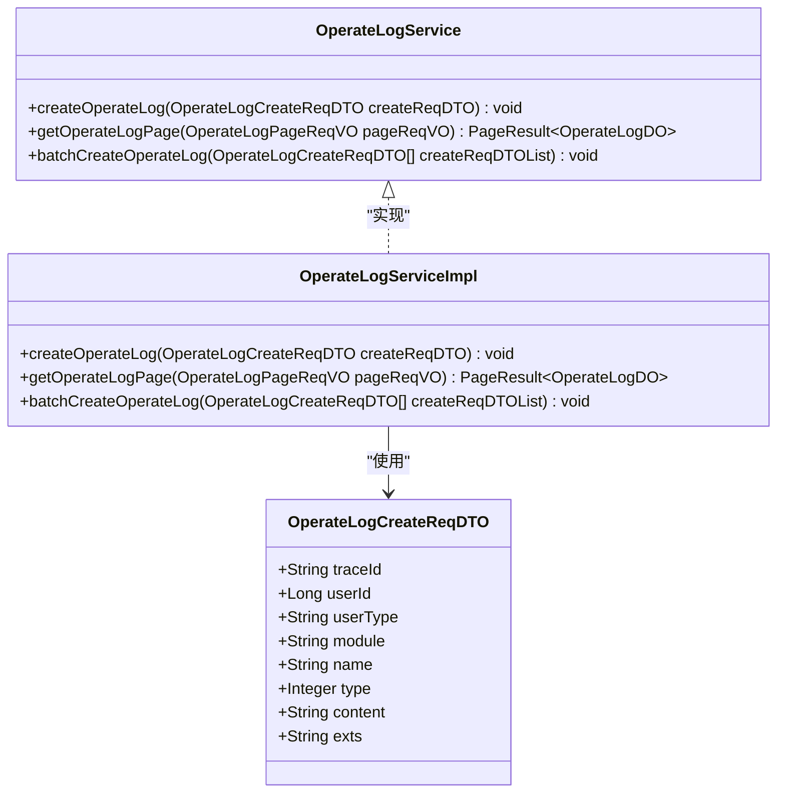

**图示来源**
- [OperateLogService.java](file://yudao-module-system/yudao-module-system-biz/src/main/java/cn/iocoder/yudao/module/system/service/logger/OperateLogService.java)
- [OperateLogServiceImpl.java](file://yudao-module-system/yudao-module-system-biz/src/main/java/cn/iocoder/yudao/module/system/service/logger/OperateLogServiceImpl.java)

**本节来源**
- [OperateLogService.java](file://yudao-module-system/yudao-module-system-biz/src/main/java/cn/iocoder/yudao/module/system/service/logger/OperateLogService.java)
- [OperateLogServiceImpl.java](file://yudao-module-system/yudao-module-system-biz/src/main/java/cn/iocoder/yudao/module/system/service/logger/OperateLogServiceImpl.java)

### 异常日志

异常日志记录了系统运行过程中发生的错误和异常，是故障排查和系统优化的重要依据。系统通过`ApiErrorLogService`接口和`ApiErrorLogServiceImpl`实现类提供异常日志的创建、查询和处理功能。异常日志包含请求URL、请求方法、用户信息、异常信息、处理状态等关键信息。

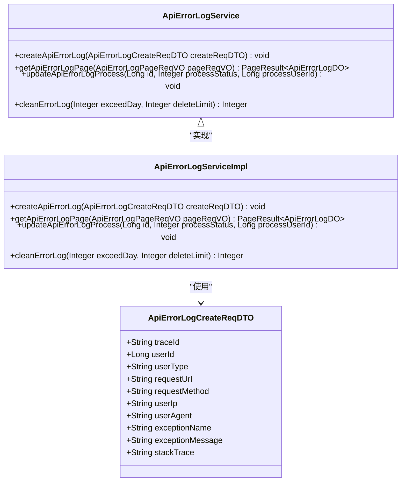

**图示来源**
- [ApiErrorLogService.java](file://yudao-module-infra/yudao-module-infra-biz/src/main/java/cn/iocoder/yudao/module/infra/service/logger/ApiErrorLogService.java)
- [ApiErrorLogServiceImpl.java](file://yudao-module-infra/yudao-module-infra-biz/src/main/java/cn/iocoder/yudao/module/infra/service/logger/ApiErrorLogServiceImpl.java)

**本节来源**
- [ApiErrorLogService.java](file://yudao-module-infra/yudao-module-infra-biz/src/main/java/cn/iocoder/yudao/module/infra/service/logger/ApiErrorLogService.java)
- [ApiErrorLogServiceImpl.java](file://yudao-module-infra/yudao-module-infra-biz/src/main/java/cn/iocoder/yudao/module/infra/service/logger/ApiErrorLogServiceImpl.java)

## 日志存储与轮转策略

系统采用Logback作为日志框架，通过`logback-spring.xml`配置文件定义了详细的日志存储和轮转策略。

### 日志级别配置

系统支持多种日志级别，包括TRACE、DEBUG、INFO、WARN、ERROR等。在不同环境下，日志级别有不同的配置。在本地开发环境中，日志级别设置为INFO，仅输出到控制台；在其他环境（开发、测试、生产）中，日志级别同样设置为INFO，但同时输出到控制台和异步文件Appender。

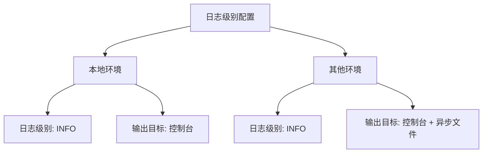

**本节来源**
- [logback-spring.xml](file://yudao-server/src/main/resources/logback-spring.xml)

### 日志轮转策略

系统采用基于时间和大小的滚动策略（SizeAndTimeBasedRollingPolicy）进行日志轮转。当日志文件达到指定大小（默认10MB）或时间周期（每天）时，会创建新的日志文件。旧的日志文件会被压缩为.gz格式，并保留最多30天的历史日志文件。

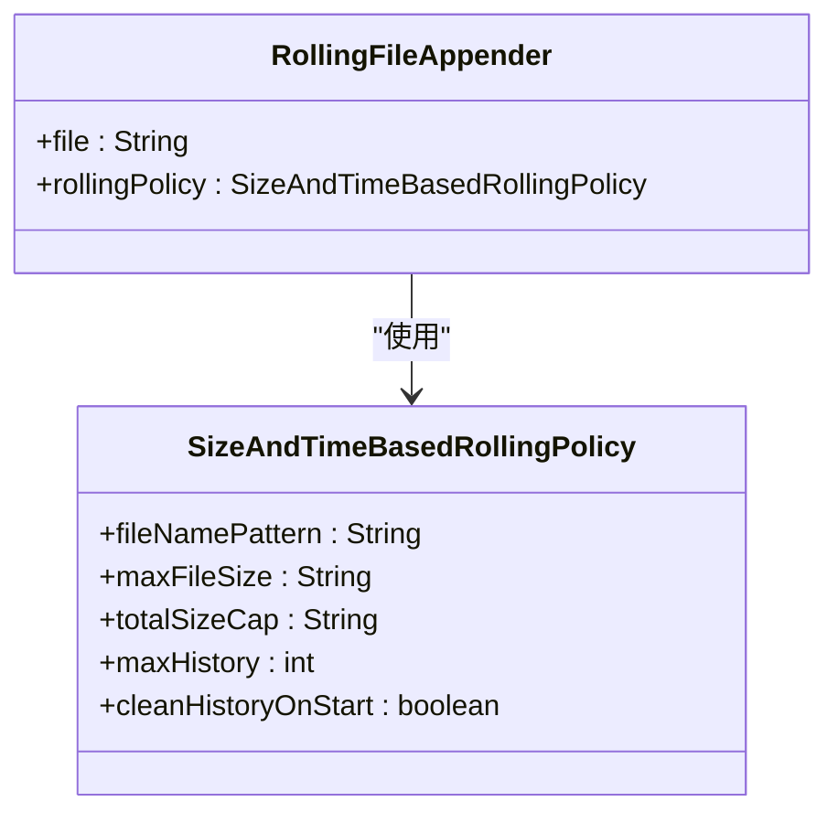

**图示来源**
- [logback-spring.xml](file://yudao-server/src/main/resources/logback-spring.xml)

**本节来源**
- [logback-spring.xml](file://yudao-server/src/main/resources/logback-spring.xml)

### 异步日志写入

为了提升系统性能，系统采用异步方式写入日志。通过`AsyncAppender`将日志写入操作放入队列中，由单独的线程处理，避免了同步写入日志对主线程的阻塞。异步队列的大小设置为256，且不丢弃任何级别的日志。

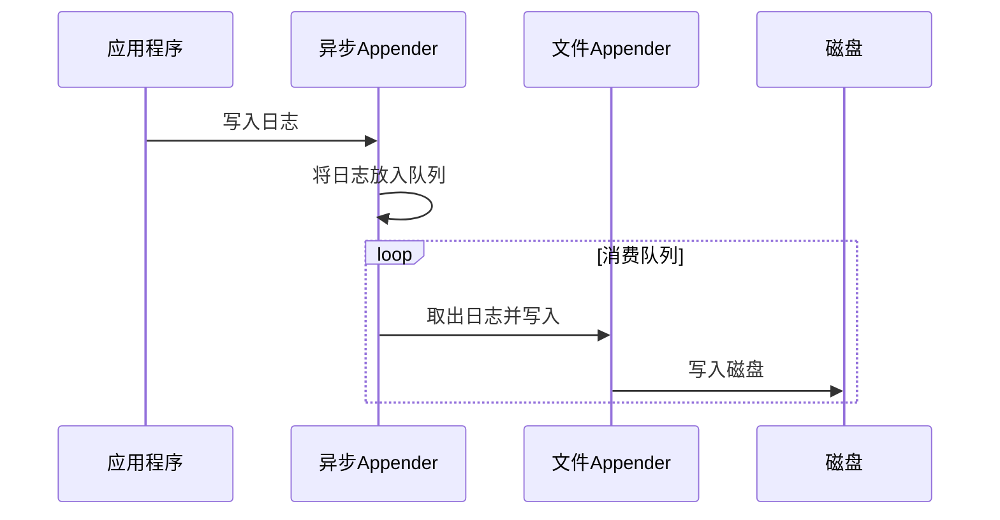

**图示来源**
- [logback-spring.xml](file://yudao-server/src/main/resources/logback-spring.xml)

**本节来源**
- [logback-spring.xml](file://yudao-server/src/main/resources/logback-spring.xml)

## 监控告警配置

系统集成了多种监控工具，包括SkyWalking、Spring Boot Admin等，实现了全面的系统监控和告警功能。

### 监控平台集成

系统通过`AdminServerConfiguration`类启用Spring Boot Admin Server功能，实现了对应用的集中监控。同时，系统集成了SkyWalking，用于分布式系统的链路追踪和性能监控。在数据库中，`system_menu`表定义了"监控平台"菜单项，指向SkyWalking的监控界面。

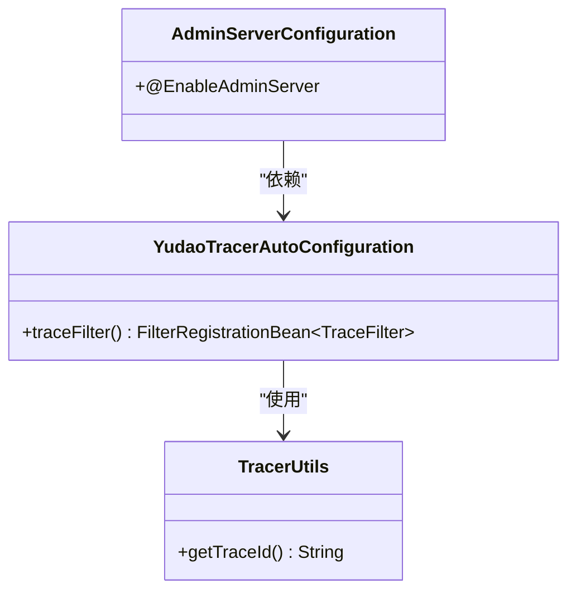

**图示来源**
- [AdminServerConfiguration.java](file://yudao-module-infra/yudao-module-infra-biz/src/main/java/cn/iocoder/yudao/module/infra/framework/monitor/config/AdminServerConfiguration.java)
- [YudaoTracerAutoConfiguration.java](file://yudao-framework/yudao-spring-boot-starter-monitor/src/main/java/cn/iocoder/yudao/framework/tracer/config/YudaoTracerAutoConfiguration.java)
- [TracerUtils.java](file://yudao-framework/yudao-common/src/main/java/cn/iocoder/yudao/framework/common/util/monitor/TracerUtils.java)

**本节来源**
- [AdminServerConfiguration.java](file://yudao-module-infra/yudao-module-infra-biz/src/main/java/cn/iocoder/yudao/module/infra/framework/monitor/config/AdminServerConfiguration.java)
- [ruoyi-vue-pro.sql](file://sql/mysql/ruoyi-vue-pro.sql)

### 安全事件监控

系统实现了对异常登录、频繁失败尝试等安全事件的监控。通过分析登录日志，可以识别出多次登录失败的IP地址和用户账号，及时发现潜在的暴力破解攻击。系统还记录了用户的登录IP和UserAgent信息，有助于识别异常登录行为。

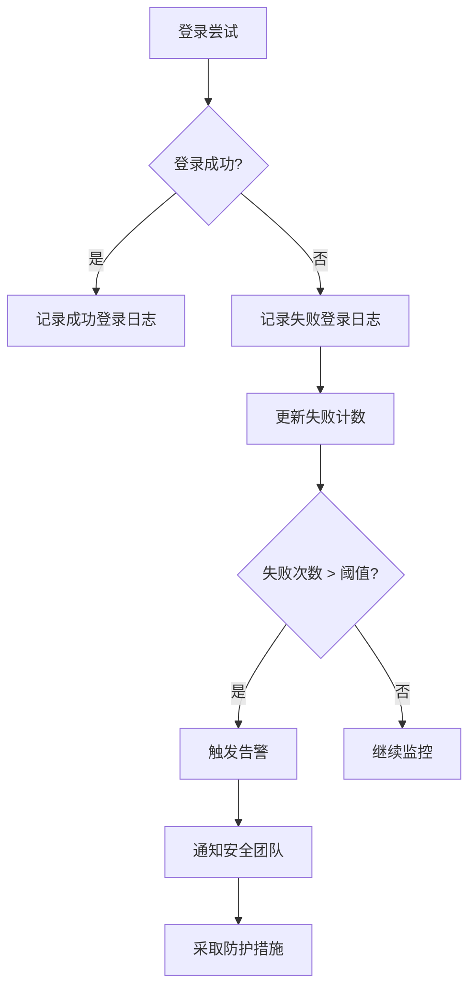

**本节来源**
- [LoginLogServiceImpl.java](file://yudao-module-system/yudao-module-system-biz/src/main/java/cn/iocoder/yudao/module/system/service/logger/LoginLogServiceImpl.java)
- [LoginResultEnum.java](file://yudao-module-system/yudao-module-system-api/src/main/java/cn/iocoder/yudao/module/system/enums/logger/LoginResultEnum.java)

## 日志审计与合规性

系统实现了完善的日志审计机制，确保日志数据的完整性和可追溯性，满足合规性要求。

### 日志审计实现

系统通过操作日志和访问日志实现全面的审计功能。所有用户的关键操作都会被记录，包括操作内容、操作时间、操作人员等信息。系统还支持根据链路追踪ID查询相关的操作日志，便于问题排查和审计追踪。

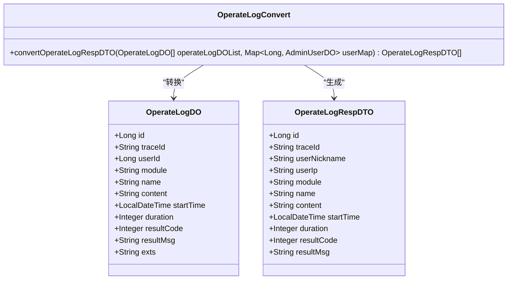

**图示来源**
- [OperateLogServiceImpl.java](file://yudao-module-system/yudao-module-system-biz/src/main/java/cn/iocoder/yudao/module/system/service/logger/OperateLogServiceImpl.java)
- [OperateLogConvert.java](file://yudao-module-system/yudao-module-system-biz/src/main/java/cn/iocoder/yudao/module/system/convert/logger/OperateLogConvert.java)

**本节来源**
- [OperateLogServiceImpl.java](file://yudao-module-system/yudao-module-system-biz/src/main/java/cn/iocoder/yudao/module/system/service/logger/OperateLogServiceImpl.java)

### 合规性要求

系统日志设计遵循了多项合规性要求，包括日志的完整性、不可篡改性、可追溯性等。所有日志记录都包含时间戳、用户信息、操作内容等关键字段，确保审计的完整性。系统还实现了日志清理机制，定期清理过期日志，既满足存储要求，又符合数据保留政策。

## 日志分析工具集成

系统集成了多种日志分析工具，提高了日志分析的效率和准确性。

### SkyWalking集成

系统通过`YudaoTracerAutoConfiguration`类配置了SkyWalking的集成，实现了分布式链路追踪功能。通过`TraceFilter`过滤器，在HTTP响应头中添加链路追踪ID，便于跨服务的请求追踪。`TracerUtils`工具类提供了获取当前链路追踪ID的静态方法，方便在业务代码中使用。

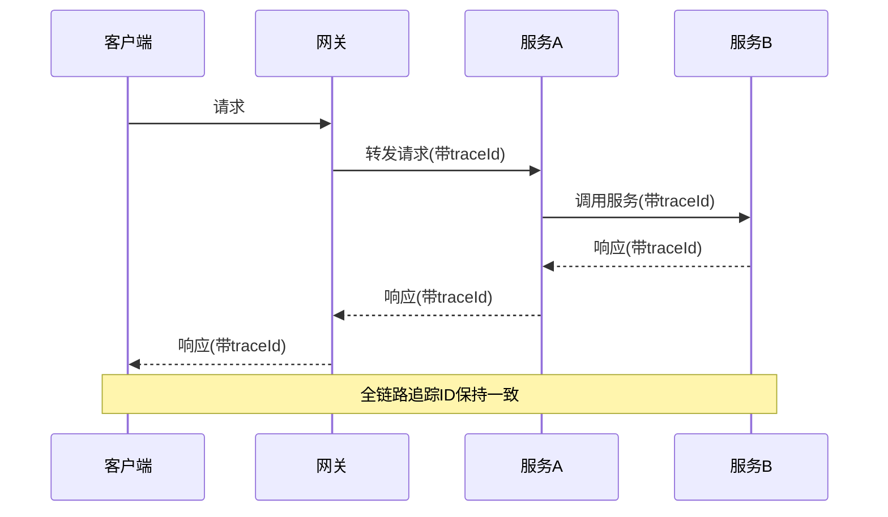

**图示来源**
- [YudaoTracerAutoConfiguration.java](file://yudao-framework/yudao-spring-boot-starter-monitor/src/main/java/cn/iocoder/yudao/framework/tracer/config/YudaoTracerAutoConfiguration.java)
- [TracerUtils.java](file://yudao-framework/yudao-common/src/main/java/cn/iocoder/yudao/framework/common/util/monitor/TracerUtils.java)

**本节来源**
- [YudaoTracerAutoConfiguration.java](file://yudao-framework/yudao-spring-boot-starter-monitor/src/main/java/cn/iocoder/yudao/framework/tracer/config/YudaoTracerAutoConfiguration.java)

### 数据库备份监控

系统通过`mysql_backup.sh`脚本实现了数据库的定期备份和监控。备份脚本会记录备份文件的大小，并在备份完成后进行日志记录。系统还实现了过期备份文件的清理功能，保留指定天数的历史备份文件。

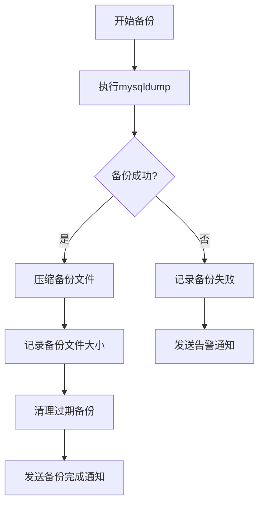

**本节来源**
- [mysql_backup.sh](file://mysql_backup_system/mysql_backup.sh)

## 日志取证与事件响应

为安全团队提供了完整的日志取证和事件响应实践指南。

### 日志取证流程

当发生安全事件时，安全团队应按照以下流程进行日志取证：
1. 确定事件发生的时间范围
2. 收集相关服务的日志文件
3. 根据链路追踪ID关联跨服务的日志
4. 分析登录日志，识别异常登录行为
5. 分析操作日志，追踪用户操作轨迹
6. 分析异常日志，定位系统错误

### 事件响应指南

针对不同类型的事件，提供相应的响应指南：
- **异常登录事件**：立即锁定相关账号，通知用户修改密码，检查账号权限
- **频繁失败尝试**：对来源IP进行临时封禁，加强验证码验证
- **数据泄露事件**：立即切断网络连接，保存现场证据，启动应急响应流程
- **系统异常事件**：优先恢复服务，然后进行根因分析

## 总结

本系统构建了全面的安全日志与监控体系，涵盖了日志记录、存储、分析、审计等多个方面。通过多种日志类型和详细的记录内容，实现了对系统活动的全面监控。采用异步写入和智能轮转策略，确保了日志系统的高性能和可靠性。集成SkyWalking等先进监控工具，提供了强大的链路追踪和性能分析能力。完善的日志审计机制和事件响应指南，为系统的安全稳定运行提供了有力保障。