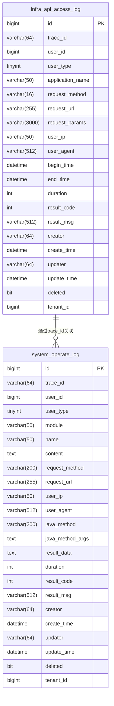
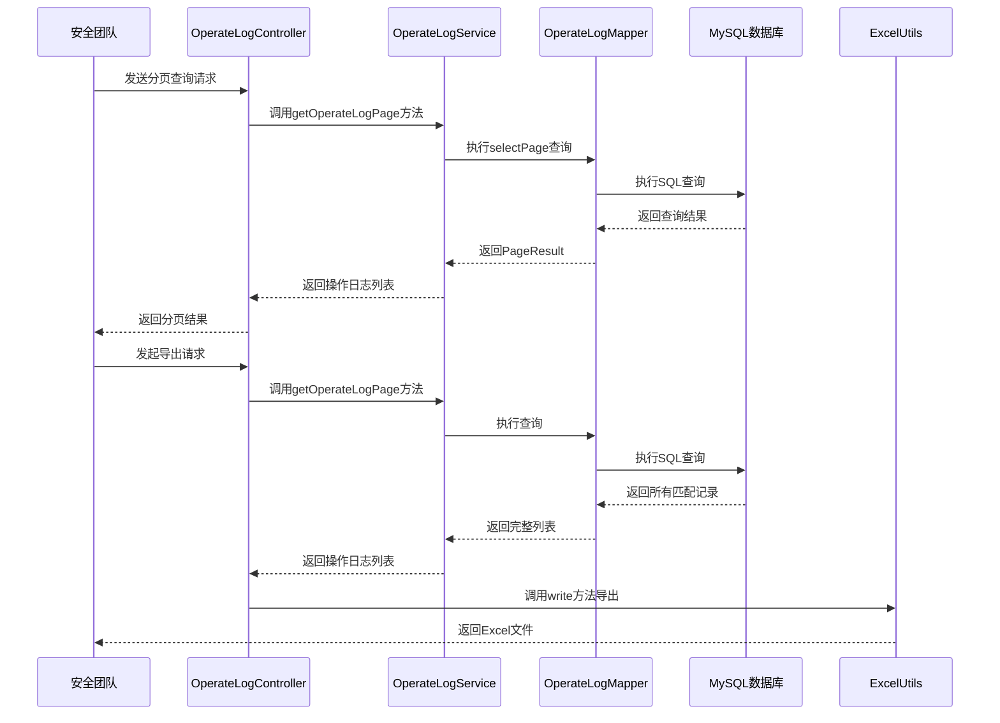
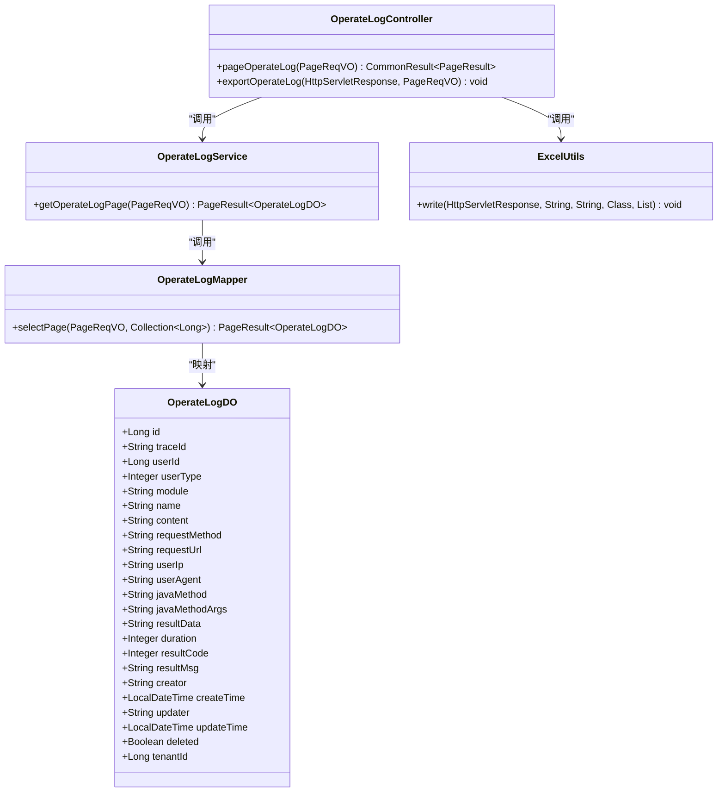
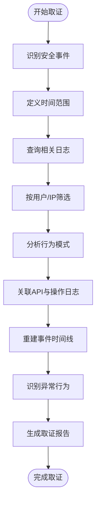
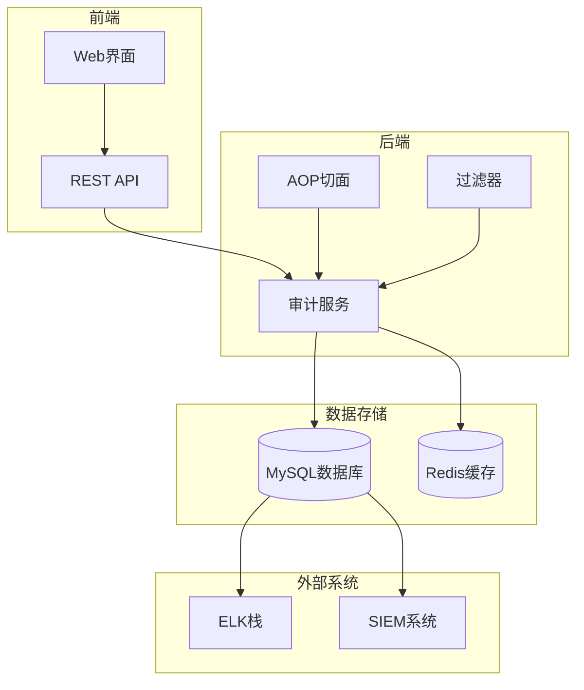

# 审计分析

<cite>
**本文档引用的文件**   
- [ApiAccessLogFilter.java](file://yudao-framework/yudao-spring-boot-starter-web/src/main/java/cn/iocoder/yudao/framework/apilog/core/filter/ApiAccessLogFilter.java)
- [OperateLogAspect.java](file://yudao-framework/yudao-spring-boot-starter-operatelog/src/main/java/cn/iocoder/yudao/framework/operatelog/core/aop/OperateLogAspect.java)
- [OperateLogFrameworkServiceImpl.java](file://yudao-framework/yudao-spring-boot-starter-operatelog/src/main/java/cn/iocoder/yudao/framework/operatelog/core/service/OperateLogFrameworkServiceImpl.java)
- [OperateLogController.java](file://yudao-module-system/yudao-module-system-biz/src/main/java/cn/iocoder/yudao/module/system/controller/admin/logger/OperateLogController.java)
- [OperateLogMapper.java](file://yudao-module-system/yudao-module-system-biz/src/main/java/cn/iocoder/yudao/module/system/dal/mysql/logger/OperateLogMapper.java)
- [ruoyi-vue-pro.sql](file://sql/mysql/ruoyi-vue-pro.sql)
- [V1_0_0_001__框架初始化.sql](file://eplus-flyway/src/main/resources/db/migration/common/V1_0_0_001__框架初始化.sql)
- [V1_0_0_260__新增打印模板变更表.sql](file://eplus-flyway/src/main/resources/db/migration/common/V1_0_0_260__新增打印模板变更表.sql)
</cite>

## 目录
1. [引言](#引言)
2. [日志审计实现方式](#日志审计实现方式)
3. [合规性要求与审计周期](#合规性要求与审计周期)
4. [审计查询机制与性能优化](#审计查询机制与性能优化)
5. [审计报告生成方法](#审计报告生成方法)
6. [日志取证实践指南](#日志取证实践指南)
7. [审计分析工具集成与可视化](#审计分析工具集成与可视化)
8. [事件响应标准操作流程](#事件响应标准操作流程)
9. [结论](#结论)

## 引言
本文档旨在全面描述系统中审计分析的实现机制，重点涵盖日志审计的实现方式、合规性要求、审计周期、查询机制、报告生成、日志取证、工具集成及安全事件响应流程。通过深入分析代码结构和数据库设计，为安全团队提供完整的审计分析框架和操作指南。

## 日志审计实现方式

系统实现了两种核心审计日志机制：API访问日志和操作日志。API访问日志记录所有API请求的详细信息，包括请求方法、URL、参数、执行时长和结果状态。操作日志则记录用户的关键操作行为，用于安全审计和责任追溯。

API访问日志通过`ApiAccessLogFilter`过滤器实现，该过滤器在请求处理前后记录开始时间和结束时间，并计算执行时长。操作日志通过AOP切面`OperateLogAspect`实现，利用Spring AOP在方法执行前后自动记录操作信息。

日志数据存储在MySQL数据库中，主要包含两个核心表：`infra_api_access_log`用于存储API访问日志，`system_operate_log`用于存储用户操作日志。这些日志表设计了完整的审计字段，包括用户ID、用户类型、IP地址、User-Agent、创建时间、更新时间等。

**本节来源**
- [ApiAccessLogFilter.java](file://yudao-framework/yudao-spring-boot-starter-web/src/main/java/cn/iocoder/yudao/framework/apilog/core/filter/ApiAccessLogFilter.java)
- [OperateLogAspect.java](file://yudao-framework/yudao-spring-boot-starter-operatelog/src/main/java/cn/iocoder/yudao/framework/operatelog/core/aop/OperateLogAspect.java)
- [ruoyi-vue-pro.sql](file://sql/mysql/ruoyi-vue-pro.sql)

## 合规性要求与审计周期

系统设计遵循GDPR、网络安全法等合规性要求，确保审计日志的完整性、不可篡改性和可追溯性。所有用户操作日志永久保存，满足法规对审计数据保留期限的要求。API访问日志根据性能和存储考虑，设置合理的保留周期。

审计周期分为实时审计和定期审计两种模式。实时审计通过AOP切面和过滤器实现，确保每个关键操作和API调用都能被即时记录。定期审计通过后台任务定期分析日志数据，识别异常模式和潜在安全威胁。

系统实现了完整的用户身份追踪机制，通过`userId`和`userType`字段准确记录操作主体，满足合规性要求中的责任追溯需求。同时，通过`traceId`字段实现请求链路追踪，便于跨系统操作的关联分析。

**图表来源**
- [ruoyi-vue-pro.sql](file://sql/mysql/ruoyi-vue-pro.sql)
- [V1_0_0_001__框架初始化.sql](file://eplus-flyway/src/main/resources/db/migration/common/V1_0_0_001__框架初始化.sql)

**本节来源**
- [ruoyi-vue-pro.sql](file://sql/mysql/ruoyi-vue-pro.sql)
- [V1_0_0_001__框架初始化.sql](file://eplus-flyway/src/main/resources/db/migration/common/V1_0_0_001__框架初始化.sql)

## 审计查询机制与性能优化

系统提供了高效的审计查询机制，支持多维度条件筛选和分页查询。通过`OperateLogMapper`中的`selectPage`方法，可以根据模块、用户ID、操作类型和时间范围等条件进行精确查询。查询结果支持按ID降序排列，确保最新的操作日志优先显示。

性能优化方面，系统在关键字段上创建了数据库索引，如`create_time`字段的索引，显著提升了时间范围查询的效率。同时，采用分页查询机制，避免一次性加载大量数据导致性能问题。对于导出操作，系统提供了专门的`exportOperateLog`接口，支持将查询结果导出为Excel文件。

查询机制还支持成功/失败状态的筛选，通过比较`resultCode`字段与`GlobalErrorCodeConstants.SUCCESS.getCode()`的值来判断操作是否成功。这种设计使得安全团队能够快速定位异常操作和系统错误。

**图表来源**
- [OperateLogController.java](file://yudao-module-system/yudao-module-system-biz/src/main/java/cn/iocoder/yudao/module/system/controller/admin/logger/OperateLogController.java)
- [OperateLogService.java](file://yudao-module-system/yudao-module-system-biz/src/main/java/cn/iocoder/yudao/module/system/service/logger/OperateLogService.java)
- [OperateLogMapper.java](file://yudao-module-system/yudao-module-system-biz/src/main/java/cn/iocoder/yudao/module/system/dal/mysql/logger/OperateLogMapper.java)

**本节来源**
- [OperateLogController.java](file://yudao-module-system/yudao-module-system-biz/src/main/java/cn/iocoder/yudao/module/system/controller/admin/logger/OperateLogController.java)
- [OperateLogMapper.java](file://yudao-module-system/yudao-module-system-biz/src/main/java/cn/iocoder/yudao/module/system/dal/mysql/logger/OperateLogMapper.java)

## 审计报告生成方法

系统提供了标准化的审计报告生成机制，支持自定义报告模板和自动化报告生成。通过`OperateLogController`中的`exportOperateLog`方法，可以将审计数据导出为Excel格式的报告文件。报告包含操作日志的所有关键字段，如操作模块、操作名称、操作内容、操作时间、操作结果等。

报告模板设计遵循清晰、完整的原则，确保所有重要信息都能被有效呈现。系统支持对报告数据进行格式化处理，如将时间戳转换为可读的日期时间格式，将用户ID关联到具体的用户名等。这种设计提高了报告的可读性和实用性。

对于特定业务场景，系统还支持自定义报告生成。通过`system_report`和`system_report_change`表，可以定义和管理各种报告模板，包括打印模板和导出模板。这些模板支持审核状态管理，确保报告内容的准确性和合规性。

**图表来源**
- [OperateLogController.java](file://yudao-module-system/yudao-module-system-biz/src/main/java/cn/iocoder/yudao/module/system/controller/admin/logger/OperateLogController.java)
- [OperateLogService.java](file://yudao-module-system/yudao-module-system-biz/src/main/java/cn/iocoder/yudao/module/system/service/logger/OperateLogService.java)
- [OperateLogMapper.java](file://yudao-module-system/yudao-module-system-biz/src/main/java/cn/iocoder/yudao/module/system/dal/mysql/logger/OperateLogMapper.java)
- [OperateLogDO.java](file://yudao-module-system/yudao-module-system-biz/src/main/java/cn/iocoder/yudao/module/system/dal/dataobject/logger/OperateLogDO.java)

**本节来源**
- [OperateLogController.java](file://yudao-module-system/yudao-module-system-biz/src/main/java/cn/iocoder/yudao/module/system/controller/admin/logger/OperateLogController.java)
- [V1_0_0_260__新增打印模板变更表.sql](file://eplus-flyway/src/main/resources/db/migration/common/V1_0_0_260__新增打印模板变更表.sql)

## 日志取证实践指南

日志取证是安全事件响应的关键环节。系统提供了完整的日志取证支持，帮助安全团队追踪安全事件和重建事件时间线。首先，通过`traceId`字段可以追踪单个请求的完整处理流程，包括所有相关的API调用和操作日志。

事件时间线重建应遵循以下步骤：首先确定事件发生的大致时间范围，然后通过时间范围查询获取该时间段内的所有相关日志；其次，根据用户ID或IP地址筛选特定用户或设备的操作记录；最后，结合操作类型和结果状态，分析异常行为模式。

对于复杂的安全事件，建议采用关联分析方法，将API访问日志和操作日志进行关联查询。通过`traceId`和`userId`等共同字段，可以构建完整的用户行为轨迹，识别潜在的攻击路径和权限滥用行为。

**图表来源**
- [ApiAccessLogFilter.java](file://yudao-framework/yudao-spring-boot-starter-web/src/main/java/cn/iocoder/yudao/framework/apilog/core/filter/ApiAccessLogFilter.java)
- [OperateLogAspect.java](file://yudao-framework/yudao-spring-boot-starter-operatelog/src/main/java/cn/iocoder/yudao/framework/operatelog/core/aop/OperateLogAspect.java)

**本节来源**
- [ApiAccessLogFilter.java](file://yudao-framework/yudao-spring-boot-starter-web/src/main/java/cn/iocoder/yudao/framework/apilog/core/filter/ApiAccessLogFilter.java)
- [OperateLogAspect.java](file://yudao-framework/yudao-spring-boot-starter-operatelog/src/main/java/cn/iocoder/yudao/framework/operatelog/core/aop/OperateLogAspect.java)

## 审计分析工具集成与可视化

系统通过标准化的API接口和数据模型，支持与各种审计分析工具的集成。`OperateLogApi`接口提供了创建和查询操作日志的标准方法，便于第三方工具接入。异步处理机制通过`@Async`注解实现，确保日志记录不会影响主业务流程的性能。

可视化方面，系统提供了基本的Web界面，支持操作日志的分页展示和导出功能。对于更高级的可视化需求，可以通过集成ELK（Elasticsearch、Logstash、Kibana）或类似的大数据分析平台，实现日志数据的实时监控、趋势分析和异常检测。

系统还支持自定义审计规则的配置，通过`OperateLog`注解和AOP切面，可以灵活定义需要审计的操作类型和记录级别。这种设计使得审计策略可以根据业务需求和安全等级进行动态调整。

**图表来源**
- [OperateLogFrameworkServiceImpl.java](file://yudao-framework/yudao-spring-boot-starter-operatelog/src/main/java/cn/iocoder/yudao/framework/operatelog/core/service/OperateLogFrameworkServiceImpl.java)
- [OperateLogApi.java](file://yudao-module-system/yudao-module-system-api/src/main/java/cn/iocoder/yudao/module/system/api/logger/OperateLogApi.java)

**本节来源**
- [OperateLogFrameworkServiceImpl.java](file://yudao-framework/yudao-spring-boot-starter-operatelog/src/main/java/cn/iocoder/yudao/framework/operatelog/core/service/OperateLogFrameworkServiceImpl.java)

## 事件响应标准操作流程

安全团队应遵循标准化的事件响应流程处理审计发现的安全事件。流程分为四个阶段：检测、分析、响应和恢复。

检测阶段，通过定期审计和实时监控发现异常日志记录。分析阶段，使用日志取证技术重建事件时间线，确定事件性质和影响范围。响应阶段，根据事件严重程度采取相应措施，如临时禁用账户、限制IP访问等。恢复阶段，修复安全漏洞，更新审计策略，防止类似事件再次发生。

对于高风险事件，应立即启动应急响应机制，通知相关责任人，并记录完整的处理过程。所有事件处理记录应作为审计日志的一部分永久保存，确保事件处理的可追溯性。

**本节来源**
- [OperateLogAspect.java](file://yudao-framework/yudao-spring-boot-starter-operatelog/src/main/java/cn/iocoder/yudao/framework/operatelog/core/aop/OperateLogAspect.java)
- [ApiAccessLogFilter.java](file://yudao-framework/yudao-spring-boot-starter-web/src/main/java/cn/iocoder/yudao/framework/apilog/core/filter/ApiAccessLogFilter.java)

## 结论
本文档全面描述了系统的审计分析机制，涵盖了日志审计实现、合规性要求、查询优化、报告生成、日志取证和事件响应等关键方面。通过深入分析代码实现和数据库设计，为安全团队提供了完整的操作指南和最佳实践。系统设计充分考虑了安全性和性能的平衡，支持灵活的审计策略配置和强大的分析能力，能够有效满足企业级应用的审计需求。