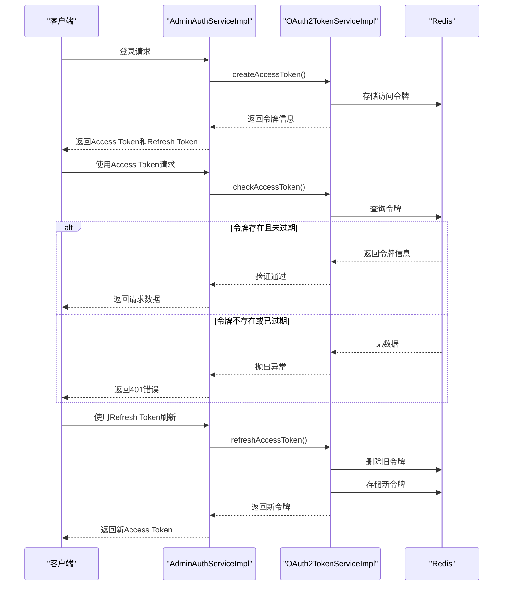
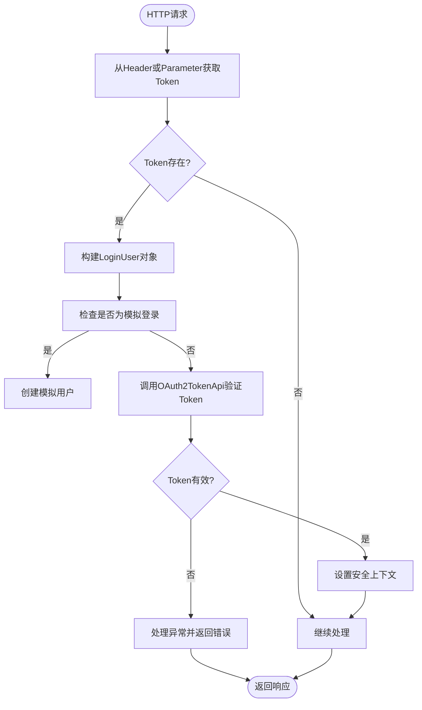
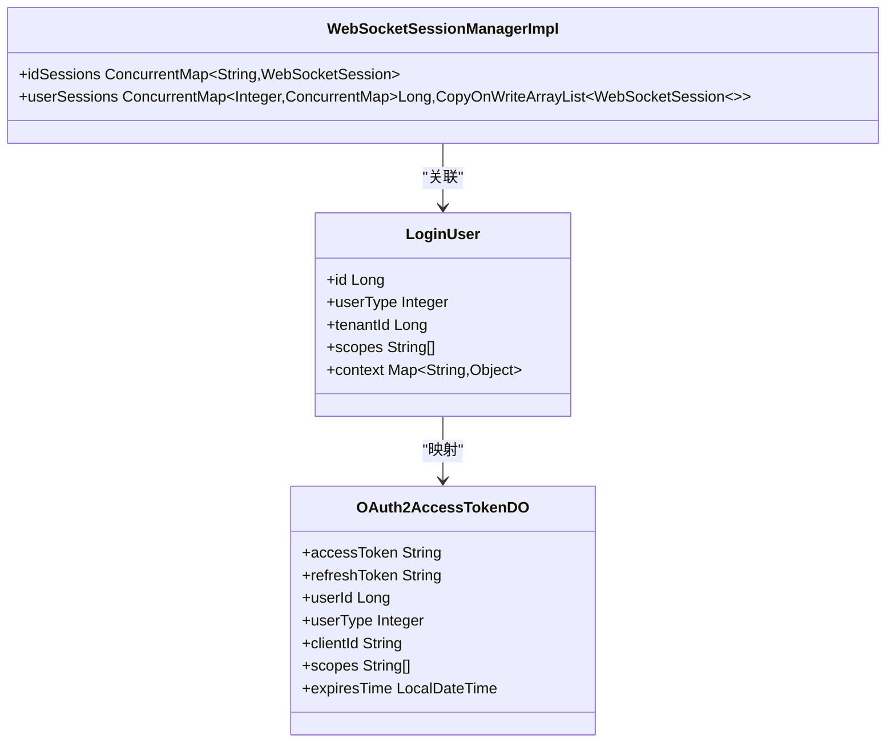
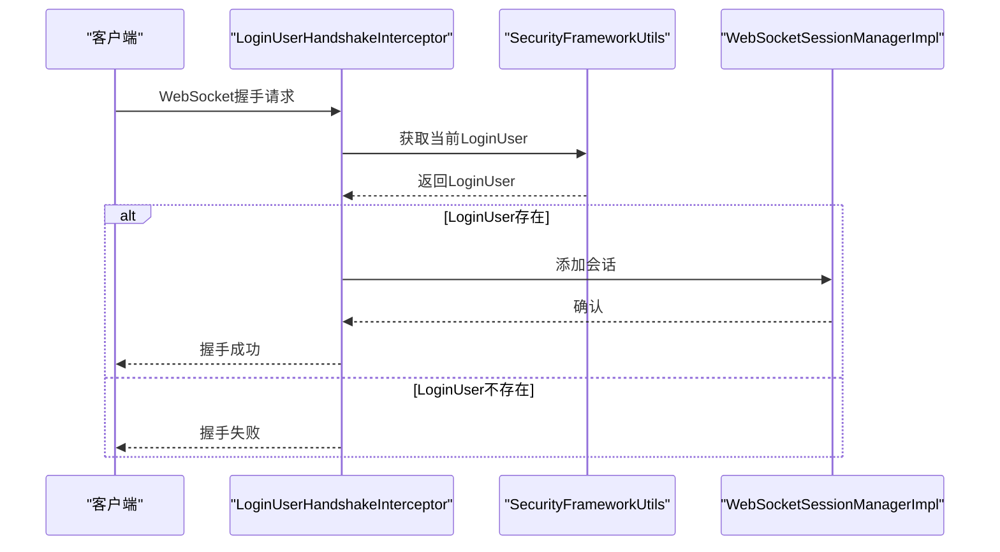

# 会话管理

<cite>
**本文档引用的文件**   
- [OAuth2AccessTokenRedisDAO.java](file://yudao-module-system/yudao-module-system-biz/src/main/java/cn/iocoder/yudao/module/system/dal/redis/oauth2/OAuth2AccessTokenRedisDAO.java)
- [TokenAuthenticationFilter.java](file://yudao-framework/yudao-spring-boot-starter-security/src/main/java/cn/iocoder/yudao/framework/security/core/filter/TokenAuthenticationFilter.java)
- [OAuth2TokenServiceImpl.java](file://yudao-module-system/yudao-module-system-biz/src/main/java/cn/iocoder/yudao/module/system/service/oauth2/OAuth2TokenServiceImpl.java)
- [OAuth2TokenApi.java](file://yudao-module-system/yudao-module-system-api/src/main/java/cn/iocoder/yudao/module/system/api/oauth2/OAuth2TokenApi.java)
- [AdminAuthServiceImpl.java](file://yudao-module-system/yudao-module-system-biz/src/main/java/cn/iocoder/yudao/module/system/service/auth/AdminAuthServiceImpl.java)
- [YudaoWebSecurityConfigurerAdapter.java](file://yudao-framework/yudao-spring-boot-starter-security/src/main/java/cn/iocoder/yudao/framework/security/config/YudaoWebSecurityConfigurerAdapter.java)
- [SecurityProperties.java](file://yudao-framework/yudao-spring-boot-starter-security/src/main/java/cn/iocoder/yudao/framework/security/config/SecurityProperties.java)
- [RedisKeyConstants.java](file://yudao-module-system/yudao-module-system-biz/src/main/java/cn/iocoder/yudao/module/system/dal/redis/RedisKeyConstants.java)
- [LoginUser.java](file://yudao-framework/yudao-spring-boot-starter-security/src/main/java/cn/iocoder/yudao/framework/security/core/LoginUser.java)
- [WebSocketSessionManagerImpl.java](file://yudao-framework/yudao-spring-boot-starter-websocket/src/main/java/cn/iocoder/yudao/framework/websocket/core/session/WebSocketSessionManagerImpl.java)
- [LoginUserHandshakeInterceptor.java](file://yudao-framework/yudao-spring-boot-starter-websocket/src/main/java/cn/iocoder/yudao/framework/websocket/core/security/LoginUserHandshakeInterceptor.java)
</cite>

## 目录
1. [简介](#简介)
2. [基于Redis的分布式会话存储](#基于redis的分布式会话存储)
3. [JWT令牌生命周期管理](#jwt令牌生命周期管理)
4. [会话创建、验证与销毁流程](#会话创建验证与销毁流程)
5. [多设备登录控制与强制下线](#多设备登录控制与强制下线)
6. [会话超时配置与安全性设置](#会话超时配置与安全性设置)
7. [会话固定攻击防护](#会话固定攻击防护)
8. [WebSocket会话管理](#websocket会话管理)
9. [自定义会话策略扩展接口](#自定义会话策略扩展接口)

## 简介

本系统采用基于JWT（JSON Web Token）的无状态会话管理机制，结合Redis实现分布式会话存储。系统通过OAuth2.0协议实现认证授权，使用访问令牌（Access Token）和刷新令牌（Refresh Token）双令牌机制来管理用户会话。会话数据存储在Redis中，确保了在分布式环境下的会话一致性，同时通过合理的超时策略和安全措施保障系统安全。

**会话管理核心特点：**
- 基于Token的无状态会话机制，不依赖服务器Session
- 使用Redis作为分布式缓存存储会话数据
- 支持多设备登录及设备级会话管理
- 提供令牌刷新机制延长会话有效期
- 实现强制下线功能以增强安全性
- 防护会话固定攻击等常见安全威胁

## 基于Redis的分布式会话存储

系统采用Redis作为分布式会话存储方案，将OAuth2.0访问令牌存储在Redis中，实现跨服务的会话共享和高可用性。通过`OAuth2AccessTokenRedisDAO`类直接操作Redis，使用`StringRedisTemplate`进行数据的存取。

```mermaid
classDiagram
class OAuth2AccessTokenRedisDAO {
-stringRedisTemplate StringRedisTemplate
+get(accessToken String) OAuth2AccessTokenDO
+set(accessTokenDO OAuth2AccessTokenDO) void
+delete(accessToken String) void
+deleteList(accessTokens Collection) void
}
class OAuth2AccessTokenDO {
+accessToken String
+refreshToken String
+userId Long
+userType Integer
+clientId String
+scopes String[]
+expiresTime LocalDateTime
}
class RedisKeyConstants {
+OAUTH2_ACCESS_TOKEN String
}
OAuth2AccessTokenRedisDAO --> OAuth2AccessTokenDO : "操作"
OAuth2AccessTokenRedisDAO --> RedisKeyConstants : "使用"
OAuth2AccessTokenDO --> "Redis" : "存储为JSON"
```

**Diagram sources**
- [OAuth2AccessTokenRedisDAO.java](file://yudao-module-system/yudao-module-system-biz/src/main/java/cn/iocoder/yudao/module/system/dal/redis/oauth2/OAuth2AccessTokenRedisDAO.java#L26-L59)
- [RedisKeyConstants.java](file://yudao-module-system/yudao-module-system-biz/src/main/java/cn/iocoder/yudao/module/system/dal/redis/RedisKeyConstants.java#L84)

**会话存储机制：**
1. Redis键格式为`oauth2_access_token:{token}`，其中`{token}`为实际的访问令牌
2. 会话数据以JSON格式存储，包含用户ID、用户类型、客户端ID、授权范围和过期时间等信息
3. 设置与令牌过期时间相同的Redis过期时间，实现自动清理
4. 优先从Redis读取会话数据，若不存在则从数据库查询并回填到Redis

**Section sources**
- [OAuth2AccessTokenRedisDAO.java](file://yudao-module-system/yudao-module-system-biz/src/main/java/cn/iocoder/yudao/module/system/dal/redis/oauth2/OAuth2AccessTokenRedisDAO.java#L1-L59)
- [RedisKeyConstants.java](file://yudao-module-system/yudao-module-system-biz/src/main/java/cn/iocoder/yudao/module/system/dal/redis/RedisKeyConstants.java#L84)

## JWT令牌生命周期管理

系统实现了完整的JWT令牌生命周期管理，包括令牌创建、验证、刷新和销毁。通过`OAuth2TokenService`接口和`OAuth2TokenServiceImpl`实现类管理令牌的整个生命周期。



**Diagram sources**
- [OAuth2TokenServiceImpl.java](file://yudao-module-system/yudao-module-system-biz/src/main/java/cn/iocoder/yudao/module/system/service/oauth2/OAuth2TokenServiceImpl.java#L54-L152)
- [AdminAuthServiceImpl.java](file://yudao-module-system/yudao-module-system-biz/src/main/java/cn/iocoder/yudao/module/system/service/auth/AdminAuthServiceImpl.java#L147-L149)

**令牌生命周期流程：**
1. **创建**：用户登录成功后，系统生成Access Token和Refresh Token
2. **验证**：每次请求时验证Access Token的有效性和未过期状态
3. **刷新**：Access Token即将过期时，使用Refresh Token获取新的Access Token
4. **销毁**：用户主动登出或令牌过期时，从Redis和数据库中删除令牌

**Section sources**
- [OAuth2TokenServiceImpl.java](file://yudao-module-system/yudao-module-system-biz/src/main/java/cn/iocoder/yudao/module/system/service/oauth2/OAuth2TokenServiceImpl.java#L32-L164)
- [OAuth2TokenApi.java](file://yudao-module-system/yudao-module-system-api/src/main/java/cn/iocoder/yudao/module/system/api/oauth2/OAuth2TokenApi.java#L14-L49)

## 会话创建、验证与销毁流程

系统通过`TokenAuthenticationFilter`过滤器实现会话的自动验证，该过滤器在每次请求时检查并验证令牌，建立安全上下文。



**Diagram sources**
- [TokenAuthenticationFilter.java](file://yudao-framework/yudao-spring-boot-starter-security/src/main/java/cn/iocoder/yudao/framework/security/core/filter/TokenAuthenticationFilter.java#L42-L65)
- [SecurityFrameworkUtils.java](file://yudao-framework/yudao-spring-boot-starter-security/src/main/java/cn/iocoder/yudao/framework/security/core/util/SecurityFrameworkUtils.java#L98-L107)

**会话创建流程：**
1. 用户通过认证接口（如用户名密码）进行身份验证
2. 系统调用`OAuth2TokenService.createAccessToken()`创建访问令牌
3. 生成随机的UUID作为Access Token和Refresh Token
4. 将令牌信息存储到MySQL数据库和Redis缓存中
5. 返回包含Access Token和Refresh Token的响应

**会话验证流程：**
1. `TokenAuthenticationFilter`拦截每个请求
2. 从请求Header的`Authorization`字段或`token`参数获取令牌
3. 调用`OAuth2TokenService.checkAccessToken()`验证令牌
4. 验证通过后，将用户信息设置到Spring Security上下文中

**会话销毁流程：**
1. 用户发起登出请求
2. 调用`AdminAuthServiceImpl.logout()`方法
3. 通过`OAuth2TokenService.removeAccessToken()`删除访问令牌
4. 同时删除关联的刷新令牌
5. 记录登出日志

**Section sources**
- [TokenAuthenticationFilter.java](file://yudao-framework/yudao-spring-boot-starter-security/src/main/java/cn/iocoder/yudao/framework/security/core/filter/TokenAuthenticationFilter.java#L31-L65)
- [AdminAuthServiceImpl.java](file://yudao-module-system/yudao-module-system-biz/src/main/java/cn/iocoder/yudao/module/system/service/auth/AdminAuthServiceImpl.java#L153-L161)

## 多设备登录控制与强制下线

系统支持多设备登录，并提供了强制下线功能。通过`OAuth2AccessTokenDO`中的用户ID和用户类型字段，系统可以追踪同一用户在不同设备上的登录状态。



**Diagram sources**
- [LoginUser.java](file://yudao-framework/yudao-spring-boot-starter-security/src/main/java/cn/iocoder/yudao/framework/security/core/LoginUser.java#L18-L59)
- [WebSocketSessionManagerImpl.java](file://yudao-framework/yudao-spring-boot-starter-websocket/src/main/java/cn/iocoder/yudao/framework/websocket/core/session/WebSocketSessionManagerImpl.java#L21-L37)

**多设备登录控制机制：**
1. 每个登录设备都会生成独立的访问令牌
2. 系统通过用户ID和用户类型识别同一用户的多个会话
3. 可以查询特定用户的全部活动会话
4. 支持按设备或会话进行精细化管理

**强制下线实现：**
1. 调用`OAuth2GrantService.revokeToken()`方法
2. 通过客户端ID和访问令牌定位特定会话
3. 从Redis和数据库中删除对应的访问令牌和刷新令牌
4. 已被删除的令牌在下次验证时将失败，实现强制下线

**Section sources**
- [LoginUser.java](file://yudao-framework/yudao-spring-boot-starter-security/src/main/java/cn/iocoder/yudao/framework/security/core/LoginUser.java#L18-L59)
- [OAuth2AccessTokenDO.java](file://yudao-module-system/yudao-module-system-biz/src/main/java/cn/iocoder/yudao/module/system/dal/dataobject/oauth2/OAuth2AccessTokenDO.java)

## 会话超时配置与安全性设置

系统通过`SecurityProperties`类集中管理会话相关的安全配置，包括令牌头、参数名称和免登录URL等。

```mermaid
classDiagram
class SecurityProperties {
+tokenHeader String
+tokenParameter String
+mockEnable Boolean
+mockSecret String
+permitAllUrls String[]
+passwordEncoderLength Integer
}
class YudaoWebSecurityConfigurerAdapter {
+filterChain(HttpSecurity) SecurityFilterChain
+authenticationManagerBean(AuthenticationConfiguration) AuthenticationManager
}
SecurityProperties --> YudaoWebSecurityConfigurerAdapter : "注入"
YudaoWebSecurityConfigurerAdapter --> "Spring Security" : "配置"
```

**Diagram sources**
- [SecurityProperties.java](file://yudao-framework/yudao-spring-boot-starter-security/src/main/java/cn/iocoder/yudao/framework/security/config/SecurityProperties.java#L15-L51)
- [YudaoWebSecurityConfigurerAdapter.java](file://yudao-framework/yudao-spring-boot-starter-security/src/main/java/cn/iocoder/yudao/framework/security/config/YudaoWebSecurityConfigurerAdapter.java#L39-L145)

**会话超时配置：**
- 访问令牌过期时间由OAuth2客户端配置决定
- Redis中设置与令牌相同的过期时间，实现自动清理
- 刷新令牌有独立的过期时间，通常长于访问令牌
- 通过`client.getAccessTokenValiditySeconds()`获取访问令牌有效期

**安全性设置最佳实践：**
1. **令牌传输安全**：使用HTTPS传输令牌，防止中间人攻击
2. **令牌存储安全**：客户端应安全存储令牌，避免XSS攻击窃取
3. **CSRF防护**：系统已禁用CSRF保护，因为采用无状态Token机制
4. **免登录URL配置**：通过`securityProperties.getPermitAllUrls()`配置无需认证的URL
5. **密码加密**：使用BCryptPasswordEncoder加密用户密码，复杂度可配置

**Section sources**
- [SecurityProperties.java](file://yudao-framework/yudao-spring-boot-starter-security/src/main/java/cn/iocoder/yudao/framework/security/config/SecurityProperties.java#L1-L51)
- [YudaoWebSecurityConfigurerAdapter.java](file://yudao-framework/yudao-spring-boot-starter-security/src/main/java/cn/iocoder/yudao/framework/security/config/YudaoWebSecurityConfigurerAdapter.java#L108-L109)

## 会话固定攻击防护

系统通过多种机制防护会话固定攻击，确保用户会话安全。主要防护措施包括：

1. **动态令牌生成**：每次登录都生成全新的、随机的UUID作为访问令牌，避免使用可预测的会话ID
2. **令牌绑定**：令牌与用户ID、用户类型、客户端ID等信息绑定，防止令牌被非法复用
3. **及时销毁**：登出时立即删除访问令牌和关联的刷新令牌
4. **过期机制**：设置合理的令牌过期时间，减少令牌被滥用的风险

系统在`OAuth2TokenServiceImpl`中实现了完整的令牌管理逻辑，确保在刷新令牌时会删除所有旧的访问令牌：

```java
// 刷新令牌时删除旧的访问令牌
List<OAuth2AccessTokenDO> accessTokenDOs = oauth2AccessTokenMapper.selectListByRefreshToken(refreshToken);
if (CollUtil.isNotEmpty(accessTokenDOs)) {
    oauth2AccessTokenMapper.deleteBatchIds(convertSet(accessTokenDOs, OAuth2AccessTokenDO::getId));
    oauth2AccessTokenRedisDAO.deleteList(convertSet(accessTokenDOs, OAuth2AccessTokenDO::getAccessToken));
}
```

通过这种机制，即使攻击者获取了旧的访问令牌，也无法继续使用，有效防止了会话固定攻击。

**Section sources**
- [OAuth2TokenServiceImpl.java](file://yudao-module-system/yudao-module-system-biz/src/main/java/cn/iocoder/yudao/module/system/service/oauth2/OAuth2TokenServiceImpl.java#L78-L82)

## WebSocket会话管理

系统为WebSocket连接提供了专门的会话管理机制，通过`LoginUserHandshakeInterceptor`和`WebSocketSessionManagerImpl`实现WebSocket会话的安全认证和管理。



**Diagram sources**
- [LoginUserHandshakeInterceptor.java](file://yudao-framework/yudao-spring-boot-starter-websocket/src/main/java/cn/iocoder/yudao/framework/websocket/core/security/LoginUserHandshakeInterceptor.java#L27-L33)
- [WebSocketSessionManagerImpl.java](file://yudao-framework/yudao-spring-boot-starter-websocket/src/main/java/cn/iocoder/yudao/framework/websocket/core/session/WebSocketSessionManagerImpl.java#L66-L83)

**WebSocket会话管理流程：**
1. 客户端连接WebSocket时，在URL中携带`token`参数
2. `TokenAuthenticationFilter`在HTTP握手阶段验证令牌
3. `LoginUserHandshakeInterceptor`在握手前获取已认证的`LoginUser`
4. 将`LoginUser`信息存储到WebSocket会话的属性中
5. `WebSocketSessionManagerImpl`维护会话映射，支持按用户查询会话

**Section sources**
- [LoginUserHandshakeInterceptor.java](file://yudao-framework/yudao-spring-boot-starter-websocket/src/main/java/cn/iocoder/yudao/framework/websocket/core/security/LoginUserHandshakeInterceptor.java#L24-L42)
- [WebSocketSessionManagerImpl.java](file://yudao-framework/yudao-spring-boot-starter-websocket/src/main/java/cn/iocoder/yudao/framework/websocket/core/session/WebSocketSessionManagerImpl.java#L21-L88)

## 自定义会话策略扩展接口

系统提供了清晰的接口供开发者扩展自定义会话策略。主要扩展点包括：

1. **OAuth2TokenApi**：服务间调用的令牌管理API接口
2. **OAuth2TokenService**：内部使用的令牌服务接口
3. **TokenAuthenticationFilter**：可扩展的令牌认证过滤器
4. **SecurityProperties**：可配置的安全属性

开发者可以通过实现这些接口或继承相关类来定制会话管理行为：

```java
// 示例：自定义令牌验证逻辑
public class CustomTokenAuthenticationFilter extends TokenAuthenticationFilter {
    
    public CustomTokenAuthenticationFilter(SecurityProperties securityProperties,
                                        GlobalExceptionHandler globalExceptionHandler,
                                        OAuth2TokenApi oauth2TokenApi) {
        super(securityProperties, globalExceptionHandler, oauth2TokenApi);
    }
    
    @Override
    protected void doFilterInternal(HttpServletRequest request, HttpServletResponse response, 
                                  FilterChain chain) throws ServletException, IOException {
        // 添加自定义验证逻辑
        String customHeader = request.getHeader("X-Custom-Auth");
        if (StringUtils.hasText(customHeader)) {
            // 处理自定义认证头
            processCustomAuth(customHeader, request);
        }
        
        // 调用父类的默认处理逻辑
        super.doFilterInternal(request, response, chain);
    }
    
    private void processCustomAuth(String token, HttpServletRequest request) {
        // 自定义认证逻辑实现
    }
}
```

通过这种方式，开发者可以在不修改核心逻辑的情况下，扩展系统的会话管理功能，满足特定业务需求。

**Section sources**
- [OAuth2TokenApi.java](file://yudao-module-system/yudao-module-system-api/src/main/java/cn/iocoder/yudao/module/system/api/oauth2/OAuth2TokenApi.java#L14-L49)
- [TokenAuthenticationFilter.java](file://yudao-framework/yudao-spring-boot-starter-security/src/main/java/cn/iocoder/yudao/framework/security/core/filter/TokenAuthenticationFilter.java#L31-L65)