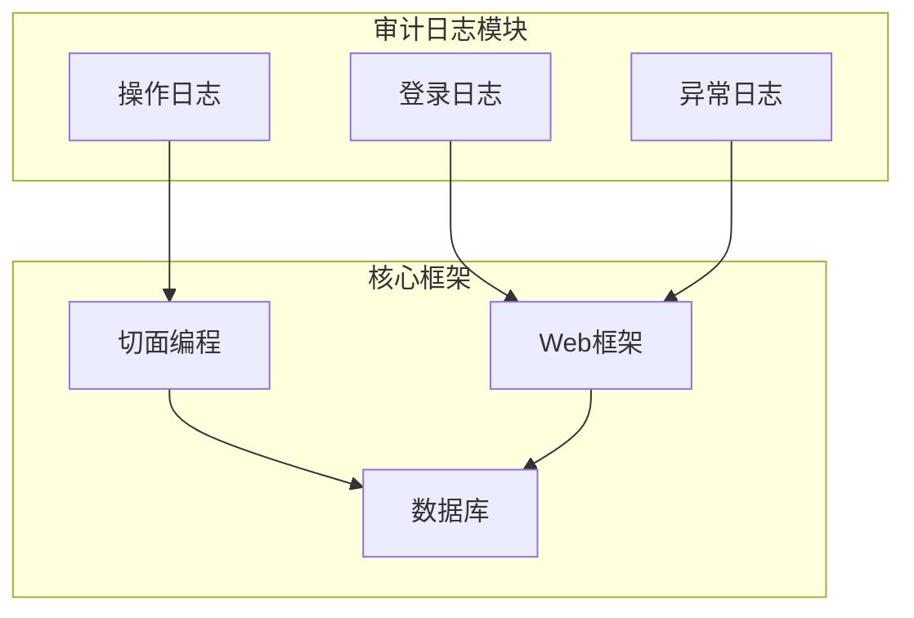
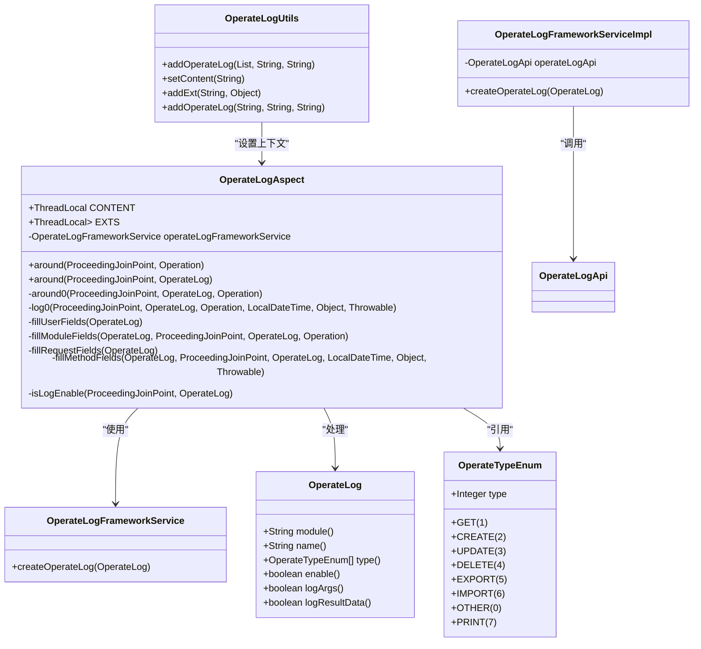
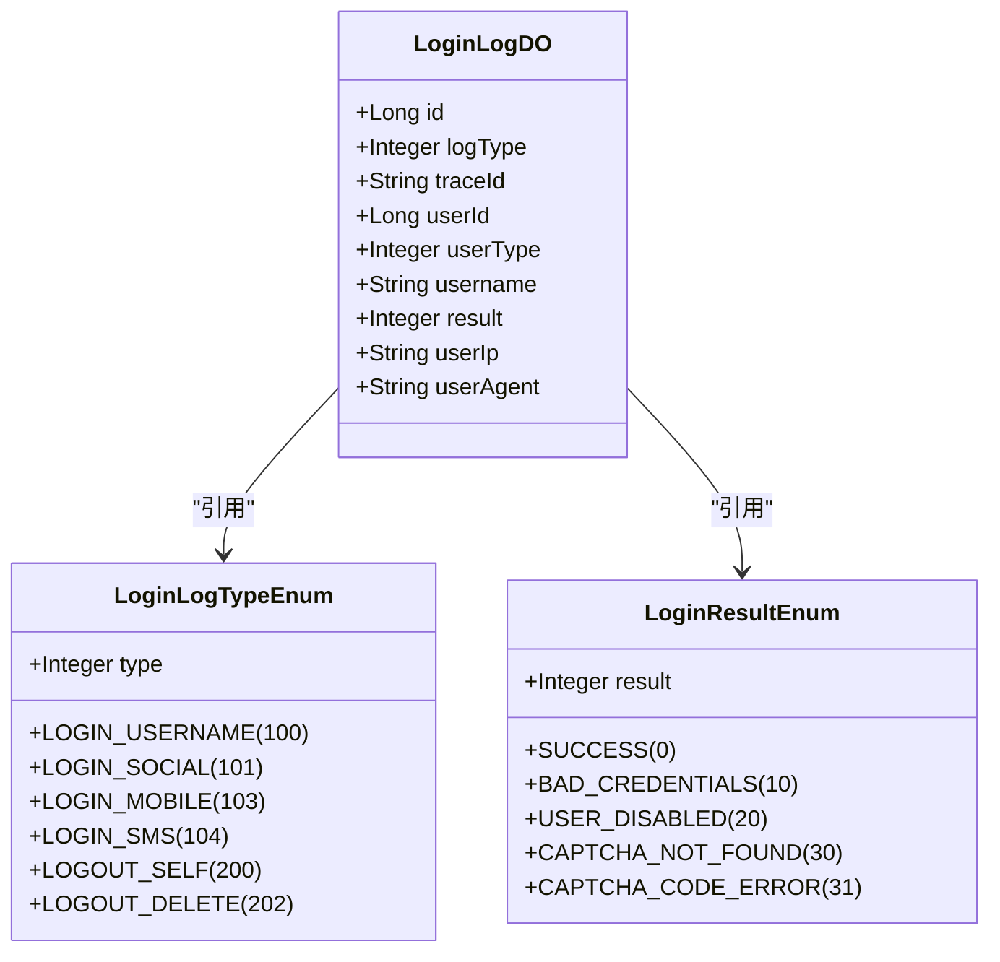
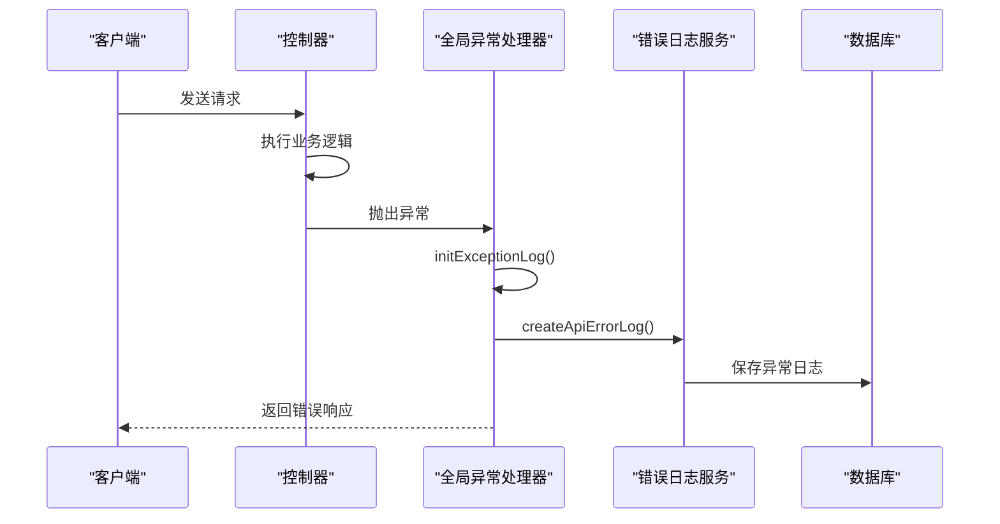
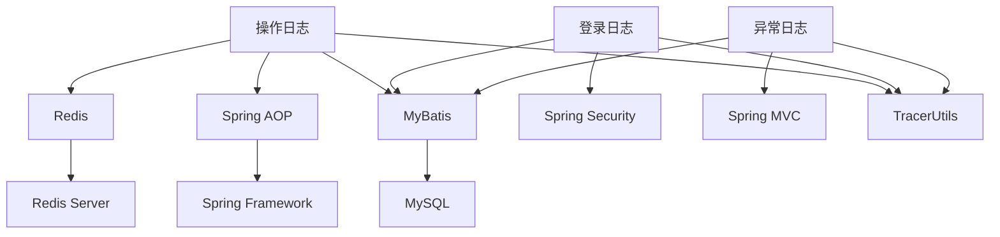

# 安全审计

<cite>
**本文档引用的文件**  
- [OperateLogAspect.java](file://yudao-framework/yudao-spring-boot-starter-operatelog/src/main/java/cn/iocoder/yudao/framework/operatelog/core/aop/OperateLogAspect.java)
- [OperateLog.java](file://yudao-framework/yudao-spring-boot-starter-operatelog/src/main/java/cn/iocoder/yudao/framework/operatelog/core/annotations/OperateLog.java)
- [OperateTypeEnum.java](file://yudao-framework/yudao-spring-boot-starter-operatelog/src/main/java/cn/iocoder/yudao/framework/operatelog/core/enums/OperateTypeEnum.java)
- [LoginLogDO.java](file://yudao-module-system/yudao-module-system-biz/src/main/java/cn/iocoder/yudao/module/system/dal/dataobject/logger/LoginLogDO.java)
- [LoginLogTypeEnum.java](file://yudao-module-system/yudao-module-system-api/src/main/java/cn/iocoder/yudao/module/system/enums/logger/LoginLogTypeEnum.java)
- [LoginResultEnum.java](file://yudao-module-system/yudao-module-system-api/src/main/java/cn/iocoder/yudao/module/system/enums/logger/LoginResultEnum.java)
- [OperateLogFrameworkService.java](file://yudao-framework/yudao-spring-boot-starter-operatelog/src/main/java/cn/iocoder/yudao/framework/operatelog/core/service/OperateLogFrameworkService.java)
- [OperateLogFrameworkServiceImpl.java](file://yudao-framework/yudao-spring-boot-starter-operatelog/src/main/java/cn/iocoder/yudao/framework/operatelog/core/service/OperateLogFrameworkServiceImpl.java)
- [OperateLogUtils.java](file://yudao-framework/yudao-spring-boot-starter-operatelog/src/main/java/cn/iocoder/yudao/framework/operatelog/core/util/OperateLogUtils.java)
- [ApiErrorLog.java](file://yudao-framework/yudao-spring-boot-starter-web/src/main/java/cn/iocoder/yudao/framework/apilog/core/service/ApiErrorLog.java)
- [GlobalExceptionHandler.java](file://yudao-framework/yudao-spring-boot-starter-web/src/main/java/cn/iocoder/yudao/framework/web/core/handler/GlobalExceptionHandler.java)
- [V1_0_0_001__框架初始化.sql](file://eplus-flyway/src/main/resources/db/migration/common/V1_0_0_001__框架初始化.sql)
</cite>

## 目录
1. [引言](#引言)
2. [项目结构](#项目结构)
3. [核心组件](#核心组件)
4. [架构概述](#架构概述)
5. [详细组件分析](#详细组件分析)
6. [依赖分析](#依赖分析)
7. [性能考虑](#性能考虑)
8. [故障排除指南](#故障排除指南)
9. [结论](#结论)

## 引言
本安全审计文档全面覆盖系统中的审计日志功能，包括登录日志、操作日志和异常日志的记录机制。文档详细说明了`@OperateLog`注解的使用方法和配置选项，描述了审计日志的数据结构、存储策略和查询接口。此外，还提供了审计日志的分析方法、监控告警配置、敏感操作的特殊审计要求、合规性考虑、数据保留策略和归档方案，并指导开发者如何添加自定义审计点。

## 项目结构
系统采用模块化架构，安全审计功能主要集中在`yudao-framework`模块下的`yudao-spring-boot-starter-operatelog`组件中。该组件通过AOP切面实现操作日志的自动记录。登录日志和异常日志分别由系统模块和Web框架模块处理。审计日志数据存储在数据库的`system_login_log`、`system_operate_log`和`system_api_error_log`表中。



**图示来源**
- [OperateLogAspect.java](file://yudao-framework/yudao-spring-boot-starter-operatelog/src/main/java/cn/iocoder/yudao/framework/operatelog/core/aop/OperateLogAspect.java)
- [GlobalExceptionHandler.java](file://yudao-framework/yudao-spring-boot-starter-web/src/main/java/cn/iocoder/yudao/framework/web/core/handler/GlobalExceptionHandler.java)
- [V1_0_0_001__框架初始化.sql](file://eplus-flyway/src/main/resources/db/migration/common/V1_0_0_001__框架初始化.sql)

**章节来源**
- [OperateLogAspect.java](file://yudao-framework/yudao-spring-boot-starter-operatelog/src/main/java/cn/iocoder/yudao/framework/operatelog/core/aop/OperateLogAspect.java)
- [GlobalExceptionHandler.java](file://yudao-framework/yudao-spring-boot-starter-web/src/main/java/cn/iocoder/yudao/framework/web/core/handler/GlobalExceptionHandler.java)

## 核心组件
安全审计系统的核心组件包括操作日志切面`OperateLogAspect`、操作日志注解`@OperateLog`、登录日志实体`LoginLogDO`和异常日志处理`GlobalExceptionHandler`。这些组件协同工作，实现了全面的审计功能。

**章节来源**
- [OperateLogAspect.java](file://yudao-framework/yudao-spring-boot-starter-operatelog/src/main/java/cn/iocoder/yudao/framework/operatelog/core/aop/OperateLogAspect.java)
- [LoginLogDO.java](file://yudao-module-system/yudao-module-system-biz/src/main/java/cn/iocoder/yudao/module/system/dal/dataobject/logger/LoginLogDO.java)
- [GlobalExceptionHandler.java](file://yudao-framework/yudao-spring-boot-starter-web/src/main/java/cn/iocoder/yudao/framework/web/core/handler/GlobalExceptionHandler.java)

## 架构概述
系统审计架构采用分层设计，上层为注解和API，中层为切面和处理器，底层为数据存储。操作日志通过`@OperateLog`注解触发，由`OperateLogAspect`切面捕获并记录。登录日志在用户认证过程中生成。异常日志在全局异常处理器中捕获并记录。

```mermaid
graph TD
A[应用层] --> B[控制层]
B --> C[服务层]
C --> D[持久层]
E[@OperateLog] --> F[OperateLogAspect]
G[登录/登出] --> H[LoginLogService]
I[异常] --> J[GlobalExceptionHandler]
F --> K[OperateLogFrameworkService]
H --> L[LoginLogMapper]
J --> M[ApiErrorLogService]
K --> N[system_operate_log]
L --> O[system_login_log]
M --> P[system_api_error_log]
```

**图示来源**
- [OperateLogAspect.java](file://yudao-framework/yudao-spring-boot-starter-operatelog/src/main/java/cn/iocoder/yudao/framework/operatelog/core/aop/OperateLogAspect.java)
- [OperateLogFrameworkService.java](file://yudao-framework/yudao-spring-boot-starter-operatelog/src/main/java/cn/iocoder/yudao/framework/operatelog/core/service/OperateLogFrameworkService.java)
- [LoginLogDO.java](file://yudao-module-system/yudao-module-system-biz/src/main/java/cn/iocoder/yudao/module/system/dal/dataobject/logger/LoginLogDO.java)
- [GlobalExceptionHandler.java](file://yudao-framework/yudao-spring-boot-starter-web/src/main/java/cn/iocoder/yudao/framework/web/core/handler/GlobalExceptionHandler.java)

## 详细组件分析

### 操作日志组件分析
操作日志是系统审计的核心，通过`@OperateLog`注解实现方法级别的操作记录。该注解支持模块、操作名、操作类型等配置，可灵活控制日志记录行为。

#### 操作日志类图


**图示来源**
- [OperateLogAspect.java](file://yudao-framework/yudao-spring-boot-starter-operatelog/src/main/java/cn/iocoder/yudao/framework/operatelog/core/aop/OperateLogAspect.java)
- [OperateLog.java](file://yudao-framework/yudao-spring-boot-starter-operatelog/src/main/java/cn/iocoder/yudao/framework/operatelog/core/annotations/OperateLog.java)
- [OperateTypeEnum.java](file://yudao-framework/yudao-spring-boot-starter-operatelog/src/main/java/cn/iocoder/yudao/framework/operatelog/core/enums/OperateTypeEnum.java)
- [OperateLogFrameworkService.java](file://yudao-framework/yudao-spring-boot-starter-operatelog/src/main/java/cn/iocoder/yudao/framework/operatelog/core/service/OperateLogFrameworkService.java)
- [OperateLogFrameworkServiceImpl.java](file://yudao-framework/yudao-spring-boot-starter-operatelog/src/main/java/cn/iocoder/yudao/framework/operatelog/core/service/OperateLogFrameworkServiceImpl.java)
- [OperateLogUtils.java](file://yudao-framework/yudao-spring-boot-starter-operatelog/src/main/java/cn/iocoder/yudao/framework/operatelog/core/util/OperateLogUtils.java)

**章节来源**
- [OperateLogAspect.java](file://yudao-framework/yudao-spring-boot-starter-operatelog/src/main/java/cn/iocoder/yudao/framework/operatelog/core/aop/OperateLogAspect.java)
- [OperateLog.java](file://yudao-framework/yudao-spring-boot-starter-operatelog/src/main/java/cn/iocoder/yudao/framework/operatelog/core/annotations/OperateLog.java)
- [OperateTypeEnum.java](file://yudao-framework/yudao-spring-boot-starter-operatelog/src/main/java/cn/iocoder/yudao/framework/operatelog/core/enums/OperateTypeEnum.java)

### 登录日志组件分析
登录日志记录用户的登录和登出行为，包括成功和失败的登录尝试。这些日志对于安全审计和用户行为分析至关重要。

#### 登录日志类图


**图示来源**
- [LoginLogDO.java](file://yudao-module-system/yudao-module-system-biz/src/main/java/cn/iocoder/yudao/module/system/dal/dataobject/logger/LoginLogDO.java)
- [LoginLogTypeEnum.java](file://yudao-module-system/yudao-module-system-api/src/main/java/cn/iocoder/yudao/module/system/enums/logger/LoginLogTypeEnum.java)
- [LoginResultEnum.java](file://yudao-module-system/yudao-module-system-api/src/main/java/cn/iocoder/yudao/module/system/enums/logger/LoginResultEnum.java)

**章节来源**
- [LoginLogDO.java](file://yudao-module-system/yudao-module-system-biz/src/main/java/cn/iocoder/yudao/module/system/dal/dataobject/logger/LoginLogDO.java)
- [LoginLogTypeEnum.java](file://yudao-module-system/yudao-module-system-api/src/main/java/cn/iocoder/yudao/module/system/enums/logger/LoginLogTypeEnum.java)
- [LoginResultEnum.java](file://yudao-module-system/yudao-module-system-api/src/main/java/cn/iocoder/yudao/module/system/enums/logger/LoginResultEnum.java)

### 异常日志组件分析
异常日志自动捕获系统运行时的异常信息，包括异常类型、消息、堆栈跟踪等详细信息，为故障排查提供重要依据。

#### 异常日志处理流程


**图示来源**
- [GlobalExceptionHandler.java](file://yudao-framework/yudao-spring-boot-starter-web/src/main/java/cn/iocoder/yudao/framework/web/core/handler/GlobalExceptionHandler.java)
- [ApiErrorLog.java](file://yudao-framework/yudao-spring-boot-starter-web/src/main/java/cn/iocoder/yudao/framework/apilog/core/service/ApiErrorLog.java)

**章节来源**
- [GlobalExceptionHandler.java](file://yudao-framework/yudao-spring-boot-starter-web/src/main/java/cn/iocoder/yudao/framework/web/core/handler/GlobalExceptionHandler.java)

## 依赖分析
安全审计系统依赖于多个核心组件，包括AOP框架、Web框架、数据库访问层和分布式追踪系统。这些依赖关系确保了审计功能的完整性和可靠性。



**图示来源**
- [OperateLogAspect.java](file://yudao-framework/yudao-spring-boot-starter-operatelog/src/main/java/cn/iocoder/yudao/framework/operatelog/core/aop/OperateLogAspect.java)
- [GlobalExceptionHandler.java](file://yudao-framework/yudao-spring-boot-starter-web/src/main/java/cn/iocoder/yudao/framework/web/core/handler/GlobalExceptionHandler.java)
- [LoginLogDO.java](file://yudao-module-system/yudao-module-system-biz/src/main/java/cn/iocoder/yudao/module/system/dal/dataobject/logger/LoginLogDO.java)

**章节来源**
- [OperateLogAspect.java](file://yudao-framework/yudao-spring-boot-starter-operatelog/src/main/java/cn/iocoder/yudao/framework/operatelog/core/aop/OperateLogAspect.java)
- [GlobalExceptionHandler.java](file://yudao-framework/yudao-spring-boot-starter-web/src/main/java/cn/iocoder/yudao/framework/web/core/handler/GlobalExceptionHandler.java)

## 性能考虑
审计日志的记录采用异步方式，避免阻塞主业务流程。操作日志通过`@Async`注解实现异步持久化，确保不影响系统响应时间。同时，系统提供了灵活的配置选项，允许根据需要开启或关闭特定类型的日志记录，以平衡审计需求和系统性能。

## 故障排除指南
当审计日志功能出现问题时，应首先检查相关组件的配置和依赖关系。常见问题包括日志未记录、日志内容不完整或日志存储失败。通过查看系统日志和调试信息，可以快速定位和解决问题。

**章节来源**
- [OperateLogAspect.java](file://yudao-framework/yudao-spring-boot-starter-operatelog/src/main/java/cn/iocoder/yudao/framework/operatelog/core/aop/OperateLogAspect.java)
- [GlobalExceptionHandler.java](file://yudao-framework/yudao-spring-boot-starter-web/src/main/java/cn/iocoder/yudao/framework/web/core/handler/GlobalExceptionHandler.java)

## 结论
本安全审计文档全面介绍了系统的审计日志功能，包括登录日志、操作日志和异常日志的实现机制。通过`@OperateLog`注解和AOP切面，系统实现了灵活且强大的操作日志记录功能。登录日志和异常日志为安全审计提供了重要支持。建议在实际使用中根据业务需求合理配置日志级别和存储策略，以确保系统的安全性和性能。