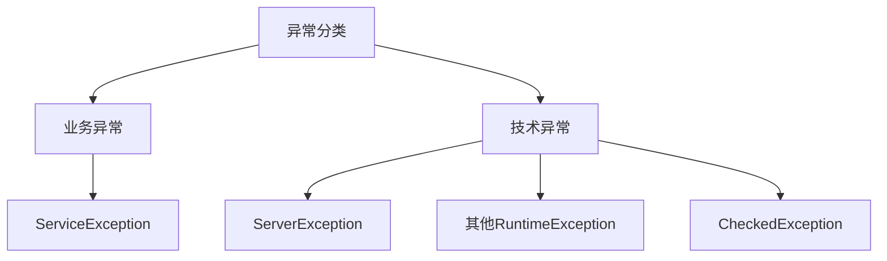
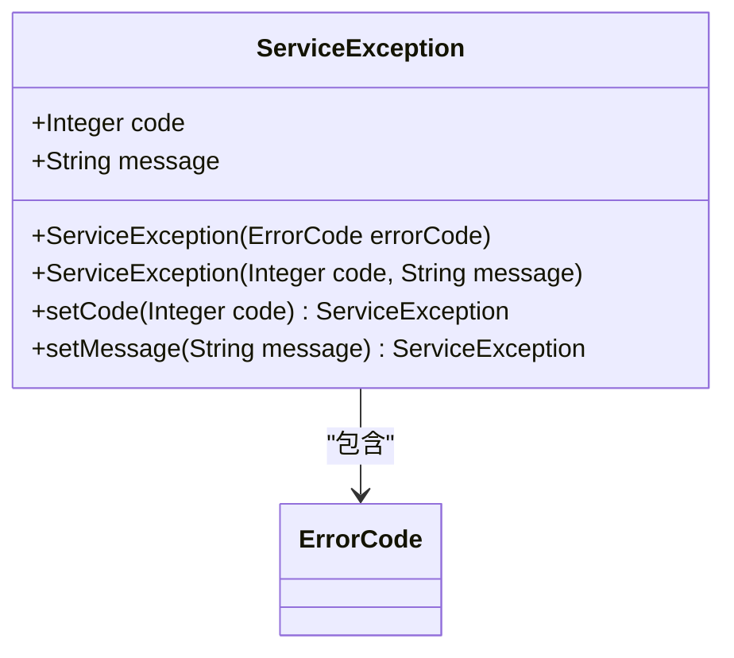
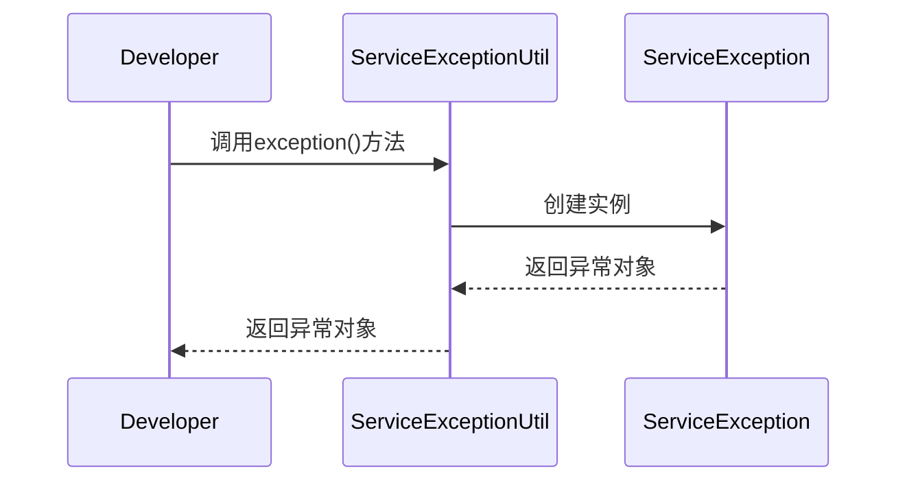
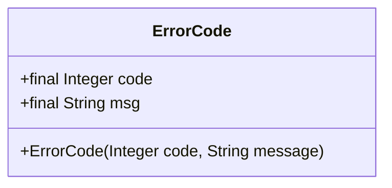
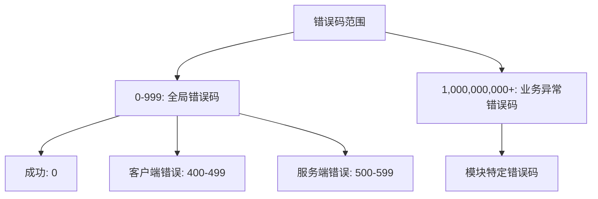
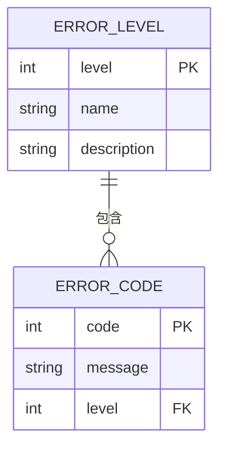
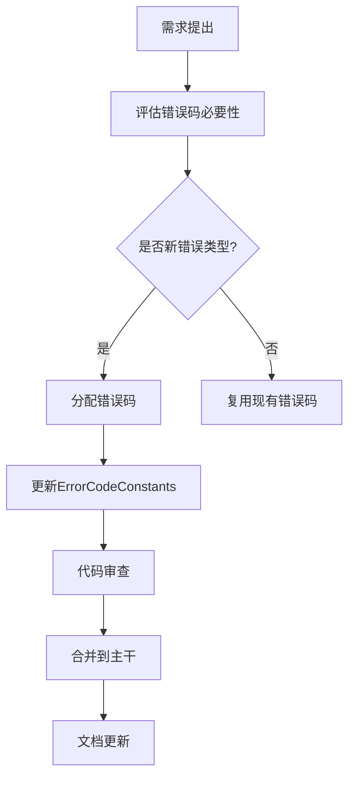
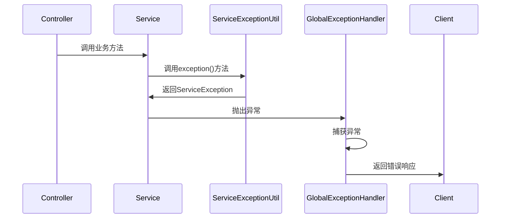

# 异常分类与处理

<cite>
**本文档引用文件**   
- [ServiceException.java](file://yudao-framework/yudao-common/src/main/java/cn/iocoder/yudao/framework/common/exception/ServiceException.java)
- [ServerException.java](file://yudao-framework/yudao-common/src/main/java/cn/iocoder/yudao/framework/common/exception/ServerException.java)
- [ErrorCode.java](file://yudao-framework/yudao-common/src/main/java/cn/iocoder/yudao/framework/common/exception/ErrorCode.java)
- [GlobalExceptionHandler.java](file://yudao-framework/yudao-spring-boot-starter-web/src/main/java/cn/iocoder/yudao/framework/web/core/handler/GlobalExceptionHandler.java)
- [ServiceExceptionUtil.java](file://yudao-framework/yudao-common/src/main/java/cn/iocoder/yudao/framework/common/exception/util/ServiceExceptionUtil.java)
- [GlobalErrorCodeConstants.java](file://yudao-framework/yudao-common/src/main/java/cn/iocoder/yudao/framework/common/exception/enums/GlobalErrorCodeConstants.java)
- [ServiceErrorCodeRange.java](file://yudao-framework/yudao-common/src/main/java/cn/iocoder/yudao/framework/common/exception/enums/ServiceErrorCodeRange.java)
- [ErrorCodeConstants.java](file://eplus-module-crm/eplus-module-crm-api/src/main/java/com/syj/eplus/module/crm/enums/ErrorCodeConstants.java)
- [ErrorCodeConstants.java](file://eplus-module-dms/eplus-module-dms-api/src/main/java/com/syj/eplus/module/dms/enums/ErrorCodeConstants.java)
</cite>

## 目录
1. [引言](#引言)
2. [异常分类体系](#异常分类体系)
3. [ServiceException设计与使用](#serviceexception设计与使用)
4. [错误码统一管理](#错误码统一管理)
5. [异常分级机制](#异常分级机制)
6. [错误码命名规范](#错误码命名规范)
7. [新业务异常定义](#新业务异常定义)
8. [总结](#总结)

## 引言

本系统采用分层异常处理机制，将异常分为业务异常与技术异常两大类。通过统一的异常处理框架，确保系统在面对各种异常情况时能够提供一致的响应和处理策略。系统核心异常处理机制基于Spring Boot框架，结合自定义异常类和全局异常处理器，实现了对异常的统一捕获、记录和响应。

**Section sources**
- [GlobalExceptionHandler.java](file://yudao-framework/yudao-spring-boot-starter-web/src/main/java/cn/iocoder/yudao/framework/web/core/handler/GlobalExceptionHandler.java#L47-L49)

## 异常分类体系

系统中的异常主要分为两大类：业务异常和技术异常。

**业务异常**是指在业务逻辑执行过程中出现的预期异常情况，如参数校验失败、业务规则违反等。这类异常通常由`ServiceException`表示，是系统正常流程的一部分，需要向用户返回明确的错误信息。

**技术异常**是指系统运行时出现的非预期异常，如数据库连接失败、网络超时、空指针等。这类异常由`ServerException`表示，通常表明系统出现了问题，需要进行故障排查和修复。



**Diagram sources**
- [ServiceException.java](file://yudao-framework/yudao-common/src/main/java/cn/iocoder/yudao/framework/common/exception/ServiceException.java#L10-L12)
- [ServerException.java](file://yudao-framework/yudao-common/src/main/java/cn/iocoder/yudao/framework/common/exception/ServerException.java#L10-L12)

**Section sources**
- [ServiceException.java](file://yudao-framework/yudao-common/src/main/java/cn/iocoder/yudao/framework/common/exception/ServiceException.java#L1-L61)
- [ServerException.java](file://yudao-framework/yudao-common/src/main/java/cn/iocoder/yudao/framework/common/exception/ServerException.java#L1-L61)

## ServiceException设计与使用

`ServiceException`是系统中处理业务异常的核心类，设计为不可变的最终类，继承自`RuntimeException`。

### 设计理念

`ServiceException`的设计遵循以下原则：
- **不可变性**：异常对象一旦创建，其状态不可更改
- **轻量级**：只包含必要的错误码和错误信息
- **可序列化**：支持网络传输和持久化
- **语义清晰**：通过错误码明确标识异常类型



**Diagram sources**
- [ServiceException.java](file://yudao-framework/yudao-common/src/main/java/cn/iocoder/yudao/framework/common/exception/ServiceException.java#L10-L60)

### 使用场景

`ServiceException`主要用于以下场景：
1. 业务规则校验失败
2. 参数验证不通过
3. 业务状态不符合预期
4. 资源不存在或已被删除
5. 权限不足或操作被拒绝

使用`ServiceExceptionUtil`工具类可以方便地创建`ServiceException`实例：



**Diagram sources**
- [ServiceExceptionUtil.java](file://yudao-framework/yudao-common/src/main/java/cn/iocoder/yudao/framework/common/exception/util/ServiceExceptionUtil.java#L48-L56)

**Section sources**
- [ServiceException.java](file://yudao-framework/yudao-common/src/main/java/cn/iocoder/yudao/framework/common/exception/ServiceException.java#L1-L61)
- [ServiceExceptionUtil.java](file://yudao-framework/yudao-common/src/main/java/cn/iocoder/yudao/framework/common/exception/util/ServiceExceptionUtil.java#L1-L128)

## 错误码统一管理

系统采用`ErrorCode`类和`ErrorCodeConstants`枚举来统一管理错误码，确保错误码的唯一性和可维护性。

### ErrorCode类设计

`ErrorCode`类是错误码的核心数据结构，包含错误码和错误信息两个属性：



**Diagram sources**
- [ErrorCode.java](file://yudao-framework/yudao-common/src/main/java/cn/iocoder/yudao/framework/common/exception/ErrorCode.java#L15-L32)

### 错误码范围划分

系统对错误码进行了明确的范围划分，避免不同模块之间的错误码冲突：



**Diagram sources**
- [GlobalErrorCodeConstants.java](file://yudao-framework/yudao-common/src/main/java/cn/iocoder/yudao/framework/common/exception/enums/GlobalErrorCodeConstants.java#L15-L41)
- [ServiceErrorCodeRange.java](file://yudao-framework/yudao-common/src/main/java/cn/iocoder/yudao/framework/common/exception/enums/ServiceErrorCodeRange.java)

### 模块错误码管理

每个业务模块都有自己的`ErrorCodeConstants`接口，用于定义该模块的错误码。例如CRM模块的错误码定义：

```java
public interface ErrorCodeConstants {
    // 客户管理相关错误码
    ErrorCode CUST_NOT_EXISTS = new ErrorCode(1_001_001_001, "客户资料不存在%s");
    ErrorCode CUST_ATTACHMENT_NOT_EXISTS = new ErrorCode(1_001_001_002, "客户附件信息不存在");
    
    // 潜在客户相关错误码  
    ErrorCode CLUE_NOT_EXISTS = new ErrorCode(1_001_002_001, "潜在客户资料不存在");
}
```

这种设计确保了错误码的模块化和可扩展性。

**Section sources**
- [ErrorCodeConstants.java](file://eplus-module-crm/eplus-module-crm-api/src/main/java/com/syj/eplus/module/crm/enums/ErrorCodeConstants.java#L1-L123)
- [ErrorCodeConstants.java](file://eplus-module-dms/eplus-module-dms-api/src/main/java/com/syj/eplus/module/dms/enums/ErrorCodeConstants.java#L1-L121)

## 异常分级机制

系统通过错误码的数值范围来实现异常的分级管理，不同级别的异常对应不同的处理策略。

### 异常级别划分

| 错误码范围 | 级别 | 处理策略 |
|----------|------|---------|
| 0 | INFO | 操作成功，无需特殊处理 |
| 400-499 | WARN | 客户端错误，提示用户修正 |
| 500-599 | ERROR | 服务端错误，记录日志并告警 |
| 900-999 | CRITICAL | 系统级错误，立即告警并处理 |



### 不同级别异常的处理策略

**INFO级别**（错误码0）：
- 表示操作成功
- 不需要特殊处理
- 可以选择性记录审计日志

**WARN级别**（400-499）：
- 表示客户端请求错误
- 向用户返回明确的错误信息
- 记录警告日志
- 不触发告警系统

**ERROR级别**（500-599）：
- 表示服务端处理错误
- 记录详细的错误日志
- 触发监控告警
- 返回通用的系统错误信息

**CRITICAL级别**（900-999）：
- 表示系统关键功能异常
- 立即触发严重告警
- 记录完整的错误上下文
- 可能需要人工干预

**Section sources**
- [GlobalErrorCodeConstants.java](file://yudao-framework/yudao-common/src/main/java/cn/iocoder/yudao/framework/common/exception/enums/GlobalErrorCodeConstants.java#L15-L41)
- [GlobalExceptionHandler.java](file://yudao-framework/yudao-spring-boot-starter-web/src/main/java/cn/iocoder/yudao/framework/web/core/handler/GlobalExceptionHandler.java#L249-L269)

## 错误码命名规范

为了确保错误码的可读性和可维护性，系统制定了统一的命名规范。

### 命名规则

1. **前缀规范**：使用模块缩写作为前缀
   - CRM：客户关系管理
   - DMS：文档管理系统
   - FMS：财务管理

2. **语义化命名**：使用大写下划线格式，清晰表达错误含义
   - `CUST_NOT_EXISTS`：客户不存在
   - `INVALID_PARAMETER`：参数无效
   - `PERMISSION_DENIED`：权限拒绝

3. **占位符使用**：对于需要动态信息的错误消息，使用%s作为占位符
   ```java
   ErrorCode CUST_NOT_EXISTS = new ErrorCode(1_001_001_001, "客户资料不存在%s");
   ```

### 管理流程

错误码的管理遵循以下流程：



**Section sources**
- [ErrorCodeConstants.java](file://eplus-module-crm/eplus-module-crm-api/src/main/java/com/syj/eplus/module/crm/enums/ErrorCodeConstants.java#L1-L123)
- [ErrorCode.java](file://yudao-framework/yudao-common/src/main/java/cn/iocoder/yudao/framework/common/exception/ErrorCode.java#L1-L33)

## 新业务异常定义

当需要定义新的业务异常类型时，应遵循以下步骤：

### 定义步骤

1. **确定错误码范围**：根据所属模块确定错误码前缀
2. **选择错误级别**：根据异常严重程度选择适当的错误码范围
3. **定义错误码常量**：在相应模块的`ErrorCodeConstants`中添加新的错误码
4. **使用异常工具类**：通过`ServiceExceptionUtil`抛出异常

### 集成到异常处理框架

新定义的业务异常会自动被`GlobalExceptionHandler`捕获和处理：



**Diagram sources**
- [GlobalExceptionHandler.java](file://yudao-framework/yudao-spring-boot-starter-web/src/main/java/cn/iocoder/yudao/framework/web/core/handler/GlobalExceptionHandler.java#L225-L229)

### 示例：定义新的CRM业务异常

```java
// 在CRM模块的ErrorCodeConstants中添加
public interface ErrorCodeConstants {
    // ... existing codes
    ErrorCode CUST_NAME_EXISTS = new ErrorCode(1_001_004_002, "客户名称已经存在！");
}

// 在业务逻辑中使用
if (customerExists(name)) {
    throw ServiceExceptionUtil.exception(ErrorCodeConstants.CUST_NAME_EXISTS, name);
}
```

**Section sources**
- [ErrorCodeConstants.java](file://eplus-module-crm/eplus-module-crm-api/src/main/java/com/syj/eplus/module/crm/enums/ErrorCodeConstants.java#L63)
- [ServiceExceptionUtil.java](file://yudao-framework/yudao-common/src/main/java/cn/iocoder/yudao/framework/common/exception/util/ServiceExceptionUtil.java#L48-L56)

## 总结

本系统的异常处理体系通过`ServiceException`和`ServerException`的区分，实现了业务异常与技术异常的有效分离。通过`ErrorCode`类和`ErrorCodeConstants`枚举，实现了错误码的统一管理和模块化组织。异常分级机制确保了不同严重程度的异常能够得到适当的处理。统一的命名规范和管理流程保证了团队协作的一致性。开发者可以通过遵循既定的模式，轻松地定义和集成新的业务异常类型，确保系统的健壮性和可维护性。