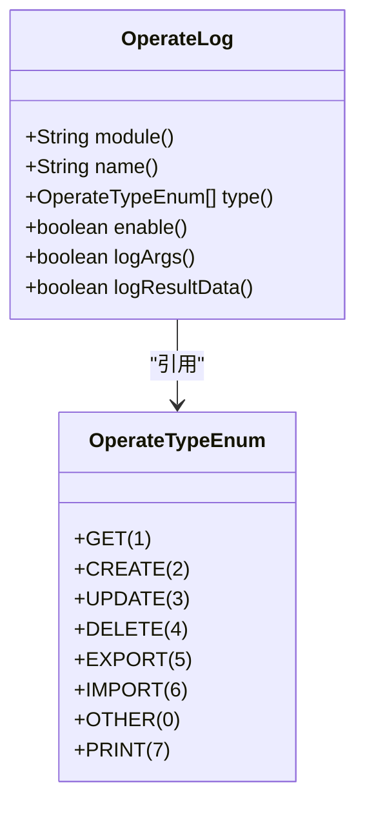
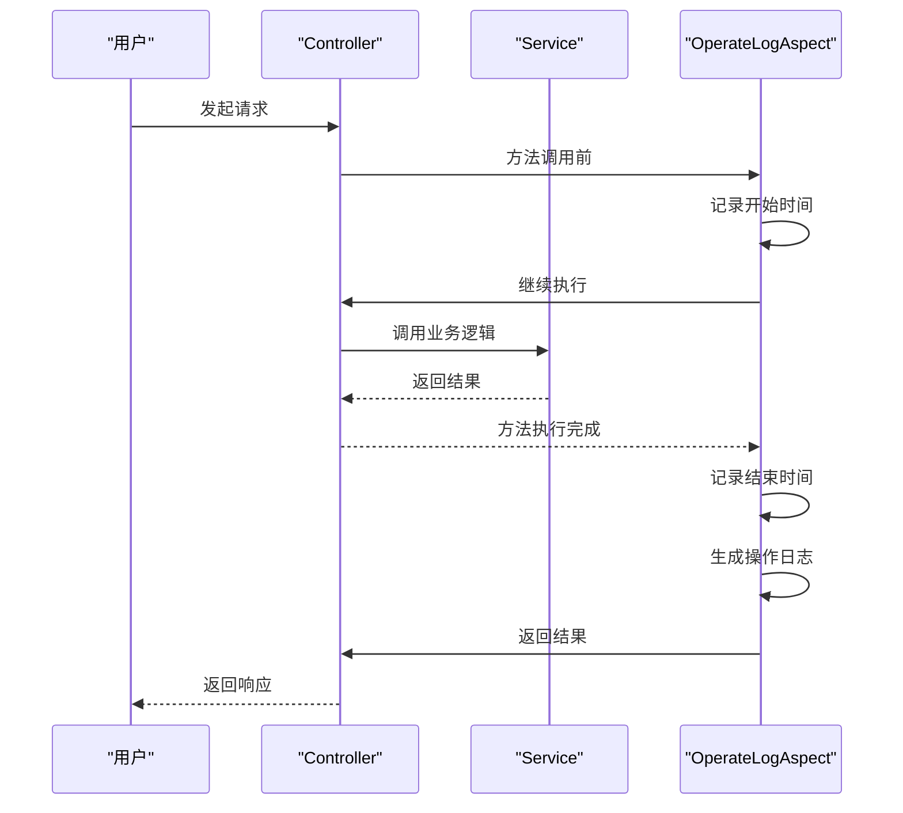
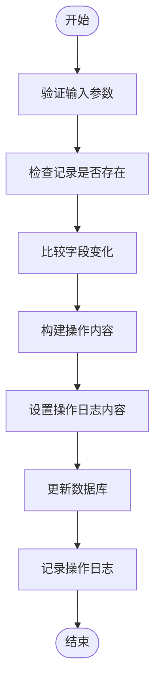
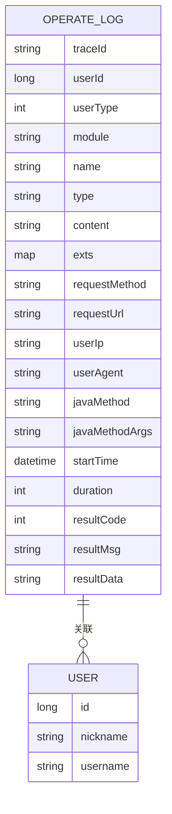
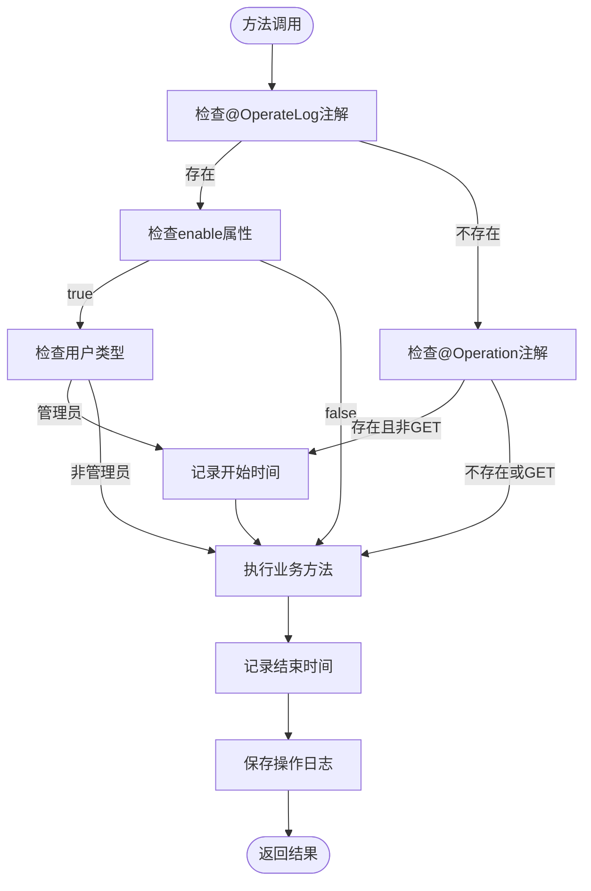
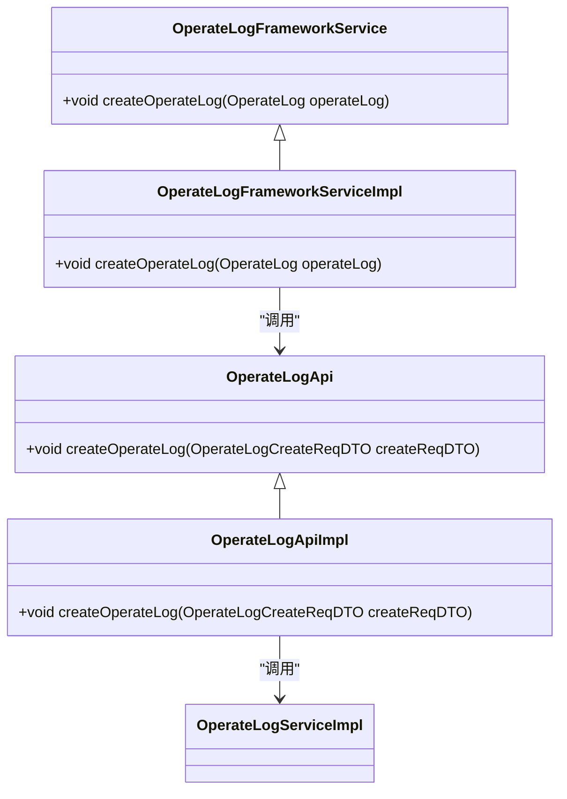

# @OperateLog注解使用

<cite>
**本文档引用的文件**   
- [OperateLog.java](file://yudao-framework/yudao-spring-boot-starter-operatelog/src/main/java/cn/iocoder/yudao/framework/operatelog/core/annotations/OperateLog.java)
- [OperateLogAspect.java](file://yudao-framework/yudao-spring-boot-starter-operatelog/src/main/java/cn/iocoder/yudao/framework/operatelog/core/aop/OperateLogAspect.java)
- [OperateTypeEnum.java](file://yudao-framework/yudao-spring-boot-starter-operatelog/src/main/java/cn/iocoder/yudao/framework/operatelog/core/enums/OperateTypeEnum.java)
- [OperateLogUtils.java](file://yudao-framework/yudao-spring-boot-starter-operatelog/src/main/java/cn/iocoder/yudao/framework/operatelog/core/util/OperateLogUtils.java)
- [CrmCategoryController.java](file://eplus-module-crm/eplus-module-crm-biz/src/main/java/com/syj/eplus/module/crm/controller/admin/category/CrmCategoryController.java)
- [OperateLogDO.java](file://yudao-module-system/yudao-module-system-biz/src/main/java/cn/iocoder/yudao/module/system/dal/dataobject/logger/OperateLogDO.java)
- [OperateLogServiceImpl.java](file://yudao-module-system/yudao-module-system-biz/src/main/java/cn/iocoder/yudao/module/system/service/logger/OperateLogServiceImpl.java)
</cite>

## 目录
1. [简介](#简介)
2. [@OperateLog注解属性详解](#operateLog注解属性详解)
3. [Controller层使用方法](#controller层使用方法)
4. [Service层使用方法](#service层使用方法)
5. [不同业务场景示例](#不同业务场景示例)
6. [注解继承特性与AOP处理机制](#注解继承特性与aop处理机制)
7. [自定义操作类型与日志模板](#自定义操作类型与日志模板)
8. [总结](#总结)

## 简介
`@OperateLog`注解是系统中用于记录操作日志的核心组件，通过在Controller或Service方法上添加该注解，可以自动记录用户的操作行为。该注解结合AOP切面实现了对方法调用的拦截，能够捕获操作的详细信息并持久化到数据库中。本文档将详细介绍该注解的各个属性、使用方法以及在不同业务场景下的应用。

**文档来源**
- [OperateLog.java](file://yudao-framework/yudao-spring-boot-starter-operatelog/src/main/java/cn/iocoder/yudao/framework/operatelog/core/annotations/OperateLog.java#L1-L57)

## @OperateLog注解属性详解
`@OperateLog`注解提供了多个属性来配置操作日志的记录行为：

**模块字段**

- **module**: 操作模块名称。当该属性为空时，会尝试读取`@Tag`注解的`name`属性作为模块名称。
- **name**: 操作名称。当该属性为空时，会尝试读取`@Operation`注解的`summary`属性作为操作名称。
- **type**: 操作类型，使用`OperateTypeEnum`枚举定义，包括创建、更新、删除、导出、导入等类型。

**开关字段**

- **enable**: 是否启用操作日志记录，默认为`true`。设置为`false`时强制不记录日志。
- **logArgs**: 是否记录方法参数，默认为`true`。
- **logResultData**: 是否记录方法返回结果数据，默认为`true`。



**图示来源**
- [OperateLog.java](file://yudao-framework/yudao-spring-boot-starter-operatelog/src/main/java/cn/iocoder/yudao/framework/operatelog/core/annotations/OperateLog.java#L17-L57)
- [OperateTypeEnum.java](file://yudao-framework/yudao-spring-boot-starter-operatelog/src/main/java/cn/iocoder/yudao/framework/operatelog/core/enums/OperateTypeEnum.java#L14-L58)

**章节来源**
- [OperateLog.java](file://yudao-framework/yudao-spring-boot-starter-operatelog/src/main/java/cn/iocoder/yudao/framework/operatelog/core/annotations/OperateLog.java#L17-L57)
- [OperateTypeEnum.java](file://yudao-framework/yudao-spring-boot-starter-operatelog/src/main/java/cn/iocoder/yudao/framework/operatelog/core/enums/OperateTypeEnum.java#L14-L58)

## Controller层使用方法
在Controller层使用`@OperateLog`注解是最常见的场景，通常与`@Operation`注解配合使用。以下是一个典型的使用示例：

```java
@GetMapping("/export-excel")
@Operation(summary = "导出客户分类 Excel")
@PreAuthorize("@ss.hasPermission('crm:category:export')")
@OperateLog(type = EXPORT)
public void exportCategoryExcel(@Valid CrmCategoryPageReqVO pageReqVO,
                                HttpServletResponse response) throws IOException {
    pageReqVO.setPageSize(PageParam.PAGE_SIZE_NONE);
    List<CrmCategoryRespVO> list = categoryService.getCategoryPage(pageReqVO).getList();
    // 导出 Excel
    ExcelUtils.write(response, "客户分类.xls", "数据", CrmCategoryRespVO.class, list);
}
```

在上述示例中：
- `@Operation(summary = "导出客户分类 Excel")`定义了操作的摘要信息
- `@OperateLog(type = EXPORT)`指定了操作类型为"导出"
- 系统会自动从`@Operation`注解中提取操作名称
- 系统会自动从`@Tag`注解中提取操作模块

当方法被调用时，AOP切面会拦截该方法，记录操作日志，包括操作人、操作时间、请求参数、执行结果等信息。



**图示来源**
- [CrmCategoryController.java](file://eplus-module-crm/eplus-module-crm-biz/src/main/java/com/syj/eplus/module/crm/controller/admin/category/CrmCategoryController.java#L90-L102)
- [OperateLogAspect.java](file://yudao-framework/yudao-spring-boot-starter-operatelog/src/main/java/cn/iocoder/yudao/framework/operatelog/core/aop/OperateLogAspect.java#L54-L207)

**章节来源**
- [CrmCategoryController.java](file://eplus-module-crm/eplus-module-crm-biz/src/main/java/com/syj/eplus/module/crm/controller/admin/category/CrmCategoryController.java#L90-L102)
- [OperateLogAspect.java](file://yudao-framework/yudao-spring-boot-starter-operatelog/src/main/java/cn/iocoder/yudao/framework/operatelog/core/aop/OperateLogAspect.java#L54-L207)

## Service层使用方法
虽然`@OperateLog`注解主要用于Controller层，但在某些复杂的业务场景下，也可以在Service层使用。通过`OperateLogUtils`工具类，可以在Service方法中手动记录操作日志的详细内容。

```java
public class OperateLogUtils {
    public static void addOperateLog(List<ChangeRecord> changeRecords,String operateKey,String code){
        if (CollUtil.isNotEmpty(changeRecords)) {
            OperateCompareUtil<Object> operateCompareUtil = new OperateCompareUtil<>();
            AtomicReference<String> content = new AtomicReference<>();
            changeRecords.forEach(s -> {
                content.set(operateCompareUtil.apply(content.get(), s.getFieldName(), s.getOldValue(), s.getValue(), ChangeRecordTypeEnum.GENERAL_CHANGE.getType()));
            });
            OperateLogUtils.setContent(content.get());
        }
        OperateLogUtils.addExt(operateKey, code);
    }
    
    public static void setContent(String content) {
        OperateLogAspect.setContent(content);
    }

    public static void addExt(String key, Object value) {
        OperateLogAspect.addExt(key, value);
    }
}
```

在Service层使用时，可以通过`OperateLogUtils`设置操作内容和扩展字段。例如，在更新实体对象时，可以记录字段的变化情况：



**图示来源**
- [OperateLogUtils.java](file://yudao-framework/yudao-spring-boot-starter-operatelog/src/main/java/cn/iocoder/yudao/framework/operatelog/core/util/OperateLogUtils.java#L1-L44)
- [OperateLogAspect.java](file://yudao-framework/yudao-spring-boot-starter-operatelog/src/main/java/cn/iocoder/yudao/framework/operatelog/core/aop/OperateLogAspect.java#L63-L69)

**章节来源**
- [OperateLogUtils.java](file://yudao-framework/yudao-spring-boot-starter-operatelog/src/main/java/cn/iocoder/yudao/framework/operatelog/core/util/OperateLogUtils.java#L1-L44)
- [OperateLogAspect.java](file://yudao-framework/yudao-spring-boot-starter-operatelog/src/main/java/cn/iocoder/yudao/framework/operatelog/core/aop/OperateLogAspect.java#L63-L69)

## 不同业务场景示例
### 创建操作
在创建资源时，使用`CREATE`操作类型：

```java
@PostMapping("/create")
@Operation(summary = "创建客户分类")
@PreAuthorize("@ss.hasPermission('crm:category:create')")
@OperateLog(type = CREATE)
public CommonResult<Long> createCategory(@Valid @RequestBody CrmCategorySaveReqVO createReqVO) {
    return success(categoryService.createCategory(createReqVO));
}
```

### 更新操作
在更新资源时，使用`UPDATE`操作类型：

```java
@PutMapping("/update")
@Operation(summary = "更新客户分类")
@PreAuthorize("@ss.hasPermission('crm:category:update')")
@OperateLog(type = UPDATE)
public CommonResult<Boolean> updateCategory(@Valid @RequestBody CrmCategorySaveReqVO updateReqVO) {
    categoryService.updateCategory(updateReqVO);
    return success(true);
}
```

### 删除操作
在删除资源时，使用`DELETE`操作类型：

```java
@DeleteMapping("/delete")
@Operation(summary = "删除客户分类")
@PreAuthorize("@ss.hasPermission('crm:category:delete')")
@OperateLog(type = DELETE)
public CommonResult<Boolean> deleteCategory(@RequestParam("id") Long id) {
    categoryService.deleteCategory(id);
    return success(true);
}
```

### 导出操作
在导出数据时，使用`EXPORT`操作类型：

```java
@GetMapping("/export-excel")
@Operation(summary = "导出客户分类 Excel")
@PreAuthorize("@ss.hasPermission('crm:category:export')")
@OperateLog(type = EXPORT)
public void exportCategoryExcel(@Valid CrmCategoryPageReqVO pageReqVO,
                                HttpServletResponse response) throws IOException {
    // 导出逻辑
}
```

### 导入操作
在导入数据时，使用`IMPORT`操作类型：

```java
@PostMapping("/import-excel")
@Operation(summary = "导入客户分类 Excel")
@PreAuthorize("@ss.hasPermission('crm:category:import')")
@OperateLog(type = IMPORT)
public CommonResult<ImportResultVO> importCategoryExcel(@RequestParam("file") MultipartFile file) throws Exception {
    // 导入逻辑
}
```



**图示来源**
- [OperateLogDO.java](file://yudao-module-system/yudao-module-system-biz/src/main/java/cn/iocoder/yudao/module/system/dal/dataobject/logger/OperateLogDO.java#L22-L143)
- [OperateLogServiceImpl.java](file://yudao-module-system/yudao-module-system-biz/src/main/java/cn/iocoder/yudao/module/system/service/logger/OperateLogServiceImpl.java#L41-L95)

**章节来源**
- [OperateLogDO.java](file://yudao-module-system/yudao-module-system-biz/src/main/java/cn/iocoder/yudao/module/system/dal/dataobject/logger/OperateLogDO.java#L22-L143)
- [OperateLogServiceImpl.java](file://yudao-module-system/yudao-module-system-biz/src/main/java/cn/iocoder/yudao/module/system/service/logger/OperateLogServiceImpl.java#L41-L95)

## 注解继承特性与AOP处理机制
`@OperateLog`注解的处理机制基于Spring AOP实现，通过`OperateLogAspect`切面类拦截带有该注解的方法调用。处理机制如下：

1. **拦截条件**：满足以下任一条件时会记录操作日志：
   - 使用`@Operation`注解且非`@GetMapping`请求
   - 使用`@OperateLog`注解

2. **强制禁用**：如果`@OperateLog`注解的`enable`属性设置为`false`，则强制不记录日志。

3. **用户类型检查**：目前只有管理员用户才会记录操作日志。

4. **模块和名称填充**：如果`module`或`name`属性为空，会尝试从`@Tag`或`@Operation`注解中获取相应值。



**图示来源**
- [OperateLogAspect.java](file://yudao-framework/yudao-spring-boot-starter-operatelog/src/main/java/cn/iocoder/yudao/framework/operatelog/core/aop/OperateLogAspect.java#L54-L207)
- [YudaoOperateLogAutoConfiguration.java](file://yudao-framework/yudao-spring-boot-starter-operatelog/src/main/java/cn/iocoder/yudao/framework/operatelog/config/YudaoOperateLogAutoConfiguration.java#L1-L24)

**章节来源**
- [OperateLogAspect.java](file://yudao-framework/yudao-spring-boot-starter-operatelog/src/main/java/cn/iocoder/yudao/framework/operatelog/core/aop/OperateLogAspect.java#L54-L207)
- [YudaoOperateLogAutoConfiguration.java](file://yudao-framework/yudao-spring-boot-starter-operatelog/src/main/java/cn/iocoder/yudao/framework/operatelog/config/YudaoOperateLogAutoConfiguration.java#L1-L24)

## 自定义操作类型与日志模板
### 自定义操作类型
虽然系统提供了预定义的操作类型枚举`OperateTypeEnum`，但在某些特殊业务场景下，可以通过`OTHER`类型结合`name`属性来实现自定义操作类型：

```java
@OperateLog(type = OTHER, name = "批量审核客户")
public CommonResult<Boolean> batchAuditCustomers(@RequestBody BatchAuditReqVO reqVO) {
    // 批量审核逻辑
}
```

### 自定义日志内容模板
通过`OperateLogUtils`工具类，可以自定义操作日志的内容模板。例如，在更新操作中记录字段变化：

```java
public void updateCategory(CrmCategorySaveReqVO updateReqVO) {
    // 获取更新前的实体
    CrmCategoryDO oldEntity = getCategory(updateReqVO.getId());
    // 执行更新
    CrmCategoryDO updateObj = BeanUtils.toBean(updateReqVO, CrmCategoryDO.class);
    crmCategoryMapper.updateById(updateObj);
    // 记录字段变化
    List<ChangeRecord> changeRecords = compareFields(oldEntity, updateObj);
    OperateLogUtils.addOperateLog(changeRecords, "categoryId", updateReqVO.getId().toString());
}
```

这种方式可以生成更详细的日志内容，如："修改了客户分类[电子产品]，将名称从'电子产品'改为'消费电子'，将代码从'EL001'改为'CE001'"。



**图示来源**
- [OperateLogFrameworkService.java](file://yudao-framework/yudao-spring-boot-starter-operatelog/src/main/java/cn/iocoder/yudao/framework/operatelog/core/service/OperateLogFrameworkService.java#L8-L17)
- [OperateLogFrameworkServiceImpl.java](file://yudao-framework/yudao-spring-boot-starter-operatelog/src/main/java/cn/iocoder/yudao/framework/operatelog/core/service/OperateLogFrameworkServiceImpl.java)
- [OperateLogApi.java](file://yudao-module-system/yudao-module-system-api/src/main/java/cn/iocoder/yudao/module/system/api/logger/OperateLogApi.java)
- [OperateLogApiImpl.java](file://yudao-module-system/yudao-module-system-biz/src/main/java/cn/iocoder/yudao/module/system/api/logger/OperateLogApiImpl.java)

**章节来源**
- [OperateLogFrameworkService.java](file://yudao-framework/yudao-spring-boot-starter-operatelog/src/main/java/cn/iocoder/yudao/framework/operatelog/core/service/OperateLogFrameworkService.java#L8-L17)
- [OperateLogFrameworkServiceImpl.java](file://yudao-framework/yudao-spring-boot-starter-operatelog/src/main/java/cn/iocoder/yudao/framework/operatelog/core/service/OperateLogFrameworkServiceImpl.java)
- [OperateLogApi.java](file://yudao-module-system/yudao-module-system-api/src/main/java/cn/iocoder/yudao/module/system/api/logger/OperateLogApi.java)
- [OperateLogApiImpl.java](file://yudao-module-system/yudao-module-system-biz/src/main/java/cn/iocoder/yudao/module/system/api/logger/OperateLogApiImpl.java)

## 总结
`@OperateLog`注解是系统操作日志功能的核心，通过简单的注解配置即可实现全面的操作记录。在使用时应注意：

1. **合理选择操作类型**：根据业务场景选择合适的`OperateTypeEnum`值
2. **充分利用自动填充**：通过`@Tag`和`@Operation`注解减少重复配置
3. **控制日志粒度**：避免过度记录查询操作，以免产生大量无意义的日志
4. **利用工具类增强**：在需要详细记录字段变化时，使用`OperateLogUtils`工具类
5. **考虑性能影响**：对于高频调用的接口，评估是否需要记录操作日志

通过合理使用`@OperateLog`注解，可以有效提升系统的可追溯性和安全性，为后续的审计、问题排查和数据分析提供有力支持。