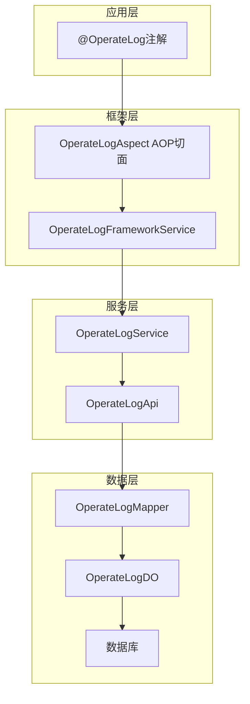
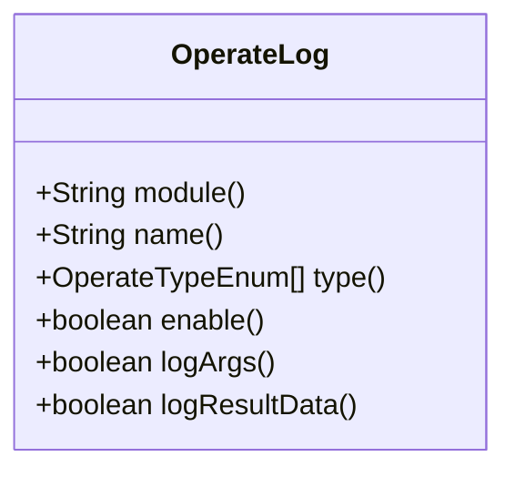
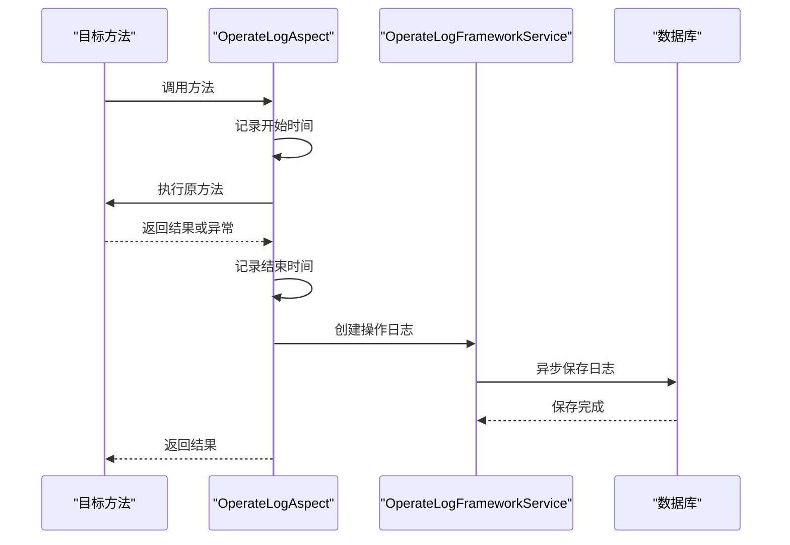
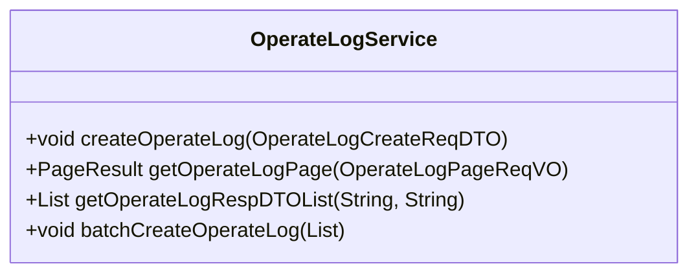
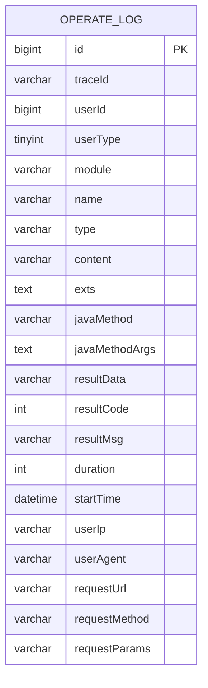
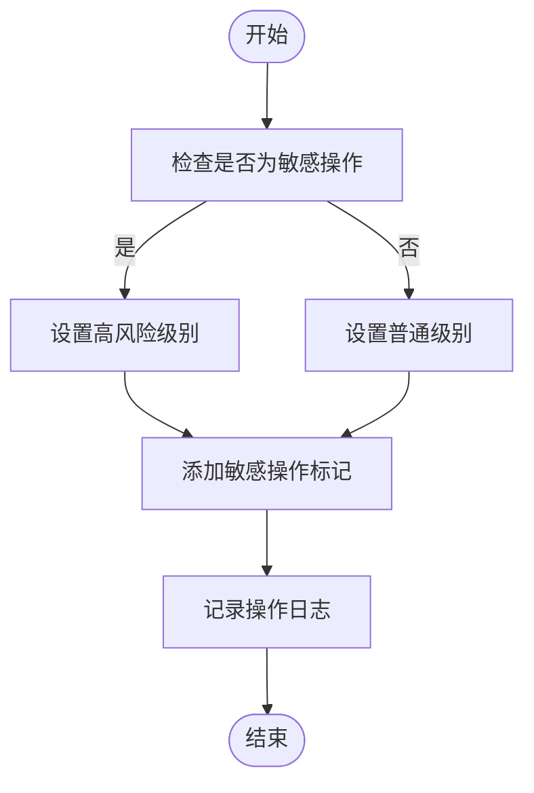
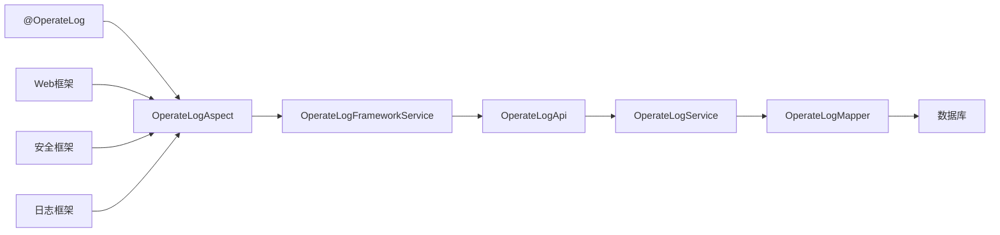

# 操作审计

<cite>
**本文档引用的文件**
- [OperateLog.java](file://yudao-framework/yudao-spring-boot-starter-operatelog/src/main/java/cn/iocoder/yudao/framework/operatelog/core/annotations/OperateLog.java)
- [OperateLogAspect.java](file://yudao-framework/yudao-spring-boot-starter-operatelog/src/main/java/cn/iocoder/yudao/framework/operatelog/core/aop/OperateLogAspect.java)
- [OperateLogFrameworkServiceImpl.java](file://yudao-framework/yudao-spring-boot-starter-operatelog/src/main/java/cn/iocoder/yudao/framework/operatelog/core/service/OperateLogFrameworkServiceImpl.java)
- [OperateLogDO.java](file://yudao-module-system/yudao-module-system-biz/src/main/java/cn/iocoder/yudao/module/system/dal/dataobject/logger/OperateLogDO.java)
- [OperateLogMapper.java](file://yudao-module-system/yudao-module-system-biz/src/main/java/cn/iocoder/yudao/module/system/dal/mysql/logger/OperateLogMapper.java)
- [OperateLogService.java](file://yudao-module-system/yudao-module-system-biz/src/main/java/cn/iocoder/yudao/module/system/service/logger/OperateLogService.java)
- [OperateLogApi.java](file://yudao-module-system/yudao-module-system-api/src/main/java/cn/iocoder/yudao/module/system/api/logger/OperateLogApi.java)
- [OperateLogCreateReqDTO.java](file://yudao-module-system/yudao-module-system-api/src/main/java/cn/iocoder/yudao/module/system/api/logger/dto/OperateLogCreateReqDTO.java)
- [OperateLogController.java](file://yudao-module-system/yudao-module-system-biz/src/main/java/cn/iocoder/yudao/module/system/controller/admin/logger/OperateLogController.java)
</cite>

## 目录
1. [简介](#简介)
2. [核心组件](#核心组件)
3. [架构概览](#架构概览)
4. [详细组件分析](#详细组件分析)
5. [依赖分析](#依赖分析)
6. [性能考虑](#性能考虑)
7. [故障排除指南](#故障排除指南)
8. [结论](#结论)

## 简介
本文档详细说明了系统中操作审计功能的实现机制，重点介绍@OperateLog注解的使用方法、操作日志的拦截机制和AOP实现原理。文档涵盖了操作日志的数据结构设计、性能优化策略以及开发者如何在自定义服务中添加操作审计点的指导。同时，也包含了操作日志的查询接口和分析工具使用说明。

## 核心组件

操作审计系统由多个核心组件构成，包括@OperateLog注解、AOP切面、服务层和数据访问层。这些组件协同工作，实现了完整的操作日志记录和查询功能。

**组件来源**
- [OperateLog.java](file://yudao-framework/yudao-spring-boot-starter-operatelog/src/main/java/cn/iocoder/yudao/framework/operatelog/core/annotations/OperateLog.java)
- [OperateLogAspect.java](file://yudao-framework/yudao-spring-boot-starter-operatelog/src/main/java/cn/iocoder/yudao/framework/operatelog/core/aop/OperateLogAspect.java)
- [OperateLogDO.java](file://yudao-module-system/yudao-module-system-biz/src/main/java/cn/iocoder/yudao/module/system/dal/dataobject/logger/OperateLogDO.java)

## 架构概览

操作审计系统采用分层架构设计，从注解到数据存储形成完整的日志记录链路。

**图示来源**
- [OperateLogAspect.java](file://yudao-framework/yudao-spring-boot-starter-operatelog/src/main/java/cn/iocoder/yudao/framework/operatelog/core/aop/OperateLogAspect.java)
- [OperateLogFrameworkServiceImpl.java](file://yudao-framework/yudao-spring-boot-starter-operatelog/src/main/java/cn/iocoder/yudao/framework/operatelog/core/service/OperateLogFrameworkServiceImpl.java)
- [OperateLogService.java](file://yudao-module-system/yudao-module-system-biz/src/main/java/cn/iocoder/yudao/module/system/service/logger/OperateLogService.java)

## 详细组件分析

### @OperateLog注解分析

@OperateLog注解是操作审计的入口，用于标记需要记录操作日志的方法。

**图示来源**
- [OperateLog.java](file://yudao-framework/yudao-spring-boot-starter-operatelog/src/main/java/cn/iocoder/yudao/framework/operatelog/core/annotations/OperateLog.java)

#### 注解参数说明
- **module**: 操作模块，为空时会尝试读取@Tag注解的name属性
- **name**: 操作名，为空时会尝试读取@Operation注解的summary属性
- **type**: 操作分类，定义操作的类型
- **enable**: 是否启用操作日志记录
- **logArgs**: 是否记录方法参数
- **logResultData**: 是否记录方法返回结果

### 操作日志AOP实现分析

OperateLogAspect是操作日志的核心实现，通过AOP技术拦截标记了@OperateLog注解的方法。

**图示来源**
- [OperateLogAspect.java](file://yudao-framework/yudao-spring-boot-starter-operatelog/src/main/java/cn/iocoder/yudao/framework/operatelog/core/aop/OperateLogAspect.java)
- [OperateLogFrameworkServiceImpl.java](file://yudao-framework/yudao-spring-boot-starter-operatelog/src/main/java/cn/iocoder/yudao/framework/operatelog/core/service/OperateLogFrameworkServiceImpl.java)

#### 拦截机制说明
操作日志的拦截机制遵循以下规则：
1. 当方法使用@OperateLog注解时，无论HTTP方法类型都会记录日志
2. 当方法使用@Operation注解且非@GetMapping请求时，会自动记录日志
3. 如果@OperateLog注解的enable属性设置为false，则强制不记录日志
4. 目前只有管理员用户类型才会记录操作日志

### OperateLogService分析

OperateLogService负责处理操作日志的业务逻辑，包括日志的创建和查询。

**图示来源**
- [OperateLogService.java](file://yudao-module-system/yudao-module-system-biz/src/main/java/cn/iocoder/yudao/module/system/service/logger/OperateLogService.java)
- [OperateLogServiceImpl.java](file://yudao-module-system/yudao-module-system-biz/src/main/java/cn/iocoder/yudao/module/system/service/logger/OperateLogServiceImpl.java)

#### 日志记录流程
1. 获取当前登录用户信息并设置到日志对象
2. 补充请求相关信息（如traceId、IP地址等）
3. 记录方法执行信息（方法名、参数、返回结果等）
4. 计算方法执行时长
5. 处理结果码和结果消息（正常情况或异常情况）
6. 调用数据访问层保存日志

### 数据结构设计分析

操作日志的数据结构设计考虑了性能和查询效率。

**图示来源**
- [OperateLogDO.java](file://yudao-module-system/yudao-module-system-biz/src/main/java/cn/iocoder/yudao/module/system/dal/dataobject/logger/OperateLogDO.java)
- [OperateLogMapper.java](file://yudao-module-system/yudao-module-system-biz/src/main/java/cn/iocoder/yudao/module/system/dal/mysql/logger/OperateLogMapper.java)

#### 字段说明
- **id**: 主键
- **traceId**: 链路追踪ID，用于关联分布式调用
- **userId/userType**: 操作用户ID和类型
- **module/name/type**: 操作模块、名称和类型
- **content/exts**: 操作内容和扩展字段
- **javaMethod/javaMethodArgs**: Java方法签名和参数
- **resultData/resultCode/resultMsg**: 执行结果数据、代码和消息
- **duration**: 执行时长（毫秒）
- **startTime**: 开始时间
- **userIp/userAgent**: 用户IP和代理信息
- **requestUrl/requestMethod/requestParams**: 请求URL、方法和参数

### 敏感操作审计配置

对于权限变更、数据删除等敏感操作，系统提供了特殊的审计配置。

**图示来源**
- [OperateLogAspect.java](file://yudao-framework/yudao-spring-boot-starter-operatelog/src/main/java/cn/iocoder/yudao/framework/operatelog/core/aop/OperateLogAspect.java)
- [OperateLogUtils.java](file://yudao-framework/yudao-spring-boot-starter-operatelog/src/main/java/cn/iocoder/yudao/framework/operatelog/core/util/OperateLogUtils.java)

#### 配置策略
1. 通过OperateTypeEnum枚举定义敏感操作类型
2. 在@OperateLog注解中指定type为敏感操作类型
3. 系统自动为敏感操作添加特殊标记
4. 支持通过扩展字段(exts)记录敏感操作的额外信息

## 依赖分析

操作审计系统与其他组件存在明确的依赖关系。

**图示来源**
- [OperateLogAspect.java](file://yudao-framework/yudao-spring-boot-starter-operatelog/src/main/java/cn/iocoder/yudao/framework/operatelog/core/aop/OperateLogAspect.java)
- [OperateLogFrameworkServiceImpl.java](file://yudao-framework/yudao-spring-boot-starter-operatelog/src/main/java/cn/iocoder/yudao/framework/operatelog/core/service/OperateLogFrameworkServiceImpl.java)

## 性能考虑

操作审计系统在设计时充分考虑了性能影响。

### 异步处理机制
操作日志采用异步方式记录，避免阻塞主业务流程：
- 使用@Async注解实现异步调用
- 日志记录在独立线程中执行
- 主业务流程不受日志记录影响

### 数据截断策略
为防止日志数据过大影响性能：
- 方法参数和结果数据有最大长度限制
- 超长数据会被自动截断
- 关键字段如resultCode、resultMsg等保持完整

### 查询优化
- 对常用查询字段建立索引
- 支持按时间范围、用户ID、操作类型等条件查询
- 提供分页查询接口，避免一次性加载过多数据

**组件来源**
- [OperateLogServiceImpl.java](file://yudao-module-system/yudao-module-system-biz/src/main/java/cn/iocoder/yudao/module/system/service/logger/OperateLogServiceImpl.java)
- [OperateLogMapper.java](file://yudao-module-system/yudao-module-system-biz/src/main/java/cn/iocoder/yudao/module/system/dal/mysql/logger/OperateLogMapper.java)

## 故障排除指南

### 常见问题及解决方案
1. **日志未记录**
   - 检查是否为管理员用户
   - 确认@OperateLog注解的enable属性是否为true
   - 检查方法是否被AOP正确拦截

2. **日志内容不完整**
   - 检查logArgs和logResultData属性设置
   - 确认方法参数和返回结果是否可序列化
   - 检查是否有数据截断情况

3. **性能问题**
   - 检查异步线程池配置
   - 确认数据库写入性能
   - 分析是否有大量日志记录导致的性能瓶颈

**组件来源**
- [OperateLogAspect.java](file://yudao-framework/yudao-spring-boot-starter-operatelog/src/main/java/cn/iocoder/yudao/framework/operatelog/core/aop/OperateLogAspect.java)
- [OperateLogFrameworkServiceImpl.java](file://yudao-framework/yudao-spring-boot-starter-operatelog/src/main/java/cn/iocoder/yudao/framework/operatelog/core/service/OperateLogFrameworkServiceImpl.java)

## 结论
操作审计系统通过@OperateLog注解和AOP技术实现了灵活、高效的操作日志记录功能。系统采用分层架构设计，各组件职责明确，易于维护和扩展。通过异步处理和数据截断策略，确保了日志记录对主业务流程的影响最小化。开发者可以通过简单的注解配置即可为业务方法添加操作审计功能，同时系统也提供了完善的查询接口和分析工具，满足不同场景下的审计需求。