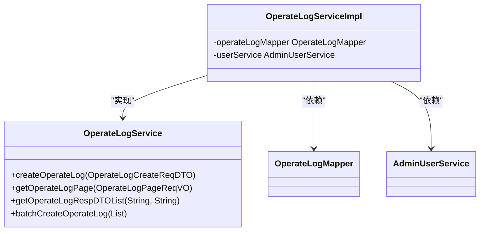
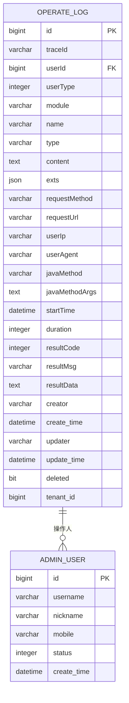
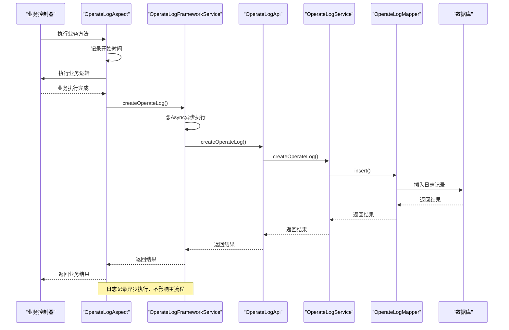
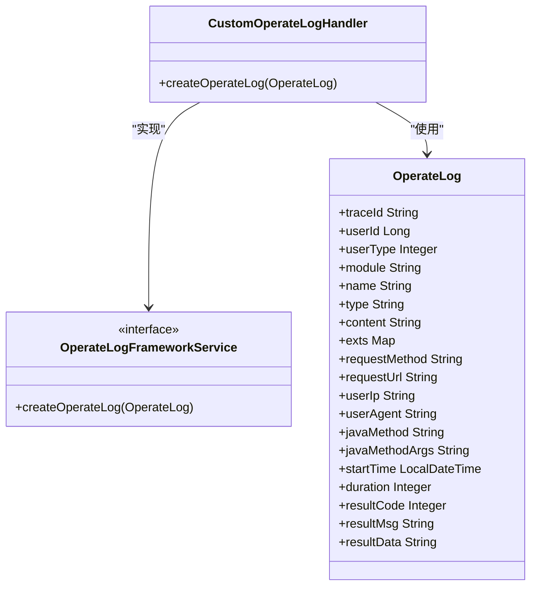

# 操作日志服务实现

<cite>
**本文档引用的文件**   
- [OperateLogService.java](file://yudao-module-system/yudao-module-system-biz/src/main/java/cn/iocoder/yudao/module/system/service/logger/OperateLogService.java)
- [OperateLogServiceImpl.java](file://yudao-module-system/yudao-module-system-biz/src/main/java/cn/iocoder/yudao/module/system/service/logger/OperateLogServiceImpl.java)
- [OperateLogDO.java](file://yudao-module-system/yudao-module-system-biz/src/main/java/cn/iocoder/yudao/module/system/dal/dataobject/logger/OperateLogDO.java)
- [OperateLogCreateReqDTO.java](file://yudao-module-system/yudao-module-system-api/src/main/java/cn/iocoder/yudao/module/system/api/logger/dto/OperateLogCreateReqDTO.java)
- [OperateLogFrameworkService.java](file://yudao-framework/yudao-spring-boot-starter-operatelog/src/main/java/cn/iocoder/yudao/framework/operatelog/core/service/OperateLogFrameworkService.java)
- [OperateLogFrameworkServiceImpl.java](file://yudao-framework/yudao-spring-boot-starter-operatelog/src/main/java/cn/iocoder/yudao/framework/operatelog/core/service/OperateLogFrameworkServiceImpl.java)
- [OperateLogAspect.java](file://yudao-framework/yudao-spring-boot-starter-operatelog/src/main/java/cn/iocoder/yudao/framework/operatelog/core/aop/OperateLogAspect.java)
- [OperateLog.java](file://yudao-framework/yudao-spring-boot-starter-operatelog/src/main/java/cn/iocoder/yudao/framework/operatelog/core/service/OperateLog.java)
- [OperateLogApi.java](file://yudao-module-system/yudao-module-system-api/src/main/java/cn/iocoder/yudao/module/system/api/logger/OperateLogApi.java)
- [OperateLogApiImpl.java](file://yudao-module-system/yudao-module-system-biz/src/main/java/cn/iocoder/yudao/module/system/api/logger/OperateLogApiImpl.java)
- [AdminUserService.java](file://yudao-module-system/yudao-module-system-biz/src/main/java/cn/iocoder/yudao/module/system/service/user/AdminUserService.java)
- [V1_0_0_001__框架初始化.sql](file://eplus-flyway/src/main/resources/db/migration/common/V1_0_0_001__框架初始化.sql)
</cite>

## 目录
1. [介绍](#介绍)
2. [核心组件](#核心组件)
3. [操作日志存储结构设计](#操作日志存储结构设计)
4. [异步处理机制与性能优化](#异步处理机制与性能优化)
5. [与其他系统模块集成](#与其他系统模块集成)
6. [服务扩展点开发指导](#服务扩展点开发指导)
7. [结论](#结论)

## 介绍

操作日志服务是系统审计和监控的关键组件，用于记录用户在系统中的各种操作行为。本服务通过AOP切面自动捕获带有`@OperateLog`注解的方法调用，实现对关键业务操作的全面记录。服务设计遵循分层架构，包含接口定义、实现类、数据对象和API接口等多个层次，确保了代码的可维护性和扩展性。

**Section sources**
- [OperateLogService.java](file://yudao-module-system/yudao-module-system-biz/src/main/java/cn/iocoder/yudao/module/system/service/logger/OperateLogService.java)
- [OperateLogFrameworkService.java](file://yudao-framework/yudao-spring-boot-starter-operatelog/src/main/java/cn/iocoder/yudao/framework/operatelog/core/service/OperateLogFrameworkService.java)

## 核心组件

操作日志服务的核心由`OperateLogService`接口和`OperateLogServiceImpl`实现类构成。`OperateLogService`定义了创建操作日志、分页查询日志、根据追踪信息查询日志等核心方法。`OperateLogServiceImpl`实现了这些方法，负责将日志数据持久化到数据库。



**Diagram sources **
- [OperateLogService.java](file://yudao-module-system/yudao-module-system-biz/src/main/java/cn/iocoder/yudao/module/system/service/logger/OperateLogService.java)
- [OperateLogServiceImpl.java](file://yudao-module-system/yudao-module-system-biz/src/main/java/cn/iocoder/yudao/module/system/service/logger/OperateLogServiceImpl.java)

**Section sources**
- [OperateLogService.java](file://yudao-module-system/yudao-module-system-biz/src/main/java/cn/iocoder/yudao/module/system/service/logger/OperateLogService.java)
- [OperateLogServiceImpl.java](file://yudao-module-system/yudao-module-system-biz/src/main/java/cn/iocoder/yudao/module/system/service/logger/OperateLogServiceImpl.java)

## 操作日志存储结构设计

操作日志的数据结构设计全面覆盖了操作的各个方面，包括操作人、操作时间、操作模块、操作内容等关键字段。



**Diagram sources **
- [OperateLogDO.java](file://yudao-module-system/yudao-module-system-biz/src/main/java/cn/iocoder/yudao/module/system/dal/dataobject/logger/OperateLogDO.java)
- [V1_0_0_001__框架初始化.sql](file://eplus-flyway/src/main/resources/db/migration/common/V1_0_0_001__框架初始化.sql)

**Section sources**
- [OperateLogDO.java](file://yudao-module-system/yudao-module-system-biz/src/main/java/cn/iocoder/yudao/module/system/dal/dataobject/logger/OperateLogDO.java)
- [V1_0_0_001__框架初始化.sql](file://eplus-flyway/src/main/resources/db/migration/common/V1_0_0_001__框架初始化.sql)

### 字段意义说明

- **userId**: 操作人用户编号，关联用户表，用于标识执行操作的用户
- **userType**: 用户类型，区分管理员、会员等不同类型的用户
- **startTime**: 操作开始时间，精确到毫秒，用于记录操作发生的时间点
- **module**: 操作模块，表示操作所属的业务模块，如"用户管理"、"权限管理"等
- **name**: 操作名，描述具体的操作行为，如"创建用户"、"修改密码"等
- **type**: 操作分类，根据HTTP方法自动识别为查询、创建、更新、删除等类型
- **content**: 操作内容，详细记录操作的明细信息
- **exts**: 拓展字段，以JSON格式存储额外的业务相关数据，如订单编号等
- **duration**: 执行时长，记录操作的耗时，单位为毫秒，用于性能监控
- **resultCode**: 结果码，记录操作的执行结果状态码
- **resultMsg**: 结果提示，记录操作结果的描述信息

## 异步处理机制与性能优化

操作日志服务采用异步处理机制，确保日志记录不会影响主业务流程的性能。通过`@Async`注解实现异步执行，将日志记录操作放入独立的线程池中处理。



**Diagram sources **
- [OperateLogAspect.java](file://yudao-framework/yudao-spring-boot-starter-operatelog/src/main/java/cn/iocoder/yudao/framework/operatelog/core/aop/OperateLogAspect.java)
- [OperateLogFrameworkServiceImpl.java](file://yudao-framework/yudao-spring-boot-starter-operatelog/src/main/java/cn/iocoder/yudao/framework/operatelog/core/service/OperateLogFrameworkServiceImpl.java)
- [OperateLogApiImpl.java](file://yudao-module-system/yudao-module-system-biz/src/main/java/cn/iocoder/yudao/module/system/api/logger/OperateLogApiImpl.java)
- [OperateLogServiceImpl.java](file://yudao-module-system/yudao-module-system-biz/src/main/java/cn/iocoder/yudao/module/system/service/logger/OperateLogServiceImpl.java)

**Section sources**
- [OperateLogAspect.java](file://yudao-framework/yudao-spring-boot-starter-operatelog/src/main/java/cn/iocoder/yudao/framework/operatelog/core/aop/OperateLogAspect.java)
- [OperateLogFrameworkServiceImpl.java](file://yudao-framework/yudao-spring-boot-starter-operatelog/src/main/java/cn/iocoder/yudao/framework/operatelog/core/service/OperateLogFrameworkServiceImpl.java)

### 性能优化策略

1. **异步处理**: 使用`@Async`注解将日志记录操作异步化，避免阻塞主业务流程
2. **批量插入**: 提供`batchCreateOperateLog`方法支持批量插入日志，减少数据库交互次数
3. **字符串长度限制**: 对`javaMethodArgs`和`resultData`字段进行长度限制，防止过长数据影响性能
4. **参数过滤**: 在记录方法参数时，过滤掉`MultipartFile`、`HttpServletRequest`等大对象，避免内存溢出
5. **索引优化**: 在数据库表的关键字段上建立索引，如`userId`、`startTime`等，提高查询性能

## 与其他系统模块集成

操作日志服务与权限管理、用户管理等系统模块紧密集成，形成完整的安全审计体系。

```mermaid
graph TD
subgraph "前端"
UI[用户界面]
end
subgraph "业务层"
Controller[业务控制器]
Service[业务服务]
end
subgraph "日志层"
Aspect[OperateLogAspect]
FrameworkService[OperateLogFrameworkService]
Api[OperateLogApi]
LogService[OperateLogService]
end
subgraph "基础服务"
UserService[AdminUserService]
PermissionService[PermissionService]
end
subgraph "数据层"
Mapper[OperateLogMapper]
DB[(数据库)]
end
UI --> Controller
Controller --> Service
Service --> Aspect : "@OperateLog"
Aspect --> FrameworkService
FrameworkService --> Api
Api --> LogService
LogService --> Mapper
Mapper --> DB
LogService --> UserService : "获取用户信息"
Service --> PermissionService : "权限校验"
style Aspect fill:#f9f,stroke:#333
style FrameworkService fill:#f9f,stroke:#333
style Api fill:#f9f,stroke:#333
style LogService fill:#f9f,stroke:#333
```

**Diagram sources **
- [OperateLogAspect.java](file://yudao-framework/yudao-spring-boot-starter-operatelog/src/main/java/cn/iocoder/yudao/framework/operatelog/core/aop/OperateLogAspect.java)
- [OperateLogFrameworkServiceImpl.java](file://yudao-framework/yudao-spring-boot-starter-operatelog/src/main/java/cn/iocoder/yudao/framework/operatelog/core/service/OperateLogFrameworkServiceImpl.java)
- [OperateLogApiImpl.java](file://yudao-module-system/yudao-module-system-biz/src/main/java/cn/iocoder/yudao/module/system/api/logger/OperateLogApiImpl.java)
- [OperateLogServiceImpl.java](file://yudao-module-system/yudao-module-system-biz/src/main/java/cn/iocoder/yudao/module/system/service/logger/OperateLogServiceImpl.java)
- [AdminUserService.java](file://yudao-module-system/yudao-module-system-biz/src/main/java/cn/iocoder/yudao/module/system/service/user/AdminUserService.java)

**Section sources**
- [OperateLogAspect.java](file://yudao-framework/yudao-spring-boot-starter-operatelog/src/main/java/cn/iocoder/yudao/framework/operatelog/core/aop/OperateLogAspect.java)
- [AdminUserService.java](file://yudao-module-system/yudao-module-system-biz/src/main/java/cn/iocoder/yudao/module/system/service/user/AdminUserService.java)

### 权限管理集成

操作日志服务与权限管理模块集成，确保只有管理员用户的操作才会被记录。在`OperateLogAspect`中通过`WebFrameworkUtils.getLoginUserType()`获取当前用户类型，只有当用户类型为管理员时才记录操作日志。

### 用户管理集成

操作日志服务与用户管理模块集成，通过`AdminUserService`获取用户信息，包括用户昵称等。在查询日志列表时，会关联用户表获取用户昵称，方便日志的展示和分析。

## 服务扩展点开发指导

操作日志服务提供了多个扩展点，支持自定义日志处理器和日志内容。

### 自定义日志处理器

可以通过实现`OperateLogFrameworkService`接口来创建自定义的日志处理器。例如，可以创建一个将日志发送到消息队列的处理器：



**Diagram sources **
- [OperateLogFrameworkService.java](file://yudao-framework/yudao-spring-boot-starter-operatelog/src/main/java/cn/iocoder/yudao/framework/operatelog/core/service/OperateLogFrameworkService.java)
- [OperateLog.java](file://yudao-framework/yudao-spring-boot-starter-operatelog/src/main/java/cn/iocoder/yudao/framework/operatelog/core/service/OperateLog.java)

### 扩展字段使用

通过`OperateLogAspect.addExt()`方法可以在业务代码中添加自定义的扩展字段。例如，在订单处理服务中可以添加订单编号：

```java
// 在业务方法中
OperateLogAspect.addExt("orderId", orderId);
```

### 操作内容自定义

通过`OperateLogAspect.setContent()`方法可以自定义操作内容。例如：

```java
// 在业务方法中
OperateLogAspect.setContent("修改用户%s的信息，将邮箱从%s改为%s");
```

## 结论

操作日志服务通过AOP切面、异步处理和分层架构设计，实现了高效、可靠的操作日志记录功能。服务与权限管理、用户管理等模块紧密集成，形成了完整的安全审计体系。通过提供多个扩展点，支持自定义日志处理器和日志内容，满足了不同业务场景的需求。整体设计遵循了高内聚、低耦合的原则，具有良好的可维护性和扩展性。