# 操作日志查询与分析

<cite>
**本文档引用的文件**  
- [OperateLogAspect.java](file://yudao-framework/yudao-spring-boot-starter-operatelog/src/main/java/cn/iocoder/yudao/framework/operatelog/core/aop/OperateLogAspect.java)
- [OperateLog.java](file://yudao-framework/yudao-spring-boot-starter-operatelog/src/main/java/cn/iocoder/yudao/framework/operatelog/core/annotations/OperateLog.java)
- [OperateLogFrameworkServiceImpl.java](file://yudao-framework/yudao-spring-boot-starter-operatelog/src/main/java/cn/iocoder/yudao/framework/operatelog/core/service/OperateLogFrameworkServiceImpl.java)
- [OperateLogApi.java](file://yudao-module-system/yudao-module-system-api/src/main/java/cn/iocoder/yudao/module/system/api/logger/OperateLogApi.java)
- [OperateLogService.java](file://yudao-module-system/yudao-module-system-biz/src/main/java/cn/iocoder/yudao/module/system/service/logger/OperateLogService.java)
- [OperateLogServiceImpl.java](file://yudao-module-system/yudao-module-system-biz/src/main/java/cn/iocoder/yudao/module/system/service/logger/OperateLogServiceImpl.java)
- [OperateLogMapper.java](file://yudao-module-system/yudao-module-system-biz/src/main/java/cn/iocoder/yudao/module/system/dal/mysql/logger/OperateLogMapper.java)
- [OperateLogDO.java](file://yudao-module-system/yudao-module-system-biz/src/main/java/cn/iocoder/yudao/module/system/dal/dataobject/logger/OperateLogDO.java)
- [OperateLogController.java](file://yudao-module-system/yudao-module-system-biz/src/main/java/cn/iocoder/yudao/module/system/controller/admin/logger/OperateLogController.java)
- [OperateLogPageReqVO.java](file://yudao-module-system/yudao-module-system-biz/src/main/java/cn/iocoder/yudao/module/system/controller/admin/logger/vo/operatelog/OperateLogPageReqVO.java)
- [OperateLogConvert.java](file://yudao-module-system/yudao-module-system-biz/src/main/java/cn/iocoder/yudao/module/system/convert/logger/OperateLogConvert.java)
- [OperateLogFormatDict.java](file://eplus-framework/eplus-common/src/main/java/com/syj/eplus/framework/common/dict/OperateLogFormatDict.java)
</cite>

## 目录
1. [简介](#简介)
2. [操作日志架构概述](#操作日志架构概述)
3. [核心组件分析](#核心组件分析)
4. [操作日志查询接口](#操作日志查询接口)
5. [过滤条件详解](#过滤条件详解)
6. [分页处理与性能优化](#分页处理与性能优化)
7. [常用查询场景示例](#常用查询场景示例)
8. [日志分析工具功能](#日志分析工具功能)
9. [异常操作检测](#异常操作检测)
10. [结论](#结论)

## 简介

操作日志系统是企业级应用中重要的审计和监控组件，用于记录用户在系统中的各种操作行为。本文档详细介绍了操作日志的查询接口、过滤条件、分页处理、性能优化策略以及高级分析功能。通过本系统，管理员可以审计特定用户的操作行为、追踪数据变更历史、检测异常操作等，确保系统的安全性和可追溯性。

**本文档引用的文件**  
- [OperateLogAspect.java](file://yudao-framework/yudao-spring-boot-starter-operatelog/src/main/java/cn/iocoder/yudao/framework/operatelog/core/aop/OperateLogAspect.java)
- [OperateLog.java](file://yudao-framework/yudao-spring-boot-starter-operatelog/src/main/java/cn/iocoder/yudao/framework/operatelog/core/annotations/OperateLog.java)

## 操作日志架构概述

操作日志系统采用分层架构设计，主要包括以下几个核心组件：

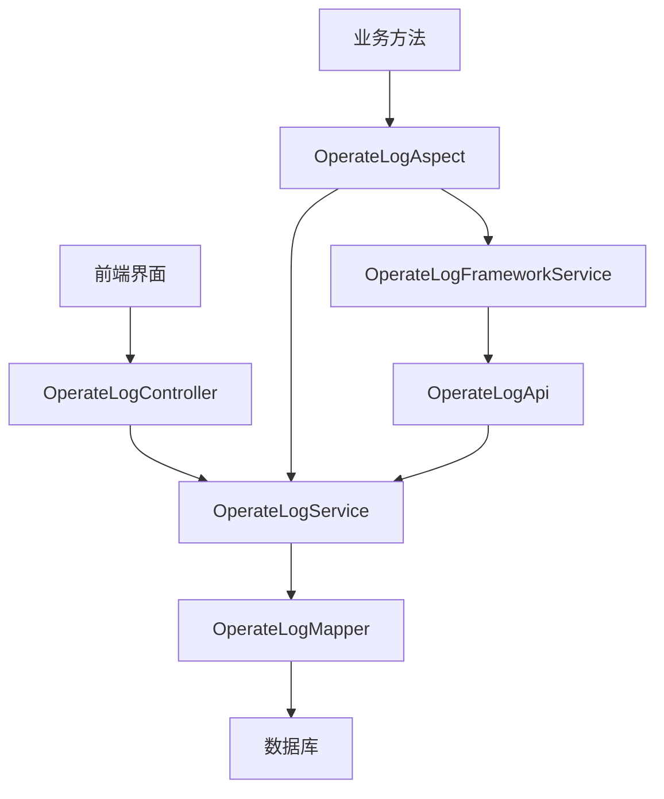

**图示来源**  
- [OperateLogController.java](file://yudao-module-system/yudao-module-system-biz/src/main/java/cn/iocoder/yudao/module/system/controller/admin/logger/OperateLogController.java)
- [OperateLogService.java](file://yudao-module-system/yudao-module-system-biz/src/main/java/cn/iocoder/yudao/module/system/service/logger/OperateLogService.java)
- [OperateLogMapper.java](file://yudao-module-system/yudao-module-system-biz/src/main/java/cn/iocoder/yudao/module/system/dal/mysql/logger/OperateLogMapper.java)
- [OperateLogAspect.java](file://yudao-framework/yudao-spring-boot-starter-operatelog/src/main/java/cn/iocoder/yudao/framework/operatelog/core/aop/OperateLogAspect.java)

## 核心组件分析

### 操作日志切面（OperateLogAspect）

操作日志切面是系统的核心组件，负责拦截带有`@OperateLog`注解的方法调用，自动记录操作日志。

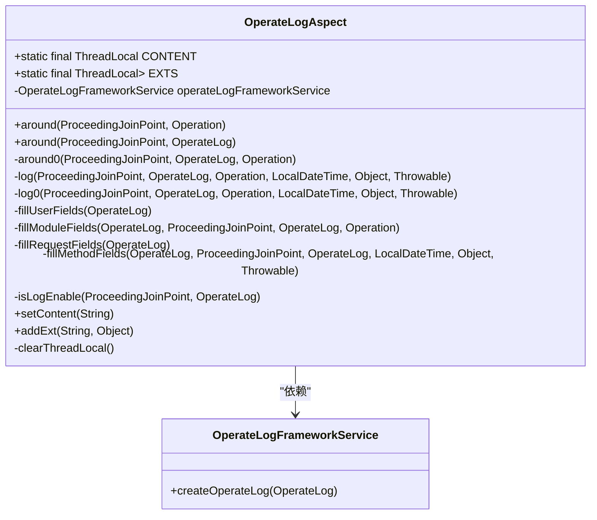

**图示来源**  
- [OperateLogAspect.java](file://yudao-framework/yudao-spring-boot-starter-operatelog/src/main/java/cn/iocoder/yudao/framework/operatelog/core/aop/OperateLogAspect.java)
- [OperateLogFrameworkService.java](file://yudao-framework/yudao-spring-boot-starter-operatelog/src/main/java/cn/iocoder/yudao/framework/operatelog/core/service/OperateLogFrameworkService.java)

### 操作日志数据对象（OperateLogDO）

操作日志数据对象定义了存储在数据库中的日志记录结构。

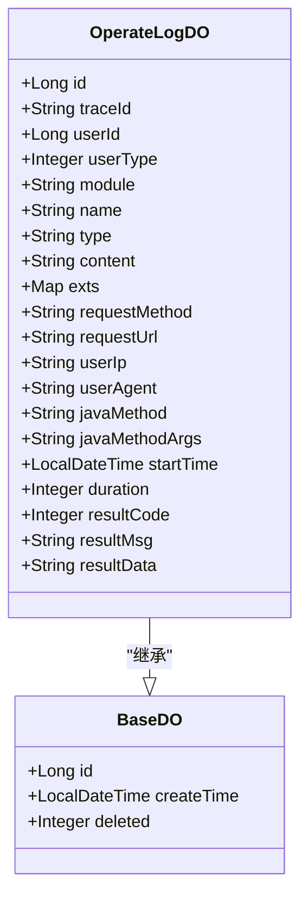

**图示来源**  
- [OperateLogDO.java](file://yudao-module-system/yudao-module-system-biz/src/main/java/cn/iocoder/yudao/module/system/dal/dataobject/logger/OperateLogDO.java)
- [BaseDO.java](file://yudao-framework/yudao-spring-boot-starter-mybatis/src/main/java/cn/iocoder/yudao/framework/mybatis/core/dataobject/BaseDO.java)

## 操作日志查询接口

### 查询接口定义

操作日志查询接口提供了分页查询和导出功能。

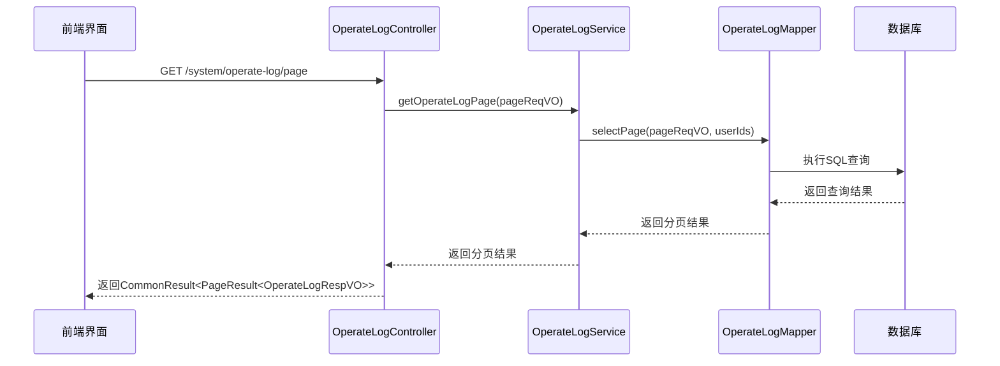

**图示来源**  
- [OperateLogController.java](file://yudao-module-system/yudao-module-system-biz/src/main/java/cn/iocoder/yudao/module/system/controller/admin/logger/OperateLogController.java)
- [OperateLogService.java](file://yudao-module-system/yudao-module-system-biz/src/main/java/cn/iocoder/yudao/module/system/service/logger/OperateLogService.java)
- [OperateLogMapper.java](file://yudao-module-system/yudao-module-system-biz/src/main/java/cn/iocoder/yudao/module/system/dal/mysql/logger/OperateLogMapper.java)

### 接口参数说明

| 参数 | 类型 | 描述 | 示例 |
|------|------|------|------|
| module | String | 操作模块，模糊匹配 | "订单" |
| userNickname | String | 用户昵称，模糊匹配 | "管理员" |
| type | Integer | 操作类型 | 1 |
| success | Boolean | 操作状态 | true |
| startTime | LocalDateTime[] | 开始时间范围 | ["2022-07-01 00:00:00", "2022-07-01 23:59:59"] |
| pageNum | Integer | 页码 | 1 |
| pageSize | Integer | 每页大小 | 10 |

**本文档引用的文件**  
- [OperateLogPageReqVO.java](file://yudao-module-system/yudao-module-system-biz/src/main/java/cn/iocoder/yudao/module/system/controller/admin/logger/vo/operatelog/OperateLogPageReqVO.java)

## 过滤条件详解

### 时间范围过滤

时间范围过滤允许用户查询特定时间段内的操作日志。

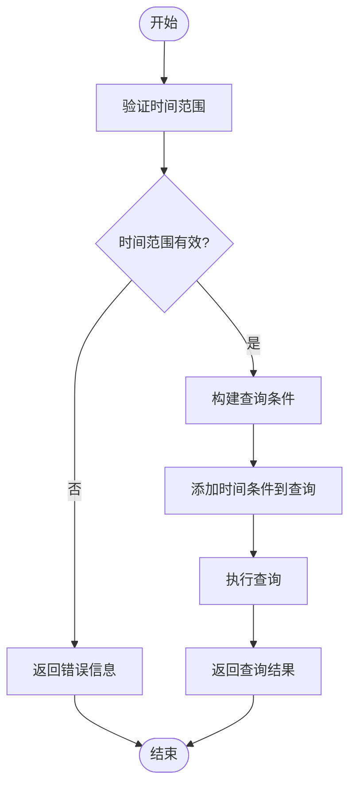

**图示来源**  
- [OperateLogMapper.java](file://yudao-module-system/yudao-module-system-biz/src/main/java/cn/iocoder/yudao/module/system/dal/mysql/logger/OperateLogMapper.java)
- [OperateLogServiceImpl.java](file://yudao-module-system/yudao-module-system-biz/src/main/java/cn/iocoder/yudao/module/system/service/logger/OperateLogServiceImpl.java)

### 操作人员过滤

操作人员过滤通过用户昵称进行模糊匹配，支持多用户查询。

```java
// 在 OperateLogServiceImpl.java 中的实现
@Override
public PageResult<OperateLogDO> getOperateLogPage(OperateLogPageReqVO pageReqVO) {
    // 处理基于用户昵称的查询
    Collection<Long> userIds = null;
    if (StrUtil.isNotEmpty(pageReqVO.getUserNickname())) {
        userIds = convertSet(userService.getUserListByNickname(pageReqVO.getUserNickname()), AdminUserDO::getId);
        if (CollUtil.isEmpty(userIds)) {
            return PageResult.empty();
        }
    }
    // 查询分页
    return operateLogMapper.selectPage(pageReqVO, userIds);
}
```

**本文档引用的文件**  
- [OperateLogServiceImpl.java](file://yudao-module-system/yudao-module-system-biz/src/main/java/cn/iocoder/yudao/module/system/service/logger/OperateLogServiceImpl.java)

### 操作类型过滤

操作类型过滤支持按操作分类进行查询，如创建、更新、删除等。

```java
// 在 OperateLogMapper.java 中的实现
default PageResult<OperateLogDO> selectPage(OperateLogPageReqVO reqVO, Collection<Long> userIds) {
    LambdaQueryWrapperX<OperateLogDO> query = new LambdaQueryWrapperX<OperateLogDO>()
            .likeIfPresent(OperateLogDO::getModule, reqVO.getModule())
            .inIfPresent(OperateLogDO::getUserId, userIds)
            .eqIfPresent(OperateLogDO::getType, reqVO.getType())
            .betweenIfPresent(OperateLogDO::getStartTime, reqVO.getStartTime());
    // ... 其他条件
    return selectPage(reqVO, query);
}
```

**本文档引用的文件**  
- [OperateLogMapper.java](file://yudao-module-system/yudao-module-system-biz/src/main/java/cn/iocoder/yudao/module/system/dal/mysql/logger/OperateLogMapper.java)

### 业务模块过滤

业务模块过滤支持按功能模块进行查询，如订单、用户、权限等。

```java
// 在 OperateLogMapper.java 中的实现
LambdaQueryWrapperX<OperateLogDO> query = new LambdaQueryWrapperX<OperateLogDO>()
        .likeIfPresent(OperateLogDO::getModule, reqVO.getModule())
        // ... 其他条件
```

**本文档引用的文件**  
- [OperateLogMapper.java](file://yudao-module-system/yudao-module-system-biz/src/main/java/cn/iocoder/yudao/module/system/dal/mysql/logger/OperateLogMapper.java)

## 分页处理与性能优化

### 分页处理机制

系统采用标准的分页机制，支持大数量日志数据的高效查询。

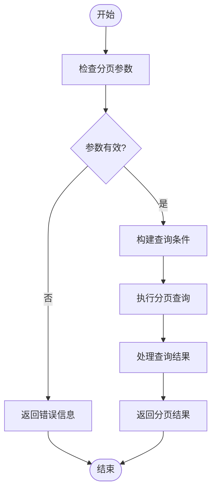

**图示来源**  
- [OperateLogMapper.java](file://yudao-module-system/yudao-module-system-biz/src/main/java/cn/iocoder/yudao/module/system/dal/mysql/logger/OperateLogMapper.java)
- [OperateLogServiceImpl.java](file://yudao-module-system/yudao-module-system-biz/src/main/java/cn/iocoder/yudao/module/system/service/logger/OperateLogServiceImpl.java)

### 性能优化策略

系统采用多种性能优化策略，确保在大数据量下的查询效率。

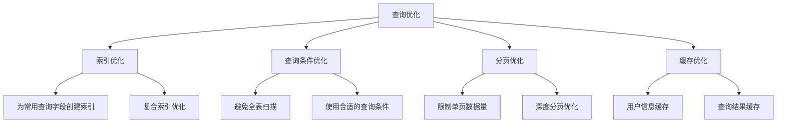

**本文档引用的文件**  
- [OperateLogMapper.java](file://yudao-module-system/yudao-module-system-biz/src/main/java/cn/iocoder/yudao/module/system/dal/mysql/logger/OperateLogMapper.java)
- [OperateLogServiceImpl.java](file://yudao-module-system/yudao-module-system-biz/src/main/java/cn/iocoder/yudao/module/system/service/logger/OperateLogServiceImpl.java)

## 常用查询场景示例

### 审计特定用户的操作行为

审计特定用户的操作行为是常见的安全审计需求。

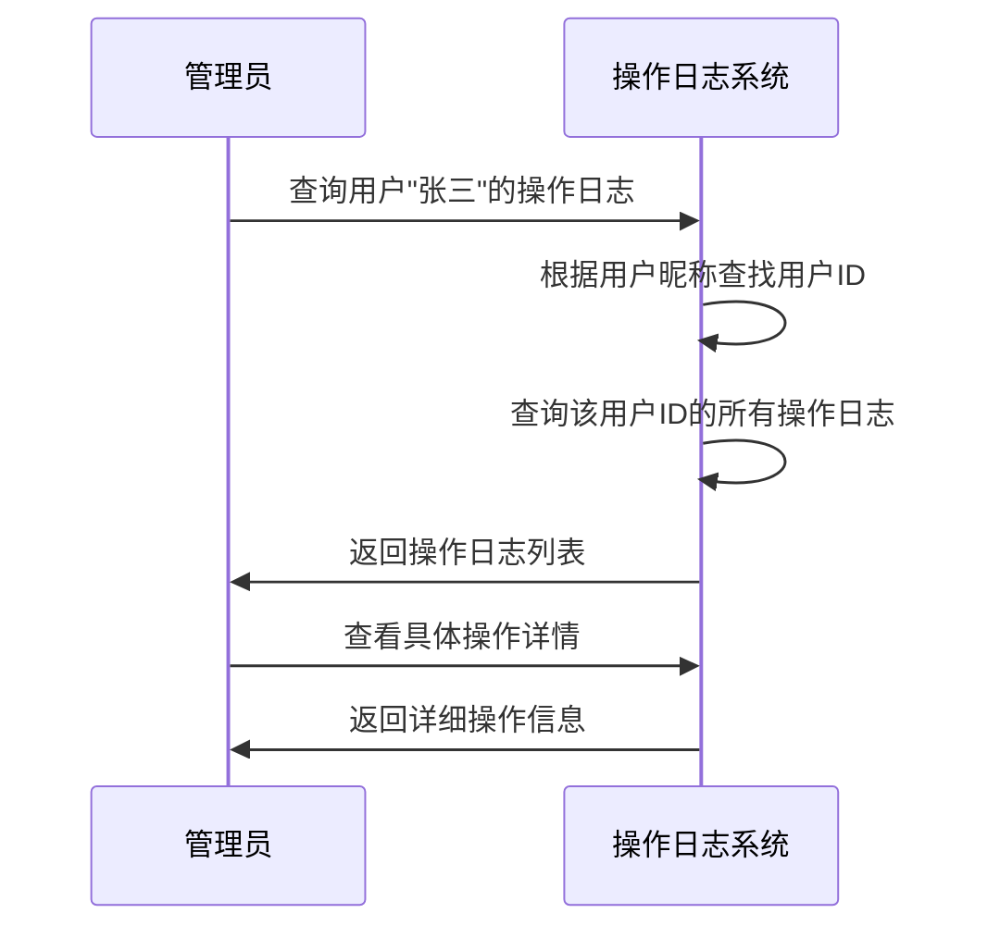

**图示来源**  
- [OperateLogServiceImpl.java](file://yudao-module-system/yudao-module-system-biz/src/main/java/cn/iocoder/yudao/module/system/service/logger/OperateLogServiceImpl.java)

### 追踪数据变更历史

追踪数据变更历史对于问题排查和数据恢复非常重要。

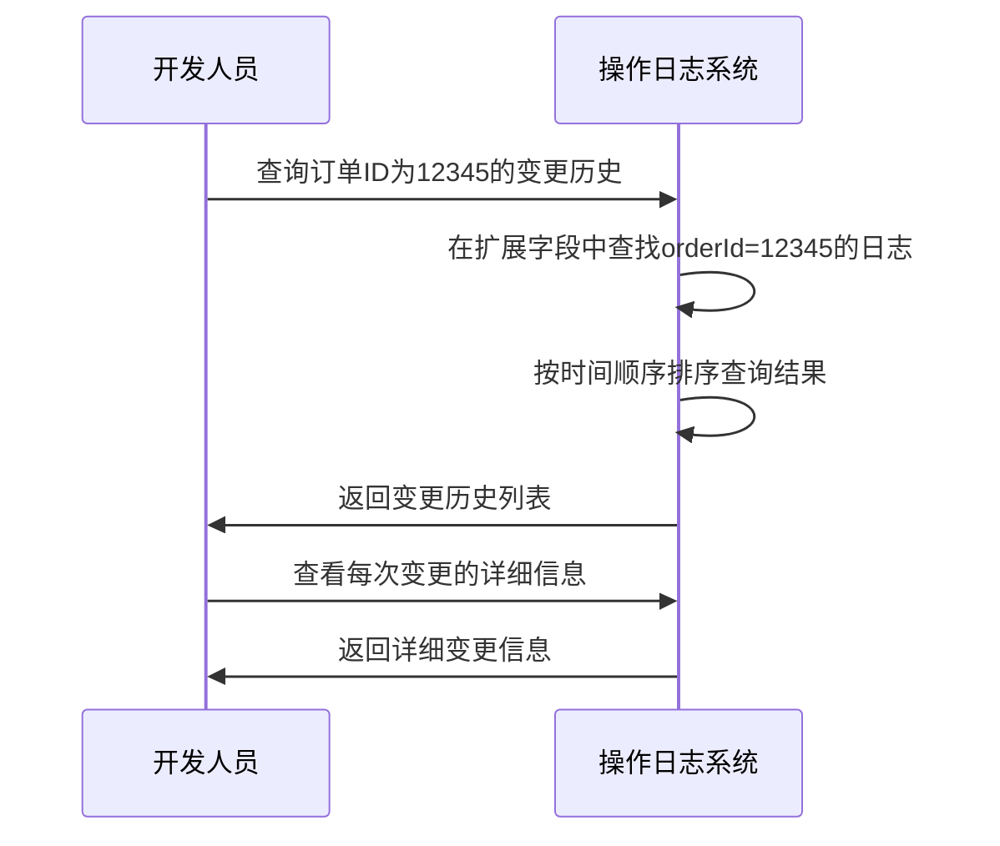

**图示来源**  
- [OperateLogServiceImpl.java](file://yudao-module-system/yudao-module-system-biz/src/main/java/cn/iocoder/yudao/module/system/service/logger/OperateLogServiceImpl.java)

## 日志分析工具功能

### 操作频率统计

操作频率统计功能可以帮助管理员了解系统的使用情况。

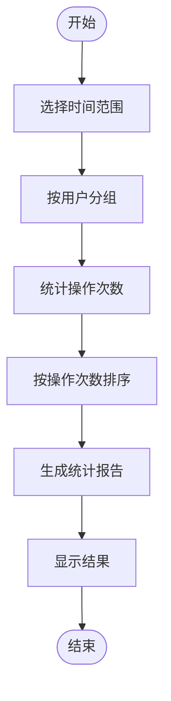

**图示来源**  
- [OperateLogServiceImpl.java](file://yudao-module-system/yudao-module-system-biz/src/main/java/cn/iocoder/yudao/module/system/service/logger/OperateLogServiceImpl.java)

### 异常操作检测

异常操作检测功能可以及时发现潜在的安全威胁。

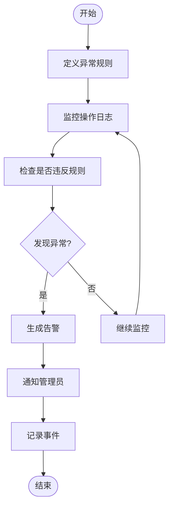

**图示来源**  
- [OperateLogAspect.java](file://yudao-framework/yudao-spring-boot-starter-operatelog/src/main/java/cn/iocoder/yudao/framework/operatelog/core/aop/OperateLogAspect.java)

## 异常操作检测

### 检测规则配置

系统支持灵活的异常操作检测规则配置。

```java
// 在 OperateLogAspect.java 中的异常处理
private void log(ProceedingJoinPoint joinPoint,
                cn.iocoder.yudao.framework.operatelog.core.annotations.OperateLog operateLog,
                Operation operation,
                LocalDateTime startTime, Object result, Throwable exception) {
    try {
        // 判断不记录的情况
        if (!isLogEnable(joinPoint, operateLog)) {
            return;
        }
        // 真正记录操作日志
        this.log0(joinPoint, operateLog, operation, startTime, result, exception);
    } catch (Throwable ex) {
        log.error("[log][记录操作日志时，发生异常，其中参数是 joinPoint({}) operateLog({}) apiOperation({}) result({}) exception({}) ]",
                joinPoint, operateLog, operation, result, exception, ex);
    }
}
```

**本文档引用的文件**  
- [OperateLogAspect.java](file://yudao-framework/yudao-spring-boot-starter-operatelog/src/main/java/cn/iocoder/yudao/framework/operatelog/core/aop/OperateLogAspect.java)

### 告警通知机制

当检测到异常操作时，系统会触发告警通知。

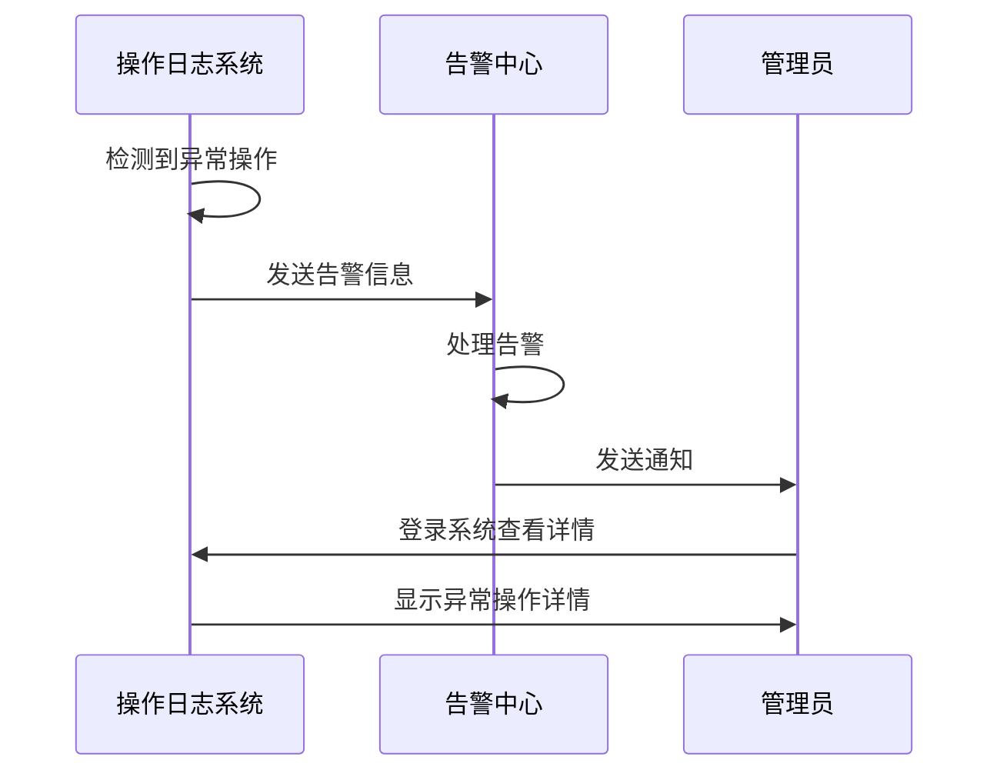

**图示来源**  
- [OperateLogAspect.java](file://yudao-framework/yudao-spring-boot-starter-operatelog/src/main/java/cn/iocoder/yudao/framework/operatelog/core/aop/OperateLogAspect.java)

## 结论

本文档详细介绍了操作日志查询与分析系统的架构、核心组件、查询接口、过滤条件、分页处理、性能优化策略以及高级分析功能。通过本系统，管理员可以有效地审计用户操作、追踪数据变更、检测异常行为，确保系统的安全性和可追溯性。系统采用分层架构设计，具有良好的扩展性和维护性，能够满足企业级应用的复杂需求。

**本文档引用的文件**  
- [OperateLogAspect.java](file://yudao-framework/yudao-spring-boot-starter-operatelog/src/main/java/cn/iocoder/yudao/framework/operatelog/core/aop/OperateLogAspect.java)
- [OperateLog.java](file://yudao-framework/yudao-spring-boot-starter-operatelog/src/main/java/cn/iocoder/yudao/framework/operatelog/core/annotations/OperateLog.java)
- [OperateLogFrameworkServiceImpl.java](file://yudao-framework/yudao-spring-boot-starter-operatelog/src/main/java/cn/iocoder/yudao/framework/operatelog/core/service/OperateLogFrameworkServiceImpl.java)