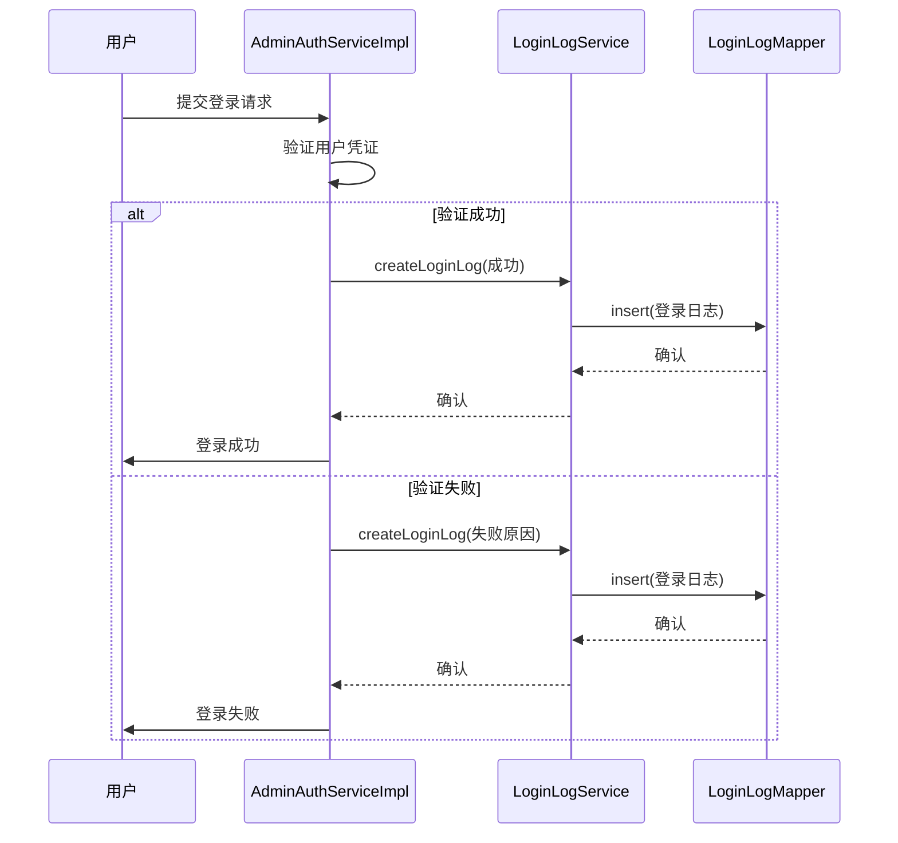
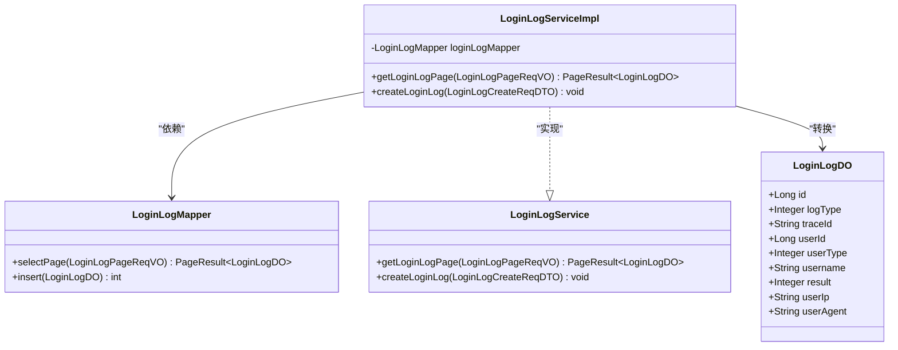
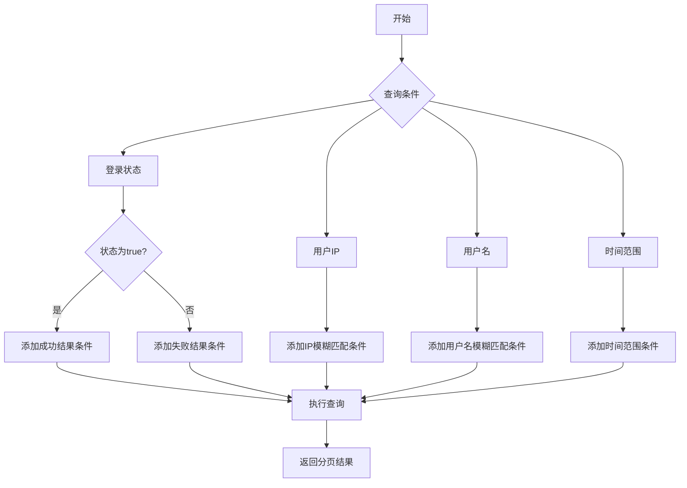
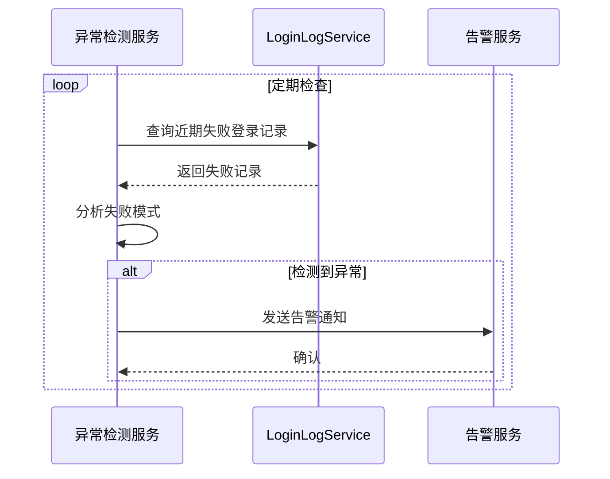
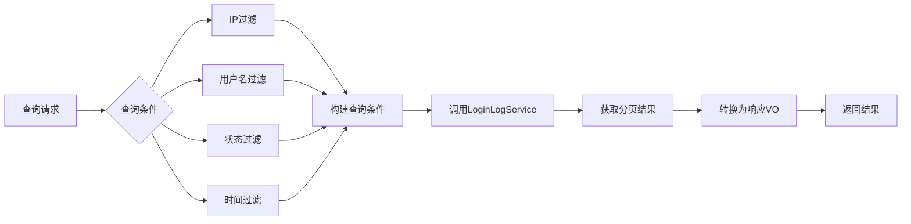
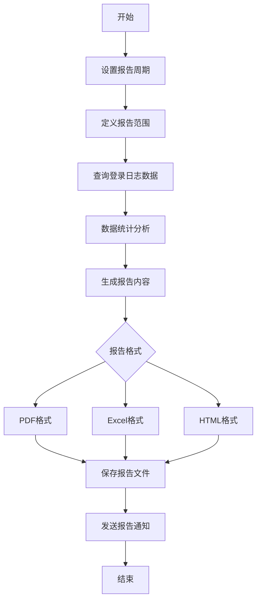

# 登录审计

<cite>
**本文档引用的文件**  
- [LoginLogServiceImpl.java](file://yudao-module-system/yudao-module-system-biz/src/main/java/cn/iocoder/yudao/module/system/service/logger/LoginLogServiceImpl.java)
- [LoginLogController.java](file://yudao-module-system/yudao-module-system-biz/src/main/java/cn/iocoder/yudao/module/system/controller/admin/logger/LoginLogController.java)
- [LoginLogDO.java](file://yudao-module-system/yudao-module-system-biz/src/main/java/cn/iocoder/yudao/module/system/dal/dataobject/logger/LoginLogDO.java)
- [LoginLogCreateReqDTO.java](file://yudao-module-system/yudao-module-system-api/src/main/java/cn/iocoder/yudao/module/system/api/logger/dto/LoginLogCreateReqDTO.java)
- [LoginLogMapper.java](file://yudao-module-system/yudao-module-system-biz/src/main/java/cn/iocoder/yudao/module/system/dal/mysql/logger/LoginLogMapper.java)
- [LoginLogTypeEnum.java](file://yudao-module-system/yudao-module-system-api/src/main/java/cn/iocoder/yudao/module/system/enums/logger/LoginLogTypeEnum.java)
- [LoginResultEnum.java](file://yudao-module-system/yudao-module-system-api/src/main/java/cn/iocoder/yudao/module/system/enums/logger/LoginResultEnum.java)
- [AdminAuthServiceImpl.java](file://yudao-module-system/yudao-module-system-biz/src/main/java/cn/iocoder/yudao/module/system/service/auth/AdminAuthServiceImpl.java)
- [V1_0_0_001__框架初始化.sql](file://eplus-flyway/src/main/resources/db/migration/common/V1_0_0_001__框架初始化.sql)
</cite>

## 目录
1. [登录审计概述](#登录审计概述)
2. [登录日志记录机制](#登录日志记录机制)
3. [LoginLogService 实现原理](#loginlogservice-实现原理)
4. [日志字段定义](#日志字段定义)
5. [登录日志存储策略与索引优化](#登录日志存储策略与索引优化)
6. [登录异常检测方法](#登录异常检测方法)
7. [LoginLogController 查询与分析](#loginlogcontroller-查询与分析)
8. [安全合规性要求](#安全合规性要求)
9. [登录审计报告生成](#登录审计报告生成)

## 登录审计概述

登录审计是系统安全的重要组成部分，用于记录用户登录和登出行为，提供可追溯的安全日志。本系统通过 `LoginLogService` 和 `LoginLogController` 组件实现完整的登录审计功能，涵盖日志记录、查询、导出和异常检测等能力。登录日志不仅记录成功登录，还包括失败尝试和登出操作，为系统管理员提供全面的用户访问视图。

## 登录日志记录机制

系统的登录日志记录机制在用户认证过程中自动触发。当用户尝试登录或登出时，`AdminAuthServiceImpl` 服务会调用 `LoginLogService` 创建相应的日志条目。该机制覆盖多种登录方式，包括账号密码登录、社交登录、手机登录和短信登录，同时也记录主动登出和强制退出等登出行为。



**图示来源**
- [AdminAuthServiceImpl.java](file://yudao-module-system/yudao-module-system-biz/src/main/java/cn/iocoder/yudao/module/system/service/auth/AdminAuthServiceImpl.java#L68-L85)
- [LoginLogService.java](file://yudao-module-system/yudao-module-system-biz/src/main/java/cn/iocoder/yudao/module/system/service/logger/LoginLogService.java#L28-L29)
- [LoginLogMapper.java](file://yudao-module-system/yudao-module-system-biz/src/main/java/cn/iocoder/yudao/module/system/dal/mysql/logger/LoginLogMapper.java#L11-L12)

## LoginLogService 实现原理

`LoginLogService` 是登录日志功能的核心服务接口，定义了创建和查询登录日志的方法。其具体实现 `LoginLogServiceImpl` 通过依赖注入获取 `LoginLogMapper` 数据访问对象，实现日志的持久化存储和分页查询。

服务的主要功能包括：
- `createLoginLog`: 接收登录日志创建请求，将DTO对象转换为DO对象并插入数据库
- `getLoginLogPage`: 根据查询条件返回分页的登录日志结果



**图示来源**
- [LoginLogService.java](file://yudao-module-system/yudao-module-system-biz/src/main/java/cn/iocoder/yudao/module/system/service/logger/LoginLogService.java#L13-L30)
- [LoginLogServiceImpl.java](file://yudao-module-system/yudao-module-system-biz/src/main/java/cn/iocoder/yudao/module/system/service/logger/LoginLogServiceImpl.java#L17-L35)
- [LoginLogMapper.java](file://yudao-module-system/yudao-module-system-biz/src/main/java/cn/iocoder/yudao/module/system/dal/mysql/logger/LoginLogMapper.java#L11-L12)
- [LoginLogDO.java](file://yudao-module-system/yudao-module-system-biz/src/main/java/cn/iocoder/yudao/module/system/dal/dataobject/logger/LoginLogDO.java#L25-L72)

**本节来源**
- [LoginLogService.java](file://yudao-module-system/yudao-module-system-biz/src/main/java/cn/iocoder/yudao/module/system/service/logger/LoginLogService.java#L13-L30)
- [LoginLogServiceImpl.java](file://yudao-module-system/yudao-module-system-biz/src/main/java/cn/iocoder/yudao/module/system/service/logger/LoginLogServiceImpl.java#L17-L35)

## 日志字段定义

登录日志包含多个关键字段，用于完整记录用户登录行为的各个方面。这些字段在 `LoginLogDO` 数据对象中定义，并与数据库表结构保持一致。

### 核心日志字段

| 字段名称 | 类型 | 描述 | 来源 |
|---------|------|------|------|
| id | Long | 日志主键，自增 | [LoginLogDO.java](file://yudao-module-system/yudao-module-system-biz/src/main/java/cn/iocoder/yudao/module/system/dal/dataobject/logger/LoginLogDO.java#L30) |
| logType | Integer | 日志类型，参见 LoginLogTypeEnum 枚举 | [LoginLogDO.java](file://yudao-module-system/yudao-module-system-biz/src/main/java/cn/iocoder/yudao/module/system/dal/dataobject/logger/LoginLogDO.java#L36) |
| traceId | String | 链路追踪编号，用于请求追踪 | [LoginLogDO.java](file://yudao-module-system/yudao-module-system-biz/src/main/java/cn/iocoder/yudao/module/system/dal/dataobject/logger/LoginLogDO.java#L40) |
| userId | Long | 用户编号 | [LoginLogDO.java](file://yudao-module-system/yudao-module-system-biz/src/main/java/cn/iocoder/yudao/module/system/dal/dataobject/logger/LoginLogDO.java#L44) |
| userType | Integer | 用户类型，参见 UserTypeEnum 枚举 | [LoginLogDO.java](file://yudao-module-system/yudao-module-system-biz/src/main/java/cn/iocoder/yudao/module/system/dal/dataobject/logger/LoginLogDO.java#L50) |
| username | String | 用户账号（冗余字段，因账号可变更） | [LoginLogDO.java](file://yudao-module-system/yudao-module-system-biz/src/main/java/cn/iocoder/yudao/module/system/dal/dataobject/logger/LoginLogDO.java#L56) |
| result | Integer | 登录结果，参见 LoginResultEnum 枚举 | [LoginLogDO.java](file://yudao-module-system/yudao-module-system-biz/src/main/java/cn/iocoder/yudao/module/system/dal/dataobject/logger/LoginLogDO.java#L62) |
| userIp | String | 用户 IP 地址 | [LoginLogDO.java](file://yudao-module-system/yudao-module-system-biz/src/main/java/cn/iocoder/yudao/module/system/dal/dataobject/logger/LoginLogDO.java#L66) |
| userAgent | String | 浏览器 UserAgent 信息 | [LoginLogDO.java](file://yudao-module-system/yudao-module-system-biz/src/main/java/cn/iocoder/yudao/module/system/dal/dataobject/logger/LoginLogDO.java#L70) |

### 登录类型枚举 (LoginLogTypeEnum)

| 枚举值 | 类型 | 描述 |
|--------|------|------|
| LOGIN_USERNAME(100) | 登录 | 使用账号密码登录 |
| LOGIN_SOCIAL(101) | 登录 | 使用社交账号登录 |
| LOGIN_MOBILE(103) | 登录 | 使用手机号登录 |
| LOGIN_SMS(104) | 登录 | 使用短信验证码登录 |
| LOGOUT_SELF(200) | 登出 | 用户主动登出 |
| LOGOUT_DELETE(202) | 登出 | 被强制退出 |

### 登录结果枚举 (LoginResultEnum)

| 枚举值 | 结果 | 描述 |
|--------|------|------|
| SUCCESS(0) | 0 | 登录成功 |
| BAD_CREDENTIALS(10) | 10 | 账号或密码不正确 |
| USER_DISABLED(20) | 20 | 用户被禁用 |
| CAPTCHA_NOT_FOUND(30) | 30 | 图片验证码不存在 |
| CAPTCHA_CODE_ERROR(31) | 31 | 图片验证码不正确 |

**本节来源**
- [LoginLogDO.java](file://yudao-module-system/yudao-module-system-biz/src/main/java/cn/iocoder/yudao/module/system/dal/dataobject/logger/LoginLogDO.java#L25-L72)
- [LoginLogTypeEnum.java](file://yudao-module-system/yudao-module-system-api/src/main/java/cn/iocoder/yudao/module/system/enums/logger/LoginLogTypeEnum.java#L11-L20)
- [LoginResultEnum.java](file://yudao-module-system/yudao-module-system-api/src/main/java/cn/iocoder/yudao/module/system/enums/logger/LoginResultEnum.java#L11-L18)

## 登录日志存储策略与索引优化

系统采用关系型数据库存储登录日志，通过合理的表结构设计和索引策略确保数据存储的高效性和查询性能。

### 数据库存储结构

登录日志存储在 `system_login_log` 表中，其结构设计考虑了查询性能和数据完整性：

```sql
CREATE TABLE `system_login_log` (
    `id` bigint NOT NULL AUTO_INCREMENT COMMENT '访问ID',
    `log_type` bigint NOT NULL COMMENT '日志类型',
    `trace_id` varchar(64) NOT NULL DEFAULT '' COMMENT '链路追踪编号',
    `user_id` bigint NOT NULL DEFAULT 0 COMMENT '用户编号',
    `user_type` tinyint NOT NULL DEFAULT 0 COMMENT '用户类型',
    `username` varchar(50) NOT NULL DEFAULT '' COMMENT '用户账号',
    `result` tinyint NOT NULL COMMENT '登陆结果',
    `user_ip` varchar(50) NOT NULL COMMENT '用户 IP',
    `user_agent` varchar(512) NOT NULL COMMENT '浏览器 UA',
    -- 其他通用字段...
    PRIMARY KEY (`id`)
) COMMENT='登录日志表';
```

### 索引优化方案

系统通过以下索引策略优化查询性能：

1. **主键索引**: `id` 字段上的主键索引，确保日志记录的唯一性和快速定位
2. **复合查询索引**: 针对常用查询条件建立复合索引
3. **时间范围查询优化**: 利用 `createTime` 字段的索引支持时间范围查询

`LoginLogMapper` 中的查询方法实现了智能的条件过滤：

```java
LambdaQueryWrapperX<LoginLogDO> query = new LambdaQueryWrapperX<LoginLogDO>()
    .likeIfPresent(LoginLogDO::getUserIp, reqVO.getUserIp())
    .likeIfPresent(LoginLogDO::getUsername, reqVO.getUsername())
    .betweenIfPresent(LoginLogDO::getCreateTime, reqVO.getCreateTime());
```

该查询策略仅在条件存在时添加相应的过滤条件，避免不必要的全表扫描。



**图示来源**
- [V1_0_0_001__框架初始化.sql](file://eplus-flyway/src/main/resources/db/migration/common/V1_0_0_001__框架初始化.sql#L216-L228)
- [LoginLogMapper.java](file://yudao-module-system/yudao-module-system-biz/src/main/java/cn/iocoder/yudao/module/system/dal/mysql/logger/LoginLogMapper.java#L14-L25)

**本节来源**
- [V1_0_0_001__框架初始化.sql](file://eplus-flyway/src/main/resources/db/migration/common/V1_0_0_001__框架初始化.sql#L216-L228)
- [LoginLogMapper.java](file://yudao-module-system/yudao-module-system-biz/src/main/java/cn/iocoder/yudao/module/system/dal/mysql/logger/LoginLogMapper.java#L14-L25)

## 登录异常检测方法

系统通过分析登录日志数据实现异常登录行为的检测，主要包括频繁失败尝试的监控和告警配置。

### 频繁失败尝试监控

系统通过以下方式检测异常登录行为：

1. **基于IP的失败尝试监控**: 统计同一IP地址在短时间内多次登录失败
2. **基于账号的失败尝试监控**: 检测同一账号在短时间内被多次尝试登录
3. **组合条件监控**: 结合IP、账号、时间窗口等多维度进行异常检测

虽然当前代码中未直接实现异常检测的业务逻辑，但 `LoginLogService` 提供了必要的数据支持，可通过以下方式实现：



### 告警配置建议

基于登录日志数据，建议配置以下告警规则：

1. **高频失败告警**: 同一IP地址在5分钟内失败登录超过5次
2. **账号暴力破解告警**: 同一账号在1小时内被不同IP尝试登录超过10次
3. **异常时间段登录告警**: 敏感时间段（如深夜）的登录尝试
4. **异地登录告警**: 用户IP地理位置发生显著变化

这些告警规则可以通过定时任务或实时流处理系统实现，利用 `LoginLogService` 提供的查询接口获取数据进行分析。

**本节来源**
- [LoginLogService.java](file://yudao-module-system/yudao-module-system-biz/src/main/java/cn/iocoder/yudao/module/system/service/logger/LoginLogService.java#L21-L22)
- [LoginResultEnum.java](file://yudao-module-system/yudao-module-system-api/src/main/java/cn/iocoder/yudao/module/system/enums/logger/LoginResultEnum.java#L11-L18)

## LoginLogController 查询与分析

`LoginLogController` 提供了RESTful API接口，支持对登录日志数据的查询和分析操作。

### 主要查询接口

#### 分页查询接口
- **URL**: `/system/login-log/page`
- **方法**: GET
- **权限**: `system:login-log:query`
- **功能**: 根据查询条件返回分页的登录日志列表

#### 导出接口
- **URL**: `/system/login-log/export`
- **方法**: GET
- **权限**: `system:login-log:export`
- **功能**: 导出登录日志为Excel文件

### 查询参数说明

| 参数 | 类型 | 描述 | 示例 |
|------|------|------|------|
| userIp | String | 用户IP，支持模糊匹配 | 192.168.1. |
| username | String | 用户账号，支持模糊匹配 | admin |
| status | Boolean | 操作状态，true为成功，false为失败 | true |
| createTime | LocalDateTime[] | 登录时间范围 | [2023-01-01 00:00:00,2023-01-01 23:59:59] |

### 数据分析功能

系统支持通过组合查询条件进行多维度数据分析：

1. **按IP分析**: 统计特定IP的登录行为，识别潜在的暴力破解尝试
2. **按用户分析**: 跟踪特定用户的登录历史，检测异常行为模式
3. **按时间段分析**: 分析特定时间段的登录趋势，识别异常访问模式
4. **按结果分析**: 统计成功与失败登录的比例，评估系统安全状况



**图示来源**
- [LoginLogController.java](file://yudao-module-system/yudao-module-system-biz/src/main/java/cn/iocoder/yudao/module/system/controller/admin/logger/LoginLogController.java#L39-L57)
- [LoginLogPageReqVO.java](file://yudao-module-system/yudao-module-system-biz/src/main/java/cn/iocoder/yudao/module/system/controller/admin/logger/vo/loginlog/LoginLogPageReqVO.java#L16-L31)

**本节来源**
- [LoginLogController.java](file://yudao-module-system/yudao-module-system-biz/src/main/java/cn/iocoder/yudao/module/system/controller/admin/logger/LoginLogController.java#L39-L57)
- [LoginLogPageReqVO.java](file://yudao-module-system/yudao-module-system-biz/src/main/java/cn/iocoder/yudao/module/system/controller/admin/logger/vo/loginlog/LoginLogPageReqVO.java#L16-L31)

## 安全合规性要求

系统遵循严格的安全合规性要求，确保登录审计功能满足企业安全标准和法规要求。

### 敏感时间段登录标记

系统应支持对敏感时间段（如非工作时间、节假日等）的登录行为进行特殊标记。虽然当前代码中未直接实现此功能，但可通过以下方式扩展：

1. **配置敏感时间段**: 在系统配置中定义需要监控的敏感时间段
2. **自动标记机制**: 在创建登录日志时，检查登录时间是否在敏感时间段内
3. **特殊字段记录**: 在日志中添加 `sensitive_period` 字段标识是否为敏感时间段登录

### 数据保护措施

1. **日志完整性**: 通过数据库事务确保日志记录的完整性
2. **防篡改机制**: 日志一旦创建不可修改，确保审计数据的可信性
3. **访问控制**: 严格的权限控制，只有授权管理员才能查询和导出登录日志
4. **数据保留策略**: 根据合规要求设置日志保留期限，定期归档或清理过期日志

### 隐私保护

1. **最小化原则**: 仅收集必要的登录信息，避免过度收集用户数据
2. **匿名化处理**: 在必要时对日志数据进行匿名化处理，保护用户隐私
3. **加密存储**: 敏感信息（如IP地址）可考虑加密存储，降低数据泄露风险

**本节来源**
- [LoginLogDO.java](file://yudao-module-system/yudao-module-system-biz/src/main/java/cn/iocoder/yudao/module/system/dal/dataobject/logger/LoginLogDO.java#L25-L72)
- [LoginLogController.java](file://yudao-module-system/yudao-module-system-biz/src/main/java/cn/iocoder/yudao/module/system/controller/admin/logger/LoginLogController.java#L41-L49)

## 登录审计报告生成

系统提供登录审计报告的生成方法，帮助系统管理员全面了解用户登录行为和系统安全状况。

### 报告生成方法

#### 1. 手动导出报告
管理员可通过管理后台的"导出"功能，将登录日志导出为Excel文件，进行离线分析。

#### 2. 定期自动生成报告
通过配置定时任务，系统可定期生成登录审计报告并发送给指定管理员。



### 报告内容建议

1. **总体概览**: 统计周期内的总登录次数、成功/失败比例
2. **趋势分析**: 按天/小时展示登录趋势图
3. **异常统计**: 高频失败尝试、异常时间段登录等异常行为统计
4. **用户分析**: 活跃用户排名、登录频率分析
5. **地域分析**: 用户IP地理位置分布
6. **设备分析**: 浏览器和操作系统分布

### API 调用示例

```java
// 查询特定条件的登录日志
LoginLogPageReqVO reqVO = new LoginLogPageReqVO();
reqVO.setUserIp("192.168.1.");
reqVO.setStatus(true); // 仅查询成功登录
reqVO.setCreateTime(new LocalDateTime[]{startTime, endTime});

PageResult<LoginLogDO> result = loginLogService.getLoginLogPage(reqVO);
```

系统管理员可基于这些API开发定制化的审计报告工具，满足特定的业务需求。

**图示来源**
- [LoginLogController.java](file://yudao-module-system/yudao-module-system-biz/src/main/java/cn/iocoder/yudao/module/system/controller/admin/logger/LoginLogController.java#L47-L57)
- [LoginLogService.java](file://yudao-module-system/yudao-module-system-biz/src/main/java/cn/iocoder/yudao/module/system/service/logger/LoginLogService.java#L21-L22)

**本节来源**
- [LoginLogController.java](file://yudao-module-system/yudao-module-system-biz/src/main/java/cn/iocoder/yudao/module/system/controller/admin/logger/LoginLogController.java#L47-L57)
- [LoginLogService.java](file://yudao-module-system/yudao-module-system-biz/src/main/java/cn/iocoder/yudao/module/system/service/logger/LoginLogService.java#L21-L22)