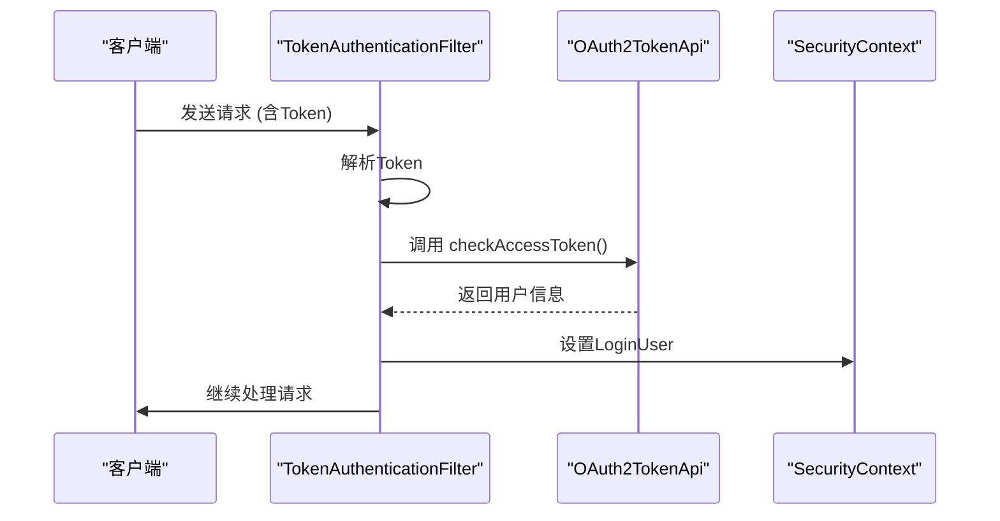
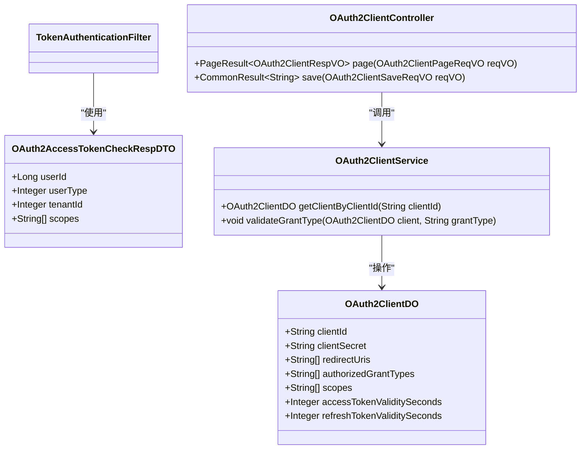
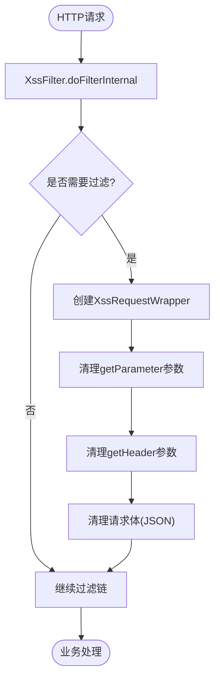
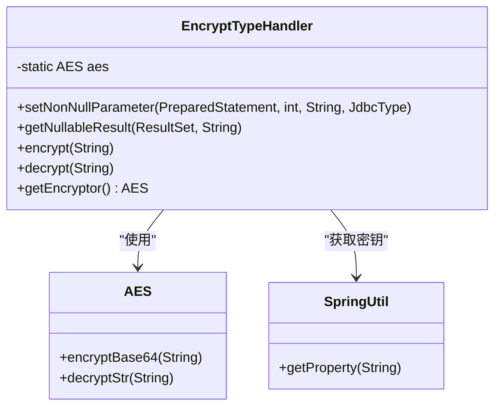

# 安全配置

<cite>
**本文档引用的文件**  
- [YudaoWebSecurityConfigurerAdapter.java](file://yudao-framework/yudao-spring-boot-starter-security/src/main/java/cn/iocoder/yudao/framework/security/config/YudaoWebSecurityConfigurerAdapter.java)
- [YudaoSecurityAutoConfiguration.java](file://yudao-framework/yudao-spring-boot-starter-security/src/main/java/cn/iocoder/yudao/framework/security/config/YudaoSecurityAutoConfiguration.java)
- [SecurityProperties.java](file://yudao-framework/yudao-spring-boot-starter-security/src/main/java/cn/iocoder/yudao/framework/security/config/SecurityProperties.java)
- [TokenAuthenticationFilter.java](file://yudao-framework/yudao-spring-boot-starter-security/src/main/java/cn/iocoder/yudao/framework/security/core/filter/TokenAuthenticationFilter.java)
- [SecurityConfiguration.java](file://yudao-module-infra/yudao-module-infra-biz/src/main/java/cn/iocoder/yudao/module/infra/framework/security/config/SecurityConfiguration.java)
- [XssProperties.java](file://yudao-framework/yudao-spring-boot-starter-web/src/main/java/cn/iocoder/yudao/framework/xss/config/XssProperties.java)
- [YudaoXssAutoConfiguration.java](file://yudao-framework/yudao-spring-boot-starter-web/src/main/java/cn/iocoder/yudao/framework/xss/config/YudaoXssAutoConfiguration.java)
- [XssFilter.java](file://yudao-framework/yudao-spring-boot-starter-web/src/main/java/cn/iocoder/yudao/framework/xss/core/filter/XssFilter.java)
- [JsoupXssCleaner.java](file://yudao-framework/yudao-spring-boot-starter-web/src/main/java/cn/iocoder/yudao/framework/xss/core/clean/JsoupXssCleaner.java)
- [EncryptTypeHandler.java](file://eplus-framework/eplus-common/src/main/java/com/syj/eplus/framework/common/config/handler/EncryptTypeHandler.java)
- [OAuth2ClientController.java](file://yudao-module-system/yudao-module-system-biz/src/main/java/cn/iocoder/yudao/module/system/controller/admin/oauth2/OAuth2ClientController.java)
</cite>

## 目录
1. [简介](#简介)
2. [身份认证与授权机制](#身份认证与授权机制)
3. [OAuth2.0 集成配置](#oauth20-集成配置)
4. [Web 安全防护](#web-安全防护)
5. [数据加密与安全传输](#数据加密与安全传输)
6. [安全配置最佳实践](#安全配置最佳实践)
7. [安全审计日志](#安全审计日志)
8. [安全漏洞扫描与渗透测试](#安全漏洞扫描与渗透测试)

## 简介
本安全配置文档全面阐述了基于 Spring Security 的身份认证、授权机制以及 OAuth2.0 集成方案。文档详细说明了系统如何通过 Token 认证过滤器实现无状态安全控制，采用 BCryptPasswordEncoder 进行密码加密，并通过自定义注解和配置实现细粒度权限管理。同时，系统集成了 XSS 防护、CSRF 防护等安全措施，确保 Web 应用的安全性。对于敏感数据，系统采用 AES 加密算法进行字段级加密存储，并通过安全的传输机制保护数据在传输过程中的完整性与机密性。文档还提供了安全审计、日志记录以及安全测试的最佳实践建议，为开发者提供完整的安全保障指导。

## 身份认证与授权机制

系统基于 Spring Security 框架实现了完整的身份认证和授权机制。通过 `YudaoWebSecurityConfigurerAdapter` 类配置安全过滤链，采用基于 Token 的无状态认证方式，禁用 Session 管理，确保系统的可扩展性和安全性。

权限控制通过 `@PreAuthorize`、`@Secured` 等注解实现方法级别的安全控制，并结合 `@PermitAll` 注解标记无需认证的接口。系统通过 `TokenAuthenticationFilter` 过滤器验证请求中的 Token，调用 OAuth2 令牌服务进行有效性校验，并将认证后的用户信息存入 Spring Security 上下文，供后续业务逻辑使用。

密码加密采用 BCryptPasswordEncoder 算法，通过 `SecurityProperties` 配置加密强度，确保用户密码的安全存储。

**图示来源**
- [TokenAuthenticationFilter.java](file://yudao-framework/yudao-spring-boot-starter-security/src/main/java/cn/iocoder/yudao/framework/security/core/filter/TokenAuthenticationFilter.java)
- [YudaoWebSecurityConfigurerAdapter.java](file://yudao-framework/yudao-spring-boot-starter-security/src/main/java/cn/iocoder/yudao/framework/security/config/YudaoWebSecurityConfigurerAdapter.java)

**本节来源**
- [YudaoWebSecurityConfigurerAdapter.java](file://yudao-framework/yudao-spring-boot-starter-security/src/main/java/cn/iocoder/yudao/framework/security/config/YudaoWebSecurityConfigurerAdapter.java)
- [YudaoSecurityAutoConfiguration.java](file://yudao-framework/yudao-spring-boot-starter-security/src/main/java/cn/iocoder/yudao/framework/security/config/YudaoSecurityAutoConfiguration.java)
- [SecurityProperties.java](file://yudao-framework/yudao-spring-boot-starter-security/src/main/java/cn/iocoder/yudao/framework/security/config/SecurityProperties.java)

## OAuth2.0 集成配置

系统通过 `OAuth2ClientController` 提供 OAuth2.0 客户端管理功能，支持多种授权模式。在 `SecurityProperties` 中配置了 Token 的 Header 名称（默认为 Authorization）和参数名称（用于 WebSocket 场景），确保不同通信方式下的认证一致性。

OAuth2.0 客户端配置包括客户端 ID、密钥、重定向 URI、授权类型（如 password、authorization_code 等）、授权范围（scopes）以及令牌有效期等参数。系统通过 `OAuth2ApproveService` 实现用户对第三方应用的授权批准机制，支持自动批准特定范围的授权请求。

**图示来源**
- [OAuth2ClientController.java](file://yudao-module-system/yudao-module-system-biz/src/main/java/cn/iocoder/yudao/module/system/controller/admin/oauth2/OAuth2ClientController.java)
- [OAuth2ClientDO.java](file://yudao-module-system/yudao-module-system-biz/src/main/java/cn/iocoder/yudao/module/system/dal/dataobject/oauth2/OAuth2ClientDO.java)
- [OAuth2AccessTokenCheckRespDTO.java](file://yudao-module-system/yudao-module-system-api/src/main/java/cn/iocoder/yudao/module/system/api/oauth2/dto/OAuth2AccessTokenCheckRespDTO.java)

**本节来源**
- [OAuth2ClientController.java](file://yudao-module-system/yudao-module-system-biz/src/main/java/cn/iocoder/yudao/module/system/controller/admin/oauth2/OAuth2ClientController.java)
- [SecurityProperties.java](file://yudao-framework/yudao-spring-boot-starter-security/src/main/java/cn/iocoder/yudao/framework/security/config/SecurityProperties.java)

## Web 安全防护

系统实现了全面的 Web 安全防护机制，包括 XSS 防护和 CSRF 防护。

### XSS 防护
通过 `YudaoXssAutoConfiguration` 自动配置 XSS 防护功能。系统使用 `JsoupXssCleaner` 作为默认的 XSS 清理器，基于 Jsoup 库对 HTML 内容进行安全过滤。过滤规则在默认宽松策略基础上扩展了 style、class 属性支持，并允许 img 标签使用 data 协议以支持 base64 图片。

XSS 过滤通过 `XssFilter` 实现，包装 HttpServletRequest，对参数、Header、QueryString 等输入进行自动清理。系统同时支持通过 Jackson 反序列化器对 JSON 请求体中的字符串进行 XSS 过滤。

### CSRF 防护
由于系统采用基于 Token 的无状态认证机制，不使用 Session，因此在 `YudaoWebSecurityConfigurerAdapter` 中明确禁用了 CSRF 防护。这是无状态 API 服务的常见安全实践。

**图示来源**
- [YudaoXssAutoConfiguration.java](file://yudao-framework/yudao-spring-boot-starter-web/src/main/java/cn/iocoder/yudao/framework/xss/config/YudaoXssAutoConfiguration.java)
- [XssFilter.java](file://yudao-framework/yudao-spring-boot-starter-web/src/main/java/cn/iocoder/yudao/framework/xss/core/filter/XssFilter.java)
- [XssRequestWrapper.java](file://yudao-framework/yudao-spring-boot-starter-web/src/main/java/cn/iocoder/yudao/framework/xss/core/filter/XssRequestWrapper.java)

**本节来源**
- [YudaoXssAutoConfiguration.java](file://yudao-framework/yudao-spring-boot-starter-web/src/main/java/cn/iocoder/yudao/framework/xss/config/YudaoXssAutoConfiguration.java)
- [XssProperties.java](file://yudao-framework/yudao-spring-boot-starter-web/src/main/java/cn/iocoder/yudao/framework/xss/config/XssProperties.java)
- [XssFilter.java](file://yudao-framework/yudao-spring-boot-starter-web/src/main/java/cn/iocoder/yudao/framework/xss/core/filter/XssFilter.java)
- [YudaoWebSecurityConfigurerAdapter.java](file://yudao-framework/yudao-spring-boot-starter-security/src/main/java/cn/iocoder/yudao/framework/security/config/YudaoWebSecurityConfigurerAdapter.java)

## 数据加密与安全传输

系统采用多层次的数据加密策略保护敏感信息。

### 敏感数据加密
通过 `EncryptTypeHandler` 实现数据库字段级加密。该处理器基于 Hutool 的 AES 算法，使用配置项 `mybatis-plus.encryptor.password` 指定的密钥进行加解密。当 MyBatis 持久化对象时，自动对标注为加密的字段进行加密存储，查询时自动解密，对业务代码透明。

### 安全传输
系统通过 HTTPS 协议确保数据在传输过程中的安全性。在 `YudaoWebSecurityConfigurerAdapter` 中配置了安全头策略，禁用 iframe 嵌套（X-Frame-Options），防止点击劫持攻击。

**图示来源**
- [EncryptTypeHandler.java](file://eplus-framework/eplus-common/src/main/java/com/syj/eplus/framework/common/config/handler/EncryptTypeHandler.java)

**本节来源**
- [EncryptTypeHandler.java](file://eplus-framework/eplus-common/src/main/java/com/syj/eplus/framework/common/config/handler/EncryptTypeHandler.java)
- [YudaoWebSecurityConfigurerAdapter.java](file://yudao-framework/yudao-spring-boot-starter-security/src/main/java/cn/iocoder/yudao/framework/security/config/YudaoWebSecurityConfigurerAdapter.java)

## 安全配置最佳实践

### 密码策略
系统使用 BCryptPasswordEncoder 进行密码加密，通过 `securityProperties.passwordEncoderLength` 配置加密强度（默认为4）。建议在生产环境中适当提高该值以增强安全性。

### 会话管理
系统采用无状态（STATELESS）会话管理策略，不使用服务器端 Session，所有认证信息通过 Token 在客户端维护。这提高了系统的可扩展性，避免了 Session 共享问题。

### 安全头设置
系统通过 `headers().frameOptions().disable()` 禁用 iframe 嵌套，防止点击劫持攻击。建议在生产环境中根据实际需求配置更严格的安全头，如 Content-Security-Policy、Strict-Transport-Security 等。

### 免登录配置
通过 `securityProperties.permitAllUrls` 配置项和 `@PermitAll` 注解灵活配置无需认证的接口。系统还自动放行 Swagger 文档、Actuator 监控端点等开发运维接口。

**本节来源**
- [SecurityProperties.java](file://yudao-framework/yudao-spring-boot-starter-security/src/main/java/cn/iocoder/yudao/framework/security/config/SecurityProperties.java)
- [YudaoWebSecurityConfigurerAdapter.java](file://yudao-framework/yudao-spring-boot-starter-security/src/main/java/cn/iocoder/yudao/framework/security/config/YudaoWebSecurityConfigurerAdapter.java)
- [SecurityConfiguration.java](file://yudao-module-infra/yudao-module-infra-biz/src/main/java/cn/iocoder/yudao/module/infra/framework/security/config/SecurityConfiguration.java)

## 安全审计日志

系统通过 `yudao-spring-boot-starter-operatelog` 组件实现操作日志审计功能。虽然具体实现文件未在分析中直接获取，但基于项目结构可以推断系统具备完整的操作日志记录能力。

操作日志通常记录用户的关键操作，包括登录、登出、数据修改等，包含操作人、操作时间、操作类型、操作对象、请求参数等信息。日志数据持久化到数据库，支持后续审计和追溯。

建议配置日志保留策略，定期归档和清理历史日志，同时确保日志存储的安全性，防止日志被篡改或删除。

## 安全漏洞扫描与渗透测试

### 漏洞扫描建议
1. 使用 OWASP ZAP 或 Burp Suite 对 API 接口进行自动化扫描
2. 重点检查 XSS、SQL 注入、越权访问等常见漏洞
3. 验证 Token 认证机制的有效性，测试 Token 泄露和重放攻击
4. 检查敏感信息泄露，如错误信息中是否包含堆栈跟踪

### 渗透测试建议
1. 测试 OAuth2.0 授权流程的安全性，验证授权码、Token 的有效性
2. 尝试越权访问，验证基于角色的访问控制（RBAC）是否有效
3. 测试密码策略，验证弱密码是否被拒绝
4. 检查安全头配置，验证是否有效防止点击劫持、XSS 等攻击
5. 测试文件上传功能（如有），验证文件类型和内容的安全检查

建议定期进行安全测试，并将安全测试纳入 CI/CD 流程，确保新功能不会引入安全漏洞。