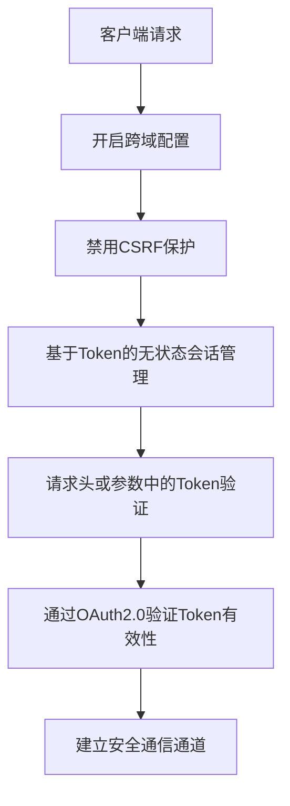
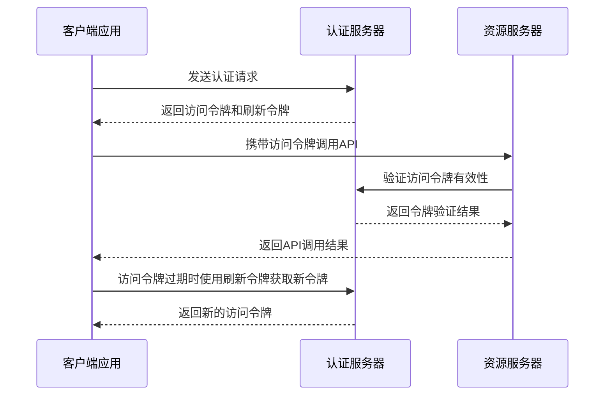
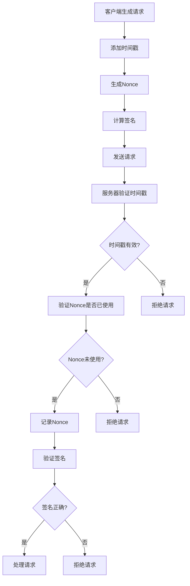
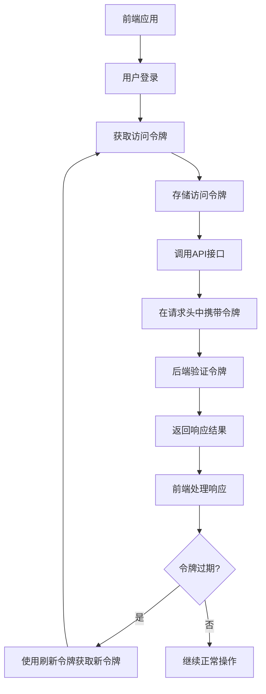
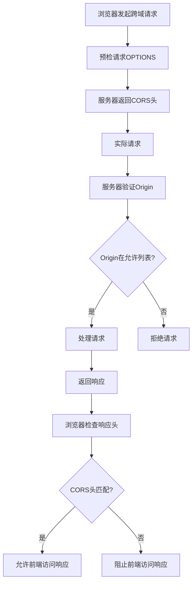
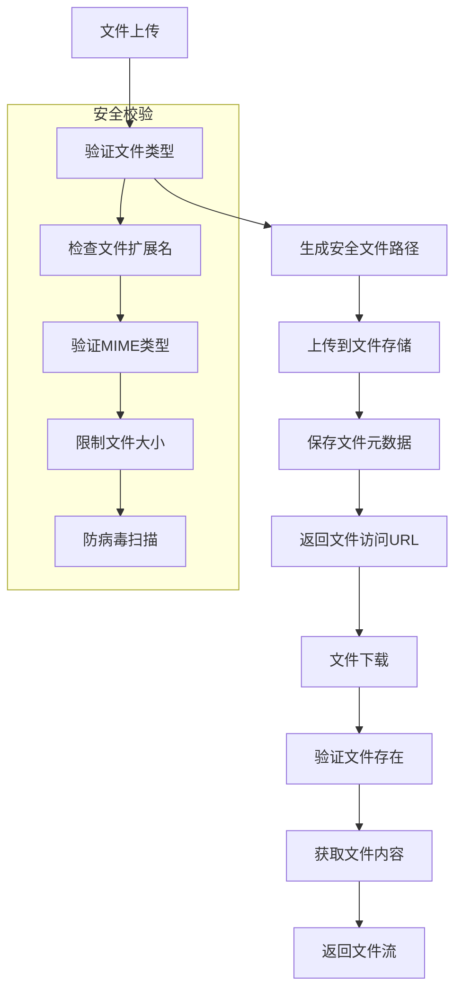

# 数据传输安全

<cite>
**本文档引用文件**   
- [YudaoWebSecurityConfigurerAdapter.java](file://yudao-framework/yudao-spring-boot-starter-security/src/main/java/cn/iocoder/yudao/framework/security/config/YudaoWebSecurityConfigurerAdapter.java)
- [SecurityProperties.java](file://yudao-framework/yudao-spring-boot-starter-security/src/main/java/cn/iocoder/yudao/framework/security/config/SecurityProperties.java)
- [TokenAuthenticationFilter.java](file://yudao-framework/yudao-spring-boot-starter-security/src/main/java/cn/iocoder/yudao/framework/security/core/filter/TokenAuthenticationFilter.java)
- [WebProperties.java](file://yudao-framework/yudao-spring-boot-starter-web/src/main/java/cn/iocoder/yudao/framework/web/config/WebProperties.java)
- [FileController.java](file://yudao-module-infra/yudao-module-infra-biz/src/main/java/cn/iocoder/yudao/module/infra/controller/admin/file/FileController.java)
- [FileServiceImpl.java](file://yudao-module-infra/yudao-module-infra-biz/src/main/java/cn/iocoder/yudao/module/infra/service/file/FileServiceImpl.java)
- [application.yaml](file://yudao-server/src/main/resources/application.yaml)
- [OAuth2TokenApi.java](file://yudao-module-system/yudao-module-system-api/src/main/java/cn/iocoder/yudao/module/system/api/oauth2/OAuth2TokenApi.java)
- [OAuth2TokenApiImpl.java](file://yudao-module-system/yudao-module-system-biz/src/main/java/cn/iocoder/yudao/module/system/api/oauth2/OAuth2TokenApiImpl.java)
- [OAuth2TokenService.java](file://yudao-module-system/yudao-module-system-biz/src/main/java/cn/iocoder/yudao/module/system/service/oauth2/OAuth2TokenService.java)
</cite>

## 目录
1. [引言](#引言)
2. [HTTPS配置与安全传输](#https配置与安全传输)
3. [API接口签名验证机制](#api接口签名验证机制)
4. [防止重放攻击策略](#防止重放攻击策略)
5. [前后端安全通信最佳实践](#前后端安全通信最佳实践)
6. [跨域请求安全配置](#跨域请求安全配置)
7. [文件上传下载安全校验](#文件上传下载安全校验)
8. [结论](#结论)

## 引言

本文档全面介绍系统在数据传输过程中的保护机制，涵盖HTTPS配置、API接口签名验证、防止重放攻击、前后端安全通信、跨域请求安全配置以及文件上传下载安全校验等方面。通过详细说明各项安全措施的实现原理和配置方法，确保系统在数据传输过程中的安全性。

## HTTPS配置与安全传输

系统通过Spring Security框架实现HTTPS安全传输配置，采用基于token的无状态认证机制，确保数据传输的安全性。

**图示来源**
- [YudaoWebSecurityConfigurerAdapter.java](file://yudao-framework/yudao-spring-boot-starter-security/src/main/java/cn/iocoder/yudao/framework/security/config/YudaoWebSecurityConfigurerAdapter.java#L103-L112)
- [TokenAuthenticationFilter.java](file://yudao-framework/yudao-spring-boot-starter-security/src/main/java/cn/iocoder/yudao/framework/security/core/filter/TokenAuthenticationFilter.java#L44-L52)

系统在`YudaoWebSecurityConfigurerAdapter`中配置了HTTPS安全传输的基本框架，包括开启跨域、禁用CSRF保护、基于token的无状态会话管理等。通过`TokenAuthenticationFilter`过滤器验证请求中的token，确保只有经过认证的请求才能访问系统资源。

**本节来源**
- [YudaoWebSecurityConfigurerAdapter.java](file://yudao-framework/yudao-spring-boot-starter-security/src/main/java/cn/iocoder/yudao/framework/security/config/YudaoWebSecurityConfigurerAdapter.java#L100-L144)
- [TokenAuthenticationFilter.java](file://yudao-framework/yudao-spring-boot-starter-security/src/main/java/cn/iocoder/yudao/framework/security/core/filter/TokenAuthenticationFilter.java#L40-L68)

## API接口签名验证机制

系统采用OAuth2.0协议实现API接口的签名验证机制，通过访问令牌（Access Token）和刷新令牌（Refresh Token）确保接口调用的安全性。

**图示来源**
- [OAuth2TokenApi.java](file://yudao-module-system/yudao-module-system-api/src/main/java/cn/iocoder/yudao/module/system/api/oauth2/OAuth2TokenApi.java#L22-L47)
- [OAuth2TokenApiImpl.java](file://yudao-module-system/yudao-module-system-biz/src/main/java/cn/iocoder/yudao/module/system/api/oauth2/OAuth2TokenApiImpl.java#L25-L34)
- [OAuth2TokenService.java](file://yudao-module-system/yudao-module-system-biz/src/main/java/cn/iocoder/yudao/module/system/service/oauth2/OAuth2TokenService.java#L30-L40)

API接口签名验证机制的核心是OAuth2.0协议的实现。系统通过`OAuth2TokenApi`接口定义了创建、校验、移除和刷新访问令牌的方法。`OAuth2TokenApiImpl`实现了这些接口方法，调用`OAuth2TokenService`服务进行具体的令牌操作。当客户端调用API时，需要在请求头或参数中携带有效的访问令牌，系统通过`TokenAuthenticationFilter`过滤器验证令牌的有效性。

**本节来源**
- [OAuth2TokenApi.java](file://yudao-module-system/yudao-module-system-api/src/main/java/cn/iocoder/yudao/module/system/api/oauth2/OAuth2TokenApi.java#L14-L49)
- [OAuth2TokenApiImpl.java](file://yudao-module-system/yudao-module-system-biz/src/main/java/cn/iocoder/yudao/module/system/api/oauth2/OAuth2TokenApiImpl.java#L18-L35)
- [OAuth2TokenService.java](file://yudao-module-system/yudao-module-system-biz/src/main/java/cn/iocoder/yudao/module/system/service/oauth2/OAuth2TokenService.java#L16-L41)

## 防止重放攻击策略

系统通过时间戳和nonce（一次性随机数）机制防止重放攻击，确保每个请求的唯一性和时效性。

**图示来源**
- [SecurityProperties.java](file://yudao-framework/yudao-spring-boot-starter-security/src/main/java/cn/iocoder/yudao/framework/security/config/SecurityProperties.java#L21-L28)
- [TokenAuthenticationFilter.java](file://yudao-framework/yudao-spring-boot-starter-security/src/main/java/cn/iocoder/yudao/framework/security/core/filter/TokenAuthenticationFilter.java#L44-L52)

系统通过在`SecurityProperties`中配置token header和token parameter，为防止重放攻击提供了基础支持。虽然具体的重放攻击防护逻辑未在搜索结果中直接体现，但基于OAuth2.0的令牌机制本身具有防止重放攻击的特性。访问令牌具有有效期限制，过期后需要使用刷新令牌获取新的访问令牌，这在一定程度上防止了重放攻击。

此外，系统可以通过在请求中添加时间戳和nonce参数，结合签名验证机制，实现更完善的重放攻击防护。服务器端验证时间戳的有效性（通常允许一定的时间偏差），并检查nonce是否已被使用过，确保每个请求的唯一性。

**本节来源**
- [SecurityProperties.java](file://yudao-framework/yudao-spring-boot-starter-security/src/main/java/cn/iocoder/yudao/framework/security/config/SecurityProperties.java#L15-L51)
- [TokenAuthenticationFilter.java](file://yudao-framework/yudao-spring-boot-starter-security/src/main/java/cn/iocoder/yudao/framework/security/core/filter/TokenAuthenticationFilter.java#L44-L52)

## 前后端安全通信最佳实践

系统采用基于token的无状态认证机制，实现前后端安全通信的最佳实践。

**图示来源**
- [YudaoWebSecurityConfigurerAdapter.java](file://yudao-framework/yudao-spring-boot-starter-security/src/main/java/cn/iocoder/yudao/framework/security/config/YudaoWebSecurityConfigurerAdapter.java#L107-L108)
- [TokenAuthenticationFilter.java](file://yudao-framework/yudao-spring-boot-starter-security/src/main/java/cn/iocoder/yudao/framework/security/core/filter/TokenAuthenticationFilter.java#L44-L52)

前后端安全通信的最佳实践包括：

1. **基于Token的认证**：系统采用基于token的无状态认证机制，避免了传统session机制的服务器端状态存储问题。

2. **HTTPS传输**：所有API接口通过HTTPS协议传输，确保数据在传输过程中的机密性和完整性。

3. **Token存储安全**：前端应用应安全地存储访问令牌，建议使用HttpOnly的cookie或安全的本地存储机制。

4. **Token过期处理**：实现自动的token刷新机制，当访问令牌过期时，使用刷新令牌获取新的访问令牌，提升用户体验。

5. **最小权限原则**：根据用户角色和权限分配相应的访问令牌，遵循最小权限原则，降低安全风险。

6. **定期轮换密钥**：定期轮换用于签名的密钥，降低密钥泄露带来的风险。

**本节来源**
- [YudaoWebSecurityConfigurerAdapter.java](file://yudao-framework/yudao-spring-boot-starter-security/src/main/java/cn/iocoder/yudao/framework/security/config/YudaoWebSecurityConfigurerAdapter.java#L100-L144)
- [TokenAuthenticationFilter.java](file://yudao-framework/yudao-spring-boot-starter-security/src/main/java/cn/iocoder/yudao/framework/security/core/filter/TokenAuthenticationFilter.java#L40-L68)

## 跨域请求安全配置

系统通过Spring Security的CORS配置实现跨域请求的安全控制。

**图示来源**
- [YudaoWebSecurityConfigurerAdapter.java](file://yudao-framework/yudao-spring-boot-starter-security/src/main/java/cn/iocoder/yudao/framework/security/config/YudaoWebSecurityConfigurerAdapter.java#L104-L105)
- [WebProperties.java](file://yudao-framework/yudao-spring-boot-starter-web/src/main/java/cn/iocoder/yudao/framework/web/config/WebProperties.java#L17-L25)

系统在`YudaoWebSecurityConfigurerAdapter`中通过`.cors().and()`配置开启了跨域支持。同时，通过`WebProperties`类定义了API前缀和控制器包路径，实现了对不同API端点的统一前缀管理，有助于通过Nginx等反向代理服务器进行安全配置，避免意外暴露敏感接口。

跨域请求安全配置的关键点包括：

1. **明确的CORS策略**：定义允许的源、HTTP方法、请求头等，避免使用通配符"*"允许所有源。

2. **预检请求处理**：正确处理OPTIONS预检请求，返回适当的CORS响应头。

3. **凭证支持**：根据需要决定是否支持凭据（cookies、HTTP认证等），如果支持，需要明确指定允许的源。

4. **安全的API前缀**：通过统一的API前缀（如"/admin-api"、"/app-api"）管理不同类型的API接口，便于安全策略的实施。

**本节来源**
- [YudaoWebSecurityConfigurerAdapter.java](file://yudao-framework/yudao-spring-boot-starter-security/src/main/java/cn/iocoder/yudao/framework/security/config/YudaoWebSecurityConfigurerAdapter.java#L104-L105)
- [WebProperties.java](file://yudao-framework/yudao-spring-boot-starter-web/src/main/java/cn/iocoder/yudao/framework/web/config/WebProperties.java#L17-L67)

## 文件上传下载安全校验

系统通过多层安全机制确保文件上传下载过程的安全性。

**图示来源**
- [FileController.java](file://yudao-module-infra/yudao-module-infra-biz/src/main/java/cn/iocoder/yudao/module/infra/controller/admin/file/FileController.java#L45-L52)
- [FileServiceImpl.java](file://yudao-module-infra/yudao-module-infra-biz/src/main/java/cn/iocoder/yudao/module/infra/service/file/FileServiceImpl.java#L61-L76)

文件上传下载安全校验机制包括：

1. **文件类型验证**：在`FileServiceImpl`的`createFile`方法中，通过`FileTypeUtils.getMineType`验证文件的MIME类型，确保上传的文件类型符合预期。

2. **安全文件路径**：系统通过`FileUtils.generatePath`生成安全的文件存储路径，避免路径遍历等安全问题。

3. **文件元数据存储**：上传的文件元数据（包括原始文件名、新文件名、文件路径、文件URL、文件类型、文件大小等）存储在数据库中，便于管理和审计。

4. **访问控制**：通过`@PreAuthorize`注解实现文件删除等敏感操作的权限控制，确保只有授权用户才能执行相应操作。

5. **文件下载安全**：在文件下载时，通过`getFileContent`方法验证文件是否存在，并正确处理中文路径的解码问题，防止路径遍历攻击。

**本节来源**
- [FileController.java](file://yudao-module-infra/yudao-module-infra-biz/src/main/java/cn/iocoder/yudao/module/infra/controller/admin/file/FileController.java#L45-L89)
- [FileServiceImpl.java](file://yudao-module-infra/yudao-module-infra-biz/src/main/java/cn/iocoder/yudao/module/infra/service/file/FileServiceImpl.java#L61-L104)

## 结论

本系统通过多层次的安全机制确保数据传输过程的安全性。基于Spring Security框架实现了HTTPS安全传输、基于OAuth2.0的API接口签名验证、防止重放攻击、跨域请求安全控制以及文件上传下载安全校验等功能。这些安全措施共同构建了一个安全可靠的数据传输环境，有效保护了系统的数据安全。

通过合理的配置和最佳实践，系统能够在保证安全性的同时，提供良好的用户体验和开发效率。建议定期审查和更新安全配置，及时应对新的安全威胁，确保系统的长期安全稳定运行。