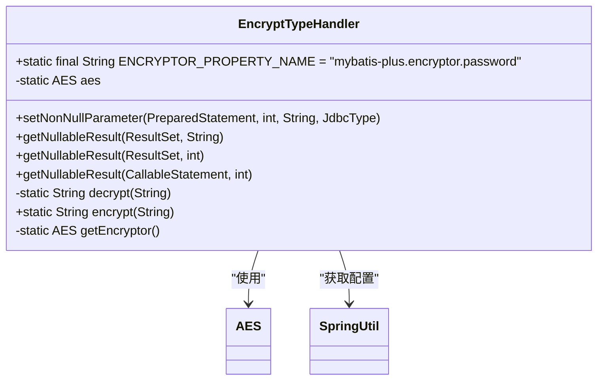
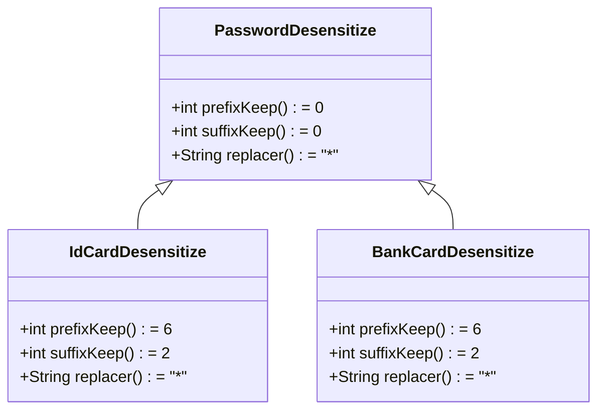
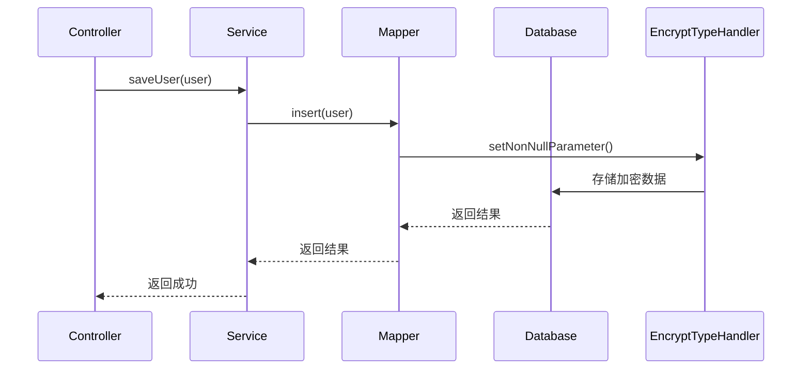

# 数据加密存储

<cite>
**本文档引用文件**  
- [EncryptTypeHandler.java](file://eplus-framework/eplus-common/src/main/java/com/syj/eplus/framework/common/config/handler/EncryptTypeHandler.java)
- [PasswordDesensitize.java](file://yudao-framework/yudao-spring-boot-starter-desensitize/src/main/java/cn/iocoder/yudao/framework/desensitize/core/slider/annotation/PasswordDesensitize.java)
- [IdCardDesensitize.java](file://yudao-framework/yudao-spring-boot-starter-desensitize/src/main/java/cn/iocoder/yudao/framework/desensitize/core/slider/annotation/IdCardDesensitize.java)
- [BankCardDesensitize.java](file://yudao-framework/yudao-spring-boot-starter-desensitize/src/main/java/cn/iocoder/yudao/framework/desensitize/core/slider/annotation/BankCardDesensitize.java)
- [DataSourceConfigServiceImplTest.java](file://yudao-module-infra/yudao-module-infra-biz/src/test/java/cn/iocoder/yudao/module/infra/service/db/DataSourceConfigServiceImplTest.java)
</cite>

## 目录
1. [引言](#引言)
2. [加密工具类实现](#加密工具类实现)
3. [敏感数据加密策略](#敏感数据加密策略)
4. [实体类与加密字段映射](#实体类与加密字段映射)
5. [Service层加密调用示例](#service层加密调用示例)
6. [加密数据查询与比较](#加密数据查询与比较)
7. [性能影响评估与优化建议](#性能影响评估与优化建议)

## 引言
本系统采用AES对称加密算法对数据库中的敏感信息进行加密存储，确保用户密码、身份证号、银行卡号等敏感数据在持久化过程中的安全性。通过MyBatis的TypeHandler机制实现透明加密，开发者无需在业务代码中显式调用加密方法，系统自动完成加解密过程。

## 加密工具类实现
系统核心加密功能由`EncryptTypeHandler`类实现，该类继承自MyBatis的`BaseTypeHandler<String>`，作为数据库字段的类型处理器。



**图示来源**  
- [EncryptTypeHandler.java](file://eplus-framework/eplus-common/src/main/java/com/syj/eplus/framework/common/config/handler/EncryptTypeHandler.java#L21-L75)

**本节来源**  
- [EncryptTypeHandler.java](file://eplus-framework/eplus-common/src/main/java/com/syj/eplus/framework/common/config/handler/EncryptTypeHandler.java#L1-L75)

## 敏感数据加密策略
系统针对不同类型的敏感数据采用相应的加密和脱敏策略：

### AES加密算法
- **算法类型**：对称加密
- **密钥配置**：通过`mybatis-plus.encryptor.password`配置项设置
- **加密模式**：使用Hutool工具库的`SecureUtil.aes()`方法
- **数据格式**：加密后数据以Base64编码存储

### 脱敏注解配置
系统提供多种脱敏注解，用于控制敏感数据的显示方式：



**图示来源**  
- [PasswordDesensitize.java](file://yudao-framework/yudao-spring-boot-starter-desensitize/src/main/java/cn/iocoder/yudao/framework/desensitize/core/slider/annotation/PasswordDesensitize.java#L1-L39)
- [IdCardDesensitize.java](file://yudao-framework/yudao-spring-boot-starter-desensitize/src/main/java/cn/iocoder/yudao/framework/desensitize/core/slider/annotation/IdCardDesensitize.java#L1-L37)
- [BankCardDesensitize.java](file://yudao-framework/yudao-spring-boot-starter-desensitize/src/main/java/cn/iocoder/yudao/framework/desensitize/core/slider/annotation/BankCardDesensitize.java#L1-L36)

**本节来源**  
- [PasswordDesensitize.java](file://yudao-framework/yudao-spring-boot-starter-desensitize/src/main/java/cn/iocoder/yudao/framework/desensitize/core/slider/annotation/PasswordDesensitize.java#L1-L39)
- [IdCardDesensitize.java](file://yudao-framework/yudao-spring-boot-starter-desensitize/src/main/java/cn/iocoder/yudao/framework/desensitize/core/slider/annotation/IdCardDesensitize.java#L1-L37)
- [BankCardDesensitize.java](file://yudao-framework/yudao-spring-boot-starter-desensitize/src/main/java/cn/iocoder/yudao/framework/desensitize/core/slider/annotation/BankCardDesensitize.java#L1-L36)

## 实体类与加密字段映射
在实体类中，通过MyBatis Plus的`@TableField`注解指定使用`EncryptTypeHandler`来处理敏感字段：

```java
@TableField(typeHandler = EncryptTypeHandler.class)
private String password;

@TableField(typeHandler = EncryptTypeHandler.class)
private String idCard;

@TableField(typeHandler = EncryptTypeHandler.class)
private String bankCard;
```

当数据持久化时，系统自动调用`EncryptTypeHandler.setNonNullParameter()`方法进行加密；当数据查询时，自动调用`getNullableResult()`方法进行解密，实现对业务代码的透明化。

**本节来源**  
- [EncryptTypeHandler.java](file://eplus-framework/eplus-common/src/main/java/com/syj/eplus/framework/common/config/handler/EncryptTypeHandler.java#L27-L48)

## Service层加密调用示例
在Service层，开发者无需显式调用加密方法，只需正常使用实体类即可：



在测试环境中，可以通过反射设置`EncryptTypeHandler`的`aes`字段来模拟加密过程：

```java
@Test
public void testCreateDataSourceConfig_success() {
    // mock 加密组件
    ReflectUtil.setFieldValue(EncryptTypeHandler.class, "aes", aes);
    when(aes.encryptBase64(anyString())).thenAnswer(invocation -> invocation.getArgument(0));
    when(aes.decryptStr(anyString())).thenAnswer(invocation -> invocation.getArgument(0));
    
    // 测试业务逻辑
    // ...
}
```

**图示来源**  
- [DataSourceConfigServiceImplTest.java](file://yudao-module-infra/yudao-module-infra-biz/src/test/java/cn/iocoder/yudao/module/infra/service/db/DataSourceConfigServiceImplTest.java#L58-L60)

**本节来源**  
- [DataSourceConfigServiceImplTest.java](file://yudao-module-infra/yudao-module-infra-biz/src/test/java/cn/iocoder/yudao/module/infra/service/db/DataSourceConfigServiceImplTest.java#L49-L66)

## 加密数据查询与比较
由于所有加密操作在数据库层面透明完成，查询操作可以直接使用明文进行比较：

```java
// 查询时使用明文，系统自动加密后与数据库中密文比较
User user = userMapper.selectOne(new QueryWrapper<User>().eq("password", rawPassword));
```

系统通过`EncryptTypeHandler`的`setNonNullParameter`方法在SQL执行前对查询条件进行加密，确保查询的准确性和安全性。

**本节来源**  
- [EncryptTypeHandler.java](file://eplus-framework/eplus-common/src/main/java/com/syj/eplus/framework/common/config/handler/EncryptTypeHandler.java#L27-L30)

## 性能影响评估与优化建议
### 性能影响
- **加密开销**：每次数据读写都需要进行加解密运算
- **内存占用**：Base64编码会使数据体积增加约33%
- **CPU消耗**：对称加密算法相对轻量，但高并发场景下仍有一定影响

### 优化建议
1. **缓存策略**：对频繁访问的敏感数据使用Redis缓存，减少数据库加解密次数
2. **批量处理**：对批量操作进行优化，减少重复的密钥初始化开销
3. **连接池配置**：适当增加数据库连接池大小，应对加解密带来的处理延迟
4. **监控告警**：监控加密相关性能指标，及时发现潜在性能瓶颈

**本节来源**  
- [EncryptTypeHandler.java](file://eplus-framework/eplus-common/src/main/java/com/syj/eplus/framework/common/config/handler/EncryptTypeHandler.java#L64-L73)