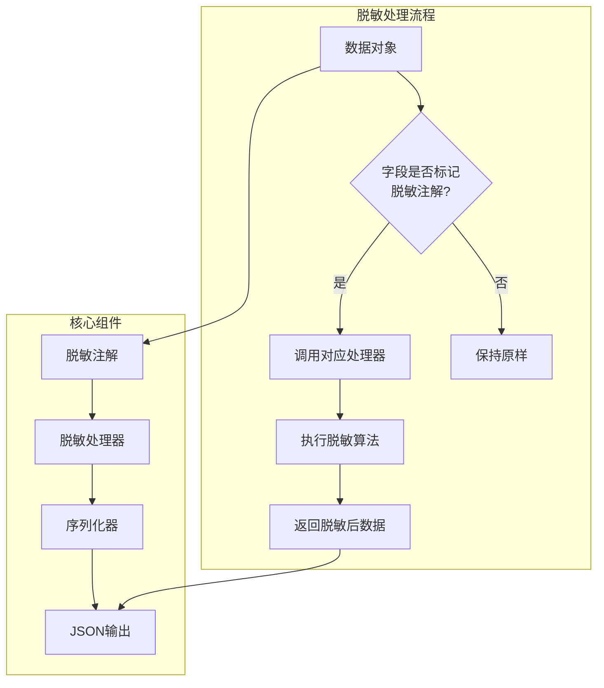
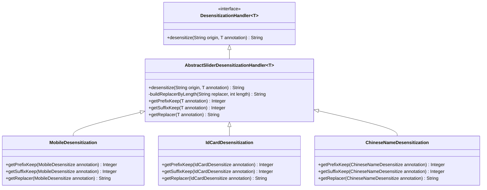
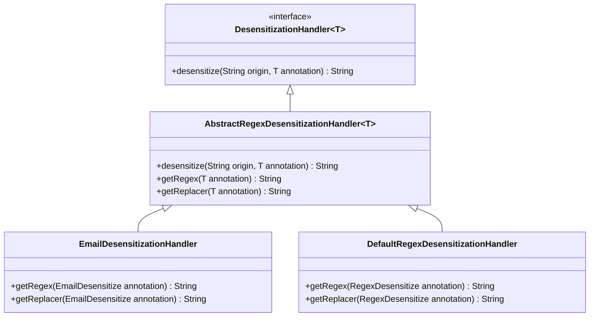
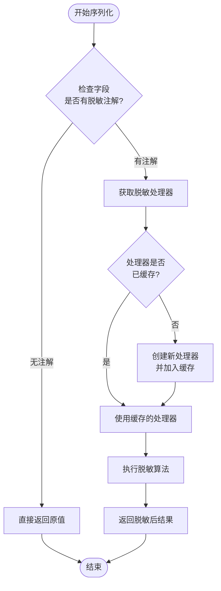
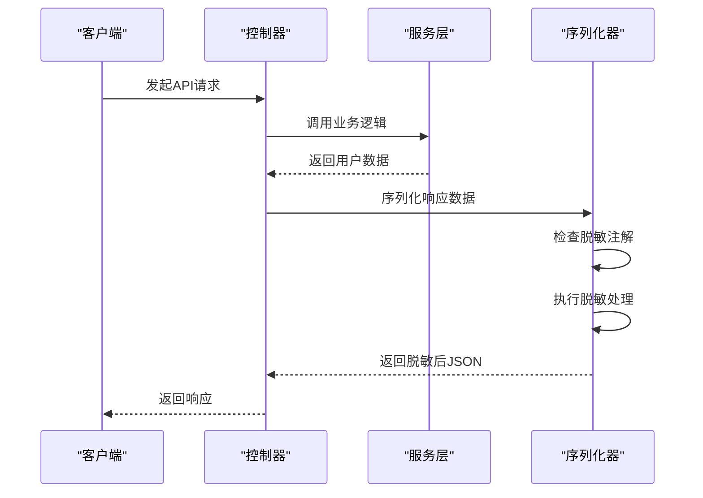
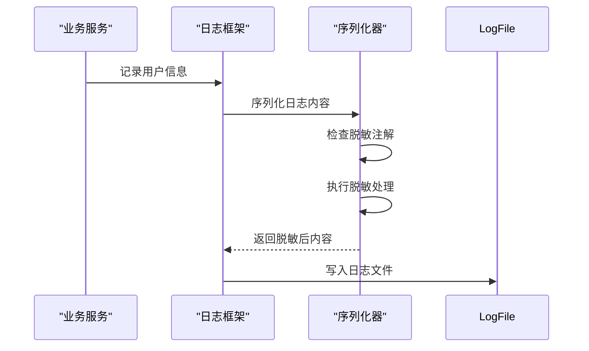

# 数据脱敏

<cite>
**本文档引用的文件**
- [DesensitizeBy.java](file://yudao-framework/yudao-spring-boot-starter-desensitize/src/main/java/cn/iocoder/yudao/framework/desensitize/core/base/annotation/DesensitizeBy.java)
- [StringDesensitizeSerializer.java](file://yudao-framework/yudao-spring-boot-starter-desensitize/src/main/java/cn/iocoder/yudao/framework/desensitize/core/base/serializer/StringDesensitizeSerializer.java)
- [DesensitizationHandler.java](file://yudao-framework/yudao-spring-boot-starter-desensitize/src/main/java/cn/iocoder/yudao/framework/desensitize/core/base/handler/DesensitizationHandler.java)
- [EmailDesensitize.java](file://yudao-framework/yudao-spring-boot-starter-desensitize/src/main/java/cn/iocoder/yudao/framework/desensitize/core/regex/annotation/EmailDesensitize.java)
- [MobileDesensitize.java](file://yudao-framework/yudao-spring-boot-starter-desensitize/src/main/java/cn/iocoder/yudao/framework/desensitize/core/slider/annotation/MobileDesensitize.java)
- [IdCardDesensitize.java](file://yudao-framework/yudao-spring-boot-starter-desensitize/src/main/java/cn/iocoder/yudao/framework/desensitize/core/slider/annotation/IdCardDesensitize.java)
- [PasswordDesensitize.java](file://yudao-framework/yudao-spring-boot-starter-desensitize/src/main/java/cn/iocoder/yudao/framework/desensitize/core/slider/annotation/PasswordDesensitize.java)
- [ChineseNameDesensitize.java](file://yudao-framework/yudao-spring-boot-starter-desensitize/src/main/java/cn/iocoder/yudao/framework/desensitize/core/slider/annotation/ChineseNameDesensitize.java)
- [RegexDesensitize.java](file://yudao-framework/yudao-spring-boot-starter-desensitize/src/main/java/cn/iocoder/yudao/framework/desensitize/core/regex/annotation/RegexDesensitize.java)
- [SliderDesensitize.java](file://yudao-framework/yudao-spring-boot-starter-desensitize/src/main/java/cn/iocoder/yudao/framework/desensitize/core/slider/annotation/SliderDesensitize.java)
- [AbstractSliderDesensitizationHandler.java](file://yudao-framework/yudao-spring-boot-starter-desensitize/src/main/java/cn/iocoder/yudao/framework/desensitize/core/slider/handler/AbstractSliderDesensitizationHandler.java)
- [AbstractRegexDesensitizationHandler.java](file://yudao-framework/yudao-spring-boot-starter-desensitize/src/main/java/cn/iocoder/yudao/framework/desensitize/core/regex/handler/AbstractRegexDesensitizationHandler.java)
- [DesensitizeTest.java](file://yudao-framework/yudao-spring-boot-starter-desensitize/src/test/java/cn/iocoder/yudao/framework/desensitize/core/DesensitizeTest.java)
</cite>

## 目录
1. [简介](#简介)
2. [核心组件](#核心组件)
3. [脱敏机制架构](#脱敏机制架构)
4. [脱敏注解详解](#脱敏注解详解)
5. [脱敏处理器实现](#脱敏处理器实现)
6. [自定义脱敏策略](#自定义脱敏策略)
7. [DTO对象中的应用示例](#dto对象中的应用示例)
8. [性能影响与缓存策略](#性能影响与缓存策略)
9. [应用场景](#应用场景)
10. [结论](#结论)

## 简介
本系统实现了全面的数据脱敏机制，用于保护敏感信息在日志记录、API响应等场景下的安全。该机制基于Jackson序列化框架，通过注解驱动的方式对敏感数据进行自动脱敏处理。系统提供了多种预定义的脱敏类型，包括手机号、身份证号、邮箱等，并支持自定义脱敏规则。

**本文档引用的文件**
- [DesensitizeBy.java](file://yudao-framework/yudao-spring-boot-starter-desensitize/src/main/java/cn/iocoder/yudao/framework/desensitize/core/base/annotation/DesensitizeBy.java)
- [StringDesensitizeSerializer.java](file://yudao-framework/yudao-spring-boot-starter-desensitize/src/main/java/cn/iocoder/yudao/framework/desensitize/core/base/serializer/StringDesensitizeSerializer.java)

## 核心组件

数据脱敏功能由多个核心组件构成，包括脱敏注解、脱敏处理器和序列化器。这些组件协同工作，实现对敏感数据的自动识别和处理。

**本文档引用的文件**
- [DesensitizationHandler.java](file://yudao-framework/yudao-spring-boot-starter-desensitize/src/main/java/cn/iocoder/yudao/framework/desensitize/core/base/handler/DesensitizationHandler.java)
- [StringDesensitizeSerializer.java](file://yudao-framework/yudao-spring-boot-starter-desensitize/src/main/java/cn/iocoder/yudao/framework/desensitize/core/base/serializer/StringDesensitizeSerializer.java)

## 脱敏机制架构



**图表来源**
- [DesensitizeBy.java](file://yudao-framework/yudao-spring-boot-starter-desensitize/src/main/java/cn/iocoder/yudao/framework/desensitize/core/base/annotation/DesensitizeBy.java)
- [StringDesensitizeSerializer.java](file://yudao-framework/yudao-spring-boot-starter-desensitize/src/main/java/cn/iocoder/yudao/framework/desensitize/core/base/serializer/StringDesensitizeSerializer.java)

**本文档引用的文件**
- [DesensitizeBy.java](file://yudao-framework/yudao-spring-boot-starter-desensitize/src/main/java/cn/iocoder/yudao/framework/desensitize/core/base/annotation/DesensitizeBy.java)
- [StringDesensitizeSerializer.java](file://yudao-framework/yudao-spring-boot-starter-desensitize/src/main/java/cn/iocoder/yudao/framework/desensitize/core/base/serializer/StringDesensitizeSerializer.java)

## 脱敏注解详解

系统提供了多种脱敏注解，用于标记需要脱敏处理的字段。所有脱敏注解都基于`@DesensitizeBy`元注解，该注解指定了对应的脱敏处理器和序列化器。

### 支持的脱敏类型

#### 手机号脱敏 (@MobileDesensitize)
```java
@MobileDesensitize(prefixKeep = 3, suffixKeep = 4, replacer = "*")
```
- **前缀保留长度**: 默认3位
- **后缀保留长度**: 默认4位
- **替换符**: 默认"*"
- **示例**: 13248765917 → 132****5917

#### 身份证号脱敏 (@IdCardDesensitize)
```java
@IdCardDesensitize(prefixKeep = 6, suffixKeep = 2, replacer = "*")
```
- **前缀保留长度**: 默认6位
- **后缀保留长度**: 默认2位
- **替换符**: 默认"*"
- **示例**: 530321199204074611 → 530321**********11

#### 邮箱脱敏 (@EmailDesensitize)
```java
@EmailDesensitize(regex = "(^.)[^@]*(@.*$)", replacer = "$1****$2")
```
- **正则表达式**: 匹配邮箱格式
- **替换规则**: 使用正则捕获组进行替换
- **示例**: 1@email.com → 1****@email.com

#### 中文姓名脱敏 (@ChineseNameDesensitize)
```java
@ChineseNameDesensitize(prefixKeep = 1, suffixKeep = 0, replacer = "*")
```
- **前缀保留长度**: 默认1位
- **后缀保留长度**: 默认0位
- **替换符**: 默认"*"
- **示例**: 芋道源码 → 芋***

#### 密码脱敏 (@PasswordDesensitize)
```java
@PasswordDesensitize(prefixKeep = 0, suffixKeep = 0, replacer = "*")
```
- **前缀保留长度**: 默认0位
- **后缀保留长度**: 默认0位
- **替换符**: 默认"*"
- **示例**: 123456 → ******

#### 正则表达式脱敏 (@RegexDesensitize)
```java
@RegexDesensitize(regex = "^[\\s\\S]*$", replacer = "******")
```
- **正则表达式**: 可自定义匹配模式
- **替换规则**: 可自定义替换字符串
- **示例**: 任意文本 → ******

#### 滑动脱敏 (@SliderDesensitize)
```java
@SliderDesensitize(prefixKeep = 0, suffixKeep = 0, replacer = "*")
```
- **前缀保留长度**: 可自定义
- **后缀保留长度**: 可自定义
- **替换符**: 可自定义
- **示例**: ABCDEFG → ******* (当prefixKeep=0, suffixKeep=0)

**本文档引用的文件**
- [MobileDesensitize.java](file://yudao-framework/yudao-spring-boot-starter-desensitize/src/main/java/cn/iocoder/yudao/framework/desensitize/core/slider/annotation/MobileDesensitize.java)
- [IdCardDesensitize.java](file://yudao-framework/yudao-spring-boot-starter-desensitize/src/main/java/cn/iocoder/yudao/framework/desensitize/core/slider/annotation/IdCardDesensitize.java)
- [EmailDesensitize.java](file://yudao-framework/yudao-spring-boot-starter-desensitize/src/main/java/cn/iocoder/yudao/framework/desensitize/core/regex/annotation/EmailDesensitize.java)
- [ChineseNameDesensitize.java](file://yudao-framework/yudao-spring-boot-starter-desensitize/src/main/java/cn/iocoder/yudao/framework/desensitize/core/slider/annotation/ChineseNameDesensitize.java)
- [PasswordDesensitize.java](file://yudao-framework/yudao-spring-boot-starter-desensitize/src/main/java/cn/iocoder/yudao/framework/desensitize/core/slider/annotation/PasswordDesensitize.java)
- [RegexDesensitize.java](file://yudao-framework/yudao-spring-boot-starter-desensitize/src/main/java/cn/iocoder/yudao/framework/desensitize/core/regex/annotation/RegexDesensitize.java)
- [SliderDesensitize.java](file://yudao-framework/yudao-spring-boot-starter-desensitize/src/main/java/cn/iocoder/yudao/framework/desensitize/core/slider/annotation/SliderDesensitize.java)

## 脱敏处理器实现

脱敏处理器是脱敏机制的核心，负责具体的脱敏算法实现。系统采用抽象模板模式，为不同类型的脱敏提供统一的处理接口。

### 滑动脱敏处理器



**图表来源**
- [AbstractSliderDesensitizationHandler.java](file://yudao-framework/yudao-spring-boot-starter-desensitize/src/main/java/cn/iocoder/yudao/framework/desensitize/core/slider/handler/AbstractSliderDesensitizationHandler.java)
- [MobileDesensitization.java](file://yudao-framework/yudao-spring-boot-starter-desensitize/src/main/java/cn/iocoder/yudao/framework/desensitize/core/slider/handler/MobileDesensitization.java)
- [IdCardDesensitization.java](file://yudao-framework/yudao-spring-boot-starter-desensitize/src/main/java/cn/iocoder/yudao/framework/desensitize/core/slider/handler/IdCardDesensitization.java)
- [ChineseNameDesensitization.java](file://yudao-framework/yudao-spring-boot-starter-desensitize/src/main/java/cn/iocoder/yudao/framework/desensitize/core/slider/handler/ChineseNameDesensitization.java)

### 正则表达式脱敏处理器



**图表来源**
- [AbstractRegexDesensitizationHandler.java](file://yudao-framework/yudao-spring-boot-starter-desensitize/src/main/java/cn/iocoder/yudao/framework/desensitize/core/regex/handler/AbstractRegexDesensitizationHandler.java)
- [EmailDesensitizationHandler.java](file://yudao-framework/yudao-spring-boot-starter-desensitize/src/main/java/cn/iocoder/yudao/framework/desensitize/core/regex/handler/EmailDesensitizationHandler.java)
- [DefaultRegexDesensitizationHandler.java](file://yudao-framework/yudao-spring-boot-starter-desensitize/src/main/java/cn/iocoder/yudao/framework/desensitize/core/regex/handler/DefaultRegexDesensitizationHandler.java)

**本文档引用的文件**
- [DesensitizationHandler.java](file://yudao-framework/yudao-spring-boot-starter-desensitize/src/main/java/cn/iocoder/yudao/framework/desensitize/core/base/handler/DesensitizationHandler.java)
- [AbstractSliderDesensitizationHandler.java](file://yudao-framework/yudao-spring-boot-starter-desensitize/src/main/java/cn/iocoder/yudao/framework/desensitize/core/slider/handler/AbstractSliderDesensitizationHandler.java)
- [AbstractRegexDesensitizationHandler.java](file://yudao-framework/yudao-spring-boot-starter-desensitize/src/main/java/cn/iocoder/yudao/framework/desensitize/core/regex/handler/AbstractRegexDesensitizationHandler.java)

## 自定义脱敏策略

系统支持通过继承抽象处理器类来创建自定义脱敏策略。开发者可以实现自己的脱敏逻辑，满足特定业务需求。

### 创建自定义脱敏注解

```java
@Documented
@Target({ElementType.FIELD})
@Retention(RetentionPolicy.RUNTIME)
@JacksonAnnotationsInside
@DesensitizeBy(handler = CustomDesensitizationHandler.class)
public @interface CustomDesensitize {
    int prefixKeep() default 2;
    int suffixKeep() default 2;
    String replacer() default "*";
}
```

### 创建自定义脱敏处理器

```java
public class CustomDesensitizationHandler extends AbstractSliderDesensitizationHandler<CustomDesensitize> {
    @Override
    Integer getPrefixKeep(CustomDesensitize annotation) {
        return annotation.prefixKeep();
    }
    
    @Override
    Integer getSuffixKeep(CustomDesensitize annotation) {
        return annotation.suffixKeep();
    }
    
    @Override
    String getReplacer(CustomDesensitize annotation) {
        return annotation.replacer();
    }
}
```

**本文档引用的文件**
- [DesensitizeBy.java](file://yudao-framework/yudao-spring-boot-starter-desensitize/src/main/java/cn/iocoder/yudao/framework/desensitize/core/base/annotation/DesensitizeBy.java)
- [AbstractSliderDesensitizationHandler.java](file://yudao-framework/yudao-spring-boot-starter-desensitize/src/main/java/cn/iocoder/yudao/framework/desensitize/core/slider/handler/AbstractSliderDesensitizationHandler.java)

## DTO对象中的应用示例

以下是在DTO对象中应用脱敏注解的实际示例：

```java
@Data
public class UserDTO {
    @ChineseNameDesensitize
    private String name;
    
    @MobileDesensitize
    private String phone;
    
    @IdCardDesensitize
    private String idCard;
    
    @EmailDesensitize
    private String email;
    
    @PasswordDesensitize
    private String password;
    
    @RegexDesensitize(regex = "公司名称", replacer = "***")
    private String company;
    
    private String normalField; // 不脱敏的普通字段
}
```

当该对象被序列化为JSON时，标记了脱敏注解的字段会自动进行脱敏处理，而普通字段保持不变。

**本文档引用的文件**
- [DesensitizeTest.java](file://yudao-framework/yudao-spring-boot-starter-desensitize/src/test/java/cn/iocoder/yudao/framework/desensitize/core/DesensitizeTest.java)

## 性能影响与缓存策略

### 性能影响分析

数据脱敏会对系统性能产生一定影响，主要体现在以下几个方面：

1. **序列化开销**: 每次序列化时都需要检查字段的注解信息
2. **字符串处理**: 脱敏算法需要对字符串进行处理和替换
3. **反射调用**: 需要通过反射获取字段的注解信息

### 性能优化策略



**图表来源**
- [StringDesensitizeSerializer.java](file://yudao-framework/yudao-spring-boot-starter-desensitize/src/main/java/cn/iocoder/yudao/framework/desensitize/core/base/serializer/StringDesensitizeSerializer.java)

系统采用以下策略来优化性能：
- **处理器缓存**: 使用Singleton模式缓存脱敏处理器实例
- **条件检查**: 只对非空字符串进行脱敏处理
- **高效算法**: 采用StringBuilder构建替换字符串，避免字符串拼接的性能损耗

**本文档引用的文件**
- [StringDesensitizeSerializer.java](file://yudao-framework/yudao-spring-boot-starter-desensitize/src/main/java/cn/iocoder/yudao/framework/desensitize/core/base/serializer/StringDesensitizeSerializer.java)

## 应用场景

### API响应脱敏

在API接口返回用户信息时，自动对敏感字段进行脱敏处理，确保前端接收到的数据已经过安全处理。



**图表来源**
- [StringDesensitizeSerializer.java](file://yudao-framework/yudao-spring-boot-starter-desensitize/src/main/java/cn/iocoder/yudao/framework/desensitize/core/base/serializer/StringDesensitizeSerializer.java)

### 日志记录脱敏

在记录日志时，对包含敏感信息的对象进行脱敏处理，防止敏感信息泄露到日志文件中。



**图表来源**
- [StringDesensitizeSerializer.java](file://yudao-framework/yudao-spring-boot-starter-desensitize/src/main/java/cn/iocoder/yudao/framework/desensitize/core/base/serializer/StringDesensitizeSerializer.java)

**本文档引用的文件**
- [StringDesensitizeSerializer.java](file://yudao-framework/yudao-spring-boot-starter-desensitize/src/main/java/cn/iocoder/yudao/framework/desensitize/core/base/serializer/StringDesensitizeSerializer.java)

## 结论

本系统的数据脱敏机制通过注解驱动的方式，实现了对敏感数据的自动识别和处理。该机制具有以下特点：

1. **易用性**: 通过简单的注解即可标记需要脱敏的字段
2. **灵活性**: 支持多种预定义脱敏类型，并可扩展自定义策略
3. **透明性**: 脱敏处理对业务代码透明，无需修改业务逻辑
4. **高性能**: 采用缓存和优化算法，最小化性能影响
5. **安全性**: 在数据输出层面进行统一处理，降低信息泄露风险

该机制可广泛应用于API响应、日志记录等场景，有效保护用户隐私和敏感信息的安全。