# 客户端管理

<cite>
**本文档引用的文件**   
- [OAuth2ClientController.java](file://yudao-module-system/yudao-module-system-biz/src/main/java/cn/iocoder/yudao/module/system/controller/admin/oauth2/OAuth2ClientController.java)
- [OAuth2ClientService.java](file://yudao-module-system/yudao-module-system-biz/src/main/java/cn/iocoder/yudao/module/system/service/oauth2/OAuth2ClientService.java)
- [OAuth2ClientServiceImpl.java](file://yudao-module-system/yudao-module-system-biz/src/main/java/cn/iocoder/yudao/module/system/service/oauth2/OAuth2ClientServiceImpl.java)
- [OAuth2ClientDO.java](file://yudao-module-system/yudao-module-system-biz/src/main/java/cn/iocoder/yudao/module/system/dal/dataobject/oauth2/OAuth2ClientDO.java)
- [OAuth2ClientSaveReqVO.java](file://yudao-module-system/yudao-module-system-biz/src/main/java/cn/iocoder/yudao/module/system/controller/admin/oauth2/vo/client/OAuth2ClientSaveReqVO.java)
- [OAuth2ClientMapper.java](file://yudao-module-system/yudao-module-system-biz/src/main/java/cn/iocoder/yudao/module/system/dal/mysql/oauth2/OAuth2ClientMapper.java)
- [ruoyi-vue-pro.sql](file://sql/mysql/ruoyi-vue-pro.sql)
- [OAuth2OpenController.java](file://yudao-module-system/yudao-module-system-biz/src/main/java/cn/iocoder/yudao/module/system/controller/admin/oauth2/OAuth2OpenController.java)
- [OAuth2ApproveServiceImpl.java](file://yudao-module-system/yudao-module-system-biz/src/main/java/cn/iocoder/yudao/module/system/service/oauth2/OAuth2ApproveServiceImpl.java)
- [OAuth2Utils.java](file://yudao-module-system/yudao-module-system-biz/src/main/java/cn/iocoder/yudao/module/system/util/oauth2/OAuth2Utils.java)
</cite>

## 目录
1. [简介](#简介)
2. [客户端注册与配置](#客户端注册与配置)
3. [客户端凭证管理](#客户端凭证管理)
4. [授权类型与作用域](#授权类型与作用域)
5. [客户端生命周期管理](#客户端生命周期管理)
6. [权限控制与细粒度访问](#权限控制与细粒度访问)
7. [管理接口与API操作](#管理接口与api操作)
8. [安全存储与加密机制](#安全存储与加密机制)
9. [总结](#总结)

## 简介

本文档详细介绍了OAuth2.0客户端的注册、配置和管理功能。系统通过OAuth2.0协议实现安全的授权机制，支持多种授权模式和细粒度的权限控制。客户端管理功能允许管理员创建和管理客户端ID、客户端密钥、授权范围（Scopes）、重定向URI和授权类型。系统实现了客户端凭证的加密存储和轮换机制，并提供了通过管理后台或API进行客户端生命周期管理的操作指南。

**本文档引用的文件**   
- [OAuth2ClientController.java](file://yudao-module-system/yudao-module-system-biz/src/main/java/cn/iocoder/yudao/module/system/controller/admin/oauth2/OAuth2ClientController.java)
- [OAuth2ClientService.java](file://yudao-module-system/yudao-module-system-biz/src/main/java/cn/iocoder/yudao/module/system/service/oauth2/OAuth2ClientService.java)

## 客户端注册与配置

OAuth2.0客户端的注册和配置是系统安全架构的核心部分。客户端通过唯一的客户端ID和密钥进行身份验证，系统提供了完整的客户端管理功能。

### 客户端基本信息

每个OAuth2.0客户端包含以下基本信息：
- **客户端ID**：唯一标识符，用于识别客户端应用
- **客户端密钥**：用于身份验证的密钥
- **应用名称**：客户端应用的显示名称
- **应用图标**：客户端应用的图标URL
- **应用描述**：客户端应用的详细描述
- **状态**：客户端的启用/禁用状态

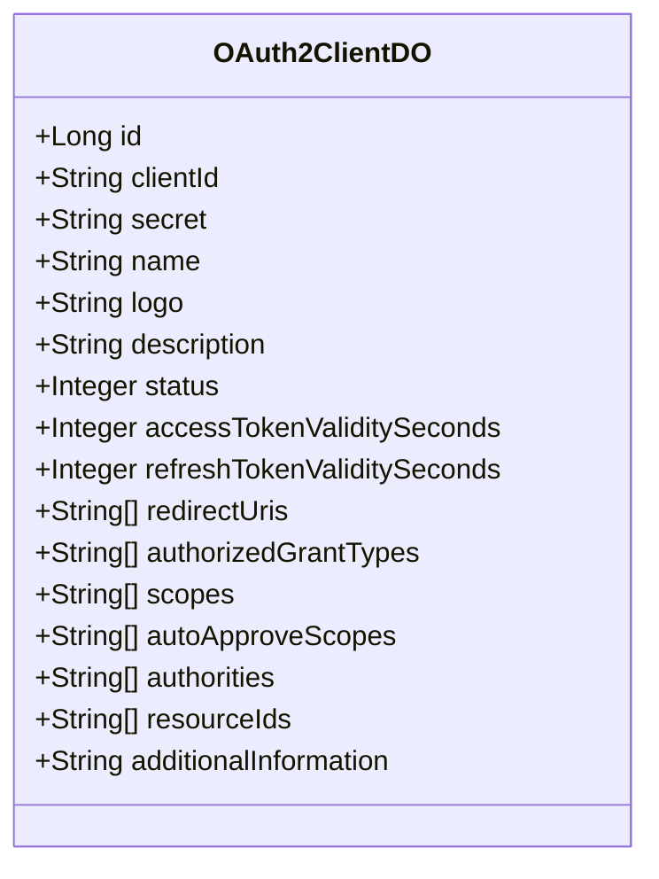

**图表来源**  
- [OAuth2ClientDO.java](file://yudao-module-system/yudao-module-system-biz/src/main/java/cn/iocoder/yudao/module/system/dal/dataobject/oauth2/OAuth2ClientDO.java#L25-L108)

### 重定向URI配置

重定向URI是OAuth2.0授权流程中的关键安全组件。系统支持配置多个重定向URI，确保授权响应只能发送到预注册的可信地址。

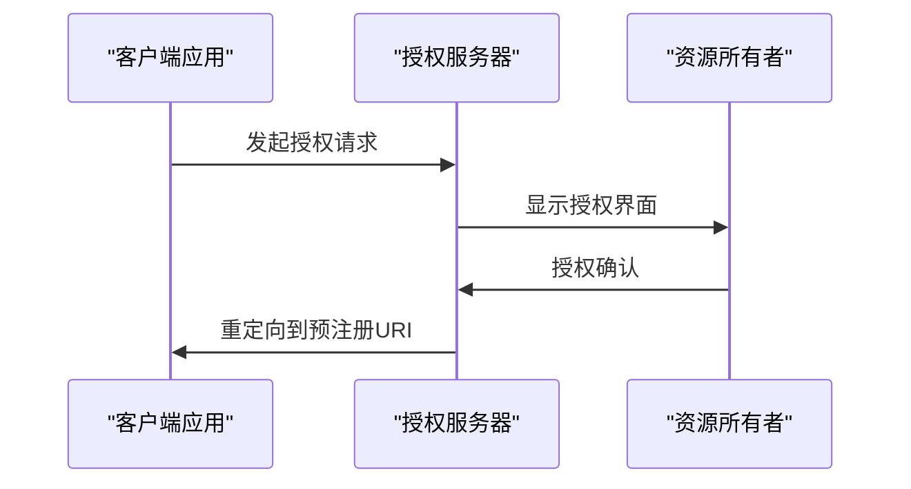

**图表来源**  
- [OAuth2OpenController.java](file://yudao-module-system/yudao-module-system-biz/src/main/java/cn/iocoder/yudao/module/system/controller/admin/oauth2/OAuth2OpenController.java#L209-L259)
- [OAuth2Utils.java](file://yudao-module-system/yudao-module-system-biz/src/main/java/cn/iocoder/yudao/module/system/util/oauth2/OAuth2Utils.java#L20-L37)

**本文档引用的文件**   
- [OAuth2ClientDO.java](file://yudao-module-system/yudao-module-system-biz/src/main/java/cn/iocoder/yudao/module/system/dal/dataobject/oauth2/OAuth2ClientDO.java)
- [OAuth2OpenController.java](file://yudao-module-system/yudao-module-system-biz/src/main/java/cn/iocoder/yudao/module/system/controller/admin/oauth2/OAuth2OpenController.java)

## 客户端凭证管理

系统实现了客户端凭证的安全管理和保护机制，确保客户端ID和密钥的安全性。

### 凭证加密存储

客户端密钥在数据库中以加密形式存储，防止敏感信息泄露。系统使用安全的加密算法对密钥进行哈希处理。

```sql
-- OAuth2客户端表结构
CREATE TABLE system_oauth2_client (
  id BIGINT AUTO_INCREMENT PRIMARY KEY,
  client_id VARCHAR(255) NOT NULL,
  secret VARCHAR(255) NOT NULL COMMENT '加密存储的客户端密钥',
  name VARCHAR(255) NOT NULL,
  logo VARCHAR(255),
  description TEXT,
  status TINYINT DEFAULT 1,
  access_token_validity_seconds INT DEFAULT 86400,
  refresh_token_validity_seconds INT DEFAULT 864000,
  redirect_uris TEXT COMMENT 'JSON格式的重定向URI列表',
  authorized_grant_types TEXT COMMENT 'JSON格式的授权类型列表',
  scopes TEXT COMMENT 'JSON格式的授权范围列表',
  auto_approve_scopes TEXT COMMENT 'JSON格式的自动授权范围列表',
  authorities TEXT COMMENT 'JSON格式的权限列表',
  resource_ids TEXT COMMENT 'JSON格式的资源ID列表',
  additional_information TEXT COMMENT 'JSON格式的附加信息',
  creator VARCHAR(64),
  create_time DATETIME DEFAULT CURRENT_TIMESTAMP,
  updater VARCHAR(64),
  update_time DATETIME DEFAULT CURRENT_TIMESTAMP ON UPDATE CURRENT_TIMESTAMP,
  deleted BIT DEFAULT 0
) COMMENT='OAuth2客户端表';
```

**图表来源**  
- [ruoyi-vue-pro.sql](file://sql/mysql/ruoyi-vue-pro.sql#L2652-L2663)
- [OAuth2ClientDO.java](file://yudao-module-system/yudao-module-system-biz/src/main/java/cn/iocoder/yudao/module/system/dal/dataobject/oauth2/OAuth2ClientDO.java#L37-L41)

### 凭证轮换机制

系统支持客户端密钥的定期轮换，提高安全性。管理员可以随时更新客户端密钥，旧密钥将自动失效。

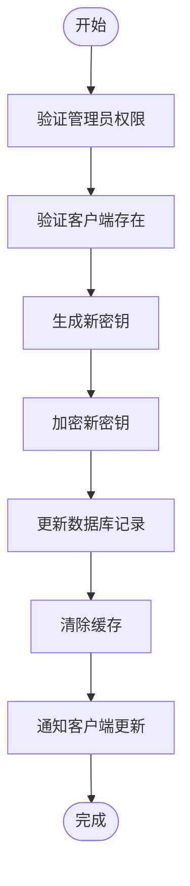

**图表来源**  
- [OAuth2ClientServiceImpl.java](file://yudao-module-system/yudao-module-system-biz/src/main/java/cn/iocoder/yudao/module/system/service/oauth2/OAuth2ClientServiceImpl.java#L53-L66)
- [OAuth2ClientMapper.java](file://yudao-module-system/yudao-module-system-biz/src/main/java/cn/iocoder/yudao/module/system/dal/mysql/oauth2/OAuth2ClientMapper.java#L26-L28)

**本文档引用的文件**   
- [OAuth2ClientServiceImpl.java](file://yudao-module-system/yudao-module-system-biz/src/main/java/cn/iocoder/yudao/module/system/service/oauth2/OAuth2ClientServiceImpl.java)
- [OAuth2ClientMapper.java](file://yudao-module-system/yudao-module-system-biz/src/main/java/cn/iocoder/yudao/module/system/dal/mysql/oauth2/OAuth2ClientMapper.java)

## 授权类型与作用域

系统支持多种OAuth2.0授权类型和灵活的作用域配置，满足不同应用场景的安全需求。

### 授权类型

系统支持以下OAuth2.0授权类型：
- **授权码模式**（authorization_code）：适用于有后端的应用
- **密码模式**（password）：适用于受信任的应用
- **客户端凭证模式**（client_credentials）：适用于服务间通信
- **简化模式**（implicit）：适用于纯前端应用

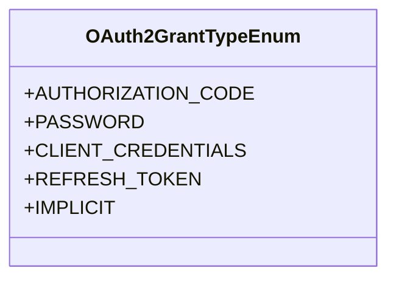

**图表来源**  
- [OAuth2ClientDO.java](file://yudao-module-system/yudao-module-system-biz/src/main/java/cn/iocoder/yudao/module/system/dal/dataobject/oauth2/OAuth2ClientDO.java#L74-L79)
- [OAuth2OpenController.java](file://yudao-module-system/yudao-module-system-biz/src/main/java/cn/iocoder/yudao/module/system/controller/admin/oauth2/OAuth2OpenController.java#L74-L82)

### 作用域管理

作用域（Scope）定义了客户端可以访问的资源范围，实现细粒度的权限控制。

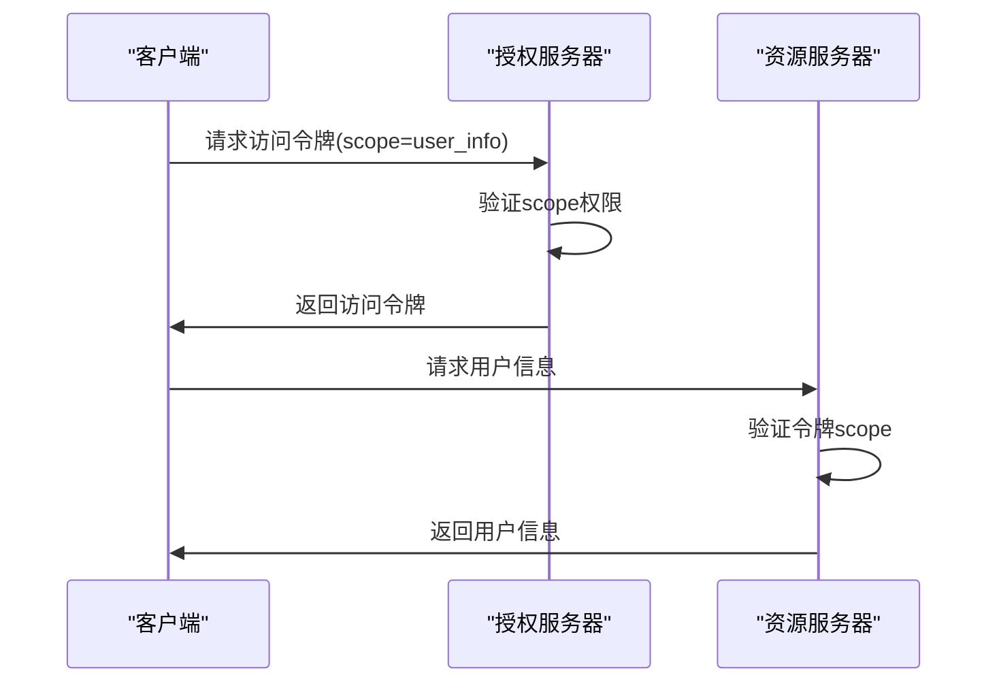

**图表来源**  
- [OAuth2ClientDO.java](file://yudao-module-system/yudao-module-system-biz/src/main/java/cn/iocoder/yudao/module/system/dal/dataobject/oauth2/OAuth2ClientDO.java#L81-L84)
- [OAuth2ApproveServiceImpl.java](file://yudao-module-system/yudao-module-system-biz/src/main/java/cn/iocoder/yudao/module/system/service/oauth2/OAuth2ApproveServiceImpl.java#L43-L62)

**本文档引用的文件**   
- [OAuth2ClientDO.java](file://yudao-module-system/yudao-module-system-biz/src/main/java/cn/iocoder/yudao/module/system/dal/dataobject/oauth2/OAuth2ClientDO.java)
- [OAuth2ApproveServiceImpl.java](file://yudao-module-system/yudao-module-system-biz/src/main/java/cn/iocoder/yudao/module/system/service/oauth2/OAuth2ApproveServiceImpl.java)

## 客户端生命周期管理

系统提供了完整的客户端生命周期管理功能，包括创建、更新、删除和查询操作。

### 创建客户端

创建新客户端的流程包括验证客户端ID唯一性、设置基本配置和存储加密凭证。

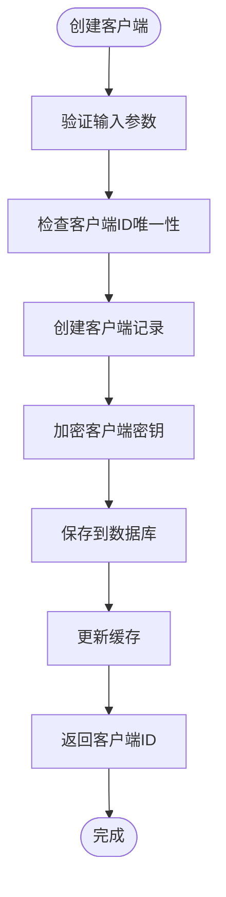

**图表来源**  
- [OAuth2ClientServiceImpl.java](file://yudao-module-system/yudao-module-system-biz/src/main/java/cn/iocoder/yudao/module/system/service/oauth2/OAuth2ClientServiceImpl.java#L43-L51)
- [OAuth2ClientSaveReqVO.java](file://yudao-module-system/yudao-module-system-biz/src/main/java/cn/iocoder/yudao/module/system/controller/admin/oauth2/vo/client/OAuth2ClientSaveReqVO.java#L18-L81)

### 更新和删除客户端

客户端更新和删除操作包含相应的验证和清理步骤。

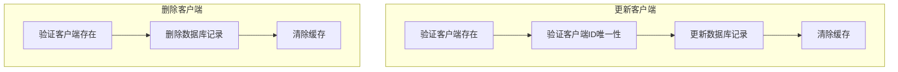

**图表来源**  
- [OAuth2ClientServiceImpl.java](file://yudao-module-system/yudao-module-system-biz/src/main/java/cn/iocoder/yudao/module/system/service/oauth2/OAuth2ClientServiceImpl.java#L53-L76)
- [OAuth2ClientController.java](file://yudao-module-system/yudao-module-system-biz/src/main/java/cn/iocoder/yudao/module/system/controller/admin/oauth2/OAuth2ClientController.java#L39-L54)

**本文档引用的文件**   
- [OAuth2ClientServiceImpl.java](file://yudao-module-system/yudao-module-system-biz/src/main/java/cn/iocoder/yudao/module/system/service/oauth2/OAuth2ClientServiceImpl.java)
- [OAuth2ClientController.java](file://yudao-module-system/yudao-module-system-biz/src/main/java/cn/iocoder/yudao/module/system/controller/admin/oauth2/OAuth2ClientController.java)

## 权限控制与细粒度访问

系统通过作用域和权限配置实现细粒度的API访问控制。

### 自动授权机制

系统支持自动授权功能，特定作用域可以配置为自动通过，无需用户手动确认。

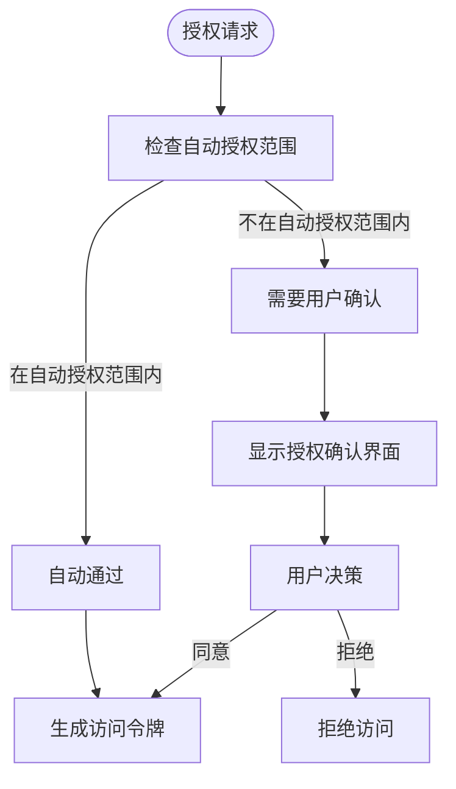

**图表来源**  
- [OAuth2ClientDO.java](file://yudao-module-system/yudao-module-system-biz/src/main/java/cn/iocoder/yudao/module/system/dal/dataobject/oauth2/OAuth2ClientDO.java#L85-L91)
- [OAuth2ApproveServiceImpl.java](file://yudao-module-system/yudao-module-system-biz/src/main/java/cn/iocoder/yudao/module/system/service/oauth2/OAuth2ApproveServiceImpl.java#L43-L56)

### 权限与资源控制

系统通过权限和资源ID列表实现更精细的访问控制。

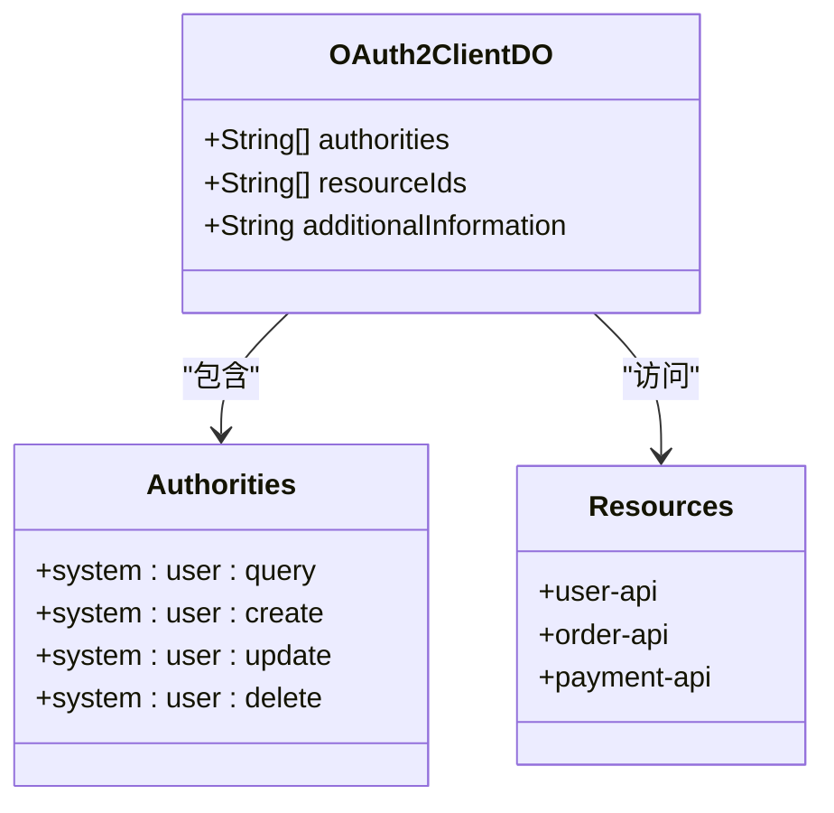

**图表来源**  
- [OAuth2ClientDO.java](file://yudao-module-system/yudao-module-system-biz/src/main/java/cn/iocoder/yudao/module/system/dal/dataobject/oauth2/OAuth2ClientDO.java#L93-L101)
- [OAuth2ClientSaveReqVO.java](file://yudao-module-system/yudao-module-system-biz/src/main/java/cn/iocoder/yudao/module/system/controller/admin/oauth2/vo/client/OAuth2ClientSaveReqVO.java#L67-L71)

**本文档引用的文件**   
- [OAuth2ClientDO.java](file://yudao-module-system/yudao-module-system-biz/src/main/java/cn/iocoder/yudao/module/system/dal/dataobject/oauth2/OAuth2ClientDO.java)
- [OAuth2ClientSaveReqVO.java](file://yudao-module-system/yudao-module-system-biz/src/main/java/cn/iocoder/yudao/module/system/controller/admin/oauth2/vo/client/OAuth2ClientSaveReqVO.java)

## 管理接口与API操作

系统提供了RESTful API接口，支持通过编程方式管理OAuth2.0客户端。

### API端点

| 端点 | HTTP方法 | 描述 | 权限要求 |
|------|---------|------|---------|
| /system/oauth2-client/create | POST | 创建客户端 | system:oauth2-client:create |
| /system/oauth2-client/update | PUT | 更新客户端 | system:oauth2-client:update |
| /system/oauth2-client/delete | DELETE | 删除客户端 | system:oauth2-client:delete |
| /system/oauth2-client/get | GET | 获取客户端 | system:oauth2-client:query |
| /system/oauth2-client/page | GET | 分页查询客户端 | system:oauth2-client:query |

**图表来源**  
- [OAuth2ClientController.java](file://yudao-module-system/yudao-module-system-biz/src/main/java/cn/iocoder/yudao/module/system/controller/admin/oauth2/OAuth2ClientController.java#L32-L73)

### 请求/响应示例

```json
// 创建客户端请求
{
  "clientId": "web-client",
  "secret": "client-secret-123",
  "name": "Web应用",
  "logo": "https://example.com/logo.png",
  "description": "前端Web应用",
  "status": 1,
  "accessTokenValiditySeconds": 86400,
  "refreshTokenValiditySeconds": 864000,
  "redirectUris": ["https://example.com/callback"],
  "authorizedGrantTypes": ["authorization_code", "refresh_token"],
  "scopes": ["user_info", "profile"],
  "autoApproveScopes": ["user_info"]
}
```

**本文档引用的文件**   
- [OAuth2ClientController.java](file://yudao-module-system/yudao-module-system-biz/src/main/java/cn/iocoder/yudao/module/system/controller/admin/oauth2/OAuth2ClientController.java)
- [OAuth2ClientSaveReqVO.java](file://yudao-module-system/yudao-module-system-biz/src/main/java/cn/iocoder/yudao/module/system/controller/admin/oauth2/vo/client/OAuth2ClientSaveReqVO.java)

## 安全存储与加密机制

系统采用多层次的安全机制保护客户端凭证和敏感信息。

### 缓存与数据库同步

系统使用Redis缓存提高性能，同时确保缓存与数据库的一致性。

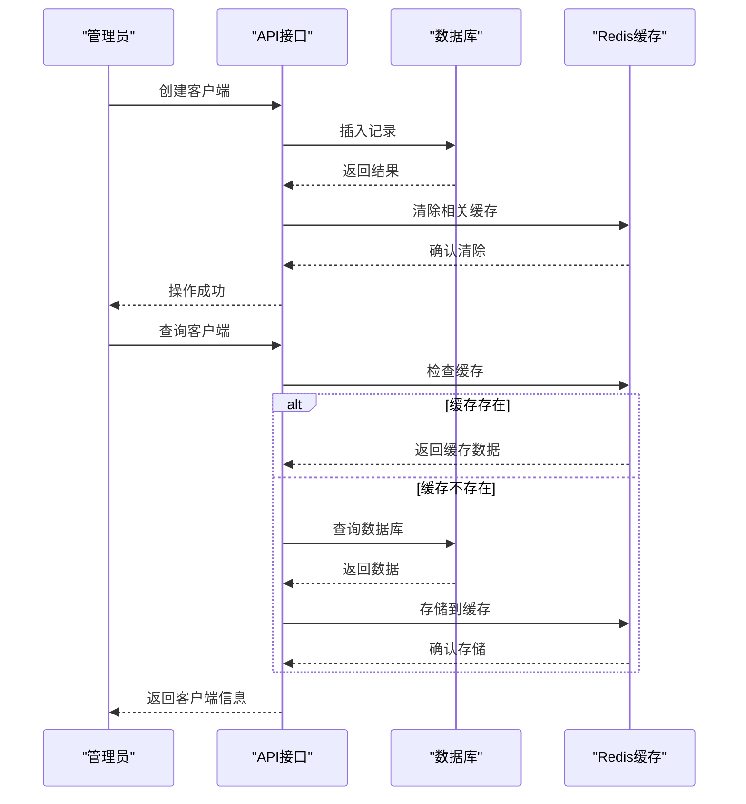

**图表来源**  
- [OAuth2ClientServiceImpl.java](file://yudao-module-system/yudao-module-system-biz/src/main/java/cn/iocoder/yudao/module/system/service/oauth2/OAuth2ClientServiceImpl.java#L104-L109)
- [OAuth2ClientMapper.java](file://yudao-module-system/yudao-module-system-biz/src/main/java/cn/iocoder/yudao/module/system/dal/mysql/oauth2/OAuth2ClientMapper.java#L26-L28)

### 数据验证与安全检查

系统在客户端操作过程中执行严格的数据验证和安全检查。

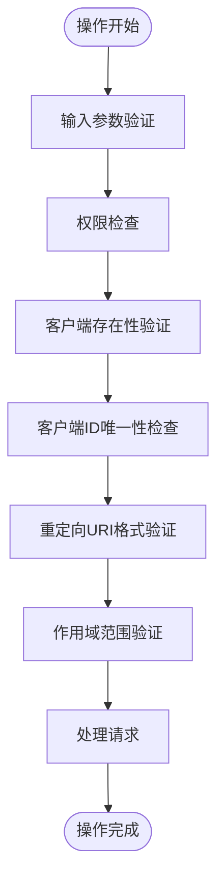

**图表来源**  
- [OAuth2ClientServiceImpl.java](file://yudao-module-system/yudao-module-system-biz/src/main/java/cn/iocoder/yudao/module/system/service/oauth2/OAuth2ClientServiceImpl.java#L46-L97)
- [OAuth2ClientSaveReqVO.java](file://yudao-module-system/yudao-module-system-biz/src/main/java/cn/iocoder/yudao/module/system/controller/admin/oauth2/vo/client/OAuth2ClientSaveReqVO.java#L9-L81)

**本文档引用的文件**   
- [OAuth2ClientServiceImpl.java](file://yudao-module-system/yudao-module-system-biz/src/main/java/cn/iocoder/yudao/module/system/service/oauth2/OAuth2ClientServiceImpl.java)
- [OAuth2ClientSaveReqVO.java](file://yudao-module-system/yudao-module-system-biz/src/main/java/cn/iocoder/yudao/module/system/controller/admin/oauth2/vo/client/OAuth2ClientSaveReqVO.java)

## 总结

本文档详细介绍了OAuth2.0客户端的注册、配置和管理功能。系统提供了完整的客户端生命周期管理，支持多种授权类型和细粒度的权限控制。客户端凭证采用加密存储，确保安全性。通过RESTful API接口，管理员可以方便地管理客户端，实现灵活的访问控制策略。系统设计考虑了性能和安全性，使用缓存提高查询效率，同时确保数据一致性。

**本文档引用的文件**   
- [OAuth2ClientController.java](file://yudao-module-system/yudao-module-system-biz/src/main/java/cn/iocoder/yudao/module/system/controller/admin/oauth2/OAuth2ClientController.java)
- [OAuth2ClientService.java](file://yudao-module-system/yudao-module-system-biz/src/main/java/cn/iocoder/yudao/module/system/service/oauth2/OAuth2ClientService.java)
- [OAuth2ClientServiceImpl.java](file://yudao-module-system/yudao-module-system-biz/src/main/java/cn/iocoder/yudao/module/system/service/oauth2/OAuth2ClientServiceImpl.java)