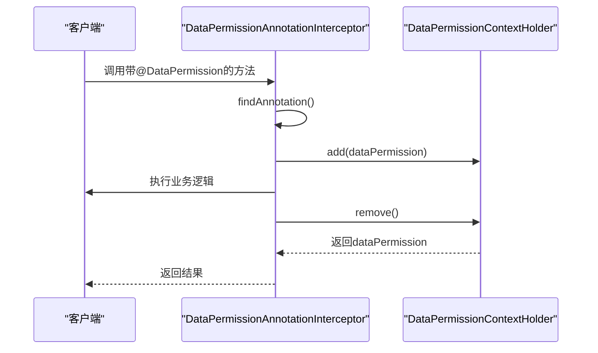
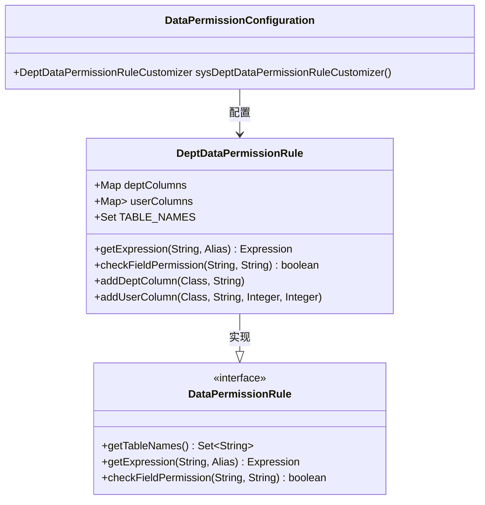

# 数据权限

<cite>
**本文档引用文件**   
- [DataPermission.java](file://yudao-framework/yudao-spring-boot-starter-data-permission/src/main/java/cn/iocoder/yudao/framework/datapermission/core/annotation/DataPermission.java)
- [DataPermissionAnnotationInterceptor.java](file://yudao-framework/yudao-spring-boot-starter-data-permission/src/main/java/cn/iocoder/yudao/framework/datapermission/core/aop/DataPermissionAnnotationInterceptor.java)
- [DataPermissionContextHolder.java](file://yudao-framework/yudao-spring-boot-starter-data-permission/src/main/java/cn/iocoder/yudao/framework/datapermission/core/aop/DataPermissionContextHolder.java)
- [DataPermissionDatabaseInterceptor.java](file://yudao-framework/yudao-spring-boot-starter-data-permission/src/main/java/cn/iocoder/yudao/framework/datapermission/core/db/DataPermissionDatabaseInterceptor.java)
- [DeptDataPermissionRule.java](file://yudao-framework/yudao-spring-boot-starter-data-permission/src/main/java/cn/iocoder/yudao/framework/datapermission/core/rule/dept/DeptDataPermissionRule.java)
- [DataPermissionRule.java](file://yudao-framework/yudao-spring-boot-starter-data-permission/src/main/java/cn/iocoder/yudao/framework/datapermission/core/rule/DataPermissionRule.java)
- [DataPermissionRuleFactoryImpl.java](file://yudao-framework/yudao-spring-boot-starter-data-permission/src/main/java/cn/iocoder/yudao/framework/datapermission/core/rule/DataPermissionRuleFactoryImpl.java)
- [DataScopeEnum.java](file://yudao-module-system/yudao-module-system-api/src/main/java/cn/iocoder/yudao/module/system/enums/permission/DataScopeEnum.java)
- [DataPermissionConfiguration.java](file://yudao-module-system/yudao-module-system-biz/src/main/java/cn/iocoder/yudao/module/system/framework/datapermission/config/DataPermissionConfiguration.java)
</cite>

## 目录
1. [引言](#引言)
2. [数据权限注解详解](#数据权限注解详解)
3. [数据权限切面执行流程](#数据权限切面执行流程)
4. [部门数据权限实现](#部门数据权限实现)
5. [岗位数据权限实现](#岗位数据权限实现)
6. [自定义数据权限规则开发指南](#自定义数据权限规则开发指南)
7. [数据权限与角色权限协同机制](#数据权限与角色权限协同机制)
8. [性能考虑](#性能考虑)
9. [常见问题解决方案](#常见问题解决方案)
10. [结论](#结论)

## 引言
数据权限控制是企业级应用中至关重要的安全机制，它确保用户只能访问其被授权的数据。本文档深入解析了基于注解的数据权限控制实现原理，详细说明了@DataPermission注解的使用方法和配置参数，解释了数据权限切面的执行流程，并描述了部门数据权限、岗位数据权限等不同场景的实现方式。同时，提供了自定义数据权限规则的开发指南，以及数据权限与角色权限的协同工作机制，包含性能考虑和常见问题解决方案。

## 数据权限注解详解

@DataPermission注解是数据权限控制的核心，用于声明在类或方法级别上应用的数据权限规则。该注解支持在类级别和方法级别使用，具有以下主要配置参数：

- **enable**: 布尔类型，表示当前类或方法是否开启数据权限。默认值为true，即使不添加@DataPermission注解，默认也是开启状态。可通过设置为false来禁用数据权限。
- **includeRules**: 数组类型，指定生效的数据权限规则数组，优先级高于excludeRules。
- **excludeRules**: 数组类型，指定排除的数据权限规则数组，优先级最低。

该注解通过AOP（面向切面编程）技术实现，在方法执行前后进行拦截，将注解信息入栈和出栈，从而实现对数据访问的控制。

**Section sources**
- [DataPermission.java](file://yudao-framework/yudao-spring-boot-starter-data-permission/src/main/java/cn/iocoder/yudao/framework/datapermission/core/annotation/DataPermission.java)

## 数据权限切面执行流程

数据权限切面的执行流程主要由DataPermissionAnnotationInterceptor实现，其核心流程如下：

1. **方法拦截**: 通过AOP技术拦截带有@DataPermission注解的方法调用。
2. **注解查找**: 在方法执行前，查找方法或类上的@DataPermission注解。
3. **入栈操作**: 将找到的@DataPermission注解信息通过DataPermissionContextHolder.add()方法入栈。
4. **执行逻辑**: 执行被拦截方法的业务逻辑。
5. **出栈操作**: 在方法执行后，通过DataPermissionContextHolder.remove()方法将注解信息出栈。

该流程确保了在方法执行期间，数据权限上下文的正确维护，为后续的数据权限规则应用提供了基础。

**Diagram sources**
- [DataPermissionAnnotationInterceptor.java](file://yudao-framework/yudao-spring-boot-starter-data-permission/src/main/java/cn/iocoder/yudao/framework/datapermission/core/aop/DataPermissionAnnotationInterceptor.java)
- [DataPermissionContextHolder.java](file://yudao-framework/yudao-spring-boot-starter-data-permission/src/main/java/cn/iocoder/yudao/framework/datapermission/core/aop/DataPermissionContextHolder.java)

**Section sources**
- [DataPermissionAnnotationInterceptor.java](file://yudao-framework/yudao-spring-boot-starter-data-permission/src/main/java/cn/iocoder/yudao/framework/datapermission/core/aop/DataPermissionAnnotationInterceptor.java)
- [DataPermissionContextHolder.java](file://yudao-framework/yudao-spring-boot-starter-data-permission/src/main/java/cn/iocoder/yudao/framework/datapermission/core/aop/DataPermissionContextHolder.java)

## 部门数据权限实现

部门数据权限是数据权限控制中最常见的场景之一，主要通过DeptDataPermissionRule实现。其实现原理如下：

1. **规则配置**: 在DataPermissionConfiguration中配置部门数据权限规则，指定需要应用权限控制的实体类和字段。
2. **数据获取**: 通过PermissionApi获取当前用户的部门数据权限信息，包括是否可查看全部数据、是否可查看自己的数据、可查看的部门编号数组等。
3. **SQL重写**: 在查询执行前，通过DataPermissionDatabaseInterceptor拦截SQL，根据用户的部门权限信息动态重写WHERE条件，添加部门过滤条件。

部门数据权限支持多种数据范围类型，如全部数据权限、指定部门数据权限、部门数据权限、部门及以下数据权限和仅本人数据权限等。

**Diagram sources**
- [DeptDataPermissionRule.java](file://yudao-framework/yudao-spring-boot-starter-data-permission/src/main/java/cn/iocoder/yudao/framework/datapermission/core/rule/dept/DeptDataPermissionRule.java)
- [DataPermissionRule.java](file://yudao-framework/yudao-spring-boot-starter-data-permission/src/main/java/cn/iocoder/yudao/framework/datapermission/core/rule/DataPermissionRule.java)
- [DataPermissionConfiguration.java](file://yudao-module-system/yudao-module-system-biz/src/main/java/cn/iocoder/yudao/module/system/framework/datapermission/config/DataPermissionConfiguration.java)

**Section sources**
- [DeptDataPermissionRule.java](file://yudao-framework/yudao-spring-boot-starter-data-permission/src/main/java/cn/iocoder/yudao/framework/datapermission/core/rule/dept/DeptDataPermissionRule.java)
- [DataPermissionConfiguration.java](file://yudao-module-system/yudao-module-system-biz/src/main/java/cn/iocoder/yudao/module/system/framework/datapermission/config/DataPermissionConfiguration.java)

## 岗位数据权限实现

虽然当前代码库中未直接实现岗位数据权限，但可以通过自定义DataPermissionRule来实现。岗位数据权限的实现思路与部门数据权限类似，主要区别在于：

1. **权限维度**: 从部门维度转变为岗位维度，需要维护用户与岗位的关联关系。
2. **规则实现**: 创建PostDataPermissionRule类，实现DataPermissionRule接口，根据岗位信息生成相应的SQL过滤条件。
3. **配置管理**: 在相应的模块配置类中注册岗位数据权限规则。

岗位数据权限可以与部门数据权限结合使用，形成更细粒度的权限控制体系。

## 自定义数据权限规则开发指南

开发自定义数据权限规则需要遵循以下步骤：

1. **创建规则类**: 创建一个新的类，实现DataPermissionRule接口。
2. **实现核心方法**: 实现getTableNames()和getExpression()方法，getTableNames()返回需要应用权限控制的表名数组，getExpression()根据表名和别名生成相应的WHERE过滤条件。
3. **注册规则**: 在相应模块的配置类中，通过@Bean注解将自定义规则注册为Spring Bean。
4. **配置应用**: 在需要应用该规则的类或方法上使用@DataPermission注解，并通过includeRules参数指定自定义规则。

通过这种方式，可以灵活地实现各种复杂的数据权限控制需求。

## 数据权限与角色权限协同机制

数据权限与角色权限是相辅相成的两个安全控制机制。角色权限主要控制用户可以访问哪些功能和操作，而数据权限则控制用户在这些功能和操作中可以访问哪些数据。

两者的协同工作机制如下：

1. **权限获取**: 用户登录后，系统获取其角色权限和数据权限信息。
2. **权限应用**: 在执行业务操作时，首先检查角色权限，确定用户是否有权执行该操作；然后检查数据权限，确定用户是否有权访问相关数据。
3. **动态控制**: 通过AOP和MyBatis拦截器技术，将数据权限规则动态应用到SQL查询中，实现数据层面的访问控制。

这种协同机制确保了系统的安全性，既防止了未授权的用户访问敏感功能，又防止了授权用户越权访问敏感数据。

## 性能考虑

在实现数据权限控制时，需要考虑以下性能因素：

1. **缓存机制**: 使用ThreadLocal和ConcurrentHashMap等数据结构缓存权限信息，避免重复计算和数据库查询。
2. **SQL优化**: 动态生成的SQL过滤条件应尽量简洁高效，避免复杂的子查询和连接操作。
3. **拦截器顺序**: 将数据权限拦截器放置在MyBatis拦截器链的合适位置，避免不必要的SQL解析和重写。
4. **批量处理**: 对于批量操作，应考虑批量处理权限检查，避免逐条检查带来的性能开销。

通过合理的性能优化，可以在保证安全性的同时，最大限度地减少对系统性能的影响。

## 常见问题解决方案

在使用数据权限控制时，可能会遇到以下常见问题：

1. **权限不生效**: 检查@DataPermission注解是否正确应用，确认数据权限拦截器是否已正确注册。
2. **SQL语法错误**: 检查自定义规则生成的SQL表达式是否符合语法规范，避免因SQL错误导致查询失败。
3. **性能下降**: 分析SQL执行计划，优化数据权限规则，必要时增加缓存或索引。
4. **权限冲突**: 当多个数据权限规则同时应用时，可能出现权限冲突，需要明确规则的优先级和合并策略。

通过仔细分析和调试，可以有效解决这些问题，确保数据权限控制的正确性和稳定性。

## 结论

数据权限控制是保障企业级应用数据安全的重要手段。通过深入理解@DataPermission注解的使用方法、数据权限切面的执行流程、部门和岗位数据权限的实现方式，以及自定义数据权限规则的开发指南，可以构建灵活、安全、高效的数据权限控制体系。同时，合理考虑性能因素和解决常见问题，可以确保系统在高并发、大数据量场景下的稳定运行。