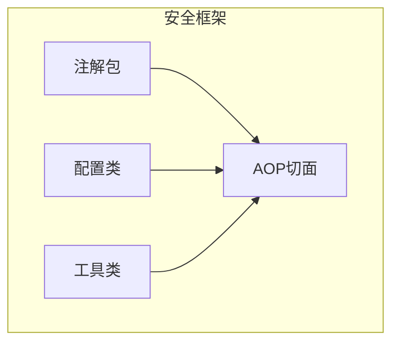
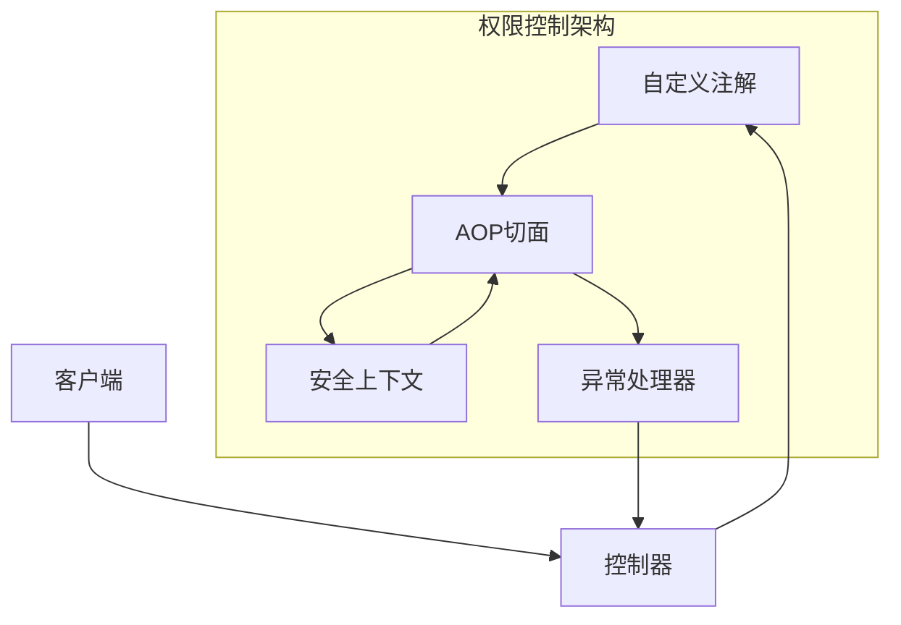
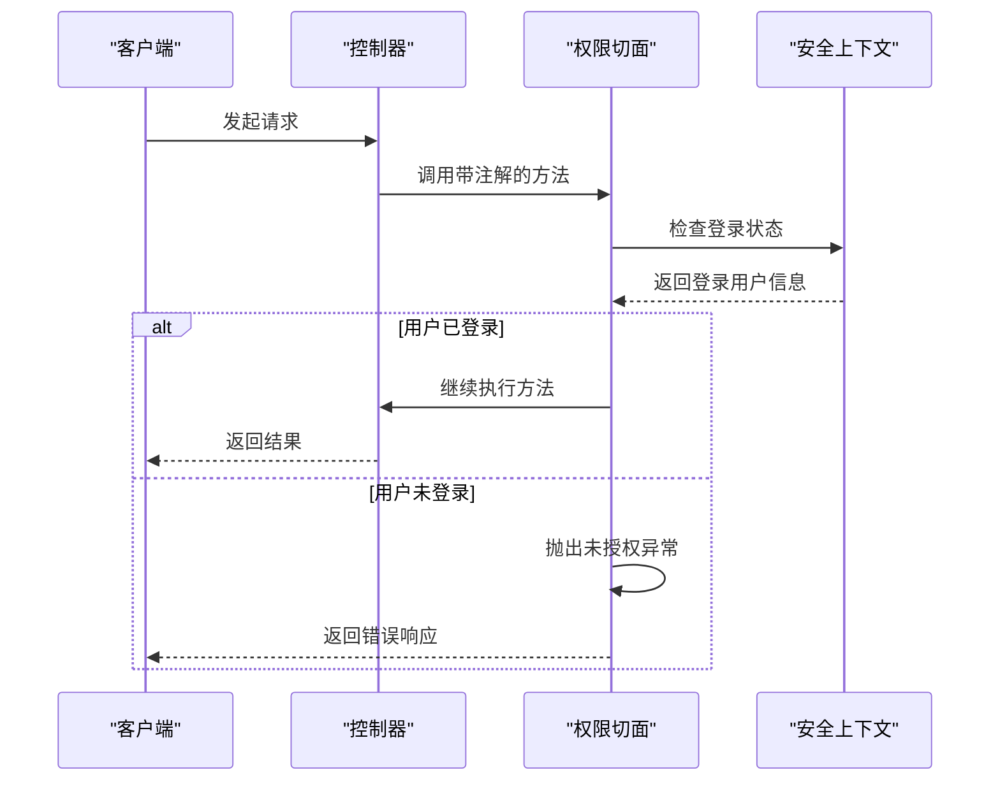
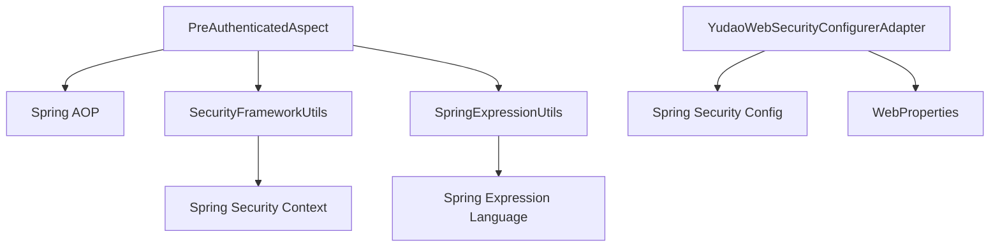
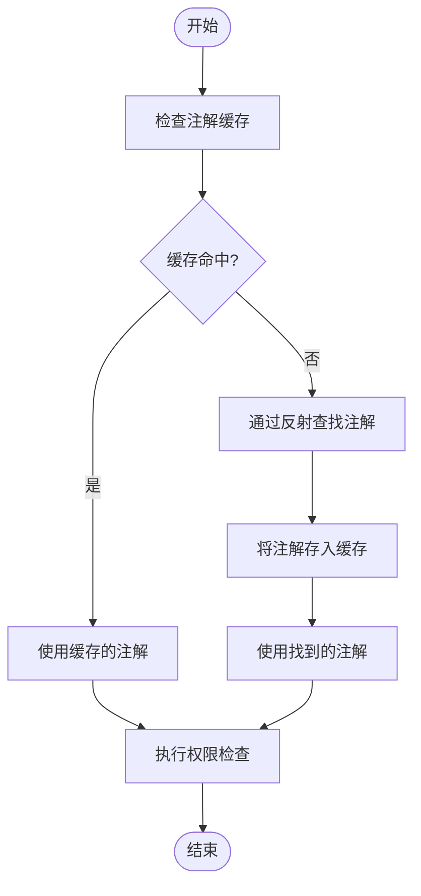

# 权限注解

<cite>
**本文档引用的文件**   
- [PreAuthenticated.java](file://yudao-framework/yudao-spring-boot-starter-security/src/main/java/cn/iocoder/yudao/framework/security/core/annotations/PreAuthenticated.java)
- [PreAuthenticatedAspect.java](file://yudao-framework/yudao-spring-boot-starter-security/src/main/java/cn/iocoder/yudao/framework/security/core/aop/PreAuthenticatedAspect.java)
- [YudaoWebSecurityConfigurerAdapter.java](file://yudao-framework/yudao-spring-boot-starter-security/src/main/java/cn/iocoder/yudao/framework/security/config/YudaoWebSecurityConfigurerAdapter.java)
- [SpringExpressionUtils.java](file://yudao-framework/yudao-common/src/main/java/cn/iocoder/yudao/framework/common/util/spring/SpringExpressionUtils.java)
- [FieldPermission.java](file://yudao-framework/yudao-spring-boot-starter-security/src/main/java/cn/iocoder/yudao/framework/security/core/annotations/FieldPermission.java)
- [FieldPermissionEnable.java](file://yudao-framework/yudao-spring-boot-starter-security/src/main/java/cn/iocoder/yudao/framework/security/core/annotations/FieldPermissionEnable.java)
- [FieldPermissionAspect.java](file://yudao-framework/yudao-spring-boot-starter-security/src/main/java/cn/iocoder/yudao/framework/security/core/aop/FieldPermissionAspect.java)
- [DataPermissionAnnotationInterceptor.java](file://yudao-framework/yudao-spring-boot-starter-data-permission/src/main/java/cn/iocoder/yudao/framework/datapermission/core/aop/DataPermissionAnnotationInterceptor.java)
- [DataPermissionContextHolder.java](file://yudao-framework/yudao-spring-boot-starter-data-permission/src/main/java/cn/iocoder/yudao/framework/datapermission/core/aop/DataPermissionContextHolder.java)
- [YudaoSecurityAutoConfiguration.java](file://yudao-framework/yudao-spring-boot-starter-security/src/main/java/cn/iocoder/yudao/framework/security/config/YudaoSecurityAutoConfiguration.java)
</cite>

## 目录
1. [简介](#简介)
2. [项目结构](#项目结构)
3. [核心组件](#核心组件)
4. [架构概述](#架构概述)
5. [详细组件分析](#详细组件分析)
6. [依赖分析](#依赖分析)
7. [性能考虑](#性能考虑)
8. [故障排除指南](#故障排除指南)
9. [结论](#结论)

## 简介
本文档全面介绍权限注解的使用方法和实现原理，详细说明`@PreAuthenticated`、`@FieldPermission`等注解的适用场景和配置方式。解释权限注解切面的执行机制和拦截流程，提供SpEL表达式编写技巧和复杂权限判断逻辑的实现方案。包含注解式权限控制的最佳实践和性能优化建议。

## 项目结构
项目采用模块化设计，权限控制功能主要集中在`yudao-framework`模块下的`yudao-spring-boot-starter-security`和`yudao-spring-boot-starter-data-permission`两个子模块中。安全相关的注解定义在`yudao-framework/yudao-spring-boot-starter-security/src/main/java/cn/iocoder/yudao/framework/security/core/annotations/`包下，切面实现位于`aop`包中，而安全配置则在`config`包中。



**图示来源**
- [PreAuthenticated.java](file://yudao-framework/yudao-spring-boot-starter-security/src/main/java/cn/iocoder/yudao/framework/security/core/annotations/PreAuthenticated.java)
- [PreAuthenticatedAspect.java](file://yudao-framework/yudao-spring-boot-starter-security/src/main/java/cn/iocoder/yudao/framework/security/core/aop/PreAuthenticatedAspect.java)
- [YudaoWebSecurityConfigurerAdapter.java](file://yudao-framework/yudao-spring-boot-starter-security/src/main/java/cn/iocoder/yudao/framework/security/config/YudaoWebSecurityConfigurerAdapter.java)

**本节来源**
- [yudao-framework/yudao-spring-boot-starter-security](file://yudao-framework/yudao-spring-boot-starter-security)

## 核心组件

权限控制系统的核心组件包括自定义注解、AOP切面、安全上下文工具和表达式解析工具。`@PreAuthenticated`注解用于声明方法需要用户登录，`@FieldPermission`用于字段级别的权限控制，而`PreAuthenticatedAspect`切面则负责拦截带有这些注解的方法调用并执行相应的权限检查。

**本节来源**
- [PreAuthenticated.java](file://yudao-framework/yudao-spring-boot-starter-security/src/main/java/cn/iocoder/yudao/framework/security/core/annotations/PreAuthenticated.java)
- [PreAuthenticatedAspect.java](file://yudao-framework/yudao-spring-boot-starter-security/src/main/java/cn/iocoder/yudao/framework/security/core/aop/PreAuthenticatedAspect.java)
- [SpringExpressionUtils.java](file://yudao-framework/yudao-common/src/main/java/cn/iocoder/yudao/framework/common/util/spring/SpringExpressionUtils.java)

## 架构概述

权限控制系统的架构基于Spring AOP和Spring Security的集成，通过自定义注解和切面实现方法级别的权限控制。系统采用分层设计，上层为注解定义，中层为切面拦截和权限判断，底层为安全上下文管理和异常处理。



**图示来源**
- [PreAuthenticated.java](file://yudao-framework/yudao-spring-boot-starter-security/src/main/java/cn/iocoder/yudao/framework/security/core/annotations/PreAuthenticated.java)
- [PreAuthenticatedAspect.java](file://yudao-framework/yudao-spring-boot-starter-security/src/main/java/cn/iocoder/yudao/framework/security/core/aop/PreAuthenticatedAspect.java)
- [SecurityFrameworkUtils.java](file://yudao-framework/yudao-spring-boot-starter-security/src/main/java/cn/iocoder/yudao/framework/security/core/util/SecurityFrameworkUtils.java)

## 详细组件分析

### @PreAuthenticated 注解分析
`@PreAuthenticated`注解用于标记需要用户登录才能访问的方法。当用户未登录时，系统会抛出未授权异常。

```mermaid
classDiagram
class PreAuthenticated {
+@Target({ElementType.METHOD})
+@Retention(RetentionPolicy.RUNTIME)
+@Inherited
+@Documented
}
```

**图示来源**
- [PreAuthenticated.java](file://yudao-framework/yudao-spring-boot-starter-security/src/main/java/cn/iocoder/yudao/framework/security/core/annotations/PreAuthenticated.java)

### 权限切面执行流程
权限切面通过AOP环绕通知拦截方法调用，在方法执行前进行权限检查。



**图示来源**
- [PreAuthenticatedAspect.java](file://yudao-framework/yudao-spring-boot-starter-security/src/main/java/cn/iocoder/yudao/framework/security/core/aop/PreAuthenticatedAspect.java)
- [SecurityFrameworkUtils.java](file://yudao-framework/yudao-spring-boot-starter-security/src/main/java/cn/iocoder/yudao/framework/security/core/util/SecurityFrameworkUtils.java)

### 字段权限控制分析
字段权限控制通过`@FieldPermission`和`@FieldPermissionEnable`注解实现，允许对返回数据的特定字段进行权限控制。

```mermaid
classDiagram
class FieldPermission {
+@Target({ElementType.FIELD, ElementType.PARAMETER})
+@Retention(RetentionPolicy.RUNTIME)
+String[] value()
}
class FieldPermissionEnable {
+@Target({ElementType.METHOD})
+@Retention(RetentionPolicy.RUNTIME)
}
FieldPermissionAspect --> FieldPermission : "处理"
FieldPermissionAspect --> FieldPermissionEnable : "启用"
```

**图示来源**
- [FieldPermission.java](file://yudao-framework/yudao-spring-boot-starter-security/src/main/java/cn/iocoder/yudao/framework/security/core/annotations/FieldPermission.java)
- [FieldPermissionEnable.java](file://yudao-framework/yudao-spring-boot-starter-security/src/main/java/cn/iocoder/yudao/framework/security/core/annotations/FieldPermissionEnable.java)
- [FieldPermissionAspect.java](file://yudao-framework/yudao-spring-boot-starter-security/src/main/java/cn/iocoder/yudao/framework/security/core/aop/FieldPermissionAspect.java)

**本节来源**
- [FieldPermission.java](file://yudao-framework/yudao-spring-boot-starter-security/src/main/java/cn/iocoder/yudao/framework/security/core/annotations/FieldPermission.java)
- [FieldPermissionEnable.java](file://yudao-framework/yudao-spring-boot-starter-security/src/main/java/cn/iocoder/yudao/framework/security/core/annotations/FieldPermissionEnable.java)
- [FieldPermissionAspect.java](file://yudao-framework/yudao-spring-boot-starter-security/src/main/java/cn/iocoder/yudao/framework/security/core/aop/FieldPermissionAspect.java)

## 依赖分析

权限控制系统依赖于Spring框架的核心功能，包括AOP、上下文管理和表达式语言。同时，它还依赖于项目自身的安全框架工具类。



**图示来源**
- [PreAuthenticatedAspect.java](file://yudao-framework/yudao-spring-boot-starter-security/src/main/java/cn/iocoder/yudao/framework/security/core/aop/PreAuthenticatedAspect.java)
- [SpringExpressionUtils.java](file://yudao-framework/yudao-common/src/main/java/cn/iocoder/yudao/framework/common/util/spring/SpringExpressionUtils.java)
- [YudaoWebSecurityConfigurerAdapter.java](file://yudao-framework/yudao-spring-boot-starter-security/src/main/java/cn/iocoder/yudao/framework/security/config/YudaoWebSecurityConfigurerAdapter.java)

**本节来源**
- [PreAuthenticatedAspect.java](file://yudao-framework/yudao-spring-boot-starter-security/src/main/java/cn/iocoder/yudao/framework/security/core/aop/PreAuthenticatedAspect.java)
- [SpringExpressionUtils.java](file://yudao-framework/yudao-common/src/main/java/cn/iocoder/yudao/framework/common/util/spring/SpringExpressionUtils.java)
- [YudaoWebSecurityConfigurerAdapter.java](file://yudao-framework/yudao-spring-boot-starter-security/src/main/java/cn/iocoder/yudao/framework/security/config/YudaoWebSecurityConfigurerAdapter.java)

## 性能考虑

权限控制系统在设计时考虑了性能优化，通过缓存机制减少重复的权限检查开销。`DataPermissionAnnotationInterceptor`中的`dataPermissionCache`使用`ConcurrentHashMap`来缓存方法的权限注解，避免重复的反射调用。



**图示来源**
- [DataPermissionAnnotationInterceptor.java](file://yudao-framework/yudao-spring-boot-starter-data-permission/src/main/java/cn/iocoder/yudao/framework/datapermission/core/aop/DataPermissionAnnotationInterceptor.java)
- [DataPermissionContextHolder.java](file://yudao-framework/yudao-spring-boot-starter-data-permission/src/main/java/cn/iocoder/yudao/framework/datapermission/core/aop/DataPermissionContextHolder.java)

## 故障排除指南

当权限控制功能出现问题时，可以从以下几个方面进行排查：

1. 确认`YudaoSecurityAutoConfiguration`已正确加载，确保`PreAuthenticatedAspect`等切面Bean已创建
2. 检查注解是否正确应用在目标方法上
3. 验证安全上下文中的用户信息是否正确设置
4. 查看日志中是否有相关的异常信息

**本节来源**
- [YudaoSecurityAutoConfiguration.java](file://yudao-framework/yudao-spring-boot-starter-security/src/main/java/cn/iocoder/yudao/framework/security/config/YudaoSecurityAutoConfiguration.java)
- [PreAuthenticatedAspect.java](file://yudao-framework/yudao-spring-boot-starter-security/src/main/java/cn/iocoder/yudao/framework/security/core/aop/PreAuthenticatedAspect.java)
- [SecurityFrameworkUtils.java](file://yudao-framework/yudao-spring-boot-starter-security/src/main/java/cn/iocoder/yudao/framework/security/core/util/SecurityFrameworkUtils.java)

## 结论

本文档详细介绍了权限注解的使用方法和实现原理。通过自定义注解和AOP切面的结合，系统实现了灵活的权限控制机制。`@PreAuthenticated`注解提供了简单的方法级权限控制，而`@FieldPermission`则支持更细粒度的字段权限管理。系统设计充分考虑了性能和可维护性，通过缓存机制优化了权限检查的性能开销。开发者可以根据具体需求选择合适的权限控制方式，确保系统的安全性和灵活性。