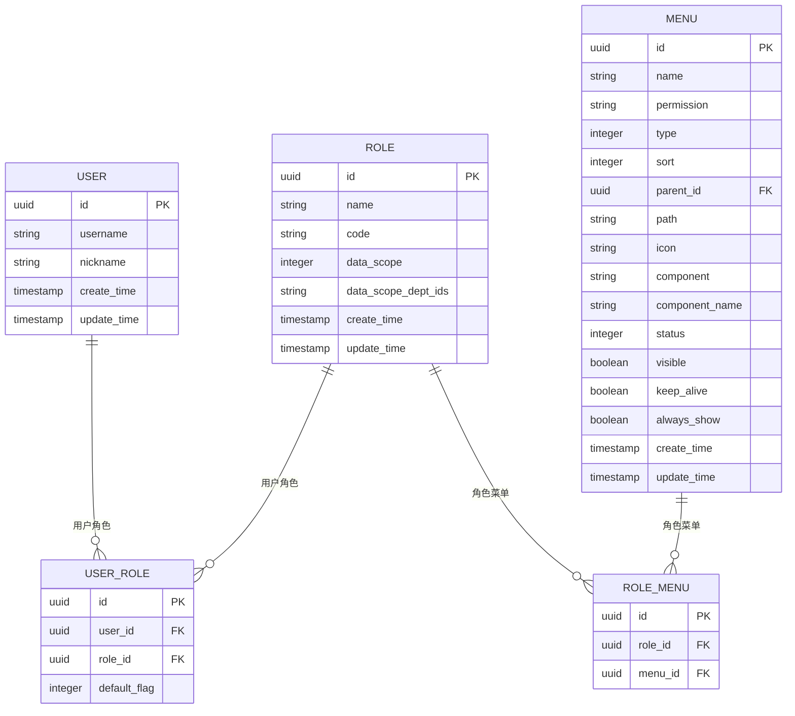
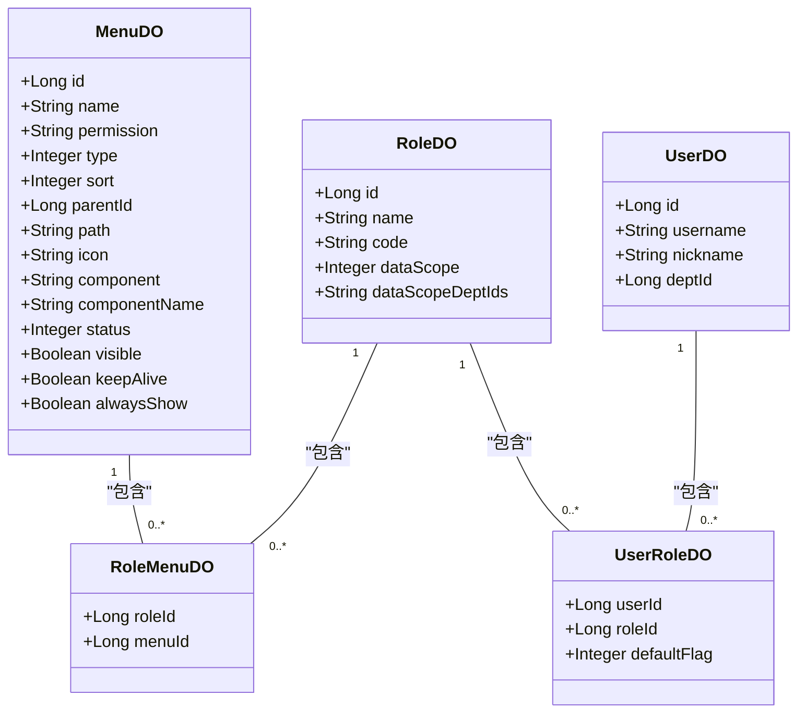
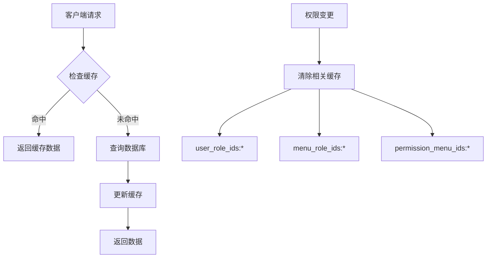
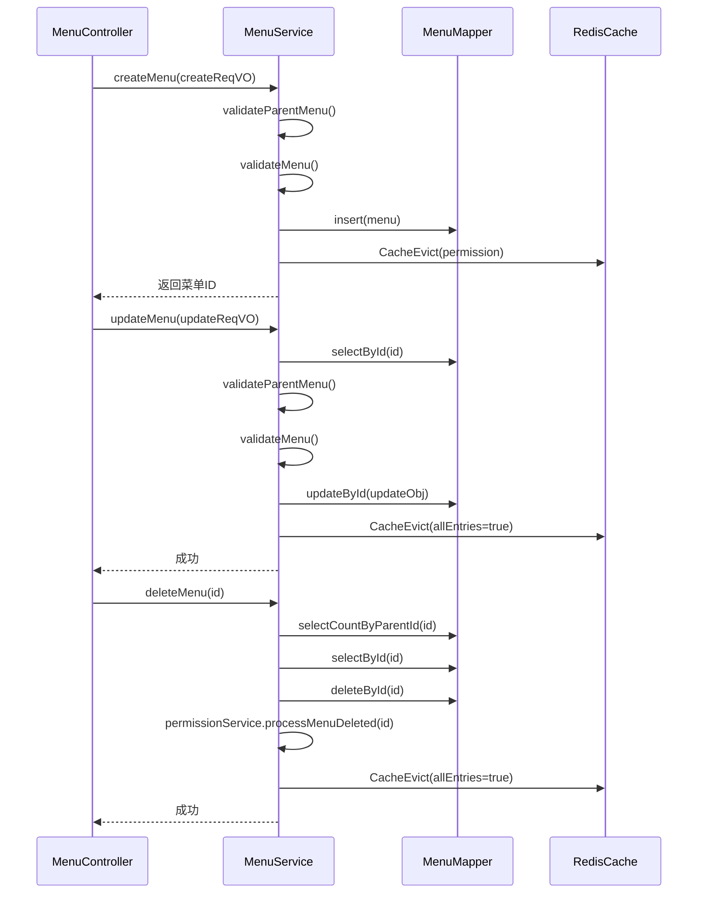
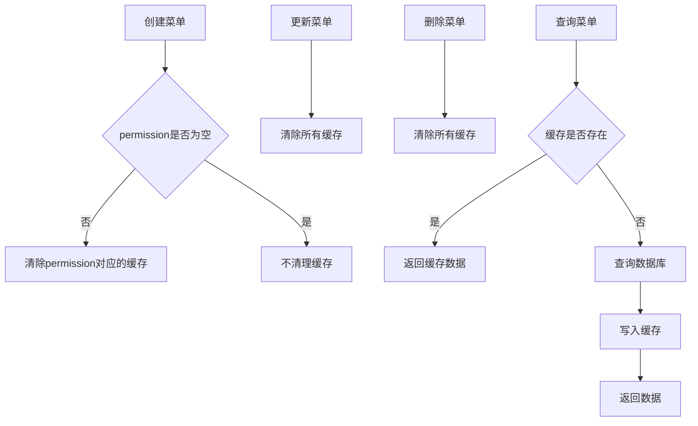
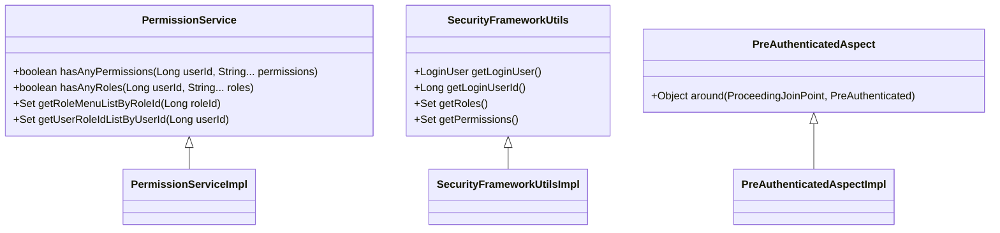
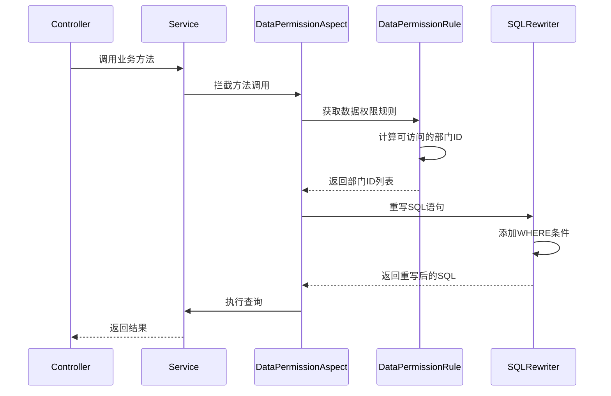
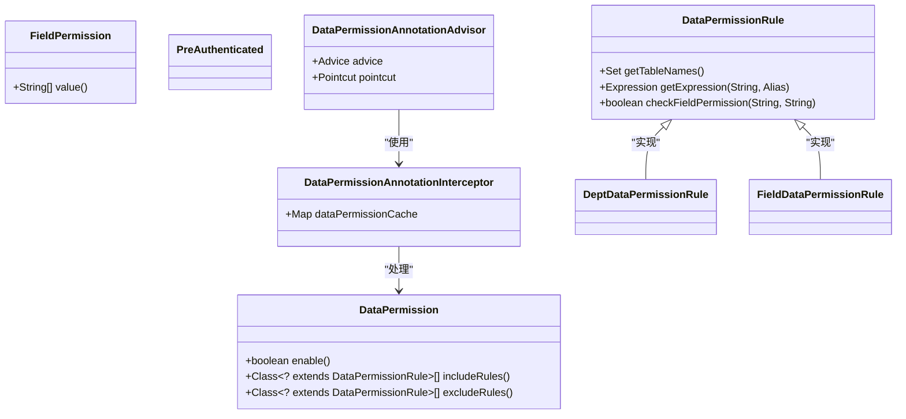
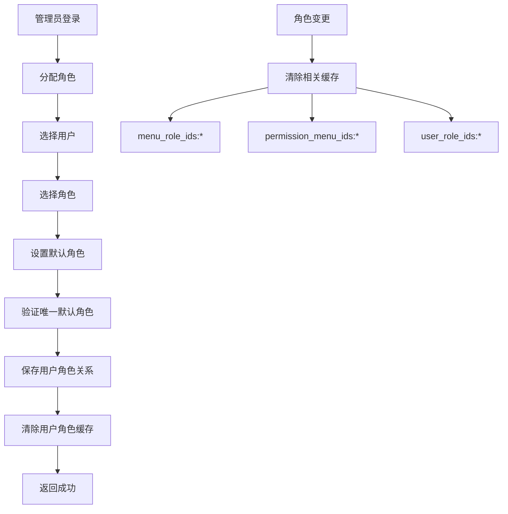
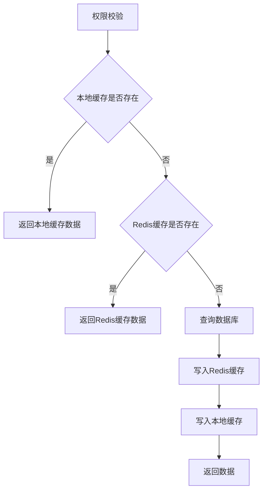

# 权限管理

<cite>
**本文档引用文件**   
- [MenuDO.java](file://yudao-module-system/yudao-module-system-biz/src/main/java/cn/iocoder/yudao/module/system/dal/dataobject/permission/MenuDO.java)
- [MenuService.java](file://yudao-module-system/yudao-module-system-biz/src/main/java/cn/iocoder/yudao/module/system/service/permission/MenuService.java)
- [MenuServiceImpl.java](file://yudao-module-system/yudao-module-system-biz/src/main/java/cn/iocoder/yudao/module/system/service/permission/MenuServiceImpl.java)
- [PermissionService.java](file://yudao-module-system/yudao-module-system-biz/src/main/java/cn/iocoder/yudao/module/system/service/permission/PermissionService.java)
- [PermissionServiceImpl.java](file://yudao-module-system/yudao-module-system-biz/src/main/java/cn/iocoder/yudao/module/system/service/permission/PermissionServiceImpl.java)
- [DataPermission.java](file://yudao-framework/yudao-spring-boot-starter-data-permission/src/main/java/cn/iocoder/yudao/framework/datapermission/core/annotation/DataPermission.java)
- [RedisKeyConstants.java](file://yudao-module-system/yudao-module-system-biz/src/main/java/cn/iocoder/yudao/module/system/dal/redis/RedisKeyConstants.java)
- [PreAuthenticated.java](file://yudao-framework/yudao-spring-boot-starter-security/src/main/java/cn/iocoder/yudao/framework/security/core/annotations/PreAuthenticated.java)
- [FieldPermission.java](file://yudao-framework/yudao-spring-boot-starter-security/src/main/java/cn/iocoder/yudao/framework/security/core/annotations/FieldPermission.java)
</cite>

## 目录
1. [引言](#引言)
2. [RBAC权限模型](#rbac权限模型)
3. [核心数据模型](#核心数据模型)
4. [MenuService核心功能](#menuservice核心功能)
5. [@PreAuthorize注解使用](#preauthorize注解使用)
6. [数据权限控制](#数据权限控制)
7. [自定义权限注解](#自定义权限注解)
8. [最佳实践](#最佳实践)

## 引言
本文档详细描述了基于RBAC（基于角色的访问控制）模型的权限控制系统。系统通过角色、菜单和权限标识的关联关系实现细粒度的权限管理，为开发者提供动态权限分配、权限缓存和性能优化的最佳实践。

## RBAC权限模型
系统采用标准的RBAC权限模型，通过用户、角色、菜单和权限的层级关系实现灵活的权限控制。核心关系包括：
- 用户与角色的多对多关系
- 角色与菜单的多对多关系
- 菜单与权限标识的映射关系



**图源**
- [MenuDO.java](file://yudao-module-system/yudao-module-system-biz/src/main/java/cn/iocoder/yudao/module/system/dal/dataobject/permission/MenuDO.java)
- [PermissionServiceImpl.java](file://yudao-module-system/yudao-module-system-biz/src/main/java/cn/iocoder/yudao/module/system/service/permission/PermissionServiceImpl.java)

## 核心数据模型
权限系统的核心数据模型围绕菜单、角色和权限标识构建，通过Redis缓存优化查询性能。

### 菜单数据模型
菜单实体（MenuDO）包含以下关键字段：

| 字段名 | 类型 | 说明 |
|-------|------|------|
| id | Long | 菜单编号 |
| name | String | 菜单名称 |
| permission | String | 权限标识，格式为"系统:模块:操作" |
| type | Integer | 菜单类型（1:目录, 2:菜单, 3:按钮） |
| parentId | Long | 父菜单ID |
| path | String | 路由地址 |
| component | String | 组件路径 |
| status | Integer | 状态（0:禁用, 1:启用） |
| visible | Boolean | 是否可见 |
| keepAlive | Boolean | 是否缓存 |

**图源**
- [MenuDO.java](file://yudao-module-system/yudao-module-system-biz/src/main/java/cn/iocoder/yudao/module/system/dal/dataobject/permission/MenuDO.java)

### 权限关系模型
系统通过以下关系表维护权限关联：



**图源**
- [MenuDO.java](file://yudao-module-system/yudao-module-system-biz/src/main/java/cn/iocoder/yudao/module/system/dal/dataobject/permission/MenuDO.java)
- [PermissionServiceImpl.java](file://yudao-module-system/yudao-module-system-biz/src/main/java/cn/iocoder/yudao/module/system/service/permission/PermissionServiceImpl.java)

### Redis缓存模型
系统使用Redis缓存关键权限数据，提高查询性能：

| 缓存键 | 说明 | 数据类型 |
|-------|------|--------|
| user_role_ids:{userId} | 用户拥有的角色编号 | String集合 |
| menu_role_ids:{menuId} | 拥有指定菜单的角色编号 | String集合 |
| permission_menu_ids:{permission} | 拥有权限对应的菜单编号 | String数组 |
| dept_children_ids:{id} | 指定部门的所有子部门编号 | String集合 |
| role:{id} | 角色信息 | String |



**图源**
- [RedisKeyConstants.java](file://yudao-module-system/yudao-module-system-biz/src/main/java/cn/iocoder/yudao/module/system/dal/redis/RedisKeyConstants.java)

## MenuService核心功能
MenuService是权限管理的核心服务，提供菜单的增删改查和权限关联功能。

### 主要接口方法
| 方法 | 说明 |
|------|------|
| createMenu | 创建菜单 |
| updateMenu | 更新菜单 |
| deleteMenu | 删除菜单 |
| getMenuList | 获取菜单列表 |
| getMenuIdListByPermissionFromCache | 根据权限标识获取菜单ID列表 |



**图源**
- [MenuService.java](file://yudao-module-system/yudao-module-system-biz/src/main/java/cn/iocoder/yudao/module/system/service/permission/MenuService.java)
- [MenuServiceImpl.java](file://yudao-module-system/yudao-module-system-biz/src/main/java/cn/iocoder/yudao/module/system/service/permission/MenuServiceImpl.java)

### 缓存管理策略
MenuService采用精细化的缓存管理策略：



**图源**
- [MenuServiceImpl.java](file://yudao-module-system/yudao-module-system-biz/src/main/java/cn/iocoder/yudao/module/system/service/permission/MenuServiceImpl.java)

## @PreAuthorize注解使用
系统使用Spring Security的@PreAuthorize注解实现方法级别的权限控制。

### SpEL表达式编写
| 表达式 | 说明 |
|-------|------|
| @ss.hasPermission('system:user:add') | 检查是否有指定权限 |
| hasRole('ADMIN') | 检查是否有指定角色 |
| hasAnyRole('ADMIN', 'USER') | 检查是否有任意一个角色 |
| hasAuthority('system:user:query') | 检查是否有指定权限 |

```java
@RestController
@RequestMapping("/system/user")
public class UserController {
    
    @GetMapping("/list")
    @PreAuthorize("@ss.hasPermission('system:user:list')")
    public CommonResult<PageResult<UserVO>> getUserPage(@Valid UserPageReqVO reqVO) {
        // 业务逻辑
    }
    
    @PostMapping("/create")
    @PreAuthorize("@ss.hasPermission('system:user:create')")
    public CommonResult<Long> createUser(@Valid @RequestBody UserCreateReqVO reqVO) {
        // 业务逻辑
    }
    
    @PutMapping("/update")
    @PreAuthorize("@ss.hasPermission('system:user:update')")
    public CommonResult<Boolean> updateUser(@Valid @RequestBody UserUpdateReqVO reqVO) {
        // 业务逻辑
    }
}
```

**图源**
- [PermissionController.java](file://yudao-module-system/yudao-module-system-biz/src/main/java/cn/iocoder/yudao/module/system/controller/admin/permission/PermissionController.java)

### 自定义权限检查器
系统提供了自定义权限检查器，支持更复杂的权限判断：



**图源**
- [PermissionService.java](file://yudao-module-system/yudao-module-system-biz/src/main/java/cn/iocoder/yudao/module/system/service/permission/PermissionService.java)
- [PreAuthenticated.java](file://yudao-framework/yudao-spring-boot-starter-security/src/main/java/cn/iocoder/yudao/framework/security/core/annotations/PreAuthenticated.java)

## 数据权限控制
系统通过@DataPermission注解实现数据级别的权限控制，支持多种数据范围策略。

### 数据权限注解
```java
@Target({ElementType.TYPE, ElementType.METHOD})
@Retention(RetentionPolicy.RUNTIME)
@Documented
public @interface DataPermission {
    
    /**
     * 当前类或方法是否开启数据权限
     * 即使不添加 @DataPermission 注解，默认是开启状态
     * 可通过设置 enable 为 false 禁用
     */
    boolean enable() default true;

    /**
     * 生效的数据权限规则数组，优先级高于 {@link #excludeRules()}
     */
    Class<? extends DataPermissionRule>[] includeRules() default {};

    /**
     * 排除的数据权限规则数组，优先级最低
     */
    Class<? extends DataPermissionRule>[] excludeRules() default {};
}
```

**图源**
- [DataPermission.java](file://yudao-framework/yudao-spring-boot-starter-data-permission/src/main/java/cn/iocoder/yudao/framework/datapermission/core/annotation/DataPermission.java)

### 数据范围策略
| 策略 | 说明 |
|------|------|
| ALL | 查询所有数据 |
| DEPT_CUSTOM | 查询自定义部门的数据 |
| DEPT_ONLY | 查询本部门的数据 |
| DEPT_AND_CHILD | 查询本部门及子部门的数据 |
| SELF | 仅查询自己的数据 |



**图源**
- [DataPermission.java](file://yudao-framework/yudao-spring-boot-starter-data-permission/src/main/java/cn/iocoder/yudao/framework/datapermission/core/annotation/DataPermission.java)
- [PermissionServiceImpl.java](file://yudao-module-system/yudao-module-system-biz/src/main/java/cn/iocoder/yudao/module/system/service/permission/PermissionServiceImpl.java)

## 自定义权限注解
系统支持自定义权限注解，满足特定业务场景的需求。

### 字段权限注解
```java
@Target({ElementType.FIELD, ElementType.PARAMETER})
@Retention(RetentionPolicy.RUNTIME)
public @interface FieldPermission {
    String[] value() default "";
}
```

**图源**
- [FieldPermission.java](file://yudao-framework/yudao-spring-boot-starter-security/src/main/java/cn/iocoder/yudao/framework/security/core/annotations/FieldPermission.java)

### 自定义注解实现


**图源**
- [DataPermission.java](file://yudao-framework/yudao-spring-boot-starter-data-permission/src/main/java/cn/iocoder/yudao/framework/datapermission/core/annotation/DataPermission.java)
- [FieldPermission.java](file://yudao-framework/yudao-spring-boot-starter-security/src/main/java/cn/iocoder/yudao/framework/security/core/annotations/FieldPermission.java)

## 最佳实践
### 动态权限分配


**图源**
- [PermissionServiceImpl.java](file://yudao-module-system/yudao-module-system-biz/src/main/java/cn/iocoder/yudao/module/system/service/permission/PermissionServiceImpl.java)

### 权限缓存优化
| 场景 | 缓存策略 |
|------|---------|
| 菜单创建 | 清除对应权限的缓存 |
| 菜单更新 | 清除所有菜单相关缓存 |
| 菜单删除 | 清除所有菜单相关缓存 |
| 角色分配 | 清除用户角色缓存 |
| 权限变更 | 清除所有权限相关缓存 |

### 权限校验性能优化
1. **缓存预热**：系统启动时预加载常用权限数据
2. **批量查询**：合并多个权限查询请求
3. **异步更新**：权限变更时异步更新缓存
4. **分级缓存**：使用本地缓存+Redis缓存两级架构



**图源**
- [RedisKeyConstants.java](file://yudao-module-system/yudao-module-system-biz/src/main/java/cn/iocoder/yudao/module/system/dal/redis/RedisKeyConstants.java)
- [PermissionServiceImpl.java](file://yudao-module-system/yudao-module-system-biz/src/main/java/cn/iocoder/yudao/module/system/service/permission/PermissionServiceImpl.java)