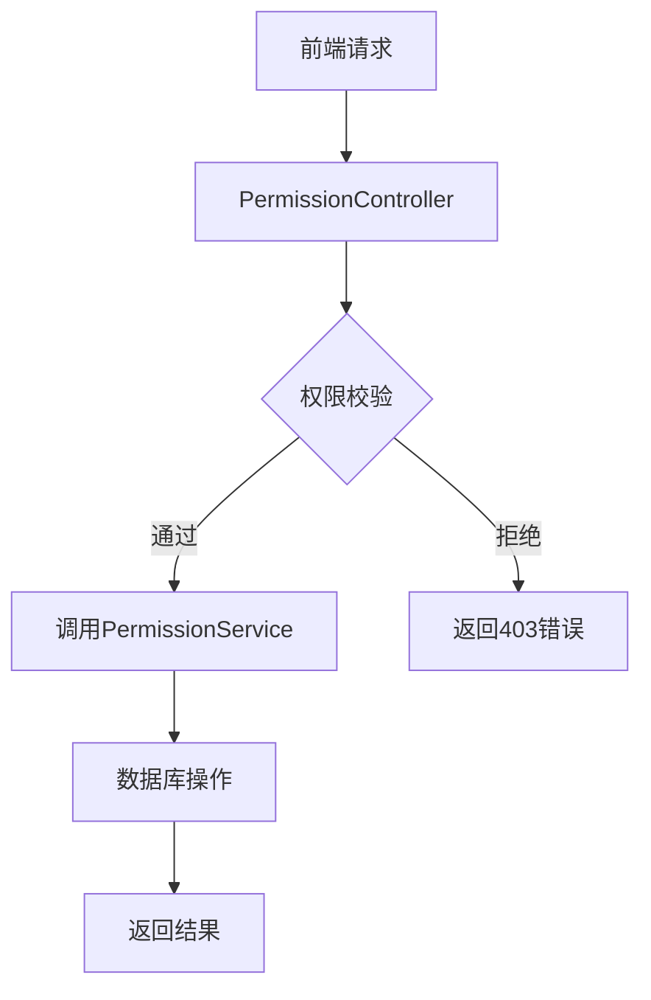
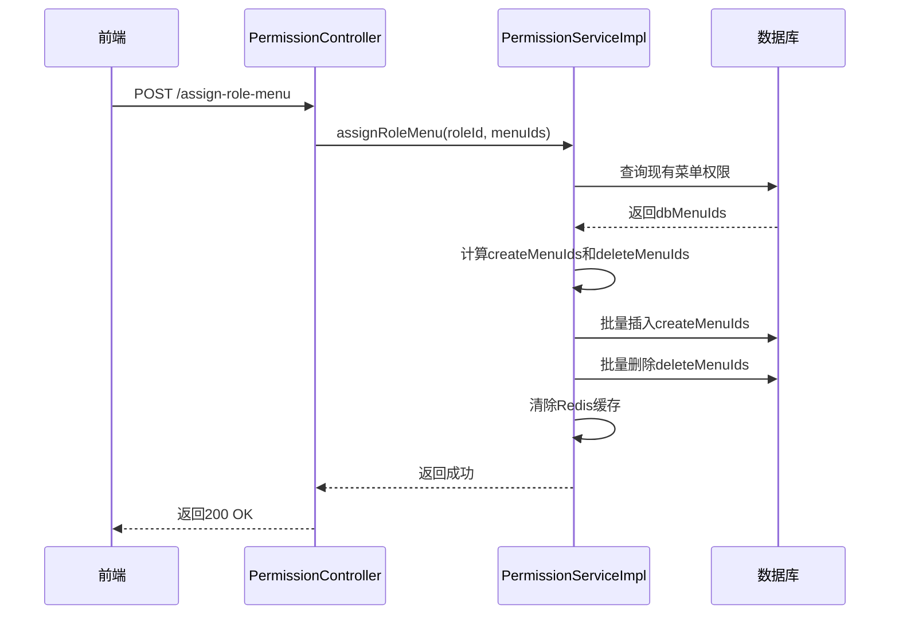
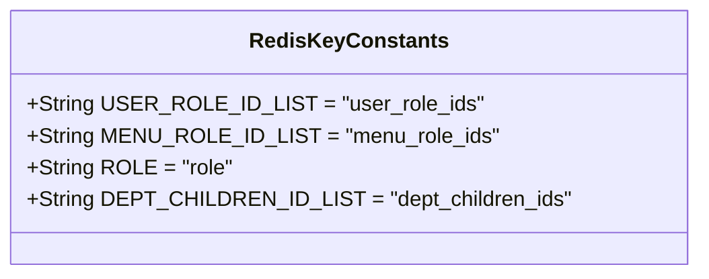

# 角色权限

<cite>
**本文档引用文件**   
- [PermissionService.java](file://yudao-module-system/yudao-module-system-biz/src/main/java/cn/iocoder/yudao/module/system/service/permission/PermissionService.java)
- [PermissionServiceImpl.java](file://yudao-module-system/yudao-module-system-biz/src/main/java/cn/iocoder/yudao/module/system/service/permission/PermissionServiceImpl.java)
- [RoleService.java](file://yudao-module-system/yudao-module-system-biz/src/main/java/cn/iocoder/yudao/module/system/service/permission/RoleService.java)
- [MenuService.java](file://yudao-module-system/yudao-module-system-biz/src/main/java/cn/iocoder/yudao/module/system/service/permission/MenuService.java)
- [RoleDO.java](file://yudao-module-system/yudao-module-system-biz/src/main/java/cn/iocoder/yudao/module/system/dal/dataobject/permission/RoleDO.java)
- [MenuDO.java](file://yudao-module-system/yudao-module-system-biz/src/main/java/cn/iocoder/yudao/module/system/dal/dataobject/permission/MenuDO.java)
- [UserRoleDO.java](file://yudao-module-system/yudao-module-system-biz/src/main/java/cn/iocoder/yudao/module/system/dal/dataobject/permission/UserRoleDO.java)
- [RoleMenuDO.java](file://yudao-module-system/yudao-module-system-biz/src/main/java/cn/iocoder/yudao/module/system/dal/dataobject/permission/RoleMenuDO.java)
- [PermissionController.java](file://yudao-module-system/yudao-module-system-biz/src/main/java/cn/iocoder/yudao/module/system/controller/admin/permission/PermissionController.java)
- [RedisKeyConstants.java](file://yudao-module-system/yudao-module-system-biz/src/main/java/cn/iocoder/yudao/module/system/dal/redis/RedisKeyConstants.java)
</cite>

## 目录
1. [引言](#引言)
2. [RBAC模型核心组件](#rbac模型核心组件)
3. [角色权限数据模型](#角色权限数据模型)
4. [角色权限分配业务流程](#角色权限分配业务流程)
5. [权限缓存机制与性能优化](#权限缓存机制与性能优化)
6. [实际业务场景应用示例](#实际业务场景应用示例)
7. [结论](#结论)

## 引言
本文档详细阐述了基于RBAC（基于角色的访问控制）模型的角色权限管理机制。系统通过角色、用户、菜单和权限标识的关联关系，实现了灵活的权限控制。文档将深入解析角色与菜单、权限标识的关联关系，描述角色权限分配的完整业务流程，提供角色创建、权限分配和权限继承的具体实现方法，并说明权限缓存机制和性能优化策略。同时，文档包含角色权限的数据模型和数据库表结构说明，以及在实际业务场景中的应用示例。

## RBAC模型核心组件

### 角色服务 (RoleService)
`RoleService` 接口定义了角色管理的核心功能，包括角色的创建、更新、删除和状态管理。它还提供了获取角色列表、分页查询以及校验角色有效性的方法。该服务是角色生命周期管理的中心，确保了角色数据的完整性和一致性。

**Section sources**
- [RoleService.java](file://yudao-module-system/yudao-module-system-biz/src/main/java/cn/iocoder/yudao/module/system/service/permission/RoleService.java#L17-L137)

### 权限服务 (PermissionService)
`PermissionService` 接口是权限管理的核心，负责处理用户-角色、角色-菜单以及角色-部门之间的关联授权。它提供了判断用户是否拥有特定权限或角色的方法，以及设置角色菜单、处理用户和角色删除时的关联数据清理等功能。该服务是权限校验和分配的中枢。

**Section sources**
- [PermissionService.java](file://yudao-module-system/yudao-module-system-biz/src/main/java/cn/iocoder/yudao/module/system/service/permission/PermissionService.java#L19-L197)

### 菜单服务 (MenuService)
`MenuService` 接口管理系统的菜单结构，支持菜单的创建、更新和删除。它能够获取所有菜单列表，并根据权限标识从缓存中快速查询对应的菜单编号。该服务将前端的菜单展示与后端的权限控制紧密联系起来。

**Section sources**
- [MenuService.java](file://yudao-module-system/yudao-module-system-biz/src/main/java/cn/iocoder/yudao/module/system/service/permission/MenuService.java#L14-L78)

### 权限控制器 (PermissionController)
`PermissionController` 提供了管理后台的API接口，用于赋予用户角色、赋予角色菜单和数据权限。它通过`@PreAuthorize`注解进行前置权限校验，确保只有拥有相应权限的管理员才能执行这些敏感操作。控制器将前端请求与后端服务进行桥接。



**Diagram sources**
- [PermissionController.java](file://yudao-module-system/yudao-module-system-biz/src/main/java/cn/iocoder/yudao/module/system/controller/admin/permission/PermissionController.java#L27-L77)

## 角色权限数据模型

### 角色权限关系图
系统采用标准的RBAC模型，通过三张核心数据表来管理权限：`system_user_role`（用户-角色关联）、`system_role_menu`（角色-菜单关联）和`system_role`（角色定义）。用户通过角色间接获得菜单和数据权限。

```mermaid
erDiagram
USER {
uuid id PK
string username
string nickname
timestamp create_time
}
ROLE {
uuid id PK
string name
string code
integer status
integer data_scope
set<long> data_scope_dept_ids
}
MENU {
uuid id PK
string name
string permission
integer type
long parent_id
}
USER ||--o{ USER_ROLE : "拥有"
ROLE ||--o{ USER_ROLE : "被分配"
ROLE ||--o{ ROLE_MENU : "拥有"
MENU ||--o{ ROLE_MENU : "被分配"
```

**Diagram sources**
- [RoleDO.java](file://yudao-module-system/yudao-module-system-biz/src/main/java/cn/iocoder/yudao/module/system/dal/dataobject/permission/RoleDO.java#L26-L78)
- [MenuDO.java](file://yudao-module-system/yudao-module-system-biz/src/main/java/cn/iocoder/yudao/module/system/dal/dataobject/permission/MenuDO.java#L21-L107)
- [UserRoleDO.java](file://yudao-module-system/yudao-module-system-biz/src/main/java/cn/iocoder/yudao/module/system/dal/dataobject/permission/UserRoleDO.java#L19-L40)
- [RoleMenuDO.java](file://yudao-module-system/yudao-module-system-biz/src/main/java/cn/iocoder/yudao/module/system/dal/dataobject/permission/RoleMenuDO.java#L19-L35)

### 核心数据对象

#### 角色数据对象 (RoleDO)
`RoleDO` 类定义了角色的核心属性，包括角色ID、名称、标识码、排序、状态和类型。特别地，`dataScope` 字段定义了角色的数据范围，而 `dataScopeDeptIds` 字段则存储了自定义数据范围所关联的部门ID集合。

**Section sources**
- [RoleDO.java](file://yudao-module-system/yudao-module-system-biz/src/main/java/cn/iocoder/yudao/module/system/dal/dataobject/permission/RoleDO.java#L26-L78)

#### 菜单数据对象 (MenuDO)
`MenuDO` 类定义了菜单的结构，包含菜单ID、名称、权限标识、类型、排序、父菜单ID、路由地址、组件路径等。其中，`permission` 字段是权限校验的关键，通常采用`系统:模块:操作`的格式。

**Section sources**
- [MenuDO.java](file://yudao-module-system/yudao-module-system-biz/src/main/java/cn/iocoder/yudao/module/system/dal/dataobject/permission/MenuDO.java#L21-L107)

#### 用户-角色关联对象 (UserRoleDO)
`UserRoleDO` 类是用户和角色之间的多对多关联表，记录了用户ID和角色ID的对应关系。此外，`defaultFlag` 字段用于标识该角色是否为用户的默认角色。

**Section sources**
- [UserRoleDO.java](file://yudao-module-system/yudao-module-system-biz/src/main/java/cn/iocoder/yudao/module/system/dal/dataobject/permission/UserRoleDO.java#L19-L40)

## 角色权限分配业务流程

### 角色创建流程
角色创建由 `RoleService.createRole` 方法处理。管理员在管理后台填写角色信息（如名称、标识码、类型等）后，系统会验证信息的合法性，然后将角色数据持久化到数据库中。

### 权限分配流程
权限分配主要通过 `PermissionService.assignRoleMenu` 方法实现。当管理员为角色分配菜单权限时，系统会计算出需要新增和删除的菜单ID集合，然后批量执行数据库的插入和删除操作，并清除相关的缓存。



**Diagram sources**
- [PermissionServiceImpl.java](file://yudao-module-system/yudao-module-system-biz/src/main/java/cn/iocoder/yudao/module/system/service/permission/PermissionServiceImpl.java#L142-L165)
- [PermissionController.java](file://yudao-module-system/yudao-module-system-biz/src/main/java/cn/iocoder/yudao/module/system/controller/admin/permission/PermissionController.java#L41-L50)

### 权限继承与校验流程
权限校验通过 `PermissionService.hasAnyPermissions` 方法完成。当用户访问一个需要权限的API时，系统会首先获取该用户所有启用的角色，然后检查这些角色是否拥有请求所需的权限。如果用户是超级管理员，则自动拥有所有权限。

**Section sources**
- [PermissionServiceImpl.java](file://yudao-module-system/yudao-module-system-biz/src/main/java/cn/iocoder/yudao/module/system/service/permission/PermissionServiceImpl.java#L71-L93)

## 权限缓存机制与性能优化

### 缓存策略
系统广泛使用Redis缓存来提升权限校验的性能。`RedisKeyConstants` 类定义了多个缓存键，如 `USER_ROLE_ID_LIST` 用于缓存用户的角色ID列表，`MENU_ROLE_ID_LIST` 用于缓存拥有特定菜单的角色ID列表。通过 `@Cacheable` 和 `@CacheEvict` 注解，实现了缓存的自动读取和失效。



**Diagram sources**
- [RedisKeyConstants.java](file://yudao-module-system/yudao-module-system-biz/src/main/java/cn/iocoder/yudao/module/system/dal/redis/RedisKeyConstants.java#L10-L119)

### 性能优化措施
1. **批量操作**：在分配权限时，使用 `insertBatch` 和 `deleteListByRoleIdAndMenuIds` 等批量方法，减少数据库交互次数。
2. **惰性加载**：对于部门数据权限的计算，使用Guava的 `Suppliers.memoize` 实现惰性求值，避免重复的数据库查询。
3. **缓存预热**：关键数据如角色和菜单信息在系统启动时可进行缓存预热，减少首次访问的延迟。

**Section sources**
- [PermissionServiceImpl.java](file://yudao-module-system/yudao-module-system-biz/src/main/java/cn/iocoder/yudao/module/system/service/permission/PermissionServiceImpl.java#L335-L336)

## 实际业务场景应用示例

### 场景：部门数据权限控制
当一个用户登录系统时，`getDeptDataPermission` 方法会根据该用户的所有角色计算其数据权限。例如，如果用户的角色数据范围为“仅本人”，则只能查看自己的数据；如果为“本部门及子部门”，则可以查看整个部门树的数据。这个结果会被用于后续的数据查询过滤。

### 场景：字段级权限控制
系统还支持字段级的权限控制。通过 `getNoPermissionFields` 方法，可以获取用户无权访问的字段列表。这在数据展示时非常有用，例如，可以动态隐藏用户无权查看的敏感字段。

**Section sources**
- [PermissionServiceImpl.java](file://yudao-module-system/yudao-module-system-biz/src/main/java/cn/iocoder/yudao/module/system/service/permission/PermissionServiceImpl.java#L322-L377)
- [PermissionServiceImpl.java](file://yudao-module-system/yudao-module-system-biz/src/main/java/cn/iocoder/yudao/module/system/service/permission/PermissionServiceImpl.java#L379-L394)

## 结论
本文档详细阐述了基于RBAC模型的角色权限管理机制。系统通过清晰的角色、用户、菜单和权限标识的关联关系，实现了灵活且安全的权限控制。通过`PermissionService`等核心服务，系统提供了完整的角色创建、权限分配和校验流程。利用Redis缓存和批量操作等技术，系统在保证安全性的同时，也实现了高性能的权限校验。该权限管理机制为系统的安全稳定运行提供了坚实的基础。