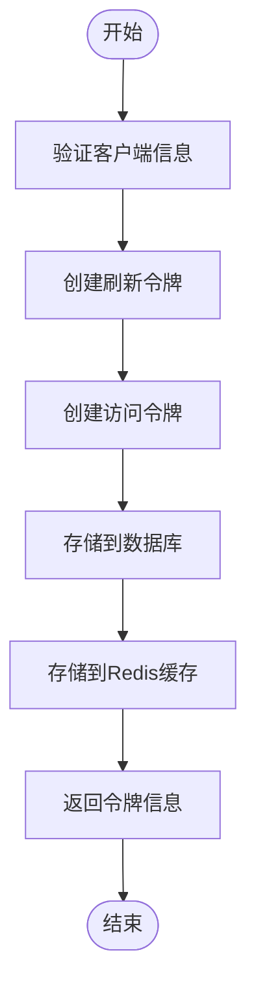
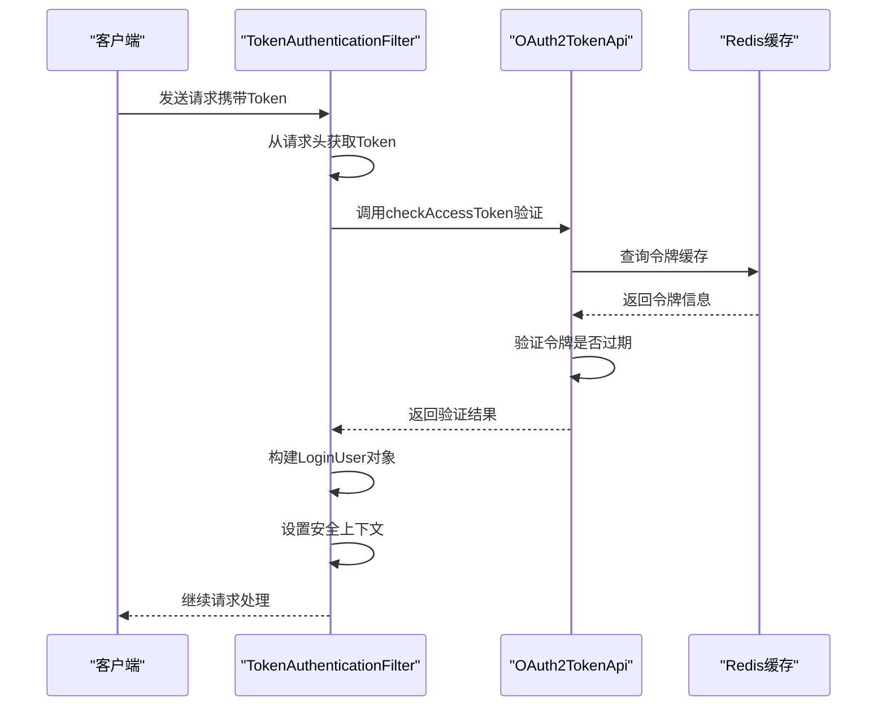
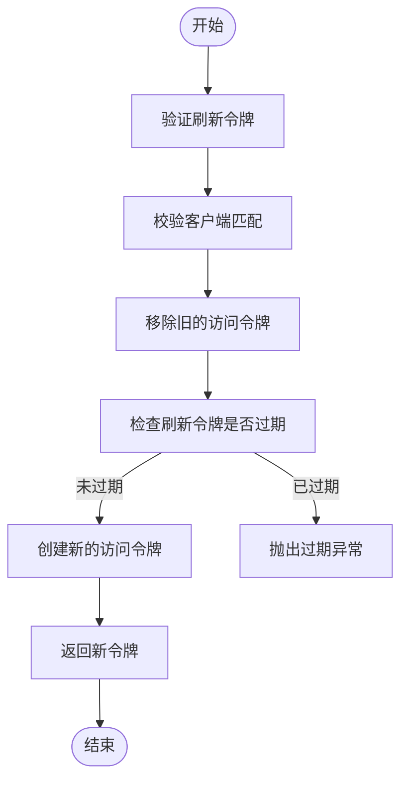
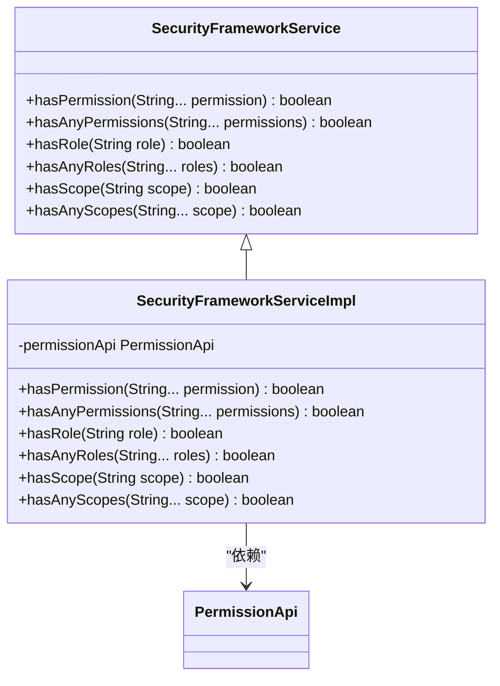
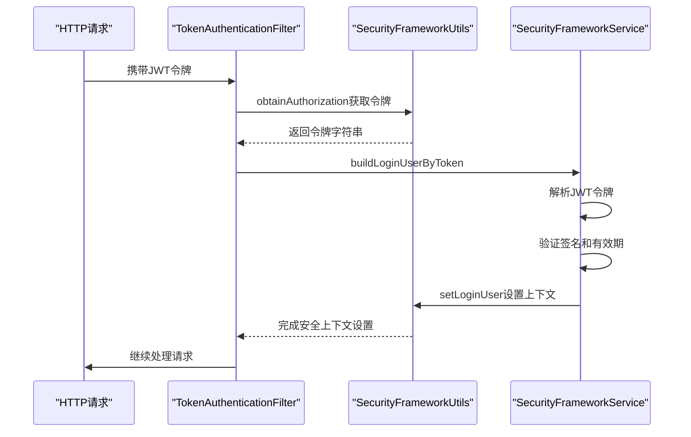
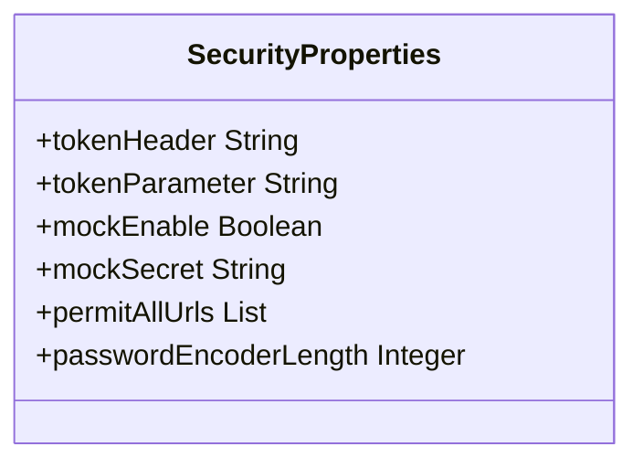
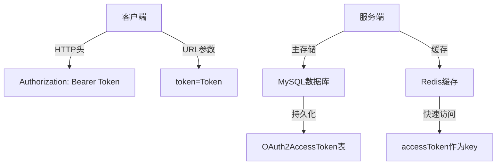
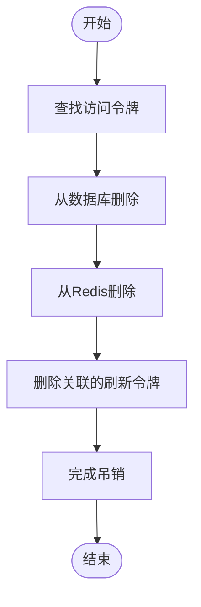
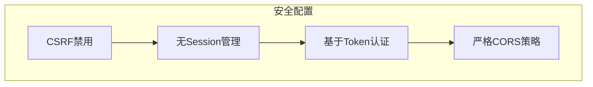
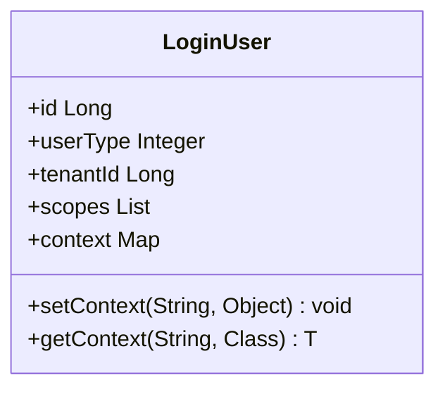

# JWT认证

<cite>
**本文档引用的文件**   
- [SecurityFrameworkService.java](file://yudao-framework/yudao-spring-boot-starter-security/src/main/java/cn/iocoder/yudao/framework/security/core/service/SecurityFrameworkService.java)
- [SecurityFrameworkServiceImpl.java](file://yudao-framework/yudao-spring-boot-starter-security/src/main/java/cn/iocoder/yudao/framework/security/core/service/SecurityFrameworkServiceImpl.java)
- [SecurityProperties.java](file://yudao-framework/yudao-spring-boot-starter-security/src/main/java/cn/iocoder/yudao/framework/security/config/SecurityProperties.java)
- [TokenAuthenticationFilter.java](file://yudao-framework/yudao-spring-boot-starter-security/src/main/java/cn/iocoder/yudao/framework/security/core/filter/TokenAuthenticationFilter.java)
- [OAuth2TokenServiceImpl.java](file://yudao-module-system/yudao-module-system-biz/src/main/java/cn/iocoder/yudao/module/system/service/oauth2/OAuth2TokenServiceImpl.java)
- [OAuth2AccessTokenDO.java](file://yudao-module-system/yudao-module-system-biz/src/main/java/cn/iocoder/yudao/module/system/dal/dataobject/oauth2/OAuth2AccessTokenDO.java)
- [OAuth2RefreshTokenDO.java](file://yudao-module-system/yudao-module-system-biz/src/main/java/cn/iocoder/yudao/module/system/dal/dataobject/oauth2/OAuth2RefreshTokenDO.java)
- [SecurityFrameworkUtils.java](file://yudao-framework/yudao-spring-boot-starter-security/src/main/java/cn/iocoder/yudao/framework/security/core/util/SecurityFrameworkUtils.java)
- [LoginUser.java](file://yudao-framework/yudao-spring-boot-starter-security/src/main/java/cn/iocoder/yudao/framework/security/core/LoginUser.java)
- [YudaoWebSecurityConfigurerAdapter.java](file://yudao-framework/yudao-spring-boot-starter-security/src/main/java/cn/iocoder/yudao/framework/security/config/YudaoWebSecurityConfigurerAdapter.java)
</cite>

## 目录
1. [简介](#简介)
2. [JWT结构与声明](#jwt结构与声明)
3. [令牌生成与验证机制](#令牌生成与验证机制)
4. [SecurityFrameworkService集成](#securityframeworkservice集成)
5. [密钥管理与过期配置](#密钥管理与过期配置)
6. [令牌存储最佳实践](#令牌存储最佳实践)
7. [安全防护措施](#安全防护措施)
8. [自定义Claims与扩展功能](#自定义claims与扩展功能)
9. [结论](#结论)

## 简介
本文档详细描述了系统中JWT认证的实现机制，重点介绍JWT令牌的生成、验证和刷新流程。文档涵盖了JWT的结构组成、声明类型、在项目中的具体实现方式，以及SecurityFrameworkService如何集成JWT认证流程。同时提供了密钥管理、过期时间配置、令牌存储的最佳实践，以及防止重放攻击、令牌吊销等安全防护措施。

## JWT结构与声明

### JWT基本结构
JWT（JSON Web Token）由三部分组成，通过点号（.）分隔：
- **Header（头部）**：包含令牌类型和签名算法
- **Payload（负载）**：包含声明信息
- **Signature（签名）**：用于验证令牌的完整性

### 标准声明类型
系统中使用的JWT包含以下标准声明：
- **iss (Issuer)**：令牌签发者
- **exp (Expiration Time)**：令牌过期时间
- **sub (Subject)**：令牌主题，通常为用户标识
- **iat (Issued At)**：令牌签发时间
- **nbf (Not Before)**：令牌生效时间

### 自定义声明
系统在JWT中还包含以下自定义声明：
- **userId**：用户编号
- **userType**：用户类型
- **tenantId**：租户编号
- **scopes**：授权范围

**Section sources**
- [LoginUser.java](file://yudao-framework/yudao-spring-boot-starter-security/src/main/java/cn/iocoder/yudao/framework/security/core/LoginUser.java#L20-L37)

## 令牌生成与验证机制

### 令牌生成流程
系统通过OAuth2TokenServiceImpl实现JWT令牌的生成，具体流程如下：

**Diagram sources**
- [OAuth2TokenServiceImpl.java](file://yudao-module-system/yudao-module-system-biz/src/main/java/cn/iocoder/yudao/module/system/service/oauth2/OAuth2TokenServiceImpl.java#L55-L61)
- [OAuth2AccessTokenDO.java](file://yudao-module-system/yudao-module-system-biz/src/main/java/cn/iocoder/yudao/module/system/dal/dataobject/oauth2/OAuth2AccessTokenDO.java#L28-L70)

### 令牌验证流程
令牌验证通过TokenAuthenticationFilter实现，验证流程如下：

**Diagram sources**
- [TokenAuthenticationFilter.java](file://yudao-framework/yudao-spring-boot-starter-security/src/main/java/cn/iocoder/yudao/framework/security/core/filter/TokenAuthenticationFilter.java#L44-L65)
- [OAuth2TokenServiceImpl.java](file://yudao-module-system/yudao-module-system-biz/src/main/java/cn/iocoder/yudao/module/system/service/oauth2/OAuth2TokenServiceImpl.java#L111-L121)

### 令牌刷新机制
当访问令牌过期时，系统支持通过刷新令牌获取新的访问令牌：

**Diagram sources**
- [OAuth2TokenServiceImpl.java](file://yudao-module-system/yudao-module-system-biz/src/main/java/cn/iocoder/yudao/module/system/service/oauth2/OAuth2TokenServiceImpl.java#L64-L92)
- [OAuth2RefreshTokenDO.java](file://yudao-module-system/yudao-module-system-biz/src/main/java/cn/iocoder/yudao/module/system/dal/dataobject/oauth2/OAuth2RefreshTokenDO.java#L27-L63)

## SecurityFrameworkService集成

### 安全框架服务接口
SecurityFrameworkService定义了权限校验的核心接口：

**Diagram sources**
- [SecurityFrameworkService.java](file://yudao-framework/yudao-spring-boot-starter-security/src/main/java/cn/iocoder/yudao/framework/security/core/service/SecurityFrameworkService.java#L8-L59)
- [SecurityFrameworkServiceImpl.java](file://yudao-framework/yudao-spring-boot-starter-security/src/main/java/cn/iocoder/yudao/framework/security/core/service/SecurityFrameworkServiceImpl.java#L19-L57)

### JWT集成流程
SecurityFrameworkService与JWT认证的集成流程如下：

**Diagram sources**
- [TokenAuthenticationFilter.java](file://yudao-framework/yudao-spring-boot-starter-security/src/main/java/cn/iocoder/yudao/framework/security/core/filter/TokenAuthenticationFilter.java#L44-L65)
- [SecurityFrameworkUtils.java](file://yudao-framework/yudao-spring-boot-starter-security/src/main/java/cn/iocoder/yudao/framework/security/core/util/SecurityFrameworkUtils.java#L39-L52)

## 密钥管理与过期配置

### 安全配置属性
系统通过SecurityProperties管理JWT相关配置：

**Diagram sources**
- [SecurityProperties.java](file://yudao-framework/yudao-spring-boot-starter-security/src/main/java/cn/iocoder/yudao/framework/security/config/SecurityProperties.java#L15-L51)

### 配置项说明
| 配置项 | 默认值 | 说明 |
|-------|-------|------|
| tokenHeader | Authorization | JWT令牌在HTTP头中的名称 |
| tokenParameter | token | JWT令牌在URL参数中的名称 |
| passwordEncoderLength | 4 | 密码编码器复杂度 |
| permitAllUrls | [] | 免登录的URL列表 |
| mockEnable | false | Mock模式开关 |
| mockSecret | test | Mock模式密钥 |

**Section sources**
- [SecurityProperties.java](file://yudao-framework/yudao-spring-boot-starter-security/src/main/java/cn/iocoder/yudao/framework/security/config/SecurityProperties.java#L15-L51)

## 令牌存储最佳实践

### 存储位置
系统采用多级存储策略来管理JWT令牌：

**Diagram sources**
- [OAuth2TokenServiceImpl.java](file://yudao-module-system/yudao-module-system-biz/src/main/java/cn/iocoder/yudao/module/system/service/oauth2/OAuth2TokenServiceImpl.java#L96-L108)
- [SecurityProperties.java](file://yudao-framework/yudao-spring-boot-starter-security/src/main/java/cn/iocoder/yudao/framework/security/config/SecurityProperties.java#L21-L28)

### 存储策略
1. **客户端存储**：通过HTTP头或URL参数传递
2. **服务端缓存**：使用Redis存储访问令牌，提高验证效率
3. **持久化存储**：在MySQL中存储完整的令牌信息，包括过期时间、用户信息等
4. **双重删除**：注销时同时删除Redis缓存和数据库记录

## 安全防护措施

### 防止重放攻击
系统通过以下机制防止重放攻击：
- **短期有效性**：设置合理的令牌过期时间
- **一次性使用**：刷新令牌使用后立即失效
- **时间戳验证**：验证令牌的签发时间和有效期

### 令牌吊销机制
系统实现了完整的令牌吊销流程：

**Diagram sources**
- [OAuth2TokenServiceImpl.java](file://yudao-module-system/yudao-module-system-biz/src/main/java/cn/iocoder/yudao/module/system/service/oauth2/OAuth2TokenServiceImpl.java#L124-L134)

### CSRF防护
系统通过以下方式防护CSRF攻击：
- **无状态设计**：基于JWT的无状态认证，不依赖Session
- **Token验证**：每个请求都必须携带有效的JWT令牌
- **CORS配置**：严格配置跨域资源共享策略

**Diagram sources**
- [YudaoWebSecurityConfigurerAdapter.java](file://yudao-framework/yudao-spring-boot-starter-security/src/main/java/cn/iocoder/yudao/framework/security/config/YudaoWebSecurityConfigurerAdapter.java#L105-L108)

## 自定义Claims与扩展功能

### LoginUser对象结构
系统通过LoginUser类扩展JWT的Claims：

**Diagram sources**
- [LoginUser.java](file://yudao-framework/yudao-spring-boot-starter-security/src/main/java/cn/iocoder/yudao/framework/security/core/LoginUser.java#L18-L59)

### 扩展方法
开发者可以通过以下方式扩展JWT功能：
1. **添加自定义Claims**：在LoginUser的context中添加自定义数据
2. **扩展权限验证**：实现SecurityFrameworkService接口的自定义方法
3. **修改令牌策略**：调整SecurityProperties中的配置参数
4. **集成其他认证方式**：通过TokenAuthenticationFilter扩展认证逻辑

## 结论
本文档详细介绍了系统中JWT认证的实现机制，包括令牌的生成、验证、刷新流程，以及与SecurityFrameworkService的集成方式。系统采用了Redis+MySQL的双重存储策略，确保了令牌验证的高效性和数据的持久性。通过合理的配置和安全防护措施，系统能够有效防止重放攻击、CSRF攻击等安全威胁。开发者可以根据业务需求，通过LoginUser对象和SecurityFrameworkService接口扩展JWT的功能。