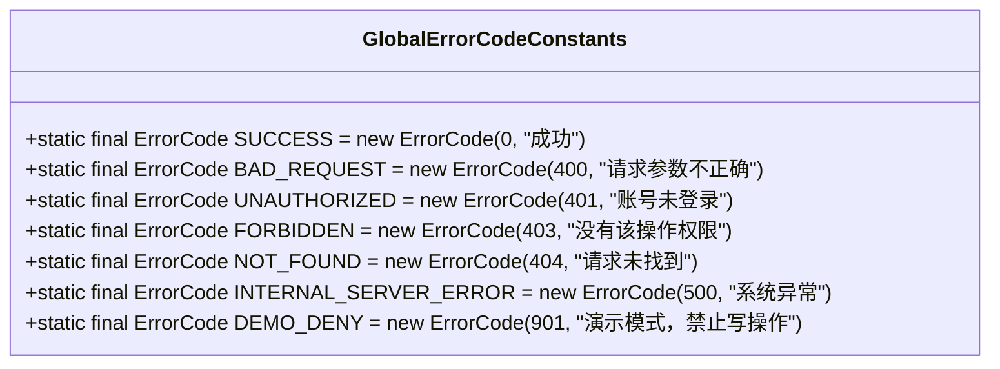
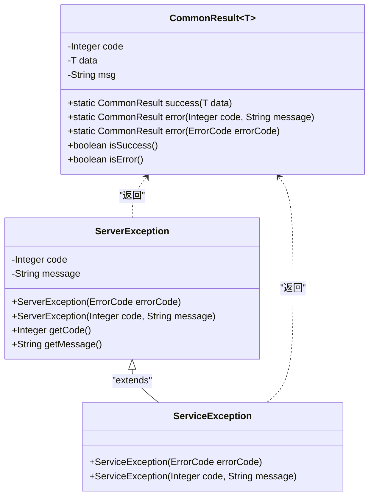
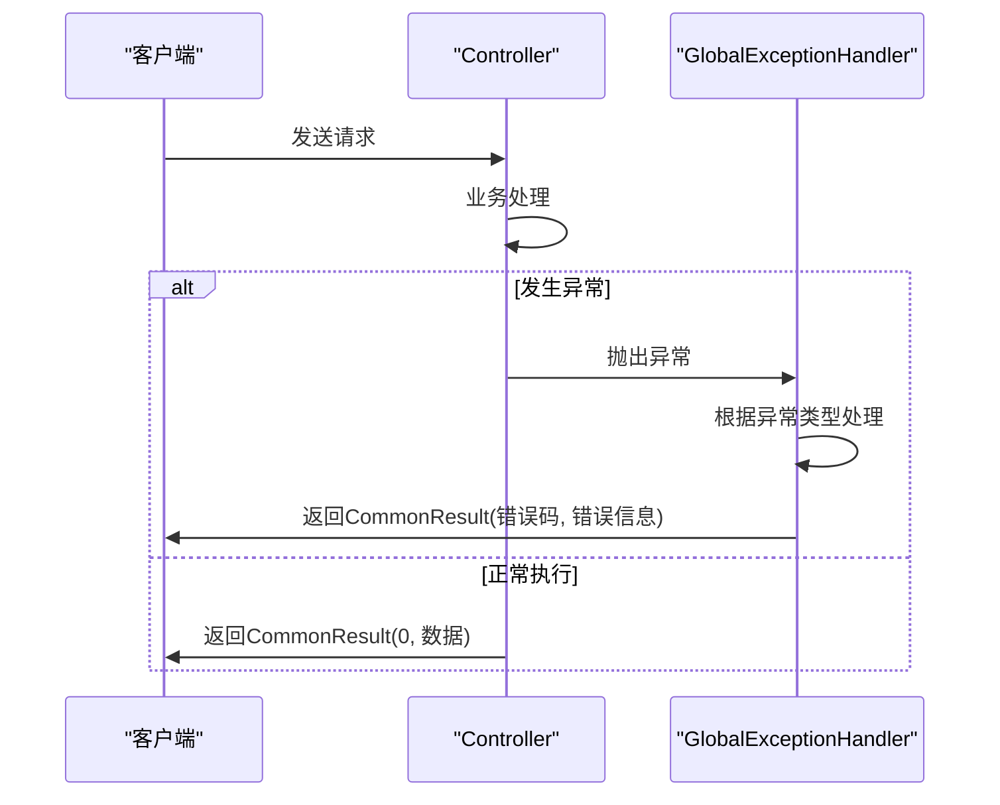
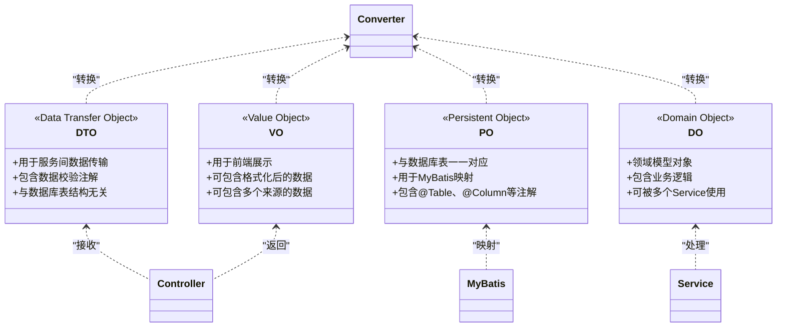
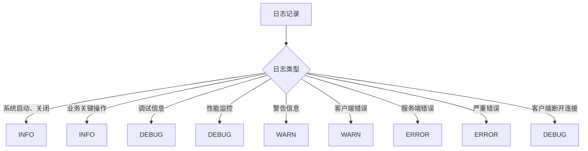
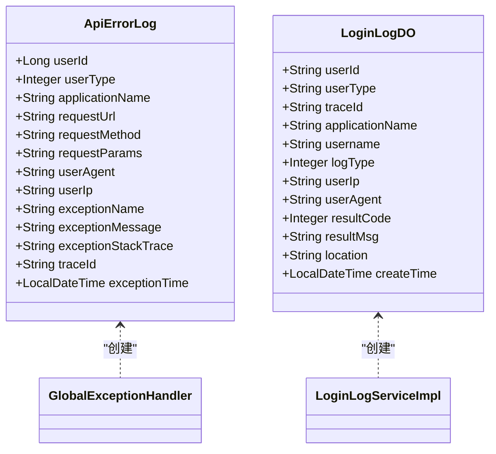
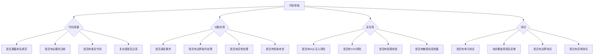

# 开发规范

<cite>
**本文档引用的文件**
- [pom.xml](file://pom.xml)
- [lombok.config](file://lombok.config)
- [GlobalErrorCodeConstants.java](file://yudao-framework/yudao-common/src/main/java/cn/iocoder/yudao/framework/common/exception/enums/GlobalErrorCodeConstants.java)
- [ServerException.java](file://yudao-framework/yudao-common/src/main/java/cn/iocoder/yudao/framework/common/exception/ServerException.java)
- [CommonResult.java](file://yudao-framework/yudao-common/src/main/java/cn/iocoder/yudao/framework/common/pojo/CommonResult.java)
- [GlobalExceptionHandler.java](file://yudao-framework/yudao-spring-boot-starter-web/src/main/java/cn/iocoder/yudao/framework/web/core/handler/GlobalExceptionHandler.java)
- [WebProperties.java](file://yudao-framework/yudao-spring-boot-starter-web/src/main/java/cn/iocoder/yudao/framework/web/config/WebProperties.java)
- [LoginLogServiceImpl.java](file://yudao-module-system/yudao-module-system-biz/src/main/java/cn/iocoder/yudao/module/system/service/logger/LoginLogServiceImpl.java)
- [ErrorCodeConstants.java](file://eplus-module-scm/eplus-module-scm-api/src/main/java/com/syj/eplus/module/scm/enums/ErrorCodeConstants.java)
- [VenderConvert.java](file://eplus-module-scm/eplus-module-scm-biz/src/main/java/com/syj/eplus/module/scm/convert/VenderConvert.java)
</cite>

## 目录
1. [简介](#简介)
2. [代码风格指南](#代码风格指南)
3. [异常处理规范](#异常处理规范)
4. [数据对象规范](#数据对象规范)
5. [日志记录规范](#日志记录规范)
6. [API设计规范](#api设计规范)
7. [代码审查与提交规范](#代码审查与提交规范)

## 简介
本文档旨在为团队建立统一的开发标准和最佳实践，涵盖代码风格、异常处理、数据对象使用、日志记录和API设计等方面，以确保代码质量和系统一致性。

## 代码风格指南

### 命名约定
项目遵循Java标准命名规范：
- **类名**：采用大驼峰命名法（PascalCase），如`UserService`、`OrderController`
- **方法名**：采用小驼峰命名法（camelCase），如`getUserById`、`createOrder`
- **变量名**：采用小驼峰命名法，如`userName`、`orderList`
- **常量名**：全部大写，单词间用下划线分隔，如`MAX_RETRY_COUNT`、`DEFAULT_TIMEOUT`
- **包名**：全部小写，使用公司域名倒序，如`com.syj.eplus.module.scm`

### 代码格式化规则
项目使用Lombok简化代码，配置文件`lombok.config`中定义了以下规则：
- `config.stopBubbling = true`：配置不向上层目录冒泡
- `lombok.tostring.callsuper=CALL`：toString方法包含父类属性
- `lombok.equalsandhashcode.callsuper=CALL`：equals和hashCode方法包含父类属性
- `lombok.accessors.chain=true`：启用链式调用

代码格式化应遵循以下原则：
- 使用4个空格进行缩进，禁止使用Tab
- 每行代码不超过120个字符
- 大括号遵循K&R风格，即左大括号不换行
- import语句按标准顺序排列：java.*、javax.*、第三方库、本项目包

### 注释规范
- **类注释**：每个类必须有Javadoc注释，说明类的职责和主要功能
- **方法注释**：公共方法必须有Javadoc注释，包含@param、@return、@throws等标签
- **行内注释**：复杂逻辑处应添加行内注释，解释代码意图而非描述代码行为
- **TODO注释**：使用`// TODO:`标记待完成事项，并说明原因和预期完成时间

**Section sources**
- [lombok.config](file://lombok.config#L1-L5)
- [pom.xml](file://pom.xml#L50-L64)

## 异常处理规范

### 错误码定义
项目采用分层的错误码体系，错误码为整数类型，遵循以下结构：
- **0**：成功
- **4xx**：客户端错误
- **5xx**：服务端错误
- **9xx**：自定义业务错误

全局错误码定义在`GlobalErrorCodeConstants`接口中：



**Diagram sources**
- [GlobalErrorCodeConstants.java](file://yudao-framework/yudao-common/src/main/java/cn/iocoder/yudao/framework/common/exception/enums/GlobalErrorCodeConstants.java#L17-L39)

### 异常层次结构
项目定义了统一的异常处理体系，核心组件包括：



**Diagram sources**
- [ServerException.java](file://yudao-framework/yudao-common/src/main/java/cn/iocoder/yudao/framework/common/exception/ServerException.java#L12-L60)
- [CommonResult.java](file://yudao-framework/yudao-common/src/main/java/cn/iocoder/yudao/framework/common/pojo/CommonResult.java#L18-L96)

### 统一异常处理模式
通过`@RestControllerAdvice`实现全局异常处理，`GlobalExceptionHandler`类处理各类异常并返回标准化的`CommonResult`：



**Diagram sources**
- [GlobalExceptionHandler.java](file://yudao-framework/yudao-spring-boot-starter-web/src/main/java/cn/iocoder/yudao/framework/web/core/handler/GlobalExceptionHandler.java#L47-L362)

**Section sources**
- [GlobalErrorCodeConstants.java](file://yudao-framework/yudao-common/src/main/java/cn/iocoder/yudao/framework/common/exception/enums/GlobalErrorCodeConstants.java#L1-L42)
- [ServerException.java](file://yudao-framework/yudao-common/src/main/java/cn/iocoder/yudao/framework/common/exception/ServerException.java#L1-L61)
- [CommonResult.java](file://yudao-framework/yudao-common/src/main/java/cn/iocoder/yudao/framework/common/pojo/CommonResult.java#L1-L96)
- [GlobalExceptionHandler.java](file://yudao-framework/yudao-spring-boot-starter-web/src/main/java/cn/iocoder/yudao/framework/web/core/handler/GlobalExceptionHandler.java#L1-L363)

## 数据对象规范

### DTO、VO、PO等数据对象使用规范
项目采用分层的数据对象模式，各层对象职责明确：



**Diagram sources**
- [VenderConvert.java](file://eplus-module-scm/eplus-module-scm-biz/src/main/java/com/syj/eplus/module/scm/convert/VenderConvert.java#L34-L96)

### 转换规则
数据对象之间的转换通过MapStruct或BeanUtils实现，遵循以下规则：
- **DTO到DO**：在Controller层进行，进行参数校验
- **DO到VO**：在Service层进行，组装业务数据
- **PO到DO**：在Mapper层进行，数据持久化
- **DO到PO**：在Mapper层进行，数据持久化

转换器命名规范：`{源对象名}Convert`，如`VenderConvert`、`PurchaseContractConvert`。

**Section sources**
- [VenderConvert.java](file://eplus-module-scm/eplus-module-scm-biz/src/main/java/com/syj/eplus/module/scm/convert/VenderConvert.java#L34-L96)

## 日志记录规范

### 日志级别选择
根据日志的重要性和用途，选择合适的日志级别：



### 关键信息记录
日志应包含足够的上下文信息，便于问题排查：



**Diagram sources**
- [GlobalExceptionHandler.java](file://yudao-framework/yudao-spring-boot-starter-web/src/main/java/cn/iocoder/yudao/framework/web/core/handler/GlobalExceptionHandler.java#L274-L315)
- [LoginLogServiceImpl.java](file://yudao-module-system/yudao-module-system-biz/src/main/java/cn/iocoder/yudao/module/system/service/logger/LoginLogServiceImpl.java#L31-L32)

**Section sources**
- [GlobalExceptionHandler.java](file://yudao-framework/yudao-spring-boot-starter-web/src/main/java/cn/iocoder/yudao/framework/web/core/handler/GlobalExceptionHandler.java#L1-L363)
- [LoginLogServiceImpl.java](file://yudao-module-system/yudao-module-system-biz/src/main/java/cn/iocoder/yudao/module/system/service/logger/LoginLogServiceImpl.java#L1-L35)

## API设计规范

### 接口一致性
API设计遵循RESTful原则，确保接口的一致性和易用性：

```mermaid
classDiagram
class WebProperties {
class Api {
+String prefix
+String controller
}
class Ui {
+String url
}
}
class AuthPermissionInfoRespVO {
+List<MenuVO> menus
+List<RoleVO> roles
+UserVO user
}
class MenuVO {
+Long id
+String name
+String path
+String component
+Integer sort
+String icon
+Boolean hidden
}
class RoleVO {
+String code
+Integer dataScope
+Set<Long> dataScopeDeptIds
+Long id
}
class UserVO {
+Long id
+String nickname
+String avatar
+Long deptId
}
WebProperties <.. YudaoWebAutoConfiguration : "配置"
AuthPermissionInfoRespVO <.. AuthController : "返回"
MenuVO <.. AuthPermissionInfoRespVO : "包含"
RoleVO <.. AuthPermissionInfoRespVO : "包含"
UserVO <.. AuthPermissionInfoRespVO : "包含"
```

**Diagram sources**
- [WebProperties.java](file://yudao-framework/yudao-spring-boot-starter-web/src/main/java/cn/iocoder/yudao/framework/web/config/WebProperties.java#L27-L66)
- [AuthPermissionInfoRespVO.java](file://yudao-module-system/yudao-module-system-biz/src/main/java/cn/iocoder/yudao/module/system/controller/admin/auth/vo/AuthPermissionInfoRespVO.java#L28-L64)

### 最佳实践
- **统一前缀**：所有API接口使用`/api`前缀，避免与Swagger、Actuator等管理接口冲突
- **版本控制**：在URL路径中包含版本号，如`/api/v1/users`
- **HTTP方法**：正确使用HTTP方法，GET用于查询，POST用于创建，PUT用于更新，DELETE用于删除
- **状态码**：使用标准HTTP状态码，配合自定义错误码提供详细错误信息
- **分页参数**：统一使用`page`和`size`参数进行分页，返回结果包含`total`总数
- **响应格式**：所有响应都包装在`CommonResult`中，包含code、data、msg三个字段

**Section sources**
- [WebProperties.java](file://yudao-framework/yudao-spring-boot-starter-web/src/main/java/cn/iocoder/yudao/framework/web/config/WebProperties.java#L27-L66)

## 代码审查与提交规范

### 代码审查清单
代码审查应重点关注以下方面：



### 提交信息规范
Git提交信息应遵循以下格式：
```
<类型>(<模块>): <简短描述>

<详细描述>

<关联任务ID>
```

提交类型包括：
- **feat**：新增功能
- **fix**：修复bug
- **docs**：文档更新
- **style**：代码格式调整
- **refactor**：代码重构
- **test**：测试相关
- **chore**：构建过程或辅助工具的变动

示例：
```
feat(scm): 实现供应商管理功能

- 新增供应商CRUD接口
- 实现供应商联系人管理
- 添加供应商审核流程

TASK-1234
```

**Section sources**
- [pom.xml](file://pom.xml#L1-L171)
- [ErrorCodeConstants.java](file://eplus-module-scm/eplus-module-scm-api/src/main/java/com/syj/eplus/module/scm/enums/ErrorCodeConstants.java#L1-L215)